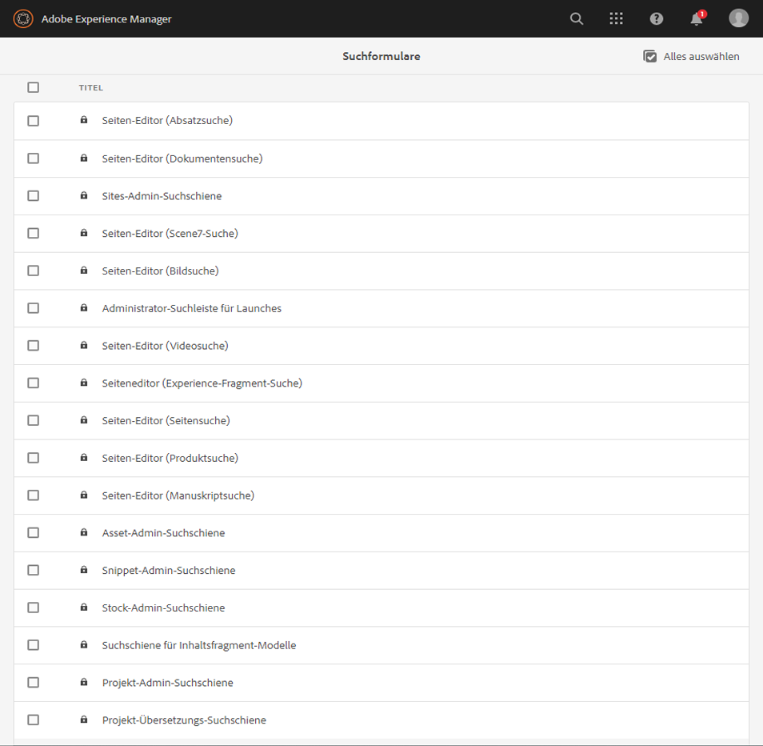

# Konfigurieren von Suchformularen {#configuring-search-forms}

Adobe Experience Manager als Cloud-Dienst verfügt über einen leistungsstarken [Suchmechanismus](/help/sites-cloud/authoring/getting-started/search.md) .

In Kombination mit diesem stehen Ihnen auch eine Reihe vordefinierter Optionen zum Filtern Ihres Inhalts zur Verfügung. Diese enthalten vordefinierte Facetten wie &quot; **Änderungsdatum**&quot;, &quot; **Veröffentlichungsstatus**&quot;oder &quot; **Livecopy-Status** &quot;, mit denen Sie schnell zu den benötigten Ressourcen navigieren können.

Mit diesen beiden Zielen können Sie Ihren Inhalt schnell und einfach finden aus:

* [Suchen und Filtern](/help/sites-cloud/authoring/getting-started/search.md#search-and-filter)
* [Schienenauswahl](/help/sites-cloud/authoring/getting-started/basic-handling.md#rail-selector)
* den [Assets-Browser](/help/sites-cloud/authoring/fundamentals/environment-tools.md#assets-browser) (beim Bearbeiten von Seiten)

>[!NOTE]
>
>Sie können den zugrunde liegenden [Content Search- und Indexing](/help/operations/indexing.md) -Dienst konfigurieren.

Mit **Suchformularen** können Sie diese Bedienfelder entsprechend Ihren spezifischen Anforderungen anpassen und erweitern.

Die **Suchformulare** bieten eine vordefinierte Auswahl an [Vorhersagen](#predicates-and-their-settings) , die Sie kombinieren und definieren können. Die [Dialogfelder für die Konfiguration dieser Formulare](#configuring-your-search-forms) finden Sie unter:

* **Tools**

   * **Allgemein**

      * **Suchformulare**

## Standardformulare {#default-forms}

When you first access the **Search Forms** console you can see that all the configurations have a padlock symbol. Dies bedeutet, dass die entsprechende Konfiguration die Standardkonfiguration (standardmäßig) ist - und nicht gelöscht werden kann. Nachdem Sie eine Konfiguration angepasst und gespeichert haben, verschwindet die Sperre. Es wird wieder angezeigt, wenn Sie Ihre benutzerdefinierte Konfigurationlöschen. In diesem Fall werden die Standardeinstellung (und die Padlock-Anzeige) erneut installiert.

Die Standardkonfigurationen (alphabetisch aufgeführt) sind verfügbar:

* **Asset-Admin-Suchschiene:**

* **Seiten-Editor (Dokumentensuche):**

* **Seiteneditor (Experience-Fragment-Suche):**

* **Seiten-Editor (Bildsuche):**

* **Seiten-Editor (Manuskriptsuche):**

* **Seiten-Editor (Seitensuche):**

* **Seiten-Editor (Absatzsuche):**

* **Seiten-Editor (Produktsuche):**

* **Seiten-Editor (Scene7-Suche)**:

* **Seiten-Editor (Videosuche)**:

* **Projekt-Admin-Suchschiene:**

* **Projekt-Übersetzungs-Suchschiene:**

* **Sites-Admin-Suchschiene**:

* **Snippet-Admin-Suchschiene**:

* **Stock-Admin-Suchschiene**:

>[!NOTE]
>
> Weitere Informationen zu Asset-bezogenen Suchformularen finden Sie unter [Assets - Suchfacetten](/help/assets/search-facets.md)

## Prädikate und ihre Einstellungen {#predicates-and-their-settings}

### Eigenschaften {#predicates}

Die folgenden Prädikate stehen je nach Konfiguration zur Verfügung:

<table>
 <tbody>
  <tr>
   <th>Eigenschaft</th>
   <th>Zweck</th>
   <th>Einstellungen</th>
  </tr>
  <tr>
   <td>Analytics</td>
   <td>Such-/Filterfunktionen im Sites-Browser, wenn Analytics-basierte Daten angezeigt werden. Analysen-Suchfilter werden geladen, um die zugeordneten angepassten Analysespalten abzugleichen.</td>
   <td>
    <ul>
     <li>Feldbezeichnung</li>
     <li>Beschreibung</li>
    </ul> </td>
  </tr>
  <tr>
   <td>Genehmigungsstatus</td>
   <td>Suche nach dem Genehmigungsstatus.</td>
   <td>
    <ul>
     <li>Feldbezeichnung</li>
     <li>Eigenschaftsname*</li>
     <li>Beschreibung</li>
    </ul> 
   </td>
  </tr>
  <tr>
   <td>Autor</td>
   <td>Suche nach Autor.</td>
   <td>
    <ul>
     <li>Platzhalter</li>
     <li>Eigenschaftsname*</li>
     <li>Beschreibung</li>
    </ul> 
   </td>
  </tr>
  <tr>
   <td>Ausgecheckt von</td>
   <td>Suchen Sie nach Assets, die von einem bestimmten Benutzer ausgecheckt wurden.</td>
   <td>
    <ul>
     <li>Feldbezeichnung</li>
     <li>Platzhalter</li>
     <li>Beschreibung</li>
    </ul> 
   </td>
  </tr>
  <tr>
   <td>Checkout-Status</td>
   <td>Suchen Sie nach Assets mit einem bestimmten Checkout-Status.</td>
   <td>
    <ul>
     <li>Feldbezeichnung</li>
     <li>Eigenschaftsname*</li>
     <li>Beschreibung</li>
    </ul> 
   </td>
  </tr>
  <tr>
   <td>Komponenten</td>
   <td>Ermöglicht es einem Autor, nach Seiten zu suchen/zu filtern, die eine bestimmte Komponente enthalten. Beispiel: eine Bildergalerie.  </td>
   <td>
    <ul>
     <li>Platzhalter</li>
     <li>Eigenschaftsname*</li>
     <li>Eigenschaftstiefe</li>
     <li>Beschreibung</li>
    </ul> </td>
  </tr>
  <tr>
   <td>Datum Bereich</td>
   <td>Suchen Sie nach Ressourcen, die innerhalb eines angegebenen Bereichs für eine Datumseigenschaft erstellt wurden. Im Suchbereich können Sie das Start- und das Enddatum angeben.</td>
   <td>
    <ul>
     <li>Feldbezeichnung</li>
     <li>Platzhalter</li>
     <li>Eigenschaftsname*</li>
     <li>Textbereich (von)*</li>
     <li>Textbereich (bis)*</li>
     <li>Beschreibung</li>
    </ul> </td>
  </tr>
  <tr>
   <td>Gültigkeitsstatus</td>
   <td>Suchen Sie Ressourcen basierend auf dem Ablaufstatus.</td>
   <td>
    <ul>
     <li>Feldbezeichnung</li>
     <li>Eigenschaftsname*</li>
     <li>Beschreibung</li>
    </ul> </td>
  </tr>
  <tr>
   <td>Dateigröße</td>
   <td>Filtern Sie Ressourcen nach ihrer Größe.</td>
   <td>
    <ul>
     <li>Feldbezeichnung</li>
     <li>Eigenschaftsname*</li>
     <li>Optionspfad</li>
     <li>Beschreibung</li>
    </ul> </td>
  </tr>
  <tr>
   <td>Dateityp</td>
   <td>Suchen Sie Assets nach dem Datei-/Mime-Typ.</td>
   <td>
    <ul>
     <li>Feldbezeichnung</li> 
     <li>Eigenschaftsname*</li>
     <li>Mimetype-Pfad</li>
     <li>Beschreibung</li>
    </ul> 
   </td>
  </tr>
  <tr>
   <td>Volltext</td>
   <td>Sucheigenschaft für Volltextsuchen. Er wird dem Operator "jcr:contains"zugeordnet.</td>
   <td>
    <ul>
     <li>Platzhalter</li>
     <li>Eigenschaftsname</li>
     <li>Beschreibung</li>
    </ul> </td>
  </tr>
  <tr>
   <td>Gruppe</td>
   <td>Suchvorhersage für Gruppe (nur in der Insight-Eigenschaft verwendet).</td>
   <td>
    <ul>
     <li>Feldbezeichnung</li>
     <li>Beschreibung</li>
    </ul> </td>
  </tr>
  <tr>
   <td>Ausgeblendeter Filter</td>
   <td>Ein Filter für Eigenschaft und Wert, der für den Benutzer nicht sichtbar ist.</td>
   <td>
    <ul>
     <li>Eigenschaftsname*</li>
     <li>Eigenschaftswert*</li>
     <li>Beschreibung</li>
    </ul> </td>
  </tr>
  <tr>
   <td>Einblicke</td>
   <td>Suchen nach einer Auswahl von Insight-Parametern.</td>
   <td>Dies ist eine komplexe Vorhersage, die sich aus mehreren Vorhersagen zusammensetzt:
    <ul>
     <li>Gruppe</li>
     <li>Bereich</li>
     <li>Optionen</li>
    </ul> 
   </td>
  </tr>
  <tr>
   <td>Mitglied der Sammlung</td>
   <td>Nach Assets suchen, die Mitglieder einer Sammlung sind</td>
   <td>
    <ul>
     <li>Beschreibung</li>
    </ul> 
   </td>
  </tr>
  <tr>
   <td>Mehrwert-Eigenschaft</td>
   <td>Suchen Sie nach mehreren Werten einer angegebenen Eigenschaft.</td>
   <td>
    <ul>
     <li>Feldbezeichnung</li>
     <li>Platzhalter</li>
     <li>Eigenschaftsname*</li>
     <li>Trennzeichen-Unterstützung</li>
     <li>Eingabe-Trennzeichen</li>
     <li>Groß-/Kleinschreibung ignorieren</li>
     <li>Beschreibung</li>
    </ul> 
   </td>
  </tr>
  <tr>
   <td>Optionen</td>
   <td>
Die Optionen sind vom Benutzer erstellte Inhaltsknoten.
 
See <a href="#addinganoptionspredicate">Adding an Options Predicate</a> for more information.
 </td>
   <td>
    <ul>
     <li>Feldbezeichnung</li>
     <li>Eigenschaftsname*</li>
     <li>Einzelauswahl</li>
     <li>Optionen hinzufügen</li>
     <li>Manuell</li>
     <li>Beschreibung</li>
    </ul> </td>
  </tr>
  <tr>
   <td>Options-Eigenschaft</td>
   <td>Suchen Sie nach einer oder mehreren Eigenschaften der Option.</td>
   <td>
    <ul>
     <li>Feldbezeichnung</li>
     <li>Eigenschaftsname*</li>
     <li>Optionsknotenpfad</li>
     <li>Eigenschaftstiefe</li>
     <li>Einzelauswahl</li>
     <li>Beschreibung</li>
    </ul> </td>
  </tr>
  <tr>
   <td>Seite Status</td>
   <td>Filtern Sie Seiten nach ihrem Status.</td>
   <td>
    <ul>
     <li>Feldbezeichnung</li>
     <li>Veröffentlichungs-Eigenschaftsname*</li>
     <li>Gesperrte Seiten-Eigenschaftsname*</li>
     <li>Beschreibung</li>
    </ul> </td>
  </tr>
  <tr>
   <td>Pfad</td>
   <td>Filtern Sie nach einem bestimmten Pfad. Sie können mehrere Pfade als Optionen angeben.</td>
   <td>
    <ul>
     <li>Feldbezeichnung</li>
     <li>Suchpfade hinzufügen</li>
     <li>Beschreibung</li>
    </ul> </td>
  </tr>
  <tr>
   <td>Pfad Browser</td>
   <td>Stellen Sie einen Pfadbrowser bereit, der unter einem vordefinierten Stammpfad sucht.</td>
   <td>
    <ul>
     <li>Platzhalter</li>
     <li>Stammverzeichnis</li>
     <li>Beschreibung</li>
    </ul> 
   </td>
  </tr>
  <tr>
   <td>Pfad Ausgeblendet</td>
   <td>Ein Filter auf dem Pfad, der für den Benutzer nicht sichtbar ist.</td>
   <td>
    <ul>
     <li>Eigenschaftsname ("path")</li>
     <li>Eigenschaftswert ("/content/dam")</li>
    </ul> 
   </td>
  </tr>
  <tr>
   <td>Eigenschaft</td>
   <td>Suchen Sie nach einer angegebenen Eigenschaft.</td>
   <td>
    <ul>
     <li>Feldbezeichnung</li>
     <li>Platzhalter</li>
     <li>Eigenschaftsname</li>
     <li>Teilsuche</li>
     <li>Groß-/Kleinschreibung ignorieren</li>
     <li>Beschreibung</li>
    </ul> 
   </td>
  </tr>
  <tr>
   <td>Veröffentlichungsstatus</td>
   <td>Filtern Sie Ressourcen nach ihrem Veröffentlichungsstatus.</td>
   <td>
    <ul>
     <li>Feldbezeichnung</li>
     <li>Eigenschaftsname*</li>
     <li>Beschreibung</li>
    </ul> </td>
  </tr>
  <tr>
   <td>Bereich</td>
   <td>Suchen Sie Ressourcen, die innerhalb eines bestimmten Bereichs liegen. Im Suchbereich können Sie den Mindest- und den Höchstwert für den Bereich angeben.</td>
   <td>
    <ul>
     <li>Feldbezeichnung</li>
     <li>Eigenschaftsname*</li>
     <li>Beschreibung</li>
    </ul> </td>
  </tr>
  <tr>
   <td>Bewertung</td>
   <td>Suchen Sie nach Ressourcen gemäß ihrer durchschnittlichen Bewertung.  </td>
   <td>
    <ul>
     <li>Feldbezeichnung</li>
     <li>Eigenschaftsname*</li>
     <li>Optionspfad</li>
     <li>Beschreibung</li>
    </ul> </td>
  </tr>
  <tr>
   <td>Relatives Datum</td>
   <td>Filtern Sie Ressourcen nach dem relativen Erstellungsdatum. Zum Beispiel vor einer Woche, vor einem Monat.</td>
   <td>
    <ul>
     <li>Feldbezeichnung</li>
     <li>Eigenschaftsname*</li>
     <li>Relatives Datum</li>
     <li>Beschreibung</li>
    </ul> </td>
  </tr>
  <tr>
   <td>Reglerbereich</td>
   <td>Eine allgemeine Suche sagt voraus, dass die Erweiterung des Bereichs mit der Schiebereglerfunktion vorhergesagt wird. Der Wert der gesuchten Eigenschaft muss zwischen den Grenzen des Reglers liegen.</td>
   <td>
    <ul>
     <li>Feldbezeichnung</li>
     <li>Eigenschaftsname*</li>
     <li>Optionsknotenpfad</li>
     <li>Beschreibung</li>
    </ul> </td>
  </tr>
  <tr>
   <td>Status</td>
   <td>Suchen Sie nach dem Status der Genehmigung und des Kassengangs.</td>
   <td>Dies ist eine komplexe Vorhersage, die sich aus mehreren Vorhersagen zusammensetzt:
    <ul>
     <li>Genehmigungsstatus</li>
     <li>Checkout-Status</li>
    </ul> 
   </td>
  </tr>
  <tr>
   <td>Tags</td>
   <td>Suche anhand von Tags.</td>
   <td>
    <ul>
     <li>Feldlader</li>
     <li>Platzhalter</li>
     <li>Eigenschaftsname*</li>
     <li>Option „Übereinstimmung mit allen Tags“ anzeigen</li>
     <li>Stamm-Tags-Pfad</li>
     <li>Beschreibung</li>
    </ul> </td>
  </tr>
  <tr>
   <td>Vorlagen</td>
   <td>Suche nach der ausgewählten Vorlage.</td>
   <td>
    <ul>
     <li>Platzhalter</li>
     <li>Eigenschaftsname*</li>
     <li>Beschreibung</li>
    </ul> 
   </td>
  </tr>
  <tr>
   <td>Übersetzungsstatus</td>
   <td>Suche nach dem Übersetzungsstatus.</td>
   <td>
    <ul>
     <li>Feldbezeichnung</li>
    </ul> 
   </td>
  </tr>
 </tbody>
</table>

<!--
  <tr>
   <td>Date ???</td>
   <td>Slider-based search of assets based on a date property.</td>
   <td>
    <ul>
     <li>Field Label</li>
     <li>Property Name*</li>
     <li>Description</li>
    </ul> </td>
  </tr>
  <tr>
   <td>Asset Last Modified ?????</td>
   <td>Date the asset was last modified.  </td>
   <td>A customized predicate, based on the Date Predicate.</td>
  </tr>
  <tr>
   <td>Range Options ???</td>
   <td>A specific search predicate for Assets and the same as common Slider Predicate. Is still available due to backward compatibilty issues.</td>
   <td>
    <ul>
     <li>Field Label</li>
     <li>Property Name*</li>
     <li>Option Path</li>
     <li>Description</li>
    </ul> </td>
  </tr>
  <tr>
   <td>Tag </td>
   <td>Search assets based on tags. You can configure the Path property to populate various tags in the Tags list.</td>
   <td>
    <ul>
     <li>Field Label</li>
     <li>Property Name*</li>
     <li>Option Path</li>
     <li>Description</li>
    </ul> </td>
  </tr>
-->

>[!NOTE]
>
>* Die allgemeinen Suchvorausschätzungen werden wie folgt definiert:
   >  `/libs/cq/gui/components/common/admin/customsearch/searchpredicates`
>
>
This information is for reference only, you must not make changes to `/libs`.

<!--
>* Search predicates related only to siteadmin (classic UI) are located under:
> `/libs/cq/gui/components/siteadmin/admin/searchpanel/searchpredicates`
>   * These are deprecated and only available for backward compatibility.
>
-->

### Prädikateinstellungen {#predicate-settings}

Abhängig von der Vorhersage steht eine Auswahl von Einstellungen zur Konfiguration zur Verfügung, darunter:

* **Feldbezeichnung**

   Die Beschriftung, die als reduzierbare Kopfzeile oder als Feldbeschriftung der Vorhersage angezeigt wird.

* **Beschreibung**

   Beschreibende Details für den Benutzer.

* **Platzhalter**

   Leerer Text oder Platzhalter für die Vorhersage, falls kein Filtertext eingegeben wird.

* **Eigenschaftsname**

   Die Eigenschaft, nach der gesucht werden soll. It uses a relative path and the wildcards `*/*/*` specify the depth of the property relative to the `jcr:content` node (each asterisk represents one node level).

   If you want to search only on a first level child node of the resource that has the `x` property on the `jcr:content` node use `*/jcr:content/x`

* **Eigenschaftstiefe**

   Die maximale Tiefe, mit der nach dieser Eigenschaft in den Ressourcen gesucht wird. So können Sie eine Suche nach dieser Eigenschaft auf einer Ressource und rekursiven untergeordneten Elementen durchführen, bis die Ebene der untergeordneten Elemente der festgelegten Tiefe entspricht.

* **Eigenschaftswert**

   The property value as an absolute string or as an expression language; for example, `cq:Page` or

   `${empty requestPathInfo.suffix ? "/content" : requestPathInfo.suffix}`.

* **Bereichstext**

   The label of the range field in the **Date Range** predicate.

* **Optionspfad**

   Der Benutzer kann den Pfad mithilfe des Pfadbrowsers auf der Registerkarte &quot;Voreinstellung&quot;auswählen. Nach dem Auswählen können Sie mit dem Plussymbol (**+**) die Auswahl zur Liste der gültigen Optionen hinzufügen. (Entfernen lässt sich die Auswahl mit dem Minussymbol (**-**), falls erforderlich.)

   Die Optionen sind vom Benutzer erstellte Inhaltsknoten mit der folgenden Struktur:

   `(jcr:primaryType = nt:unstructured, value (String), jcr:title (String))`

* **Optionsknotenpfad** Praktisch dasselbe wie der **Optionspfad**, mit dem Unterschied, dass dieser Pfad sich im gemeinsamen Prädikatsfeld befindet, während der andere Pfad nur für Assets gilt.

* **Einzelauswahl** Wenn diese Option aktiviert ist, werden die Optionen als Kontrollkästchen gerendert, die nur eine Einzelauswahl zulassen. Wenn die Option versehentlich ausgewählt wurde, kann sie per Kontrollkästchen deaktiviert werden.

* **Veröffentlichungs- und Live Copy-Eigenschaftsname(n)** Die Bezeichnungen für die Veröffentlichungs- und Live Copy-Kontrollkästchen für das Sites-spezifische Prädikat.

* The &amp;ast; on the field labels in the **Settings** tab means the fields are mandatory and if left blank an error message will appear.

## Konfigurieren Ihrer Suchformulare {#configuring-your-search-forms}

### Erstellen/Öffnen einer benutzerdefinierten Konfiguration {#creating-opening-a-customized-configuration}

1. Navigate to **Tools**, **General**, **Search Forms**.

1. Wählen Sie die Konfiguration aus, die Sie anpassen möchten.
1. Über das Symbol **Bearbeiten** können Sie die Konfiguration für die Aktualisierung öffnen.
1. Bei einer neuen Anpassung möchten Sie vermutlich [neue Prädikatfelder hinzufügen und die Einstellungen wie erforderlich festlegen](#add-edit-a-predicate-field-and-define-field-settings). Bei einer vorhandenen Anpassung können Sie ein vorhandenes Feld auswählen und [die Einstellungen aktualisieren](#add-edit-a-predicate-field-and-define-field-settings).
1. Wählen Sie **Fertig** aus, um die Konfiguration zu speichern. Ihre Änderungen werden beim nächsten Einsatz der Konfiguration angezeigt.

   >[!NOTE]
   >
   >Die angepassten Konfigurationen werden (wie jeweils angemessen) unter folgendem Pfad gespeichert:
   >
   >* `/apps/cq/gui/content/facets/<option>`
   >* `/apps/commerce/gui/content/facets/<option>`

### Hinzufügen/Bearbeiten eines Prädikatfelds und Definieren der Feldeinstellungen {#add-edit-a-predicate-field-and-define-field-settings}

Sie können Felder hinzufügen oder bearbeiten und ihre Einstellungen definieren/aktualisieren:

1. [Öffnen Sie die angepasste Konfiguration](#creating-opening-a-customized-configuration) für die Aktualisierung.
1. Um ein neues Feld hinzuzufügen, öffnen Sie die Registerkarte **Eigenschaft auswählen** und ziehen Sie das benötigte Prädikat an den erforderlichen Ort. Beispiel: das **Datumsbereichsprädikat**:

   

1. Der nächste Schritt hängt davon ab, was Sie tun möchten:

   * Sie fügen ein neues Feld hinzu:

      Nach dem Hinzufügen der Vorhersage wird die Registerkarte **Einstellungen** geöffnet und zeigt die Eigenschaften an, die definiert werden können.

   * Sie möchten eine vorhandene Vorhersage aktualisieren:

      Wählen Sie das Feld &quot;Vorhersage&quot;(rechts) und öffnen Sie dann die Registerkarte &quot; **Einstellungen** &quot;.
   Beispiel: die Einstellungen für das **Datumsbereichprädikat**:

   

1. Nehmen Sie die erforderlichen Änderungen vor und bestätigen Sie sie mit **Fertig**. Ihre Änderungen werden beim nächsten Einsatz der Konfiguration angezeigt.

### Anzeigen einer Vorschau der Suchkonfiguration {#previewing-the-search-configuration}

1. Wählen Sie das Vorschausymbol aus:

   

1. Daraufhin werden die Suchformulare so angezeigt, wie sie in der Suchspalte der jeweiligen Konsole (vollständig eingeblendet) zu sehen sein werden.

   

1. **Schließen** Sie die Vorschau, um zur Konfiguration zurückzukehren und sie fertigzustellen.

### Löschen eines Prädikatfelds {#deleting-a-predicate-field}

1. [Öffnen Sie die angepasste Konfiguration](#creating-opening-a-customized-configuration) für die Aktualisierung.
1. Wählen Sie das Prädikatsfeld (rechts) aus, öffnen Sie die Registerkarte **Einstellungen** und wählen Sie dann das Symbol **Löschen** (unten links) aus.

   

1. In einem Dialogfeld werden Sie dazu aufgefordert, die Löschaktion zu bestätigen.

1. Bestätigen Sie diese und andere Änderungen mit **Fertig**.

### Löschen einer Konfiguration (zur erneuten Aktivierung des Standards) {#deleting-a-configuration-to-reinstate-the-default}

Wenn Sie eine Konfiguration angepasst haben, werden die Standardwerte überschrieben. Sie können die Standardkonfiguration erneut aktivieren, indem Sie die angepasste Konfiguration löschen.

>[!NOTE]
>
>Die Standardkonfigurationen können nicht gelöscht werden.

Das Löschen einer angepassten Konfiguration erfolgt über die Konsole:

1. Wählen Sie die benötigte Konfiguration (z. B. **Seiten-Editor (Absatzsuche)**) und anschließend das Symbol **Löschen** in der Symbolleiste aus:

   

1. Die angepasste Konfiguration wird gelöscht und die Standardkonfiguration wird erneut aktiviert. (Sie erkennen dies am Vorhängeschlosssymbol, die wieder in der Konsole angezeigt wird.)

### Hinzufügen von Optionsprädikaten {#adding-options-predicates}

Mit Optionsprädikaten (Optionen, Optionseigenschaft) können Sie ein Element konfigurieren, nach dem gesucht werden soll. Sie werden normalerweise genutzt, um etwas direkt unter der Seite zu suchen, z. B. eine Eigenschaft auf dem Seitenknoten.

Das folgende Beispiel (Suche entsprechend der Vorlage, mit der eine Seite erstellt wird) verdeutlicht die einzelnen Schritte:

1. Erstellen Sie den Knoten, der die zu suchende Eigenschaft enthält.

   Sie benötigen einen Stammknoten, der die Definitionen der einzelnen Optionen umfasst, die für Benutzer verfügbar sein sollen.

   Die Knoten für die einzelnen Optionen müssen die folgenden Eigenschaften aufweisen:

   * `jcr:title` – die Feldbezeichnung, die in der Suchschiene angezeigt werden soll
   * `value` – der Eigenschaftswert, nach dem gesucht werden soll
   

   >[!NOTE]
   >
   >You ***must*** not change anything in the `/libs` path.
   >
   >This is because the content of `/libs` is overwritten the next time you upgrade your instance (and may well be overwritten when you apply either a hotfix or feature pack).
   >
   >Die empfohlene Methode zur Konfiguration und für andere Änderungen sieht wie folgt aus:
   >
   >1. Recreate the required item, as it exists in `/libs`, under `/apps`. In diesem Fall im folgenden Verzeichnis:
   >1. `/libs/cq/gui/content/common/options/predicates`
   >1. Make any changes within `/apps.`

1. Öffnen Sie die **Suchformulare-Konsole** und wählen Sie die Konfiguration aus, die Sie aktualisieren möchten. Beispiel: **Sites-Admin-Suchschiene**.

   Klicken/tippen Sie anschließend auf das Symbol **Suchformulare bearbeiten**.

1. Fügen Sie je nach Konfiguration **Optionen** oder eine **Optionseigenschaft** zur Konfiguration hinzu.
1. Aktualisieren Sie die Felder, vor allem:

   * **Eigenschaftsname**

      Spezifizieren Sie die Knoteneigenschaft, nach der auf den Zielknoten gesucht werden soll. Beispiel:

      `jcr:content/cq:template`

   * **Optionsknotenpfad**

      Wählen Sie den Pfad, zu dem Ihre Optionen gehalten werden. Beispiel:

      `/apps/cq/gui/content/common/options/predicates/templatetype`
   

1. Wählen Sie **Fertig** aus, um die Konfiguration zu speichern.
1. Navigieren Sie zur entsprechenden Konsole (in diesem Beispiel: **Sites**) und öffnen Sie die **Suchschiene**. Die neu definierten Suchformulare werden zusammen mit den verschiedenen Optionen angezeigt. Wählen Sie die benötigte Option aus, um die Suchergebnisse anzuzeigen.

<!--
   
-->

## Anwenderberechtigungen {#user-permissions}

In der folgenden Tabelle sind die Berechtigungen aufgeführt, die Benutzer benötigen, um Suchformulare zu bearbeiten, zu löschen und Vorschauen anzuzeigen.

<table>
 <tbody>
  <tr>
   <td><strong>Aktion</strong></td>
   <td><strong>Berechtigungen</strong></td>
  </tr>
  <tr>
   <td>Bearbeiten </td>
   <td>Lesen, Schreibberechtigungen für den <code>/apps </code>Knoten.</td>
  </tr>
  <tr>
   <td>Löschen</td>
   <td>Read, Write, Delete permissions on the <code>/apps</code> node</td>
  </tr>
  <tr>
   <td>Vorschau</td>
   <td>Read, Write, Delete permissions on the <code>/var/dam/content</code> node.  Lesen, Schreibberechtigungen für den <code>/apps</code> Knoten.</td>
  </tr>
 </tbody>
</table>
