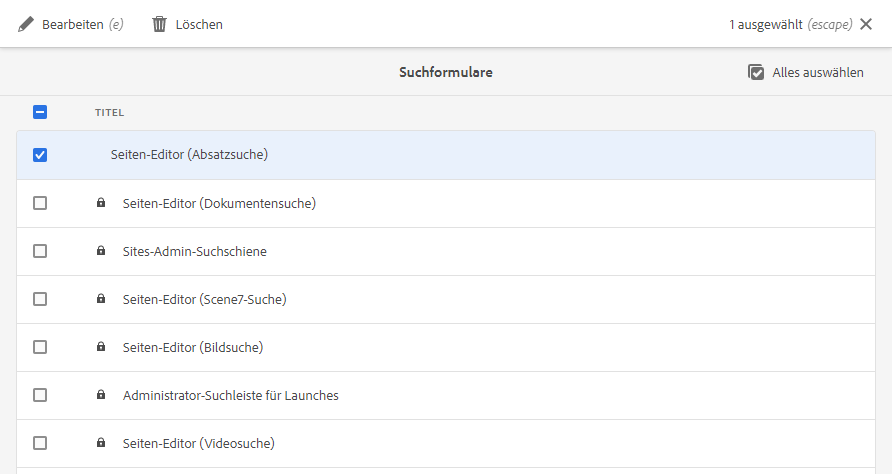

# Konfigurieren von Suchformularen {#configuring-search-forms}

Adobe Experience Manager as a Cloud Service verfügt über einen leistungsstarken [Suchmechanismus](/help/sites-cloud/authoring/search.md).

In Kombination mit diesem steht Ihnen auch eine Reihe vordefinierter Optionen zum Filtern Ihres Inhalts zur Verfügung. Diese enthalten vordefinierte Facetten wie **Änderungsdatum**, **Veröffentlichungsstatus** oder **Live Copy-Status**, mit denen Sie schnell zu den benötigten Ressourcen navigieren können.

Zusammen sollen diese Ihnen helfen, Ihre Inhalte schnell und einfach zu finden:

* [Suchen und Filtern](/help/sites-cloud/authoring/search.md#search-and-filter)
* [Schienenauswahl](/help/sites-cloud/authoring/basic-handling.md#rail-selector)
* [Assets-Browser](/help/sites-cloud/authoring/page-editor/editor-side-panel.md#assets-browser) (beim Bearbeiten von Seiten)

>[!NOTE]
>
>Sie können den zugrunde liegenden Service zur [Inhaltssuche und -indizierung](/help/operations/indexing.md) konfigurieren.

Mit **Suchformularen** können Sie diese Bedienfelder entsprechend Ihren spezifischen Anforderungen anpassen und erweitern.

Die **Suchformulare** bieten eine vordefinierte Auswahl an [Prädikaten](#predicates-and-their-settings), die Sie kombinieren und definieren können. Die [Dialogfelder für die Konfiguration dieser Formulare](#configuring-your-search-forms) finden Sie unter:

* **Tools**
   * **Allgemein**
      * **Suchformulare**

## Standardformulare {#default-forms}

Wenn Sie zum ersten Mal auf die Konsole **Suchformulare** zugreifen, weisen alle Konfigurationen ein Vorhängeschlosssymbol auf. Dieses Symbol bedeutet, dass die entsprechende Konfiguration die Standardkonfiguration (vorkonfiguriert) ist und nicht gelöscht werden kann. Nachdem Sie eine Konfiguration angepasst und gespeichert haben, wird die Sperre ausgeblendet. Sie wird wieder angezeigt, wenn Sie [Ihre benutzerdefinierte Konfiguration löschen](#deleting-a-configuration-to-reinstate-the-default). In diesem Fall werden die Standardeinstellung (und die Sperranzeige) erneut angezeigt.

Die Standardkonfigurationen (alphabetisch aufgelistet) sind verfügbar:

* **Asset-Admin-Suchschiene**
* **Seiten-Editor (Dokumentensuche)**
* **Seiten-Editor (Experience Fragment-Suche)**
* **Seiten-Editor (Bildsuche)**
* **Seiten-Editor (Manuskriptsuche)**
* **Seiten-Editor (Seitensuche)**
* **Seiten-Editor (Absatzsuche)**
* **Seiten-Editor (Produktsuche)**
* **Seiten-Editor (Scene7-Suche)**
* **Seiten-Editor (Videosuche)**
* **Projekt-Admin-Suchschiene**
* **Projekt-Übersetzungs-Suchschiene**
* **Sites-Admin-Suchschiene**
* **Snippet-Admin-Suchschiene**
* **Stock-Admin-Suchschiene**
* **Inhaltsfragmentmodelle-Suchschiene**
* **Projekt-Admin-Suchschiene**
* **Projekt-Übersetzungs-Suchschiene**

>[!NOTE]
>
>Weitere Informationen zu Asset-bezogenen Suchformularen finden Sie unter [Assets – Suchfacetten](/help/assets/search-facets.md).

## Prädikate und ihre Einstellungen {#predicates-and-their-settings}

### Prädikate {#predicates}

Die folgenden Prädikate stehen je nach Konfiguration zur Verfügung:

<table>
 <tbody>
  <tr>
   <th>Prädikat</th>
   <th>Zweck</th>
   <th>Einstellungen</th>
  </tr>
  <tr>
   <td>Analyse</td>
   <td>Such-/Filterfunktionen im Sites-Browser, wenn analysebasierte Daten angezeigt werden. Analyse-Suchfilter werden geladen, um die zugeordneten angepassten Analysespalten abzugleichen.</td>
   <td>
    <ul>
     <li>Feldbezeichnung</li>
     <li>Beschreibung</li>
    </ul> </td>
  </tr>
  <tr>
   <td>Genehmigungsstatus</td>
   <td>Suche nach Genehmigungsstatus.</td>
   <td>
    <ul>
     <li>Feldbezeichnung</li>
     <li>Eigenschaftsname*</li>
     <li>Beschreibung</li>
    </ul> 
   </td>
  </tr>
  <tr>
   <td>Autor</td>
   <td>Suche nach Autor.</td>
   <td>
    <ul>
     <li>Platzhalter</li>
     <li>Eigenschaftsname*</li>
     <li>Beschreibung</li>
    </ul> 
   </td>
  </tr>
  <tr>
   <td>Ausgecheckt von</td>
   <td>Suche nach Assets, die von einem bestimmten Benutzer ausgecheckt wurden.</td>
   <td>
    <ul>
     <li>Feldbezeichnung</li>
     <li>Platzhalter</li>
     <li>Beschreibung</li>
    </ul> 
   </td>
  </tr>
  <tr>
   <td>Checkout-Status</td>
   <td>Suche nach Assets mit einem bestimmten Checkout-Status.</td>
   <td>
    <ul>
     <li>Feldbezeichnung</li>
     <li>Eigenschaftsname*</li>
     <li>Beschreibung</li>
    </ul> 
   </td>
  </tr>
  <tr>
   <td>Komponenten</td>
   <td>Ermöglicht es einem Autor, nach Seiten zu suchen/zu filtern, die eine bestimmte Komponente enthalten. Beispiel: eine Bildergalerie.  </td>
   <td>
    <ul>
     <li>Platzhalter</li>
     <li>Eigenschaftsname*</li>
     <li>Eigenschaftstiefe</li>
     <li>Beschreibung</li>
    </ul> </td>
  </tr>
  <tr>
   <td>Datumsbereich</td>
   <td>Suche nach Ressourcen, die innerhalb eines angegebenen Bereichs für eine Datumseigenschaft erstellt wurden. Im Suchbereich können Sie das Start- und das Enddatum angeben.</td>
   <td>
    <ul>
     <li>Feldbezeichnung</li>
     <li>Platzhalter</li>
     <li>Eigenschaftsname*</li>
     <li>Textbereich (von)*</li>
     <li>Textbereich (bis)*</li>
     <li>Beschreibung</li>
    </ul> </td>
  </tr>
  <tr>
   <td>Gültigkeitsstatus</td>
   <td>Suche nach Ressourcen basierend auf dem Ablaufstatus.</td>
   <td>
    <ul>
     <li>Feldbezeichnung</li>
     <li>Eigenschaftsname*</li>
     <li>Beschreibung</li>
    </ul> </td>
  </tr>
  <tr>
   <td>Dateigröße</td>
   <td>Filtern von Ressourcen nach ihrer Größe.</td>
   <td>
    <ul>
     <li>Feldbezeichnung</li>
     <li>Eigenschaftsname*</li>
     <li>Optionspfad</li>
     <li>Beschreibung</li>
    </ul> </td>
  </tr>
  <tr>
   <td>Dateityp</td>
   <td>Suche nach Assets nach dem Datei-/Mime-Typ.</td>
   <td>
    <ul>
     <li>Feldbezeichnung</li> 
     <li>Eigenschaftsname*</li>
     <li>Mimetype-Pfad</li>
     <li>Beschreibung</li>
    </ul> 
   </td>
  </tr>
  <tr>
   <td>Volltext</td>
   <td>Suchprädikat für Volltextsuchen. Diese wird mit dem Operator „jcr:contains“ verknüpft.</td>
   <td>
    <ul>
     <li>Platzhalter</li>
     <li>Eigenschaftsname</li>
     <li>Beschreibung</li>
    </ul> </td>
  </tr>
  <tr>
   <td>Gruppe</td>
   <td>Suchprädikat für Gruppen (nur im Insights-Prädikat verwendet).</td>
   <td>
    <ul>
     <li>Feldbezeichnung</li>
     <li>Beschreibung</li>
    </ul> </td>
  </tr>
  <tr>
   <td>Ausgeblendeter Filter</td>
   <td>Ein Filter für Eigenschaft und Wert, der für die Benutzenden nicht sichtbar ist.</td>
   <td>
    <ul>
     <li>Eigenschaftsname*</li>
     <li>Eigenschaftswert*</li>
     <li>Beschreibung</li>
    </ul> </td>
  </tr>
  <tr>
   <td>Insights</td>
   <td>Suchen nach einer Auswahl von Insights-Parametern.</td>
   <td>Dies ist ein komplexes Prädikat, das sich aus mehreren Prädikaten zusammensetzt:
    <ul>
     <li>Gruppe</li>
     <li>Bereich</li>
     <li>Optionen</li>
    </ul> 
   </td>
  </tr>
  <tr>
   <td>Mitglied der Sammlung</td>
   <td>Suche nach Assets, die Mitglieder einer Sammlung sind</td>
   <td>
    <ul>
     <li>Beschreibung</li>
    </ul> 
   </td>
  </tr>
  <tr>
   <td>Mehrwertige Eigenschaft</td>
   <td>Suche nach mehreren Werten einer angegebenen Eigenschaft.</td>
   <td>
    <ul>
     <li>Feldbezeichnung</li>
     <li>Platzhalter</li>
     <li>Eigenschaftsname*</li>
     <li>Unterstützung von Trennzeichen</li>
     <li>Eingabetrennzeichen</li>
     <li>Groß-/Kleinschreibung ignorieren</li>
     <li>Beschreibung</li>
    </ul> 
   </td>
  </tr>
  <tr>
   <td>Optionen</td>
   <td>
Die Optionen sind vom Benutzer erstellte Inhaltsknoten.
 
Weitere Informationen finden Sie unter <a href="#addinganoptionspredicate">Hinzufügen eines Optionsprädikats</a>.
 </td>
   <td>
    <ul>
     <li>Feldbezeichnung</li>
     <li>Eigenschaftsname*</li>
     <li>Einzelauswahl</li>
     <li>Optionen hinzufügen</li>
     <li>Manuell</li>
     <li>Beschreibung</li>
    </ul> </td>
  </tr>
  <tr>
   <td>Options-Eigenschaft</td>
   <td>Suche nach einer oder mehreren Eigenschaften der Option.</td>
   <td>
    <ul>
     <li>Feldbezeichnung</li>
     <li>Eigenschaftsname*</li>
     <li>Optionsknotenpfad</li>
     <li>Eigenschaftstiefe</li>
     <li>Einzelauswahl</li>
     <li>Beschreibung</li>
    </ul> </td>
  </tr>
  <tr>
   <td>Seitenstatus</td>
   <td>Filtern von Seiten nach ihrem Status.</td>
   <td>
    <ul>
     <li>Feldbezeichnung</li>
     <li>Veröffentlichungs-Eigenschaftsname*</li>
     <li>Gesperrte Seiten-Eigenschaftsname*</li>
     <li>Beschreibung</li>
    </ul> </td>
  </tr>
  <tr>
   <td>Pfad</td>
   <td>Filtern nach einem bestimmten Pfad. Sie können mehrere Pfade als Optionen angeben.</td>
   <td>
    <ul>
     <li>Feldbezeichnung</li>
     <li>Suchpfade hinzufügen</li>
     <li>Beschreibung</li>
    </ul> </td>
  </tr>
  <tr>
   <td>Pfad-Browser</td>
   <td>Stellen Sie einen Pfad-Browser bereit, der unter einem vordefinierten Stammpfad sucht.</td>
   <td>
    <ul>
     <li>Platzhalter</li>
     <li>Stammpfad</li>
     <li>Beschreibung</li>
    </ul> 
   </td>
  </tr>
  <tr>
   <td>Pfad ausgeblendet</td>
   <td>Ein Filter für den Pfad, der für den Benutzer nicht sichtbar ist.</td>
   <td>
    <ul>
     <li>Eigenschaftsname (path)</li>
     <li>Eigenschaftswert (/content/dam)</li>
    </ul> 
   </td>
  </tr>
  <tr>
   <td>Eigenschaft</td>
   <td>Suche nach einer angegebenen Eigenschaft.</td>
   <td>
    <ul>
     <li>Feldbezeichnung</li>
     <li>Platzhalter</li>
     <li>Eigenschaftsname</li>
     <li>Teilsuche</li>
     <li>Groß-/Kleinschreibung ignorieren</li>
     <li>Beschreibung</li>
    </ul> 
   </td>
  </tr>
  <tr>
   <td>Veröffentlichungsstatus</td>
   <td>Filtern von Ressourcen nach ihrem Veröffentlichungsstatus.</td>
   <td>
    <ul>
     <li>Feldbezeichnung</li>
     <li>Eigenschaftsname*</li>
     <li>Beschreibung</li>
    </ul> </td>
  </tr>
  <tr>
   <td>Bereich</td>
   <td>Suche nach Ressourcen, die innerhalb eines bestimmten Bereichs liegen. Im Suchbereich können Sie den Mindest- und den Höchstwert für den Bereich angeben.</td>
   <td>
    <ul>
     <li>Feldbezeichnung</li>
     <li>Eigenschaftsname*</li>
     <li>Beschreibung</li>
    </ul> </td>
  </tr>
  <tr>
   <td>Bewertung</td>
   <td>Suche nach Ressourcen gemäß ihrer durchschnittlichen Bewertung.  </td>
   <td>
    <ul>
     <li>Feldbezeichnung</li>
     <li>Eigenschaftsname*</li>
     <li>Optionspfad</li>
     <li>Beschreibung</li>
    </ul> </td>
  </tr>
  <tr>
   <td>Relatives Datum</td>
   <td>Filtern von Ressourcen nach dem relativen Erstellungsdatum. Zum Beispiel vor einer Woche, vor einem Monat.</td>
   <td>
    <ul>
     <li>Feldbezeichnung</li>
     <li>Eigenschaftsname*</li>
     <li>Relatives Datum</li>
     <li>Beschreibung</li>
    </ul> </td>
  </tr>
  <tr>
   <td>Reglerbereich</td>
   <td>Ein allgemeines Suchprädikat, das das Bereichsprädikat mit der Reglerfunktion erweitert. Der Wert der gesuchten Eigenschaft muss zwischen den Grenzen des Reglers liegen.</td>
   <td>
    <ul>
     <li>Feldbezeichnung</li>
     <li>Eigenschaftsname*</li>
     <li>Optionsknotenpfad</li>
     <li>Beschreibung</li>
    </ul> </td>
  </tr>
  <tr>
   <td>Status</td>
   <td>Suche nach dem Status der Genehmigung und des Checkout-Status.</td>
   <td>Dies ist ein komplexes Prädikat, das sich aus mehreren Prädikaten zusammensetzt:
    <ul>
     <li>Genehmigungsstatus</li>
     <li>Checkout-Status</li>
    </ul> 
   </td>
  </tr>
  <tr>
   <td>Tags</td>
   <td>Suche basierend auf Tags.</td>
   <td>
    <ul>
     <li>Feldbezeichnung</li>
     <li>Platzhalter</li>
     <li>Eigenschaftsname*</li>
     <li>Option „Übereinstimmung mit allen Tags“ anzeigen</li>
     <li>Stamm-Tag-Pfad</li>
     <li>Beschreibung</li>
    </ul> </td>
  </tr>
  <tr>
   <td>Vorlagen</td>
   <td>Suche nach der ausgewählten Vorlage.</td>
   <td>
    <ul>
     <li>Platzhalter</li>
     <li>Eigenschaftsname*</li>
     <li>Beschreibung</li>
    </ul> 
   </td>
  </tr>
  <tr>
   <td>Übersetzungsstatus</td>
   <td>Suche nach dem Übersetzungsstatus.</td>
   <td>
    <ul>
     <li>Feldbezeichnung</li>
    </ul> 
   </td>
  </tr>
 </tbody>
</table>

<!--
  <tr>
   <td>Date ???</td>
   <td>Slider-based search of assets based on a date property.</td>
   <td>
    <ul>
     <li>Field Label</li>
     <li>Property Name*</li>
     <li>Description</li>
    </ul> </td>
  </tr>
  <tr>
   <td>Asset Last Modified ?????</td>
   <td>Date the asset was last modified.  </td>
   <td>A customized predicate, based on the Date Predicate.</td>
  </tr>
  <tr>
   <td>Range Options ???</td>
   <td>A specific search predicate for Assets and the same as common Slider Predicate. Is still available due to backward compatibilty issues.</td>
   <td>
    <ul>
     <li>Field Label</li>
     <li>Property Name*</li>
     <li>Option Path</li>
     <li>Description</li>
    </ul> </td>
  </tr>
  <tr>
   <td>Tag </td>
   <td>Search assets based on tags. You can configure the Path property to populate various tags in the Tags list.</td>
   <td>
    <ul>
     <li>Field Label</li>
     <li>Property Name*</li>
     <li>Option Path</li>
     <li>Description</li>
    </ul> </td>
  </tr>
-->

>[!NOTE]
>
>Die allgemeinen Suchprädikate sind hier definiert:
>  `/libs/cq/gui/components/common/admin/customsearch/searchpredicates`
>
>Diese Angaben dienen nur als Referenz. Sie dürfen `/libs` nicht verändern.

<!--
>* Search predicates related only to siteadmin (classic UI) are located under:
> `/libs/cq/gui/components/siteadmin/admin/searchpanel/searchpredicates`
>   * These are deprecated and only available for backward compatibility.
>
-->

### Prädikateinstellungen {#predicate-settings}

Je nach Prädikat stehen mehrere Einstellungen für die Konfiguration zur Verfügung, beispielsweise:

* **Feldbezeichnung**

  Die Bezeichnung, die als ausblendbare Kopfzeile oder als Feldbezeichnung des Prädikats angezeigt wird.

* **Beschreibung**

  Beschreibende Informationen für die Benutzer.

* **Platzhalter**

  Leerer Text oder der Platzhalter des Prädikats, der angezeigt wird, wenn kein Filtertext eingegeben wird.

* **Eigenschaftsname**

  Die Eigenschaft, nach der gesucht werden soll. Sie nutzt einen relativen Pfad und die Platzhaltersymbole `*/*/*` geben die Tiefe der Eigenschaft in Relation zum `jcr:content`-Knoten an (jeder Asterisk steht für eine Knotenebene).

  Wenn Sie nur nach dem untergeordneten Knoten der ersten Ebene der Ressource suchen möchten, die die Eigenschaft `x` auf dem Knoten `jcr:content` aufweist, nutzen Sie `*/jcr:content/x`.

* **Eigenschaftstiefe**

  Die maximale Tiefe, die bei der Suche nach dieser Eigenschaft innerhalb der Ressourcen berücksichtigt werden soll. So können Sie eine Suche nach dieser Eigenschaft auf einer Ressource und rekursiven untergeordneten Elementen durchführen, bis die Ebene der untergeordneten Elemente der festgelegten Tiefe entspricht.

* **Eigenschaftswert**

  Der Eigenschaftswert als absolute Zeichenfolge oder als Ausdruckssprache, zum Beispiel `cq:Page` oder

  `${empty requestPathInfo.suffix ? "/content" : requestPathInfo.suffix}`.

* **Bereichstext**

  Die Bezeichnung des Bereichsfelds im Prädikat **Datumsbereich**.

* **Optionspfad**

  Die Benutzer können den Pfad mit dem Pfad-Browser auf der Registerkarte mit den Prädikatseinstellungen auswählen. Nach dem Auswählen können Sie mit dem Plussymbol (**+**) die Auswahl zur Liste der gültigen Optionen hinzufügen. Entfernen lässt sich eine Auswahl mit dem Minussymbol (**-**), falls erforderlich.

  Die Optionen sind Inhaltsknoten, die von Benutzern erstellt werden, und weisen die folgende Struktur auf:

  `(jcr:primaryType = nt:unstructured, value (String), jcr:title (String))`

* **Optionsknotenpfad** Praktisch dasselbe wie der **Optionspfad**, mit dem Unterschied, dass dieser Pfad sich im gemeinsamen Prädikatsfeld befindet, während der andere Pfad nur für Assets gilt.

* **Einzelauswahl** Wenn diese Option aktiviert ist, werden die Optionen als Kontrollkästchen gerendert, die nur eine Einzelauswahl zulassen. Wenn die Option versehentlich ausgewählt wurde, kann sie per Kontrollkästchen deaktiviert werden.

* **Veröffentlichungs- und Live Copy-Eigenschaftsname(n)** Die Bezeichnungen für die Veröffentlichungs- und Live Copy-Kontrollkästchen für das Sites-spezifische Prädikat.

* Der Asterisk (&amp;ast;) bei den Feldbezeichnungen auf der Registerkarte **Einstellungen** kennzeichnet Pflichtfelder. Werden diese nicht ausgefüllt, wird eine Fehlermeldung angezeigt.

## Konfigurieren Ihrer Suchformulare {#configuring-your-search-forms}

### Erstellen/Öffnen einer benutzerdefinierten Konfiguration {#creating-opening-a-customized-configuration}

1. Navigieren Sie zu **Tools** > **Allgemein** > **Suchformulare**.

1. Wählen Sie die Konfiguration aus, die Sie anpassen möchten.
1. Verwenden Sie das Symbol **Bearbeiten**, um die Konfiguration für die Aktualisierung zu öffnen.
1. Bei einer neuen Anpassung wollen Sie wahrscheinlich nach Bedarf [neue Prädikatsfelder hinzufügen und die Einstellungen definieren](#add-edit-a-predicate-field-and-define-field-settings). Bei einer vorhandenen Anpassung können Sie ein vorhandenes Feld auswählen und [die Einstellungen aktualisieren](#add-edit-a-predicate-field-and-define-field-settings).
1. Wählen Sie **Fertig** aus, um die Konfiguration zu speichern. Ihre Änderungen werden beim nächsten Einsatz der Konfiguration angezeigt.

   >[!NOTE]
   >
   >Die angepassten Konfigurationen werden (wie jeweils angemessen) unter folgendem Pfad gespeichert:
   >
   >* `/apps/cq/gui/content/facets/<option>`
   >* `/apps/commerce/gui/content/facets/<option>`

### Hinzufügen/Bearbeiten eines Prädikatfelds und Definieren der Feldeinstellungen {#add-edit-a-predicate-field-and-define-field-settings}

Sie können Felder hinzufügen oder bearbeiten und deren Einstellungen definieren/aktualisieren:

1. [Öffnen Sie die benutzerdefinierte Konfiguration](#creating-opening-a-customized-configuration) für die Aktualisierung.
1. Um ein neues Feld hinzuzufügen, öffnen Sie die Registerkarte **Prädikat auswählen** und ziehen Sie das benötigte Prädikat an die gewünschte Stelle. Beispiel: die **Datumsbereich-Eigenschaft**:

   

1. Der nächste Schritt hängt davon ab, was Sie tun möchten:

   * Sie fügen ein neues Feld hinzu:

     Nach dem Hinzufügen des Prädikats öffnet sich die Registerkarte **Einstellungen**. Dort werden die Eigenschaften angezeigt, die definiert werden können.

   * Sie aktualisieren ein vorhandenes Prädikat:

     Wählen Sie das Prädikatsfeld aus (rechts) und öffnen Sie dann die Registerkarte **Einstellungen**.

   Beispiel: die Einstellungen für die **Datumsbereich-Eigenschaft**:

   

1. Nehmen Sie die erforderlichen Änderungen vor und bestätigen Sie sie mit **Fertig**. Ihre Änderungen werden beim nächsten Einsatz der Konfiguration angezeigt.

### Anzeigen einer Vorschau der Suchkonfiguration {#previewing-the-search-configuration}

1. Wählen Sie das Vorschausymbol aus:

   

1. Zeigt die Suchformulare so an, wie sie in der Suchspalte der entsprechenden Konsole angezeigt werden (vollständig ausgeklappt).

   

1. **Schließen** Sie die Vorschau, um zur Konfiguration zurückzukehren und sie fertigzustellen.

### Löschen eines Prädikatfelds {#deleting-a-predicate-field}

1. [Öffnen Sie die benutzerdefinierte Konfiguration](#creating-opening-a-customized-configuration) für die Aktualisierung.
1. Wählen Sie das Prädikatsfeld (rechts) aus, öffnen Sie die Registerkarte **Einstellungen** und wählen Sie dann das Symbol **Löschen** (unten links) aus.

   

1. In einem Dialogfeld werden Sie dazu aufgefordert, die Löschaktion zu bestätigen.

1. Bestätigen Sie diese und andere Änderungen mit **Fertig**.

### Löschen einer Konfiguration (zur erneuten Aktivierung des Standards) {#deleting-a-configuration-to-reinstate-the-default}

Wenn Sie eine Konfiguration angepasst haben, werden die Standardwerte überschrieben. Sie können die Standardkonfiguration erneut aktivieren, indem Sie die angepasste Konfiguration löschen.

>[!NOTE]
>
>Standardkonfigurationen können nicht gelöscht werden.

Das Löschen einer angepassten Konfiguration erfolgt über die Konsole:

1. Wählen Sie die benötigte Konfiguration (z. B. **Seiten-Editor (Absatzsuche)**) und anschließend das Symbol **Löschen** in der Symbolleiste aus:

   

1. Die angepasste Konfiguration wird gelöscht und die Standardkonfiguration wiederhergestellt (erkennbar am Vorhängeschlosssymbol, das wieder in der Konsole angezeigt wird).

### Hinzufügen von Optionsprädikaten {#adding-options-predicates}

Mit Optionsprädikaten (Optionen, Optionseigenschaft) können Sie ein Element konfigurieren, nach dem gesucht werden soll. Sie werden normalerweise genutzt, um etwas direkt unter der Seite zu suchen, z. B. eine Eigenschaft auf dem Seitenknoten.

Das folgende Beispiel (Suche entsprechend der Vorlage, mit der eine Seite erstellt wird) verdeutlicht die einzelnen Schritte:

1. Erstellen Sie den Knoten, der die zu suchende Eigenschaft enthält.

   Sie benötigen einen Stammknoten, der die Definitionen der einzelnen Optionen umfasst, die für Benutzende verfügbar sein sollen.

   Die Knoten für die einzelnen Optionen müssen die folgenden Eigenschaften aufweisen:

   * `jcr:title` – die Feldbezeichnung, die in der Suchschiene angezeigt werden soll
   * `value` – der Eigenschaftswert, nach dem gesucht werden soll

   

   >[!NOTE]
   >
   >Sie dürfen ***keinerlei*** Änderungen im Pfad `/libs` vornehmen,
   >
   >da der Inhalt von `/libs` überschrieben wird, wenn Sie die Instanz das nächste Mal aktualisieren. (Außerdem kann der Inhalt auch durch Anwenden von Hotfixes oder Feature Packs überschrieben werden.)
   >
   >Die empfohlene Methode zur Konfiguration und für andere Änderungen sieht wie folgt aus:
   >
   >1. Aktivieren Sie das benötigte Element erneut so, wie es in `/libs` unter `/apps` vorhanden ist. In diesem Fall im folgenden Verzeichnis:
   >1. `/libs/cq/gui/content/common/options/predicates`
   >1. Nehmen Sie die gewünschten Änderungen in `/apps.` vor.

1. Öffnen Sie die **Suchformulare-Konsole** und wählen Sie die Konfiguration aus, die Sie aktualisieren möchten. Beispiel: **Sites-Admin-Suchschiene**. Wählen Sie dann **Bearbeiten** aus.

1. Je nach Konfiguration fügen Sie **Optionen** oder eine **Optionseigenschaft** zur Konfiguration hinzu.
1. Aktualisieren Sie die Felder, insbesondere:

   * **Eigenschaftsname**

     Geben Sie die Knoteneigenschaft an, nach der auf den Zielknoten gesucht werden soll. Zum Beispiel:

     `jcr:content/cq:template`

   * **Optionsknotenpfad**

     Wählen Sie den Pfad des Speicherorts der Optionen aus. Zum Beispiel:

     `/apps/cq/gui/content/common/options/predicates/templatetype`

   

1. Wählen Sie **Fertig** aus, um die Konfiguration zu speichern.
1. Navigieren Sie zur entsprechenden Konsole (in diesem Beispiel: **Sites**) und öffnen Sie die Leiste **Suchen – Filter**. Die neu definierten Suchformulare werden zusammen mit den verschiedenen Optionen angezeigt. Wählen Sie die benötigte Option aus, um die Suchergebnisse anzuzeigen.

   

## Benutzerberechtigungen {#user-permissions}

In der folgenden Tabelle sind die Berechtigungen aufgeführt, die Benutzer benötigen, um Suchformulare zu bearbeiten, zu löschen und Vorschauen anzuzeigen.

<table>
 <thead>
  <tr>
   <td><strong>Aktion</strong></td>
   <td><strong>Berechtigungen</strong></td>
  </tr>
 </thead>
 <tbody>
  <tr>
   <td>Bearbeiten </td>
   <td>Lese- und Schreibberechtigungen für den Knoten <code>/apps </code>.</td>
  </tr>
  <tr>
   <td>Löschen</td>
   <td>Lese-, Schreib- und Löschberechtigungen für den Knoten <code>/apps</code>.</td>
  </tr>
  <tr>
   <td>Vorschau</td>
   <td>Lese-, Schreib- und Löschberechtigungen für den Knoten <code>/var/dam/content</code>.  Lese- und Schreibberechtigungen für den Knoten <code>/apps</code>.</td>
  </tr>
 </tbody>
</table>
