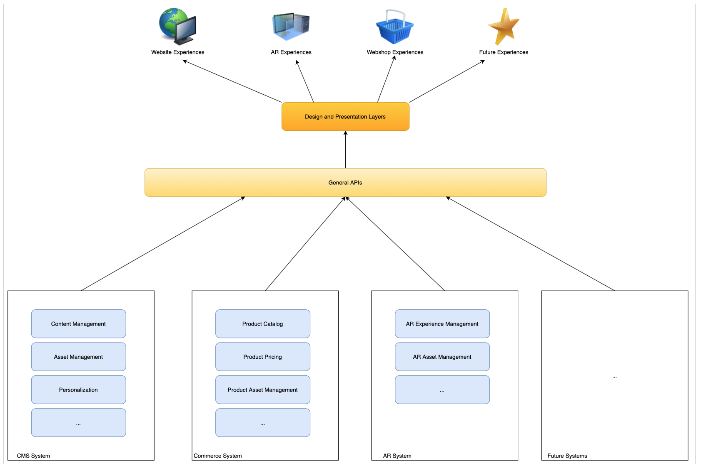

# Erfahren Sie mehr über die CMS Headless-Entwicklung {#learn-about}

>[!CAUTION]
>
>OUTDATED - Dieser Inhaltsentwurf wurde durch die neue [Headless-Entwickler-Journey-Dokumentation ersetzt.](/help/journey-headless/developer/overview.md)

In diesem Teil der [AEM Headless Developer Journey,](overview.md) erfahren Sie mehr über Headless-Technologie und warum Sie sie verwenden würden.

## Vorgabe {#objective}

Dieses Dokument hilft Ihnen, die Bereitstellung Headless Content und die Verwendungsmöglichkeiten zu verstehen. Nach dem Lesen sollten Sie:

* Grundlegende Konzepte und Terminologie der Bereitstellung Headless Content
* Verstehen, warum und wann Headless erforderlich ist
* Erfahren Sie auf hoher Ebene, wie Headless-Konzepte verwendet werden und wie sie miteinander verknüpft sind

## Inhaltsbereitstellung im Vollbildmodus {#full-stack}

Seit der Einführung benutzerfreundlicher, umfangreicher Content-Management-Systeme (CMS) haben Unternehmen diese als zentralen Ort für die Verwaltung von Messaging, Branding und Kommunikation genutzt. Die Verwendung des CMS als zentraler Punkt für die Verwaltung von Erlebnissen verbessert die Effizienz, da Aufgaben in unterschiedlichen Systemen nicht mehr dupliziert werden müssen.

In einem Full-Stack-CMS befindet sich die gesamte Funktionalität zum Bearbeiten Ihres Inhalts im CMS. Die Funktionen des Systems bilden verschiedene Komponenten des CMS-Stapels. Die Vollstapellösung hat viele Vorteile.

* Sie haben ein System zu verwalten.
* Inhalte werden zentral verwaltet.
* Alle Dienste des Systems sind integriert.
* Inhaltsbearbeitung ist nahtlos.

Wenn Sie also einen neuen Kanal hinzufügen oder neue Erlebnistypen unterstützen möchten, können Sie eine (oder mehrere) neue Komponenten in Ihren Stapel einfügen und Sie haben nur einen Ort, an dem Sie Ihre Änderungen vornehmen können.

Die Komplexität der Abhängigkeiten innerhalb des Stapels wird schnell sichtbar, da Sie sehen, dass andere Elemente im Stapel möglicherweise angepasst werden müssen, um die Änderungen zu berücksichtigen.

## Beschränkungen für die Bereitstellung im vollständigen Batch-Modus {#limits}

Der Full-Stack-Ansatz erzeugt von Natur aus ein Silo, in dem alle Erlebnisse in einem System landen. Änderungen oder Ergänzungen einer Komponente des Silos erfordern Änderungen an anderen Komponenten, die zeitintensive und kostspielige Änderungen ermöglichen.

Dies gilt insbesondere für das Präsentationssystem, das in traditionellen Setups oft eng an das CMS gebunden ist. Jeder neue Kanal bedeutet im Allgemeinen eine Aktualisierung des Präsentationssystems, die sich auf alle anderen Kanäle auswirken kann.

Die Einschränkungen dieses natürlichen Silos können sichtbar werden, wenn Sie mehr Mühe aufwenden, Änderungen über alle Komponenten Ihres Stapels hinweg zu koordinieren.

Benutzer erwarten Interaktionen unabhängig von der Plattform oder dem Touchpoint, was Flexibilität bei der Bereitstellung Ihrer Erlebnisse erfordert.  Dieser Mehrkanalansatz ist der Standard digitaler Erlebnisse, und ein Full-Stack-Ansatz kann sich unter bestimmten Umständen als unflexibel erweisen.

## Der Head in Headless {#the-head}

Der Kopf eines Systems ist im Allgemeinen der Ausgabe-Renderer dieses Systems, in der Regel in Form einer GUI oder einer anderen grafischen Ausgabe.

Ein Headless-Server beispielsweise sitzt wahrscheinlich in einem Rack irgendwo in einem Serverraum und hat keinen Monitor angeschlossen. Um darauf zugreifen zu können, müssen Sie eine Fernverbindung herstellen. In diesem Fall ist der Monitor der Kopf, da er die Ausgabe des Servers übernimmt. Als Verbraucher des Dienstes geben Sie Ihren eigenen Kopf (den Monitor) an, wenn Sie eine Verbindung mit ihm herstellen.

Wenn wir über ein Headless-CMS sprechen, verwaltet das CMS die Inhalte und stellt sie weiterhin an die Verbraucher bereit. Indem ein Headless-CMS jedoch nur den **content** standardisiert bereitstellt, lässt es das endgültige Ausgabe-Rendering aus, sodass die **Präsentation** des Inhalts dem verbrauchenden Dienst überlassen bleibt.

Die verbrauchenden Dienste, seien es AR-Erlebnisse, ein Webshop, mobile Erlebnisse, progressive Web-Apps (PWA) usw., nehmen Inhalte aus dem Headless-CMS auf und bieten ihr eigenes Rendering. Sie kümmern sich darum, Ihren Inhalt mit eigenen Köpfen zu versehen.

Das Auslassen des Kopfes vereinfacht das CMS, indem es die Komplexität beseitigt. Dadurch wird auch die Verantwortung für das Rendering der Inhalte auf die Dienste verlagert, die den Inhalt tatsächlich benötigen und oft besser für dieses Rendering geeignet sind.

## Entkopplung {#decoupling}

Die Headless-Bereitstellung ist möglich, indem eine Reihe robuster und flexibler Anwendungsprogrammierschnittstellen (APIs) verfügbar gemacht werden, auf die alle Ihre Erlebnisse tippen können. Die API dient als gemeinsame Sprache für die Dienste, bindet sie auf Inhaltsebene durch standardisierte Inhaltsbereitstellung zusammen, ermöglicht ihnen jedoch die Flexibilität, eigene Lösungen zu implementieren.

Headless ist ein Beispiel für die Entkopplung Ihres Inhalts von seiner Präsentation. Oder in einem allgemeineren Sinne, die Entkopplung des Frontend vom Backend Ihres Service Stacks. Bei einem Headless-Setup wird das Präsentationssystem (der Kopf) vom Content Management (der Schwanz) entkoppelt. Die beiden interagieren nur über API-Aufrufe.

Diese Entkopplung bedeutet, dass jeder konsumierende Dienst (das Frontend) sein Erlebnis auf Grundlage desselben Inhalts aufbauen kann, der über die APIs bereitgestellt wird, und so die Wiederverwendung und Konsistenz der Inhalte sicherstellt. Verbrauchsdienste können dann ihre eigenen Präsentationssysteme implementieren, sodass der Content-Management-Stack (das Backend) einfach horizontal skaliert werden kann.

## Technologische Grundlagen {#technology}

Mit einem Headless-Ansatz können Sie einen Technologie-Stack erstellen, der sich einfach und schnell an künftige Anforderungen an digitale Erlebnisse anpassen kann.

Früher waren APIs für CMSes normalerweise REST-basiert. Die Repräsentationsstatusübertragung (REST) bietet Ressourcen als Text in statusloser Weise. Dadurch können die Ressourcen mit einem vordefinierten Satz von Vorgängen gelesen und geändert werden. REST ermöglichte eine große Interoperabilität zwischen Diensten im Internet, indem es eine statuslose Darstellung der Inhalte sicherstellte.

Es sind weiterhin robuste REST-APIs erforderlich. REST-Anfragen können jedoch groß und ausführlich sein. Wenn Sie mehrere Verbraucher haben, die REST-Aufrufe für alle Ihre Kanäle durchführen, können sich dies auf die verbotenen Verbindungen und die Leistung auswirken.

Bei der Headless-Content-Bereitstellung werden häufig GraphQL-APIs verwendet. GraphQL ermöglicht eine ähnliche statuslose Übertragung, ermöglicht jedoch zielgerichtetere Abfragen, reduziert die Gesamtzahl der erforderlichen Abfragen und verbessert die Leistung. Es ist üblich zu sehen, Lösungen verwenden eine Mischung aus REST und GraphQL, im Wesentlichen wählen Sie das beste Werkzeug für den vorliegenden Auftrag.

Unabhängig von der gewählten API können Sie durch die Definition eines Headless-Systems auf der Basis gängiger APIs den neuesten Browser und andere Web-Technologien wie progressive Web-Apps (PWA) nutzen. APIs erstellen eine Standardschnittstelle, die einfach erweiterbar und anpassbar ist.

Normalerweise werden Inhalte clientseitig gerendert. Das bedeutet normalerweise, dass jemand Ihren Inhalt auf einem Mobilgerät aufruft, dass Ihr CMS den Inhalt bereitstellt und dann das Mobilgerät (der Client) für die Wiedergabe des von Ihnen bereitgestellten Inhalts verantwortlich ist. Wenn das Gerät alt oder anderweitig langsam ist, ist auch Ihr digitales Erlebnis langsam.

Die Entkopplung von Inhalten von der Präsentation bedeutet, dass es mehr Kontrolle über diese clientseitigen Leistungsaspekte geben kann. Server-seitiges Rendering (SSR) überträgt die Verantwortung für die Wiedergabe des Inhalts vom Browser des Clients auf den Server. Dadurch können Sie als Anbieter des Inhalts Ihrer Audience ein garantiertes Leistungsniveau bieten, sofern dies erforderlich ist.

## Organisatorische Herausforderungen {#organization}

Headless eröffnet eine Welt der Flexibilität für die Bereitstellung digitaler Erlebnisse. Diese Flexibilität kann aber auch eine eigene Herausforderung darstellen.

Viele verschiedene Kanäle können bedeuten, dass sie jeweils über eigene Präsentationssysteme verfügen. Obwohl sie alle denselben Inhalt über dieselben APIs nutzen, kann das Erlebnis aufgrund der verschiedenen Präsentationen unterschiedlich sein. Die Konsistenz des Kundenerlebnisses muss mit Sorge und Sorgfalt sichergestellt werden.

Durch die Implementierung sorgfältiger Designsysteme, die Freigabe von Musterbibliotheken und die Nutzung wiederverwendbarer Designkomponenten sowie etablierter, offener Client-seitiger Frameworks können konsistente Erlebnisse sichergestellt werden, dies muss jedoch geplant werden.

## Die Zukunft ist Headless und die Zukunft ist jetzt {#future}

Digitale Erlebnisse werden weiterhin definieren, wie Marken mit Kunden interagieren. Was an Headless Design aufregend ist, ist die Flexibilität, die es uns gibt, auf sich verändernde Kundenerwartungen zu reagieren.

Es ist unmöglich, die Zukunft vorherzusagen, aber Headless gibt Ihnen die Agilität, auf alles zu reagieren, was die Zukunft bringt.

## AEM und Headless {#aem-and-headless}

Wenn Sie mit dieser Entwickler-Journey fortfahren, erfahren Sie, wie AEM die Headless-Bereitstellung neben den Funktionen für die Bereitstellung im vollen Stapel unterstützt.

Als Branchenführer im Bereich Digital Experience Management erkennt Adobe, dass die ideale Lösung für die Herausforderungen der realen Welt, vor denen Erlebnisentwickler stehen, selten eine binäre Wahl ist. Deshalb unterstützt AEM nicht nur beide Modelle, sondern ermöglicht auch die nahtlose Hybrid-Kombination der beiden, die die Vorteile von Headless und Full Stack kombiniert, um Ihnen dabei zu helfen, die Verbraucher Ihres Inhalts, unabhängig davon, wo sie sich befinden, am besten zu bedienen.

Diese Journey konzentriert sich auf das reine Headless-Modell der Inhaltsbereitstellung. Sobald Sie jedoch über dieses grundlegende Wissen verfügen, können Sie weiter untersuchen, wie Sie die Macht beider Modelle nutzen können.

## Wie geht es weiter {#what-is-next}

Danke für den Einstieg in Ihre AEM Headless Journey! Nachdem Sie dieses Dokument gelesen haben, sollten Sie Folgendes tun:

* Machen Sie sich mit den grundlegenden Konzepten und der Terminologie der Headless Content-Bereitstellung vertraut.
* Verstehen Sie, warum und wann Headless erforderlich ist.
* Erfahren Sie auf hoher Ebene, wie Headless-Konzepte verwendet werden und wie sie miteinander zusammenhängen.

Auf diesem Wissen aufbauen und Ihre AEM Headless-Journey fortsetzen, indem Sie sich das Dokument [Erste Schritte mit AEM Headless as a Cloud Service](getting-started.md) ansehen. Hier erfahren Sie, wie Sie die erforderlichen Tools einrichten und darüber nachdenken, wie AEM Headless-Content-Bereitstellung und deren Voraussetzungen nahekommt.

## Zusätzliche Ressourcen {#additional-resources}

Es wird zwar empfohlen, zum nächsten Teil der Headless-Development-Journey zu wechseln, indem Sie das Dokument [Erste Schritte mit AEM Headless als Cloud Service lesen, ](getting-started.md) Im Folgenden finden Sie einige zusätzliche optionale Ressourcen, die einen tieferen Einblick in einige der in diesem Dokument erwähnten Konzepte bieten, aber sie müssen nicht mit dem Headless-Journey weitermachen.

* [Einführung in die Architektur von Adobe Experience Manager as a Cloud Service](/help/core-concepts/architecture.md)  - Grundlegendes zur AEM als Cloud Service-Struktur
* [AEM Headless-Tutorials](https://experienceleague.adobe.com/docs/experience-manager-learn/getting-started-with-aem-headless/overview.html?lang=de)  - Nutzen Sie diese praxisnahen Tutorials, um zu untersuchen, wie Sie die verschiedenen Optionen für die Bereitstellung von Inhalten an Headless-Endpunkte mit AEM nutzen können, und wählen Sie aus, was für Sie am besten geeignet ist.
