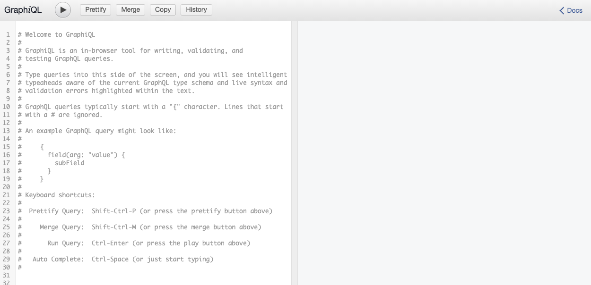
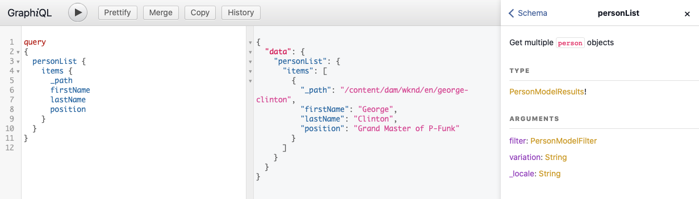

# Schnellstartanleitung für Headless: Abrufen und Bereitstellen von Inhaltsfragmenten {#accessing-delivering-content-fragments}

Die Assets-REST-API ermöglicht die Verwaltung von Inhaltsfragmenten und die GraphQL-API ermöglicht die einfache Headless-Bereitstellung von Inhaltsfragmentinhalten.

## Was sind GraphQL- und Assets-REST-APIs? {#what-are-the-apis}

[Nachdem Sie einige Inhaltsfragmente erstellt haben,](create-content-fragment.md) können Sie die APIs von AEM verwenden, um sie headless bereitzustellen.

* Mit der [GraphQL-API](/help/assets/content-fragments/graphql-api-content-fragments.md) können Sie Anfragen für den Zugriff auf und die Bereitstellung von Inhaltsfragmenten erstellen.
* Mit der [Assets-REST-API](/help/assets/content-fragments/assets-api-content-fragments.md) können Sie Inhaltsfragmente (und andere Assets) erstellen und ändern.

Der Rest dieses Handbuchs konzentriert sich auf den GraphQL-Zugriff und die Bereitstellung von Inhaltsfragmenten.

## Bereitstellen eines Inhaltsfragments mit GraphQL {#how-to-deliver-a-content-fragment}

Informationsarchitekten müssen Abfragen für ihre Kanalendpunkte entwerfen, um Inhalte bereitzustellen. Diese Abfragen müssen in der Regel nur einmal pro Endpunkt und Modell berücksichtigt werden. Für die Zwecke dieser ersten Schritte müssen wir nur eine erstellen.

<!-- Not in the UI yet - will need updating when it is -->
<!--
1. Log into AEM as a Cloud Service and from the main menu select **Tools -&gt; Assets -&gt; GraphQL** 
   * Alternatively open the page directly at `https://<host>:<port>/content/graphiql.html`.
-->

1. Melden Sie sich bei AEM as a Cloud Service an und rufen Sie die GraphiQL-Oberfläche auf:
   * Beispiel: `https://<host>:<port>/content/graphiql.html`.

1. GraphiQL ist ein In-Browser-Abfrage-Editor für GraphQL. Sie können damit Abfragen zum Abrufen von Inhaltsfragmenten erstellen, um diese als JSON-Datei direkt bereitzustellen.
   * Im linken Bedienfeld können Sie Ihre Abfrage erstellen.
   * Im rechten Bedienfeld werden die Ergebnisse angezeigt.
   * Der Abfrage-Editor bietet Code-Vervollständigung und Hotkeys, um die Abfrage einfach auszuführen.
      

1. Angenommen, das von uns erstellte Modell `person` wurde mit Feldern `firstName`, `lastName` und `position` aufgerufen. Wir können dann eine einfache Abfrage erstellen, um den Inhalt unseres Inhaltsfragments abzurufen.

   ```text
   query 
   {
     personList {
       items {
         _path
         firstName
         lastName
         position
       }
     }
   }
   ```

1. Geben Sie die Abfrage in das linke Bedienfeld ein.
   

1. Klicken Sie auf die Schaltfläche **Abfrage ausführen** oder verwenden Sie den `Ctrl-Enter`-Hotkey. Die Ergebnisse werden als JSON im rechten Bedienfeld angezeigt.
   

1. Klicken Sie oben rechts auf der Seite auf den Link **Dokumente**, um eine kontextbezogene Dokumentation anzuzeigen, die Sie bei der Erstellung Ihrer Abfragen unterstützt und sich an Ihre eigenen Modelle anpasst.
   

GraphQL ermöglicht strukturierte Abfragen, die nicht nur auf bestimmte Datensätze oder einzelne Datenobjekte abzielen, sondern auch bestimmte Elemente der Objekte und verschachtelte Ergebnisse bereitstellen, Unterstützung für Abfragevariablen bieten und vieles mehr.

GraphQL kann sowohl iterative API-Anfragen als auch Überbereitstellungen vermeiden und ermöglicht stattdessen eine Massenbereitstellung von genau dem, was zum Rendern als Antwort auf eine einzelne API-Abfrage benötigt wird. Das resultierende JSON kann verwendet werden, um Daten in anderen Sites oder Mobile Apps bereitzustellen.

## Nächste Schritte {#next-steps}

Das war´s! Sie haben nun ein grundlegendes Verständnis für das Headless-Content-Management in AEM. Natürlich gibt es viele weitere Ressourcen, mit deren Hilfe Sie sich ein umfassendes Verständnis der verfügbaren Funktionen aneignen können.

* **Konfigurations-Browser** – Weitere Informationen zum AEM-Konfigurations-Browser
* **[Inhaltsfragmente](/help/assets/content-fragments/content-fragments.md)** – Weitere Informationen zum Erstellen und Verwalten von Inhaltsfragmenten
* **[Unterstützung von Inhaltsfragmenten in der AEM Assets-HTTP-API](/help/assets/content-fragments/assets-api-content-fragments.md)** – Weitere Informationen zum direkten Zugriff auf AEM-Inhalte über die HTTP-API über CRUD-Vorgänge (Erstellen, Lesen, Aktualisieren, Löschen)
* **[GraphQL-API](/help/assets/content-fragments/graphql-api-content-fragments.md)** – Weitere Informationen zum Headless-Bereitstellen von Inhaltsfragmenten
