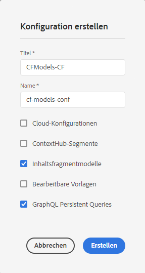

# Erstellen einer Kurzanleitung für einen Konfigurations-Headless-Beginn {#creating-configuration}

Als ersten Schritt zu den ersten Schritten mit dem Kopflosen in AEM als Cloud Service müssen Sie eine Konfiguration erstellen.

## Was ist eine Konfiguration? {#what-is-a-configuration}

Der Konfigurationsbrowser bietet eine allgemeine Konfigurations-API, eine Inhaltsstruktur und einen Auflösungsmechanismus für Konfigurationen in AEM.

Stellen Sie sich im Zusammenhang mit dem kopflosen Content-Management in AEM eine Konfiguration als Arbeitsplatz in AEM vor, wo Sie Ihre Inhaltsmodelle erstellen können, die die Struktur Ihrer zukünftigen Inhalte und Inhaltsfragmente definieren. Sie können über mehrere Konfigurationen verfügen, um diese Modelle zu trennen.

Wenn Sie mit [Seitenvorlagen in einer Vollstapelimplementierung vertraut sind, AEM](/help/sites-cloud/authoring/features/templates.md) die Verwendung von Konfigurationen für die Verwaltung von Inhaltsmodellen ähnlich ist.

## Erstellen einer Konfiguration {#how-to-create-a-configuration}

Ein Administrator muss eine Konfiguration nur einmal oder sehr selber erstellen, wenn ein neuer Arbeitsbereich für die Organisation Ihrer Inhaltsmodelle erforderlich ist. Für die Zwecke dieses Beginns-Handbuchs müssen wir nur eine Konfiguration erstellen.

1. Melden Sie sich bei AEM als Cloud Service an und wählen Sie im Hauptmenü **Tools -> Allgemein -> Konfigurationsbrowser**.
1. Geben Sie für Ihre Konfiguration einen **Titel** und einen **Namen** ein.
   * Der **Titel** sollte beschreibend sein.
   * Der Knoten **Name** wird zum Knotennamen im Repository.
      * Sie wird automatisch basierend auf dem Titel generiert und entsprechend den Benennungskonventionen [AEM angepasst.](/help/implementing/developing/introduction/naming-conventions.md)
      * Er kann bei Bedarf angepasst werden.
1. Überprüfen Sie die folgenden Optionen:
   * **Inhaltsfragmentmodelle**
   * **GraphQL Persistente Abfragen**

   

1. Tippen oder klicken Sie auf **Erstellen**

Sie können bei Bedarf mehrere Konfigurationen erstellen. Konfigurationen können auch verschachtelt werden.

>[!NOTE]
>
>Abhängig von Ihren Implementierungsanforderungen können Konfigurationsoptionen zusätzlich zu **Inhaltsfragmentmodellen** und **GraphQL Persistente Abfragen** erforderlich sein.

## Nächste Schritte {#next-steps}

Mithilfe dieser Konfiguration können Sie nun zum zweiten Teil der Anleitung für die ersten Schritte wechseln und [Inhaltsfragmentmodelle erstellen.](create-content-model.md)

>[!TIP]
>
>Ausführliche Informationen zum Konfigurationsbrowser finden Sie in der Dokumentation zum Konfigurationsbrowser.
