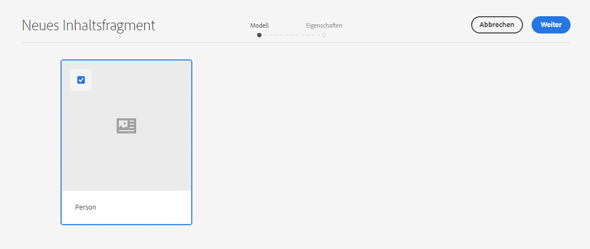
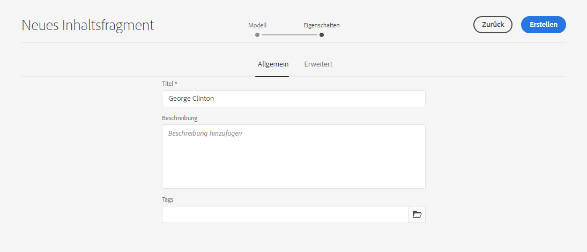
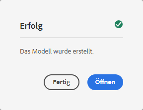
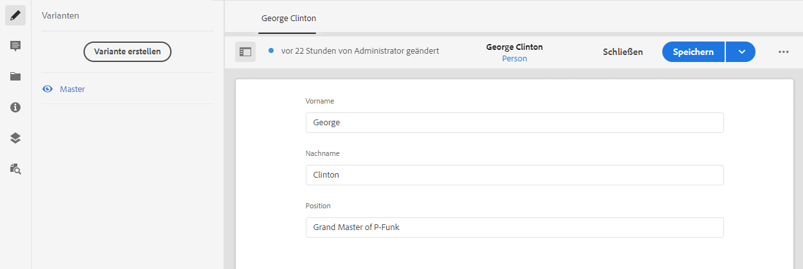

# Schnellstartanleitung zum Erstellen von Inhaltsfragmenten per Headless-Implementierung {#creating-content-fragments}

Erfahren Sie, wie Sie AEM Inhaltsfragmente verwenden können, um seitenunabhängige Inhalte für die Headless-Bereitstellung zu entwerfen, zu erstellen, zu kuratieren und zu verwenden.

## Was sind Inhaltsfragmente? {#what-are-content-fragments}

[Nachdem Sie einen Asset-Ordner erstellt haben](create-assets-folder.md), in dem Ihre Inhaltsfragmente gespeichert werden sollen, können Sie nun Fragmente erstellten.

Inhaltsfragmente ermöglichen Ihnen das Entwerfen, Erstellen, Kuratieren und Verwenden von seitenunabhängigen Inhalten. Außerdem können Sie Inhalte zur Verwendung an mehreren Orten und über mehrere Kanäle hinweg vorbereiten.

Inhaltsfragmente enthalten strukturierten Inhalt und können im JSON-Format bereitgestellt werden.

## Erstellen eines Inhaltsfragments {#how-to-create-a-content-fragment}

Inhaltsersteller können eine beliebige Anzahl von Inhaltsfragmenten für ihre Inhalte erstellen. Das die zentrale Aufgabe, die sie in AEM ausführen. Für die Zwecke dieser Anleitung für den Einstieg müssen wir nur ein Fragment erstellen.

1. Melden Sie sich bei AEM as a Cloud Service an und wählen Sie im Hauptmenü **Tools > Assets** aus.
1. Tippen oder klicken Sie auf den [zuvor von Ihnen erstellten Ordner](create-assets-folder.md).
1. Tippen oder klicken Sie auf **Erstellen > Inhaltsfragment**.
1. Die Erstellung eines Inhaltsfragments erfolgt mithilfe eines Assistenten in zwei Schritten. Wählen Sie zuerst das Modell aus, das Sie zum Erstellen des Inhaltsfragments verwenden möchten, und tippen oder klicken Sie dann auf **Weiter**.
   * Die verfügbaren Modelle hängen von der [**Cloud-Konfiguration** ab, die Sie für den Asset-Ordner](create-assets-folder.md) definiert haben, in dem Sie das Inhaltsfragment erstellen.
   * Wenn Ihnen die Meldung `We could not find any models` angezeigt wird, überprüfen Sie die Konfiguration Ihres Asset-Ordners.

   
1. Geben Sie nach Bedarf einen **Titel**, eine **Beschreibung** und **Tags** ein und tippen oder klicken Sie auf **Erstellen**.

   
1. Tippen oder klicken Sie im Bestätigungsfenster auf **Öffnen**.

   
1. Geben Sie im Inhaltsfragment-Editor die Details des Inhaltsfragments an.

   
1. Tippen oder klicken Sie auf **Speichern** oder **Speichern und schließen**.

Inhaltsfragmente können auf andere Inhaltsfragmente verweisen, was bei Bedarf eine verschachtelte Inhaltsstruktur ermöglicht.

Inhaltsfragmente können auch auf andere Assets in AEM verweisen. [Diese Assets müssen in AEM gespeichert werden](/help/assets/manage-digital-assets.md), bevor ein Verweis auf das Inhaltsfragment erstellt wird.

## Nächste Schritte {#next-steps}

Nachdem Sie nun ein Inhaltsfragment erstellt haben, können Sie zum letzten Teil der Anleitung für den Einstieg übergehen und [API-Anfragen erstellen, um auf Inhaltsfragmente zuzugreifen und diese bereitzustellen](create-api-request.md).

>[!TIP]
>
>Ausführliche Informationen zur Verwaltung von Inhaltsfragmenten finden Sie in der [Dokumentation zu Inhaltsfragmenten](/help/assets/content-fragments/content-fragments.md).
