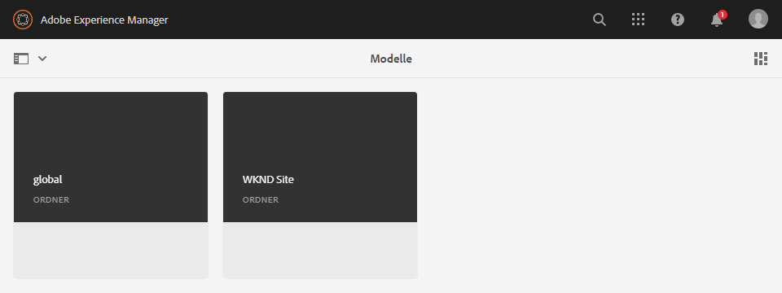
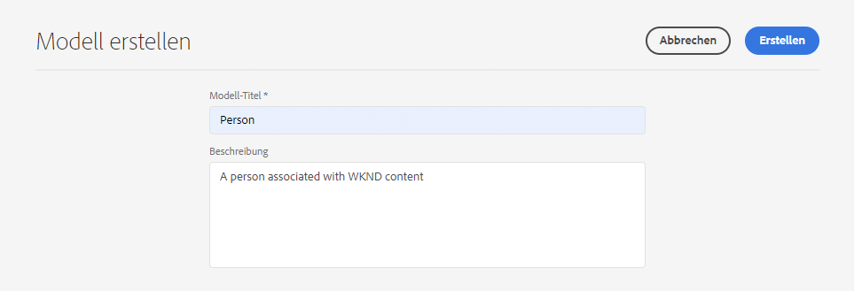
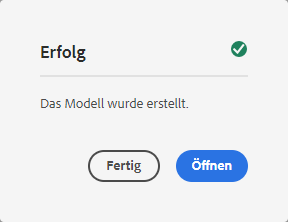
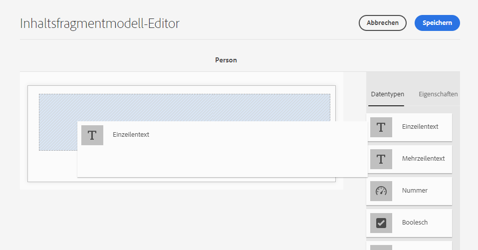
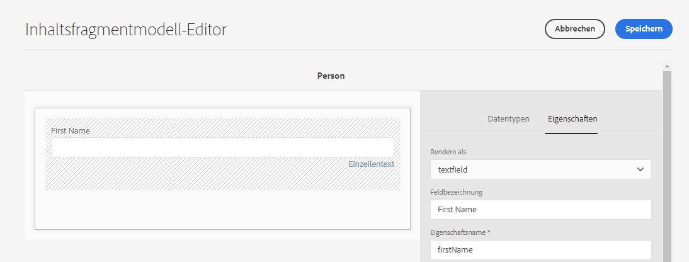
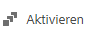
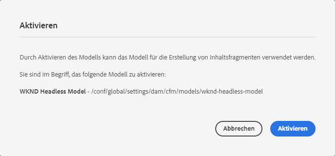
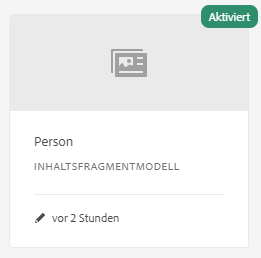

# Erstellen von Inhaltsfragmentmodellen - Kurzanleitung zum Beginn ohne Kopfzeilen {#creating-content-fragment-models}

Inhaltsfragmentmodelle definieren die Struktur des Inhalts, den Sie mithilfe AEM kopflosen Funktionen erstellen und bereitstellen.

## Was sind Inhaltsfragmentmodelle? {#what-are-content-fragment-models}

[Nachdem Sie eine Konfiguration erstellt haben, können ](create-configuration.md) Sie damit Inhaltsfragmentmodelle erstellen.

Inhaltsfragmentmodelle definieren die Struktur der Daten und Inhalte, die Sie in AEM erstellen und verwalten werden. Sie dienen als Gerüst für Ihren Inhalt. Wenn Sie sich dafür entscheiden, Inhalte zu erstellen, wählen Ihre Autoren aus den von Ihnen definierten Inhaltsfragmentmodellen, die sie beim Erstellen von Inhalten leiten.

## Erstellen eines Inhaltsfragmentmodells {#how-to-create-a-content-fragment-model}

Ein Informationsarchitekt würde diese Aufgaben nur sporadisch durchführen, da neue Modelle erforderlich sind. Für die Zwecke dieses Beginns-Leitfadens müssen wir nur ein Modell erstellen.

1. Melden Sie sich bei AEM als Cloud Service an und wählen Sie im Hauptmenü **Tools -> Assets -> Inhaltsfragmentmodelle**.
1. Tippen oder klicken Sie auf den Ordner, der durch Erstellung Ihrer Konfiguration erstellt wurde.

   
1. Tippen oder klicken Sie auf **Erstellen**.
1. Geben Sie einen **Modelltitel**, **Tags** und **Beschreibung** an. Sie können auch **Modell** aktivieren bzw. deaktivieren, um zu steuern, ob das Modell unmittelbar nach der Erstellung aktiviert ist.

   
1. Tippen oder klicken Sie im Bestätigungsfenster auf **Öffnen**, um Ihr Modell zu konfigurieren.

   
1. Erstellen Sie mit dem **Inhaltsfragmentmodell-Editor** das Inhaltsfragmentmodell, indem Sie Felder aus der Spalte **Datentypen** ziehen und ablegen.

   

1. Nachdem Sie ein Feld platziert haben, müssen Sie dessen Eigenschaften konfigurieren. Der Editor wechselt automatisch zur Registerkarte **Eigenschaften** für das hinzugefügte Feld, in der Sie die erforderlichen Felder eingeben können.

   
1. Wenn Sie mit dem Erstellen des Modells fertig sind, tippen oder klicken Sie auf **Speichern**. Das neu erstellte Modell wird im Modus **Entwurf** gespeichert.

   
1. Das Modell muss aktiviert sein, damit es verwendet werden kann (falls es noch nicht aktiviert ist). Wählen Sie das soeben erstellte Modell aus und tippen oder klicken Sie auf **Aktivieren**.

   
1. Bestätigen Sie die Aktivierung des Modells, indem Sie im Bestätigungsdialogfeld auf **Aktivieren** tippen oder klicken.

   
1. Das Modell ist jetzt aktiviert und einsatzbereit.

   

Der **Inhaltsfragmentmodell-Editor** unterstützt viele verschiedene Datentypen wie einfache Textfelder, Asset-Referenzen, Verweise auf andere Modelle und JSON-Daten.

Sie können mehrere Modelle erstellen. Modelle können auf andere Inhaltsfragmente verweisen. Verwenden Sie [Konfigurationen](create-configuration.md), um Ihre Modelle zu organisieren.

## Nächste Schritte {#next-steps}

Nachdem Sie nun die Strukturen der Inhaltsfragmente durch Erstellen von Modellen definiert haben, können Sie zum dritten Teil des Beginnungshandbuchs wechseln und [Ordner erstellen, in denen Sie die Fragmente selbst speichern.](create-assets-folder.md)

>[!TIP]
>
>Ausführliche Informationen zu Inhaltsfragmentmodellen finden Sie in der Dokumentation [Inhaltsfragmentmodelle](/help/assets/content-fragments/content-fragments-models.md)
