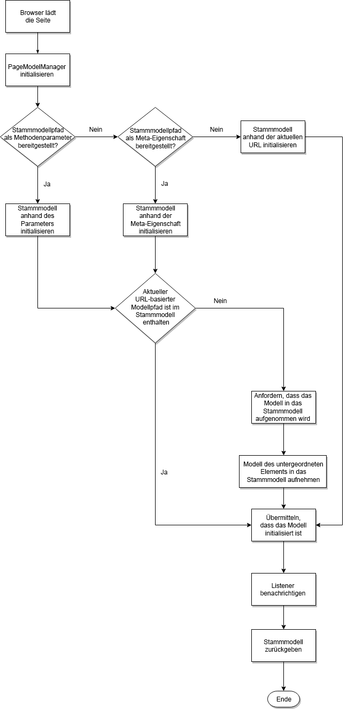

# SPA-Blueprint {#spa-blueprint}

Damit der Autor den AEM-SPA-Editor zum Bearbeiten des Inhalts einer SPA verwenden kann, muss die SPA bestimmte Anforderungen erfüllen.

{{ue-over-spa}}

## Einführung {#introduction}

In diesem Dokument wird der Generalvertrag beschrieben, den jedes SPA-Framework erfüllen sollte (d. h. die Art der AEM-Support-Ebene), damit sich in AEM bearbeitbare SPA-Komponenten implementieren lassen.

Damit der Autor den AEM-Seiteneditor zum Bearbeiten der von einem SPA-Framework bereitgestellten Daten verwenden kann, muss ein Projekt die Struktur des Modells interpretieren können, das die Semantik der für ein Programm im AEM-Repository gespeicherten Daten darstellt. Dafür stehen zwei Framework-agnostische Bibliotheken zur Verfügung: `PageModelManager` und `ComponentMapping`.

>[!NOTE]
>
>Die folgenden Anforderungen sind Framework-unabhängig. Wenn diese Anforderungen erfüllt sind, kann eine Framework-spezifische Ebene aus Modulen, Komponenten und Diensten bereitgestellt werden.
>
>**Für die React- und Angular-Frameworks werden diese Anforderungen in AEM bereits erfüllt.** Die Anforderungen im vorliegenden Blueprint sind nur relevant, wenn Sie ein anderes Framework zur Verwendung mit AEM implementieren möchten.

>[!CAUTION]
>
>Obwohl die SPA-Möglichkeiten von AEM Framework-unabhängig sind, werden derzeit nur das React- und das Angular-Framework unterstützt.

## PageModelManager {#pagemodelmanager}

Die `PageModelManager`-Bibliothek wird als NPM-Paket bereitgestellt, das von einem SPA-Projekt verwendet werden kann. Sie begleitet die SPA und dient als Datenmodell-Manager.

Im Namen der SPA abstrahiert sie den Abruf und die Verwaltung der JSON-Struktur, die die eigentliche Inhaltsstruktur darstellt. Sie ist auch für die Synchronisation mit der SPA verantwortlich und informiert sie darüber, wenn ihre Komponenten neu gerendert werden müssen.

Siehe NPM-Paket [@adobe/aem-spa-model-manager](https://www.npmjs.com/package/@adobe/aem-spa-model-manager).

Beim Initialisieren des `PageModelManager` lädt die Bibliothek zunächst das bereitgestellte Stammmodell der App (über Parameter, Meta-Eigenschaft oder aktuelle URL). Wenn die Bibliothek erkennt, dass das Modell der aktuellen Seite nicht Teil des Stammmodells ist, wird es als Modell einer untergeordneten Seite abgerufen und eingefügt.



### ComponentMapping {#componentmapping}

Das `ComponentMapping`-Modul wird dem Frontend-Projekt als NPM-Paket bereitgestellt. Es speichert Frontend-Komponenten und bietet eine Möglichkeit für die SPA, Frontend-Komponenten AEM-Ressourcentypen zuzuordnen. Dies ermöglicht beim Parsen des JSON-Modells des Programms eine dynamische Auflösung von Komponenten.

Alle im Modell vorhandenen Elemente enthalten ein Feld `:type`, das einen AEM-Ressourcentyp verfügbar macht. Bei der Implementierung kann sich die Frontend-Komponente mit dem Fragment des Modells, das sie von den zugrunde liegenden Bibliotheken erhalten hat, selbst rendern.

#### Dynamisches Modell für die Komponentenzuordnung {#dynamic-model-to-component-mapping}

Weitere Informationen dazu, wie das dynamische Modell für die Komponentenzuordnung im JavaScript SPA SDK für AEM funktioniert, finden Sie im Artikel [Dynamisches Modell für die Komponentenzuordnung bei SPAs](model-to-component-mapping.md).

### Framework-spezifische Schicht {#framework-specific-layer}

Für jedes Frontend-Framework muss eine dritte Schicht implementiert werden. Diese dritte Bibliothek ist für die Interaktion mit den zugrunde liegenden Bibliotheken verantwortlich und bietet eine Reihe von gut integrierten und einfach zu verwendenden Einstiegspunkten für die Interaktion mit dem Datenmodell.

Das restliche Dokument beschreibt die Anforderungen dieser zwischengelagerten Framework-spezifischen Schicht und zielt auf Framework-Unabhängigkeit ab. Unter Beachtung der folgenden Anforderungen kann eine Framework-spezifische Schicht bereitgestellt werden, dank der die Projektkomponenten mit den zugrunde liegenden Bibliotheken, die für die Verwaltung des Datenmodells zuständig sind, interagieren können.

## Allgemeine Konzepte {#general-concepts}

### Seitenmodell {#page-model}

Die Inhaltsstruktur der Seite wird in AEM gespeichert. Das Modell der Seite wird verwendet, um SPA-Komponenten zuzuordnen und zu instanziieren. Die SPA-Entwickler erstellen SPA-Komponenten, die sie den AEM-Komponenten zuordnen. Dazu verwenden sie den Ressourcentyp (oder Pfad zur AEM-Komponente) als eindeutigen Schlüssel.

Die SPA-Komponenten müssen mit dem Seitenmodell synchron sein und bei Änderungen des Inhalts entsprechend aktualisiert werden. Sie müssen ein Muster verwenden, das dynamische Komponenten nutzt, um Komponenten entsprechend der vorgegebenen Seitenmodellstruktur spontan zu instanziieren.

### Meta-Felder {#meta-fields}

Das Seitenmodell nutzt den JSON Model Exporter, der wiederum auf der [Sling Model](https://sling.apache.org/documentation/bundles/models.html)-API basiert. Die exportierbaren Sling-Modelle machen die folgende Liste von Feldern verfügbar, damit die zugrunde liegenden Bibliotheken das Datenmodell interpretieren können:

* `:type`: Typ der AEM-Ressource (Standard = Ressourcentyp)
* `:children`: Hierarchische untergeordnete Elemente der aktuellen Ressource. Untergeordnete Elemente sind nicht Teil des inneren Inhalts der aktuellen Ressource (können bei Elementen gefunden werden, die eine Seite darstellen).
* `:hierarchyType`: Hierarchischer Typ einer Ressource. Der `PageModelManager` unterstützt derzeit den Seitentyp

* `:items`: Untergeordnete Inhaltsressourcen der aktuellen Ressource (verschachtelte Struktur, nur in Containern vorhanden)
* `:itemsOrder`: Sortierte Liste der untergeordneten Elemente. Das JSON-Zuordnungsobjekt bietet keine Garantie für die Reihenfolge seiner Felder. Mit dem Zuordnungsobjekt und dem aktuellen Array hat der Nutzer der API die Vorteile beider Strukturen.
* `:path`: Inhaltspfad eines Elements (vorhanden bei Elementen, die eine Seite darstellen)

Siehe auch [ Schritte mit AEM Content Services](https://experienceleague.adobe.com/docs/experience-manager-learn/getting-started-with-aem-headless/overview.html?lang=de).

### Framework-spezifisches Modul {#framework-specific-module}

Die Trennung von Aufgaben erleichtert die Projektdurchführung. Daher sollte ein NPM-spezifisches Paket bereitgestellt werden. Dieses Paket ist für das Aggregieren und Freigeben der grundlegenden Module, Services und Komponenten verantwortlich. Diese Komponenten müssen die Verwaltungslogik des Datenmodells einschließen und Zugriff auf jene Daten gewähren, die die Projektkomponente erwartet. Zudem ist das Modul für das vorübergehende Verfügbarmachen nützlicher Einstiegspunkte der zugrunde liegenden Bibliotheken verantwortlich.

Um die Interoperabilität der Bibliotheken zu optimieren, empfiehlt Adobe für das Framework-spezifische Modul, die folgenden Bibliotheken zu bündeln. Bei Bedarf kann die Schicht die zugrunde liegenden APIs einkapseln und anpassen, bevor sie dem Projekt verfügbar gemacht werden.

* [@adobe/aem-spa-model-manager](https://www.npmjs.com/package/@adobe/aem-spa-model-manager)
* [@adobe/aem-spa-component-mapping](https://www.npmjs.com/package/@adobe/aem-spa-component-mapping)

#### Implementierungen {#implementations}

#### React {#react}

NPM-Modul: [@adobe/aem-response-editable-components](https://www.npmjs.com/package/@adobe/aem-react-editable-components)

#### Angular {#angular}

NPM-Modul: [@adobe/aem-angular-editable-components](https://www.npmjs.com/package/@adobe/aem-angular-editable-components)

## Haupt-Services und -komponenten {#main-services-and-components}

Die folgenden Entitäten sollten im Einklang mit den für das jeweilige Framework geltenden Leitlinien implementiert werden. Je nach Framework-Architektur kann die Implementierung stark variieren, die beschriebenen Funktionen müssen jedoch bereitgestellt werden.

### Der Modellanbieter {#the-model-provider}

Projektkomponenten müssen den Zugriff auf die Fragmente eines Modells an einen Modellanbieter delegieren. Der Modellanbieter überwacht dann die Änderungen, die an dem angegebenen Fragment des Modells vorgenommen werden, und gibt das aktualisierte Modell an die delegierende Komponente zurück.

Dazu muss sich der Modellanbieter beim [`PageModelManager`](#pagemodelmanager) registrieren. Wenn eine Änderung eintritt, werden die aktualisierten Daten empfangen und an die delegierende Komponente übergeben. Standardmäßig trägt die Eigenschaft, die der delegierenden Komponente, welche das Fragment des Modells enthält, zur Verfügung gestellt wird, den Namen `cqModel`. Die Implementierung kann diese Eigenschaft für die Komponente bereitstellen, sollte jedoch Aspekte wie Integration mit der Framework-Architektur, Auffindbarkeit und Benutzerfreundlichkeit berücksichtigen.

### Der Komponenten-HTML-Dekorateur {#the-component-html-decorator}

Der Komponenten-Dekorateur ist für das Dekorieren des äußeren HTML-Codes des Elements der einzelnen Komponenteninstanzen mit einer Reihe von Datenattributen und Klassennamen verantwortlich, die vom Seiteneditor erwartet werden.

#### Komponentendeklaration {#component-declaration}

Folgende Metadaten müssen dem äußeren HTML-Element hinzugefügt werden, das von der Projektkomponente erzeugt wurde. Sie ermöglichen es dem Seiteneditor, die entsprechende Bearbeitungskonfiguration abzurufen.

* `data-cq-data-path`: Pfad zur Ressource relativ zum `jcr:content`

#### Deklaration und Platzhalter für Bearbeitungsfunktionen {#editing-capability-declaration-and-placeholder}

Dem äußeren HTML-Element, das von der Komponente des Projekts erzeugt wird, müssen folgende Metadaten und Klassennamen hinzugefügt werden. Sie ermöglichen es dem Seiteneditor, verwandte Funktionen anzubieten.

* `cq-placeholder`: Klassenname, der den Platzhalter für eine leere Komponente angibt
* `data-emptytext`: Beschriftung, die vom Overlay angezeigt wird, wenn eine Komponenteninstanz leer ist

**Platzhalter für leere Komponenten**

Jede Komponente muss mit einer Funktion erweitert werden, die das äußere HTML-Element mit Datenattributen und Klassennamen dekoriert, die für Platzhalter und zugehörige Overlays spezifisch sind, falls die Komponente als leer identifiziert wird.

**Über das Leersein einer Komponente**

* Ist die Komponente logisch leer?
* Welche Beschriftung sollte das Overlay anzeigen, wenn die Komponente leer ist?

### Container {#container}

Ein Container ist eine Komponente, die untergeordnete Komponenten enthält und rendert. Dazu durchläuft der Container die `:itemsOrder`-, `:items`- und `:children`-Eigenschaften seines Modells.

Der Container ruft die untergeordneten Komponenten dynamisch aus dem Speicher der [`ComponentMapping`](#componentmapping)-Bibliothek ab. Der Container erweitert dann die untergeordnete Komponente mit den Modellanbieterfunktionen und instanziiert sie schließlich.

### Seite {#page}

Die `Page`-Komponente erweitert die `Container`-Komponente. Ein Container ist eine Komponente, die untergeordnete Komponenten wie untergeordnete Seiten enthält und rendert. Dazu durchläuft der Container die `:itemsOrder`-, `:items`- und `:children`-Eigenschaften seines Modells. Die `Page`-Komponente ruft die untergeordneten Komponenten aus dem Speicher der [`ComponentMapping`](#componentmapping)-Bibliothek dynamisch ab. Die `Page` ist für die Instanziierung untergeordneter Komponenten verantwortlich.

### Responsives Raster {#responsive-grid}

Die Komponente „Responsives Raster“ ist ein Container. Sie enthält eine bestimmte Variante des Modellanbieters, die die entsprechenden Spalten darstellt. Das responsive Raster und seine Spalten sind dafür verantwortlich, das äußere HTML-Element der Projektkomponente mit den spezifischen Klassennamen zu dekorieren, die im Modell enthalten sind.

Die Komponente „Responsives Raster“ sollte vorab ihrem AEM-Gegenstück zugeordnet werden, da die Komponente komplex ist und selten angepasst wird.

#### Spezifische Modellfelder {#specific-model-fields}

* `gridClassNames:` stellt Klassennamen für das responsive Raster bereit
* `columnClassNames:` stellt Klassennamen für die responsive Spalte bereit

Siehe auch NPM-Ressource [@adobe/aem-response-editable-components](https://www.npmjs.com/package/@adobe/aem-react-editable-components)

#### Platzhalter des responsiven Rasters {#placeholder-of-the-responsive-grid}

Die SPA-Komponente ist einem grafischen Container wie dem responsiven Raster zugeordnet und muss einen virtuellen untergeordneten Platzhalter hinzufügen, wenn der Inhalt bearbeitet wird. Wenn der Inhalt der SPA im Seiteneditor bearbeitet wird, wird dieser Inhalt mit einem iFrame in den Editor eingebettet und das Attribut `data-cq-editor` wird dem document-Knoten des Inhalts hinzugefügt. Wenn das `data-cq-editor`-Attribut vorhanden ist, muss der Container ein HTML-Element enthalten, das den Bereich darstellt, mit dem der Autor beim Einfügen einer neuen Komponente in die Seite interagiert.

Beispiel:

```html
<div data-cq-data-path={"path/to/the/responsivegrid/*"} className="new section aem-Grid-newComponent"/>
```

>[!NOTE]
>
>Die im Beispiel verwendeten Klassennamen werden zurzeit vom Seiteneditor erfordert.
>
>* `"new section"`: Zeigt an, dass das aktuelle Element der Platzhalter des Containers ist
>* `"aem-Grid-newComponent"`: Normalisiert die Komponente für die Layout-Bearbeitung
>

#### Komponentenzuordnung {#component-mapping}

Die zugrunde liegende [`Component Mapping`](#componentmapping)-Bibliothek und ihre `MapTo`-Funktion können eingekapselt und erweitert werden, um die mit der aktuellen Komponentenklasse bereitgestellten Funktionen für die Bearbeitungskonfiguration zur Verfügung zu stellen.

```javascript
const EditConfig = {

    emptyLabel: 'My Component',

    isEmpty: function() {
        return !this.props || !this.props.cqModel || this.props.cqModel.isEmpty;
    }
};

class MyComponent extends Component {

    render() {
        return <div className={'my-component'}></div>;
    }
}

MapTo('component/resource/path')(MyComponent, EditConfig);
```

In der obigen Implementierung wird die Projektkomponente mit der Leerheitsfunktion erweitert, bevor sie im Speicher der [Komponentenzuordnung](#componentmapping) tatsächlich registriert wird. Dies geschieht durch Einkapseln und Erweitern der [`ComponentMapping`](#componentmapping)-Bibliothek, um Unterstützung für das `EditConfig`-Konfigurationsobjekt einzuführen:

```javascript
/**
 * Configuration object in charge of providing the necessary data expected by the page editor to initiate the authoring. The provided data is decorating the associated component
 *
 * @typedef {{}} EditConfig
 * @property {String} [dragDropName]       If defined, adds a specific class name enabling the drag and drop functionality
 * @property {String} emptyLabel           Label to be displayed by the placeholder when the component is empty. Optionally returns an empty text value
 * @property {function} isEmpty            Should the component be considered empty. The function is called using the context of the wrapper component giving you access to the component model
 */

/**
 * Map a React component with the given resource types. If an {@link EditConfig} is provided the <i>clazz</i> is wrapped to provide edition capabilities on the AEM Page Editor
 *
 * @param {string[]} resourceTypes                      - List of resource types for which to use the given <i>clazz</i>
 * @param {class} clazz                                 - Class to be instantiated for the given resource types
 * @param {EditConfig} [editConfig]                     - Configuration object for enabling the edition capabilities
 * @returns {class}                                     - The resulting decorated Class
 */
ComponentMapping.map = function map (resourceTypes, clazz, editConfig) {};
```

## Vertrag mit dem Seiteneditor {#contract-with-the-page-editor}

Die Projektkomponenten müssen mindestens die folgenden Datenattribute generieren, damit der Editor mit ihnen interagieren kann.

* `data-cq-data-path`: Relativer Pfad der Komponente, der von `PageModel` angegeben wird (z. B. `"root/responsivegrid/image"`). Dieses Attribut sollte nicht zu Seiten hinzugefügt werden.

Zusammenfassend muss eine Projektkomponente den folgenden Vertrag respektieren, damit sie vom Seiteneditor als bearbeitbar erkannt wird:

* Stellen Sie die erwarteten Attribute bereit, um eine Frontend-Komponenteninstanz einer AEM-Ressource zuzuordnen.
* Stellen Sie die erwartete Folge von Attributen und Klassennamen bereit, die das Erstellen von leeren Platzhaltern ermöglicht.
* Stellen Sie die erwarteten Klassennamen bereit, die Drag-and-Drop von Assets ermöglichen.

### Typische Struktur von HTML-Elementen {#typical-html-element-structure}

Das folgende Fragment zeigt die typische HTML-Darstellung einer Seiteninhaltsstruktur. Hier einige wichtige Punkte:

* Das responsive Rasterelement überträgt Klassennamen mit dem Präfix `aem-Grid--`
* Das responsive Spaltenelement überträgt Klassennamen mit dem Präfix `aem-GridColumn--`
* Ein responsives Raster, das auch die Spalte eines übergeordneten Rasters ist, ist so eingeschlossen, dass die beiden oben genannten Präfixe nicht im demselben Element vorkommen
* Elemente, die bearbeitbaren Ressourcen entsprechen, haben die Eigenschaft `data-cq-data-path`. Weitere Informationen finden Sie im Abschnitt [Vertrag mit dem Seiteneditor](#contract-with-the-page-editor) dieses Dokuments.

```javascript
<div data-cq-data-path="/content/page">
    <div class="aem-Grid aem-Grid--12 aem-Grid--default--12">
        <div class="aem-container aem-GridColumn aem-GridColumn--default--12" data-cq-data-path="/content/page/jcr:content/root/responsivegrid">
            <div class="aem-Grid aem-Grid--12 aem-Grid--default--12">
                <div class="cmp-image cq-dd-image aem-GridColumn aem-GridColumn--default--12" data-cq-data-path="/root/responsivegrid/image">
                    
                </div>
            </div>
        </div>
    </div>
</div>
```

## Navigation und Routing {#navigation-and-routing}

Die App ist für das Routing verantwortlich. Frontend-Entwickelnde müssen zunächst eine Navigationskomponente (die einer AEM-Navigationskomponente zugeordnet ist) implementieren. Diese Komponente rendert URL-Links, die zusammen mit einer Reihe von Routen verwendet werden, welche Inhaltsfragmente ein- oder ausblenden.

Die zugrunde liegende [`PageModelManager`](#pagemodelmanager)-Bibliothek und ihr (standardmäßig aktiviertes) [`ModelRouter`](routing.md)-Modul sind für den Vorababruf und das Gewähren von Zugriff auf das mit einem bestimmten Ressourcenpfad verknüpfte Modell verantwortlich.

Beide Entitäten beziehen sich auf den Begriff Routing; der [`ModelRouter`](routing.md) ist jedoch nur für das Laden des [`PageModelManager`](#pagemodelmanager) mit einem Datenmodell verantwortlich, das synchron zum aktuellen Programmzustand strukturiert ist.

Weitere Informationen dazu finden Sie im Artikel [SPA-Modell-Routing](routing.md).

## SPA in der Praxis {#spa-in-action}

Erfahren Sie, wie eine einfache SPA funktioniert, und experimentieren Sie selbst mit einer SPA, indem Sie mit folgenden Dokumenten fortfahren:

* [Erste Schritte mit SPAs in AEM unter Verwendung von React](getting-started-react.md).
* [Erste Schritte mit SPAs in AEM unter Verwendung von Angular](getting-started-angular.md).

## Weiterführende Literatur {#further-reading}

Weitere Informationen zu SPAs in AEM finden Sie in den folgenden Dokumenten:

* [SPA-Editor – Übersicht](editor-overview.md) für eine Übersicht über SPAs in AEM und das Kommunikationsmodell
