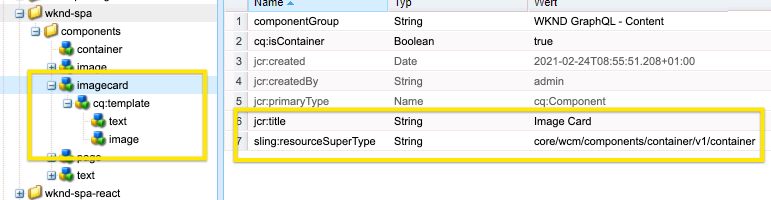

# Composite-Komponenten in SPA {#composite-components-in-spas}

Composite-Komponenten nutzen den modularen Charakter AEM Komponenten, indem sie mehrere Basiskomponenten zu einer Komponente kombinieren. Ein gängiges Anwendungsbeispiel für Composite-Komponenten ist die Kartenkomponente, die aus einer Kombination aus Bild- und Textkomponenten besteht.

Wenn Composite-Komponenten ordnungsgemäß im Editor-Framework für AEM Einzelseiten-Apps (SPA) implementiert sind, können die Inhaltsautoren solche Komponenten wie jede andere Komponente per Drag-and-Drop verschieben, aber dennoch die Möglichkeit haben, jede Komponente, aus der die Composite-Komponente besteht, einzeln zu bearbeiten.

In diesem Artikel wird gezeigt, wie Sie Ihrer Einzelseiten-App eine Composite-Komponente hinzufügen können, um nahtlos mit dem AEM-SPA-Editor zu arbeiten.

## Nutzungsszenario  {#use-case}

In diesem Artikel wird die typische Kartenkomponente als Anwendungsbeispiel verwendet. Karten sind für viele digitale Erlebnisse ein gemeinsames UI-Element und bestehen normalerweise aus einem Bild und zugehörigen Text oder einer Beschriftung. Ein Autor möchte die gesamte Karte per Drag-and-Drop verschieben, aber in der Lage sein, das Kartenbild individuell zu bearbeiten und den zugehörigen Text anzupassen.

## Voraussetzungen {#prerequisites}

Die folgenden Modelle zur Unterstützung der Anwendungsfälle der Composite-Komponente erfordern die folgenden Voraussetzungen.

* Ihre AEM Entwicklungsinstanz wird lokal an Port 4502 mit einem Beispielprojekt ausgeführt.
* Sie haben die funktionierende externe React-App [aktiviert, die in AEM bearbeitet werden kann.](editing-external-spa.md)
* Die React-App wird im AEM-Editor [mit der RemotePage-Komponente geladen.](remote-page.md)

## Hinzufügen von Composite-Komponenten zu einem SPA {#adding-composite-components}

Je nach SPA Implementierung in AEM gibt es drei verschiedene Modelle für die Implementierung Ihrer Composite-Komponente.

* [Die Komponente ist nicht in Ihrem AEM Projekt vorhanden.](#component-does-not-exist)
* [Die Komponente ist in Ihrem AEM Projekt vorhanden, die erforderlichen Inhalte jedoch nicht.](#content-does-not-exist)
* [Die Komponente und der erforderliche Inhalt sind beide in Ihrem AEM Projekt vorhanden.](#both-exist)

In den folgenden Abschnitten finden Sie Beispiele für die Implementierung der einzelnen Fälle mit der Kartenkomponente als Beispiel.

### Die Komponente ist nicht in Ihrem AEM Projekt vorhanden. {#component-does-not-exist}

Erstellen Sie zunächst die Komponenten, aus denen die Composite-Komponente besteht, d. h. Komponenten für das Bild und dessen Text.

1. Erstellen Sie die Textkomponente in Ihrem AEM Projekt.
1. Fügen Sie den entsprechenden `resourceType` aus dem Projekt im Knoten `editConfig` der Komponente hinzu.

   ```text
    resourceType: 'wknd-spa/components/text' 
   ```

1. Verwenden Sie den `withMappable`-Helfer, um die Bearbeitung für die Komponente zu aktivieren.

   ```text
   export const AEMText = withMappable(Text, TextEditConfig); 
   ```

Die Textkomponente ähnelt der folgenden.

```javascript
import React from 'react';
import { withMappable } from '@adobe/aem-react-editable-components';

export const TextEditConfig = {
  emptyLabel: 'Text',
  isEmpty: function(props) {
    return !props || !props.text || props.text.trim().length < 1;
  },
  resourceType: 'wknd-spa/components/text'
};

export const Text = ({ cqPath, richText, text }) => {
  const richTextContent = () => (
    <div className="aem_text"
      id={cqPath.substr(cqPath.lastIndexOf('/') + 1)}
      data-rte-editelement
      dangerouslySetInnerHTML={{__html: text}} />
  );
  return richText ? richTextContent() : (
     <div className="aem_text">{text}</div>
  );
};

export const AEMText = withMappable(Text, TextEditConfig);
```

Wenn Sie eine Bildkomponente auf ähnliche Weise erstellen, können Sie sie dann mit der Komponente `AEMText` zu einer neuen Kartenkomponente kombinieren, indem Sie die Bild- und Textkomponenten als untergeordnete Elemente verwenden.

```javascript
import React from 'react';
import { AEMText } from './AEMText';
import { AEMImage } from './AEMImage';

export const AEMCard = ({ pagePath, itemPath}) => (
  <div>
    <AEMText
       pagePath={pagePath}
       itemPath={`text`} />
    <AEMImage
       pagePath={pagePath}
       itemPath={`image`} />
   </div>
);
```

Diese resultierende Composite-Komponente kann jetzt an einer beliebigen Stelle in der App platziert werden. Der fügt Platzhalter für einen Text und eine Bildkomponente im SPA Editor hinzu. Im folgenden Beispiel wird die Kartenkomponente zur Startseite unter dem Titel hinzugefügt.

```javascript
function Home() {
  return (
    <div className="Home">
      <h2>Current Adventures</h2>
      <AEMCard
        pagePath='/content/wknd-spa/home' />
    </div>
  );
}
```

Dadurch wird ein leerer Platzhalter für einen Text und ein Bild im Editor angezeigt. Bei der Eingabe von Werten für diese mithilfe des Editors werden sie im angegebenen Seitenpfad gespeichert, d. h. `/content/wknd-spa/home` auf der Stammebene mit den in `itemPath` angegebenen Namen.


### Die Komponente ist in Ihrem AEM Projekt vorhanden, die erforderlichen Inhalte jedoch nicht. {#content-does-not-exist}

In diesem Fall wird die Kartenkomponente bereits in Ihrem AEM-Projekt mit Titel- und Bildknoten erstellt. Die untergeordneten Knoten (Text und Bild) verfügen über die entsprechenden Ressourcentypen.



Anschließend können Sie es zu Ihrer SPA hinzufügen und den Inhalt abrufen.

1. Erstellen Sie hierfür eine entsprechende Komponente im SPA. Stellen Sie sicher, dass die untergeordneten Komponenten den entsprechenden AEM Ressourcentypen im SPA Projekt zugeordnet sind. In diesem Beispiel verwenden wir dieselben `AEMText`- und `AEMImage`-Komponenten wie im vorherigen Fall [detailliert.](#component-does-not-exist)

   ```javascript
   import React from 'react';
   import { Container, withMappable, MapTo } from '@adobe/aem-react-editable-components';
   import { Text, TextEditConfig } from './AEMText';
   import Image, { ImageEditConfig } from './AEMImage';
   
   export const AEMCard = withMappable(Container, {
     resourceType: 'wknd-spa/components/imagecard'
   });
   
   MapTo('wknd-spa/components/text')(Text, TextEditConfig);
   MapTo('wknd-spa/components/image')(Image, ImageEditConfig);
   ```

1. Da für die Komponente `imagecard` kein Inhalt vorhanden ist, fügen Sie die Karte zur Seite hinzu. Schließen Sie den vorhandenen Container aus AEM in die SPA ein.
   * Wenn bereits ein Container im AEM Projekt vorhanden ist, können wir ihn stattdessen in die SPA aufnehmen und die Komponente stattdessen aus AEM zum Container hinzufügen.
   * Stellen Sie sicher, dass die Kartenkomponente dem entsprechenden Ressourcentyp im SPA zugeordnet ist.

   ```javascript
   <ResponsiveGrid
    pagePath='/content/wknd-spa/home'
    itemPath='root/responsivegrid' />
   ```

1. Fügen Sie die erstellte Komponente `wknd-spa/components/imagecard` den zulässigen Komponenten für die Container-Komponente [in der Seitenvorlage hinzu.](/help/sites-cloud/authoring/features/templates.md)

Jetzt kann die Komponente `imagecard` direkt zum Container im AEM-Editor hinzugefügt werden.


### Die Komponente und der erforderliche Inhalt sind beide in Ihrem AEM Projekt vorhanden. {#both-exist}

Wenn der Inhalt in AEM vorhanden ist, kann er direkt in die SPA eingefügt werden, indem der Pfad zum Inhalt angegeben wird.

```javascript
<AEMCard
    pagePath='/content/wknd-spa/home'
    itemPath='root/responsivegrid/imagecard' />
```


Die Komponente `AEMCard` entspricht der Definition [im vorherigen Anwendungsfall.](#content-does-not-exist) Hier ist der am oben definierten Speicherort im AEM-Projekt definierte Inhalt im SPA enthalten.
