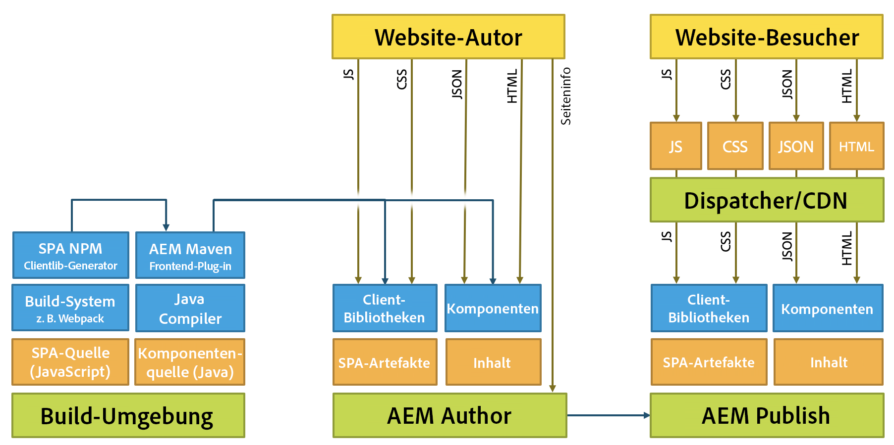

# Entwickeln von SPAs für AEM {#developing-spas-for-aem}

Single Page Applications (SPAs) können ansprechende Erlebnisse für Website-Benutzer bieten. Entwickler möchten Sites mit SPA-Frameworks erstellen und Autoren möchten Inhalte in AEM nahtlos für eine Site bearbeiten, die mit diesen Frameworks erstellt wurde.

Dieser Artikel behandelt wichtige Aspekte, die zu beachten sind, wenn ein Frontend-Entwickler damit beauftragt wird, eine SPA für AEM zu entwickeln. Zudem erhalten Sie einen Überblick über die Architektur von AEM mit Blick auf die Implementierung von SPAs in AEM.

## SPA-Entwicklungsgrundsätze für AEM {#spa-development-principles-for-aem}

Bei der Entwicklung von Single Page Applications in AEM wird davon ausgegangen, dass sich der Frontend-Entwickler beim Erstellen einer SPA an die üblichen Best Practices hält. Wenn Sie als Frontend-Entwickler diese allgemeinen Best Practices sowie einige AEM-spezifische Prinzipien befolgen, wird Ihre SPA mit [AEM und seinen Inhaltsverfassungsfunktionen](introduction.md#content-editing-experience-with-spa) zusammenarbeiten.

* **[Portabilität](#portability)**: Wie alle anderen Komponenten auch sollten die Komponenten so portabel wie möglich gestaltet werden. Die SPA sollte aus portablen und wiederverwendbaren Komponenten bestehen.
* **[AEM verwaltet die Site-Struktur](#aem-drives-site-structure)**: Der Frontend-Entwickler erstellt Komponenten und ist für deren interne Struktur verantwortlich, verlässt sich bei der Definition der Inhaltsstruktur der Site jedoch auf AEM.
* **[Dynamisches Rendering](#dynamic-rendering)**: Alle Rendering-Vorgänge sollten dynamisch sein.
* **[Dynamisches Routing](#dynamic-routing)**: Die SPA ist für das Routing verantwortlich; AEM lauscht darauf und ruft Inhalte auf dieser Basis ab. Jegliches Routing sollte ebenfalls dynamisch sein.

Wenn Sie sich bei der Entwicklung Ihrer SPA an diese Grundsätze halten, wird diese so flexibel und zukunftssicher wie möglich sein sowie die Nutzung aller unterstützten AEM Authoring-Funktionen ermöglichen.

Wenn Sie keine Unterstützung für AEM Authoring-Funktionen benötigen, sollten Sie möglicherweise ein anderes [SPA-Design-Modell](#spa-design-models) in Betracht ziehen.

### Portabilität {#portability}

Wie bei der Entwicklung von Komponenten sollten Ihre Komponenten so gestaltet sein, dass sie maximale Portabilität aufweisen. Alle Muster, die der Portabilität oder Wiederverwendbarkeit der Komponenten zuwiderlaufen, sollten vermieden werden, um Kompatibilität, Flexibilität und Wartbarkeit in Zukunft zu garantieren.

Die resultierende SPA sollte mit hochgradig portablen und wiederverwendbaren Komponenten erstellt werden.

### AEM verwaltet die Site-Struktur {#aem-drives-site-structure}

Der Frontend-Entwickler muss sich als verantwortlich für die Einrichtung einer Bibliothek mit SPA-Komponenten betrachten, die zum Erstellen der App verwendet werden. Der Frontend-Entwickler hat die vollständige Kontrolle über die interne Struktur der Komponenten. [AEM ist jedoch stets für die Struktur der Site verantwortlich.](editor-overview.md)

Das bedeutet, dass der Frontend-Entwickler Kundeninhalte vor oder nach dem Einstiegspunkt der Komponenten hinzufügen und innerhalb der Komponente auch Drittanbieter-Aufrufe durchführen kann. Der Frontend-Entwickler hat jedoch zum Beispiel nicht die volle Kontrolle darüber, wie Komponenten verschachtelt werden.

### Dynamisches Rendering {#dynamic-rendering}

Die SPA sollte sich nur auf dynamisches Rendering von Inhalten stützen. Dies ist die Standarderwartung, bei der AEM alle untergeordneten Elemente der Inhaltsstruktur abruft und rendert.

Jedes explizite Rendering, das auf bestimmte Inhalte verweist, gilt als statisches Rendering und wird zwar unterstützt, ist jedoch nicht mit den Inhaltserstellungsfunktionen von AEM kompatibel. Es widerspricht auch dem Grundsatz der [Portabilität](#portability).

### Dynamisches Routing {#dynamic-routing}

Wie beim Rendering auch sollte das gesamte Routing dynamisch sein. In AEM sollte [die SPA stets für das Routing verantwortlich sein](routing.md); AEM lauscht darauf und ruft Inhalte auf dieser Basis ab.

Jedes statische Routing verstößt gegen den [Grundsatz der Portabilität](#portability) und schränkt den Autor ein, da es nicht mit den Inhaltserstellungsfunktionen von AEM kompatibel ist. Bei statischem Routing müsste der Inhaltsautor beispielsweise, wenn eine Route oder Seite geändert werden soll, den Frontend-Entwickler bitten, diese Aufgabe zu übernehmen.

## AEM-Projektarchetyp {#aem-project-archetype}

Für jedes AEM-Projekt sollte der [AEM-Projektarchetyp](https://docs.adobe.com/content/help/de-DE/experience-manager-core-components/using/developing/archetype/overview.html) genutzt werden, der SPA-Projekte mithilfe von React oder Angular unterstützt und das SPA SDK verwendet.

## SPA-Design-Modelle {#spa-design-models}

Wenn die [Prinzipien der Entwicklung von SPAs in AEM](#spa-development-principles-for-aem) befolgt werden, wird Ihre SPA mit allen unterstützten Inhaltserstellungsfunktionen von AEM zusammenarbeiten.

Es kann jedoch Fälle geben, in denen dies nicht wirklich erforderlich ist. Die folgende Tabelle bietet einen Überblick über die verschiedenen Design-Modelle sowie ihre Vor- und Nachteile.

<table>
 <tbody>
  <tr>
   <th><strong>Design-Modell  </strong></th>
   <th><strong>Vorteile</strong></th>
   <th><strong>Nachteile</strong></th>
  </tr>
  <tr>
   <td>AEM wird als Headless-CMS ohne das <a href="/help/implementing/developing/hybrid/reference-materials.md">SPA Editor SDK-Framework</a> verwendet.</td>
   <td>Der Frontend-Entwickler hat die vollständige Kontrolle über die App.</td>
   <td>
Inhaltsautoren können das Inhaltserstellungserlebnis von AEM nicht nutzen.
 
Der Code ist weder portabel noch wiederverwendbar, wenn er statische Referenzen oder statisches Routing enthält.
 
Eine Verwendung des Vorlageneditors ist nicht zulässig. Daher muss der Frontend-Entwickler bearbeitbare Vorlagen über das JCR verwalten.
 </td>
  </tr>
  <tr>
   <td>Der Frontend-Entwickler verwendet das SPA Editor SDK-Framework, gibt für den Inhaltsautor jedoch nur ausgewählte Bereiche frei.</td>
   <td>Der Entwickler behält die Kontrolle über die App, indem er Authoring nur in eingeschränkten Bereichen der App aktiviert.</td>
   <td>
Autoren von Inhalten sind auf eine begrenzte Anzahl von AEM-Inhaltserstellungsfunktionen beschränkt.
 
Der Code ist möglicherweise weder portabel noch wiederverwendbar, wenn er statische Referenzen oder statisches Routing enthält.
 
Eine Verwendung des Vorlageneditors ist nicht zulässig. Daher muss der Frontend-Entwickler bearbeitbare Vorlagen über das JCR verwalten.
 </td>
  </tr>
  <tr>
   <td>Das Projekt nutzt komplett das SPA Editor SDK, die Frontend-Komponenten werden als Bibliothek entwickelt und die Verwaltung der Inhaltsstruktur der App wird an AEM übertragen.</td>
   <td>
Die App ist wiederverwendbar und portabel.
 
Der Inhaltsautor kann die App mit den Inhaltserstellungsfunktionen von AEM bearbeiten.  
 
Die SPA ist mit dem Vorlageneditor kompatibel.
 </td>
   <td>
Der Entwickler hat keine Kontrolle über die Struktur der App und den Teil des Inhalts, der an AEM delegiert wurde.
 
Der Entwickler kann aber Bereiche der App für Inhalte reservieren, die nicht mit AEM erstellt werden sollen.
 </td>
  </tr>
 </tbody>
</table>

>[!NOTE]
>
>Zwar werden in AEM alle Modelle unterstützt, doch können Inhaltsautoren nur durch Implementierung des dritten Modells (und damit nach den empfohlenen [SPA-Entwicklungsprinzipien in AEM](#spa-development-principles-for-aem)) wie gewohnt mit dem Inhalt der SPA in AEM interagieren bzw. diesen bearbeiten.

## Migrieren vorhandener SPAs zu AEM {#migrating-existing-spas-to-aem}

Wenn Ihre SPA die [SPA-Entwicklungsprinzipien für AEM](#spa-development-principles-for-aem) einhält, funktioniert Ihre SPA in AEM und ist mit dem AEM-SPA-Editor bearbeitbar.

Führen Sie die folgenden Schritte aus, um Ihre bestehende SPA für die Zusammenarbeit mit AEM bereit zu machen.

1. **Gestalten Sie Ihre JS-Komponenten modular.** – Gestalten Sie sie so, dass sie in beliebiger Reihenfolge, Position und Größe gerendert werden können.
1. **Verwenden Sie die von unserem SDK bereitgestellten Container, um Ihre Komponenten auf dem Bildschirm zu platzieren.** – AEM bietet eine Seiten- und Absatzsystemkomponente, die Sie verwenden können.
1. **Erstellen Sie für jede JS-Komponente eine AEM-Komponente.** - Die AEM-Komponenten definieren den Dialog und die JSON-Ausgabe.

## Anweisungen für Frontend-Entwickler {#instructions-for-front-end-developers}

Wenn ein Frontend-Entwickler damit beauftragt wird, eine SPA für AEM zu erstellen, besteht die wichtigste Aufgabe darin, sich auf die Komponenten und ihre JSON-Modelle zu einigen.

Im Folgenden werden die Schritte erläutert, die ein Frontend-Entwickler bei der Entwicklung einer SPA für AEM erledigen muss.

1. **Einigen Sie sich hinsichtlich der Komponenten und ihrer JSON-Modelle**

   Frontend-Entwickler und Backend-AEM-Entwickler müssen sich auf die erforderlichen Komponenten und ein Modell einigen, damit eine Eins-zu-Eins-Übereinstimmung der SPA-Komponenten mit den Backend-Komponenten besteht.

   AEM-Komponenten sind weiterhin erforderlich, insbesondere um Bearbeitungsdialogfelder bereitzustellen und das Komponentenmodell zu exportieren.

1. **In React-Komponenten greifen Sie auf das Modell zu über`this.props.cqModel`**

   Sobald Komponenten vereinbart sind und das JSON-Modell vorhanden ist, kann der Frontend-Entwickler die SPA entwickeln und über `this.props.cqModel` bequem auf das JSON-Modell zugreifen.

1. **Implementieren Sie die `render()`-Methode der Komponente**

   Der Frontend-Entwickler implementiert die `render()`-Methode nach Belieben und kann die Felder der `cqModel`-Eigenschaft verwenden. Dadurch werden das DOM und die HTML-Fragmente ausgegeben, die in die Seite eingefügt werden. Dabei handelt es sich um die Standardmethode zur Erstellung einer App in React.

1. **Ordnen Sie die Komponente dem AEM-Ressourcentyp zu via`MapTo()`**

   Die Zuordnung speichert Komponentenklassen und wird von der bereitgestellten `Container`-Komponente intern zum Abrufen und dynamischen Instanziieren von Komponenten basierend auf dem angegebenen Ressourcentyp genutzt.

   Sie dient als „Kleber“ zwischen Front- und Backend, sodass der Editor weiß, welchen Komponenten die React-Komponenten entsprechen.

   `Page` und `ResponsiveGrid` sind gute Beispiele für Klassen, die den grundlegenden `Container` erweitern.

1. **Definieren Sie den `EditConfig`-Parameter der Komponente als`MapTo()`**

   Dieser Parameter teilt dem Editor mit, wie die Komponente benannt werden soll, solange sie noch nicht gerendert ist oder über keinen zu rendernden Inhalt verfügt.

1. **Erweitern Sie die bereitgestellte `Container`-Klasse für Seiten und Container**

   Seiten und Absatzsysteme sollten diese Klasse erweitern, damit die Übertragung an innere Komponenten erwartungsgemäß funktioniert.

1. **Implementieren Sie eine Routing-Lösung, die die HTML5-`History`-API verwendet.**

   Wenn der `ModelRouter` aktiviert ist, löst der Aufruf der Funktionen `pushState` und `replaceState` eine Anfrage an den `PageModelManager` aus, ein fehlendes Fragment des Modells abzurufen.

   Die aktuelle Version von `ModelRouter` unterstützt nur eine Verwendung von URLs, die auf den tatsächlichen Ressourcenpfad von Sling Model-Einstiegspunkten verweisen. Der Einsatz von Vanity-URLs oder Aliasen wird nicht unterstützt.

   Der `ModelRouter` kann deaktiviert oder so konfiguriert werden, dass eine Liste von regulären Ausdrücken ignoriert wird.

## AEM-Agnostik {#aem-agnostic}

Diese Code-Blöcke veranschaulichen, dass Ihre React- und Angular-Komponenten nichts Spezifisches für Adobe oder AEM benötigen.

* Alles, was sich in der JavaScript-Komponente befindet, ist AEM-agnostisch.
* AEM-spezifisch jedoch ist, dass die JS-Komponente mit dem MapTo-Hilfsprogramm einer AEM-Komponente zugeordnet werden muss.

Das `MapTo`-Hilfsprogramm ist der „Kleber“, der eine Abstimmung zwischen Backend- und Frontend-Komponenten ermöglicht:

* Es teilt dem JS-Container (oder dem JS-Absatzsystem) mit, welche JS-Komponente für das Rendern der einzelnen Komponenten, die in der JSON vorhanden sind, verantwortlich ist.
* Es wird ein HTML-Datenattribut zum HTML-Code hinzugefügt, das die JS-Komponente rendert, damit der SPA-Editor weiß, welches Dialogfeld dem Autor beim Bearbeiten der Komponente angezeigt werden soll.

Weitere Informationen zum Verwenden von `MapTo` und Erstellen von SPAs für AEM im Allgemeinen finden Sie im Handbuch „Erste Schritte“ für Ihr ausgewähltes Framework.

* [Erste Schritte mit SPAs in AEM unter Verwendung von React](getting-started-react.md)
* [Erste Schritte mit SPAs in AEM unter Verwendung von Angular](getting-started-angular.md)

## AEM-Architektur und SPAs {#aem-architecture-and-spas}

Die allgemeine Architektur von AEM einschließlich Umgebungen für Entwicklung, Authoring und Veröffentlichung ändert sich bei Verwendung von SPAs nicht. Es ist jedoch hilfreich zu verstehen, wie die SPA-Entwicklung mit dieser Architektur verbunden ist.

* **Build-Umgebung**

   Hier werden die Quelle für die SPA-Anwendungsquelle sowie die Komponentenquelle ausgecheckt.

   * Der NPM-clientlib-Generator erstellt aus dem SPA-Projekt eine Client-Bibliothek.
   * Diese Bibliothek wird von Maven verwendet und vom Maven Build-Plugin zusammen mit der Komponente für den AEM Author bereitgestellt.

* **AEM Author**

   Inhalte werden im AEM Author erstellt, einschließlich der Authoring-SPAs.

   Wenn eine SPA in der Authoring-Umgebung mit dem SPA-Editor bearbeitet wird:

   1. Die SPA fordert den äußeren HTML-Code an.
   1. Das CSS wird geladen.
   1. Das JavaScript der SPA-Anwendung wird geladen.
   1. Sobald die SPA-Anwendung ausgeführt wird, wird die JSON angefordert, damit die App das DOM der Seite einschließlich der `cq-data`-Attribute erstellen kann.
   1. Diese `cq-data`-Attribute ermöglichen es dem Editor, zusätzliche Seiteninformationen zu laden, sodass er weiß, welche Bearbeitungskonfigurationen für die Komponenten verfügbar sind.

* **AEM Publish**

   Hier werden die erstellten Inhalte und kompilierten Bibliotheken einschließlich SPA-Anwendungsartefakten, clientlibs und Komponenten für den öffentlichen Gebrauch veröffentlicht.

* **Dispatcher/CDN**

   Der Dispatcher dient für Besucher der Site als Zwischenspeicherebene von AEM.
   * Anforderungen werden ähnlich wie im AEM Author verarbeitet, es erfolgt jedoch keine Anforderung der Seiteninformationen, da diese nur vom Editor benötigt werden.
   * JavaScript, CSS, JSON und HTML werden zwischengespeichert, wodurch die Seite für eine schnelle Bereitstellung optimiert wird.

>[!NOTE]
>
>In AEM gibt es keine Notwendigkeit, JavaScript-Build-Mechanismen oder das JavaScript selbst auszuführen. AEM hostet lediglich die kompilierten Artefakte aus der SPA-Anwendung.

## Nächste Schritte {#next-steps}

* [Erste Schritte mit SPAs in AEM unter Verwendung von React](getting-started-react.md) zeigt, wie unter Verwendung von React eine einfache SPA für die Zusammenarbeit mit dem SPA-Editor in AEM erstellt wird.
* [Erste Schritte mit SPAs in AEM unter Verwendung von Angular](getting-started-angular.md) zeigt, wie unter Verwendung von Angular eine einfache SPA für die Zusammenarbeit mit dem SPA-Editor in AEM erstellt wird.
* [SPA-Editor – Überblick](editor-overview.md) vertieft das Kommunikationsmodell zwischen AEM und der SPA.
* [WKND-SPA-Projekt](wknd-tutorial.md) ist ein Schritt-für-Schritt-Tutorial zur Implementierung eines einfachen SPA-Projekts in AEM.
* [Dynamisches Modell zur Komponentenzuordnung für SPAs](model-to-component-mapping.md) erläutert das dynamische Modell für die Komponentenzuordnung und dessen Funktionsweise innerhalb von SPAs in AEM.
* [SPA-Blueprint](blueprint.md) bietet genaue Einblicke in die Funktionsweise des SPA-SDKs für AEM, wenn Sie SPAs in AEM für ein anderes Framework als React oder Angular implementieren möchten oder sich einfach ein tieferes Verständnis wünschen.
