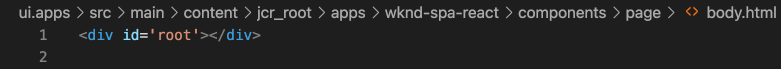

# Bearbeiten eines externen SPA innerhalb von AEM {#editing-external-spa-within-aem}

Bei der Entscheidung darüber, welche Integrationsstufe](/help/implementing/developing/headful-headless.md) Sie zwischen Ihren externen SPA und AEM haben möchten, müssen Sie die SPA in AEM häufig bearbeiten und Ansicht vornehmen können.[

## Überblick {#overview}

In diesem Dokument werden die empfohlenen Schritte zum Hochladen eines eigenständigen SPA zu einer AEM Instanz, zum Hinzufügen bearbeitbarer Inhaltsabschnitte und zum Aktivieren des Authoring beschrieben.

## Voraussetzungen {#prerequisites}

Die Voraussetzungen sind einfach.

* Stellen Sie sicher, dass eine Instanz von AEM lokal ausgeführt wird.
* Erstellen Sie ein AEM SPA Projekt mit [dem AEM Projektarchiv.](https://experienceleague.adobe.com/docs/experience-manager-core-components/using/developing/archetype/overview.html?#available-properties)
   * Dies wird die Grundlage des AEM Projekts bilden, das aktualisiert wird, um die externen SPA einzubeziehen.
   * Für die Beispiele in diesem Dokument verwenden wir den Ausgangspunkt von [dem WKND-SPA.](https://experienceleague.adobe.com/docs/experience-manager-learn/sites/spa-editor/spa-editor-framework-feature-video-use.html#spa-editor)
* Lassen Sie die funktionierenden, externen React SPA, die Sie integrieren möchten.

## SPA in AEM Projekt {#upload-spa-to-aem-project} hochladen

Zunächst müssen Sie die externen SPA in Ihr AEM Projekt hochladen.

1. Ersetzen Sie `src` im Projektordner `/ui.frontend` durch den Ordner `src` der React-Anwendung.
1. Schließen Sie alle weiteren Abhängigkeiten in der Datei `package.json` der App in die Datei `/ui.frontend/package.json` ein.
   * Stellen Sie sicher, dass die SPA SDK-Abhängigkeiten von [empfohlenen Versionen sind.](/help/implementing/developing/hybrid/getting-started-react.md#dependencies)
1. Schließen Sie alle Anpassungen im Ordner `/public` ein.
1. Schließen Sie alle Inline-Skripte oder Stile ein, die der Datei `/public/index.html` hinzugefügt wurden.

## Konfigurieren der Remote-SPA {#configure-remote-spa}

Nun, da die externe SPA Teil Ihres AEM ist, muss sie in AEM konfiguriert werden.

### Adobe SPA SDK-Pakete einschließen {#include-spa-sdk-packages}

Um AEM SPA Funktionen nutzen zu können, gibt es Abhängigkeiten von den folgenden drei Paketen.

* [`@adobe/aem-react-editable-components`](https://github.com/adobe/aem-react-editable-components)
* [`@adobe/aem-spa-component-mapping`](https://www.npmjs.com/package/@adobe/aem-spa-component-mapping)
* [`@adobe/aem-spa-page-model-manager`](https://www.npmjs.com/package/@adobe/aem-spa-model-manager)

`@adobe/aem-spa-page-model-manager` stellt die API zum Initialisieren eines Modell-Managers und zum Abrufen des Modells aus der AEM-Instanz bereit. Dieses Modell kann dann verwendet werden, um AEM Komponenten mithilfe von APIs von `@adobe/aem-react-editable-components` und `@adobe/aem-spa-component-mapping` zu rendern.

#### Installation {#installation}

Führen Sie den folgenden Befehl npm aus, um die erforderlichen Pakete zu installieren.

```shell
npm install --save @adobe/aem-spa-component-mapping @adobe/aem-spa-page-model-manager @adobe/aem-react-editable-components
```

### ModelManager-Initialisierung {#model-manager-initialization}

Bevor die App gerendert wird, muss das [`ModelManager`](/help/implementing/developing/hybrid/blueprint.md#pagemodelmanager) initialisiert werden, um die Erstellung des AEM `ModelStore` zu verarbeiten.

Dies muss innerhalb der `src/index.js`-Datei Ihrer Anwendung oder überall dort erfolgen, wo der Stamm der Anwendung gerendert wird.

Dazu können wir die `initializationAsync`-API verwenden, die von `ModelManager` bereitgestellt wird.

Der folgende Screenshot zeigt, wie die Initialisierung von `ModelManager` in einer einfachen React-Anwendung aktiviert wird. Die einzige Einschränkung ist, dass `initializationAsync` vor `ReactDOM.render()` aufgerufen werden muss.


In diesem Beispiel wird `ModelManager` initialisiert und ein leeres `ModelStore` erstellt.

`initializationAsync` kann optional ein  `options` Objekt als Parameter akzeptieren:

* `path` - Bei der Initialisierung wird das Modell am definierten Pfad abgerufen und im  `ModelStore`gespeichert. Auf diese Weise können Sie bei Bedarf die `rootModel` bei der Initialisierung abrufen.
* `modelClient` - Ermöglicht die Bereitstellung eines benutzerdefinierten Clients, der für das Abrufen des Modells verantwortlich ist.
* `model` - Ein  `model` Objekt, das als Parameter übergeben wird, der normalerweise bei der  [Verwendung von SSR gefüllt wird.](/help/implementing/developing/hybrid/ssr.md)

### AEM Komponenten mit autorisiertem Blatt {#authorable-leaf-components}

1. Erstellen/identifizieren Sie eine AEM Komponente, für die eine maßgebliche React-Komponente erstellt wird. In diesem Beispiel verwenden wir die Textkomponente des WKND-Projekts.

   

1. Erstellen Sie eine einfache React-Textkomponente im SPA. In diesem Beispiel wurde eine neue Datei `Text.js` mit folgendem Inhalt erstellt.

   

1. Erstellen Sie ein Konfigurationsobjekt, um die Attribute anzugeben, die für die Aktivierung AEM Bearbeitung erforderlich sind.

   

   * `resourceType` ist zwingend erforderlich, um die React-Komponente der AEM Komponente zuzuordnen und die Bearbeitung zu aktivieren, wenn Sie im AEM Editor geöffnet werden.

1. Verwenden Sie die Wrapper-Funktion `withMappable`.

   

   Diese Wrapper-Funktion ordnet die React-Komponente dem in der Konfiguration angegebenen AEM `resourceType` zu und aktiviert Bearbeitungsfunktionen, wenn sie im AEM Editor geöffnet wird. Bei eigenständigen Komponenten wird auch der Modellinhalt für den jeweiligen Knoten abgerufen.

   >[!NOTE]
   >
   >In diesem Beispiel gibt es separate Versionen der Komponente: AEM umschlossene und entpackte React-Komponenten. Die umgebrochene Version muss verwendet werden, wenn die Komponente explizit verwendet wird. Wenn die Komponente Teil einer Seite ist, können Sie weiterhin die Standardkomponente verwenden, wie derzeit im SPA-Editor ausgeführt.

1. Inhalte in der Komponente rendern

   Die JCR-Eigenschaften der Textkomponente werden wie folgt in AEM angezeigt.

   

   Diese Werte werden als Eigenschaften an die neu erstellte Komponente `AEMText` React übergeben und können zum Rendern des Inhalts verwendet werden.

   ```javascript
   import React from 'react';
   import { withMappable } from '@adobe/aem-react-editable-components';
   
   export const TextEditConfig = {
       // Empty component placeholder label
       emptyLabel:'Text', 
       isEmpty:function(props) {
          return !props || !props.text || props.text.trim().length < 1;
       },
       // resourcetype of the AEM counterpart component
       resourceType:'wknd-spa-react/components/text'
   };
   
   const Text = ({ text }) => (<div>{text}</div>);
   
   export default Text;
   
   export const AEMText = withMappable(Text, TextEditConfig);
   ```

   So wird die Komponente angezeigt, wenn die AEM Konfigurationen abgeschlossen sind.

   ```javascript
   const Text = ({ cqPath, richText, text }) => {
      const richTextContent = () => (
         <div className="aem_text" id={cqPath.substr(cqPath.lastIndexOf('/') + 1)} data-rte-editelement dangerouslySetInnerHTML={{__html: text}}/>
      );
      return richText ? richTextContent() : (<div className="aem_text">{text}</div>);
   };
   ```

   >[!NOTE]
   >
   >In diesem Beispiel haben wir weitere Anpassungen an der gerenderten Komponente vorgenommen, um sie an die vorhandene Textkomponente anzupassen. Dies steht jedoch nicht im Zusammenhang mit dem Authoring in AEM.

#### hinzufügen von autorisierten Komponenten auf der Seite {#add-authorable-component-to-page}

Nachdem die aussagekräftigen React-Komponenten erstellt wurden, können wir sie in der gesamten Anwendung verwenden.

Nehmen wir eine Beispielseite, auf der wir einen Text aus dem WKND SPA Projekt hinzufügen müssen. In diesem Beispiel möchten wir den Text &quot;Hello World!&quot;anzeigen. Beim `/content/wknd-spa-react/us/en/home.html`.

1. Legen Sie den Pfad der anzuzeigenden Node fest.

   * `pagePath`: Die Seite, die den Knoten enthält, in unserem Beispiel  `/content/wknd-spa-react/us/en/home`
   * `itemPath`: Pfad zum Knoten innerhalb der Seite, in unserem Beispiel  `root/responsivegrid/text`
      * Dieser besteht aus den Namen der enthaltenen Elemente auf der Seite.

   

1. hinzufügen Komponente an der erforderlichen Position auf der Seite.

   

   Die Komponente `AEMText` kann an der erforderlichen Position auf der Seite hinzugefügt werden, wobei die Werte `pagePath` und `itemPath` als Eigenschaften festgelegt sind. `pagePath` ist eine obligatorische Eigenschaft.

#### Bearbeitung von Textinhalten auf AEM {#verify-text-edit} überprüfen

Jetzt können wir die Komponente auf unserer laufenden AEM testen.

1. Führen Sie den folgenden Maven-Befehl aus dem Ordner `aem-guides-wknd-spa` aus, um das Projekt zu erstellen und AEM bereitzustellen.

```shell
mvn clean install -PautoInstallSinglePackage
```

1. Navigieren Sie auf Ihrer AEM zu `http://<host>:<port>/editor.html/content/wknd-spa-react/us/en/home.html`.


Die Komponente `AEMText` ist jetzt auf AEM autorisiert.

### AEM autorisierbare Seiten {#aem-authorable-pages}

1. Identifizieren Sie eine Seite, die zum Authoring in der SPA hinzugefügt werden soll. In diesem Beispiel wird `/content/wknd-spa-react/us/en/home.html` verwendet.
1. Erstellen Sie eine neue Datei (z. `Page.js`) für die maßgebliche Seitenkomponente. Hier können wir die in `@adobe/cq-react-editable-components` bereitgestellte Seitenkomponente wiederverwenden.
1. Wiederholen Sie Schritt 4 im Abschnitt [AEM autorfähigen Blattkomponenten.](#authorable-leaf-components) Verwenden Sie die Wrapper-Funktion  `withMappable` für die Komponente.
1. Wenden Sie wie zuvor `MapTo` auf die AEM Ressourcentypen für alle untergeordneten Komponenten auf der Seite an.

   ```javascript
   import { Page, MapTo, withMappable } from '@adobe/aem-react-editable-components';
   import Text, { TextEditConfig } from './Text';
   
   export default withMappable(Page);
   
   MapTo('wknd-spa-react/components/text')(Text, TextEditConfig);
   ```

   >[!NOTE]
   >
   >In diesem Beispiel verwenden wir die entpackte React-Textkomponente anstelle der zuvor erstellten umschlossenen `AEMText`. Dies liegt daran, dass der Container, wenn die Komponente Teil einer Seite/eines Containers ist und nicht eigenständig ist, dafür sorgt, dass die Komponente rekursiv zugeordnet wird und die Authoring-Funktionen aktiviert werden, und dass der zusätzliche Wrapper nicht für jedes untergeordnete Element benötigt wird.

1. Gehen Sie wie im Abschnitt [Zulässige Komponenten auf der Seite Hinzufügen, um eine durchlaufbare Seite in die SPA einzufügen.](#add-authorable-component-to-page) Hier können wir die  `itemPath` Eigenschaft jedoch überspringen.

#### Seiteninhalt bei AEM {#verify-page-content} überprüfen

Um zu überprüfen, ob die Seite bearbeitet werden kann, führen Sie die gleichen Schritte im Abschnitt [Textinhalt auf AEM überprüfen.](#verify-text-edit)


Die Seite kann jetzt auf AEM mit einem Layout-Container und einer untergeordneten Textkomponente bearbeitet werden.

### Virtuelle Blattkomponenten {#virtual-leaf-components}

In den vorherigen Beispielen haben wir der SPA Komponenten mit vorhandenem AEM hinzugefügt. Es gibt jedoch Fälle, in denen Inhalte noch nicht in AEM erstellt wurden, die jedoch später vom Inhaltsautor hinzugefügt werden müssen. Um dies zu ermöglichen, kann der Front-End-Entwickler Komponenten an den entsprechenden Stellen im SPA hinzufügen. Diese Komponenten zeigen Platzhalter an, wenn sie im Editor in AEM geöffnet werden. Sobald der Inhalt innerhalb dieser Platzhalter vom Inhaltsersteller hinzugefügt wurde, werden Knoten in der JCR-Struktur erstellt und der Inhalt bleibt erhalten. Die erstellte Komponente ermöglicht die gleiche Gruppe von Vorgängen wie die eigenständigen Blattkomponenten.

In diesem Beispiel verwenden wir die zuvor erstellte Komponente `AEMText` erneut. Wir möchten, dass unter der bestehenden Textkomponente der WKND-Startseite ein neuer Text eingefügt wird. Das Hinzufügen von Komponenten ist dasselbe wie bei normalen Blattkomponenten. Das `itemPath` kann jedoch auf den Pfad aktualisiert werden, in dem die neue Komponente hinzugefügt werden muss.

Da die neue Komponente unter dem vorhandenen Text unter `root/responsivegrid/text` hinzugefügt werden muss, lautet der neue Pfad `root/responsivegrid/{itemName}`.

```html
<AEMText
 pagePath='/content/wknd-spa-react/us/en/home'
 itemPath='root/responsivegrid/text_20' />
```

Die Komponente `TestPage` sieht nach dem Hinzufügen der virtuellen Komponente wie folgt aus.


>[!NOTE]
>
>Stellen Sie sicher, dass die Komponente `AEMText` in der Konfiguration ihre `resourceType`-Eigenschaft eingestellt hat, um diese Funktion zu aktivieren.

Sie können jetzt die Änderungen an AEM entsprechend den Schritten im Abschnitt [Bearbeitung von Textinhalten bei AEM bereitstellen.](#verify-text-edit) Ein Platzhalter wird für den derzeit nicht vorhandenen  `text_20` Knoten angezeigt.


Wenn der Inhaltsersteller diese Komponente aktualisiert, wird unter `root/responsivegrid/text_20` ein neuer `text_20`-Knoten erstellt.`/content/wknd-spa-react/us/en/home`


#### Anforderungen und Einschränkungen {#limitations}

Es gibt eine Reihe von Anforderungen zum Hinzufügen von Komponenten für virtuelle Blätter sowie einige Einschränkungen.

* Die `pagePath`-Eigenschaft ist zum Erstellen einer virtuellen Komponente obligatorisch.
* Der am Pfad in `pagePath` bereitgestellte Seitenknoten muss im AEM Projekt vorhanden sein.
* Der Name des zu erstellenden Knotens muss im `itemPath` angegeben werden.
* Die Komponente kann auf jeder Ebene erstellt werden.
   * Wenn wir im vorherigen Beispiel ein `itemPath='text_20'` angeben, wird der neue Knoten direkt unter der Seite erstellt, d.h. `/content/wknd-spa-react/us/en/home/jcr:content/text_20`
* Der Pfad zum Knoten, auf dem eine neue Node erstellt wird, muss gültig sein, wenn er über `itemPath` bereitgestellt wird.
   * In diesem Beispiel muss `root/responsivegrid` vorhanden sein, damit der neue Knoten `text_20` dort erstellt werden kann.
* Es wird nur die Erstellung von Blattkomponenten unterstützt. Virtual Container und page werden in zukünftigen Versionen unterstützt.

## Zusätzliche Anpassungen {#additional-customizations}

Wenn Sie die vorherigen Beispiele befolgt haben, können Sie Ihre externe SPA jetzt innerhalb von AEM bearbeiten. Es gibt jedoch zusätzliche Aspekte Ihrer externen SPA, die Sie weiter anpassen können.

### Stammknoten-ID {#root-node-id}

Standardmäßig wird davon ausgegangen, dass die React-Anwendung innerhalb einer `div` der Element-ID `spa-root` gerendert wird. Bei Bedarf können Sie dies anpassen.

Nehmen wir beispielsweise an, wir haben eine SPA, in der die Anwendung innerhalb einer `div` der Element-ID `root` gerendert wird. Dies muss in drei Dateien widergespiegelt werden.

1. Im `index.js` der React-Anwendung (oder bei der `ReactDOM.render()` aufgerufen wird)

   

1. Im Schritt `index.html` des React-Antrags

   

1. Führen Sie zwei Schritte aus, um im Seitenkomponententkörper der AEM App:

   1. Erstellen Sie ein neues `body.html` für die Seitenkomponente.

   

   1. hinzufügen das neue Stammelement in der neuen `body.html`-Datei.

   

### Bearbeiten einer SPA mit Routing {#editing-react-spa-with-routing}

Wenn die externe React-SPA-Anwendung über mehrere Seiten verfügt, kann [sie mithilfe von Routing die zu rendernde Seite/Komponente bestimmen.](/help/implementing/developing/hybrid/routing.md) Der grundlegende Verwendungsfall besteht darin, die derzeit aktive URL mit dem Pfad zu vergleichen, der für eine Route angegeben wurde. Um die Bearbeitung in solchen Routing-fähigen Anwendungen zu ermöglichen, muss der Pfad, der mit den entsprechenden Pfaden übereinstimmen soll, transformiert werden, damit AEM spezifische Informationen aufgenommen werden können.

Im folgenden Beispiel haben wir eine einfache React-Anwendung mit zwei Seiten. Die wiederzugebende Seite wird durch Abgleich des dem Router bereitgestellten Pfads mit der aktiven URL bestimmt. Beispiel: Wenn wir `mydomain.com/test` verwenden, wird `TestPage` gerendert.


Um die Bearbeitung in AEM für dieses Beispiel SPA zu aktivieren, sind die folgenden Schritte erforderlich.

1. Identifizieren Sie die Ebene, die als Grundlage für AEM fungieren würde.

   * Für unser Beispiel erwägen wir die Basis der SPA. Das bedeutet, dass vor diesem Pfad nur Seiten/Inhalte AEM sind.

1. Erstellen Sie eine neue Seite auf der erforderlichen Ebene.

   * In diesem Beispiel lautet die zu bearbeitende Seite `mydomain.com/test`. `test` befindet sich im Stammpfad der App. Dies muss auch beim Erstellen der Seite in AEM beibehalten werden. Daher können wir eine neue Seite auf der im vorherigen Schritt definierten Stammebene erstellen.
   * Die neu erstellte Seite muss denselben Namen haben wie die zu bearbeitende Seite. In diesem Beispiel für `mydomain.com/test` muss die neue Seite `/path/to/aem/root/test` erstellt werden.

1. hinzufügen Helfer innerhalb SPA Routings.

   * Die neu erstellte Seite gibt den erwarteten Inhalt noch nicht in AEM wieder. Der Grund dafür ist, dass der Router einen Pfad von `/test` erwartet, während der AEM aktive Pfad `/wknd-spa-react/us/en/test` ist. Um den AEM-spezifischen Teil der URL aufzunehmen, müssen wir einige Helfer auf der SPA Seite hinzufügen.

   

   * Dazu kann der `toAEMPath` Helfer verwendet werden, der von `@adobe/cq-spa-page-model-manager` bereitgestellt wird. Er transformiert den Pfad, der für Routing bereitgestellt wird, um AEM spezifische Bereiche einzuschließen, wenn die Anwendung auf einer AEM Instanz geöffnet ist. Es akzeptiert drei Parameter:
      * Der zum Routing erforderliche Pfad
      * Die Herkünfte-URL der AEM Instanz, in der die SPA bearbeitet wird
      * Der Projektstamm auf AEM, wie im ersten Schritt festgelegt
   * Diese Werte können für mehr Flexibilität als Umgebung-Variablen festgelegt werden.


1. Überprüfen Sie die Bearbeitung der Seite in AEM.

   * Stellen Sie das Projekt AEM bereit und navigieren Sie zur neu erstellten `test`-Seite. Der Seiteninhalt wird jetzt gerendert und AEM Komponenten können bearbeitet werden.

## Zusätzliche Ressourcen {#additional-resources}

Das folgende Referenzmaterial kann hilfreich sein, um SPA im Kontext der AEM zu verstehen.

* [Kopflos und Kopflos in AEM](/help/implementing/developing/headful-headless.md)
* [AEM Projektarchiv](https://experienceleague.adobe.com/docs/experience-manager-core-components/using/developing/archetype/overview.html)
* [Das WKND-SPA](https://experienceleague.adobe.com/docs/experience-manager-learn/sites/spa-editor/spa-editor-framework-feature-video-use.html)
* [Erste Schritte mit SPAs in AEM unter Verwendung von React](/help/implementing/developing/hybrid/getting-started-react.md)
* [SPA Referenzmaterialien (API-Referenzen)](/help/implementing/developing/hybrid/reference-materials.md)
* [SPA Blueprint und PageModelManager](/help/implementing/developing/hybrid/blueprint.md#pagemodelmanager)
* [SPA-Modell-Routing](/help/implementing/developing/hybrid/routing.md)
* [Single Page Applications (SPAs) und Server-seitiges Rendering](/help/implementing/developing/hybrid/ssr.md)
