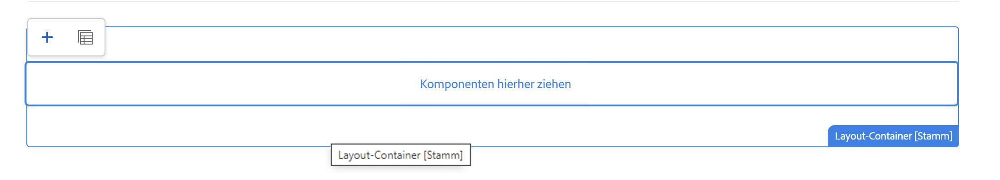

# Bearbeiten einer externen SPA in AEM {#editing-external-spa-within-aem}

Bei der Entscheidung, [welchen Grad der Integration](/help/implementing/developing/headful-headless.md) Sie zwischen Ihrer externen SPA und AEM haben möchten, sollten Sie bedenken, dass Sie die SPA häufig in AEM anzeigen und bearbeiten können müssen.

{{ue-over-spa}}

## Überblick {#overview}

In diesem Dokument werden die empfohlenen Schritte zum Hochladen einer eigenständigen SPA in eine AEM-Instanz, zum Hinzufügen bearbeitbarer Inhaltsabschnitte und zum Aktivieren des Authoring beschrieben.

## Voraussetzungen {#prerequisites}

Die Voraussetzungen sind einfach.

* Stellen Sie sicher, dass eine Instanz von AEM lokal ausgeführt wird.
* Erstellen Sie ein AEM-SPA-Projekt mithilfe des [AEM-Projektarchetyps](https://experienceleague.adobe.com/docs/experience-manager-core-components/using/developing/archetype/overview.html?lang=de#available-properties).
   * Forms bildet die Grundlage des AEM-Projekts, das aktualisiert wird, um die externe SPA aufzunehmen.
   * Für die Beispiele in diesem Dokument verwendet Adobe das [WKND-SPA-Projekt](https://experienceleague.adobe.com/docs/experience-manager-learn/sites/spa-editor/spa-editor-framework-feature-video-use.html?lang=de#spa-editor) als Ausgangspunkt.
* Halten Sie die funktionierende, externe React SPA bereit, die Sie integrieren möchten.

## Hochladen der SPA in das AEM-Projekt {#upload-spa-to-aem-project}

Zunächst müssen Sie die externe SPA in Ihr AEM-Projekt hochladen.

1. Ersetzen Sie `src` im Projektordner `/ui.frontend` durch den Ordner `src` des React-Programms.
1. Schließen Sie alle weiteren Abhängigkeiten in der Datei `package.json` der App in die Datei `/ui.frontend/package.json` ein.
   * Stellen Sie sicher, dass die SDK-Abhängigkeiten der SPA den [empfohlenen Versionen](/help/implementing/developing/hybrid/getting-started-react.md#dependencies) entsprechen.
1. Fügen Sie alle Anpassungen in den Ordner `/public` ein.
1. Fügen Sie alle hinzugefügten Inline-Skripte oder Stile ein die Datei `/public/index.html` ein.

## Konfigurieren der Remote-SPA {#configure-remote-spa}

Da die externe SPA nun Teil Ihres AEM-Projekts ist, muss sie in AEM konfiguriert werden.

### Einschließen der Adobe SPA-SDK-Pakete {#include-spa-sdk-packages}

Um die AEM-SPA-Funktionen nutzen zu können, gibt es Abhängigkeiten von den folgenden drei Paketen.

* [`@adobe/aem-react-editable-components`](https://github.com/adobe/aem-react-editable-components)
* [`@adobe/aem-spa-component-mapping`](https://www.npmjs.com/package/@adobe/aem-spa-component-mapping)
* [`@adobe/aem-spa-page-model-manager`](https://www.npmjs.com/login?next=/package/@adobe/aem-spa-model-manager)

Das Paket `@adobe/aem-spa-page-model-manager` stellt die API zum Initialisieren eines Modell-Managers und zum Abrufen des Modells aus der AEM-Instanz bereit. Dieses Modell kann dann zum Rendern von AEM-Komponenten mithilfe der APIs von `@adobe/aem-react-editable-components` und `@adobe/aem-spa-component-mapping` verwendet werden.

#### Installation {#installation}

Führen Sie den folgenden `npm`-Befehl aus, damit Sie die erforderlichen Pakete installieren können.

```shell
npm install --save @adobe/aem-spa-component-mapping @adobe/aem-spa-page-model-manager @adobe/aem-react-editable-components
```

### ModelManager-Initialisierung {#model-manager-initialization}

Bevor die App gerendert wird, muss der [`ModelManager`](/help/implementing/developing/hybrid/blueprint.md#pagemodelmanager) initialisiert werden, um die Erstellung des AEM `ModelStore` zu verarbeiten.

Dies muss innerhalb der `src/index.js`-Datei Ihres Programms bzw. dort erfolgen, wo der Stamm des Programms gerendert wird.

Für diese Initialisierung können Sie die `initializationAsync`-API verwenden, die von `ModelManager` bereitgestellt wird.

Der folgende Screenshot zeigt, wie die Initialisierung von `ModelManager` in einem einfachen React-Programm aktiviert wird. Die einzige Einschränkung ist, dass `initializationAsync` vor `ReactDOM.render()` aufgerufen werden muss.


In diesem Beispiel wird `ModelManager` initialisiert und ein leerer `ModelStore` erstellt.

`initializationAsync` kann optional ein `options`-Objekt als Parameter akzeptieren:

* `path` – Bei der Initialisierung wird das Modell vom definierten Pfad abgerufen und im `ModelStore` gespeichert. Auf diese Weise können Sie bei Bedarf das `rootModel` bei der Initialisierung abrufen.
* `modelClient` – Ermöglicht die Bereitstellung eines benutzerdefinierten Clients, der für das Abrufen des Modells verantwortlich ist.
* `model` – Ein `model`-Objekt, das als Parameter übergeben und typischerweise bei der Verwendung von SSR befüllt wird.

### Bearbeitbare AEM-Blattkomponenten {#authorable-leaf-components}

1. Erstellen oder identifizieren Sie eine AEM-Komponente, für die eine bearbeitbare React-Komponente erstellt wird. In diesem Beispiel verwenden wir die Textkomponente des WKND-Projekts.

   

1. Erstellen Sie eine einfache React-Textkomponente in der SPA. In diesem Beispiel wurde eine neue Datei `Text.js` mit folgendem Inhalt erstellt.

   

1. Erstellen Sie ein Konfigurationsobjekt, damit Sie die für die Aktivierung der AEM-Bearbeitung erforderlichen Attribute angeben können.

   

   * `resourceType` ist zwingend erforderlich, um die React-Komponente der AEM Komponente zuzuordnen und die Bearbeitung beim Öffnen im AEM-Editor zu ermöglichen.

1. Verwenden Sie die Wrapper-Funktion `withMappable`.

   

   Diese Wrapper-Funktion ordnet die React-Komponente dem in der Konfiguration angegebenen AEM-`resourceType` zu und aktiviert beim Öffnen im AEM-Editor die Bearbeitungsfunktionen. Bei eigenständigen Komponenten wird auch der Modellinhalt für den jeweiligen Knoten abgerufen.

   >[!NOTE]
   >
   >In diesem Beispiel gibt es unterschiedliche Versionen der Komponente: in AEM eingeschlossene und nicht eingeschlossene React-Komponenten. Die eingeschlossene Version muss verwendet werden, wenn die Komponente explizit verwendet wird. Wenn die Komponente Teil einer Seite ist, können Sie weiterhin die Standardkomponente verwenden (wie derzeit im SPA-Editor).

1. Rendern des Inhalts in der Komponente.

   Die JCR-Eigenschaften der Textkomponente werden wie folgt in AEM angezeigt.

   

   Diese Werte werden als Eigenschaften an die erstellte React-Komponente `AEMText` übergeben und können zum Rendern des Inhalts verwendet werden.

   ```javascript
   import React from 'react';
   import { withMappable } from '@adobe/aem-react-editable-components';
   
   export const TextEditConfig = {
       // Empty component placeholder label
       emptyLabel:'Text', 
       isEmpty:function(props) {
          return !props || !props.text || props.text.trim().length < 1;
       },
       // resourcetype of the AEM counterpart component
       resourceType:'wknd-spa-react/components/text'
   };
   
   const Text = ({ text }) => (<div>{text}</div>);
   
   export default Text;
   
   export const AEMText = withMappable(Text, TextEditConfig);
   ```

   So wird die Komponente angezeigt, wenn die AEM Konfigurationen abgeschlossen sind.

   ```javascript
   const Text = ({ cqPath, richText, text }) => {
      const richTextContent = () => (
         <div className="aem_text" id={cqPath.substr(cqPath.lastIndexOf('/') + 1)} data-rte-editelement dangerouslySetInnerHTML={{__html: text}}/>
      );
      return richText ? richTextContent() : (<div className="aem_text">{text}</div>);
   };
   ```

   >[!NOTE]
   >
   >In diesem Beispiel wurden weitere Anpassungen an der gerenderten Komponente vorgenommen, um sie an die vorhandene Textkomponente anzupassen. Dies hat jedoch nichts mit dem Authoring in AEM zu tun.

#### Hinzufügen von bearbeitbaren Komponenten zur Seite {#add-authorable-component-to-page}

Nachdem die bearbeitbaren React-Komponenten erstellt wurden, können wir sie in der gesamten Anwendung verwenden.

Nehmen wir eine Beispielseite, auf der wir einen Text aus dem WKND-SPA-Projekt hinzufügen müssen. In diesem Beispiel möchten wir den Text „Hello World!“ auf `/content/wknd-spa-react/us/en/home.html` anzeigen.

1. Legen Sie den Pfad der anzuzeigenden Knoten fest.

   * `pagePath`: Die Seite, die den Knoten enthält, in unserem Beispiel `/content/wknd-spa-react/us/en/home`
   * `itemPath`: Pfad zum Knoten innerhalb der Seite, in unserem Beispiel `root/responsivegrid/text`
      * Dieser besteht aus den Namen der enthaltenen Elemente auf der Seite.

   

1. Fügen Sie die Komponente an gewünschter Position in die Seite ein.

   

   Die `AEMText`-Komponente kann an der gewünschten Position in die Seite eingefügt werden, wobei die Werte `pagePath` und `itemPath` als Eigenschaften festgelegt sind. `pagePath` ist eine obligatorische Eigenschaft.

#### Überprüfen der Bearbeitung von Textinhalten in AEM {#verify-text-edit}

Testen Sie nun die Komponente in der aktuell ausgeführten AEM-Instanz.

1. Führen Sie den folgenden Maven-Befehl aus dem Verzeichnis `aem-guides-wknd-spa` aus, um das Projekt zu erstellen und in AEM bereitzustellen.

```shell
mvn clean install -PautoInstallSinglePackage
```

1. Navigieren Sie in Ihrer AEM-Instanz zu `http://<host>:<port>/editor.html/content/wknd-spa-react/us/en/home.html`.


Die `AEMText`-Komponente kann jetzt in AEM bearbeitet werden.

### In AEM bearbeitbare Seiten {#aem-authorable-pages}

1. Identifizieren Sie eine Seite, die zur Bearbeitung in der SPA hinzugefügt werden soll. In diesem Beispiel wird `/content/wknd-spa-react/us/en/home.html` verwendet.
1. Erstellen Sie eine neue Datei (z. B. `Page.js`) für die bearbeitbare Seitenkomponente. Verwenden Sie die Seitenkomponente, die in `@adobe/cq-react-editable-components` angegeben ist.
1. Wiederholen Sie Schritt 4 im Abschnitt [Bearbeitbare AEM-Blattkomponenten](#authorable-leaf-components). Verwenden Sie die Wrapper-Funktion `withMappable` für die Komponente.
1. Wenden Sie wie zuvor `MapTo` auf die AEM-Ressourcentypen für alle untergeordneten Komponenten in der Seite an.

   ```javascript
   import { Page, MapTo, withMappable } from '@adobe/aem-react-editable-components';
   import Text, { TextEditConfig } from './Text';
   
   export default withMappable(Page);
   
   MapTo('wknd-spa-react/components/text')(Text, TextEditConfig);
   ```

   >[!NOTE]
   >
   >In diesem Beispiel wird die nicht umschlossene React-Textkomponente anstelle der umschlossenen `AEMText` erstellt. Der Grund dafür ist, dass der Container die rekursive Zuordnung der Komponente übernimmt, wenn die Komponente Teil einer Seite bzw. eines Containers und nicht eigenständig ist. Die Aktivierung der Authoring-Funktionen und des zusätzlichen Wrappers ist nicht für jedes untergeordnete Element erforderlich.

1. Um eine bearbeitbare Seite in der SPA hinzuzufügen, folgen Sie denselben Schritten wie im Abschnitt [Hinzufügen von bearbeitbaren Komponenten zur Seite](#add-authorable-component-to-page). Hier können Sie die `itemPath`-Eigenschaft überspingen.

#### Überprüfen des Seiteninhalts in AEM {#verify-page-content}

Um zu überprüfen, ob die Seite bearbeitet werden kann, folgen Sie denselben Schritten im Abschnitt [Überprüfen der Bearbeitung von Textinhalten in AEM](#verify-text-edit).


Die Seite ist nun in AEM mit einem Layout-Container und einer untergeordneten Textkomponente bearbeitbar.

### Virtuelle Blattkomponenten {#virtual-leaf-components}

In den vorherigen Beispielen haben Sie der SPA Komponenten mit vorhandenen AEM-Inhalten hinzugefügt. Es gibt jedoch Fälle, in denen der Inhalt noch nicht in AEM erstellt wurde, jedoch später von der Inhaltsautorin bzw. vom Inhaltsautor hinzugefügt werden muss. Um dies zu ermöglichen, kann die Frontend-Entwicklungsperson Komponenten an den entsprechenden Stellen in der SPA hinzufügen. Diese Komponenten zeigen Platzhalter an, wenn sie im Editor in AEM geöffnet werden. Nachdem der Inhalt innerhalb dieser Platzhalter von der Inhaltsautorin bzw. vom Inhaltsautor hinzugefügt wurde, werden Knoten in der JCR-Struktur erstellt und der Inhalt bleibt erhalten. Die erstellte Komponente ermöglicht dieselben Vorgänge wie die eigenständigen Blattkomponenten.

In diesem Beispiel verwenden wir die zuvor erstellte `AEMText`-Komponente erneut. Wir möchten auf der WKND-Startseite einen neuen Text unterhalb der bestehenden Textkomponente hinzufügen. Das Hinzufügen von Komponenten erfolgt genauso wie bei normalen Blattkomponenten. `itemPath` kann jedoch auf den Pfad aktualisiert werden, in dem die neue Komponente hinzugefügt werden muss.

Da die neue Komponente unter dem vorhandenen Text unter `root/responsivegrid/text` hinzugefügt werden muss, lautet der neue Pfad `root/responsivegrid/{itemName}`.

```html
<AEMText
 pagePath='/content/wknd-spa-react/us/en/home'
 itemPath='root/responsivegrid/text_20' />
```

Die Komponente `TestPage` sieht nach dem Hinzufügen der virtuellen Komponente wie folgt aus.


>[!NOTE]
>
>Stellen Sie sicher, dass für die Komponente `AEMText` in der Konfiguration der `resourceType` festgelegt ist, um diese Funktion zu aktivieren.

Sie können jetzt die Änderungen an AEM entsprechend den Schritten im Abschnitt [Überprüfen der Bearbeitung von Textinhalten in AEM](#verify-text-edit) bereitstellen. Für den derzeit nicht vorhandenen `text_20`-Knoten wird ein Platzhalter angezeigt.


Wenn der Inhaltsautor diese Komponente aktualisiert, wird unter `root/responsivegrid/text_20` in `/content/wknd-spa-react/us/en/home` ein neuer `text_20`-Knoten erstellt.


#### Anforderungen und Einschränkungen {#limitations}

Es gibt mehrere Anforderungen, um virtuelle Blattkomponenten hinzuzufügen, und einige Einschränkungen.

* Die `pagePath`-Eigenschaft ist zum Erstellen einer virtuellen Komponente obligatorisch.
* Der im Pfad in `pagePath` angegebene Seitenknoten muss im AEM-Projekt vorhanden sein.
* Der Name des zu erstellenden Knotens muss im `itemPath` angegeben werden.
* Die Komponente kann auf jeder Ebene erstellt werden.
   * Wenn wir im vorherigen Beispiel `itemPath='text_20'` angeben, wird der neue Knoten direkt unter der Seite erstellt, d. h. `/content/wknd-spa-react/us/en/home/jcr:content/text_20`
* Der Pfad zum Knoten, in dem ein neuer Knoten erstellt wird, muss gültig sein, wenn er über `itemPath` bereitgestellt wird.
   * In diesem Beispiel muss `root/responsivegrid` vorhanden sein, damit der neue Knoten `text_20` dort erstellt werden kann.
* Es wird nur die Erstellung von Blattkomponenten unterstützt. Virtuelle Container und Seiten werden in zukünftigen Versionen unterstützt.

### Virtuelle Container {#virtual-containers}

Die Möglichkeit, Container hinzuzufügen, auch wenn der entsprechende Container noch nicht in AEM erstellt wurde, wird unterstützt. Konzept und Ansatz ähneln den [virtuellen Blattkomponenten](#virtual-leaf-components).

Frontend-Entwicklungspersonen können die Container-Komponenten an geeigneten Stellen innerhalb der SPA hinzufügen. Diese Komponenten zeigen Platzhalter an, wenn sie im Editor in AEM geöffnet werden. Autorinnen und Autoren können dann Komponenten und deren Inhalt zum Container hinzufügen, wodurch die erforderlichen Knoten in der JCR-Struktur erstellt werden.

Wenn zum Beispiel ein Container unter `/root/responsivegrid` bereits existiert und die Entwicklungsperson einen neuen untergeordneten Container hinzufügen möchte:


Der `newContainer` existiert noch nicht in AEM.

Wenn Sie in AEM die Seite bearbeiten, die diese Komponente enthält, wird ein leerer Platzhalter für einen Container angezeigt, dem Autorinnen und Autoren Inhalte hinzufügen können.




Sobald der Autor dem Container eine untergeordnete Komponente hinzufügt, wird der neue Container-Knoten mit dem entsprechenden Namen in der JCR-Struktur angelegt.


Je nach Bedarf der Autorin bzw. des Autors können nun weitere Komponenten und Inhalte in den Container eingefügt werden, und die Änderungen werden beibehalten.

#### Anforderungen und Einschränkungen {#container-limitations}

Es gibt verschiedene Anforderungen, um virtuelle Container hinzuzufügen, und einige Einschränkungen.

* Die Richtlinie, die bestimmt, welche Komponenten hinzugefügt werden können, wird vom übergeordneten Container übernommen.
* Das unmittelbar übergeordnete Element des zu erstellenden Containers muss bereits in AEM vorhanden sein.
   * Wenn der Container `root/responsivegrid` im AEM-Container vorhanden ist, kann ein neuer Container durch Angabe des Pfads `root/responsivegrid/newContainer` erstellt werden.
   * `root/responsivegrid/newContainer/secondNewContainer` ist jedoch nicht möglich.
* Es kann jeweils nur eine neue Komponentenebene erstellt werden.

## Zusätzliche Anpassungen {#additional-customizations}

Wenn Sie den vorherigen Beispielen gefolgt sind, kann Ihre externe SPA jetzt in AEM bearbeitet werden. Es gibt jedoch zusätzliche Aspekte Ihrer externen SPA, die Sie weiter anpassen können.

### Stammknoten-ID {#root-node-id}

Standardmäßig wird davon ausgegangen, dass die React-Anwendung innerhalb einer `div` der Element-ID `spa-root` gerendert wird. Bei Bedarf kann diese Syntax angepasst werden.

Angenommen, Sie haben eine SPA, in der das Programm innerhalb einer `div` der Element-ID `root` gerendert wird. Dies muss in drei Dateien widergespiegelt werden.

1. Im `index.js` der React-Programm (oder wo `ReactDOM.render()` aufgerufen wird)

   

1. In der `index.html` des React-Programms

   

1. Führen Sie im Hauptteil der Seitenkomponente der AEM-App zwei Schritte aus:

   1. Erstellen Sie eine `body.html` für die Seitenkomponente.

   

   1. Fügen Sie das neue Stammelement in der neuen `body.html`-Datei hinzu.

   

### Bearbeiten einer React-SPA mit Routing {#editing-react-spa-with-routing}

Wenn das externe React-SPA-Programm über mehrere Seiten verfügt, [kann sie mithilfe von Routing die zu rendernde Seite/Komponente bestimmen](/help/implementing/developing/hybrid/routing.md). Der grundlegende Anwendungsfall ist der Abgleich der aktuell aktiven URL mit dem für eine Route bereitgestellten Pfad. Um die Bearbeitung in solchen Routing-fähigen Anwendungen zu ermöglichen, muss der Pfad, gegen den abgeglichen werden soll, transformiert werden, damit AEM-spezifische Informationen aufgenommen werden können.

Im folgenden Beispiel haben Sie eine einfache React-Anwendung mit zwei Seiten. Die Seite, die gerendert werden soll, wird durch den Abgleich des an den Router übergebenen Pfads mit der aktiven URL bestimmt. Wenn Sie beispielsweise auf `mydomain.com/test` sind, wird `TestPage` gerendert.


Um die Bearbeitung in AEM für diese Beispiel-SPA zu aktivieren, sind die folgenden Schritte erforderlich.

1. Identifizieren Sie die Ebene, die als Stamm in AEM fungieren würde.

   * Betrachten Sie für Ihr Beispiel wknd-spa-react/us/en als den Stamm der SPA. Dieser Stamm bedeutet, dass alles vor diesem Pfad nur AEM-Seiten bzw. -Inhalte sind.

1. Erstellen Sie eine neue Seite auf der erforderlichen Ebene.

   * In diesem Beispiel lautet die zu bearbeitende Seite `mydomain.com/test`. `test` befindet sich im Stammpfad der App. Dieser Stammpfad muss auch beim Erstellen der Seite in AEM beibehalten werden. Daher können Sie eine neue Seite auf der im vorherigen Schritt definierten Stammebene erstellen.
   * Die neu erstellte Seite muss denselben Namen haben wie die zu bearbeitende Seite. In diesem Beispiel für `mydomain.com/test` muss die neue Seite `/path/to/aem/root/test` heißen.

1. Fügen Sie Helfer innerhalb des SPA-Routings hinzu.

   * Die erstellte Seite kann den erwarteten Inhalt in AEM noch nicht rendern. Dies liegt daran, dass der Router den Pfad `/test` erwartet, während der aktive Pfad in AEM `/wknd-spa-react/us/en/test` ist. Um den AEM-spezifischen Teil der URL aufzunehmen, müssen wir einige Helfer auf der SPA Seite hinzufügen.

   

   * Hierfür kann der `toAEMPath`-Helfer verwendet werden, der von `@adobe/cq-spa-page-model-manager` bereitgestellt wird. Er wandelt den für das Routing bereitgestellten Pfad so um, dass er AEM-spezifische Teile enthält, wenn das Programm auf einer AEM-Instanz geöffnet ist. Es werden drei Parameter akzeptiert:
      * Der für das Routing erforderliche Pfad
      * Die ursprüngliche URL der AEM-Instanz, in der die SPA bearbeitet wird
      * Das Projektstammverzeichnis in AEM, wie im ersten Schritt festgelegt

   * Diese Werte können für mehr Flexibilität als Umgebungsvariablen festgelegt werden.

1. Überprüfen Sie die Bearbeitung der Seite in AEM.

   * Stellen Sie das Projekt in AEM bereit und navigieren Sie zu der erstellten `test`-Seite. Der Seiteninhalt wird jetzt gerendert und die AEM-Komponenten können bearbeitet werden.

## Framework-Einschränkungen {#framework-limitations}

Die RemotePage-Komponente erwartet, dass die Implementierung ein Asset-Manifest wie das [webpack-manifest-plugin auf GitHub](https://github.com/shellscape/webpack-manifest-plugin) bereitstellt. Die RemotePage-Komponente wurde jedoch nur für die Zusammenarbeit mit dem React-Framework (und Next.js über die Komponente „remote-page-next“) getestet und unterstützt daher nicht das Fernladen von Anwendungen aus anderen Frameworks, wie z. B. Angular.

## Zusätzliche Ressourcen {#additional-resources}

Das folgende Referenzmaterial kann hilfreich sein, um SPAs im Kontext der AEM zu verstehen.

* [Headful und Headless in AEM](/help/implementing/developing/headful-headless.md)
* [AEM-Projekt-Archetyp](https://experienceleague.adobe.com/docs/experience-manager-core-components/using/developing/archetype/overview.html?lang=de)
* [WKND-SPA-Projekt](https://experienceleague.adobe.com/docs/experience-manager-learn/sites/spa-editor/spa-editor-framework-feature-video-use.html?lang=de)
* [Erste Schritte mit SPAs in AEM unter Verwendung von React](/help/implementing/developing/hybrid/getting-started-react.md)
* [SPA-Referenzmaterialien (API-Referenzen)](/help/implementing/developing/hybrid/reference-materials.md)
* [SPA-Blueprint und PageModelManager](/help/implementing/developing/hybrid/blueprint.md#pagemodelmanager)
* [SPA-Modell-Routing](/help/implementing/developing/hybrid/routing.md)
