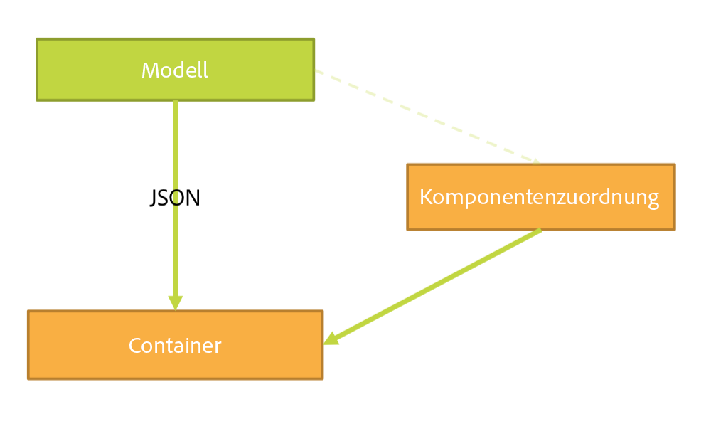
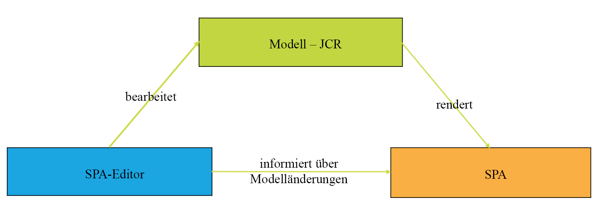
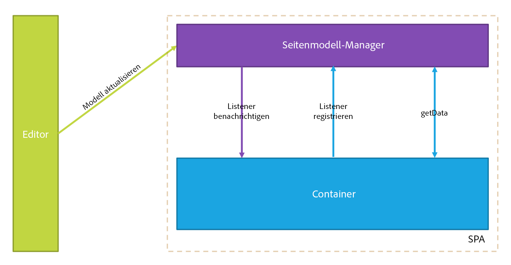
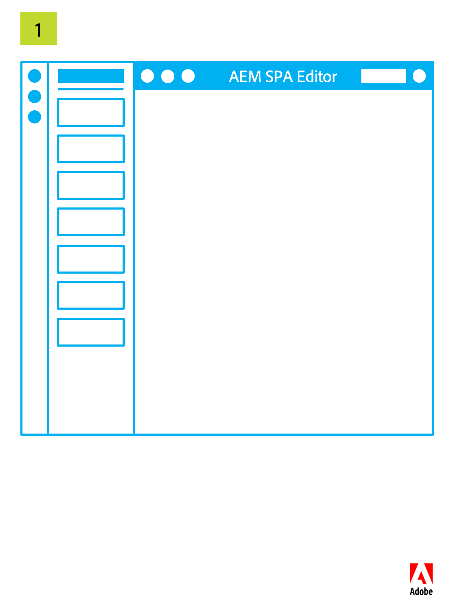
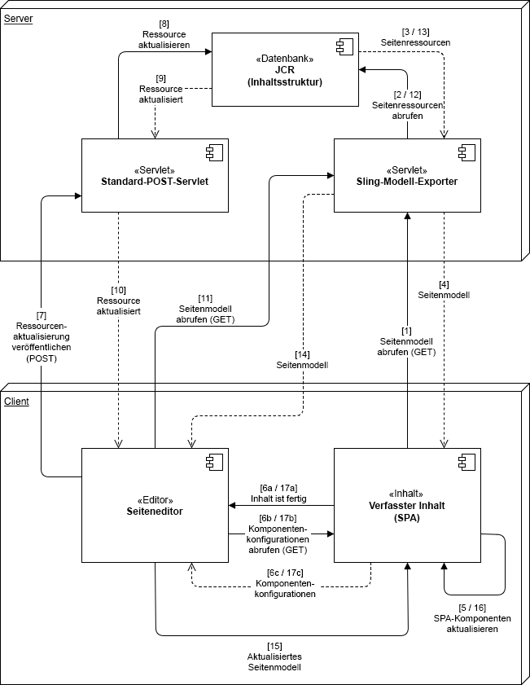
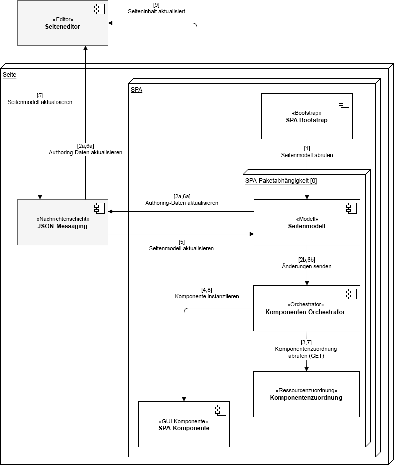

# SPA-Editor – Übersicht {#spa-editor-overview}

Single Page Applications (SPAs) können ansprechende Erlebnisse für Website-Benutzer bieten. Entwicklungspersonen möchten Sites mit SPA-Frameworks erstellen und Autorinnen bzw. Autoren möchten Inhalte in AEM nahtlos für eine Site bearbeiten, die mit diesen Frameworks erstellt wurde.

Der SPA-Editor bietet eine umfassende Lösung zur Unterstützung von SPAs in AEM. Auf dieser Seite erhalten Sie einen Überblick darüber, wie SPA-Support in AEM strukturiert ist, wie der SPA-Editor funktioniert und wie das SPA-Framework und AEM synchronisiert werden.

{{ue-over-spa}}

## Einführung {#introduction}

Sites, die mit gängigen SPA-Frameworks wie React und Angular erstellt wurden, laden ihren Inhalt über dynamisches JSON und weisen nicht die HTML-Struktur auf, die für den Seiteneditor von AEM erforderlich ist, um Steuerelemente zur Bearbeitung platzieren zu können.

Um die Bearbeitung von SPA in AEM zu aktivieren, ist eine Zuordnung zwischen der JSON-Ausgabe der SPA und dem Inhaltsmodell im AEM-Repository erforderlich, um Änderungen am Inhalt zu speichern.

Die SPA-Unterstützung in AEM führt eine dünne JS-Schicht ein, die mit dem SPA-JS-Code interagiert, wenn dieser in den Seiteneditor geladen wird, mit dem Ereignisse gesendet und die Position für die Bearbeitungssteuerelemente aktiviert werden können, um eine kontextbezogene Bearbeitung zu ermöglichen. Diese Funktion baut auf dem Konzept des Content Services API-Endpunkts auf, da der Inhalt aus der SPA über Content Services geladen werden muss.

Weitere Informationen zu SPAs in AEM finden Sie hier:

* [SPA-Blueprint](blueprint.md) für die technischen Anforderungen einer SPA.
* [Erste Schritte mit SPAs in AEM mit React](getting-started-react.md) für eine schnelle Übersicht über eine einfache SPA mit React.
* [Erste Schritte mit SPAs in AEM mit Angular](getting-started-angular.md) für eine schnelle Übersicht über eine einfache SPA mit Angular.

## Design {#design}

Die Seitenkomponente für eine SPA stellt die HTML-Elemente ihrer untergeordneten Komponenten nicht über die JSP- oder HTL-Datei bereit. Dieser Vorgang wird an das SPA-Framework delegiert. Die Darstellung der untergeordneten Komponenten oder von Modellen wird als JSON-Datenstruktur von JCR abgerufen. Die SPA-Komponenten werden dann der Seite entsprechend dieser Struktur hinzugefügt. Durch dieses Verhalten wird die anfängliche Textkörperzusammensetzung der Seitenkomponenten, die nicht zu SPA gehören, unterschieden.

### Seitenmodellverwaltung  {#page-model-management}

Die Auflösung und Verwaltung des Seitenmodells wird an eine bereitgestellte `PageModel`-Bibliothek delegiert. Die SPA muss die Seitenmodellbibliothek verwenden, damit sie vom SPA-Editor initialisiert und erstellt werden kann. Die PageModel-Bibliothek wird der AEM-Seitenkomponente indirekt über den NPM `aem-react-editable-components` bereitgestellt. Das Seitenmodell fungiert als Interpreter zwischen AEM und der SPA und muss daher immer vorhanden sein. Bei der Erstellung der Seite muss eine zusätzliche Bibliothek `cq.authoring.pagemodel.messaging` hinzugefügt werden, um die Kommunikation mit dem Seiteneditor zu ermöglichen.

Wenn die SPA-Seitenkomponente von der Seitenkernkomponente erbt, gibt es zwei Möglichkeiten, die Kategorie `cq.authoring.pagemodel.messaging` der Client-Bibliothek verfügbar zu machen:

* Wenn die Vorlage bearbeitbar ist, fügen Sie sie der Seitenrichtlinie hinzu.
* Oder fügen Sie die Kategorien mithilfe von `customfooterlibs.html` hinzu.

Für jede Ressource im exportierten Modell ordnet die SPA eine tatsächliche Komponente zu, die das Rendern durchführt. Das als JSON dargestellte Modell wird dann mithilfe der Komponentenzuordnungen innerhalb eines Containers gerendert.

>[!CAUTION]
>
>Die Einbindung der Kategorie `cq.authoring.pagemodel.messaging` sollte sich auf den Kontext des SPA-Editors beschränken.

### Kommunikationsdatentyp {#communication-data-type}

Wenn der Seite die Kategorie `cq.authoring.pagemodel.messaging` hinzugefügt wird, sendet sie eine Nachricht an den Seiteneditor, um den JSON-Kommunikationsdatentyp festzulegen. Wenn der Kommunikationsdatentyp auf JSON festgelegt ist, kommunizieren die GET-Anfragen mit den Sling-Modell-Endpunkten einer Komponente. Nach einer Aktualisierung im Seiteneditor wird die JSON-Repräsentation der aktualisierten Komponente an die PageModel-Bibliothek gesendet. Die Seitenmodellbibliothek informiert dann die SPA über Updates.

## Workflow {#workflow}

Der Interaktionsfluss zwischen SPA und AEM lässt sich leichter verstehen, wenn der SPA-Editor als Vermittler zwischen den beiden betrachtet wird.

* Die Kommunikation zwischen dem Seiteneditor und dem SPA erfolgt über JSON anstelle von HTML.
* Der Seiteneditor stellt die neueste Version des Seitenmodells über die iFrame- und Messaging-API für die SPA bereit.
* Der Seitenmodell-Manager benachrichtigt den Editor, dass er zur Bearbeitung bereit ist, und übergibt das Seitenmodell als JSON-Struktur.
* Der Editor verändert weder die DOM-Struktur der zu erstellenden Seite, noch greift er darauf zu, sondern stellt vielmehr das neueste Seitenmodell bereit.

### Grundlegender SPA-Editor-Workflow {#basic-spa-editor-workflow}

Unter Berücksichtigung der Schlüsselelemente des SPA-Editors erscheint der allgemeine Workflow zur Bearbeitung einer SPA in AEM für die Autorin bzw. den Autor wie folgt:

1. SPA-Editor wird geladen.
1. SPA wird in einen eigenen Frame geladen.
1. SPA fordert JSON-Inhalte an und rendert Komponenten Client-seitig.
1. SPA-Editor erkennt gerenderte Komponenten und generiert Überlagerungen.
1. Die Autorin bzw. der Autor klickt auf die Überlagerung und zeigt die Bearbeitungssymbolleiste der Komponente an.
1. SPA-Editor setzt Bearbeitungen mit einer POST-Anfrage an den Server fort.
1. Der SPA-Editor fordert ein aktualisiertes JSON an den SPA-Editor an, das mit einem DOM-Ereignis an den SPA-Editor gesendet wird.
1. SPA rendert die betreffende Komponente erneut und aktualisiert ihr DOM.

>[!NOTE]
>
>Beachten Sie:
>
>* Die SPA ist immer für die Anzeige verantwortlich.
>* Der SPA-Editor ist von der SPA selbst isoliert.
>* In der Produktion (Veröffentlichung) wird der SPA-Editor nie geladen.

### Client-Server-Workflow zur Seitenbearbeitung {#client-server-page-editing-workflow}

Dies ist ein detaillierterer Überblick über die Interaktion zwischen Client und Server beim Bearbeiten einer SPA.

1. Die SPA initialisiert sich selbst und fordert das Seitenmodell vom Sling Model Exporter an.
1. Der Sling Model Exporter fordert die Ressourcen, aus denen sich die Seite zusammensetzt, aus dem Repository an.
1. Das Repository gibt die Ressourcen zurück.
1. Der Sling Model Exporter gibt das Modell der Seite zurück.
1. Die SPA instanziiert ihre Komponenten auf Grundlage des Seitenmodells.
1. **6a** Der Inhalt informiert den Editor darüber, dass er für die Bearbeitung bereit ist.

   **6b** Der Seiteneditor fordert die Konfigurationen für die Komponentenbearbeitung an.

   **6c** Der Seiteneditor erhält die Komponentenkonfigurationen.
1. Wenn der Autor eine Komponente bearbeitet, sendet der Seiteneditor eine Änderungsanfrage an das standardmäßige POST-Servlet.
1. Die Ressource wird im Repository aktualisiert.
1. Die aktualisierte Ressource wird für das POST-Servlet bereitgestellt.
1. Das standardmäßige POST-Servlet informiert den Seiteneditor darüber, dass die Ressource aktualisiert wurde.
1. Der Seiteneditor fordert das neue Seitenmodell an.
1. Die Ressourcen, aus denen sich die Seite zusammensetzt, werden vom Repository angefordert.
1. Die Ressourcen, aus denen sich die Seite zusammensetzt, werden vom Repository für den Sling Model Exporter bereitgestellt.
1. Das aktualisierte Seitenmodell wird an den Editor zurückgegeben.
1. Der Seiteneditor aktualisiert die Seitenmodellreferenz der SPA.
1. Die SPA aktualisiert ihre Komponenten auf der Grundlage der neuen Seitenmodellreferenz.
1. Die Komponentenkonfigurationen der Seiteneditoren werden aktualisiert.

   **17a** Die SPA signalisiert dem Seiteneditor, dass der Inhalt bereit ist.

   **17b** Der Seiteneditor stellt Komponentenkonfigurationen für die SPA bereit.

   **17c** Die SPA stellt aktualisierte Komponentenkonfigurationen bereit.

### Authoring-Workflow {#authoring-workflow}

Dies ist ein detaillierterer Überblick, der sich auf das Autorenerlebnis konzentriert.

1. Die SPA ruft das Seitenmodell ab.
1. **2a** Das Seitenmodell stellt die für das Authoring notwendigen Daten für den Editor bereit.

   **2b** Wenn der Komponenten-Orchestrator benachrichtigt wird, aktualisiert er die Inhaltsstruktur der Seite.
1. Der Komponenten-Orchestrator fragt die Zuordnung zwischen einem AEM-Ressourcentyp und einer SPA-Komponente ab.
1. Der Komponenten-Orchestrator instanziiert die SPA-Komponente dynamisch anhand des Seitenmodells und der Komponentenzuordnung.
1. Der Seiteneditor aktualisiert das Seitenmodell.
1. **6a** Das Seitenmodell stellt die aktualisierten Authoring-Daten für den Seiteneditor bereit.

   **6b** Das Seitenmodell versendet Änderungen an den Komponenten-Orchestrator.
1. Der Komponenten-Orchestrator ruft die Komponentenzuordnung ab.
1. Der Komponenten-Orchestrator aktualisiert den Inhalt der Seite.
1. Wenn die SPA die Aktualisierung des Inhalts der Seite abgeschlossen hat, lädt der Seiteneditor die Authoring-Umgebung.

## Anforderungen und Einschränkungen {#requirements-limitations}

Damit die Autorin bzw. der Autor den Seiteneditor zum Bearbeiten von Inhalten in einer SPA verwenden kann, muss die SPA für die Interaktion mit dem AEM SPA Editor SDK implementiert sein. Im Dokument [Erste Schritte mit SPAs in AEM mit React](getting-started-react.md) finden Sie die wichtigsten Informationen, die Sie benötigen, um Ihre SPA zum Laufen zu bringen.

### Unterstützte Frameworks {#supported-frameworks}

Das SPA Editor SDK unterstützt die folgenden Mindestversionen:

* React 16.x und höher
* Angular 6.x und höher

Frühere Versionen dieser Frameworks funktionieren möglicherweise mit dem AEM SPA Editor SDK, werden jedoch nicht unterstützt.

### Weitere Frameworks {#additional-frameworks}

Für die Arbeit mit dem AEM SPA Editor SDK können weitere SPA-Frameworks implementiert werden. Im Dokument [SPA-Blueprint](blueprint.md) finden Sie Informationen zu den Anforderungen, die ein Framework erfüllen muss, um eine Framework-spezifische Ebene aus Modulen, Komponenten und Services zu erstellen, die mit dem SPA-Editor von AEM verwendet werden kann.

### Verwenden mehrerer Selektoren {#multiple-selectors}

Zusätzliche benutzerdefinierte Selektoren können als Teil einer für das AEM SPA SDK entwickelten SPA definiert und verwendet werden. Diese Unterstützung erfordert jedoch, dass – entsprechend den Anforderungen des JSON Exporters – der `model`-Selektor der erste Selektor und `.json` die Erweiterung ist.

### Anforderungen an den Texteditor {#text-editor-requirements}

Wenn Sie den Editor einer Textkomponente verwenden möchten, die in der SPA erstellt wurde, ist eine zusätzliche Konfiguration erforderlich.

1. Legen Sie ein Attribut (das beliebig sein kann) für das Container-Wrapper-Element fest, das die Text-HTML enthält. Im Falle des WKND-SPA-Projekts ist dies ein `
`-Element und der verwendete Selektor ist `data-rte-editelement`.
1. Legen Sie die `editElementQuery`-Konfiguration für die entsprechende `cq:InplaceEditingConfig` der AEM-Textkomponente fest, die auf diesen Selektor verweist, z. B. `data-rte-editelement`. Dadurch weiß der Editor, welches HTML-Element den HTML-Text umschließt.

Weitere Informationen zur `editElementQuery`-Eigenschaft und zur Konfiguration des Rich-Text-Editors finden Sie unter [Konfigurieren des Rich-Text-Editors](/help/implementing/developing/extending/rich-text-editor.md).

### Einschränkungen {#limitations}

Das AEM SPA Editor SDK wird von Adobe vollständig unterstützt und ständig weiter verbessert und erweitert. Die folgenden AEM-Funktionen werden vom SPA-Editor noch nicht unterstützt:

* Zielmodus
* ContextHub
* Inline-Bildbearbeitung
* Konfigurationen bearbeiten (z. B. Listener)
* Rückgängig/Wiederholen
* Seitenvergleich und Zeitverzerrung
* Funktionen, die Server-seitig HTML-Umschreibungen durchführen, wie [Link-Prüfer](/help/operations/link-checker.md), CDN-Umschreibe-Service, URL-Verkürzung usw.
* Entwicklermodus
* AEM-Launches
