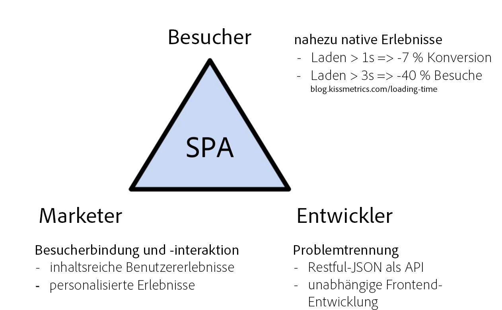
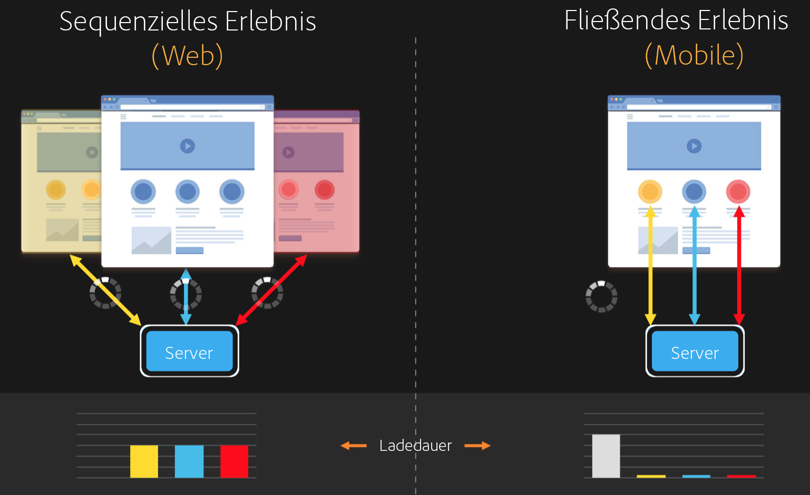
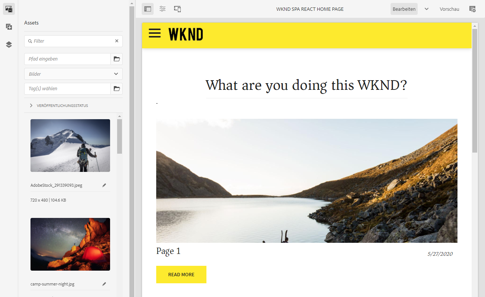
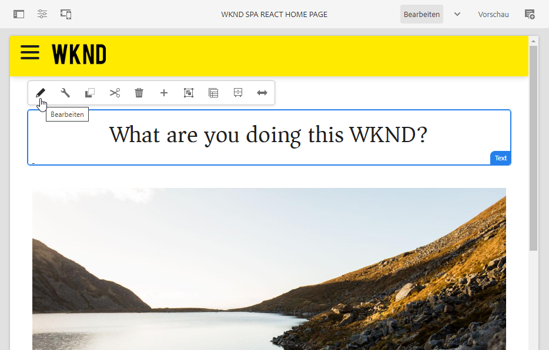
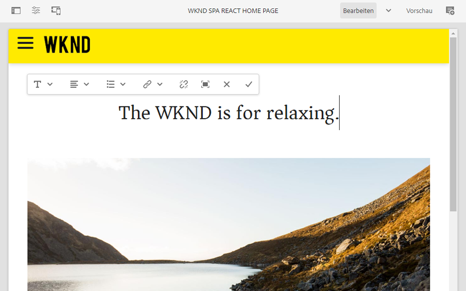
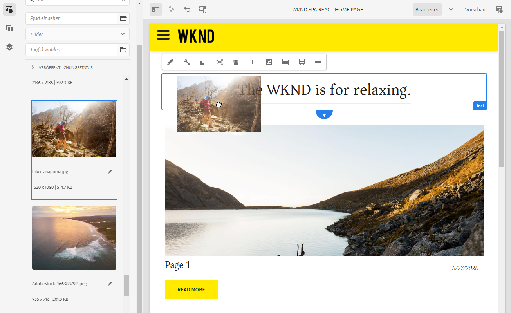
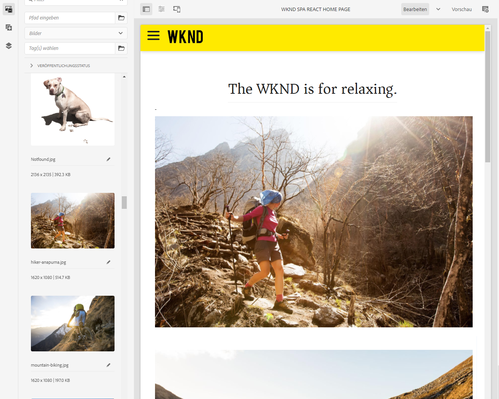
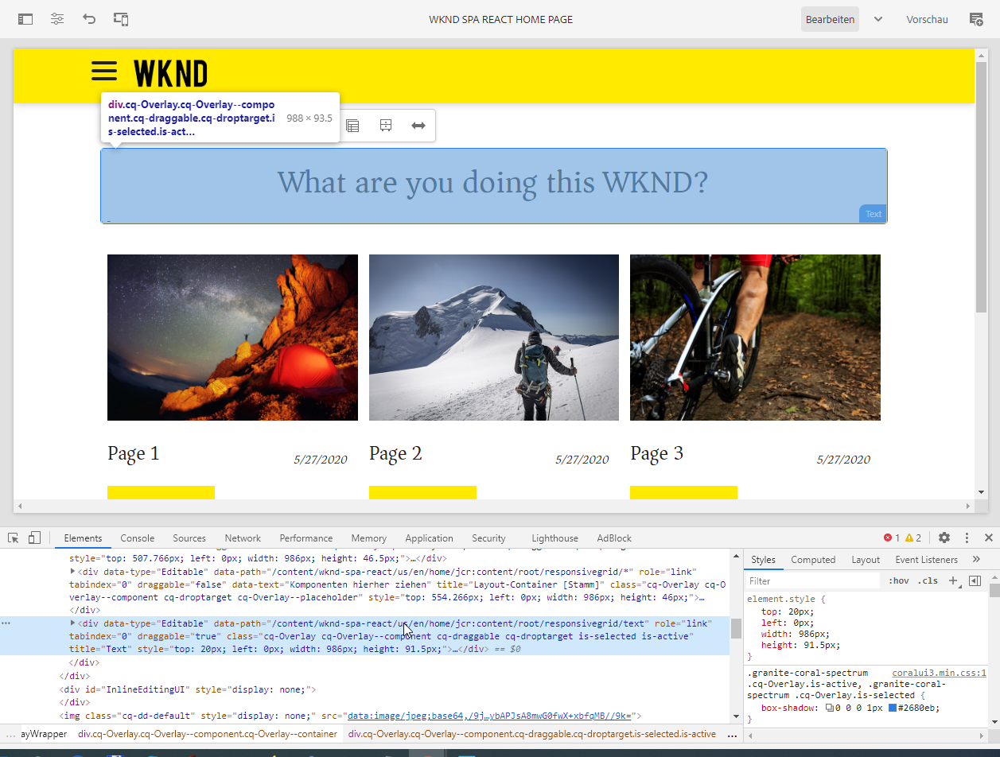

# Einführung in SPAs und exemplarische Anleitung {#spa-introduction}

Single Page Applications (SPAs) können ansprechende Erlebnisse für Website-Benutzer bieten. Entwicklungspersonen möchten Sites mit SPA-Frameworks erstellen und Autorinnen bzw. Autoren möchten Inhalte in AEM nahtlos für eine Site bearbeiten, die mit diesen Frameworks erstellt wurde.

Der SPA-Editor bietet eine umfassende Lösung zur Unterstützung von SPAs in AEM. In diesem Artikel wird die Verwendung einer einfachen SPA zur Inhaltserstellung erläutert und gezeigt, wie sie mit dem zugrunde liegenden AEM-SPA-Editor in Beziehung steht.

{{ue-over-spa}}

## Einführung {#introduction}

### Ziel des Artikels {#article-objective}

In diesem Artikel werden die grundlegenden Konzepte von SPAs vorgestellt, bevor der Leser eine exemplarische Anleitung zum SPA-Editor erhält, indem ein einfaches SPA-Programm zum Demonstrieren der grundlegenden Inhaltsbearbeitung verwendet wird. Dann folgen Details zum Aufbau der Seite und zu der Frage, wie die SPA mit dem AEM-SPA-Editor in Beziehung steht und interagiert.

Ziel der vorliegenden Einführung und exemplarischen Anleitung ist es, einem AEM-Entwickler zu demonstrieren, warum SPAs relevant sind, wie sie grundsätzlich funktionieren, wie SPAs vom AEM-SPA-Editor gehandhabt werden und wie sie sich von einem standardmäßigen AEM-Programm unterscheiden.

## Voraussetzungen {#requirements}

Die exemplarische Anleitung basiert auf AEM-Standardfunktionen und der beispielhaften WKND SPA Project-App. Um dieser Anleitung folgen zu können, müssen Sie über Folgendes verfügen:

* [Aktuelles Entwicklungs-SDK von AEMaaCS](/help/release-notes/release-notes-cloud/release-notes-current.md)
   * Es sollte als lokale Entwicklungsumgebung ausgeführt werden.
   * Sie müssen über Administratorrechte für das System verfügen.
* [Die Beispiel-App „WKND SPA Project“ muss auf GitHub verfügbar sein](https://github.com/adobe/aem-guides-wknd-spa)
   * Laden Sie die [neueste Version der React-App](https://github.com/adobe/aem-guides-wknd-spa/releases) herunter, deren Namen ähnlich wie `wknd-spa-react.all-X.Y.Z-SNAPSHOT.zip` lauten sollte.
   * Laden Sie die [aktuellen Beispielbilder für die App](https://github.com/adobe/aem-guides-wknd-spa/releases) herunter, deren Namen ähnlich wie `wknd-spa-sample-images-X.Y.Z.zip` lauten.
   * [Verwenden Sie Package Manager](/help/implementing/developing/tools/package-manager.md), um beide Pakete wie üblich in AEM zu installieren.
   * Für diese Anleitung muss die App nicht mit Maven installiert werden.

>[!CAUTION]
>
>In diesem Dokument dient die [WKND-SPA-Projekt-App](https://github.com/adobe/aem-guides-wknd-spa) ausschließlich zu Demonstrationszwecken. Verwenden Sie sie nicht für Projektarbeiten.

>[!TIP]
>
>Für jedes AEM-Projekt sollte der [AEM-Projektarchetyp](https://experienceleague.adobe.com/docs/experience-manager-core-components/using/developing/archetype/overview.html?lang=de) genutzt werden, der SPA-Projekte mithilfe von React oder Angular unterstützt und das SPA-SDK verwendet.

### Was ist eine SPA? {#what-is-a-spa}

Eine Single Page Application (SPA) unterscheidet sich von einer herkömmlichen Seite insofern, als sie Client-seitig gerendert wird und primär JavaScript-gesteuert ist. Dabei wird auf Ajax-Aufrufe zurückgegriffen, um Daten zu laden und die Seite dynamisch zu aktualisieren. Der Großteil der Inhalte oder alle Inhalte werden einmal in einem einzelnen Seiten-Load abgerufen, wobei je nach Benutzerinteraktion mit der Seite asynchron zusätzliche Ressourcen geladen werden.

So wird der Bedarf nach Seitenaktualisierungen reduziert und dem Benutzer ein Erlebnis präsentiert, das nahtlos und schnell ist und eher wie eine native App funktioniert.

Der AEM-SPA-Editor ermöglicht es Frontend-Entwicklungspersonen, SPAs zu erstellen, die sich in eine AEM-Site integrieren lassen, damit Inhaltsautorinnen und -autoren SPA-Inhalte so einfach bearbeiten können wie alle anderen AEM-Inhalte.

### Warum eine SPA? {#why-a-spa}

Da SPAs schneller, nahtloser und eher wie ein natives Programm sind, sind sie nicht nur für Besucher der Web-Seite, sondern auch für Marketing-Experten und Entwickler attraktiv. Das hängt mit der Art und Weise zusammen, wie SPAs funktionieren.

#### Besucher {#visitors}

* Besucher bevorzugen native Erlebnisse, wenn sie mit Inhalten interagieren.
* Es gibt Daten, die klar zeigen, dass eine Konversion umso wahrscheinlicher ist, je schneller eine Seite ist.

#### Marketing-Experten {#marketers}

* Marketing-Experten wollen umfangreiche, quasi native Erlebnisse bieten, um Besucher dazu zu bringen, sich voll und ganz auf Inhalte einzulassen.
* Durch Personalisierung können diese Erlebnisse noch ansprechender gestaltet werden.

#### Entwickler {#developers}

* Entwickelnde wünschen sich eine saubere Trennung zwischen Inhalten und Präsentation.
* Eine saubere Trennung macht das System erweiterbarer und ermöglicht eine unabhängige Front-End-Entwicklung.

### Wie funktioniert eine SPA? {#how-does-a-spa-work}

Die Grundidee hinter einer SPA besteht darin, dass Aufrufe an und Abhängigkeiten von einem Server verringert werden, um Verzögerungen zu minimieren, die durch Server-Latenz verursacht werden. So kommen SPAs der Reaktionsgeschwindigkeit einer nativen Anwendung nahe.

Bei einer herkömmlichen, sequenziellen Web-Seite werden nur die für die aktuelle Seite benötigten Daten geladen. Das bedeutet, dass beim Wechseln des Besuchers zu einer anderen Seite der Server für die zusätzlichen Ressourcen aufgerufen werden muss. Weitere Aufrufe können erforderlich sein, wenn der Besucher mit Elementen auf der Seite interagiert. Diese Mehrfachaufrufe können zu einer Wahrnehmung von Verzögerungen führen, da die Seite die Anfragen des Besuchers erfüllen muss.

Für ein nahtloseres Benutzererlebnis, das dem entspricht, was Besucher von mobilen, nativen Apps erwarten, lädt eine SPA alle erforderlichen Daten für den Besucher beim ersten Laden. Dies mag zunächst ein wenig länger dauern, erfordert dann jedoch keine weiteren Server-Aufrufe mehr.

Durch das Client-seitige Rendern reagieren Seitenelemente schneller; Interaktionen mit der Seite durch den Besucher werden sofort ausgeführt. Alle weiteren erforderlichen Daten werden asynchron aufgerufen, um die Seitengeschwindigkeit zu maximieren.

>[!TIP]
>
>Technische Einzelheiten zur Funktionsweise von SPAs in AEM finden Sie in den folgenden Artikeln:
>* [Erste Schritte mit SPAs in AEM unter Verwendung von React](getting-started-react.md)
>* [Erste Schritte mit SPAs in AEM unter Verwendung von Angular](getting-started-angular.md)
>
>Weitere Informationen zu Design, Architektur und technischem Workflow des SPA-Editors finden Sie im Artikel:
>* [SPA-Editor – Überblick](editor-overview.md).

## Inhaltsbearbeitungserlebnis mit SPA {#content-editing-experience-with-spa}

Wenn eine SPA zur Nutzung des AEM-SPA-Editors konfiguriert ist, merkt der Inhaltsautor beim Bearbeiten und Erstellen von Inhalten keinen Unterschied. Es stehen gängige AEM-Funktionen zur Verfügung; am Workflow des Autors keine Änderungen erforderlich sind.

1. Bearbeiten Sie die WKND-SPA-Projekt-App in AEM.

   `http://localhost:4502/editor.html/content/wknd-spa-react/us/en/home.html`

   

1. Wählen Sie eine Textkomponente aus und beachten Sie, dass wie bei jeder anderen Komponente eine Symbolleiste angezeigt wird. Wählen Sie **Bearbeiten** aus.

   

1. Bearbeiten Sie den Inhalt in AEM wie gewohnt und beachten Sie, dass die Änderungen persistiert werden.

   

1. Verwenden Sie den Assets-Browser, um per Drag-and-Drop ein neues Bild in eine Bildkomponente zu ziehen.

   

1. Die Änderung wird persistiert.

   

Weitere Authoring-Werkzeuge wie das Ziehen und Ablegen zusätzlicher Komponenten auf der Seite, das Neuanordnen von Komponenten und das Ändern des Layouts werden wie in jedem Nicht-SPA-AEM-Programm unterstützt.

>[!NOTE]
>
>Der SPA-Editor ändert das DOM des Programms nicht. Die SPA selbst ist für das DOM verantwortlich.
>
>Um zu erfahren, wie das funktioniert, fahren Sie mit dem nächsten Abschnitt des Artikels [SPAs und der AEM-SPA-Editor](#spa-apps-and-the-aem-spa-editor) fort.

## SPAs und der AEM-SPA-Editor {#spa-apps-and-the-aem-spa-editor}

Wenn Sie wissen, wie sich eine SPA bei Benutzenden verhält, und dann die SPA-Seite prüfen, können Sie besser verstehen, wie eine SPA mit dem SPA-Editor in AEM zusammenarbeitet.

### Verwenden eines SPA-Programms {#using-an-spa-application}

1. Laden Sie die WKND-SPA-Projekt-Anwendung entweder auf den Veröffentlichungs-Server oder mithilfe der Option **Als veröffentlicht anzeigen** im Menü **Seiteninformationen** des Seiteneditors.

   `http://<host>:<port>/content/wknd-spa-react/us/en/home.html`

   

   Beachten Sie die Seitenstruktur, einschließlich der Navigation zu untergeordneten Seiten, Menü und Artikelkarten.

1. Navigieren Sie mithilfe des Menüs zu einer untergeordneten Seite und beachten Sie, dass die Seite sofort geladen wird, ohne dass eine Aktualisierung erforderlich ist.

   

1. Öffnen Sie die integrierten Entwickler-Tools Ihres Browsers und überwachen Sie beim Navigieren durch die untergeordneten Seiten die Netzwerkaktivität.

   

   Wenn Sie in der App von Seite zu Seite wechseln, ist der Traffic sehr gering. Die Seite wird nicht neu geladen; lediglich die neuen Bilder werden angefordert.

   Die SPA verwaltet Inhalt und Routing komplett auf der Client-Seite.

Wenn die Seite beim Navigieren durch die untergeordneten Seiten nicht neu geladen wird: Wie wird sie dann geladen?

Im nächsten Abschnitt [Laden eines SPA-Programms](#loading-a-spa-application) werden die Methoden zum Laden der SPA sowie zum synchronen und asynchronen Laden von Inhalten genauer erläutert.

### Laden eines SPA-Programms {#loading-a-spa-application}

1. Laden Sie, falls noch nicht geschehen, die WKND-SPA-Projekt-Anwendung entweder auf den Veröffentlichungs-Server oder unter Verwendung der Option **Als veröffentlicht anzeigen** im Menü **Seiteninformationen** des Seiten-Editors.

   `http://<host>:<port>/content/wknd-spa-react/us/en/home.html`

   

1. Verwenden Sie das integrierte Tool Ihres Browsers, um die Quelle der Seiten anzuzeigen.
1. Der Inhalt der Quelle ist begrenzt.
   * Die Seite enthält im Hauptteil keine Inhalte. Sie besteht hauptsächlich aus Stylesheets und einem Aufruf an verschiedene Skripte wie `clientlib-react.min.js`.
   * Diese Skripte sind die Hauptelemente des Programms und für das Rendern sämtlicher Inhalte verantwortlich.

1. Nutzen Sie die integrierten Tools Ihres Browsers, um die Seite zu überprüfen. Sehen Sie sich den Inhalt des vollständig geladenen DOM an.

   

1. Wechseln Sie im Inspektor zur Registerkarte „Netzwerk“ und laden Sie die Seite neu.

   Abgesehen von Bildanfragen sind die primären Ressourcen, die für die Seite geladen werden, die Seite selbst, CSS, das React-JavaScript, seine Abhängigkeiten sowie die JSON-Daten für die Seite.

   

1. Laden Sie die `home.model.json` in einer neuen Registerkarte.

   `http://<host>:<port>/content/wknd-spa-react/us/en/home.model.json`

   

   Der AEM-SPA-Editor nutzt [AEM Content Services](/help/sites-cloud/administering/content-fragments/overview.md#content-fragments-and-content-services), um den gesamten Inhalt der Seite als JSON-Modell bereitzustellen.

   Durch Implementierung spezifischer Schnittstellen stellen Sling-Modelle die für die SPA notwendigen Daten bereit. Die Bereitstellung der JSON-Daten wird nach unten an die jeweilige Komponente delegiert (von Seite zu Absatz zu Komponente usw.).

   Jede Komponente entscheidet, was sie verfügbar macht und wie sie gerendert wird (Server-seitig mit HTL oder Client-seitig mit React bzw. Angular). In diesem Artikel geht es um das Client-seitige Rendering mit React.

1. Das Modell kann Seiten auch zusammen gruppieren, damit sie synchron geladen werden. Dadurch verringert sich die Zahl der erforderlichen Seitenneuladungen.

   Im Beispiel des WKND-SPA-Projekt-Programms werden die Seiten `home`, `page-1`, `page-2` und `page-3` synchron geladen, da Besucher in der Regel alle diese Seiten besuchen.

   Dieses Verhalten ist nicht obligatorisch und kann vollständig definiert werden.

   

1. Um diesen Unterschied im Verhalten zu sehen, laden Sie die `home`-Seite neu und löschen Sie die Netzwerkaktivität des Inspektors. Navigieren Sie im Seitenmenü zu `page-1` und vergewissern Sie sich, dass die einzige Netzwerkaktivität eine Anfrage nach dem Bild von `page-1` ist. `page-1` selbst muss nicht geladen werden.

   

### Interaktion mit dem SPA-Editor {#interaction-with-the-spa-editor}

Mithilfe der exemplarischen WKND-SPA-Projektanwendung wird deutlich, wie sich die App verhält und beim Veröffentlichen geladen wird. Dabei kommen Inhaltsdienste für die JSON-Inhaltsbereitstellung und das asynchrone Laden von Ressourcen zum Einsatz.

Darüber hinaus ist die Inhaltserstellung mit einem SPA-Editor für Inhaltsautorinnen und Inhaltsautoren innerhalb von AEM nahtlos.

Im folgenden Abschnitt werden wir uns den Vertrag ansehen, der es dem SPA-Editor erlaubt, Komponenten innerhalb der SPA mit AEM-Komponenten zu verbinden und so für ein nahtloses Bearbeitungserlebnis zu sorgen.

1. Laden Sie das WKND-SPA-Projekt-Programm im Editor und wechseln Sie in den **Vorschau**-Modus.

   `http://<host>:<port>/editor.html/content/wknd-spa-react/us/en/home.html`

1. Überprüfen Sie mithilfe der integrierten Entwickler-Tools Ihres Browsers den Inhalt der Seite. Wählen Sie mit dem Auswahl-Tool eine bearbeitbare Komponente auf der Seite aus und zeigen Sie die Elementdetails an.

   Die Komponente verfügt über ein neues Datenattribut (`data-cq-data-path`).

   

   Beispiel

   `data-cq-data-path="/content/wknd-spa-react/us/en/home/jcr:content/root/responsivegrid/text`

   Dieser Pfad ermöglicht ein Abrufen und Verknüpfen des Konfigurationsobjekts mit Bearbeitungskontext der einzelnen Komponenten.

   Dies ist das einzige Markup-Attribut, das erforderlich ist, damit der Editor das Element als bearbeitbare Komponente innerhalb der SPA erkennen kann. Auf Grundlage dieses Attributs bestimmt der SPA-Editor, welche bearbeitbare Konfiguration mit der Komponente verknüpft ist, sodass der richtige Rahmen, die richtige Symbolleiste usw. geladen wird.

   Einige spezifische Klassennamen werden auch für die Kennzeichnung von Platzhaltern und für die Drag-and-Drop-Funktion von Assets hinzugefügt.

   >[!NOTE]
   >
   >Dieses Verhalten unterscheidet sich von Server-seitig gerenderten Seiten in AEM, wo für jede bearbeitbare Komponente ein `cq`-Element eingefügt wird.
   >
   >Durch diesen Ansatz im SPA-Editor müssen benutzerdefinierte Elemente nicht mehr injiziert werden, da nur ein zusätzliches Datenattribut erforderlich ist. Dadurch wird das Markup-Verfahren für Frontend-Entwickler vereinfacht.

## Headful und Headless in AEM {#headful-headless}

SPAs können mit flexiblen Integrationsstufen innerhalb von AEM aktiviert werden, einschließlich SPAs, die außerhalb von AEM entwickelt und gepflegt werden. Darüber hinaus können SPAs innerhalb von AEM verwendet werden und gleichzeitig AEM nutzen, um Inhalte als Headless-Inhalte an zusätzliche Endpunkte zu liefern.

>[!TIP]
>
>Weitere Informationen finden Sie im Dokument [Headful und Headless in AEM](/help/implementing/developing/headful-headless.md).

## Nächste Schritte {#next-steps}

Da Sie nun das SPA-Bearbeitungserlebnis in AEM kennen und die Beziehung einer SPA zum SPA-Editor verstehen, können Sie sich genauere Einblicke in die Erstellung einer SPA verschaffen.

* [Erste Schritte mit SPAs in AEM unter Verwendung von React](getting-started-react.md) zeigt, wie unter Verwendung von React eine einfache SPA für die Zusammenarbeit mit dem SPA-Editor in AEM erstellt wird
* [Erste Schritte mit SPAs in AEM unter Verwendung von Angular](getting-started-angular.md) zeigt, wie unter Verwendung von Angular eine einfache SPA für die Zusammenarbeit mit dem SPA-Editor in AEM erstellt wird
* In [SPA-Editor – Überblick](editor-overview.md) wird das Kommunikationsmodell zwischen AEM und der SPA vertieft.
* [Entwickeln von SPAs für AEM](developing.md) beschreibt, wie Front-End-Entwickelnde damit beauftragt werden können, eine SPA für AEM zu entwickeln, und wie SPAs mit der Architektur von AEM interagieren.
