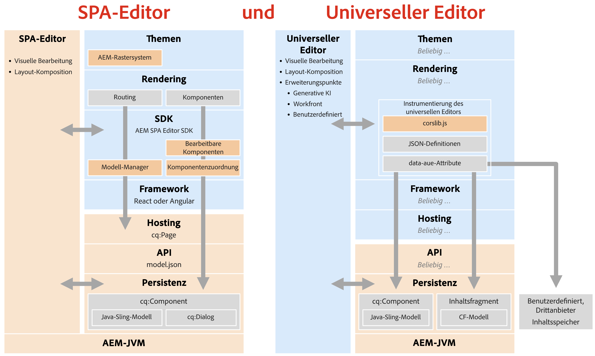

# Einstellung des SPA-Editors {#spa-editor-deprecation}

Der SPA-Editor von Adobe wird zwar weiterhin unterstützt, aber nachstehend erfahren Sie, was die Einstellung für Ihr Projekt bedeutet und welche Optionen Sie bei zukünftigen Projekten haben.

## Zusammenfassung {#summary}

Adobe hat den SPA-Editor mit der [Version 2025.01 von AEM as a Cloud Service](/help/release-notes/release-notes-cloud/2025/release-notes-2025-1-0.md#spa-editor) eingestellt. Das bedeutet, dass an den entsprechenden SDKs keine weiteren Verbesserungen oder Aktualisierungen mehr vorgenommen werden. Adobe empfiehlt Ihnen den [universellen Editor](/help/implementing/universal-editor/introduction.md) für alle neuen Projekte, damit Sie die neuesten Innovationen von AEM nutzen können.

## Details zur Abschaffung {#details}

Die Abschaffung des SPA-Editors **bedeutet nicht, dass er sofort entfernt wird**. Ist er bereits implementiert, **können Sie ihn so lange verwenden, wie er Ihren Anforderungen entspricht.** Beachten Sie jedoch die folgenden Auswirkungen, die mit der Abschaffung verbunden sind.

* Künftig wird Adobe nur noch P1- und P2-Probleme und -Schwachstellen beheben.
* Die zugehörigen SDKs werden nicht mehr weiterentwickelt, verbessert oder aktualisiert.

Die Einstellung bedeutet, dass für die folgenden SDKs keine neuen Funktionen hinzugefügt werden (auch als Feature Freeze bezeichnet):

* [AEM-Projektarchetyp](https://github.com/adobe/aem-project-archetype/)
* [AEM SPA Project Core](https://github.com/adobe/aem-spa-project-core)
* [AEM SPA Page Model Manager](https://github.com/adobe/aem-spa-page-model-manager)
* [AEM SPA Component Mapping](https://github.com/adobe/aem-spa-component-mapping)
* [AEM SPA React Editable Components](https://github.com/adobe/aem-react-editable-components)
   * [AEM React Core Components](https://github.com/adobe/aem-react-core-wcm-components)
   * [AEM React Core Components Base](https://github.com/adobe/aem-react-core-wcm-components-base)
   * [AEM React Core Components SPA](https://github.com/adobe/aem-react-core-wcm-components-spa)
   * [AEM React Core Components Examples](https://github.com/adobe/aem-react-core-wcm-components-examples)
* [AEM SPA Angular Editable Components](https://github.com/adobe/aem-angular-editable-components)
   * [AEM Angular Core Components](https://github.com/adobe/aem-angular-core-wcm-components)
   * [AEM Angular Core Components Base](https://github.com/adobe/aem-angular-core-wcm-components-base)
   * [AEM Angular Core Components SPA](https://github.com/adobe/aem-angular-core-wcm-components-spa)
   * [AEM Angular Core Components Examples](https://github.com/adobe/aem-angular-core-wcm-components-examples)
* [AEM SPA Vue Editable Components](https://github.com/mavicellc/aem-vue-editable-components)

## Alternativen zum SPA-Editor {#alternatives}

Welcher Ersatz für den SPA-Editor am besten geeignet ist, hängt von Ihren Projektanforderungen ab.

* **[Der universelle Editor](https://www.aem.live/docs/aem-authoring)** ist der beste direkte Ersatz für den SPA-Editor.
   * Der universelle Editor ist ebenfalls ein visueller Editor und wurde speziell für entkoppelte Implementierungen entwickelt, und dies unter Berücksichtigung der gesamten Erfahrung von Adobe mit dem SPA-Editor.
   * Der universelle Editor wurde ebenfalls [für AEM 6.5 (mit der Version 2024.11.05 von AEM 6.5) veröffentlicht](https://experienceleague.adobe.com/de/docs/experience-manager-65/content/implementing/developing/headless/universal-editor/introduction) und unterstützt daher neben Cloud-Services auch AMS- und On-Premise-Anwendungsfälle.
* Der **[Inhaltsfragmenteditor](/help/assets/content-fragments/content-fragments-managing.md)** ist eine Alternative für alle, die einen formularbasierten Editor bevorzugen.
   * Der Inhaltsfragmenteditor eignet sich am besten, wenn Ihre Inhalte als Inhaltsfragmente und nicht als Seiten strukturiert sind.

Die Strukturierung von Inhalten mit Inhaltsfragmenten schließt eine Verwendung des universellen Editors als visuellen Editor nicht aus. Beide Editoren können zusammen verwendet werden.

## Migration zum universellen Editor {#migrate-ue}

Der universelle Editor bietet viele Vorteile. Daher ist die Migration zu diesem Editor eine großartige Lösung für neue Projekte.

* **Visuelle Bearbeitung:** Wie beim SPA-Editor können Autorinnen und Autoren Inhalte direkt in der Vorschau bearbeiten und sehen sofort, wie sich ihre Änderungen auf das Besuchererlebnis auswirken.
* **Zukunftssicher:** Die Roadmap von AEM priorisiert den universellen Editor als visuellen Editor. Indem Sie ihn übernehmen, wird der Zugriff auf die neuesten Innovationen und Verbesserungen sichergestellt.
* **Einfachere Integration:** Für die Verwendung des universellen Editors ist kein AEM-spezifisches SDK erforderlich, wodurch die Festlegung auf bestimmte Technologiedienste verringert wird.
* **Eigene App einbringen:** Der universelle Editor unterstützt jedes Web-Framework und jede Architektur, sodass ein Übernehmen ohne komplexe Umgestaltung möglich ist.
* **Erweiterbarkeit:** Der universelle Editor profitiert von einem robusten [Erweiterungs-Framework](/help/implementing/universal-editor/extending.md), einschließlich Integrationen mit GenAI, Workfront und mehr.

Es gibt keinen direkten Migrationspfad vom SPA-Editor zum universellen Editor. Dies liegt an den grundlegenden Unterschieden zwischen den beiden Technologien.

* Durch den universellen Editor werden keine Funktionen wie der Vorlageneditor, das Stilsystem oder das responsive Raster wieder neu eingeführt.
   * Diese Anwendungsfälle können jetzt effizienter mit Lean-Frontend-CSS und -JS in Edge Delivery Services- oder Headless-Projekten bearbeitet werden.
* Da der universelle Editor ein Editor-as-a-Service ist, kann er es beim Implementieren nicht erlauben, CSS oder JS in die Komponentendialogfelder einzufügen.
   * Dies verhindert eine automatische Konvertierung von Komponentendialogfeldern aus dem Seiten-Editor.
   * Dies wirkt sich auf viele Bereiche der Dialogfelder aus, z. B. auf benutzerdefinierte Widgets, Feldvalidierungen, Regeln zum Ein-/Ausblenden und vorlagenbasierte Anpassungen.

Vor dem Hintergrund dieser technischen Unterschiede lautet die Empfehlung von Adobe wie folgt:

* Vorhandene SPA-Editor-Sites bleiben unverändert, da die Unterstützung fortgesetzt wird.
* Verwenden Sie den universellen Editor für alle neuen Entwicklungen, einschließlich neuer Sites, Abschnitte oder Seiten.

Beachten Sie, dass der universelle Editor zwar keine direkte Implementierung bestimmter SPA-Editor-Funktionen enthält, es jedoch neue Möglichkeiten gibt, dieselben Probleme mit der neuen Flexibilität des universellen Editors zu lösen.

## Vergleich des SPA-Editors mit dem universellen Editor {#spa-vs-ue}

Der universelle Editor bietet denen, die Web-Anwendungen implementieren, viel mehr Freiheit, wie in diesem Diagramm veranschaulicht.

|  | SPA-Editor | Universeller Editor |
|---|---|---|
| **Themen** | Die Anwendung muss das Layout mit dem Raster-CSS von AEM implementieren. | Die Anwendung kann jede moderne CSS-Technik für das Layout verwenden. |
| **Rendern** | Die Anwendung muss der Routing-Struktur des SPA-Editors folgen. | Die Anwendung kann frei implementiert werden. Es müssen keine auferlegten Regeln oder Muster befolgt werden. |
| **SDK** | Das SDK muss bei der Implementierung nahtlos integriert werden. | Auf der Autorenebene lädt die Anwendung einfach `corlib.js` und erteilt dem universellen Editor über HTML-Anmerkungen Anweisungen. |
| **Framework** | Die Anwendung muss eine unterstützte Version von React oder Angular verwenden. | Die Anwendung kann jedes Framework und jede Architektur verwenden. |
| **Hosting** | Die Anwendung muss auf der AEM-Domain gehostet werden. | Die Anwendung kann vollständig entkoppelt sein und überall gehostet werden. |
| **API** | Die Anwendung muss Inhalte über das API `model.json` abrufen. | Die Anwendung kann alle APIs einschließlich benutzerdefinierter APIs verwenden. |
| **Persistenz** | Der SPA-Editor unterstützt nur Seiteninhalte für die visuelle Bearbeitung. | Der universelle Editor unterstützt die visuelle Bearbeitung von Seiten und Inhaltsfragmenten nativ. |
|  |  | Der universelle Editor kann erweitert werden, um externe Inhalte mit denselben visuellen Funktionen zu bearbeiten. |
|  | Entwickelnde müssen Sling-Modelle und `cq:Dialog`e in AEM bereitstellen. | Entwickelnde benötigen nur wenig bis keine Erfahrung mit AEM und müssen kein Java schreiben. |
