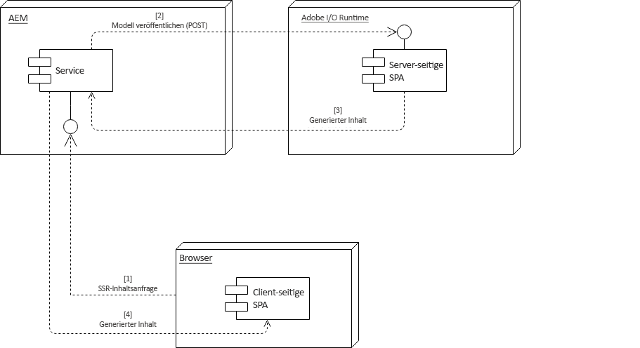

# Einzelseitenanwendungen (Single Page Applications, SPA) und Server-seitiges Rendering{#spa-and-server-side-rendering}

Single Page Applications (SPAs) können Benutzerinnen und Benutzern ein intensives, dynamisches Erlebnis bieten, das häufig genau wie eine native Anwendung reagiert. [Diese Funktionalität wird erreicht, indem man sich darauf verlässt, dass der Client den Inhalt vorab lädt, wodurch dann die Benutzerinteraktion erleichtert wird.](introduction.md#how-does-a-spa-work). Dieser Prozess minimiert den Kommunikationsaufwand zwischen dem Client und dem Server, wodurch die App reaktionsfähiger wird.

Dies kann jedoch zu längeren anfänglichen Ladezeiten führen, insbesondere wenn die SPA groß und inhaltsreich ist. Um die Ladezeit zu optimieren, können einige Inhalte Server-seitig gerendert werden. Die Verwendung von Server-seitigem Rendering (SSR) kann das anfängliche Laden der Seite beschleunigen und dann das weitere Rendering dem Client überlassen.

## Verwendung von SSR {#when-to-use-ssr}

SSR ist nicht bei allen Projekten erforderlich. Obwohl JS SSR für SPAs von AEM voll unterstützt wird, empfiehlt Adobe nicht, sie systematisch für jedes Projekt zu implementieren.

Wenn Sie sich für die Implementierung von SSR entscheiden, müssen Sie zunächst abschätzen, welche zusätzliche Komplexität, welchen Aufwand und welche Kosten das Hinzufügen von SSR für das Projekt realistisch darstellt, einschließlich der langfristigen Wartung. Eine SSR-Architektur sollte nur dann gewählt werden, wenn der Mehrwert die geschätzten Kosten deutlich übersteigt.

SSR bietet in der Regel einen gewissen Mehrwert, wenn eine der folgenden Fragen klar mit Ja beantwortet werden kann:

* **SEO:** Ist SSR tatsächlich noch erforderlich, damit Ihre Website von den Suchmaschinen, die Traffic bringen, richtig indiziert wird? Denken Sie daran, dass die wichtigsten Suchmaschinen-Crawler jetzt JS auswerten.
* **Seitengeschwindigkeit:** Bietet SSR eine messbare Geschwindigkeitsverbesserung in Echtzeit-Umgebungen? Steigert SSR das Kundenerlebnis insgesamt?

Nur wenn mindestens eine dieser beiden Fragen für Ihr Projekt mit einem klaren „Ja“ beantwortet werden kann, wird die Implementierung von SSR empfohlen. In den folgenden Abschnitten wird beschrieben, wie Sie dies mit Adobe I/O Runtime erreichen, das Teil von [App Builder](https://developer.adobe.com/app-builder) ist.

## Adobe I/O Runtime {#adobe-i-o-runtime}

Wenn Sie [davon überzeugt sind, dass Ihr Projekt die Implementierung von SSR erfordert](#when-to-use-ssr), empfiehlt Adobe die Verwendung von Adobe I/O Runtime.

Weitere Informationen zu Adobe I/O Runtime finden Sie im Folgenden:

* [https://developer.adobe.com/runtime](https://developer.adobe.com/runtime) – für eine Übersicht über die Laufzeitfunktion von App Builder
* [https://developer.adobe.com/app-builder](https://developer.adobe.com/app-builder) – für Details zum vollständigen App Builder-Produkt
* [https://developer.adobe.com/runtime/docs/](https://developer.adobe.com/runtime/docs) – für eine ausführliche Dokumentation

In den folgenden Abschnitten wird erläutert, wie Sie mit Adobe I/O Runtime für Ihre SPA in zwei verschiedenen Modellen SSR implementieren können:

* [AEM-gesteuerter Kommunikationsfluss](#aem-driven-communication-flow)
* [Adobe I/O Runtime-gesteuerter Kommunikationsfluss](#adobe-i-o-runtime-driven-communication-flow)

>[!NOTE]
>
>Es wird für jede Umgebung ein separater Adobe I/O Runtime-Arbeitsbereich (Staging, Produktion, Tests usw.) empfohlen. Dies ermöglicht typische Muster für den Lebenszyklus der System-Entwicklung (SDLC) mit verschiedenen Versionen einer einzelnen Anwendung, die in verschiedenen Umgebungen bereitgestellt werden. Weitere Informationen finden Sie unter [CI/CD für App Builder-Anwendungen](https://developer.adobe.com/app-builder/docs/guides/deployment/ci_cd_for_firefly_apps/).
>
>Pro Instanz (Autor, Veröffentlichung) ist kein separater Arbeitsbereich erforderlich, es sei denn, es gibt Unterschiede in der Laufzeitimplementierung pro Instanztyp.

>[!NOTE]
>
>Cloud Manager unterstützt nicht die Bereitstellung in Adobe I/O Runtime. Daher muss Ihre eigene Infrastruktur so eingerichtet sein, dass SSR-Code in der Adobe I/O Runtime bereitgestellt wird.

## Remote Renderer-Konfiguration {#remote-content-renderer-configuration}

AEM muss wissen, wo der remote gerenderte Inhalt abgerufen werden kann. Unabhängig davon, [welches Modell Sie für SSR implementieren möchten](#adobe-i-o-runtime), müssen Sie AEM mitteilen, wie der Zugriff auf diesen Remote-Rendering-Dienst erfolgen soll.

Dieser Dienst erfolgt über den **OSGi-Dienst RemoteContentRenderer – Konfigurations-Factory**. Suchen Sie in der Konsole „Web-Konsolen-Konfiguration“ unter `http://<host>:<port>/system/console/configMgr` nach der Zeichenfolge „RemoteContentRenderer“.


Folgende Felder stehen für die Konfiguration zur Verfügung:

* **Inhaltspfadmuster** – Regulärer Ausdruck, um bei Bedarf einen Teil einem Inhaltsbereich zuzuordnen
* **Remote-Endpunkt-URL**: URL des Endpunkts, der für die Erstellung des Inhalts verantwortlich ist
   * Verwenden Sie das gesicherte HTTPS-Protokoll, wenn Sie sich nicht im lokalen Netzwerk befinden.
* **Zusätzliche Anfrage-Header**: Zusätzliche Header, die der an den Remote-Endpunkt gesendeten Anfrage hinzugefügt werden.
   * Muster: `key=value`
* **Zeitüberschreitung bei Anfrage**: Zeitüberschreitung bei Remote-Host-Anfragen in Millisekunden

>[!NOTE]
>
>Unabhängig davon, ob Sie den [AEM-gesteuerten Kommunikationsfluss](#aem-driven-communication-flow) oder den [Adobe I/O Runtime-gesteuerten Fluss implementieren](#adobe-i-o-runtime-driven-communication-flow) möchten, müssen Sie eine Remote Content Renderer-Konfiguration definieren.

>[!NOTE]
>
>Diese Konfiguration nutzt den [Remote-Inhalts-Renderer](#remote-content-renderer), der über zusätzliche Erweiterungs- und Anpassungsoptionen verfügt.

## AEM-gesteuerter Kommunikationsfluss {#aem-driven-communication-flow}

Bei Verwendung von SSR umfasst der [Workflow für](introduction.md#interaction-with-the-spa-editor) von SPAs in AEM eine Phase, in der der ursprüngliche Inhalt der App in Adobe I/O Runtime generiert wird.

1. Der Browser fordert den SSR-Inhalt von AEM an.
1. AEM sendet das Modell an Adobe I/O Runtime.
1. Adobe I/O Runtime gibt den generierten Inhalt zurück.
1. AEM stellt den von Adobe I/O Runtime über die HTML-Vorlage der Backend-Seitenkomponente zurückgegebenen HTL-Code bereit.



## Adobe I/O Runtime-gesteuerter Kommunikationsfluss {#adobe-i-o-runtime-driven-communication-flow}

Im vorherigen Abschnitt wurde die standardmäßige und empfohlene Implementierung des Server-seitigen Renderings in Bezug auf SPAs in AEM beschrieben, bei der AEM das Bootstrapping und die Bereitstellung von Inhalten durchführt.

Alternativ kann SSR so implementiert werden, dass Adobe I/O Runtime für das Bootstrapping verantwortlich ist, wodurch der Kommunikationsfluss effektiv umgekehrt wird.

Beide Modelle sind gültig und werden von AEM unterstützt. Vor der Einführung eines bestimmten Modells sollten jedoch die Vor- und Nachteile jedes einzelnen Modells berücksichtigt werden.

<table>
 <tbody>
  <tr>
   <th><strong>Bootstrapping</strong></th>
   <th><strong>Vorteile</strong></th>
   <th><strong>Nachteile</strong></th>
  </tr>
  <tr>
   <th><strong>über AEM</strong><br /> </th>
   <td>
    <ul>
     <li>AEM verwaltet bei Bedarf das Einfügen von Bibliotheken</li>
     <li>Verwalten von Ressourcen nur auf AEM<br /> </li>
    </ul> </td>
   <td>
    <ul>
     <li>Möglicherweise SPA-Entwicklern nicht bekannt<br /> </li>
    </ul> </td>
  </tr>
  <tr>
   <th><strong>über Adobe I/O Runtime<br /> </strong></th>
   <td>
    <ul>
     <li>SPA-Entwicklern besser bekannt<br /> </li>
    </ul> </td>
   <td>
    <ul>
     <li>Für die Anwendung erforderliche Clientlib-Ressourcen wie CSS und JavaScript müssen von AEM-Entwickelnden über die <code><a href="/help/implementing/developing/introduction/clientlibs.md">allowProxy</a></code>-Eigenschaft<br /> verfügbar gemacht werden </li>
     <li>Ressourcen müssen zwischen AEM und Adobe I/O Runtime synchronisiert werden.<br /> </li>
     <li>Um das Authoring der SPA zu aktivieren, ist unter Umständen ein Proxy-Server für Adobe I/O Runtime erforderlich.</li>
    </ul> </td>
  </tr>
 </tbody>
</table>

## Planen für SSR {#planning-for-ssr}

Im Allgemeinen muss nur ein Teil einer Anwendung Server-seitig gerendert werden. Das häufigste Beispiel ist, dass der Inhalt, der beim anfänglichen Laden der Seite über der Kante angezeigt wird, Server-seitig gerendert wird. Dieser Vorgang spart Zeit, indem bereits gerenderte Inhalte an den Client gesendet werden. Wenn der Benutzer mit der SPA interagiert, wird der zusätzliche Inhalt vom Client gerendert.

Wenn Sie erwägen, das Server-seitige Rendern für Ihre SPA zu implementieren, überprüfen Sie, für welche Teile der Anwendung es erforderlich ist.

## Entwickeln einer SPA mit SSR {#developing-an-spa-using-ssr}

SPA-Komponenten können vom Client (im Browser) oder vom Server gerendert werden. Beim Server-seitigen Rendern sind keine Browser-Eigenschaften wie Fenstergröße und -position vorhanden. Daher sollten SPA-Komponenten isomorph sein und keine Annahme darüber machen, wo sie gerendert werden.

Um SSR zu verwenden, müssen Sie Ihren Code in AEM und in Adobe I/O Runtime bereitstellen, der für das Server-seitige Rendering verantwortlich ist. Der größte Teil des Codes ist gleich, jedoch unterscheiden sich die Server-spezifischen Aufgaben.

## SSR für SPAs in AEM {#ssr-for-spas-in-aem}

SSR für SPAs in AEM erfordert Adobe I/O Runtime, das für das Server-seitige Rendering des Anwendungsinhalts aufgerufen wird. Innerhalb der HTL der Anwendung wird eine Ressource in Adobe I/O Runtime aufgerufen, um den Inhalt zu rendern.

So wie AEM die Angular- und React-SPA-Frameworks standardmäßig unterstützt, wird auch das Server-seitige Rendering für Angular- und React-Anwendungen unterstützt. Weitere Informationen finden Sie in der NPM-Dokumentation für beide Frameworks.

## Remote Content Renderer {#remote-content-renderer}

Die [Remote Content Renderer-Konfiguration](#remote-content-renderer-configuration), die für die Verwendung von SSR mit Ihrer SPA in AEM erforderlich ist, greift auf einen allgemeineren Rendering-Service zurück, der erweitert und an Ihre Bedürfnisse angepasst werden kann.

### RemoteContentRenderingService {#remotecontentrenderingservice}

`RemoteContentRenderingService` Ein OSGi-Dienst zum Abrufen von Inhalten, die auf einem Remote-Server gerendert wurden, z. B. von Adobe I/O. Der Inhalt, der an den Remote-Server gesendete wurde, basiert auf dem übergebenen Anfrageparameter.

`RemoteContentRenderingService` Dieser kann durch Umkehrung der Abhängigkeit entweder in ein benutzerdefiniertes Sling-Modell oder Servlet eingefügt werden, wenn eine zusätzliche Inhaltsbearbeitung erforderlich ist.

Dieser Dienst wird intern vom [RemoteContentRendererRequestHandlerServlet](#remotecontentrendererrequesthandlerservlet) verwendet.

### RemoteContentRendererRequestHandlerServlet {#remotecontentrendererrequesthandlerservlet}

Mit dem `RemoteContentRendererRequestHandlerServlet` können Sie die Anfragekonfiguration programmgesteuert einstellen. `DefaultRemoteContentRendererRequestHandlerImpl`, die bereitgestellte standardmäßige Implementierung des Anfrage-Handlers, ermöglicht es Ihnen, mehrere OSGi-Konfigurationen zu erstellen, um einen Punkt in der Inhaltsstruktur einem Remote-Endpunkt zuzuordnen.

Implementieren Sie die `RemoteContentRendererRequestHandler`-Schnittstelle, um einen benutzerdefinierten Anfrage-Handler hinzuzufügen. Stellen Sie sicher, dass die Komponenteneigenschaft `Constants.SERVICE_RANKING` auf eine ganze Zahl größer als 100 gesetzt wird, was der Rangfolge von `DefaultRemoteContentRendererRequestHandlerImpl` entspricht.

```javascript
@Component(immediate = true,
        service = RemoteContentRendererRequestHandler.class,
        property={
            Constants.SERVICE_RANKING +":Integer=1000"
        })
public class CustomRemoteContentRendererRequestHandlerImpl implements RemoteContentRendererRequestHandler {}
```

### Konfigurieren der OSGi-Konfiguration des Standard-Handlers {#configure-default-handler}

Die Konfiguration des Standard-Handlers muss wie im Abschnitt [Remote Content Renderer-Konfiguration](#remote-content-renderer-configuration) beschrieben konfiguriert werden.

### Verwendung des Remote Content Renderers {#usage}

So lassen Sie ein Servlet Inhalte abrufen und zurückgeben, die in die Seite eingefügt werden können:

1. Stellen Sie sicher, dass auf den Remote-Server zugegriffen werden kann.
1. Fügen Sie der HTL-Vorlage einer AEM-Komponente eines der folgenden Snippets hinzu.
1. Optional können Sie die OSGi-Konfigurationen erstellen oder ändern.
1. Durchsuchen Sie den Inhalt Ihrer Site.

In der Regel ist die HTL-Vorlage einer Seitenkomponente der wichtigste Empfänger einer solchen Funktion.

```html
<sly data-sly-resource="${resource @ resourceType='cq/remote/content/renderer/request/handler'}" />
```

### Voraussetzungen {#requirements}

Die Servlets verwenden den Sling-Modell-Exporter, um die Komponentendaten zu serialisieren. Standardmäßig werden sowohl `com.adobe.cq.export.json.ContainerExporter` als auch `com.adobe.cq.export.json.ComponentExporter` als Sling-Modell-Adapter unterstützt. Bei Bedarf können Sie Klassen hinzufügen, an die die Anfrage angepasst werden soll, um das `RemoteContentRendererServlet` zu verwenden und das `RemoteContentRendererRequestHandler#getSlingModelAdapterClasses` zu implementieren. Die zusätzlichen Klassen müssen den `ComponentExporter` erweitern.
