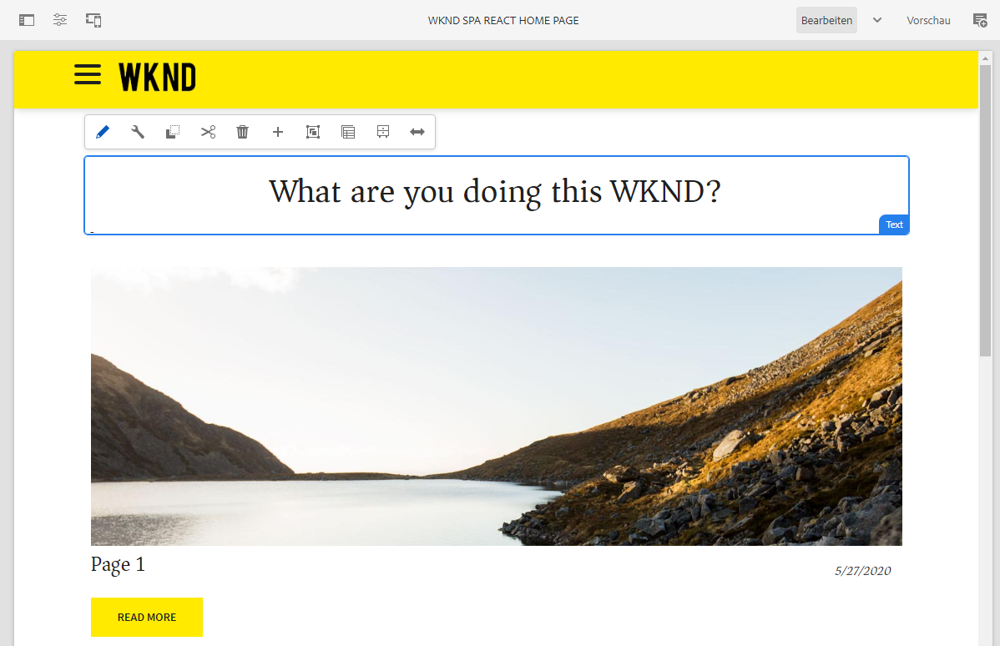

# WKND-SPA-Projekt {#wknd-spa-project}

Machen Sie sich mit diesem mehrteiligen Tutorial, das Sie durch Projekt-Setup, Komponentenzuordnung, Frontend-Entwicklungs-Tools und Anwendungs-Routing führt, mit der SPA-Entwicklung vertraut, um Ihr eigenes SPA-Projekt zu implementieren.

Ähnlich wie das AEM-WKND-Tutorial bietet dieses SPA-fokussierte Gegenstück ein umfassendes Beispiel für die Erstellung einer eigenen Single Page Application, die mit AEM bearbeitet werden kann, angefangen beim Projekt-Setup bis hin zum Anwendungs-Routing.

* [Erstellen Ihres ersten Angular-SPA-Projekts in AEM](https://docs.adobe.com/content/help/de/experience-manager-learn/spa-angular-tutorial/overview.html)
* [Erstellen Ihres ersten React-SPA-Projekts in AEM](https://docs.adobe.com/content/help/de/experience-manager-learn/spa-react-tutorial/overview.html)

Bevor Sie jedoch Ihr eigenes SPA-Projekt für AEM starten, sollten Sie auch das Dokument [Entwickeln von SPAs für AEM](developing.md) lesen.
