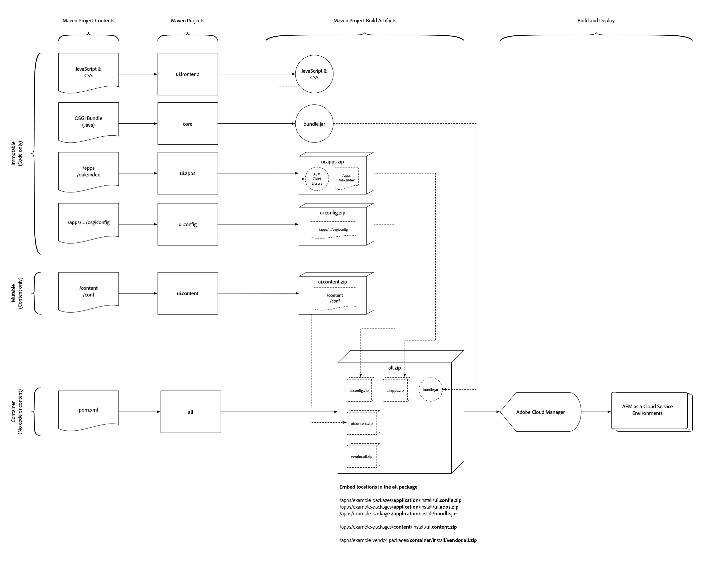

# Struktur von AEM-Projekten

>[!TIP]
>
>Machen Sie sich mit der grundlegenden [Verwendung des AEM-Projektarchetyps](https://docs.adobe.com/content/help/en/experience-manager-core-components/using/developing/archetype/overview.html) vertraut und dem [FileVault Content Maven-Plug-in](https://helpx.adobe.com/experience-manager/6-5/sites/developing/using/vlt-mavenplugin.html), da dieser Artikel auf diesen Erkenntnissen und Konzepten aufbaut.

In diesem Artikel werden die Änderungen erläutert, die erforderlich sind, damit Adobe Experience Manager Maven-Projekte als Cloud Service-kompatibel AEM werden, indem sichergestellt wird, dass sie die Aufteilung veränderlicher und unveränderlicher Inhalte respektieren, Abhängigkeiten geschaffen werden, um widersprüchliche, deterministische Bereitstellungen zu erstellen und dass sie in einer bereitstellbaren Struktur zusammengefasst werden.

AEM-Anwendungsimplementierungen müssen aus einem einzigen AEM-Paket bestehen. Dieses Paket sollte wiederum Unterpakete enthalten, die alles enthalten, was die Anwendung benötigt, um zu funktionieren, einschließlich Code, Konfiguration und unterstützenden Basisinhalten.

AEM erfordert eine Trennung von **Inhalt** und **Code**. Dies bedeutet, dass ein einzelnes Inhaltspaket **nicht** für **beide** `/apps` und für Laufzeitbereiche (z. B. `/content`, `/conf`, `/home` oder alles, was nicht `/apps` ist) des Repositorys bereitstellen kann. Stattdessen muss die Anwendung Code und Inhalt in separate Pakete für die Bereitstellung in AEM trennen.

Die in diesem Dokument beschriebene Paketstruktur ist mit lokalen Entwicklungsbereitstellungen **und** AEM Cloud Service-Bereitstellungen kompatibel.

>[!TIP]
>
>Die in diesem Dokument beschriebenen Konfigurationen werden von [AEM-Projektarchetyp 24 oder höher](https://github.com/adobe/aem-project-archetype/releases) bereitgestellt.

## Veränderliche und nicht veränderliche Bereiche des Repositorys {#mutable-vs-immutable}

`/apps` und `/libs` werden als **unveränderliche** Bereiche von AEM betrachtet, da sie nach dem Start von AEM (d. h. zur Laufzeit) nicht mehr geändert (erstellt, aktualisiert, gelöscht) werden können . Jeder Versuch, einen unveränderlichen Bereich zur Laufzeit zu ändern, schlägt fehl.

Alles andere im Repository, `/content`, `/conf`, `/var`, `/etc`, `/oak:index`, `/system`, `/tmp` usw. sind alles **veränderliche** Bereiche, d. h. sie können zur Laufzeit geändert werden.

>[!WARNING]
>
>Wie in früheren Versionen von AEM sollten `/libs` nicht geändert werden. Nur der AEM-Produkt-Code darf für `/libs` bereitstellen.

### Oak-Indizes {#oak-indexes}

Oak indexes (`/oak:index`) are specifically managed by the AEM as a Cloud Service deployment process. Dies liegt daran, dass der Cloud Manager warten muss, bis ein neuer Index bereitgestellt und vollständig neu indiziert ist, bevor zum neuen Codebild gewechselt wird.

Aus diesem Grund müssen Oak-Indizes, obwohl sie zur Laufzeit veränderbar sind, als Code bereitgestellt werden, damit sie installiert werden können, bevor veränderbare Pakete installiert werden. Daher sind `/oak:index`-Konfigurationen Teil des Code-Pakets und nicht Teil des Content-Pakets, [wie unten beschrieben](#recommended-package-structure).

>[!TIP]
>
>Weitere Informationen zur Indizierung in AEM as a Cloud Service finden Sie im Dokument zu [Inhaltssuche und -indizierung](/help/operations/indexing.md).

## Empfohlene Paketstruktur {#recommended-package-structure}



Dieses Diagramm bietet eine Übersicht über die empfohlene Projektstruktur und die empfohlenen Artefakte zur Paketbereitstellung.

Die empfohlene Bereitstellungsstruktur für Anwendungen lautet wie folgt:

### Code-Pakete/OSGi-Pakete

+ Die OSGi Bundle Jar-Datei wird generiert und direkt in das gesamte Projekt eingebettet.

+ The `ui.apps` package contains all the code to be deployed and only deploys to `/apps`. Zu den gebräuchlichen Elementen des `ui.apps`-Pakets gehören unter anderem:
   + [Komponentendefinitionen und HTML](https://docs.adobe.com/content/help/de-DE/experience-manager-htl/using/overview.html) -Skripten
      + `/apps/my-app/components`
   + JavaScript und CSS (über Client-Bibliotheken)
      + `/apps/my-app/clientlibs`
   + [Überlagerungen](/help/implementing/developing/introduction/overlays.md) von `/libs`
      + `/apps/cq`, `/apps/dam/` usw.
   + Kontextabhängige Ausweichkonfigurationen
      + `/apps/settings`
   + ACLs (Berechtigungen)
      + Alle `rep:policy` für einen Pfad unter `/apps`

+ Das `ui.config` Paket enthält alle [OSGi-Konfigurationen](/help/implementing/deploying/configuring-osgi.md):
   + Organisatorischer Ordner mit ausführmodusspezifischen OSGi-Konfigurationsdefinitionen
      + `/apps/my-app/osgiconfig`
   + Allgemeiner OSGi-Konfigurationsordner mit standardmäßigen OSGi-Konfigurationen, die für alle AEM als Cloud Service-Bereitstellungs-Zielgruppen gelten
      + `/apps/my-app/osgiconfig/config`
   + Ausführen modusspezifischer OSGi-Konfigurationsordner mit standardmäßigen OSGi-Konfigurationen, die für alle Zielgruppen AEM als Cloud Service-Bereitstellungs-Zielgruppen gelten
      + `/apps/my-app/osgiconfig/config.<author|publish>.<dev|stage|prod>`
   + Repo Init OSGi-Konfigurationsskripte
      + [Repo Init](#repo-init) ist die empfohlene Methode zum Bereitstellen (veränderlicher) Inhalte, die logischerweise Teil des AEM-Programms sind. Die Repo Init OSGi-Konfigurationen sollten sich wie oben beschrieben in dem entsprechenden `config.<runmode>` Ordner befinden und zur Definition von:
         + Grundlegende Inhaltsstrukturen
         + Benutzer
         + Dienstbenutzer
         + Gruppen
         + ACLs (Berechtigungen)

### Inhaltspakete

+ Das `ui.content` Paket enthält alle Inhalte und Konfigurationen. Das Inhaltspaket enthält alle Knotendefinitionen, die nicht in den Paketen `ui.apps` oder `ui.config` Paketen enthalten sind, bzw. alles, was nicht in `/apps` oder `/oak:index`. Zu den gebräuchlichen Elementen des `ui.content`-Pakets gehören unter anderem:
   + Kontextabhängige Konfigurationen
      + `/conf`
   + Erforderliche, komplexe Inhaltsstrukturen (d. h. Inhaltserstellungen, die auf in Repo Init definierten Inhaltsstrukturen aufbauen und diese erweitern)
      + `/content`, `/content/dam` usw.
   + Geregelte Tagging-Taxonomien
      + `/content/cq:tags`
   + Ältere Knoten usw. (idealerweise migrieren Sie diese an Nicht-/usw.-Orte)
      + `/etc`

### Container Packages

+ Das `all` Paket ist ein Container-Paket, das NUR bereitstellbare Artefakte, die OSGI Bundle Jar-Datei `ui.apps`und `ui.config` die `ui.content` Pakete als Einbettung enthält. The `all` package must not have **any content or code** of its own, but rather delegate all deployment to the repository to its sub-packages or OSGi bundle Jar files.

   Pakete werden jetzt mit der [eingebetteten Konfiguration des FileVault Package Maven-Plug-ins](#embeddeds) eingebunden, anstatt mit der `<subPackages>`-Konfiguration.

   For complex Experience Manager deployments, it may be desirable to create multiple `ui.apps`, `ui.config` and `ui.content` projects/packages that represent specific sites or tenants in AEM. If this is done, ensure the split between mutable and immutable content is respected, and the required content packages and OSGi bundle Jar files are embedded as sub-packages in the `all` container content package.

   Beispielsweise könnte eine komplexe Struktur eines Inhaltspakets für die Bereitstellung wie folgt aussehen:

   + Inhaltspaket `all` bettet die folgenden Pakete ein, um ein einzelnes Bereitstellungsartefakt zu erstellen
      + `common.ui.apps` stellt Code bereit, der **sowohl** für Site A als auch für Site B erforderlich ist
      + `site-a.core` OSGi Bundle Jar erforderlich für Website A
      + `site-a.ui.apps` stellt Code bereit, der für Site A erforderlich ist
      + `site-a.ui.config` stellt OSGi-Konfigurationen bereit, die für Site A erforderlich sind.
      + `site-a.ui.content` stellt Inhalte und Konfigurationen bereit, die für Site A erforderlich sind
      + `site-b.core` OSGi Bundle Jar erforderlich für Website B
      + `site-b.ui.apps` stellt Code bereit, der für Site B erforderlich ist
      + `site-b.ui.config` stellt OSGi-Konfigurationen bereit, die für Website B erforderlich sind.
      + `site-b.ui.content` stellt Inhalte und Konfigurationen bereit, die für Site B erforderlich sind

### Extra-Anwendungspakete{#extra-application-packages}

Wenn andere AEM Projekte, die selbst aus eigenen Code- und Inhaltspaketen bestehen, von der AEM-Bereitstellung verwendet werden, sollten ihre Container-Pakete in das Projektpaket `all` eingebettet werden.

Beispielsweise könnte ein AEM Projekt mit zwei AEM Anwendungen von Anbietern wie folgt aussehen:

+ Inhaltspaket `all` bettet die folgenden Pakete ein, um ein einzelnes Bereitstellungsartefakt zu erstellen
   + `core` OSGi Bundle Jar erforderlich für die AEM
   + `ui.apps` stellt Code bereit, der für die AEM erforderlich ist
   + `ui.config` stellt OSGi-Konfigurationen bereit, die für die AEM Anwendung erforderlich sind.
   + `ui.content` Bereitstellung der für die AEM erforderlichen Inhalte und Konfigurationen
   + `vendor-x.all` stellt alle erforderlichen Elemente (Code und Inhalt) bereit, die von der vendor X-Anwendung benötigt werden.
   + `vendor-y.all` stellt alle erforderlichen Elemente (Code und Inhalt) bereit, die von der Y-Anwendung des Anbieters benötigt werden.

## Pakettypen {#package-types}

Die Pakete sind mit ihrem deklarierten Pakettyp zu kennzeichnen.

+ Container packages must set their `packageType` to `container`.
+ (Unveränderliche) Code-Pakete müssen `packageType` auf `application` setzen.
+ (Veränderliche) Inhaltspakete müssen `packageType` auf `content` setzen.

Weitere Informationen finden Sie in der [Dokumentation zum Apache Jackrabbit FileVault Package Maven-Plug-in](https://jackrabbit.apache.org/filevault-package-maven-plugin/package-mojo.html#packageType) und dem [Konfigurations-Snippet für FileVault Maven](#marking-packages-for-deployment-by-adoube-cloud-manager) unten.

>[!TIP]
>
>Ein vollständiges Snippet finden Sie im Abschnitt [POM XML-Snippets](#xml-package-types) unten.

## Markieren von Paketen für die Bereitstellung durch Adobe Cloud Manager {#marking-packages-for-deployment-by-adoube-cloud-manager}

Standardmäßig sammelt Adobe Cloud Manager alle vom Maven-Build erstellten Pakete. Da jedoch das Container-Paket (`all`) das einzige Bereitstellungs-Artefakt ist, das alle Code- und Inhaltspakete enthält, müssen wir sicherstellen, dass **nur** das Container-Paket (`all`) bereitgestellt wird. Um dies sicherzustellen, müssen andere Pakete, die der Maven-Build generiert, mit der FileVault Content Package Maven Plug-in-Konfiguration von `<properties><cloudManagerTarget>none</cloudManageTarget></properties>` gekennzeichnet werden.

>[!TIP]
>
>Ein vollständiges Snippet finden Sie im Abschnitt [POM XML-Snippets](#pom-xml-snippets) unten.

## Repo Init{#repo-init}

Repo Init enthält Anweisungen oder Skripte, mit denen JCR-Strukturen definiert werden, von allgemeinen Knotenstrukturen wie Ordnerbäumen bis hin zu Benutzern, Dienstbenutzern, Gruppen und ACL-Definitionen.

Die Hauptvorteile von Repo Init sind, dass sie implizite Berechtigungen zum Ausführen aller durch ihre Skripte definierten Aktionen haben und früh im Bereitstellungslebenszyklus aufgerufen werden, um sicherzustellen, dass alle erforderlichen JCR-Strukturen zum Zeitpunkt der Ausführung des Codes vorhanden sind.

Während Repo Init-Skripte selbst als Skripte im `ui.config`-Projekt vorhanden sind, können und sollten sie zum Definieren der folgenden veränderbaren Strukturen verwendet werden:

+ Grundlegende Inhaltsstrukturen
+ Dienstbenutzer
+ Benutzer
+ Gruppen
+ ACLs

Repo Init scripts are stored as `scripts` entries of `RepositoryInitializer` OSGi factory configurations, and thus, can be implicitly targeted by run mode, allowing for differences between AEM Author and AEM Publish Services&#39; Repo Init scripts, or even between environments (Dev, Stage and Prod).

Repo Init OSGi-Konfigurationen werden am besten im [`.config` OSGi-Konfigurationsformat](https://sling.apache.org/documentation/bundles/configuration-installer-factory.html#configuration-files-config-1) geschrieben, da sie mehrere Zeilen unterstützen. Dies ist eine Ausnahme zu den Best Practices für die Verwendung [`.cfg.json` zur Definition von OSGi-Konfigurationen](https://sling.apache.org/documentation/bundles/configuration-installer-factory.html#configuration-files-cfgjson-1).

Beachten Sie, dass beim Definieren von Benutzern und Gruppen nur Gruppen als Teil der Anwendung betrachtet werden und hier als integraler Bestandteil ihrer Funktion definiert werden sollten. Organisationsbenutzer und -gruppen sollten weiterhin zur Laufzeit in AEM definiert werden. Wenn ein benutzerdefinierter Workflow beispielsweise einer benannten Gruppe Arbeit zuweist, sollte diese Gruppe über Repo Init in der AEM-Anwendung definiert werden. Wenn die Gruppierung jedoch nur organisatorisch ist, z. B. „Petras Team“ und „Stefans Team“, sollten diese am besten zur Laufzeit in AEM definiert und verwaltet werden.

>[!TIP]
>
>Repo Init-Skripte *müssen* im Inline-Feld `scripts` definiert werden. Die `references`-Konfiguration funktioniert nicht.

Das vollständige Vokabular für Repo Init-Skripte ist in der [Apache Sling Repo Init-Dokumentation](https://sling.apache.org/documentation/bundles/repository-initialization.html#the-repoinit-repository-initialization-language) verfügbar.

>[!TIP]
>
>Ein vollständiges Snippet finden Sie im Abschnitt [Repo Init-Snippets](#snippet-repo-init) unten.

## Repository-Strukturpaket {#repository-structure-package}

Code-Pakete müssen das FileVault Maven-Plug-in so konfigurieren, dass auf ein `<repositoryStructurePackage>` verwiesen wird, das die Richtigkeit struktureller Abhängigkeiten erzwingt (um sicherzustellen, dass ein Code-Paket nicht über ein anderes installiert wird). Sie können [Ihr eigenes Repository-Strukturpaket für Ihr Projekt erstellen](repository-structure-package.md).

Dies ist **nur für Code-Pakete erforderlich**, d. h. für alle Pakete, die mit `<packageType>application</packageType>` gekennzeichnet sind.

Informationen zum Erstellen eines Repository-Strukturpakets für Ihre Anwendung finden Sie unter [Entwickeln eines Repository-Strukturpakets](repository-structure-package.md).

Beachten Sie, dass dieses Repository-Strukturpaket für Inhaltspakete (`<packageType>content</packageType>`) **nicht** erforderlich ist.

>[!TIP]
>
>Ein vollständiges Snippet finden Sie im Abschnitt [POM XML-Snippets](#xml-repository-structure-package) unten.

## Einbetten von Unterpaketen in das Container-Paket{#embeddeds}

Inhalts- oder Code-Pakete werden in einem speziellen „Side-Car“-Ordner abgelegt und können mithilfe der `<embeddeds>`-Konfiguration des FileVault Maven-Plug-ins entweder auf AEM Autor, AEM Publish oder beiden installiert werden. Beachten Sie, dass die `<subPackages>`-Konfiguration nicht verwendet werden sollte.

Häufige Anwendungsfälle sind:

+ ACLs/Berechtigungen, die sich zwischen AEM Author- und AEM Publish-Benutzern unterscheiden
+ Konfigurationen, die nur zur Unterstützung von Aktivitäten in AEM Author verwendet werden
+ Code, wie z.B. Integrationen mit Backoffice-Systemen, die nur auf in AEM Author laufen müssen


Um AEM Author, AEM Publish oder beides als Ziel festzulegen, wird das Paket in das `all`-Container-Paket an einem bestimmten Ordnerspeicherort im folgenden Format eingebettet:

`/apps/<app-name>-packages/(content|application|container)/install(.author|.publish)?`

Aufschlüsselung dieser Ordnerstruktur:

+ Der Ordner der ersten Ebene **muss** `/apps` sein.
+ Der Ordner der zweiten Ebene stellt die Anwendung dar, wobei `-packages` an den Ordnernamen angehängt wird. Häufig gibt es nur einen einzigen Ordner der zweiten Ebene, unter dem alle Unterpakete eingebettet sind. Es können jedoch beliebig viele Ordner der zweiten Ebene erstellt werden, um die logische Struktur der Anwendung bestmöglich darzustellen:
   + `/apps/my-app-packages`
   + `/apps/my-other-app-packages`
   + `/apps/vendor-packages`

   >[!WARNING]
   >
   >Konventionell werden eingebettete Unterpakete mit dem Suffix `-packages` benannt. Dadurch wird sichergestellt, dass der Bereitstellungs-Code und die Inhaltspakete **nicht** in den Zielordnern eines Unterpakets `/apps/<app-name>/...` bereitgestellt werden, was zu destruktiven und zyklischen Installationsverhalten führt.

+ Der Ordner der dritten Ebene muss
   `application`, `content` oder `container`
   + Der `application`-Ordner enthält Code-Pakete
   + The `content` folder holds content packages
   + Der `container` Ordner enthält alle [zusätzlichen Anwendungspakete](#extra-application-packages) , die möglicherweise in der AEM enthalten sind.
Dieser Ordnername entspricht den [Pakettypen](#package-types) der darin enthaltenen Pakete.
+ Der Ordner der vierten Ebene enthält die Unterpakete und muss einer der folgenden sein:
   + `install` zur Installation auf **beiden**, AEM Author und AEM Publish
   + `install.author` zur Installation **nur** auf AEM Author
   + `install.publish` zur Installation **nur** auf AEM Publish
Beachten Sie, dass nur `install.author` und `install.publish` unterstützte Ziele sind. Andere Ausführungsmodi werden **nicht** unterstützt.

Beispielsweise kann eine Bereitstellung, die AEM Author- und Publish-spezifische Pakete enthält, wie folgt aussehen:

+ Container-Paket `all` bettet die folgenden Pakete ein, um ein einzelnes Bereitstellungsartefakt zu erstellen
   + `ui.apps` eingebettet in `/apps/my-app-packages/application/install` stellt Code für AEM Author und AEM Publish bereit
   + `ui.apps.author` eingebettet in `/apps/my-app-packages/application/install.author` stellt Code nur für AEM Author bereit
   + `ui.content` eingebettet in `/apps/my-app-packages/content/install` stellt Inhalte und Konfiguration für AEM Author und AEM Publish bereit
   + `ui.content.publish` eingebettet in `/apps/my-app-packages/content/install.publish` stellt Inhalte und Konfiguration nur für AEM Publish bereit

>[!TIP]
>
>Ein vollständiges Snippet finden Sie im Abschnitt [POM XML-Snippets](#xml-embeddeds) unten.

### Filterdefinition des Container-Pakets {#container-package-filter-definition}

Aufgrund der Einbettung von Code- und Inhalts-Unterpaketen in das Container-Paket müssen die eingebetteten Zielpfade zu `filter.xml` des Container-Projekts hinzugefügt werden, um sicherzustellen, dass die eingebetteten Pakete beim Erstellen im Container-Paket enthalten sind.

Fügen Sie einfach die `<filter root="/apps/<my-app>-packages"/>`-Einträge für alle Ordner der zweiten Ebene hinzu, die zu bereitzustellende Unterpakete enthalten.

>[!TIP]
>
>Ein vollständiges Snippet finden Sie im Abschnitt [POM XML-Snippets](#xml-container-package-filters) unten.

## Einbetten von Drittanbieter-Paketen {#embedding-3rd-party-packages}

Alle Pakete müssen über das [öffentliche Maven-Artefakt-Repository von Adobe](https://repo.adobe.com/nexus/content/groups/public/com/adobe/) oder ein öffentlich zugängliches, referenzierbares Maven-Artefakt-Repository von Drittanbietern verfügbar sein.

Wenn sich die Pakete von Drittanbietern im **öffentlichen Maven-Artefakt-Repository von Adobe** befinden, ist für Adobe Cloud Manager keine weitere Konfiguration erforderlich, um die Artefakte aufzulösen.

Wenn sich die Pakete von Drittanbietern in einem **öffentlichen Maven-Artefakt-Repository von Drittanbietern** befinden, muss dieses Repository in der `pom.xml` des Projekts registriert und gemäß der [oben beschriebenen](#embeddeds) Methode eingebettet werden.

Anwendungen/Connectors von Drittanbietern sollten mit ihrem `all` Paket als Container im Container-Paket (`all`) Ihres Projekts eingebettet werden.

Das Hinzufügen von Maven-Abhängigkeiten folgt den Standardpraktiken von Maven, und das Einbetten von Artefakten von Drittanbietern (Code- und Inhaltspakete) ist [oben beschrieben](#embedding-3rd-party-packages).

>[!TIP]
>
>Ein vollständiges Snippet finden Sie im Abschnitt [POM XML-Snippets](#xml-3rd-party-maven-repositories) unten.

## Paketabhängigkeiten zwischen den `ui.apps` von `ui.content`-Paketen {#package-dependencies}

Um eine ordnungsgemäße Installation der Pakete sicherzustellen, wird empfohlen, Abhängigkeiten zwischen Paketen zu erstellen.

Die allgemeine Regel ist, dass Pakete mit veränderlichem Inhalt (`ui.content`) vom unveränderlichen Code (`ui.apps`) abhängen sollten, der die Wiedergabe und Verwendung des veränderlichen Inhalts unterstützt.

Eine wichtige Ausnahme von dieser allgemeinen Regel ist, wenn das unveränderliche Code-Paket (`ui.apps` oder jedes andere) __nur__ OSGi-Bundles enthält. Ist dies der Fall sollte kein AEM-Paket eine Abhängigkeit angeben. Dies liegt daran, dass unveränderliche Code-Pakete, die __nur__ OSGi-Bundles enthalten, nicht bei AEM Package Manager registriert sind, sodass jedes davon abhängige AEM-Paket eine unbefriedigende Abhängigkeit aufweist und nicht installiert werden kann.

>[!TIP]
>
>Ein vollständiges Snippet finden Sie im Abschnitt [POM XML-Snippets](#xml-package-dependencies) unten.

Die üblichen Muster für Abhängigkeiten von Inhaltspaketen sind:

### Abhängigkeiten von einfachen Bereitstellungspaketen {#simple-deployment-package-dependencies}

Im einfachen Fall hängt das veränderliche Inhaltspaket `ui.content` vom unveränderlichen Code-Paket `ui.apps` ab.

+ `all` hat keine Abhängigkeiten
   + `ui.apps` hat keine Abhängigkeiten
   + `ui.content` hängt von `ui.apps` ab

### Abhängigkeiten von komplexen Bereitstellungspaketen {#complex-deploxment-package-dependencies}

Komplexe Implementierungen gehen über den einfachen Fall hinaus und legen Abhängigkeiten zwischen den entsprechenden veränderbaren Inhalten und unveränderlichen Code-Paketen fest. Abhängigkeiten können bei Bedarf auch zwischen unveränderlichen Code-Paketen festgelegt werden.

+ `all` hat keine Abhängigkeiten
   + `common.ui.apps.common` hat keine Abhängigkeiten
   + `site-a.ui.apps` hängt von `common.ui.apps` ab
   + `site-a.ui.content` hängt von `site-a.ui.apps` ab
   + `site-b.ui.apps` hängt von `common.ui.apps` ab
   + `site-b.ui.content` hängt von `site-b.ui.apps` ab

## Lokale Entwicklung und Bereitstellung {#local-development-and-deployment}

Die in diesem Artikel beschriebenen Projektstrukturen und -organisationen sind mit AEM-Instanzen für die lokale Entwicklung **vollständig kompatibel**.

## POM-XML-Snippets {#pom-xml-snippets}

Im Folgenden finden Sie Maven `pom.xml`-Konfigurations-Snippets, die zu Maven-Projekten hinzugefügt werden können, um sie an die oben genannten Empfehlungen anzupassen.

### Pakettypen {#xml-package-types}

Code- und Inhaltspakete, die als Unterpakete bereitgestellt werden, müssen abhängig davon, was sie enthalten, **application** oder **content** als Pakettyp deklarieren.

#### Container-Pakettypen {#container-package-types}

Das Container-Projekt `all/pom.xml` deklariert **keinen** `<packageType>`.

#### (Unveränderliche) Code-Pakettypen {#immutable-package-types}

Code-Pakete müssen ihren `packageType` auf `application` setzen.

In der `ui.apps/pom.xml` deklariert die `<packageType>application</packageType>`-Build-Konfigurationsanweisung der `filevault-package-maven-plugin`-Plug-in-Deklaration den Pakettyp.

```xml
...
<build>
  <plugins>
    <plugin>
      <groupId>org.apache.jackrabbit</groupId>
      <artifactId>filevault-package-maven-plugin</artifactId>
      <extensions>true</extensions>
      <configuration>
        <group>${project.groupId}</group>
        <name>my-app.ui.apps</name>
        <packageType>application</packageType>
        <accessControlHandling>merge</accessControlHandling>
        <properties>
          <cloudManagerTarget>none</cloudManagerTarget>
        </properties>
      </configuration>
    </plugin>
    ...
```

#### (Veränderliche) Code-Pakettypen {#mutable-package-types}

Inhaltspakete müssen ihren `packageType` auf `content` setzen.

In der `ui.content/pom.xml` deklariert die `<packageType>content</packageType>`-Build-Konfigurationsanweisung der `filevault-package-maven-plugin`-Plug-in-Deklaration den Pakettyp.

```xml
...
<build>
  <plugins>
    <plugin>
      <groupId>org.apache.jackrabbit</groupId>
      <artifactId>filevault-package-maven-plugin</artifactId>
      <extensions>true</extensions>
      <configuration>
        <group>${project.groupId}</group>
        <name>my-app.ui.content</name>
        <packageType>content</packageType>
        <accessControlHandling>merge</accessControlHandling>
        <properties>
          <cloudManagerTarget>none</cloudManagerTarget>
        </properties>
      </configuration>
    </plugin>
    ...
```

### Markieren von Paketen für die Bereitstellung über Adobe Cloud Manager {#cloud-manager-target}

Fügen Sie in jedem Projekt, das ein Paket generiert, **mit Ausnahme** des Container-Projekts (`all`), `<cloudManagerTarget>none</cloudManagerTarget>` der `<properties>`-Konfiguration der `filevault-package-maven-plugin`-Plug-in-Deklaration hinzu, um sicherzustellen, dass sie **nicht** von Adobe Cloud Manager bereitgestellt werden. Das Container-Paket (`all`) sollte das Einzelpaket sein, das über Cloud Manager bereitgestellt wird. Dadurch werden alle erforderlichen Code- und Inhaltspakete eingebettet.

```xml
...
<build>
  <plugins>
    <plugin>
      <groupId>org.apache.jackrabbit</groupId>
      <artifactId>filevault-package-maven-plugin</artifactId>
      <extensions>true</extensions>
      <configuration>
        ...
        <properties>
          <cloudManagerTarget>none</cloudManagerTarget>
        </properties>
      </configuration>
    </plugin>
    ...
```

### Repo Init{#snippet-repo-init}

Repo Init-Skripte, die die Repo Init-Skripte enthalten, werden in der `RepositoryInitializer`-OSGi-Werkskonfiguration über die `scripts`-Eigenschaft definiert. Note that since these scripts defined within OSGi configurations, they can be easily scoped by run mode using the usual `../config.<runmode>` folder semantics.

Note that because scripts are typically multi-line declaration, it is easier to define them in the `.config` file, than the JSON-based `.cfg.json` format.

`/apps/my-app/config.author/org.apache.sling.jcr.repoinit.RepositoryInitializer-author.config`

```plain
scripts=["
    create service user my-data-reader-service

    set ACL on /var/my-data
        allow jcr:read for my-data-reader-service
    end

    create path (sling:Folder) /conf/my-app/settings
"]
```

Die `scripts`-OSGi-Eigenschaft enthält Anweisungen, die in der [Repo Init-Sprache von Apache Sling](https://sling.apache.org/documentation/bundles/repository-initialization.html#the-repoinit-repository-initialization-language) definiert sind.

### Repository-Strukturpaket {#xml-repository-structure-package}

Fügen Sie in `ui.apps/pom.xml` und allen anderen `pom.xml`, die ein Code-Paket (`<packageType>application</packageType>`) deklarieren, die folgende Repository-Strukturpaketkonfiguration zum FileVault Maven-Plug-in hinzu. Sie können [Ihr eigenes Repository-Strukturpaket für Ihr Projekt erstellen](repository-structure-package.md).

```xml
...
<build>
  <plugins>
    <plugin>
      <groupId>org.apache.jackrabbit</groupId>
      <artifactId>filevault-package-maven-plugin</artifactId>
      <extensions>true</extensions>
      <configuration>
        ...
        <repositoryStructurePackages>
          <repositoryStructurePackage>
              <groupId>${project.groupId}</groupId>
              <artifactId>ui.apps.structure</artifactId>
              <version>${project.version}</version>
          </repositoryStructurePackage>
        </repositoryStructurePackages>
      </configuration>
    </plugin>
    ...
```

### Einbetten von Unterpaketen in das Container-Paket {#xml-embeddeds}

Fügen Sie in `all/pom.xml` der `filevault-package-maven-plugin`-Plug-in-Deklaration die folgenden `<embeddeds>`-Anweisungen hinzu. Denken Sie daran, die `<subPackages>`-Konfiguration **nicht** zu verwenden, da dies die Unterpakete in `/etc/packages` anstatt in `/apps/my-app-packages/<application|content|container>/install(.author|.publish)?` einschließt.

```xml
...
<plugin>
  <groupId>org.apache.jackrabbit</groupId>
  <artifactId>filevault-package-maven-plugin</artifactId>
  <extensions>true</extensions>
  <configuration>
      ...
      <embeddeds>

          <!-- Include the application's ui.apps and ui.content packages -->
          <!-- Ensure the artifactIds are correct -->

          <!-- OSGi Bundle Jar file that deploys to BOTH AEM Author and AEM Publish -->
          <embedded>
              <groupId>${project.groupId}</groupId>
              <artifactId>my-app.core</artifactId>
              <type>jar</type>
              <target>/apps/my-app-packages/application/install</target>
          </embedded>

          <!-- Code package that deploys to BOTH AEM Author and AEM Publish -->
          <embedded>
              <groupId>${project.groupId}</groupId>
              <artifactId>my-app.ui.apps</artifactId>
              <type>zip</type>
              <target>/apps/my-app-packages/application/install</target>
          </embedded>

           <!-- OSGi configuration code package that deploys to BOTH AEM Author and AEM Publish -->
          <embedded>
              <groupId>${project.groupId}</groupId>
              <artifactId>my-app.ui.config</artifactId>
              <type>zip</type>
              <target>/apps/my-app-packages/application/install</target>
          </embedded>

          <!-- Code package that deploys ONLY to AEM Author -->
          <embedded>
              <groupId>${project.groupId}</groupId>
              <artifactId>my-app.ui.apps.author</artifactId>
              <type>zip</type>
              <target>/apps/my-app-packages/application/install.author</target>
          </embedded>

          <!-- Content package that deploys to BOTH AEM Author and AEM Publish -->
          <embedded>
              <groupId>${project.groupId}</groupId>
              <artifactId>my-app.ui.content</artifactId>
              <type>zip</type>
              <target>/apps/my-app-packages/content/install</target>
          </embedded>

          <!-- Content package that deploys ONLY to AEM Publish -->
          <embedded>
              <groupId>${project.groupId}</groupId>
              <artifactId>my-app.ui.content.publish-only</artifactId>
              <type>zip</type>
              <target>/apps/my-app-packages/content/install.publish</target>
          </embedded>

          <!-- Include any other extra packages  -->
          <embedded>
              <groupId>com.vendor.x</groupId>
              <artifactId>vendor.plug-in.all</artifactId>
              <type>zip</type>
              <target>/apps/vendor-packages/container/install</target>
          </embedded>
      <embeddeds>
  </configuration>
</plugin>
...
```

### Filterdefinition des Container-Pakets {#xml-container-package-filters}

In der `filter.xml` des `all`-Projekts (`all/src/main/content/jcr_root/META-INF/vault/definition/filter.xml`) **schließen Sie** alle `-packages`-Ordner ein, die bereitzustellende Unterpakete enthalten:

```xml
<filter root="/apps/my-app-packages"/>
```

Wenn mehrere `/apps/*-packages` in den eingebetteten Zielen verwendet werden, müssen sie hier alle aufgezählt werden.

### Maven-Repositorys von Drittanbietern {#xml-3rd-party-maven-repositories}

>[!WARNING]
>
>Das Hinzufügen weiterer Maven-Repositorys kann die Maven-Erstellungszeiten verlängern, da zusätzliche Maven-Repositorys auf Abhängigkeiten überprüft werden.

Fügen Sie im `pom.xml` des Reaktorprojekts alle erforderlichen öffentlichen Maven-Repository-Anweisungen von Drittanbietern hinzu. Die vollständige `<repository>`-Konfiguration sollte beim Repository-Drittanbieter erhältlich sein.

```xml
<repositories>
  ...
  <repository>
      <id>3rd-party-repository</id>
      <name>Public 3rd Party Repository</name>
      <url>https://repo.3rdparty.example.com/...</url>
      <releases>
          <enabled>true</enabled>
          <updatePolicy>never</updatePolicy>
      </releases>
      <snapshots>
          <enabled>false</enabled>
      </snapshots>
  </repository>
  ...
</repositories>
```

### Paketabhängigkeiten zwischen den `ui.apps` von `ui.content`-Paketen {#xml-package-dependencies}

Fügen Sie in `ui.content/pom.xml` der `filevault-package-maven-plugin`-Plug-in-Deklaration die folgenden `<dependencies>`-Anweisungen hinzu.

```xml
...
<plugin>
  <groupId>org.apache.jackrabbit</groupId>
  <artifactId>filevault-package-maven-plugin</artifactId>
  <extensions>true</extensions>
  <configuration>
      ...
      <dependencies>
        <!-- Declare the content package dependency in the ui.content/pom.xml on the ui.apps project -->
        <dependency>
            <groupId${project.groupId}</groupId>
            <artifactId>my-app.ui.apps</artifactId>
            <version>${project.version}</version>
        </dependency>
      </dependencies>
    ...
  </configuration>
</plugin>
...
```

### Bereinigen des Zielordners des Container-Projekts {#xml-clean-container-package}

Fügen Sie `all/pom.xml` das `maven-clean-plugin`-Plug-in hinzu, welches den Zielordner vor einem Maven-Build bereinigt.

```xml
<plugins>
  ...
  <plugin>
    <artifactId>maven-clean-plugin</artifactId>
    <executions>
      <execution>
        <id>auto-clean</id>
        <!-- Run at the beginning of the build rather than the default, which is after the build is done -->
        <phase>initialize</phase>
        <goals>
          <goal>clean</goal>
        </goals>
      </execution>
    </executions>
  </plugin>
  ...
</plugins>
```

## Zusätzliche Ressourcen {#additional-resources}

+ [Verwalten von Paketen mithilfe von Maven](https://helpx.adobe.com/experience-manager/6-5/sites/developing/using/vlt-mavenplugin.html)
+ [FileVault Content Package Maven-Plug-in](http://jackrabbit.apache.org/filevault-package-maven-plugin/)