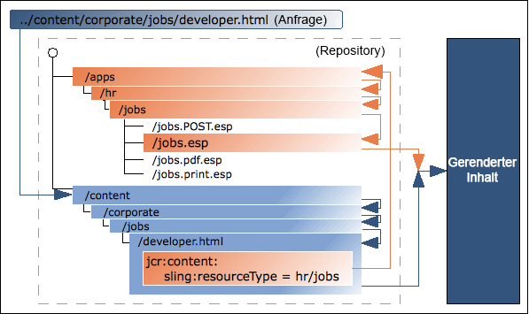

# Technische Grundlagen von AEM {#aem-technical-foundations}

AEM ist eine solide Plattform, die auf bewährten, skalierbaren und flexiblen Technologien basiert. Dieses Dokument gibt einen detaillierten Überblick über die verschiedenen Teile, aus denen AEM besteht, und ist als technischer Anhang für Full-Stack-AEM-Entwickler vorgesehen. Es ist nicht als Anleitung für den Einstieg gedacht. Wenn Sie noch nicht mit der AEM-Entwicklung vertraut sind, sehen Sie sich zum Einstieg [Erste Schritte bei der Entwicklung von AEM Sites – WKND-Tutorial](develop-wknd-tutorial.md) an.

>[!TIP]
>
>Bevor Sie sich eingehender mit den Kerntechnologien von AEM befassen, empfiehlt es sich, [Erste Schritte bei der Entwicklung von AEM Sites – WKND-Tutorial](develop-wknd-tutorial.md) durchzugehen.

## Grundlagen {#fundamentals}

Als modernes Content-Management-System setzt AEM auf Standard-Web-Technologien:

* Der Zyklus „Anfrage/Antwort“ (XMLHttpRequest/XMLHttpResponse)
* HTML
* CSS
* JavaScript

Die zugrunde liegenden Ebenen für Content-Repository und Geschäftslogik basieren auf Java-Technologien:

* JCR
* Sling
* OSGi

## Java Content Repository {#java-content-repository}

Der Java Content Repository-Standard [JSR 283](https://docs.adobe.com/content/docs/en/spec/jcr/2.0/index.html) legt eine hersteller- und implementierungsunabhängige Methode für den bidirektionalen Zugriff auf Inhalte auf einer granularen Ebene in einem Content-Repository fest. Maßgeblich für Spezifikationen ist Adobe Research (Switzerland) AG.

Das [JCR API 2.0](https://docs.adobe.com/docs/en/spec/javax.jcr/javadocs/jcr-2.0/index.html)-Paket `javax.jcr.*` wird für den direkten Zugriff und die Bearbeitung von Repository-Inhalten verwendet.

AEM basiert auf einem JCR.

## Apache Jackrabbit Oak {#jackrabbit-oak}

[Apache Jackrabbit Oak](https://jackrabbit.apache.org/oak/) ist eine Implementierung eines skalierbaren und hochleistungsfähigen hierarchischen Content-Repositorys, das als Grundlage für moderne, erstklassige Websites und andere anspruchsvolle Content-Programme verwendet werden kann und dem JCR-Standard entspricht.

Jackrabbit Oak (auch als Oak bezeichnet) ist die Implementierung des JCR-Standards, auf dem AEM aufgebaut ist.

## Sling-Anfrageverarbeitung {#sling-request-processing}

AEM basiert auf [Sling](https://sling.apache.org/site/index.html), einem auf REST-Prinzipien basierenden Web-Anwendungs-Framework, das eine einfache Entwicklung von inhaltsorientierten Programmen ermöglicht. Sling verwendet ein JCR-Repository wie Apache Jackrabbit Oak als Datenspeicher. Sling ist Teil der Apache Software Foundation – weitere Informationen finden Sie bei Apache.

### Einführung in Sling {#introduction-to-sling}

Bei Verwendung von Sling ist der Typ des zu rendernden Inhalts nicht die erste Verarbeitungsüberlegung. Stattdessen ist die Hauptüberlegung, ob die URL zu einem Inhaltsobjekt aufgelöst wird, für das dann ein Skript gefunden werden kann, um das Rendering durchzuführen. Dies bietet Autoren von Web-Inhalten eine hervorragende Unterstützung beim Erstellen von Seiten, die leicht an ihre Anforderungen angepasst werden können.

Die Vorteile dieser Flexibilität zeigen sich in Programmen mit einer großen Auswahl verschiedener Inhaltselemente oder wenn Sie Seiten benötigen, die einfach angepasst werden können. Insbesondere bei der Implementierung eines Web-Content-Management-Systems wie AEM.

Siehe [Entdecken Sie Sling in 15 Minuten](https://sling.apache.org/documentation/getting-started/discover-sling-in-15-minutes.html) für die ersten Schritte zur Entwicklung mit Sling.

Das folgende Diagramm erläutert die Sling-Skriptauflösung: Es wird gezeigt, wie Sie von der HTTP-Anfrage zum Inhaltsknoten, vom Inhaltsknoten zum Ressourcentyp, vom Ressourcentyp zum Skript gelangen und welche Skriptvariablen verfügbar sind.


Die folgende Abbildung erläutert alle ausgeblendeten, aber effektiven Anfrageparameter, die Sie im Zusammenhang mit dem `SlingPostServlet` verwenden können. Dieser Standard-Handler für alle POST-Anfragen bietet Ihnen unzählige Optionen zum Erstellen, Ändern, Löschen, Kopieren und Verschieben von Knoten im Repository.


### Sling ist inhaltszentriert {#sling-is-content-centric}

Sling ist *inhaltszentriert*. Dies bedeutet, dass sich die Verarbeitung auf den Inhalt konzentriert, da jede (HTTP-)Anfrage auf den Inhalt in Form einer JCR-Ressource (eines Repository-Knotens) abgebildet wird:

* Das erste Ziel ist die Ressource (JCR-Knoten), die die Inhalte enthält.
* Zweitens, die Repräsentation oder das Skript werden aus den Ressourceneigenschaften in Kombination mit bestimmten Teilen der Anfrage (z. B. Selektoren und/oder der Erweiterung) angeordnet.

### RESTful Sling {#restful-sling}

Aufgrund der inhaltsorientierten Philosophie implementiert Sling einen REST-orientierten Server und bietet damit ein neues Konzept für Web-Anwendungs-Frameworks. Die Vorteile:

* RESTful-Ausrichtung, nicht nur an der Oberfläche – Ressourcen und Repräsentationen werden korrekt innerhalb des Servers modelliert.
* Entfernt ein oder mehrere Datenmodelle.
   * Andere Content-Management-Frameworks erfordern möglicherweise URL-Struktur, Geschäftsobjekte und DB-Schema, um auf eine Ressource zuzugreifen.
   * Bei Verwendung von Sling ist dies auf Folgendes reduziert: URL = Ressource = JCR-Struktur.

### URL-Zerlegung {#url-decomposition}

In Sling wird die Verarbeitung durch die URL der Benutzeranfrage gesteuert. Dies definiert den Inhalt, der von den entsprechenden Skripten angezeigt werden soll. Um dies zu erreichen, werden die Informationen aus der URL extrahiert.

Wenn wir die folgende URL analysieren:

```text
https://myhost/tools/spy.printable.a4.html/a/b?x=12
```

können wir sie in ihre zusammengesetzten Teile zerlegen:

| protocol | host |  | content path | selector(s) | extension |  | suffix |  | param(s) |
|---|---|---|---|---|---|---|---|---|---|
| `https://` | `myhost` | `/` | `tools/spy` | `.printable.a4.` | `html` | `/` | `a/b` | `?` | `x=12` |

* **protocol** – HTTPS
* **host** – Domain der Site.
* **content path** – Pfad, der den darzustellenden Inhalt angibt und in Kombination mit der Erweiterung verwendet wird. In diesem Beispiel ergeben sie `tools/spy.html`
* **selector(s)** – wird für alternative Methoden zum Rendern des Inhalts verwendet. In diesem Beispiel eine druckerfreundliche Version im A4-Format.
* **extension** – Inhaltsformat; gibt außerdem das Skript an, das zum Rendern verwendet werden soll.
* **suffix** – kann verwendet werden, um zusätzliche Information anzugeben.
* **param(s)** – Alle Parameter, die für dynamischen Inhalt erforderlich sind.

#### Von URL zu Inhalt und Skripten {#from-url-to-content-and-scripts}

Anwendung der Prinzipien der URL-Zerlegung:

* Das Mapping verwendet den aus der Anfrage extrahierten Inhaltspfad, um die Ressource zu lokalisieren.
* Wenn die entsprechende Ressource gefunden wurde, wird der Sling-Ressourcentyp extrahiert und zum Suchen des Skripts verwendet, das zum Rendern des Inhalts verwendet werden soll.

Die folgende Abbildung zeigt den verwendeten Mechanismus, auf den in den folgenden Abschnitten näher eingegangen wird.



Mit Sling geben Sie an, welches Skript eine bestimmte Entität rendert (indem Sie die Eigenschaft `sling:resourceType` im JCR-Knoten festlegen). Dieser Mechanismus bietet mehr Freiheit als einer, in dem das Skript auf die Datenentitäten zugreift (wie es eine SQL-Anweisung in einem PHP-Skript tun würde), da eine Ressource mehrere Ausgabedarstellungen haben kann.

#### Zuordnen von Anfragen zu Ressourcen {#mapping-requests-to-resources}

Die Anfrage wird zerlegt und die notwendigen Informationen werden extrahiert. Das Repository wird nach der angeforderten Ressource (Inhaltsknoten) durchsucht:

* Das erste Sling prüft, ob ein Knoten an der in der Anfrage angegebenen Position existiert; z. B.: `../content/corporate/jobs/developer.html`
* Wenn kein Knoten gefunden wird, wird die Erweiterung entfernt und die Suche wiederholt; z. B. `../content/corporate/jobs/developer`
* Wenn kein Knoten gefunden wird, gibt Sling den HTTP-Code 404 (Nicht gefunden) zurück.

Sling erlaubt auch anderen Elementen als JCR-Knoten, als Ressourcen zu fungieren, dies ist jedoch eine erweiterte Funktion.

### Auffinden des Skripts {#locating-the-script}

Wenn die entsprechende Ressource (Inhaltsknoten) gefunden wird, wird der **Sling-Ressourcentyp** extrahiert. Dies ist ein Pfad, der das Skript findet, das zum Rendern des Inhalts verwendet wird.

Der vom `sling:resourceType` angegebene Pfad kann wie folgt sein:

* Absolut
* Relativ zu einem Konfigurationsparameter

>[!TIP]
>
>Relative Pfade werden von der Adobe empfohlen, da sie die Portabilität erhöhen.

Alle Sling-Skripte werden in Unterordnern von `/apps` (veränderlich, Anwenderskripte) oder `/libs` (unveränderlich, Systemskripte) gespeichert, die in dieser Reihenfolge durchsucht werden.

Einige andere zu beachtende Punkte sind:

* Wenn die Methode (GET, POST) benötigt wird, wird sie gemäß der HTTP-Spezifikation, z. B.`jobs.POST.esp` in Großbuchstaben angegeben.
* Es werden verschiedene Skript-Engines unterstützt. Gebräuchlich und empfohlen sind jedoch HTL und JavaScript.

Die Liste der von der angegebenen Instanz von AEM unterstützten Skript-Engines wird in der Felix Management Console aufgeführt (`http://<host>:<port>/system/console/slingscripting`).

Wenn der `sling:resourceType` bei Verwendung des obigen Beispiels `hr/jobs` lautet, gilt Folgendes:

* GET/HEAD-Anfragen und URLs, die auf `.html` enden (Standardanfragetypen, Standardformat)
   * Das Skript wäre `/apps/hr/jobs/jobs.esp`. Der letzte Abschnitt von `sling:resourceType` bildet den Dateinamen.
* POST-Anfragen (alle Anforderungstypen außer GET/HEAD, der Methodenname muss in Großbuchstaben angegeben werden)
   * POST wird im Skriptnamen verwendet.
   * Das Skript lautet `/apps/hr/jobs/jobs.POST.esp`.
* URLs in anderen Formaten, die nicht mit `.html` enden.
   * Beispiel `../content/corporate/jobs/developer.pdf`
   * Das Skript wäre `/apps/hr/jobs/jobs.pdf.esp`. Das Suffix wird zum Skriptnamen hinzugefügt.
* URLs mit Selektoren
   * Selektoren können verwendet werden, um denselben Inhalt in einem alternativen Format anzuzeigen. Zum Beispiel eine druckerfreundliche Version, einen RSS-Feed oder eine Zusammenfassung.
   * Bei einer druckerfreundlichen Version wäre der Selektor `print` wie in `../content/corporate/jobs/developer.print.html`.
   * Das Skript wäre `/apps/hr/jobs/jobs.print.esp`. Der Selektor wird zum Skriptnamen hinzugefügt.
* Wenn kein `sling:resourceType` definiert wurde, gilt Folgendes:
   * Der Inhaltspfad wird für die Suche nach einem geeigneten Skript verwendet (wenn der pfadbasierte `ResourceTypeProvider` aktiv ist).
   * Zum Beispiel würde das Skript für `../content/corporate/jobs/developer.html` eine Suche in `/apps/content/corporate/jobs/` erzeugen.
   * Der primäre Knotentyp wird verwendet.
* Wenn kein Skript gefunden wird, wird das Standard-Skript verwendet.
   * Die Standardversion wird derzeit als Klartext (`.txt`), HTML (`.html`) und JSON (`.json`) unterstützt, welche alle die Eigenschaften des Knotens auflisten (passend formatiert). Die Standardversion für die Erweiterung `.res` oder für Anfragen ohne Anfrageerweiterung besteht darin, die Ressource (sofern möglich) zu spoolen.
* Für die HTTP-Fehlerbehandlung (Codes 403 oder 404) sucht Sling nach einem Skript, entweder:
   * Im Speicherort `/apps/sling/servlet/errorhandler` für benutzerdefinierte Skripte
   * oder im Speicherort des Standardskripts `/libs/sling/servlet/errorhandler/404.jsp`

Wenn mehrere Skripte für eine bestimmte Anfrage gelten, wird das Skript mit der besten Übereinstimmung ausgewählt. Je genauer eine Übereinstimmung ist, desto besser ist sie; Mit anderen Worten: je mehr Selektorübereinstimmungen, desto besser, unabhängig von einer Anfrageerweiterung oder einer Übereinstimmung des Methodennamens.

Beispiel: Eine Anfrage zum Zugriff auf die Ressource

* `/content/corporate/jobs/developer.print.a4.html`

vom Typ

* `sling:resourceType="hr/jobs"`

Angenommen, wir haben die folgende Liste von Skripten am richtigen Speicherort:

1. `GET.esp`
1. `jobs.esp`
1. `html.esp`
1. `print.esp`
1. `print.html.esp`
1. `print/a4.esp`
1. `print/a4/html.esp`
1. `print/a4.html.esp`

Dann wäre die Reihenfolge der Bevorzugung (8) - (7) - (6) - (5) - (4) - (3) - (2) - (1).

Zusätzlich zu den Ressourcentypen (primär definiert durch die Eigenschaft `sling:resourceType`) gibt es auch den Supertyp der Ressource. Dieser wird normalerweise durch die Eigenschaft `sling:resourceSuperType` angezeigt. Diese Supertypen werden ebenfalls berücksichtigt, wenn Sie versuchen, ein Skript zu finden. Der Vorteil von Ressourcensupertypen besteht darin, dass sie eine Hierarchie von Ressourcen bilden können, wobei der Standard-Ressourcentyp `sling/servlet/default` (von den Standard-Servlets verwendet) effektiv der Stamm ist.

Der Ressourcensupertyp einer Ressource kann auf zwei Arten definiert werden:

* durch die Eigenschaft `sling:resourceSuperType` der Ressource.
* durch die Eigenschaft `sling:resourceSuperType` des Knotens, auf den der `sling:resourceType` zeigt.

Beispiel:

* `/`
   * `a`
   * `b`
      * `sling:resourceSuperType = a`
   * `c`
      * `sling:resourceSuperType = b`
   * `x`
      * `sling:resourceType = c`
   * `y`
      * `sling:resourceType = c`
      * `sling:resourceSuperType = a`

Die Typhierarchie von:

* `/x`
   * Er ist `[ c, b, a, <default>]`
* während für `/y`
   * die Hierarchie `[ c, a, <default>]` lautet

Grund hierfür ist, dass `/y` die Eigenschaft `sling:resourceSuperType` aufweist, während `/x` sie nicht aufweist und daher der Obertyp vom Ressourcentyp übernommen wird.

#### Sling-Skripte können nicht direkt aufgerufen werden {#sling-scripts-cannot-be-called-directly}

In Sling können Skripte nicht direkt aufgerufen werden, da dies das strenge Konzept eines REST-Servers sprengen würde. Sie würden Ressourcen und Repräsentationen mischen.

Wenn Sie die Repräsentation (das Skript) direkt aufrufen, blenden Sie die Ressource in Ihrem Skript aus, sodass das Framework (Sling) nicht mehr davon weiß. Somit verlieren Sie bestimmte Eigenschaften:

* automatische Handhabung von HTTP-Methoden außer GET, einschließlich:
   * POST, PUT, DELETE, die mit einer Sling-Standardimplementierung behandelt werden
   * das `POST.jsp`-Skript in Ihrem `sling:resourceType`-Speicherort
* Ihre Code-Architektur ist nicht mehr so sauber oder so klar strukturiert, wie sie es sein sollte. Von größter Bedeutung für die Entwicklung im großen Umfang

### Sling-API {#sling-api}

Diese verwendet das Sling API-Paket, `org.apache.sling.*` und Tag-Bibliotheken.

### Referenzieren von vorhandenen Elementen mithilfe von sling:include {#referencing-existing-elements-using-sling-include}

Eine letzte Überlegung ist die Notwendigkeit, auf vorhandene Elemente innerhalb der Skripte zu verweisen.

Komplexere Skripte (aggregierende Skripte) müssen möglicherweise auf mehrere Ressourcen zugreifen (z. B. Navigation, Seitenleiste, Fußzeile, Elemente einer Liste) und tun dies durch Einbeziehen der *Ressource*.

Dazu können Sie den Befehl `sling:include("/<path>/<resource>")` verwenden. Dies umfasst effektiv die Definition der referenzierten Ressource.

## OSGi {#osgi}

OSGi (Open Services Gateway Initiative) definiert eine Architektur für die Entwicklung und Bereitstellung modularer Programme und Bibliotheken (es wird auch als Dynamic Module System für Java bezeichnet). OSGi-Container erlauben es Ihnen, Ihr Programm in einzelne Module aufzuteilen (JAR-Dateien mit zusätzlichen Metainformationen und sogenannten Bundles in OSGi-Terminologie) und die Querabhängigkeiten zwischen ihnen zu verwalten mit:

* Services, die innerhalb des Containers implementiert sind
* einem Vertrag zwischen dem Container und Ihrem Programm

Diese Services und Verträge bieten eine Architektur, die es einzelnen Elementen ermöglicht, sich dynamisch für die Zusammenarbeit zu entdecken.

Ein OSGi-Framework bietet Ihnen dann dynamisches Laden/Entladen, Konfiguration und Kontrolle dieser Bundles - ohne dass ein Neustart erforderlich ist.

>[!NOTE]
>
>Ausführliche Informationen zur OSGi-Technologie finden Sie auf der [OSGi-Website](https://www.osgi.org).
>
>Speziell die Seite mit grundlegenden Informationen beinhaltet eine Sammlung von Präsentationen und Tutorials.

Diese Architektur ermöglicht es Ihnen, Sling um programmspezifische Module zu erweitern. Sling und damit AEM verwendet die [Apache Felix](https://felix.apache.org/)-Implementierung von OSGi. Beides sind Sammlungen von OSGi-Bundles, die in einem OSGi-Framework ausgeführt werden.

Dies ermöglicht es Ihnen, die folgenden Handlungen innerhalb Ihrer Installation für ein beliebiges Paket durchzuführen:

* Installieren
* Starten
* Anhalten
* Aktualisieren
* Deinstallieren
* Aktuellen Status anzeigen
* Zugreifen auf detailliertere Informationen (z. B. symbolischer Name, Version, Ort, usw.) über die spezifischen Bundles

Weitere Informationen finden Sie unter [Konfigurieren von OSGi für AEM as a Cloud Service](/help/implementing/deploying/configuring-osgi.md).

## Struktur innerhalb des Repositorys {#structure-within-the-repository}

Die folgende Liste gibt einen Überblick über die Struktur, die Sie im Repository sehen.

* `/apps` – programmbezogen; enthält für Ihre Website spezifische Komponentendefinitionen. Die von Ihnen entwickelten Komponenten können auf den Standardkomponenten basieren, die unter `/libs/core/wcm/components` verfügbar sind.
* `/content` – Inhalt, der für Ihre Website erstellt wurde.
* `/etc`
* `/home` – Anwender- und Gruppeninformationen.
* `/libs` – Bibliotheken und Definitionen, die zum Kern von AEM gehören. Die Unterordner in `/libs` stellen die vordefinierten AEM-Funktionen dar. Der Inhalt in `/libs` kann nicht geändert werden. Die für Ihre Website spezifischen Funktionen sollten unter `/apps` erstellt werden.
* `/tmp` - Temporärer Arbeitsbereich.
* `/var` – Dateien, die sich ändern und vom System aktualisiert werden, wie Audit-Logs, Statistiken, Event-Handling.

>[!CAUTION]
>
>Änderungen an dieser Struktur oder an den darin enthaltenen Dateien sollten sorgfältig vorgenommen werden. Machen Sie sich unbedingt mit den Auswirkungen der Änderungen vertraut, die Sie vornehmen möchten.
>
>Sie dürfen keinerlei Änderungen im Pfad `/libs` vornehmen. Für die Konfiguration und andere Änderungen kopieren Sie das Objekt von `/libs` nach `/apps` und nehmen Sie Änderungen innerhalb von `/apps` vor.
