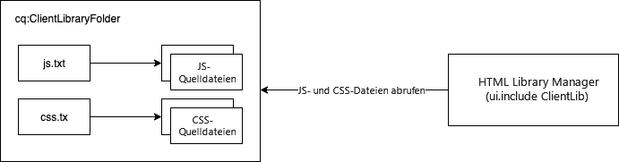

# Verwenden Client-seitiger Bibliotheken für AEM as a Cloud Service {#using-client-side-libraries}

Digitale Erlebnisse beruhen in hohem Maße auf der Client-seitigen Verarbeitung durch einen komplexen JavaScript- und CSS-Code. Client-seitige Bibliotheken von AEM (clientlibs) ermöglichen es Ihnen, diese Client-seitigen Bibliotheken zentral im Repository zu organisieren und zu speichern. In Kombination mit dem [Frontend-Build-Prozess im AEM-](https://experienceleague.adobe.com/docs/experience-manager-core-components/using/developing/archetype/uifrontend.html?lang=de)) wird die Verwaltung Ihres Frontend-Codes für Ihr AEM-Projekt sehr einfach.

Vorteile der Verwendung Client-seitiger Bibliotheken in AEM:

* Client-seitiger Code wird wie jeder andere Programm-Code und Content im Repository gespeichert.
* Client-seitige Bibliotheken in AEM können alle CSS- und JS-Elemente in einer Datei aggregieren.
* Client-seitige Bibliotheken werden über einen Pfad verfügbar gemacht, auf den der [Dispatcher](/help/implementing/dispatcher/disp-overview.md) zugreifen kann.
* Das Umschreiben von Pfaden für referenzierte Dateien oder Bilder wird ermöglicht.

Client-seitige Bibliotheken bilden die integrierte Lösung zur Bereitstellung von CSS und JavaScript aus AEM.

>[!TIP]
>
>Frontend-Entwickler, die CSS und JavaScript für AEM-Projekte erstellen, sollten sich auch mit dem [AEM-Projektarchetyp und seinem automatisierten Frontend-Build-Prozess vertraut ](https://experienceleague.adobe.com/docs/experience-manager-core-components/using/developing/archetype/uifrontend.html?lang=de).

## Was sind Client-seitige Bibliotheken? {#what-are-clientlibs}

Für Sites sind JavaScript und CSS sowie statische Ressourcen wie Symbole und Webfonts erforderlich, um eine Client-seitige Verarbeitung zu ermöglichen. Eine Client-seitige Bibliothek (Clientlib) ist der Mechanismus von AEM, um auf diese Ressourcen zu verweisen (ggf. nach Kategorie) und sie bereitzustellen.

AEM erfasst die CSS- und JavaScript-Elemente der Site in einer einzigen Datei an einem zentralen Speicherort, um sicherzustellen, dass in der HTML-Ausgabe nur eine Kopie einer Ressource enthalten ist. Dadurch wird die Effizienz der Bereitstellung gesteigert. Außerdem können diese Ressourcen über einen Proxy zentral im Repository verwaltet werden, sodass der Zugriff sicher bleibt.

## Frontend-Entwicklung für AEM as a Cloud Service {#fed-for-aemaacs}

Alle JavaScript-, CSS- und anderen Frontend-Assets sollten im [ui.frontend-Modul des AEM-Projektarchetyps) ](https://experienceleague.adobe.com/docs/experience-manager-core-components/using/developing/archetype/uifrontend.html?lang=de) werden. Dank der Flexibilität des Archetyps können Sie Ihre modernen Web-Tools Ihrer Wahl zum Erstellen und Verwalten dieser Ressourcen verwenden.

Der Archetyp kann die Ressourcen dann in einzelne CSS- und JS-Dateien kompilieren und sie automatisch in einen `cq:clientLibraryFolder` im Repository einbetten.

## Client-seitige Ordnerstruktur der Bibliothek {#clientlib-folders}

Ein Client-seitiger Bibliotheksordner ist ein Repository-Knoten des Typs `cq:ClientLibraryFolder`. Seine Definition in [CND-Notation](https://jackrabbit.apache.org/node-type-notation.html) lautet:

```text
[cq:ClientLibraryFolder] > sling:Folder
  - dependencies (string) multiple
  - categories (string) multiple
  - embed (string) multiple
  - channels (string) multiple
```

* `cq:ClientLibraryFolder`-Knoten können an einer beliebigen Stelle innerhalb der `/apps`-Unterstruktur des Repositorys platziert werden.
* Verwenden Sie die `categories`-Eigenschaft des Knotens, um festzulegen, zu welchen Bibliothekskategorien er gehört.

Jeder `cq:ClientLibraryFolder` wird mit einer Reihe von JS- und/oder CSS-Dateien sowie mehreren unterstützenden Dateien vorab gefüllt (siehe unten). Wichtige Eigenschaften des `cq:ClientLibraryFolder` sind wie folgt konfiguriert:

* `allowProxy`: Da alle Client-seitigen Bibliotheken unter `apps` gespeichert werden müssen, ermöglicht diese Eigenschaft den Zugriff auf Client-Bibliotheken über das Proxy-Servlet. Siehe [Finden eines Client-Bibliotheksordners und Verwendung des Proxy-Servlets für Client-Bibliotheken](#locating-a-client-library-folder-and-using-the-proxy-client-libraries-servlet) weiter unten.
* `categories`: Gibt die Kategorien der Gruppe von JS- und/oder CSS-Dateien in diesem `cq:ClientLibraryFolder` an. Da die `categories`-Eigenschaft ggf. mehrere Werte aufweist, kann ein Bibliotheksordner zu mehreren Kategorien gehören (weiter unten sehen Sie, warum dies nützlich sein kann).

Wenn der Client-Bibliotheksordner eine oder mehrere Quelldateien enthält, werden sie zur Laufzeit zu einer einzelnen JS- und/oder CSS-Datei zusammengeführt. Der Name der generierten Datei ist der Knotenname mit der Dateinamenerweiterung `.js` oder `.css`. Beispielsweise wird aus einem Bibliotheksknoten mit dem Namen `cq.jquery` eine Datei mit dem Namen `cq.jquery.js` oder `cq.jquery.css` generiert.

Client-Bibliotheksordner enthalten die folgenden Elemente:

* Die JS- und/oder CSS-Quelldateien
* Statische Ressourcen, die CSS-Stile unterstützen, z. B. Symbole, Webfonts usw.
* Eine Datei `js.txt` und/oder `css.txt`, die die Quelldateien angibt, die in den generierten JS- und/oder CSS Dateien zusammengeführt werden sollen



## Erstellen Client-seitiger Bibliotheksordner {#creating-clientlib-folders}

Client-Bibliotheken müssen sich unter `/apps` befinden. Diese Regel ist wichtig, um Code besser von Inhalt und Konfiguration zu isolieren.

Damit die Client-Bibliotheken unter `/apps` zugänglich sind, wird ein Proxy-Servlet verwendet. Die ACLs werden weiterhin im Client-Bibliotheksordner erzwungen, aber das Servlet ermöglicht, dass der Content über `/etc.clientlibs/` gelesen wird, wenn die `allowProxy`-Eigenschaft auf `true` gesetzt ist.

1. Öffnen Sie CRXDE Lite in einem Webbrowser (`https://<host>:<port>/crx/de`).
1. Wählen Sie den Client-Bibliotheksordner `/apps` aus und klicken Sie auf **Erstellen > Knoten erstellen**.
1. Geben Sie einen Namen für den Bibliotheksordner ein und wählen Sie in der Liste **Typ** die Option `cq:ClientLibraryFolder` aus. Klicken Sie auf **OK** und dann auf **Alle speichern**.
1. Um die Kategorien festzulegen, zu denen die Bibliothek gehört, wählen Sie den `cq:ClientLibraryFolder`-Knoten aus, fügen Sie die folgende Eigenschaft hinzu und klicken Sie auf **Alle speichern**:
   * Name: `categories`
   * Typ: String
   * Wert: Der Kategoriename
   * Multi: Ausgewählt
1. Um auf die Client-Bibliotheken über einen Proxy unter `/etc.clientlibs` zugreifen zu können, wählen Sie den `cq:ClientLibraryFolder`-Knoten aus, fügen Sie die folgende Eigenschaft hinzu und klicken Sie dann auf **Alle speichern**:
   * Name: `allowProxy`
   * Typ: Boolean
   * Wert: `true`
1. Wenn Sie statische Ressourcen verwalten müssen, erstellen Sie einen Unterordner mit dem Namen `resources` unter dem Client-Bibliotheksordner.
   * Wenn Sie statische Ressourcen an einem anderen Ort als im Ordner `resources` speichern, können diese nicht in einer Veröffentlichungsinstanz referenziert werden.
1. Fügen Sie die Quelldateien zum Bibliotheksordner hinzu.
   * Dies erfolgt normalerweise durch den Frontend-Build-Prozess des [AEM-Projektarchetyps](https://experienceleague.adobe.com/docs/experience-manager-core-components/using/developing/archetype/uifrontend.html?lang=de).
   * Sie können Quelldateien bei Bedarf in Unterordnern organisieren.
1. Wählen Sie den Client-Bibliotheksordner aus und klicken Sie auf **Erstellen > Datei erstellen**.
1. Geben Sie in das Dateinamenfeld einen der folgenden Dateinamen ein und klicken Sie auf „OK“:
   * **`js.txt`:** Verwenden Sie diesen Dateinamen, um eine JavaScript-Datei zu erzeugen.
   * **`css.txt`:** Verwenden Sie diesen Dateinamen, um ein Cascading Style Sheet zu erzeugen.
1. Öffnen Sie die Datei und geben Sie den folgenden Text ein, um das Stammverzeichnis des Pfads der Quelldateien anzugeben:
   * `#base=*[root]*`
   * Ersetzen Sie `[root]` durch den Pfad zum Ordner, der die Quelldateien enthält, relativ zur TXT-Datei. Verwenden Sie beispielsweise den folgenden Text, wenn sich die Quelldateien im selben Ordner wie die TXT-Datei befinden:
      * `#base=.`
   * Der folgende Code legt den Ordner „mobile“ unter dem `cq:ClientLibraryFolder`-Knoten als Stammverzeichnis fest:
      * `#base=mobile`
1. Geben Sie in den Zeilen unter `#base=[root]` die Pfade der Quelldateien relativ zum Stammverzeichnis ein. Geben Sie dabei jeden Dateinamen in einer separaten Zeile ein.
1. Klicken Sie auf **Alle speichern**.

## Bereitstellen Client-seitiger Bibliotheken {#serving-clientlibs}

Sobald Ihr Client-Bibliotheksordner [wie erforderlich konfiguriert](#creating-clientlib-folders) ist, können Ihre Clientlibs über einen Proxy angefordert werden. Beispiel:

* Sie verfügen über eine Client-seitige Bibliothek unter `/apps/myproject/clientlibs/foo`.
* Sie verfügen über ein statisches Bild unter `/apps/myprojects/clientlibs/foo/resources/icon.png`.

Mit der `allowProxy`-Eigenschaft können Sie Folgendes anfordern:

* Die Client-seitige Bibliothek über `/etc.clientlibs/myprojects/clientlibs/foo.js`
* Das statische Bild über `/etc.clientlibs/myprojects/clientlibs/foo/resources/icon.png`

### Laden von Client-Bibliotheken über HTL {#loading-via-htl}

Sobald Ihre Client-seitigen Bibliotheken erfolgreich in ihrem Client-Bibliotheksordner gespeichert und verwaltet werden, kann über HTL darauf zugegriffen werden.

Client-Bibliotheken werden über eine durch AEM bereitgestellte Hilfsvorlage geladen, auf die über `data-sly-use` zugegriffen werden kann. In dieser Datei sind Hilfsvorlagen verfügbar, die über `data-sly-call` abgerufen werden können.

Jede Hilfsvorlage erwartet eine `categories`-Option für das Referenzieren der gewünschten Client-Bibliotheken. Bei dieser Option kann es sich um einen Zeichenfolgenwertbereich handeln oder um eine Zeichenfolge, die eine CSV-Liste enthält.

Weitere Informationen zum Laden Client-seitiger Bibliotheken über HTL finden Sie in der [HTL-Dokumentation](https://experienceleague.adobe.com/docs/experience-manager-htl/using/getting-started/getting-started.html?lang=de#loading-client-libraries).

<!--
### Setting Cache Timestamps {#setting-cache-timestamps}

This is possible. Still need detail.
-->

## Client-Bibliotheken auf einer Autoreninstanz im Vergleich zur Veröffentlichungsinstanz {#clientlibs-author-publish}

Die meisten Client-seitigen Bibliotheken sind für die AEM-Publishing-Instanz erforderlich. Das bedeutet, dass der Zweck der meisten Client-seitigen Bibliotheken darin besteht, das Endanwendererlebnis des Contents zu erstellen. Bei Client-seitigen Bibliotheken auf Veröffentlichungsinstanzen können [Frontend-Build-Tools](#fed-for-aemaacs) wie oben beschrieben über [Client-Bibliotheksordner](#creating-clientlib-folders) verwendet und bereitgestellt werden.

Es kann jedoch vorkommen, dass Client-Bibliotheken zum Anpassen des Authoring-Erlebnisses erforderlich sind. Beispielsweise kann es zum Anpassen eines Dialogfelds erforderlich sein, kleine CSS- oder JS-Elemente auf der AEM-Autoreninstanz bereitzustellen.

### Verwalten von Client-Bibliotheken auf der Autoreninstanz {#clientlibs-on-author}

Wenn Sie Client-Bibliotheken auf der Autoreninstanz verwenden müssen, können Sie Ihre Client-Bibliotheken unter `/apps` mit den gleichen Methoden wie für Publishing-Instanzen erstellen, aber sie direkt unter `/apps/.../clientlibs/foo` schreiben, anstatt zur Verwaltung ein ganzes Projekt zu erstellen.

Anschließend können Sie einen Hook für die JS-Datei auf der Autoreninstanz verwenden, indem Sie Ihre Client-Bibliotheken zu einer vordefinierten Client-Bibliothekskategorie hinzufügen.

## Debugging-Tools {#debugging-tools}

AEM bietet eine Vielzahl von Tools zum Debuggen und Testen von Client-Bibliotheksordnern an.

### Ermitteln der Client-Bibliotheken {#discover-client-libraries}

Die Komponente `/libs/cq/granite/components/dumplibs/dumplibs` generiert eine Seite mit Informationen zu allen Client-Bibliotheksordnern im System. Der `/libs/granite/ui/content/dumplibs`-Knoten hat die Komponente als Ressourcentyp. Um die Seite zu öffnen, verwenden Sie die folgende URL (verwenden Sie je nach Bedarf einen anderen Host und Port):

`https://<host>:<port>/libs/granite/ui/content/dumplibs.test.html`

Die Informationen enthalten den Bibliothekspfad und -typ (CSS oder JS) sowie die Werte der Bibliotheksattribute, wie Kategorien und Abhängigkeiten. Nachfolgende Tabellen zeigen die Bibliotheken in jeder Kategorie und jedem Kanal an.

### Anzeigen der generierten Ausgabe {#see-generated-output}

Die Komponente `dumplibs` enthält einen Test-Selektor, der den für `ui:includeClientLib`-Tags generierten Quell-Code anzeigt. Die Seite enthält Code für verschiedene Kombinationen aus JS, CSS und Themenattributen.

1. Wählen Sie eine der folgenden Methoden, um die Testausgabeseite zu öffnen:
   * Klicken Sie auf der Seite `dumplibs.html` auf den Link im Text **Hier klicken für Ausgabetest**.
   * Öffnen Sie die folgende URL in Ihrem Webbrowser (verwenden Sie je nach Bedarf einen anderen Host und Port):
      * `http://<host>:<port>/libs/granite/ui/content/dumplibs.html`
   * Die Standardseite zeigt die Ausgabe für Tags ohne Wert für das categories-Attribut.
1. Um die Ausgabe einer Kategorie anzuzeigen, geben Sie den Wert der `categories`-Eigenschaft der Client-Bibliothek ein und klicken Sie auf **Abfrage senden**.

## Zusätzliche Funktionen für Client-Bibliotheksordner {#additional-features}

Es gibt eine Reihe weiterer Funktionen, die von Client-Bibliothek-Ordnern in AEM unterstützt werden. Diese sind jedoch für AEM as a Cloud Service nicht erforderlich und werden daher nicht empfohlen. Sie werden hier der Vollständigkeit halber aufgelistet.

>[!WARNING]
>
>Diese zusätzlichen Funktionen für Client-Bibliotheksordner sind jedoch für AEM as a Cloud Service nicht erforderlich und werden daher nicht empfohlen. Sie werden hier der Vollständigkeit halber aufgelistet.

### Adobe Granite HTML Library Manager {#html-library-manager}

Weitere Einstellungen der Client-Bibliothek können über das Bedienfeld **Adobe Granite HTML Library Manager** der Systemkonsole unter `https://<host>:<port>/system/console/configMgr` gesteuert werden.

### Zusätzliche Ordnereigenschaften {#additional-folder-properties}

Zu den zusätzlichen Ordnereigenschaften gehört die Möglichkeit, Abhängigkeiten und Einbettungen zu kontrollieren, sie sind jedoch im Allgemeinen nicht mehr erforderlich und von ihrer Verwendung wird abgeraten:

* `dependencies`: Eine Liste anderer Client-Bibliothekskategorien, von denen dieser Bibliotheksordner abhängt. Beispiel: Wenn bei zwei `cq:ClientLibraryFolder`-Knoten `F` und `G` eine Datei in `F` eine andere Datei in `G` benötigt, muss mindestens eine der `categories` von `G` in den `dependencies` von `F` aufgeführt sein, um eine ordnungsgemäße Funktionsweise sicherzustellen.
* `embed`: Wird zum Einbetten von Code aus anderen Bibliotheken verwendet. Wenn der Knoten `F` die Knoten `G` und `H` einbettet, enthält die resultierende HTML-Ausgabe Inhalte aus den Knoten `G` und `H`.

### Verknüpfen mit Abhängigkeiten {#linking-to-dependencies}

Wenn der Code in Ihrem Client-Bibliotheksordner auf andere Bibliotheken verweist, müssen Sie die anderen Bibliotheken als Abhängigkeiten angeben. Durch das Tag `ui:includeClientLib`, das Ihren Client-Bibliotheksordner referenziert, enthält der HTML-Code einen Link zu Ihrer generierten Bibliotheksdatei sowie die Abhängigkeiten.

Die Abhängigkeiten müssen ein anderer `cq:ClientLibraryFolder` sein. Fügen Sie Ihrem `cq:ClientLibraryFolder`-Knoten eine Eigenschaft mit den folgenden Attributen hinzu, um Abhängigkeiten anzugeben:

* **Name:** dependencies
* **Typ:** String[]
* **Werte:** Der Wert der categories-Eigenschaft des cq:ClientLibraryFolder-Knotens, von dem der aktuelle Bibliotheksordner abhängig ist.

Beispielsweise weist `/etc/clientlibs/myclientlibs/publicmain` eine Abhängigkeit von der `cq.jquery`-Bibliothek auf. Die Seite, die die Haupt-Client-Bibliothek referenziert, erzeugt HTML-Code, der den folgenden Code enthält:

```xml
<script src="/etc/clientlibs/foundation/cq.jquery.js" type="text/javascript">
<script src="/etc/clientlibs/mylibs/publicmain.js" type="text/javascript">
```

### Einbetten von Code aus anderen Bibliotheken {#embedding-code-from-other-libraries}

Sie können Code aus einer Client-Bibliothek in eine andere Client-Bibliothek einbetten. Zur Laufzeit wird der Code der eingebetteten Bibliothek in die generierten JS- und CSS-Dateien der einbettenden Bibliothek eingefügt.

Das Einbetten von Code ist nützlich, um Zugriff auf Bibliotheken zu ermöglichen, die in sicheren Bereichen des Repositorys gespeichert sind.

#### Anwendungsspezifische Client-Bibliotheksordner {#app-specific-client-library-folders}

Es gilt als Best Practice, alle Dateien, die zu einer Anwendung gehören, im Anwendungsordner unter `/apps` abzulegen. Außerdem sollten Sie Website-Besuchern den Zugriff auf den Ordner `/apps`verweigern. Um beide Best Practices einzuhalten, erstellen Sie einen Client-Bibliotheksordner unter dem Ordner `/etc`, der die Client-Bibliothek unter `/apps` einbettet.

Legen Sie mit der categories-Eigenschaft den Client-Bibliotheksordner fest, den Sie einbetten möchten. Um die Bibliothek einzubetten, fügen Sie dem eingebetteten `cq:ClientLibraryFolder`-Knoten eine Eigenschaft mit den folgenden Eigenschaftsattributen hinzu:

* **Name:** embed
* **Typ:** String[]
* **Wert:** Der Wert der categories-Eigenschaft des `cq:ClientLibraryFolder`-Knotens, der eingebettet werden soll.

#### Minimieren von Anfragen durch Einbetten {#using-embedding-to-minimize-requests}

In einigen Fällen enthält der endgültige HTML-Code, den Ihre Publishing-Instanz für eine typische Seite generiert, möglicherweise eine recht große Anzahl an `<script>`-Elementen.

In solchen Fällen kann es nützlich sein, den gesamten benötigten Client-Bibliotheks-Code in einer einzelnen Datei zu kombinieren, um die Anzahl der Anfragen in beide Richtungen beim Laden einer Seite zu reduzieren. Zu diesem Zweck können Sie die erforderlichen Bibliotheken in Ihre App-spezifische Client-Bibliothek einbetten. Nutzen Sie dazu die `embed`-Eigenschaft des `cq:ClientLibraryFolder`-Knotens.

#### Pfade in CSS-Dateien {#paths-in-css-files}

Wenn Sie CSS-Dateien einbetten, verwendet der generierte CSS-Code Pfade zu Ressourcen, die relativ zur einbettenden Bibliothek sind. Beispielsweise bettet die öffentlich zugängliche Bibliothek `/etc/client/libraries/myclientlibs/publicmain` die Client-Bibliothek `/apps/myapp/clientlib` ein:

Die Datei `main.css` enthält den folgenden Stil:

```javascript
body {
  padding: 0;
  margin: 0;
  background: url(images/bg-full.jpg) no-repeat center top;
  width: 100%;
}
```

Die CSS-Datei, die der `publicmain`-Knoten generiert, enthält den folgenden Stil mit der URL des Originalbilds:

```javascript
body {
  padding: 0;
  margin: 0;
  background: url(../../../apps/myapp/clientlib/styles/images/bg-full.jpg) no-repeat center top;
  width: 100%;
}
```

#### Anzeigen eingebetteter Dateien in der HTML-Ausgabe {#see-embedded-files}

Wenn Sie den Ursprung von eingebettetem Code nachvollziehen oder sicherstellen möchten, dass eingebettete Client-Bibliotheken die erwarteten Ergebnisse produzieren, können Sie die Namen der Dateien anzeigen, die zur Laufzeit eingebettet werden. Um die Dateinamen anzuzeigen, hängen Sie den Parameter `debugClientLibs=true` an die URL Ihrer Web-Seite an. Die Bibliothek, die generiert wird, enthält `@import`-Anweisungen anstelle des eingebetteten Codes.

Im Beispiel im vorherigen Abschnitt [Einbetten von Code aus anderen Bibliotheken](#embedding-code-from-other-libraries) bettet der Client-Bibliotheksordner `/etc/client/libraries/myclientlibs/publicmain` den Client-Bibliotheksordner `/apps/myapp/clientlib` ein. Wenn Sie den Parameter an die Web-Seite anhängen, wird der folgende Link im Quell-Code der Seite erzeugt:

```xml
<link rel="stylesheet" href="/etc/clientlibs/mycientlibs/publicmain.css">
```

Wenn Sie die Datei `publicmain.css` öffnen, sehen Sie den folgenden Code:

```javascript
@import url("/apps/myapp/clientlib/styles/main.css");
```

1. Hängen Sie in der Adressleiste Ihres Webbrowsers den folgenden Text an die URL Ihres HTML-Codes an:
   * `?debugClientLibs=true`
1. Öffnen Sie den Seiten-Quell-Code, nachdem die Seite geladen wurde.
1. Klicken Sie auf den Link, der als href für das Link-Element angegeben ist, um die Datei zu öffnen und den Quell-Code anzuzeigen.

### Verwendung von Präprozessoren {#using-preprocessors}

AEM ist mit austauschbaren Präprozessoren kompatibel und bietet Unterstützung für [YUI Compressor](https://github.com/yui/yuicompressor#yui-compressor---the-yahoo-javascript-and-css-compressor) für CSS und JavaScript sowie für [Google Closure Compiler (GCC)](https://developers.google.com/closure/compiler/) für JavaScript. YUI ist der Standard-Präprozessor in AEM.

Die austauschbaren Präprozessoren bieten flexible Einsatzmöglichkeiten, z. B.:

* Es können ScriptProcessors zur Verarbeitung von Skriptquellen definiert werden.
* Prozessoren sind mit Optionen konfigurierbar.
* Prozessoren können zur Minimierung, aber auch für nicht minimierte Fälle verwendet werden.
* Die Client-Bibliothek kann definieren, welcher Prozessor verwendet werden soll.

>[!NOTE]
>
>Standardmäßig verwendet AEM den YUI Compressor. In der [GitHub-Dokumentation zum YUI Compressor](https://github.com/yui/yuicompressor/issues) finden Sie eine Liste bekannter Probleme. Ein Wechsel zu GCC Compressor für bestimmte Client-Bibliotheken kann einige mit YUI verbundene Probleme beheben.

>[!CAUTION]
>
>Platzieren Sie eine minimierte Bibliothek nicht in einer Client-Bibliothek. Stellen Sie stattdessen die Rohbibliothek bereit. Wenn eine Minimierung erforderlich ist, können Sie die Optionen der Präprozessoren verwenden.

#### Nutzung {#usage}

Sie können die Präprozessorkonfiguration pro Client-Bibliothek oder systemweit festlegen.

* Fügen Sie die multivalue-Eigenschaften `cssProcessor` und `jsProcessor` zum Client-Bibliotheksknoten hinzu.
* Oder definieren Sie die standardmäßige Systemkonfiguration über die OSGi-Konfiguration im **HTML Library Manager**

Eine Präprozessor-Konfiguration im clientlib-Knoten hat Vorrang vor der OSGi-Konfiguration.

#### Format und Beispiele {#format-and-examples}

##### Format {#format}

```javascript
config:= mode ":" processorName options*;
mode:= "default" | "min";
processorName := "none" | <name>;
options := ";" option;
option := name "=" value;
```

##### YUI Compressor für CSS-Minimierung und GCC für JS {#yui-compressor-for-css-minification-and-gcc-for-js}

```javascript
cssProcessor: ["default:none", "min:yui"]
jsProcessor: ["default:none", "min:gcc;compilationLevel=advanced"]
```

##### Typescript zur Vorverarbeitung und GCC zur Minimierung und Verschleierung {#typescript-to-preprocess-and-then-gcc-to-minify-and-obfuscate}

```javascript
jsProcessor: [
   "default:typescript",
   "min:typescript",
   "min:gcc;obfuscate=true"
]
```

##### Weitere GCC-Optionen {#additional-gcc-options}

```javascript
failOnWarning (defaults to "false")
languageIn (defaults to "ECMASCRIPT5")
languageOut (defaults to "ECMASCRIPT5")
compilationLevel (defaults to "simple") (can be "whitespace", "simple", "advanced")
```

Weitere Informationen zu GCC-Optionen finden Sie in der [GCC-Dokumentation](https://developers.google.com/closure/compiler/docs/compilation_levels).

#### Festlegen des Systemstandard-Minimierers {#set-system-default-minifier}

YUI ist in AEM der Standardminimierer. Um stattdessen GCC festzulegen, führen Sie die folgenden Schritte aus.

1. Rufen Sie Apache Felix Config Manager unter `http://<host>:<port/system/console/configMgr` auf.
1. Suchen und bearbeiten Sie den **Adobe Granite HTML Library Manager**.
1. Aktivieren Sie die Option **Minimieren** (wenn nicht bereits aktiviert).
1. Setzen Sie den Wert **JS-Prozessor-Standardkonfigurationen** auf `min:gcc`.
   * Optionen können übergeben werden, wenn sie durch Semikolons getrennt sind, z. B `min:gcc;obfuscate=true`.
1. Klicken Sie auf **Speichern**, um die Änderungen zu speichern.
