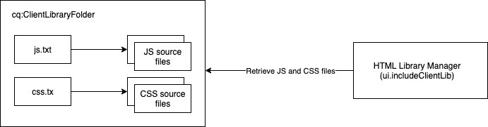

# Verwenden clientseitiger Bibliotheken auf AEM als Cloud Service {#using-client-side-libraries}

Digitale Erlebnisse basieren in hohem Maße auf clientseitiger Verarbeitung, die von komplexem JavaScript- und CSS-Code gesteuert wird. AEM clientseitigen Bibliotheken (clientlibs) ermöglichen es Ihnen, diese clientseitigen Bibliotheken im Repository zu organisieren und zentral zu speichern. In Verbindung mit dem [Front-End-Build-Prozess im AEM Project-Archetyp wird die](https://docs.adobe.com/content/help/en/experience-manager-core-components/using/developing/archetype/uifrontend.html) Verwaltung Ihres Front-End-Codes für Ihr AEM Projekt einfach.

Die Vorteile der Verwendung von clientlibs in AEM umfassen:

* Clientseitiger Code wird wie jeder andere Anwendungscode und Inhalt im Repository gespeichert
* Clientlibs in AEM können alle CSS- und JS-Dateien in einer Datei Aggregat werden
* Machen Sie clientlibs über einen Pfad verfügbar, auf den der [Dispatcher zugreifen kann.](/help/implementing/dispatcher/disp-overview.md)
* Ermöglicht das Umschreiben von Pfaden für referenzierte Dateien oder Bilder

clientlibs sind die integrierte Lösung zur Bereitstellung von CSS und JavaScript von AEM.

>[!TIP]
>
>Front-End-Entwickler, die CSS und JavaScript für AEM Projekte erstellen, sollten sich auch mit dem [AEM Project Archetype und seinem automatisierten Front-End-Build-Prozess vertraut machen.](https://docs.adobe.com/content/help/en/experience-manager-core-components/using/developing/archetype/uifrontend.html)

## Clientseitige Bibliotheken {#what-are-clientlibs}

Sites erfordern JavaScript und CSS sowie statische Ressourcen wie Symbole und Webschriftarten, um clientseitig verarbeitet zu werden. Eine clientlib ist AEM Mechanismus, um auf diese Ressourcen zu verweisen (bei Bedarf nach Kategorie).

AEM sammelt das CSS und JavaScript der Site in einer einzigen Datei an einem zentralen Speicherort, um sicherzustellen, dass nur eine Kopie einer Ressource in der HTML-Ausgabe enthalten ist. Dadurch wird die Effizienz des Versands maximiert und es wird ermöglicht, dass diese Ressourcen zentral im Repository über einen Proxy gepflegt werden, sodass der Zugriff sicher bleibt.

## Front-End-Entwicklung für AEM als Cloud Service {#fed-for-aemaacs}

Alle JavaScript-, CSS- und anderen Front-End-Elemente sollten im [ui.frontend-Modul des AEM Project Archetype verwaltet werden.](https://docs.adobe.com/content/help/en/experience-manager-core-components/using/developing/archetype/uifrontend.html) Die Flexibilität des Archetyps erlaubt Ihnen, Ihre modernen Web-Tools Ihrer Wahl zu nutzen, um diese Ressourcen zu erstellen und zu verwalten.

Der Archetyp kann die Ressourcen dann in einzelne CSS- und JS-Dateien kompilieren und sie automatisch in eine Datei `cq:clientLibraryFolder` im Repository einbetten.

## Clientseitige Ordnerstruktur der Bibliothek {#clientlib-folders}

Ein clientseitiger Bibliotheksordner ist ein Repository-Knoten des Typs `cq:ClientLibraryFolder`. Its definition in [CND notation](https://jackrabbit.apache.org/node-type-notation.html) is

```text
[cq:ClientLibraryFolder] > sling:Folder
  - dependencies (string) multiple
  - categories (string) multiple
  - embed (string) multiple
  - channels (string) multiple
```

* `cq:ClientLibraryFolder` -Knoten können an einer beliebigen Stelle innerhalb der `/apps` Unterstruktur des Repositorys platziert werden.
* Verwenden Sie die `categories`-Eigenschaft des Knotens, um festzulegen, zu welchen Bibliothekskategorien er gehört.

Each `cq:ClientLibraryFolder` is populated with a set of JS and/or CSS files, along with a few supporting files (see below). Important properties of the `cq:ClientLibraryFolder` are configured as follows:

* `allowProxy`: Da alle clientlibs unter gespeichert werden müssen, `apps`erlaubt diese Eigenschaft den Zugriff auf clientlibraries über das Proxy-Servlet. See [Locating a Client Library Folder and Using the Proxy Client Libraries Servlet](#locating-a-client-library-folder-and-using-the-proxy-client-libraries-servlet) below.
* `categories`: Identifiziert die Kategorien, in die der Satz der JS- und/oder CSS-Dateien in diesem `cq:ClientLibraryFolder` Herbst fällt. Da die Eigenschaft `categories` mehrere Werte aufweisen kann, kann ein Bibliotheksordner zu mehreren Kategorien gehören (weiter unten sehen Sie, warum dies nützlich sein kann).

Wenn der Ordner der Client-Bibliothek eine oder mehrere Quelldateien enthält, die zur Laufzeit in eine einzelne JS- und/oder CSS-Datei zusammengeführt werden. The name of the generated file is the node name with either the `.js` or `.css` file name extension. For example, the library node named `cq.jquery` results in the generated file named `cq.jquery.js` or `cq.jquery.css`.

Client-Bibliotheksordner enthalten die folgenden Elemente:

* Die JS- und/oder CSS-Quelldateien
* Statische Ressourcen, die CSS-Stile unterstützen, z. B. Symbole, Webschriftarten usw.
* One `js.txt` file and/or one `css.txt` file which identify the source files to merge in the generated JS and/or CSS files



## Erstellen clientseitiger Bibliotheksordner {#creating-clientlib-folders}

Client-Bibliotheken müssen sich unter `/apps`. Dadurch soll Code besser von Inhalt und Konfiguration isoliert werden.

In order for the client libraries under `/apps` to be accessible, a proxy servelt is used. The ACLs are still enforced on the client library folder, but the servlet allows for the content to be read via `/etc.clientlibs/` if the `allowProxy` property is set to `true`.

1. Open CRXDE Lite in a web browser (`https://<host>:<port>/crx/de`).
1. Wählen Sie den `/apps` Ordner aus und klicken Sie auf **Erstellen > Knoten** erstellen.
1. Enter a name for the library folder, and in the **Type** list select `cq:ClientLibraryFolder`. Klicken Sie auf **OK** und dann auf **Alle speichern**.
1. Um die Kategorien festzulegen, zu denen die Bibliothek gehört, wählen Sie den Knoten `cq:ClientLibraryFolder` aus, fügen Sie die folgende Eigenschaft hinzu und klicken Sie auf **Alle speichern**:
   * Name: `categories`
   * Typ: String
   * Wert: Kategoriename
   * Multi: Ausgewählt
1. Um auf die Clientbibliotheken über einen Proxy unter `/etc.clientlibs`zugreifen zu können, wählen Sie den `cq:ClientLibraryFolder` Knoten aus, fügen Sie die folgende Eigenschaft hinzu und klicken Sie dann auf Alle **speichern**:
   * Name: `allowProxy`
   * Type: Boolean
   * Wert: `true`
1. Wenn Sie statische Ressourcen verwalten müssen, erstellen Sie einen Unterordner mit dem Namen `resources` unter dem Clientbibliotheksordner.
   * Wenn Sie statische Ressourcen im Ordner speichern, `resources`können sie in einer Veröffentlichungsinstanz nicht referenziert werden.
1. hinzufügen Quelldateien in den Bibliotheksordner.
   * Dies geschieht normalerweise durch den Front-End-Build-Prozess des [AEM Project Archetype.](https://docs.adobe.com/content/help/en/experience-manager-core-components/using/developing/archetype/uifrontend.html)
   * Sie können Quelldateien nach Bedarf in Unterordnern organisieren.
1. Wählen Sie den Client-Bibliotheksordner aus und klicken Sie auf **Erstellen > Datei erstellen**.
1. Geben Sie in das Dateinamenfeld einen der folgenden Dateinamen ein und klicken Sie auf „OK“:
   * **`js.txt`:** Verwenden Sie diesen Dateinamen, um eine JavaScript-Datei zu erzeugen.
   * **`css.txt`:** Verwenden Sie diesen Dateinamen, um ein Cascading Style Sheet zu erzeugen.
1. Öffnen Sie die Datei und geben Sie den folgenden Text ein, um das Stammverzeichnis des Pfads der Quelldateien anzugeben:
   * `#base=*[root]*`
   * Replace `[root]` with the path to the folder that contains the source files, relative to the TXT file. Verwenden Sie beispielsweise den folgenden Text, wenn sich die Quelldateien im selben Ordner wie die TXT-Datei befinden:
      * `#base=.`
   * Der folgende Code legt den Ordner „mobile“ unter dem Knoten `cq:ClientLibraryFolder` als Stammverzeichnis fest:
      * `#base=mobile`
1. On the lines below `#base=[root]`, type the paths of the source files relative to the root. Geben Sie dabei jeden Dateinamen in einer separaten Zeile ein.
1. Klicken Sie auf **Alle speichern**.

## Bereitstellen clientseitiger Bibliotheken {#serving-clientlibs}

Sobald Ihr Client-Bibliotheksordner wie erforderlich [konfiguriert wurde,](#creating-clientlib-folders) können Sie Ihre clientlibs über einen Proxy anfordern. Beispiel:

* You have a clientlib in `/apps/myproject/clientlibs/foo`
* You have a static image in `/apps/myprojects/clientlibs/foo/resources/icon.png`

Mit der `allowProxy` Eigenschaft können Sie Folgendes anfordern:

* clientlib via j`/etc.clientlibs/myprojects/clientlibs/foo.js`
* Das statische Bild über `/etc.clientlibs/myprojects/clientlibs/foo/resources/icon.png`

### Laden von Client-Bibliotheken über HTML {#loading-via-htl}

Sobald Ihre clientlibs erfolgreich in ihrem Client-Bibliotheksordner gespeichert und verwaltet wurden, können sie über HTL darauf zugreifen.

Client libraries are loaded through a helper template provided by AEM, which can be accessed through `data-sly-use`. Helper templates are available in this file, which can be called through `data-sly-call`.

Jede Hilfsvorlage erwartet eine `categories`-Option für das Referenzieren der gewünschten Client-Bibliotheken. Bei dieser Option kann es sich um einen Zeichenfolgenwertbereich handeln oder um eine Zeichenfolge, die eine CSV-Liste enthält.

[Weitere Informationen zum Laden von clientlibs via HTL finden Sie in der HTL-Dokumentation](https://docs.adobe.com/content/help/en/experience-manager-htl/using/getting-started/getting-started.html#loading-client-libraries) .

<!--
### Setting Cache Timestamps {#setting-cache-timestamps}

This is possible. Still need detail.
-->

## Client-Bibliotheken für Autor und Veröffentlichen {#clientlibs-author-publish}

Die meisten clientlibs sind für die AEM Veröffentlichungsinstanz erforderlich. Das heißt, die meisten clientlibs haben das Ziel, die Endbenutzerfreundlichkeit des Inhalts zu erzeugen. Bei clientlibs auf Veröffentlichungsinstanzen können [Front-End-Buildwerkzeuge](#fed-for-aemaacs) wie oben beschrieben über [Clientbibliotheksordner verwendet und bereitgestellt werden.](#creating-clientlib-folders)

Es kann jedoch vorkommen, dass Clientbibliotheken zum Anpassen des Authoring-Erlebnisses erforderlich sein können. Zum Anpassen eines Dialogfelds kann es beispielsweise erforderlich sein, kleine CSS- oder JS-Bit in der AEM Authoring-Instanz bereitzustellen.

### Verwalten von Client-Bibliotheken beim Autor {#clientlibs-on-author}

Wenn Sie Clientbibliotheken für Autoren verwenden müssen, können Sie Ihre Clientbibliotheken mit den gleichen Methoden wie für Veröffentlichungen erstellen, aber sie direkt unter schreiben, `/apps` `/apps/.../clientlibs/foo` anstatt ein ganzes Projekt zu erstellen, um es zu verwalten.

Anschließend können Sie Ihre Client-Bibliotheken zu einer vordefinierten Client-Bibliotheks-Kategorie in die Authoring-JS einbinden.

## Debugging-Tools {#debugging-tools}

AEM bietet eine Vielzahl von Tools zum Debuggen und Testen von Client-Bibliotheksordnern an.

### Ermitteln der Client-Bibliotheken {#discover-client-libraries}

The `/libs/cq/granite/components/dumplibs/dumplibs` component generates a page of information about all client library folders on the system. The `/libs/granite/ui/content/dumplibs` node has the component as a resource type. Um die Seite zu öffnen, verwenden Sie die folgende URL (d. h. den Host und Anschluss nach Bedarf ändern):

`https://<host>:<port>/libs/granite/ui/content/dumplibs.test.html`

Zu den Informationen gehören der Bibliothekspfad und -typ (CSS oder JS) und die Werte der Bibliotheksattribute, wie z. B. Kategorien und Abhängigkeiten. Nachfolgende Tabellen auf der Seite zeigen die Bibliotheken in jeder Kategorie und jedem Kanal.

### Anzeigen der generierten Ausgabe {#see-generated-output}

The `dumplibs` component includes a test selector that displays the source code that is generated for `ui:includeClientLib` tags. Die Seite enthält Code für verschiedene Kombinationen von js-, css- und themed-Attributen.

1. Wählen Sie eine der folgenden Methoden, um die Testausgabeseite zu öffnen:
   * From the `dumplibs.html` page, click the link in the **Click here for output testing** text.
   * Öffnen Sie die folgende URL in Ihrem Webbrowser (verwenden Sie je nach Bedarf einen anderen Host und Port):
      * `http://<host>:<port>/libs/granite/ui/content/dumplibs.html`
   * Die Standardseite zeigt die Ausgabe für Tags ohne Wert für das category-Attribut.
1. To see the output for a category, type the value of the client library&#39;s `categories` property and click **Submit Query**.

## Zusätzliche Funktionen für den Client-Bibliotheksordner {#additional-features}

Es gibt eine Reihe weiterer Funktionen, die von Clientbibliotheksordnern in AEM unterstützt werden. Diese sind jedoch nicht AEM als Cloud Service erforderlich und werden daher nicht empfohlen. Sie werden hier zur Vollständigkeit aufgelistet.

>[!WARNING]
>
>Diese zusätzlichen Funktionen von Client-Bibliotheksordnern sind auf AEM als Cloud Service nicht erforderlich und werden daher nicht empfohlen. Sie werden hier zur Vollständigkeit aufgelistet.

### Adobe Granite HTML LIbrary Manager {#html-library-manager}

Weitere Einstellungen der Client-Bibliothek können über das Bedienfeld &quot; **Adobe Granite HTML Library Manager** &quot;der Systemkonsole unter `https://<host>:<port>/system/console/configMgr`) gesteuert werden.

### Zusätzliche Ordnereigenschaften {#additional-folder-properties}

Zu den weiteren Ordnereigenschaften gehören die Möglichkeit, Abhängigkeiten und Einbettungen zu kontrollieren, sie sind jedoch im Allgemeinen nicht mehr erforderlich und ihre Verwendung wird empfohlen:

* `dependencies`: Eine Liste anderer Client-Bibliothekskategorien, von denen dieser Bibliotheksordner abhängt. For example, given two `cq:ClientLibraryFolder` nodes `F` and `G`, if a file in `F` requires another file in `G` in order to function properly, then at least one of the `categories` of `G` should be among the `dependencies` of `F`.
* `embed`: Wird zum Einbetten von Code aus anderen Bibliotheken verwendet. If node `F` embeds nodes `G` and `H`, the resulting HTML will be a concatenation of content from nodes `G` and `H`.

### Verknüpfung mit Abhängigkeiten {#linking-to-dependencies}

Wenn der Code in Ihrem Client-Bibliotheksordner auf andere Bibliotheken verweist, müssen Sie die anderen Bibliotheken als Abhängigkeiten angeben. The `ui:includeClientLib` tag that references your client library folder causes the HTML code to include a link to your generated library file as well as the dependencies.

The dependencies must be another `cq:ClientLibraryFolder`. Fügen Sie Ihrem `cq:ClientLibraryFolder`-Knoten eine Eigenschaft mit den folgenden Attributen hinzu, um Abhängigkeiten anzugeben:

* **Name:** dependencies
* **Typ:** String[]
* **Werte:** Der Wert der Kategorieeigenschaft des cq:ClientLibraryFolder-Knotens, von dem der aktuelle Bibliotheksordner abhängig ist.

For example, the `/etc/clientlibs/myclientlibs/publicmain` has a dependency on the `cq.jquery` library. Die Seite, die auf die Hauptclientbibliothek verweist, generiert HTML, das den folgenden Code enthält:

```xml
<script src="/etc/clientlibs/foundation/cq.jquery.js" type="text/javascript">
<script src="/etc/clientlibs/mylibs/publicmain.js" type="text/javascript">
```

### Einbetten von Code aus anderen Bibliotheken {#embedding-code-from-other-libraries}

Sie können Code aus einer Client-Bibliothek in eine andere Client-Bibliothek einbetten. Zur Laufzeit wird der Code der eingebetteten Bibliothek in die generierten JS- und CSS-Dateien der einbettenden Bibliothek eingefügt.

Das Einbetten von Code ist nützlich, um Zugriff auf Bibliotheken zu ermöglichen, die in sicheren Bereichen des Repositorys gespeichert sind.

#### Anwendungsspezifische Client-Bibliotheksordner {#app-specific-client-library-folders}

It is a best practice to keep all application-related files in their application folder below `/app`. It is also a best practice to deny access for web site visitors to the `/app` folder. To satisfy both best practices, create a client library folder below the `/etc` folder that embeds the client library that is below `/app`.

Verwenden Sie die Eigenschaft &quot;Kategorien&quot;, um den einzubettenden Clientbibliotheksordner zu identifizieren. Um die Bibliothek einzubetten, fügen Sie dem einbettenden `cq:ClientLibraryFolder`-Knoten eine Eigenschaft mit den folgenden Eigenschaftsattributen hinzu:

* **Name:** embed
* **Typ:** String[]
* **Wert:** Der Wert der Eigenschaft &quot;Kategorien&quot;des einzubettenden `cq:ClientLibraryFolder` Knotens.

#### Minimieren von Anfragen durch Einbetten {#using-embedding-to-minimize-requests}

In einigen Fällen können Sie feststellen, dass der finale HTML-Code, der für eine typische Seite von Ihrer Veröffentlichungsinstanz generiert wurde, eine relativ große Anzahl von `<script>` Elementen enthält.

In solchen Fällen kann es nützlich sein, den gesamten benötigten Client-Bibliothekscode in einer einzelnen Datei zu kombinieren, um die Anzahl der Anfragen in beide Richtungen beim Laden einer Seite zu reduzieren. To do this you can `embed` the required libraries into you app-specific client library using the embed property of the `cq:ClientLibraryFolder` node.

#### Pfade in CSS-Dateien {#paths-in-css-files}

Wenn Sie CSS-Dateien einbetten, verwendet der generierte CSS-Code Pfade zu Ressourcen, die relativ zur einbettenden Bibliothek sind. For example, the publicly-accessible library `/etc/client/libraries/myclientlibs/publicmain` embeds the `/apps/myapp/clientlib` client library:

Die Datei `main.css` enthält den folgenden Stil:

```javascript
body {
  padding: 0;
  margin: 0;
  background: url(images/bg-full.jpg) no-repeat center top;
  width: 100%;
}
```

Die CSS-Datei, die der `publicmain`-Knoten generiert, enthält den folgenden Stil mit der URL des Originalbilds:

```javascript
body {
  padding: 0;
  margin: 0;
  background: url(../../../apps/myapp/clientlib/styles/images/bg-full.jpg) no-repeat center top;
  width: 100%;
}
```

#### Siehe Eingebettete Dateien in HTML-Ausgabe {#see-embedded-files}

Wenn Sie den Ursprung von eingebettetem Code nachvollziehen oder sicherstellen möchten, dass eingebettete Client-Bibliotheken die erwarteten Ergebnisse produzieren, können Sie die Namen der Dateien anzeigen, die zur Laufzeit eingebettet werden. Um die Dateinamen anzuzeigen, hängen Sie den Parameter `debugClientLibs=true` an die URL Ihrer Webseite an. The library that is generated contains `@import` statements instead of the embedded code.

In the example in the previous [Embedding Code From Other Libraries](#embedding-code-from-other-libraries) section, the `/etc/client/libraries/myclientlibs/publicmain` client library folder embeds the `/apps/myapp/clientlib` client library folder. Wenn Sie den Parameter an die Webseite anhängen, wird der folgende Link im Quellcode der Seite erzeugt:

```xml
<link rel="stylesheet" href="/etc/clientlibs/mycientlibs/publicmain.css">
```

Wenn Sie die Datei `publicmain.css` öffnen, sehen Sie den folgenden Code:

```javascript
@import url("/apps/myapp/clientlib/styles/main.css");
```

1. Hängen Sie in der Adressleiste Ihres Webbrowsers den folgenden Text an die URL Ihres HTML-Codes an:
   * `?debugClientLibs=true`
1. Öffnen Sie den Seiten-Quellcode, nachdem die Seite geladen wurde.
1. Klicken Sie auf den Link, der als href für das Link-Element angegeben ist, um die Datei zu öffnen und den Quellcode anzuzeigen.

### Verwendung von Präprozessoren {#using-preprocessors}

AEM allows for pluggable preprocessors and ships with support for [YUI Compressor](https://github.com/yui/yuicompressor#yui-compressor---the-yahoo-javascript-and-css-compressor) for CSS and JavaScript and [Google Closure Compiler (GCC)](https://developers.google.com/closure/compiler/) for JavaScript with YUI set as AEM&#39;s default preprocessor.

Die austauschbaren Präprozessoren bieten flexible Einsatzmöglichkeiten, z. B.:

* Definition von ScriptProcessors, die Skriptquellen verarbeiten können
* Prozessoren sind mit Optionen konfigurierbar
* Prozessoren können zur Minimierung, aber auch für nicht minimierte Fälle verwendet werden
* Die clientlib kann den zu verwendenden Prozessor festlegen

>[!NOTE]
>
>Standardmäßig verwendet AEM YUI Compressor. In der [GitHub-Dokumentation zu YUI Compressor](https://github.com/yui/yuicompressor/issues) finden Sie eine Liste bekannter Probleme. Ein Wechsel zu GCC Compressor für bestimmte clientlibs kann einige Probleme beheben, die mit YUI auftreten.

>[!CAUTION]
>
>Platzieren Sie eine minimierte Bibliothek nicht in einer Client-Bibliothek. Stellen Sie stattdessen die Rohbibliothek bereit. Wenn eine Minimierung erforderlich ist, können Sie die Möglichkeiten der Präprozessoren verwenden.

#### Verwendung {#usage}

Sie können die Präprozessorkonfiguration pro Client-Bibliothek oder systemweit festlegen.

* Add the multivalue properties `cssProcessor` and `jsProcessor` on the clientlibrary node
* Oder definieren Sie die standardmäßige Systemkonfiguration über die OSGi-Konfiguration im **HTML Library Manager**

Eine Vorprozessorkonfiguration auf dem Knoten clientlib hat Vorrang vor der OSGI-Konfiguration.

#### Format und Beispiele {#format-and-examples}

##### Format {#format}

```javascript
config:= mode ":" processorName options*;
mode:= "default" | "min";
processorName := "none" | <name>;
options := ";" option;
option := name "=" value;
```

##### YUI Compressor für CSS-Minimierung und GCC für JS {#yui-compressor-for-css-minification-and-gcc-for-js}

```javascript
cssProcessor: ["default:none", "min:yui"]
jsProcessor: ["default:none", "min:gcc;compilationLevel=advanced"]
```

##### Typescript zur Vorverarbeitung und GCC zur Minimierung und Verschleierung {#typescript-to-preprocess-and-then-gcc-to-minify-and-obfuscate}

```javascript
jsProcessor: [
   "default:typescript",
   "min:typescript",
   "min:gcc;obfuscate=true"
]
```

##### Weitere GCC-Optionen {#additional-gcc-options}

```javascript
failOnWarning (defaults to "false")
languageIn (defaults to "ECMASCRIPT5")
languageOut (defaults to "ECMASCRIPT5")
compilationLevel (defaults to "simple") (can be "whitespace", "simple", "advanced")
```

Weitere Informationen zu GCC-Optionen finden Sie in der [GCC-Dokumentation](https://developers.google.com/closure/compiler/docs/compilation_levels).

#### Festlegen des Systemstandard-Minimierers {#set-system-default-minifier}

YUI ist in AEM der Standardminimierer. Um stattdessen GCC festzulegen, führen Sie die folgenden Schritte aus.

1. Go to Apache Felix Config Manager at (`http://<host>:<portY/system/console/configMgr`)
1. Find and edit the **Adobe Granite HTML Library Manager**.
1. Aktivieren Sie die Option **Minimieren** (wenn nicht bereits aktiviert).
1. Set the value **JS Processor Default Configs** to `min:gcc`.
   * Options can be passed if separated with a semicolon e.g. `min:gcc;obfuscate=true`.
1. Klicken Sie auf **Speichern**, um die Änderungen zu speichern.
