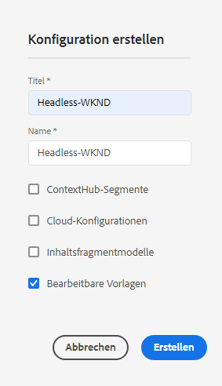
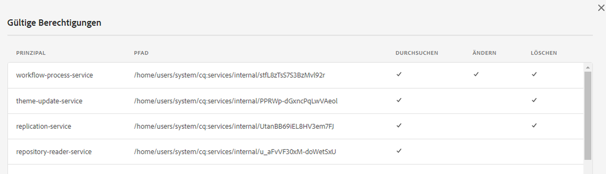
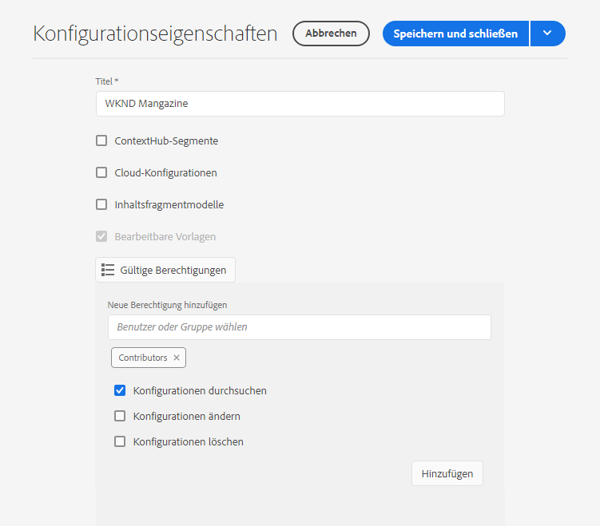
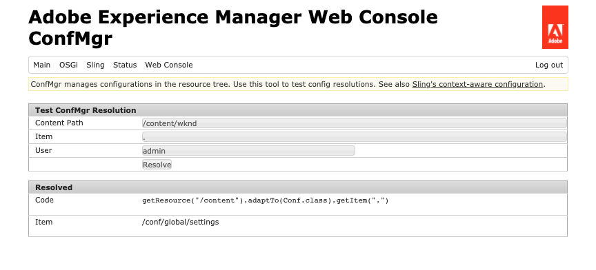

# Konfigurationen und der Konfigurationsbrowser {#configuration-browser}

AEM Konfigurationen dienen zur Verwaltung von Einstellungen in AEM und dienen als Arbeitsbereiche.

## Was ist eine Konfiguration? {#what-is-a-configuration}

Eine Konfiguration kann aus zwei verschiedenen Perspektiven betrachtet werden.

* [Ein ](#configurations-administrator) Administrator verwendet Konfigurationen als Arbeitsbereiche in AEM, um Einstellungsgruppen zu definieren und zu verwalten.
* [Ein ](#configurations-developer) Entwickler verwendet den zugrunde liegenden Konfigurationsmechanismus, der Konfigurationen implementiert, um die Einstellungen in AEM beizubehalten und nachzuschlagen.

Zusammenfassung: Aus der Ansicht eines Administrators ergeben sich bei Konfigurationen die Arbeitsbereiche zur Verwaltung von Einstellungen in AEM, während der Entwickler verstehen sollte, wie AEM diese Konfigurationen im Repository verwendet und verwaltet.

Konfigurationen dienen unabhängig von Ihrer Perspektive zwei Hauptzielen in AEM:

* Konfigurationen ermöglichen bestimmte Funktionen für bestimmte Benutzergruppen.
* Konfigurationen definieren Zugriffsrechte für diese Funktionen.

## Konfigurationen als Administrator {#configurations-administrator}

Sowohl der AEM-Administrator als auch die Autoren können Konfigurationen als Arbeitsbereiche betrachten. Diese Arbeitsbereiche können verwendet werden, um Gruppen von Einstellungen sowie deren zugehörigen Inhalt für organisatorische Zwecke zu sammeln, indem Zugriffsrechte für diese Funktionen implementiert werden.

Konfigurationen können für viele verschiedene Funktionen in AEM erstellt werden.

* [Cloud-Konfigurationen](/help/implementing/developing/introduction/configurations.md)
* [Context Hub-Segmente](/help/sites-cloud/authoring/personalization/contexthub-segmentation.md)
* [Inhaltsfragmentmodelle](/help/assets/content-fragments/content-fragments-models.md)
* [Bearbeitbare Vorlagen](/help/sites-cloud/authoring/features/templates.md)

### Beispiel {#administrator-example}

Ein Administrator kann beispielsweise zwei Konfigurationen für bearbeitbare Vorlagen erstellen.

* WKND-General
* WKND-Magazin

Der Admin kann dann allgemeine Seitenvorlagen mit der WKND-General Konfiguration und dann Vorlagen für das Magazin unter WKND-Magazine erstellen.

Der Administrator kann dann den WKND-General mit dem gesamten Inhalt der WKND-Site verknüpfen. Die WKND-Magazine-Konfiguration würde jedoch nur mit der Magazin-Site verknüpft.

Dies geschieht folgendermaßen:

* Wenn ein Autor eine neue Seite für die Zeitschrift erstellt, kann der Autor aus allgemeinen Vorlagen (WKND-Allgemein) oder Zeitschriftenvorlagen (WKND-Magazine) wählen.
* Wenn ein Autor eine neue Seite für einen anderen Teil der Site erstellt, der nicht die Zeitschrift ist, kann der Autor nur aus den allgemeinen Vorlagen (WKND-Allgemein) wählen.

Ähnliche Setups sind nicht nur für bearbeitbare Vorlagen, sondern auch für Cloud-Konfigurationen, ContextHub-Segmente und Inhaltsfragmentmodelle möglich.

### Verwenden des Konfigurations-Browsers {#using-configuration-browser}

Der Konfigurationsbrowser ermöglicht es einem Administrator, Zugriffsrechte für Konfigurationen in AEM einfach zu erstellen, zu verwalten und zu konfigurieren.

>[!NOTE]
>
>Es ist nur möglich, Konfigurationen mit dem Konfigurationsbrowser zu erstellen, wenn Ihr Benutzer über `admin`-Rechte verfügt. `admin` Rechte sind auch erforderlich, um der Konfiguration Zugriffsrechte zuzuweisen oder eine Konfiguration anderweitig zu ändern.

#### Erstellen einer Konfiguration {#creating-a-configuration}

Es ist ganz einfach, mithilfe des Konfigurationsbrowsers eine neue Konfiguration in AEM zu erstellen.

1. Melden Sie sich bei AEM als Cloud Service an und wählen Sie im Hauptmenü **Tools** -> **Allgemein** -> **Konfigurationsbrowser**.
1. Tippen oder klicken Sie auf **Erstellen**.
1. Geben Sie für Ihre Konfiguration einen **Titel** und einen **Namen** ein.

   

   * Der **Titel** sollte beschreibend sein.
   * Der Knoten **Name** wird zum Knotennamen im Repository.
      * Sie wird automatisch basierend auf dem Titel generiert und entsprechend den Benennungskonventionen [AEM angepasst.](naming-conventions.md)
      * Er kann bei Bedarf angepasst werden.
1. Überprüfen Sie die Art der Konfigurationen, die Sie zulassen möchten.
   * [Cloud-Konfigurationen](/help/implementing/developing/introduction/configurations.md)
   * [Context Hub-Segmente](/help/sites-cloud/authoring/personalization/contexthub-segmentation.md)
   * [Inhaltsfragmentmodelle](/help/assets/content-fragments/content-fragments-models.md)
   * [Bearbeitbare Vorlagen](/help/sites-cloud/authoring/features/templates.md)
1. Tippen oder klicken Sie auf **Erstellen**.

>[!TIP]
>
>Konfigurationen können verschachtelt sein.

#### Bearbeiten von Konfigurationen und deren Zugriffsrechten {#access-rights}

Wenn Sie Konfigurationen als Arbeitsbereiche betrachten, können Zugriffsrechte für diese Konfigurationen festgelegt werden, um zu erzwingen, wer auf diese Arbeitsbereiche zugreifen darf oder nicht.

1. Melden Sie sich bei AEM als Cloud Service an und wählen Sie im Hauptmenü **Tools** -> **Allgemein** -> **Konfigurationsbrowser**.
1. Wählen Sie die zu ändernde Konfiguration aus und tippen oder klicken Sie in der Symbolleiste auf **Eigenschaften**.
1. Wählen Sie alle zusätzlichen Funktionen aus, die Sie der Konfiguration hinzufügen möchten
   >[!NOTE]
   >
   >Es ist nicht möglich, die Auswahl einer Funktion aufzuheben, nachdem die Konfiguration erstellt wurde.
1. Verwenden Sie die Schaltfläche **Effektive Berechtigungen**, um eine Rollenmatrix und die Berechtigungen, die derzeit für Konfigurationen gewährt werden, Ansicht.
   
1. Um neue Berechtigungen zuzuweisen, geben Sie den Benutzer- oder Gruppennamen in das Feld **Benutzer oder Gruppe auswählen** im Abschnitt **Hinzufügen Neue Berechtigungen** ein.
   * Die Angebot **Benutzer oder Gruppe auswählen** werden basierend auf vorhandenen Benutzern und Rollen automatisch ausgefüllt.
1. Wählen Sie den gewünschten Benutzer oder die entsprechende Rolle aus den Ergebnissen der automatischen Vervollständigung aus.
   * Sie können mehrere Benutzer oder Rollen auswählen.
1. Markieren Sie die Zugriffsoptionen, die der/die ausgewählte(n) Benutzer/Rollen haben soll(n), und klicken Sie auf **Hinzufügen**.
   
1. Wiederholen Sie die Schritte, um Benutzer oder Rollen auszuwählen und nach Bedarf zusätzliche Zugriffsrechte zuzuweisen.
1. Tippen oder klicken Sie auf **Speichern und schließen**, wenn Sie fertig sind.

## Konfigurationen als Entwickler {#configurations-developer}

Als Entwickler ist es wichtig zu wissen, wie AEM als Cloud Service mit Konfigurationen funktioniert und wie Konfigurationsauflösung verarbeitet wird.

### Trennung von Konfiguration und Inhalt {#separation-of-config-and-content}

Obwohl der [Administrator und Benutzer Konfigurationen als Arbeitsplätze](#configurations-administrator) zur Verwaltung verschiedener Einstellungen und Inhalte betrachten, ist es wichtig, zu verstehen, dass Konfigurationen und Inhalte von AEM im Repository getrennt gespeichert und verwaltet werden.

* `/content` ist die Heimat aller Inhalte.
* `/conf` ist die Heimat aller Konfigurationen.

Content verweist über eine `cq:conf`-Eigenschaft auf die zugehörige Konfiguration. AEM führt eine Suche basierend auf dem Inhalt durch und es ist die kontextuelle `cq:conf`-Eigenschaft, um die entsprechende Konfiguration zu finden.

### Beispiel {#developer-example}

Nehmen wir an, Sie haben einen Anwendungscode, der an DAM-Einstellungen interessiert ist.

```java
Conf conf = resource.adaptTo(Conf.class);
ValueMap imageServerSettings = conf.getItem("dam/imageserver");
String bgkcolor = imageServerSettings.get("bgkcolor", "FFFFFF");
```

Der Ausgangspunkt aller Konfigurationsabfragen ist eine Inhaltsressource, üblicherweise unter `/content`. Dies kann eine Seite, eine Komponente innerhalb einer Seite, ein Asset oder ein DAM-Ordner sein. Dies ist der eigentliche Inhalt, für den wir die richtige Konfiguration suchen, die in diesem Zusammenhang gilt.

Mit dem `Conf`-Objekt können wir nun das spezifische Konfigurationselement abrufen, an dem wir interessiert sind. In diesem Fall ist es `dam/imageserver`, was eine Sammlung von Einstellungen im Zusammenhang mit `imageserver` ist. Der Aufruf von `getItem` gibt ein `ValueMap` zurück. Anschließend lesen wir eine `bgkcolor`-Zeichenfolgeneigenschaft und geben den Standardwert &quot;FFFFFF&quot;an, falls die Eigenschaft (oder das gesamte Konfigurationselement) nicht vorhanden ist.

Sehen wir uns nun den entsprechenden JCR-Inhalt an:

```text
/content/dam/wknd
    + jcr:content
      - cq:conf = "/conf/wknd"
    + image.png [dam:Asset]

/conf/wkns
    + settings
      + dam
        + imageserver [cq:Page]
          + jcr:content
            - bgkcolor = "FF0000"
```

In diesem Beispiel gehen wir von einem WKND-spezifischen DAM-Ordner und einer entsprechenden Konfiguration aus. Ab diesem Ordner `/content/dam/wknd` wird eine Zeichenfolgeneigenschaft mit dem Namen `cq:conf` angezeigt, die auf die Konfiguration verweist, die für die Unterstruktur gelten soll. Die Eigenschaft wird normalerweise auf dem `jcr:content` eines Asset-Ordners oder einer Asset-Seite eingestellt. Diese `conf` Links sind explizit, sodass es einfach ist, ihnen zu folgen, indem Sie sich den Inhalt in CRXDE ansehen.

Wenn wir in `/conf` springen, folgen wir dem Verweis und sehen, dass es einen `/conf/wknd`-Knoten gibt. Dies ist eine Konfiguration. Beachten Sie, dass die Suche vollständig transparent für den Anwendungscode ist. Der Beispielcode hat nie einen speziellen Verweis darauf, er ist hinter dem `Conf`-Objekt verborgen. Welche Konfiguration angewendet wird, wird vollständig über den JCR-Inhalt gesteuert.

Wir sehen, dass die Konfiguration einen festen Knoten mit dem Namen `settings` enthält, der die eigentlichen Elemente enthält, einschließlich der `dam/imageserver`, die wir in unserem Fall benötigen. Ein solches Element kann als &quot;settings-Dokument&quot;betrachtet werden und wird normalerweise durch ein `cq:Page` dargestellt, einschließlich eines `jcr:content`, das den eigentlichen Inhalt enthält.

Schließlich sehen wir die Eigenschaft `bgkcolor`, die unser Beispielcode benötigt. Das `ValueMap`, das wir von `getItem` erhalten, basiert auf dem `jcr:content`-Knoten der Seite.

### Konfigurationsauflösung {#configuration-resolution}

Das grundlegende Beispiel oben zeigte eine einzelne Konfiguration. Es gibt jedoch viele Fälle, in denen Sie unterschiedliche Konfigurationen haben möchten, wie z.B. eine globale Standardkonfiguration, eine andere für jede Marke und vielleicht eine spezifische für Ihre Unterprojekte.

Um dies zu unterstützen, verfügt die Konfigurationssuche in AEM über einen Vererbungs- und Ausweichmechanismus in der folgenden Reihenfolge:

1. `/conf/<siteconfig>/<parentconfig>/<myconfig>`
   * Spezifische Konfiguration, auf die von `cq:conf` irgendwo in `/content` verwiesen wird
   * Die Hierarchie ist willkürlich und kann genau wie Ihre Site-Struktur entworfen werden, es ist nicht Aufgabe des Anwendungscodes, dies zu wissen
   * Zur Laufzeit durch Benutzer mit Konfigurationsberechtigungen ändern
1. `/conf/<siteconfig>/<parentconfig>`
   * Übergeordnete Elemente für Ausweichkonfigurationen
   * Zur Laufzeit durch Benutzer mit Konfigurationsberechtigungen ändern
1. `/conf/<siteconfig>`
   * Übergeordnete Elemente für Ausweichkonfigurationen
   * Zur Laufzeit durch Benutzer mit Konfigurationsberechtigungen ändern
1. `/conf/global`
   * Globale Systemeinstellungen
   * In der Regel gelten globale Standardwerte für Ihre Installation
   * Durch eine `admin`-Rolle festgelegt
   * Zur Laufzeit durch Benutzer mit Konfigurationsberechtigungen ändern
1. `/apps`
   * Anwendungsstandardwerte
   * Korrigiert durch Anwendungsbereitstellung
   * Schreibgeschützt zur Laufzeit
1. `/libs`
   * AEM Standard
   * Nur änderbar durch Adobe, Projektzugriff nicht erlaubt
   * Korrigiert durch Anwendungsbereitstellung
   * Schreibgeschützt zur Laufzeit

### Verwenden von Konfigurationen {#using-configurations}

Die Konfigurationen in AEM basieren auf Sling Context-Aware Konfigurationen. Die Sling-Pakete bieten eine Dienst-API, mit der kontextsensitive Konfigurationen abgerufen werden können. Kontextbezogene Konfigurationen sind Konfigurationen, die mit einer Inhaltsressource oder einer Ressourcenstruktur im Zusammenhang stehen, wie im vorherigen Beispiel beschrieben.](#developer-example)[

Weitere Informationen zu Context-Aware-Konfigurationen, Beispielen und deren Verwendung finden Sie in der Sling-Dokumentation.[](https://sling.apache.org/documentation/bundles/context-aware-configuration/context-aware-configuration.html)

### ConfMgr Web Console {#confmgr-web-console}

Zu Debuggings- und Testzwecken gibt es eine **ConfMgr** Webkonsole unter `https://<host>:<port>/system/console/conf`, die Konfigurationen für einen bestimmten Pfad/Element anzeigen kann.



Geben Sie einfach Folgendes an:

* **Inhalts-Pfad**
* **Item**
* **User**

Klicken Sie auf **Auflösen**, um zu sehen, welche Konfigurationen aufgelöst wurden und Beispielcode erhalten, der diese Konfigurationen löst.

### Context-Aware Configuration Web Console {#context-aware-web-console}

Zu Debuggings- und Testzwecken gibt es eine **Context-Aware-Konfiguration** Webkonsole unter `https://<host>:<port>/system/console/slingcaconfig`, mit der kontextbezogene Konfigurationen im Repository abgefragt und deren Eigenschaften angezeigt werden können.


Geben Sie einfach Folgendes an:

* **Inhalts-Pfad**
* **Konfigurationsname**

Klicken Sie auf **Auflösen**, um die verknüpften Kontextpfade und Eigenschaften für die ausgewählte Konfiguration abzurufen.
