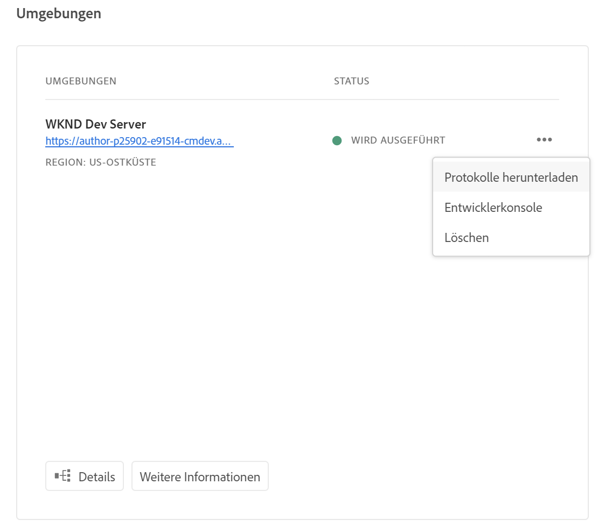
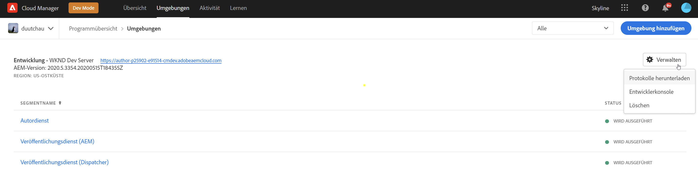
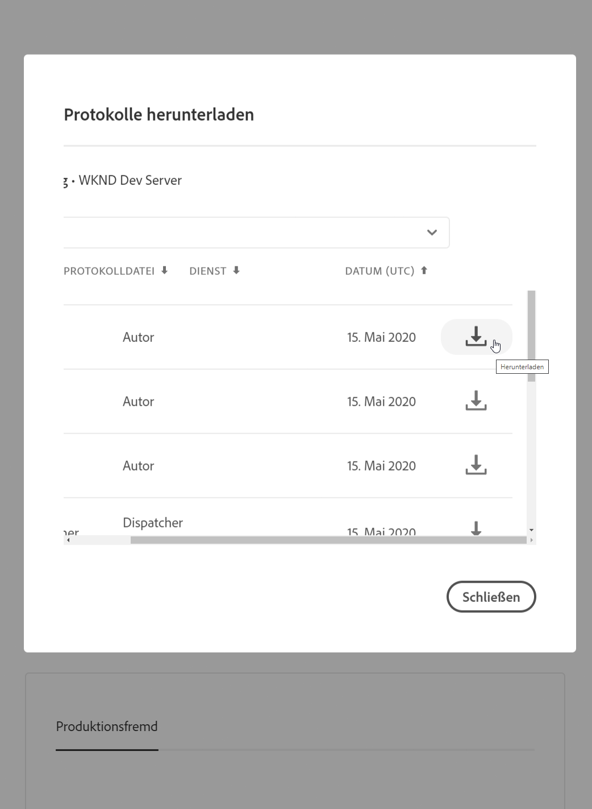

# Protokollierung{#logging}

AEM als Cloud-Dienst ist eine Plattform, auf der Kunden benutzerdefinierten Code einbinden können, um einzigartige Erlebnisse für ihre Kunden zu erstellen. Vor diesem Hintergrund ist die Protokollierung eine wichtige Funktion, um benutzerspezifischen Code auf Cloud-Umgebung zu debuggen, insbesondere für lokale dev-Umgebung.


<!-- ## Global Logging {#global-logging}

[Apache Sling Logging Configuration](https://sling.apache.org/documentation/development/logging.html#user-configuration---osgi-based) is used to configure the root logger. This defines the global settings for logging in AEM as a Cloud Service:

* the logging level
* the location of the central log file
* the number of versions to be kept
* version rotation; either maximum size or a time interval
* the format to be used when writing the log messages
-->

## AEM as a Cloud Service Logging {#aem-as-a-cloud-service-logging}

AEM als Cloud-Dienst-Angebot können Sie Folgendes konfigurieren:

* Globale Parameter für den zentralen Protokollierungsdienst
* Anforderung einer Datenprotokollierung; eine spezielle Protokollierungskonfiguration zum Anfordern von Informationen
* spezifische Einstellungen für die einzelnen Dienste

For local development, logs entries are written to local files in the `/crx-quickstart/logs` folder.

In Cloud-Umgebungen können Entwickler Protokolle über Cloud Manager herunterladen oder ein Befehlszeilen-Tool verwenden, um die Protokolle zu verfolgen.

>[!NOTE]
>
>Die Anmeldung bei AEM als Cloud-Dienst basiert auf Sling-Prinzipien. Weitere Informationen finden Sie unter [Sling-Protokollierung](https://sling.apache.org/site/logging.html).

## AEM als Cloud-Dienst-Java-Protokollierung {#aem-as-a-cloud-service-java-logging}

### Standardlogger und -writer {#standard-loggers-and-writers}

> [!IMPORTANT]
> Eine Anpassung ist hier ggf. möglich, obwohl die Standardkonfiguration für die meisten Installationen geeignet ist. Wenn Sie jedoch die standardmäßigen Protokollkonfigurationen anpassen müssen, stellen Sie sicher, dass Sie dies nur auf `dev` Umgebung tun.

Bestimmte Protokollfunktionen und Writer sind in einer AEM-Standardinstallation als Cloud-Dienst enthalten.

The first is a special case as it controls both the `request` and `access` logs:

* Der Logger:

   * Apache Sling Customizable Request Data Logger

      (org.apache.sling.engine.impl.log.RequestLoggerService)

   * schreibt Meldungen zu Anforderungsinhalt in die Datei `request.log`.

* Ist verknüpft mit:

   * Apache Sling Request Logger

      (org.apache.sling.engine.impl.log.RequestLogger)

   * Writes the messages to either `request.log` or `access.log`.

Die anderen Paare folgen der Standardkonfiguration:

* Der Logger:

   * Apache Sling Logging Logger-Konfiguration

      (org.apache.sling.commons.log.LogManager.factory.config)

   * Schreibt `Information` Nachrichten an `logs/error.log`.

* Ist mit dem folgenden Writer verknüpft:

   * Apache Sling Logging Writer Configuration

      (org.apache.sling.commons.log.LogManager.factory.writer)

* Der Logger:

   * Apache Sling Logging Logger Configuration (org.apache.sling.commons.log.LogManager.factory.config.649d51b7-6425-45c9-81e6-2697a03d6be7)

   * Schreibt `Warning` Nachrichten für `../logs/error.log` den Dienst `org.apache.pdfbox`.

* Ist nicht mit einem bestimmten Writer verknüpft, sodass ein impliziter Writer mit Standardkonfiguration (tägliche Protokollrotation) verwendet wird.

**AEM als Cloud-Service-HTTP-Anforderungsprotokoll**

Hier werden alle Zugriffsanforderungen an das AEM WCM-System und das Repository registriert.

Beispielausgabe:

**Protokollierung von AEM-HTTP-Anforderungen/-Antwortzugriffen**

Hier werden alle Zugriffsanforderungen zusammen mit der Antwort registriert.

Beispielausgabe:

**Apache Web Server/Dispatcher-Protokollierung**

Dieses Protokoll dient zum Debugging von Dispatcher-Problemen. Weitere Informationen finden Sie unter [Debugging der Apache- und Dispatcher-Konfiguration](https://docs.adobe.com/content/help/en/experience-manager-cloud-service/implementing/).

<!-- Besides the three types of logs present on an AEM as a Cloud Service instance (`request`, `access` and `error` logs) there is another dispatcher/overview.html#debugging-apache-and-dispatcher-configuration.

leftover text from the last breakaway chunk (re dispatcher) -->

Was bewährte Verfahren anbelangt, sollten Sie sich an den Konfigurationen, die derzeit in AEM als Cloud Service Maven-Archetyp vorhanden sind, ausrichten. Diese legen unterschiedliche Protokollierungseinstellungen und -stufen für bestimmte Umgebung fest:

* für `local dev` - und `dev` -Umgebung festlegen Sie die Protokollfunktion auf **DEBUG** -Ebene auf `error.log`
* für `stage`, setzen Sie die Protokollfunktion auf **WARN** -Ebene auf `error.log`
* Legen Sie für `prod`die Protokollfunktion die **ERROR** -Ebene auf `error.log`

Nachfolgend finden Sie Beispiele für jede Konfiguration:

* `dev` Umgebung:

```
<?xml version="1.0" encoding="UTF-8"?>
<jcr:root xmlns:sling="http://sling.apache.org/jcr/sling/1.0"
    xmlns:jcr="http://www.jcp.org/jcr/1.0" jcr:primaryType="sling:OsgiConfig"
    org.apache.sling.commons.log.level="debug"
    org.apache.sling.commons.log.names="[com.mycompany.myapp]" />
```


* `stage` Umgebung:

```
<?xml version="1.0" encoding="UTF-8"?>
<jcr:root xmlns:sling="http://sling.apache.org/jcr/sling/1.0"
    xmlns:jcr="http://www.jcp.org/jcr/1.0" jcr:primaryType="sling:OsgiConfig"
    org.apache.sling.commons.log.level="warn"
    org.apache.sling.commons.log.names="[com.mycompany.myapp]" />
```

* `prod` Umgebung:

```
<?xml version="1.0" encoding="UTF-8"?>
<jcr:root xmlns:sling="http://sling.apache.org/jcr/sling/1.0"
    xmlns:jcr="http://www.jcp.org/jcr/1.0" jcr:primaryType="sling:OsgiConfig"
    org.apache.sling.commons.log.level="error"
    org.apache.sling.commons.log.names="[com.mycompany.myapp]" />
```

### Logger und Writer für einzelne Dienste {#loggers-and-writers-for-individual-services}

Zusätzlich zu den Einstellungen für die globale Protokollierung können Sie mit AEM als Cloud-Dienst bestimmte Einstellungen für einen einzelnen Dienst konfigurieren:

* Bestimmte Protokollierungsstufe
* Logger (OSGi-Dienst, der die Protokollmeldungen bereitstellt)

So können Sie die Protokollmeldungen für einen einzelnen Dienst in einer separaten Datei kanalisieren. Dies kann insbesondere beim Entwickeln oder Testen nützlich sein, etwa wenn Sie für einen bestimmten Dienst auf eine höhere Protokollierungsstufe angewiesen sind.

AEM als Cloud-Dienst verwendet Folgendes, um Protokollmeldungen in eine Datei zu schreiben:

1. Ein **OSGi-Dienst** (Logger) schreibt eine Protokollmeldung.
1. Ein **Logging Logger** (Protokollierungslogger) formatiert diese Meldung gemäß Ihren Angaben.
1. Ein **Logging Writer** (Protokollierungswriter) schreibt all diese Meldungen in die von Ihnen definierte physische Datei.

Diese Elemente sind über die folgenden Parameter mit den entsprechenden Elementen verknüpft:

* **Protokollfunktion**

   Definieren Sie die Dienste, die die Nachrichten generieren.

<!-- * **Log File (Logging Logger)**

  Define the physical file for storing the log messages.

  This is used to link a Logging Logger with a Logging Writer. The value must be identical to the same parameter in the Logging Writer configuration for the connection to be made.

* **Log File (Logging Writer)**

  Define the physical file that the log messages will be written to.

  This must be identical to the same parameter in the Logging Writer configuration, or the match will not be made. If there is no match then an implicit Writer will be created with default configuration (daily log rotation).
-->

## Protokollebene festlegen {#setting-the-log-level}

Um die Protokollierungsstufen für Cloud-Umgebungen zu ändern, sollte die OSGI-Konfiguration für die Sling-Protokollierung geändert und anschließend vollständig neu bereitgestellt werden. Da dies nicht sofort geschieht, sollten Sie vorsichtig sein, ausführliche Protokolle über Produktionsumgebungen zu aktivieren, die viel Traffic erhalten. In Zukunft wird es möglicherweise Mechanismen geben, um die Protokollierungsstufe schneller zu ändern.

>[!NOTE]
>
> Um die unten aufgeführten Konfigurationsänderungen durchzuführen, müssen Sie sie auf einer lokalen Entwicklungs-Umgebung erstellen und dann als Cloud-Dienstinstanz an eine AEM-Instanz senden. Weitere Informationen dazu finden Sie unter [Bereitstellen auf AEM als Cloud-Dienst](/help/implementing/deploying/overview.md).

### Aktivieren der DEBUG-Protokollebene {#activating-the-debug-log-level}

>[!WARNING]
>
> Die globale Aktivierung der DEBUG-Protokollebene erzeugt eine große Menge an Informationen, die sich nur schwer durchblättern lassen. Es wird empfohlen, diese Option nur für Dienste zu aktivieren, für die Debugging erforderlich ist. Weitere Informationen finden Sie unter [Anmelder und Autoren für individuelle Dienste](logging.md#loggers-and-writers-for-individual-services).

Die standardmäßige Protokollebene ist INFO, DEBUG-Meldungen werden also nicht protokolliert.
Um die DEBUG-Protokollebene zu aktivieren, legen Sie die Variable

``` /libs/sling/config/org.apache.sling.commons.log.LogManager/org.apache.sling.commons.log.level ```

auf „debug“ ein. Lassen Sie die DEBUG-Protokollebene nicht länger als notwendig aktiviert, da hierdurch zahlreiche Protokolle generiert werden.
Eine Zeile in der Debugdatei beginnt gewöhnlich mit DEBUG, gefolgt von der Angabe der Protokollebene, der Aktion des Installationsprogramms und der Protokollmeldung. Beispiel:

``` DEBUG 3 WebApp Panel: WebApp successfully deployed ```

Die Protokollebenen lauten wie folgt:

| 0 | Schwerwiegender Fehler | Die Aktion ist fehlgeschlagen, und das Installationsprogramm kann nicht fortgesetzt werden. |
|---|---|---|
| 1 | Fehler | Die Aktion ist fehlgeschlagen. Die Installation wird fortgesetzt, aber ein CRX-Teil wurde nicht ordnungsgemäß installiert und funktioniert daher nicht. |
| 2 | Warnung | Die Aktion war erfolgreich, hatte aber Probleme. CRX funktioniert ggf. nicht ordnungsgemäß. |
| 3 | Informationen | Die Aktion war erfolgreich. |

### Erstellen eigener Logger und Writer {#creating-your-own-loggers-and-writers}

Sie können ein eigenes Logger-/Writer-Paar definieren:

1. Erstellen Sie eine neue Instanz der Werkskonfiguration [Apache Sling Logging Logger Configuration](https://sling.apache.org/documentation/development/logging.html#user-configuration---osgi-based).

   1. Geben Sie den Logger an.

<!-- 1. Create a new instance of the Factory Configuration [Apache Sling Logging Writer Configuration](https://sling.apache.org/documentation/development/logging.html#user-configuration---osgi-based).

    1. Specify the Log File - this must match that specified for the Logger.
    1. Configure the other parameters as required. -->

### Configure Logging {#configure-logging}

>[!NOTE]
>
>Beim Arbeiten mit Adobe Experience Manager gibt es verschiedene Methoden zum Verwalten der Konfigurationseinstellungen für diese Dienste.

Unter bestimmten Umständen sollten Sie ein benutzerdefiniertes Protokoll mit einer anderen Protokollebene erstellen. Gehen Sie dazu im Repository wie folgt vor:

1. If not already existing, create a new configuration folder ( `sling:Folder`) for your project `/apps/<*project-name*>/config`.
1. Under `/apps/<*project-name*>/config`, create a node for the new Apache Sling Logging Logger Configuration:

   * Name: `org.apache.sling.commons.log.LogManager.factory.config-<*identifier*>` (da dies eine Protokollfunktion ist)

      Where `<*identifier*>` is replaced by free text that you (must) enter to identify the instance (you cannot omit this information).

      Beispiel: `org.apache.sling.commons.log.LogManager.factory.config-MINE`

   * Typ: `sling:OsgiConfig`
   >[!NOTE]
   >
   >Although not a technical requirement, it is advisable to make `<*identifier*>` unique.

<!-- 1. Set the following properties on this node:

    * Name: `org.apache.sling.commons.log.file`

      Type: String

      Value: specify the Log File; for example, `logs/myLogFile.log`

    * Name: `org.apache.sling.commons.log.names`

      Type: String[] (String + Multi)

      Value: specify the OSGi services for which the Logger is to log messages; for example, all of the following:

        * `org.apache.sling`
        * `org.apache.felix`
        * `com.day`

    * Name: `org.apache.sling.commons.log.level`

      Type: String

      Value: specify the log level required ( `debug`, `info`, `warn` or `error`); for example `debug`

    * Configure the other parameters as required:

        * Name: `org.apache.sling.commons.log.pattern`

          Type: `String`

          Value: specify the pattern of the log message as required; for example,

          `{0,date,dd.MM.yyyy HH:mm:ss.SSS} *{4}* [{2}] {3} {5}`

   >[!NOTE]
   >
   >`org.apache.sling.commons.log.pattern` supports up to six arguments.

   >
   >
   >{0} The timestamp of type `java.util.Date`
   >{1} the log marker
   >{2} the name of the current thread
   >{3} the name of the logger
   >{4} the log level
   >{5} the log message

   >
   >
   >If the log call includes a `Throwable` the stacktrace is appended to the message.

   >[!CAUTION]
   >
   >org.apache.sling.commons.log.names must have a value.

   >[!NOTE]
   >
   >Log writer paths are relative to the `crx-quickstart` location.
   >
   >
   >Therefore, a log file specified as:
   >
   >
   >`logs/thelog.log`

   >
   >
   >writes to:
   >
   >
   >`` ` ` `<*cq-installation-dir*>/``crx-quickstart/logs/thelog.log`.
   >
   >
   >And a log file specified as:
   >
   >
   >`../logs/thelog.log`

   >
   >
   >writes to a directory:
   >
   >
   >` <*cq-installation-dir*>/logs/`
   >``(i.e. next to ` `<*cq-installation-dir*>/`crx-quickstart/`)
 -->

<!-- open question: see if we need to leave the above warning note in place, but adjust it so that it doesn't mention filenames -->

<!-- 1. This step is only necessary when a new Writer is required (i.e. with a configuration that is different to the default Writer).

   >[!CAUTION]
   >
   >A new Logging Writer Configuration is only required when the existing default is not suitable.

   >
   >
   >If no explicit Writer is configured the system will automatically generate an implicit Writer based on the default.

   Under `/apps/<*project-name*>/config`, create a node for the new `Apache Sling Logging Writer` Configuration:

    * Name: `org.apache.sling.commons.log.LogManager.factory.writer-<*identifier*>` (as this is a Writer)

      As with the Logger, `<*identifier*>` is replaced by free text that you (must) enter to identify the instance (you cannot omit this information). For example, `org.apache.sling.commons.log.LogManager.factory.writer-MINE`

    * Type: `sling:OsgiConfig`

   >[!NOTE]
   >
   >Although not a technical requirement, it is advisable to make `<*identifier*>` unique.

   Set the following properties on this node:

    * Name: `org.apache.sling.commons.log.file`

      Type: `String`

      Value: specify the Log File so that it matches the file specified in the Logger;

      for this example, `../logs/myLogFile.log`.

    * Configure the other parameters as required:

        * Name: `org.apache.sling.commons.log.file.number`

          Type: `Long`

          Value: specify the number of log files you want kept; for example, `5`

        * Name: `org.apache.sling.commons.log.file.size`

          Type: `String`

          Value: specify as required to control file rotation by size/date; for example, `'.'yyyy-MM-dd`

   >[!NOTE]
   >
   >`org.apache.sling.commons.log.file.size` controls the rotation of the log file by setting either:
   >
   >* a maximum file size
   >* a time/date schedule
   >
   >to indicate when a new file will be created (and the existing file renamed according to the name pattern).
   >
   >* A size limit can be specified with a number. If no size indicator is given, then this is taken as the number of bytes, or you can add one of the size indicators - `KB`, `MB`, or `GB` (case is ignored).
   >* A time/date schedule can be specified as a `java.util.SimpleDateFormat` pattern. This defines the time period after which the file will be rotated; also the suffix appended to the rotated file (for identification).
   >
   >The default is '.'yyyy-MM-dd (for daily log rotation).
   >
   >So for example, at midnight of January 20th 2010 (or when the first log message after this occurs to be precise), ../logs/error.log will be renamed to ../logs/error.log.2010-01-20. Logging for the 21st of January will be output to (a new and empty) ../logs/error.log until it is rolled over at the next change of day.
   >
   >      | `'.'yyyy-MM` |Rotation at the beginning of each month |
   >      |---|---|
   >      | `'.'yyyy-ww` |Rotation at the first day of each week (depends on the locale). |
   >      | `'.'yyyy-MM-dd` |Rotation at midnight each day. |
   >      | `'.'yyyy-MM-dd-a` |Rotation at midnight and midday of each day. |
   >      | `'.'yyyy-MM-dd-HH` |Rotation at the top of every hour. |
   >      | `'.'yyyy-MM-dd-HH-mm` |Rotation at the beginning of every minute. |
   >
   >      Note: When specifying a time/date:
   >      1. You should "escape" literal text within a pair of single quotes (' ');
   >      this is to avoid certain characters being interpreted as pattern letters.
   >      1. Only use characters allowed for a valid file name anywhere in the option.

1. Read your new log file with your chosen tool.

   The log file created by this example will be `../crx-quickstart/logs/myLogFile.log`. -->

The Felix Console also provides information about Sling Log Support at `../system/console/slinglog`; for example `https://localhost:4502/system/console/slinglog`.draf

## Zugreifen auf und Verwalten von Protokollen {#manage-logs}

Benutzer können über die Umgebungskarte auf eine Liste der verfügbaren Protokolldateien für die ausgewählte Umgebung zugreifen. Benutzer können auf eine Liste der verfügbaren Protokolldateien für die ausgewählte Umgebung zugreifen.

Diese Dateien können über die Benutzeroberfläche heruntergeladen werden. Dies kann über die Seite **Übersicht** erfolgen:



Oder über die Seite **Umgebungen**:



>[!NHinweis]
>Unabhängig davon, wo es geöffnet wird, erscheint dasselbe Dialogfeld und ermöglicht das Herunterladen einer jeweiligen Protokolldatei.




### Protokolle über API {#logs-thorugh-api}

Abgesehen vom Herunterladen von Protokollen über die Benutzeroberfläche sind die Protokolle auch über die API und die Befehlszeilenschnittstelle verfügbar.

Für das Herunterladen der Protokolldateien für eine bestimmte Umgebung würde der Befehl ungefähr folgendermaßen aussehen:

```java
$ aio cloudmanager:download-logs --programId 5 1884 author aemerror
```

Der folgende Befehl ermöglicht das Tailing von Protokollen:

```java
$ aio cloudmanager:tail-log --programId 5 1884 author aemerror
```

Um die Umgebungs-ID (in diesem Fall „1884“) und die verfügbaren Dienst- oder Protokollnamenoptionen abzurufen, können Sie den folgenden Befehl verwenden:

```java
$ aio cloudmanager:list-environments
Environment Id Name                     Type  Description                          
1884           FoundationInternal_dev   dev   Foundation Internal Dev environment  
1884           FoundationInternal_stage stage Foundation Internal STAGE environment
1884           FoundationInternal_prod  prod  Foundation Internal Prod environment
 
 
$ aio cloudmanager:list-available-log-options 1884
Environment Id Service    Name         
1884           author     aemerror     
1884           author     aemrequest   
1884           author     aemaccess    
1884           publish    aemerror     
1884           publish    aemrequest   
1884           publish    aemaccess    
1884           dispatcher httpderror   
1884           dispatcher aemdispatcher
1884           dispatcher httpdaccess
```

>[!NHinweis]
>Während **Protokoll-Downloads** sowohl über die Benutzeroberfläche als auch über die API möglich sind, ist das **Protokoll-Tailing** nur über APIs/die Befehlszeilenschnittstelle möglich.

### Zusätzliche Ressourcen {#resources}

Weitere Informationen zur Cloud Manager-API und zur Adobe I/O-CLI finden Sie in den folgenden zusätzlichen Ressourcen:

* [Dokumentation zur Cloud Manager-API](https://www.adobe.io/apis/experiencecloud/cloud-manager/docs.html)
* [Adobe I/O CLI](https://github.com/adobe/aio-cli-plugin-cloudmanager)