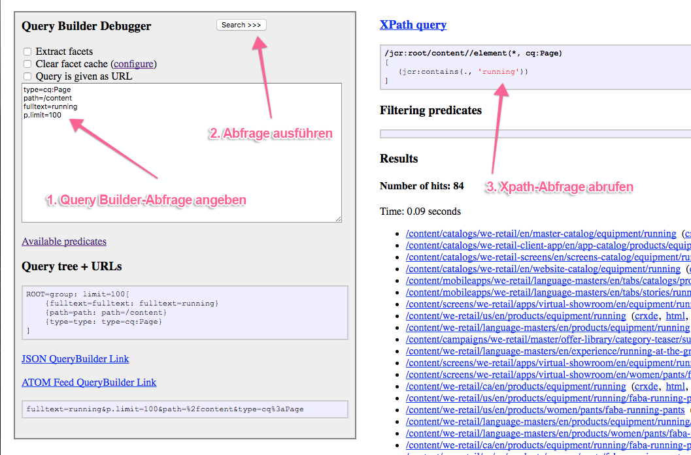

# Query Builder-API  {#query-builder-api}

Mit dem Query Builder können Sie problemlos das Inhalts-Repository von AEM abfragen. Die Funktionalität wird über eine Java-API und eine REST-API verfügbar gemacht. In diesem Dokument werden diese APIs beschrieben.

Der Server-seitige Query Builder ([`QueryBuilder`](https://helpx.adobe.com/de/experience-manager/6-5/sites/developing/using/reference-materials/javadoc/com/day/cq/search/QueryBuilder.html)) akzeptiert eine Abfragebeschreibung, erstellt eine XPath-Abfrage und führt sie aus, filtert den Ergebnissatz und extrahiert bei Bedarf auch Facetten.

Die Abfragebeschreibung ist einfach eine Gruppe mit Eigenschaften ([`Predicate`](https://helpx.adobe.com/de/experience-manager/6-5/sites/developing/using/reference-materials/javadoc/com/day/cq/search/Predicate.html)). Beispiel hierfür ist eine Volltexteigenschaft, die der Funktion `jcr:contains()` in XPath entspricht.

Für jeden Eigenschaftentyp ist eine Auswertungskomponente ([`PredicateEvaluator`](https://helpx.adobe.com/de/experience-manager/6-5/sites/developing/using/reference-materials/javadoc/com/day/cq/search/eval/PredicateEvaluator.html)) vorhanden, die weiß, wie die jeweilige Eigenschaft für XPath, die Filterung und die Facettenextraktion verarbeitet werden muss. Es ist sehr einfach, benutzerdefinierte Auswertungskomponenten zu erstellen, die über die OSGi-Komponentenlaufzeit verknüpft werden.

Die REST-API ermöglicht den Zugriff auf genau die gleichen Funktionen per HTTP, wobei die Antworten per JSON gesendet werden.

>[!NOTE]
>
>Die QueryBuilder-API wird mit der JCR-API erstellt. Sie können das AEM-JCR auch abfragen, indem Sie die JCR-API innerhalb eines OSGi-Bundles verwenden. Weitere Informationen erhalten Sie unter [Abfragen von Adobe Experience Manager-Daten mit der JCR-API](https://helpx.adobe.com/de/experience-manager/using/querying-experience-manager-data-using1.html).

## Gem-Sitzung   {#gem-session}

[AEM Gems](https://helpx.adobe.com/de/experience-manager/kt/eseminars/gems/aem-index.html) ist eine Serie mit ausführlichen technischen Erläuterungen zu Adobe Experience Manager von Adobe-Experten.

In der [Sitzung zu Query Builder](https://helpx.adobe.com/de/experience-manager/kt/eseminars/gems/aem-search-forms-using-querybuilder.html) erhalten Sie eine Übersicht und Informationen zur Verwendung des Tools.

## Beispielabfragen {#sample-queries}

Diese Beispiele sind in der Notation des Java-Eigenschaftenstils angegeben. Für die Nutzung mit der Java-API können Sie ein Java-`HashMap`-Element im folgenden API-Beispiel verwenden.

Für das JSON-Servlet `QueryBuilder` umfasst jedes Beispiel einen Beispiel-Link zu einer AEM-Installation (am Standardspeicherort `http://<host>:<port>`). Beachten Sie, dass Sie sich an Ihrer AEM-Instanz anmelden müssen, bevor Sie diese Links verwenden können.

>[!CAUTION]
>
>Standardmäßig zeigt das Query Builder-JSON-Servlet maximal zehn Treffer an.
>
>Wenn der folgende Parameter hinzugefügt wird, kann das Servlet alle Abfrageergebnisse anzeigen:
>
>`p.limit=-1`

>[!NOTE]
>
>Zum Anzeigen der zurückgegebenen JSON-Daten in Ihrem Browser kann die Verwendung eines Plug-ins nützlich sein, z. B. JSONView für Firefox.

### Zurückgeben aller Ergebnisse {#returning-all-results}

Mit der folgenden Abfrage werden **zehn Ergebnisse zurückgegeben** (bzw. genauer gesagt maximal zehn), aber es wird die **Anzahl von Treffern** angegeben, die tatsächlich verfügbar sind:

`http://<host>:<port>/bin/querybuilder.json?path=/content&1_property=sling:resourceType&1_property.value=wknd/components/structure/page&1_property.operation=like&orderby=path`

```xml
path=/content
1_property=sling:resourceType
1_property.value=wknd/components/structure/page
1_property.operation=like
orderby=path
```

Mit derselben Abfrage (mit dem Parameter `p.limit=-1`) werden **alle Ergebnisse zurückgegeben** (dies kann je nach Instanz eine relativ große Zahl sein):

`http://<host>:<port>/bin/querybuilder.json?path=/content&1_property=sling:resourceType&1_property.value=wknd/components/structure/page&1_property.operation=like&orderby=path&p.limit=-1`

```xml
path=/content
1_property=sling:resourceType
1_property.value=wknd/components/structure/page
1_property.operation=like
p.limit=-1
orderby=path
```

### Verwenden von „p.guessTotal“ zum Zurückgeben der Ergebnisse {#using-p-guesstotal-to-return-the-results}

Der Zweck des Parameters `p.guessTotal` ist das Zurückgeben der entsprechenden Ergebnisse, die angezeigt werden können, indem die richtigen Mindestwerte für `p.offset` und `p.limit` kombiniert werden. Der Vorteil der Nutzung dieses Parameters ist eine verbesserte Leistung bei großen Ergebnissätzen. So wird verhindert, dass die Gesamtsumme berechnet (z. B. per Aufruf von `result.getSize()`) und der gesamte Ergebnissatz gelesen werden muss, einschließlich der Optimierung bis hinab zum OAK-Modul und dem zugehörigen Index. Dies kann sowohl in Bezug auf die Ausführungsdauer als auch auf die Speicherauslastung einen erheblichen Unterschied ausmachen, wenn mehrere Hunderttausend Ergebnisse vorhanden sind.

Der Nachteil besteht bei diesem Parameter darin, dass Anwendern die genaue Gesamtsumme nicht angezeigt wird. Sie können aber eine Mindestzahl festlegen, z. B. `p.guessTotal=1000`, damit immer bis zum Wert 1.000 gelesen wird. Für kleinere Ergebnisssätze erhalten Sie also die genaue Gesamtsumme, aber bei einer größeren Anzahl können Sie nur einen Hinweis wie „und weitere“ anzeigen.

Fügen Sie der Abfrage unten `p.guessTotal=true` hinzu, um die Funktionsweise zu testen:

`http://<host>:<port>/bin/querybuilder.json?path=/content&1_property=sling:resourceType&1_property.value=wknd/components/structure/page&1_property.operation=like&p.guessTotal=true&orderby=path`

```xml
path=/content
1_property=sling:resourceType
1_property.value=wknd/components/structure/page
1_property.operation=like
p.guessTotal=true
orderby=path
```

Die Abfrage gibt gemäß dem Standardwert `p.limit` `10` Ergebnisse mit einem Offset von `0` zurück:

```xml
"success": true,
"results": 10,
"total": 10,
"more": true,
"offset": 0,
```

Sie können auch einen numerischen Wert verwenden, um bis zu einer benutzerdefinierten Anzahl von maximalen Ergebnissen zu zählen. Verwenden Sie die gleiche Abfrage wie oben, aber ändern Sie den Wert von `p.guessTotal` in `50`:

`http://<host>:<port>/bin/querybuilder.json?path=/content&1_property=sling:resourceType&1_property.value=wknd/components/structure/page&1_property.operation=like&p.guessTotal=50&orderby=path`

Es werden wieder gemäß Standardwert zehn Ergebnisse mit einem Offset von 0 zurückgegeben, aber es werden nur maximal 50 Ergebnisse angezeigt:

```xml
"success": true,
"results": 10,
"total": 50,
"more": true,
"offset": 0,
```

### Implementieren von Seitenumbrüchen {#implementing-pagination}

Standardmäßig würde der Query Builder auch die Anzahl von Treffern angeben. Je nach Ergebnisgröße kann dies lange dauern, da das Ermitteln der genauen Anzahl auch das Prüfen jedes Ergebnisses in Bezug auf die Zugriffssteuerung umfasst. Meist wird die Gesamtsumme verwendet, um Seitenumbrüche für die Benutzeroberfläche für Endbenutzer zu implementieren. Da die Ermittlung der genauen Anzahl lange dauern kann, wird empfohlen, die Funktion „guessTotal“ zum Implementieren von Seitenumbrüchen zu verwenden.

Beispielsweise kann für die Benutzeroberfläche der folgende Ansatz genutzt werden:

* Rufen Sie die genaue Anzahl der Gesamttreffer ([SearchResult.getTotalMatches()](https://helpx.adobe.com/de/experience-manager/6-5/sites/developing/using/reference-materials/javadoc/com/day/cq/search/result/SearchResult.html#gettotalmatches) oder die Summe in der querybuilder.json-Antwort) ab und zeigen Sie sie an (kleiner oder gleich 100).`querybuilder.json`
* Legen Sie `guessTotal` auf 100 fest, während Sie den Query Builder-Aufruf durchführen.

* Die Antwort kann das folgende Ergebnis enthalten:

   * `total=43`, `more=false` – gibt an, dass die Gesamtzahl der Treffer 43 beträgt. Auf der Benutzeroberfläche können auf der ersten Seite bis zu zehn Ergebnisse angezeigt werden und für die nächsten drei Seiten können Seitenumbrüche genutzt werden. Sie können diese Implementierung auch verwenden, um einen beschreibenden Text wie **„43 Ergebnisse gefunden“** anzuzeigen.
   * `total=100`, `more=true` – gibt an, dass die Gesamtzahl der Treffer größer als 100 und die genaue Anzahl unbekannt ist. Auf der Benutzeroberfläche können auf der ersten Seite bis zu zehn Ergebnisse angezeigt werden und für die nächsten zehn Seiten können Seitenumbrüche genutzt werden. Sie können diese Option auch verwenden, um einen Text wie **„Mehr als 100 Ergebnisse gefunden“** anzuzeigen. Wenn der Anwender auf die nächsten Seiten zugreift, würden Query Builder-Aufrufe dazu führen, dass sich die Beschränkung von `guessTotal` und auch die Parameter `offset` und `limit` erhöhen.

`guessTotal` sollte auch in Fällen verwendet werden, in denen die Benutzeroberfläche das unendliche Scrollen nutzen muss, um zu vermeiden, dass der Query Builder die genaue Trefferanzahl ermittelt.

### Suchen nach und Sortieren von JAR-Dateien (neueste zuerst) {#find-jar-files-and-order-them-newest-first}

`http://<host>:<port>/bin/querybuilder.json?type=nt:file&nodename=*.jar&orderby=@jcr:content/jcr:lastModified&orderby.sort=desc`

```xml
type=nt:file
nodename=*.jar
orderby=@jcr:content/jcr:lastModified
orderby.sort=desc
```

### Suchen nach allen Seiten und Sortieren nach der letzten Änderung {#find-all-pages-and-order-them-by-last-modified}

`http://<host>:<port>/bin/querybuilder.json?type=cq:Page&orderby=@jcr:content/cq:lastModified`

```xml
type=cq:Page
orderby=@jcr:content/cq:lastModified
```

### Suchen nach allen Seiten und Sortieren nach der letzten Änderung (in absteigender Reihenfolge) {#find-all-pages-and-order-them-by-last-modified-but-descending}

`http://<host>:<port>/bin/querybuilder.json?type=cq:Page&orderby=@jcr:content/cq:lastModified&orderby.sort=desc`

```xml
type=cq:Page
orderby=@jcr:content/cq:lastModified
orderby.sort=desc
```

### Volltextsuche, sortiert nach Bewertung {#fulltext-search-ordered-by-score}

`http://<host>:<port>/bin/querybuilder.json?fulltext=Management&orderby=@jcr:score&orderby.sort=desc`

```xml
fulltext=Management
orderby=@jcr:score
orderby.sort=desc
```

### Suchen nach Seiten, die mit einem bestimmten Tag versehen sind {#search-for-pages-tagged-with-a-certain-tag}

`http://<host>:<port>/bin/querybuilder.json?type=cq:Page&tagid=wknd:activity/cycling&tagid.property=jcr:content/cq:tags`

```xml
type=cq:Page
tagid=wknd:activity/cycling
tagid.property=jcr:content/cq:tags
```

Verwenden Sie die Eigenschaft `tagid` wie im Beispiel, wenn Sie die explizite Tag-ID kennen.

Verwenden Sie die Eigenschaft `tag` für den Tag-Titelpfad (ohne Leerstellen).

Da Sie im vorherigen Beispiel nach Seiten suchen (`cq:Page`-Knoten), müssen Sie den relativen Pfad von diesem Knoten für die Eigenschaft `tagid.property` verwenden, der `jcr:content/cq:tags` lautet. Standardmäßig würde `tagid.property` einfach `cq:tags` lauten.

### Suchen unter mehreren Pfaden (mit Gruppen) {#search-under-multiple-paths-using-groups}

`http://<host>:<port>/bin/querybuilder.json?fulltext=Experience&group.1_path=/content/wknd/us/en/magazine&group.2_path=/content/wknd/us/en/adventures&group.p.or=true`

```xml
fulltext=Experience
group.p.or=true
group.1_path=/content/wknd/us/en/magazine
group.2_path=/content/wknd/us/en/adventures
```

Für diese Abfrage wird eine *Gruppe* (mit dem Namen `group`) verwendet. Dies dient dem Abtrennen von Unterausdrücken in einer Abfrage, ähnlich wie mit Klammern in Standardnotationen. Beispielweise kann die vorherige Abfrage wie folgt auf vertrautere Weise ausgedrückt werden:

`"Experience" and ("/content/wknd/us/en/magazine" or "/content/wknd/us/en/adventures")`

Im Beispiel wird in der Gruppe die Eigenschaft `path` mehrere Male genutzt. Um die beiden Instanzen der Eigenschaft zu unterscheiden und zu sortieren (die Sortierung ist für einige Eigenschaften erforderlich), müssen Sie den Eigenschaften `N_` voranstellen, wobei `N` für den Sortierungsindex steht. Im obigen Beispiel lauten die sich ergebenden Eigenschaften `1_path` und `2_path`.

Das `p` in `p.or` ist ein spezielles Trennzeichen, mit dem angezeigt wird, dass ein `or`Parameter *der Gruppe folgt (in diesem Fall ein*) und keine Untereigenschaft der Gruppe, z. B. `1_path`.

Wenn `p.or` nicht angegeben wird, werden alle Eigenschaften per UND verbunden, sodass für jedes Ergebnis alle Eigenschaften erfüllt werden müssen.

>[!NOTE]
>
>Sie können dasselbe numerische Präfix nicht in einer einzelnen Abfrage verwenden – auch nicht für verschiedene Eigenschaften.

### Suchen nach Eigenschaften {#search-for-properties}

Hier suchen Sie nach allen Seiten einer bestimmten Vorlage, indem Sie die Eigenschaft `cq:template` verwenden:

`http://<host>:<port>/bin/querybuilder.json?property=cq%3atemplate&property.value=%2fconf%2fwknd%2fsettings%2fwcm%2ftemplates%2fadventure-page-template&type=cq%3aPageContent`

```xml
type=cq:PageContent
property=cq:template
property.value=/conf/wknd/settings/wcm/templates/adventure-page-template
```

Dies hat den Nachteil, dass nicht die Seiten selbst, sondern die `jcr:content`-Knoten der Seiten zurückgegeben werden. Die Lösung besteht hierbei darin, nach dem relativen Pfad zu suchen:

`http://<host>:<port>/bin/querybuilder.json?property=jcr%3acontent%2fcq%3atemplate&property.value=%2fconf%2fwknd%2fsettings%2fwcm%2ftemplates%2fadventure-page-template&type=cq%3aPage`

```xml
type=cq:Page
property=jcr:content/cq:template
property.value=/conf/wknd/settings/wcm/templates/adventure-page-template
```

### Suchen nach mehreren Eigenschaften {#search-for-multiple-properties}

Beim mehrfachen Verwenden des Eigenschaftsprädikats müssen Sie die Präfixe für die Anzahl erneut hinzufügen:

`http://<host>:<port>/bin/querybuilder.json?1_property=jcr%3acontent%2fcq%3atemplate&1_property.value=%2fconf%2fwknd%2fsettings%2fwcm%2ftemplates%2fadventure-page-template&2_property=jcr%3acontent%2fjcr%3atitle&2_property.value=Cycling%20Tuscany&type=cq%3aPage`

```xml
type=cq:Page
1_property=jcr:content/cq:template
1_property.value=/conf/wknd/settings/wcm/templates/adventure-page-template
2_property=jcr:content/jcr:title
2_property.value=Cycling Tuscany
```

### Suchen nach mehreren Eigenschaftswerten {#search-for-multiple-property-values}

Um beim Suchen nach mehreren Werten einer Eigenschaft (`"A" or "B" or "C"`) große Gruppen zu vermeiden, können Sie für die Eigenschaft `property` mehrere Werte angeben:

`http://<host>:<port>/bin/querybuilder.json?property=jcr%3atitle&property.1_value=Cycling%20Tuscany&property.2_value=Ski%20Touring&property.3_value=Whistler%20Mountain%20Biking`

```xml
property=jcr:title
property.1_value=Cycling Tuscany
property.2_value=Ski Touring
property.3_value=Whistler Mountain Biking
```

Bei Eigenschaften mit mehreren Werten können Sie auch festlegen, dass mehrere Werte übereinstimmen müssen (`"A" and "B" and "C"`):

`http://<host>:<port>/bin/querybuilder.json?property=jcr%3atitle&property.and=true&property.1_value=Cycling%20Tuscany&property.2_value=Ski%20Touring&property.3_value=Whistler%20Mountain%20Biking`

```xml
property=jcr:title
property.and=true
property.1_value=Cycling Tuscany
property.2_value=Ski Touring
property.3_value=Whistler Mountain Biking
```

## Verfeinern der Rückgabe {#refining-what-is-returned}

Standardmäßig gibt das QueryBuilder-JSON-Servlet einen Standardsatz mit Eigenschaften für jeden Knoten zurück, der im Suchergebnis enthalten ist (z. B. Pfad, Name, Titel usw.). Wenn Sie steuern möchten, welche Eigenschaften zurückgegeben werden, können Sie eine der folgenden Vorgehensweisen wählen:

Geben Sie

```xml
p.hits=full
```

an, um alle Eigenschaften für jeden Knoten einzubinden:

`http://<host>:<port>/bin/querybuilder.json?p.hits=full&property=jcr%3atitle&property.value=Cycling%20Tuscany`

```xml
property=jcr:title
property.value=Cycling Tuscany
p.hits=full
```

Verwenden Sie

```xml
p.hits=selective
```

und geben Sie die Eigenschaften durch ein Leerzeichen getrennt an, die Sie in

```xml
p.properties
```

abrufen möchten:

`http://<host>:<port>/bin/querybuilder.json?p.hits=selective&p.properties=sling%3aresourceType%20jcr%3aprimaryType&property=jcr%3atitle&property.value=Cycling%20Tuscany`

```xml
property=jcr:title
property.value=Cycling Tuscany
p.hits=selective
p.properties=sling:resourceType jcr:primaryType
```

Eine andere Möglichkeit besteht darin, untergeordnete Knoten in die Query Builder-Antwort einzufügen. Dazu müssen Sie Folgendes angeben:

```xml
p.nodedepth=n
```

wobei `n` die Anzahl der Ebenen ist, die die Abfrage zurückgeben soll. Beachten Sie Folgendes: Damit ein untergeordneter Knoten zurückgegeben wird, muss er über die Eigenschaftenauswahl angegeben werden.

```xml
p.hits=full
```

Beispiel:

`http://<host>:<port>/bin/querybuilder.json?p.hits=full&p.nodedepth=5&property=jcr%3atitle&property.value=Cycling%20Tuscany`

```xml
property=jcr:title
property.value=Cycling Tuscany
p.hits=full
p.nodedepth=5
```

## Weitere Eigenschaften {#morepredicates}

Weitere Eigenschaften (Prädikate) finden Sie auf der [Seite mit der Referenz zu Query Builder-Eigenschaften](query-builder-predicates.md).

Sie können auch das [Javadoc für die `PredicateEvaluator`-Klassen](https://helpx.adobe.com/experience-manager/6-5/sites/developing/using/reference-materials/javadoc/com/day/cq/search/eval/PredicateEvaluator.html) überprüfen. Das Javadoc für diese Klassen enthält die Liste mit den Eigenschaften, die Sie verwenden können.

Das Präfix des Klassennamens (z. B. `similar` in [`SimilarityPredicateEvaluator`](https://helpx.adobe.com/de/experience-manager/6-5/sites/developing/using/reference-materials/javadoc/com/day/cq/search/eval/SimilarityPredicateEvaluator.html)) ist die *Haupteigenschaft* der Klasse. Diese Eigenschaft ist auch der Name der Eigenschaft, die in der Abfrage verwendet wird (in Kleinbuchstaben).

Für Haupteigenschaften dieser Art können Sie die Abfrage verkürzen und anstelle der vollqualifizierten Variante `similar=/content/en` die Kurzversion `similar.similar=/content/en` verwenden. Die vollqualifizierte Form muss für alle Eigenschaften einer Klasse genutzt werden, bei denen es sich nicht um die Haupteigenschaften handelt.

## Beispiel für die Nutzung der Query Builder-API   {#example-query-builder-api-usage}

```java
   String fulltextSearchTerm = "WKND";

    // create query description as hash map (simplest way, same as form post)
    Map<String, String> map = new HashMap<String, String>();

// create query description as hash map (simplest way, same as form post)
    map.put("path", "/content");
    map.put("type", "cq:Page");
    map.put("group.p.or", "true"); // combine this group with OR
    map.put("group.1_fulltext", fulltextSearchTerm);
    map.put("group.1_fulltext.relPath", "jcr:content");
    map.put("group.2_fulltext", fulltextSearchTerm);
    map.put("group.2_fulltext.relPath", "jcr:content/@cq:tags");

    // can be done in map or with Query methods
    map.put("p.offset", "0"); // same as query.setStart(0) below
    map.put("p.limit", "20"); // same as query.setHitsPerPage(20) below

    Query query = builder.createQuery(PredicateGroup.create(map), session);
    query.setStart(0);
    query.setHitsPerPage(20);

    SearchResult result = query.getResult();

    // paging metadata
    int hitsPerPage = result.getHits().size(); // 20 (set above) or lower
    long totalMatches = result.getTotalMatches();
    long offset = result.getStartIndex();
    long numberOfPages = totalMatches / 20;

    //Place the results in XML to return to client
    DocumentBuilderFactory factory = DocumentBuilderFactory.newInstance();
    DocumentBuilder builder = factory.newDocumentBuilder();
    Document doc = builder.newDocument();

    //Start building the XML to pass back to the AEM client
    Element root = doc.createElement( "results" );
    doc.appendChild( root );

    // iterating over the results
    for (Hit hit : result.getHits()) {
       String path = hit.getPath();

      //Create a result element
      Element resultel = doc.createElement( "result" );
      root.appendChild( resultel );

      Element pathel = doc.createElement( "path" );
      pathel.appendChild( doc.createTextNode(path ) );
      resultel.appendChild( pathel );
    }
```

Ausführung der gleichen Abfrage per HTTP mit dem Query Builder-Servlet (JSON):

`http://<host>:<port>/bin/querybuilder.json?path=/content&type=cq:Page&group.p.or=true&group.1_fulltext=WKND&group.1_fulltext.relPath=jcr:content&group.2_fulltext=WKND&group.2_fulltext.relPath=jcr:content/@cq:tags&p.offset=0&p.limit=20`

## Speichern und Laden von Abfragen {#storing-and-loading-queries}

Abfragen können zur späteren Verwendung im Repository gespeichert werden. Der `QueryBuilder` stellt die `storeQuery`-Methode mit der folgenden Signatur bereit:

```java
void storeQuery(Query query, String path, boolean createFile, Session session) throws RepositoryException, IOException;
```

Bei Verwendung der [`QueryBuilder#storeQuery`](https://helpx.adobe.com/de/experience-manager/6-5/sites/developing/using/reference-materials/javadoc/com/day/cq/search/QueryBuilder.html#storequerycomdaycqsearchqueryjavalangstringbooleanjavaxjcrsession)-Methode wird die jeweilige Abfrage (`Query`) gemäß dem Argumentwert `createFile` im Repository als Datei oder als Eigenschaft gespeichert. Im folgenden Beispiel wird veranschaulicht, wie Sie eine `Query` unter dem Pfad `/mypath/getfiles` als Datei speichern:

```java
builder.storeQuery(query, "/mypath/getfiles", true, session);
```

Alle zuvor gespeicherten Abfragen können mit der [`QueryBuilder#loadQuery`](https://helpx.adobe.com/de/experience-manager/6-5/sites/developing/using/reference-materials/javadoc/com/day/cq/search/QueryBuilder.html#loadqueryjavalangstringjavaxjcrsession)-Methode aus dem Repository geladen werden:

```java
Query loadQuery(String path, Session session) throws RepositoryException, IOException
```

Eine unter dem Pfad `/mypath/getfiles` gespeicherte `Query` kann beispielsweise mit dem folgenden Snippet geladen werden:

```java
Query loadedQuery = builder.loadQuery("/mypath/getfiles", session);
```

## Testen und Debuggen {#testing-and-debugging}

Zum Experimentieren mit und Debuggen von Query-Builder-Abfragen können Sie die Query Builder-Debugger-Konsole verwenden:

`http://<host>:<port>/libs/cq/search/content/querydebug.html`

Oder alternativ das Query Builder-JSON-Servlet:

`http://<host>:<port>/bin/querybuilder.json?path=/tmp`

`path=/tmp` ist nur ein Beispiel.

### Allgemeine Empfehlungen für das Debuggen {#general-debugging-recommendations}

### Abrufen eines erläuterbaren XPath per Protokollierung {#obtain-explain-able-xpath-via-logging}

Erläutern Sie **alle** Abfragen während des Entwicklungszyklus für den festgelegten Zielindex.

1. Aktivieren Sie DEBUG-Protokolle für QueryBuilder, um eine zugrunde liegende erläuterbare XPath-Abfrage zu erhalten.
   * Navigieren Sie zu `https://<host>:<port>/system/console/slinglog`. Erstellen Sie einen neuen Logger für `com.day.cq.search.impl.builder.QueryImpl` unter **DEBUG**.
1. Nachdem DEBUG für die obige Klasse aktiviert wurde, zeigen die Protokolle den von Query Builder generierten XPath an.
1. Kopieren Sie die XPath-Abfrage aus dem Protokolleintrag für die zugeordnete Query Builder-Abfrage. Beispiel:
   * `com.day.cq.search.impl.builder.QueryImpl XPath query: /jcr:root/content//element(*, cq:Page)[(jcr:contains(jcr:content, "WKND") or jcr:contains(jcr:content/@cq:tags, "WKND"))]`
1. Fügen Sie die XPath-Abfrage in „Abfrage erläutern“ als XPath ein, um den Abfrageplan abzurufen.

### Abrufen von erläuterbarem XPath über den Query Builder-Debugger {#obtain-explain-able-xpath-via-the-query-builder-debugger}

Verwenden Sie den AEM-Query Builder-Debugger, um eine erläuterbare XPath-Abfrage zu generieren.



1. Stellen Sie die Query Builder-Abfrage im Query Builder-Debugger bereit.
1. Führen Sie die Suche durch.
1. Rufen Sie den generierten XPath ab.
1. Fügen Sie die XPath-Abfrage unter „Abfrage erläutern“ als XPath ein, um den Abfrageplan abzurufen.

>[!NOTE]
>
>Andere Abfragen als Query Builder-Abfragen (XPath, JCR-SQL2) können unter „Abfrage erläutern“ direkt angegeben werden.

## Debuggen von Abfragen per Protokollierung {#debugging-queries-with-logging}

>[!NOTE]
>
>Die Konfiguration der Protokollfunktionen wird im Dokument [Protokollierung](/help/implementing/developing/introduction/logging.md) beschrieben.

Die Protokollausgabe (INFO-Ebene) der Query Builder-Implementierung beim Ausführen der Abfrage, die im vorherigen Abschnitt unter [Testen und Debuggen](#testing-and-debugging) beschrieben wurde:

```xml
com.day.cq.search.impl.builder.QueryImpl executing query (predicate tree):
null=group: limit=20, offset=0[
    {group=group: or=true[
        {1_fulltext=fulltext: fulltext=WKND, relPath=jcr:content}
        {2_fulltext=fulltext: fulltext=WKND, relPath=jcr:content/@cq:tags}
    ]}
    {path=path: path=/content}
    {type=type: type=cq:Page}
]
com.day.cq.search.impl.builder.QueryImpl XPath query: /jcr:root/content//element(*, cq:Page)[(jcr:contains(jcr:content, "WKND") or jcr:contains(jcr:content/@cq:tags, "WKND"))]
com.day.cq.search.impl.builder.QueryImpl no filtering predicates
com.day.cq.search.impl.builder.QueryImpl query execution took 69 ms
```

Wenn Sie eine Abfrage mit Auswertungen von Eigenschaften verwenden, bei denen eine Filterung durchgeführt oder ein benutzerdefinierter Order-By-Vergleich verwendet wird, wird dies auch in der Abfrage angegeben:

```xml
com.day.cq.search.impl.builder.QueryImpl executing query (predicate tree):
null=group: [
    {nodename=nodename: nodename=*.jar}
    {orderby=orderby: orderby=@jcr:content/jcr:lastModified}
    {type=type: type=nt:file}
]
com.day.cq.search.impl.builder.QueryImpl custom order by comparator: jcr:content/jcr:lastModified
com.day.cq.search.impl.builder.QueryImpl XPath query: //element(*, nt:file)
com.day.cq.search.impl.builder.QueryImpl filtering predicates: {nodename=nodename: nodename=*.jar}
com.day.cq.search.impl.builder.QueryImpl query execution took 272 ms
```

## Javadoc-Links   {#javadoc-links}

| **Javadoc** | **Beschreibung** |
|---|---|
| [com.day.cq.search](https://helpx.adobe.com/de/experience-manager/6-5/sites/developing/using/reference-materials/javadoc/com/day/cq/search/package-summary.html) | Grundlegende Query Builder- und Abfrage-API |
| [com.day.cq.search.result](https://helpx.adobe.com/de/experience-manager/6-5/sites/developing/using/reference-materials/javadoc/com/day/cq/search/result/package-summary.html) | Ergebnis-API |
| [com.day.cq.search.facets](https://helpx.adobe.com/de/experience-manager/6-5/sites/developing/using/reference-materials/javadoc/com/day/cq/search/facets/package-summary.html) | Facetten |
| [com.day.cq.search.facets.buckets](https://helpx.adobe.com/de/experience-manager/6-5/sites/developing/using/reference-materials/javadoc/com/day/cq/search/facets/buckets/package-summary.html) | Behälter (in Facetten enthalten) |
| [com.day.cq.search.eval](https://helpx.adobe.com/de/experience-manager/6-5/sites/developing/using/reference-materials/javadoc/com/day/cq/search/eval/package-summary.html) | Eigenschaftenauswertungen |
| [com.day.cq.search.facets.extractors](https://helpx.adobe.com/de/experience-manager/6-5/sites/developing/using/reference-materials/javadoc/com/day/cq/search/facets/extractors/package-summary.html) | Facettenextraktoren (für Auswertungen) |
| [com.day.cq.search.writer](https://helpx.adobe.com/de/experience-manager/6-5/sites/developing/using/reference-materials/javadoc/com/day/cq/search/writer/package-summary.html) | JSON Result Hit Writer für Query Builder-Servlet (`/bin/querybuilder.json`) |
