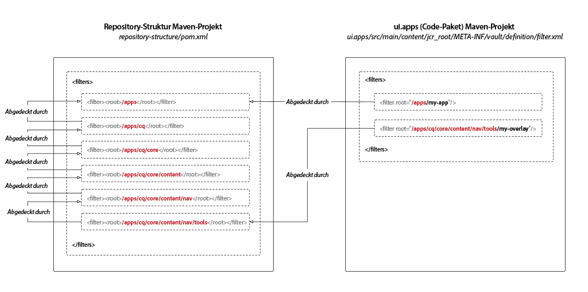

# Repository-Strukturpaket von AEM-Projekten

Maven-Projekte für Adobe Experience Manager as a Cloud Service erfordern eine Unterpaketdefinition für die Repository-Struktur, deren einziger Zweck darin besteht, die JCR-Repository-Stämme zu definieren, in denen die Code-Unterpakete des Projekts bereitgestellt werden. Dadurch wird sichergestellt, dass die Installation von Paketen in Experience Manager as a Cloud Service automatisch nach JCR-Ressourcenabhängigkeiten sortiert wird. Fehlende Abhängigkeiten können zu Szenarien führen, in denen Unterstrukturen vor ihren übergeordneten Strukturen installiert und daher unerwartet entfernt werden, wodurch die Bereitstellung unterbrochen wird.

Wenn Ihr Code-Paket an einem Speicherort bereitgestellt wird, der **nicht vom Code-Paket abgedeckt** wird, müssen alle übergeordneten Ressourcen (JCR-Ressourcen näher am JCR-Stamm) im Repository-Strukturpaket aufgezählt werden. Dieser Prozess ist erforderlich, um diese Abhängigkeiten zu schaffen.



Das Repository-Strukturpaket definiert den erwarteten, gemeinsamen Zustand von `/apps`, den der Paket-Validator verwendet, um Bereiche zu bestimmen, die „vor potenziellen Konflikten sicher“ sind, da es sich um Standardstämme handelt.

Typische Pfade, die in das Repository-Strukturpaket aufgenommen werden, sind:

+ `/apps`, der ein vom System bereitgestellter Knoten ist
+ `/apps/cq/...`, `/apps/dam/...`, `/apps/wcm/...` und `/apps/sling/...`, die gebräuchliche Überlagerungen für `/libs` bereitstellen.
+ `/apps/settings`, der der freigegebene kontextabhängige Konfigurationsstammpfad ist.

Beachten Sie, dass dieses Unterpaket **keinen** Inhalt hat und nur aus einer `pom.xml` besteht, die die Filterstämme definiert.

## Erstellen des Repository-Strukturpakets

Um ein Repository-Strukturpaket für Ihr Maven-Projekt zu erstellen, erstellen Sie ein neues leeres Maven-Unterprojekt mit der folgenden `pom.xml`, um die Projektmetadaten entsprechend Ihrem übergeordneten Maven-Projekt zu aktualisieren.

Aktualisieren Sie die `<filters>`, um alle JCR-Repository-Pfade einzuschließen, in denen Ihre Code-Pakete bereitgestellt werden.

Stellen Sie sicher, dass Sie dieses neue Maven-Unterprojekt der `<modules>`-Liste der übergeordneten Projekte hinzufügen.

```xml
<?xml version="1.0" encoding="UTF-8"?>
<project xmlns="https://maven.apache.org/POM/4.0.0" xmlns:xsi="https://www.w3.org/2001/XMLSchema-instance" xsi:schemaLocation="https://maven.apache.org/POM/4.0.0 https://maven.apache.org/maven-v4_0_0.xsd">
    <modelVersion>4.0.0</modelVersion>

    <!-- ====================================================================== -->
    <!-- P A R E N T  P R O J E C T  D E S C R I P T I O N                      -->
    <!-- ====================================================================== -->
    <parent>
        <groupId>com.my-company</groupId>
        <artifactId>my-app</artifactId>
        <version>x.x.x</version>
        <relativePath>../pom.xml</relativePath>
    </parent>

    <!-- ====================================================================== -->
    <!-- P R O J E C T  D E S C R I P T I O N                                   -->
    <!-- ====================================================================== -->
    <artifactId>ui.apps.structure</artifactId>
    <packaging>content-package</packaging>
    <name>UI Apps Structure - Repository Structure Package for /apps</name>

    <description>
        Empty package that defines the structure of the Adobe Experience Manager repository the code packages in this project deploy into.
        Any roots in the code packages of this project should have their parent enumerated in the filters list below.
    </description>

    <build>
        <plugins>
            <plugin>
                <groupId>org.apache.jackrabbit</groupId>
                <artifactId>filevault-package-maven-plugin</artifactId>
                <extensions>true</extensions>
                <properties>
                    <!-- Set Cloud Manager Target to none, else this package is deployed and remove all defined filter roots -->
                    <cloudManagerTarget>none</cloudManagerTarget>
                </properties>
                <configuration>
                    <properties>
                        <!-- Set Cloud Manager Target to none, else this package is deployed and remove all defined filter roots -->
                        <cloudManagerTarget>none</cloudManagerTarget>
                    </properties>
                    <filters>

                        <!-- /apps root -->
                        <filter><root>/apps</root></filter>

                        <!--
                        Examples of complex roots


                        Overlays of /libs typically require defining the overlay structure, at each level here.

                        For example, adding a new section to the main AEM Tools navigation, necessitates the following rules:

                        <filter><root>/apps/cq</root></filter>
                        <filter><root>/apps/cq/core</root></filter>
                        <filter><root>/apps/cq/core/content</root></filter>
                        <filter><root>/apps/cq/core/content/nav/</root></filter>
                        <filter><root>/apps/cq/core/content/nav/tools</root></filter>


                        Any /apps level Context-aware configurations need to enumerated here. 
                        
                        For example, providing email templates under `/apps/settings/notification-templates/com.day.cq.replication` necessitates the following rules:

                        <filter><root>/apps/settings</root></filter>
                        <filter><root>/apps/settings/notification-templates</root></filter>
                        <filter><root>/apps/settings/notification-templates/com.day.cq.replication</root></filter>
                        -->

                    </filters>
                </configuration>
            </plugin>
        </plugins>
    </build>
</project>
```

## Referenzieren des Repository-Strukturpakets

Um das Repository-Strukturpaket zu verwenden, referenzieren Sie es über alle Code-Paket-Maven-Projekte (die Unterpakete, die in `/apps` bereitgestellt werden) mithilfe der `<repositoryStructurePackage>`-Konfiguration des FileVault-Inhaltspaket-Maven-Plug-ins.

Fügen Sie in der `ui.apps/pom.xml` und den `pom.xml` anderen Code-Paketen einen Verweis auf die Repository-Strukturpaket-Konfiguration des Projekts (#repository-structure-package) zum FileVault Package Maven-Plug-in hinzu.

```xml
...
<build>
  <plugins>
    <plugin>
      <groupId>org.apache.jackrabbit</groupId>
      <artifactId>filevault-package-maven-plugin</artifactId>
      <extensions>true</extensions>
      <configuration>
        ...
        <repositoryStructurePackages>
          <repositoryStructurePackage>
              <groupId>${project.groupId}</groupId>
              <artifactId>ui.apps.structure</artifactId>
              <version>${project.version}</version>
          </repositoryStructurePackage>
        </repositoryStructurePackages>
      </configuration>
    </plugin>
    ...
</build>
<dependencies>
    <!-- Add the dependency for the repository structure package so it resolves -->
    <dependency>
        <groupId>${project.groupId}</groupId>
        <artifactId>ui.apps.structure</artifactId>
        <version>${project.version}</version>
        <type>zip</type>
    </dependency>
    ...
</dependencies>
```

## Anwendungsfall für mehrere Code-Pakete

Weniger häufig verwendete und komplexere Anwendungsfälle unterstützen die Bereitstellung von Multi-Code-Paketen, die in denselben Bereichen des JCR-Repositorys installiert werden.

Beispiel:

+ Code-Paket A wird in `/apps/a` bereitgestellt
+ Code-Paket B wird in `/apps/a/b` bereitgestellt

Wenn auf Paketebene keine Abhängigkeit des Code-Pakets B von Code-Paket A hergestellt wird, kann Code-Paket B zuerst in `/apps/a` bereitgestellt werden. Wenn darauf dann Code-Paket A folgt, das in `/apps/a` bereitgestellt wird, wird das zuvor installierte `/apps/a/b` entfernt.

In diesem Fall:

+ Code-Paket A sollte `<repositoryStructurePackage>` im Repository-Strukturpaket des Projekts definieren (was einen Filter für `/apps` enthalten sollte).
+ Code-Paket B sollte `<repositoryStructurePackage>` für Code-Paket A definieren, da Code-Paket B in dem von Code-Paket A gemeinsam genutzten Speicherplatz bereitgestellt wird.

## Fehler und Debugging

Wenn die Repository-Strukturpakete nicht korrekt eingerichtet sind, wird beim Maven-Build ein Fehler gemeldet:

```
1 error(s) detected during dependency analysis.
Filter root's ancestor '/apps/some/path' is not covered by any of the specified dependencies.
```

Dies bedeutet, dass das problematische Code-Paket kein `<repositoryStructurePackage>` enthält, das `/apps/some/path` in der Filterliste auflistet.

## Zusätzliche Ressourcen

+ [FileVault Content Package Maven Plugin](https://jackrabbit.apache.org/filevault-package-maven-plugin/)
