# Struktur der AEM-UI {#structure-of-the-aem-ui}

Die Benutzeroberfläche von AEM basiert auf bestimmten Prinzipien und besteht aus mehreren Schlüsselelementen:

## Konsolen {#consoles}

### Grundlegendes Layout und Größenanpassung {#basic-layout-and-resizing}

Die Benutzeroberfläche ist für Mobilgeräte sowie Desktop-Computer geeignet. AEM hat sich dagegen entschieden, zwei verschiedene Stile zu entwickeln, und verwendet stattdessen einen Stil, das mit allen Bildschirmen und Geräten kompatibel ist.

Alle Module verwenden dasselbe grundlegende Layout:

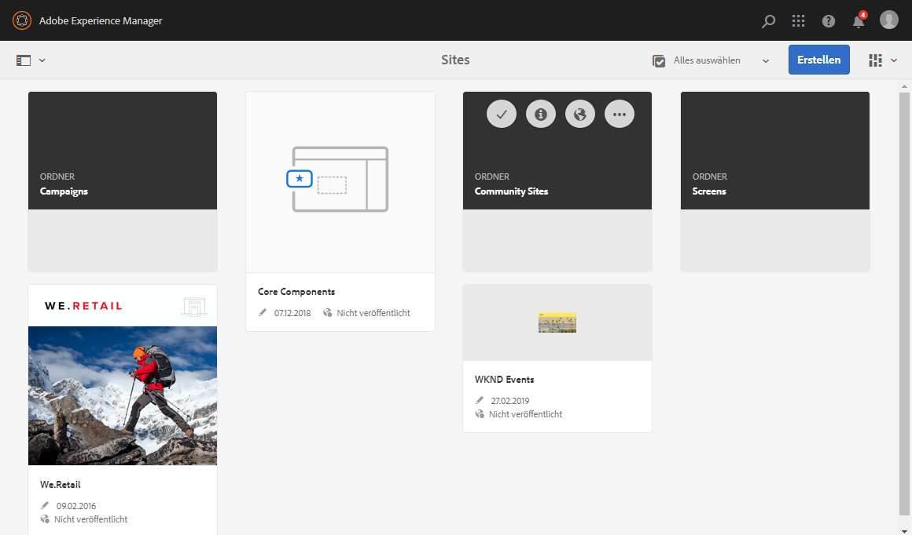

Das Layout ist im responsiven Design-Stil gehalten und passt sich der Größe des verwendeten Geräts und/oder Fensters an.

Wenn z. B. die Auflösung unter 1024 Pixel sinkt (wie bei einem mobilen Gerät), wird die Anzeige entsprechend angepasst:

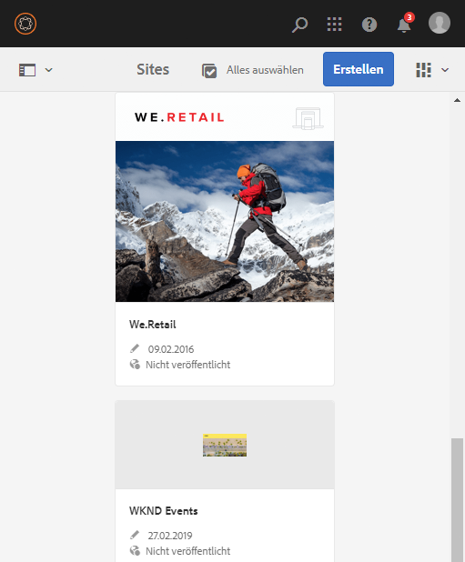

### Kopfzeilenleiste {#header-bar}

Die Kopfzeilenleiste zeigt globale Elemente, z. B.:

* Das Logo und das spezifische Produkt/die spezifische Lösung, das/die Sie derzeit verwenden. Bei AEM stellt dieses Element auch eine Verbindung zur globalen Navigation her
* Suchen
* Symbol für Zugriff auf Hilfe-Ressourcen
* Symbol für Zugriff auf andere Lösungen
* Ein Indikator für – und Zugriff auf – alle Warnhinweise und Objekte im Posteingang, die auf Sie warten
* Benutzersymbol mit einem Link zum Profil-Management

### Symbolleiste {#toolbar}

Die Symbolleiste zeigt abhängig vom Kontext Tools an, die die Ansicht oder Elemente der Seite steuern. Die Symbolleiste ist produktspezifisch, es gibt jedoch einige gemeinsame Elemente.

An jedem Ort zeigt die Symbolleiste die derzeit verfügbaren Aktionen an:

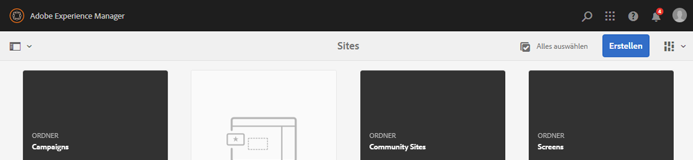

Auch abhängig davon, ob eine Ressource ausgewählt ist:

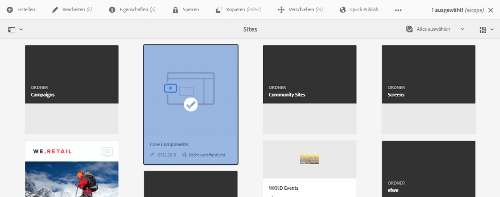

### Linke Leiste {#left-rail}

Die linke Leiste kann nach Bedarf geöffnet oder ausgeblendet werden. Sie zeigt Folgendes an:

* **Nur Inhalt**
* **Inhaltsstruktur**
* **Zeitleiste**
* **Verweise**
* **Filter**

Der Standard ist **Nur Inhalt** (Leiste ausgeblendet).

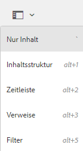

## Bearbeiten von Seiten {#page-authoring}

Beim Bearbeiten von Seiten gibt es folgende strukturelle Bereiche.

### Inhalts-Frame {#content-frame}

Der Seiteninhalt wird im Inhalts-Frame gerendert. Der Inhalts-Frame ist unabhängig vom Editor, um sicherzustellen, dass keine Konflikte aufgrund von CSS oder JavaScript auftreten.

Der Inhalts-Frame wird im rechten Bereich des Fensters unter der Symbolleiste angezeigt.

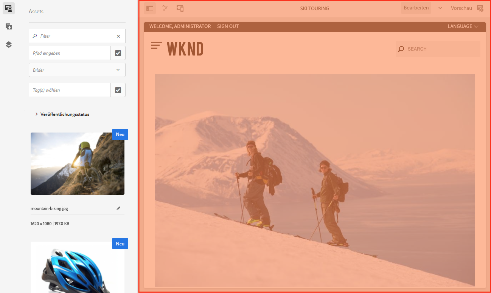

### Editor-Frame {#editor-frame}

Der Editor-Frame enthält die Bearbeitungsfunktionen.

Der Editor-Frame ist ein Container (Abstraktion) für alle Seitenbearbeitungselemente. Er wird über dem Inhalts-Frame angezeigt und enthält:

* die obere Symbolleiste
* den Seitenbereich
* alle Überlagerungen
* alle anderen Seitenbearbeitungselemente, z. B. die Komponenten-Symbolleiste

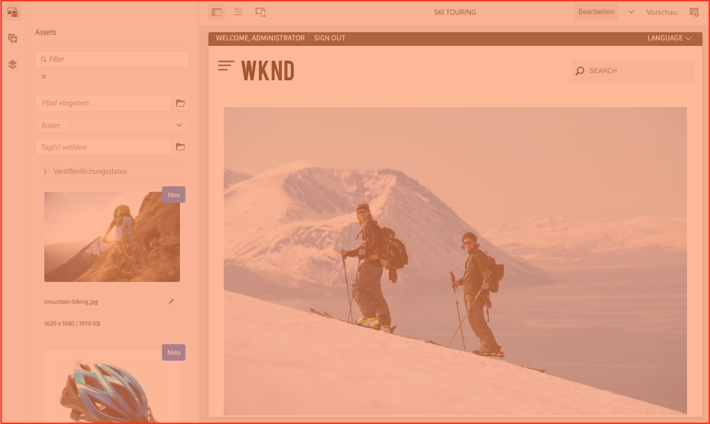

### Seitenbereich {#side-panel}

Es sind drei Standardregisterkarten enthalten. Auf den Registerkarten **Assets** und **Komponenten** können Sie Elemente auswählen, aus dem Bedienfeld ziehen und auf der Seite ablegen. Auf der Registerkarte **Inhaltsstruktur** können Sie die Hierarchie des Inhalts auf der Seite überprüfen.

Das seitliche Panel ist standardmäßig ausgeblendet. Wenn diese Option aktiviert ist, wird sie entweder auf der linken Seite angezeigt, oder, wenn die Fensterbreite weniger als 1024 Pixel beträgt, erstreckt sie sich über das gesamte Fenster, wie z. B. auf einem mobilen Gerät.

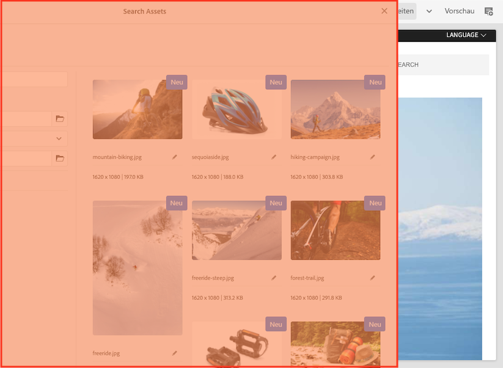

### Seitliches Panel – Assets {#side-panel-assets}

Auf der Registerkarte „Assets“ können Sie aus einer Reihe von Assets wählen. Sie können auch nach einem bestimmten Begriff filtern oder eine Gruppe auswählen.

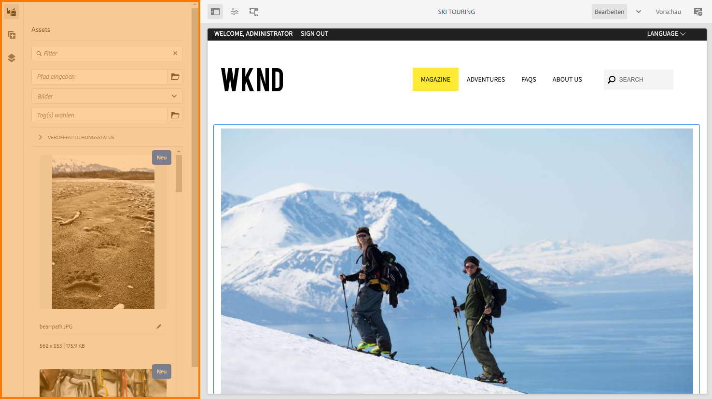

### Seitenbereich – Asset-Gruppen {#side-panel-asset-groups}

Auf der Registerkarte „Assets“ gibt es eine Dropdown-Liste zum Auswählen bestimmter Asset-Gruppen.

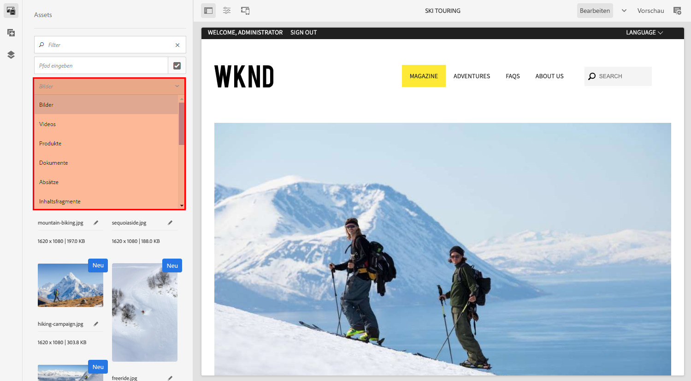

### Seitliches Panel – Komponenten {#side-panel-components}

Auf der Registerkarte „Komponenten“ können Sie aus einer Reihe von Komponenten wählen. Sie können auch nach einem bestimmten Begriff filtern oder eine Gruppe auswählen.

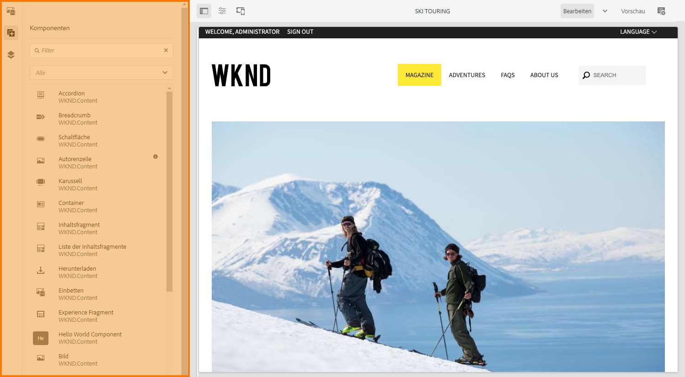

### Seitenbereich – Inhaltsstruktur {#side-panel-content-tree}

Auf der Registerkarte „Inhaltsstruktur“ können Sie die Hierarchie der Inhalte auf der Seite anzeigen. Wenn Sie auf einen Eintrag in der Registerkarte klicken, wird das Element auf der Seite im Editor geöffnet und ausgewählt.

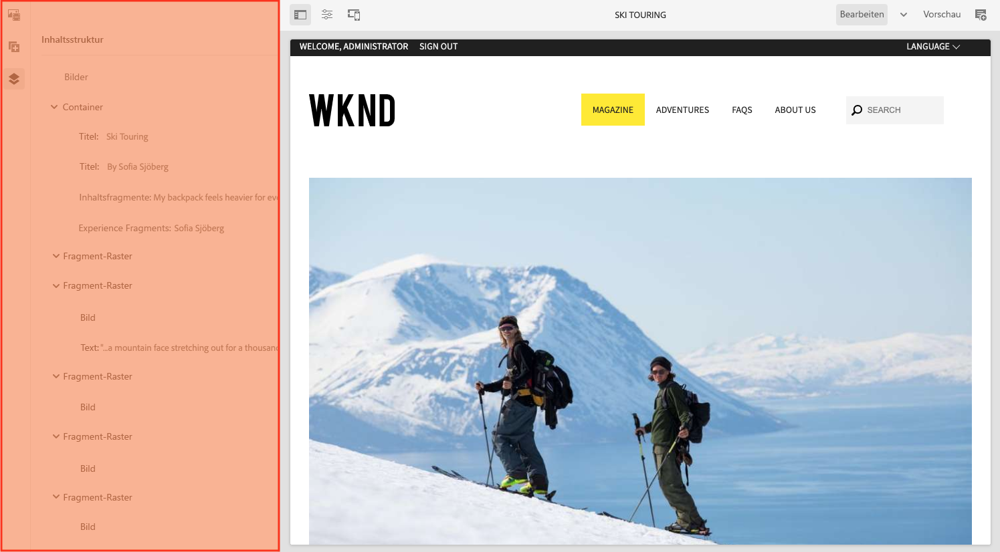

### Überlagerungen {#overlays}

Diese überlagern den Inhalts-Frame und werden von den [Ebenen](#layer) genutzt, um die Mechanik umzusetzen, wie man transparent mit den Komponenten und deren Inhalt interagieren kann.

Die Überlagerungen befinden sich im Editor-Frame (neben allen anderen Seitenbearbeitungselementen); sie überlagern jedoch die entsprechenden Elemente im Inhalts-Frame.

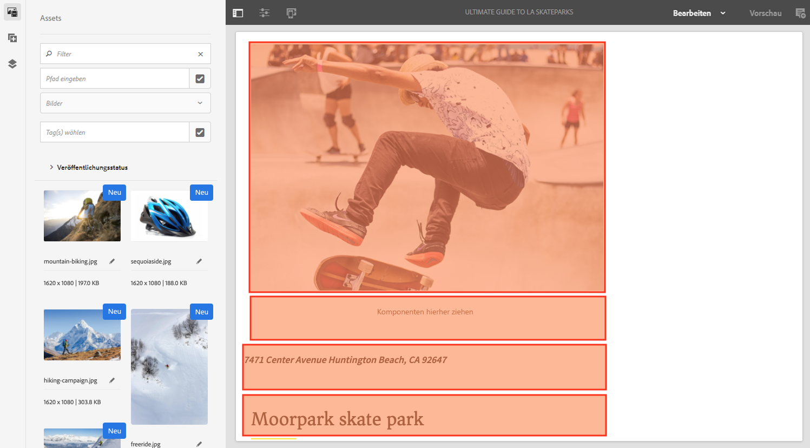

### Ebene {#layer}

Eine Ebene ist eine unabhängige Funktionsgruppe, die Sie aktivieren können, um Folgendes auszuführen:

* eine andere Ansicht der Seite aufrufen
* eine Seite bearbeiten und/oder damit interagieren

Anders als spezifische Aktionen zu einzelnen Komponenten bieten die Ebenen komplexe Funktionen für die gesamte Seite.

AEM enthält verschiedene vorab implementierte Ebenen für die Seitenbearbeitung, z. B. Bearbeiten, Vorschau, Anmerkungen.

>[!NOTE]
>
>Ebenen sind ein leistungsstarkes Konzept, das die Ansicht der Benutzenden auf den Seiteninhalt und die Interaktion mit ihm beeinflusst. Stellen Sie bei der Entwicklung Ihrer eigenen Ebenen sicher, dass die Ebene beim Beenden bereinigt wird.

### Ebenenschalter {#layer-switcher}

Mit dem Ebenenschalter können Sie die Ebene auswählen, die verwendet werden soll. Wenn er geschlossen ist, zeigt er die aktuell verwendete Ebene an.

Der Ebenenumschalter ist als Dropdown-Menü in der Symbolleiste (am oberen Rand des Fensters im Editor-Frame) verfügbar.

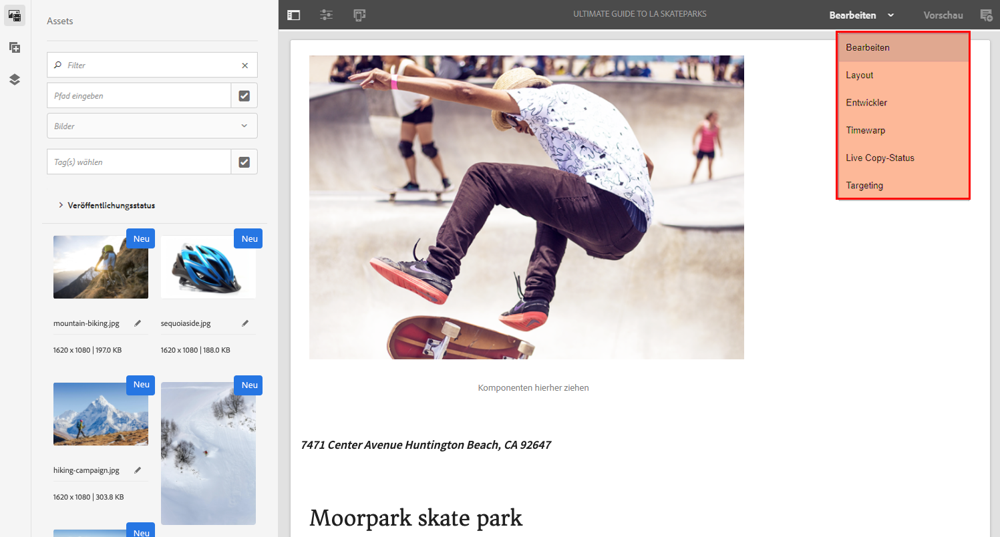

### Komponenten-Symbolleiste {#component-toolbar}

Jede Instanz einer Komponente zeigt ihre Symbolleiste an, wenn Sie darauf klicken (entweder einmal oder mit einem langsamen Doppel-Klick). Die Symbolleiste enthält spezifische Aktionen (z. B. Kopieren, Einfügen, „Editor öffnen“), die für die Komponenteninstanz auf der Seite verfügbar sind.

Je nach verfügbarem Platz werden die Komponenten-Symbolleisten in der oberen oder unteren rechten Ecke der entsprechenden Komponente platziert.

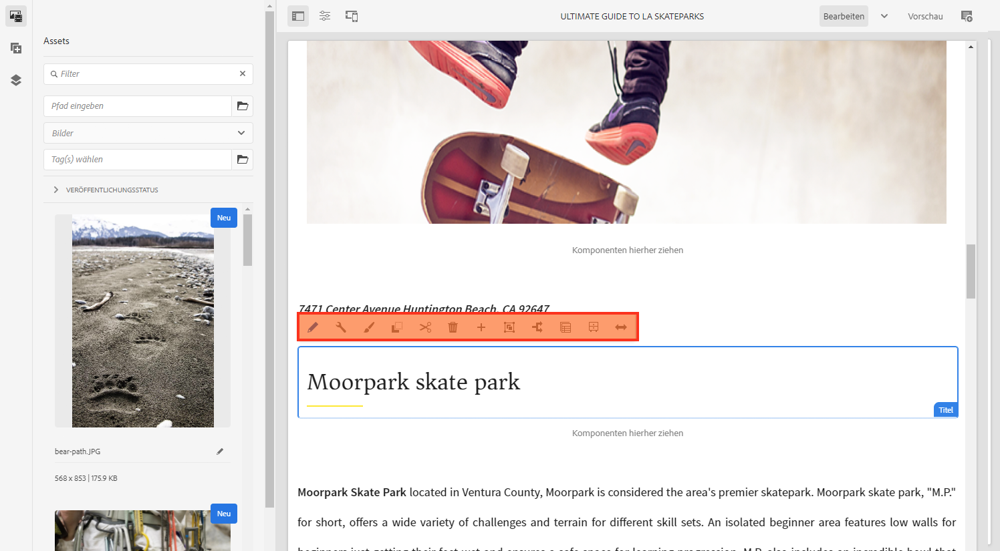

## Weiterführende Informationen {#further-information}

<!--For more details about the concepts around the touch-enabled UI, continue to the article [Concepts of the AEM Touch-Enabled UI](/help/sites-developing/touch-ui-concepts.md).-->

Weitere technische Informationen finden Sie im [JS-Dokumentationssatz](https://developer.adobe.com/experience-manager/reference-materials/6-5/jsdoc/ui-touch/editor-core/index.html) für den Seiteneditor.

### Unified Shell {#unified-shell}

Siehe [AEM as a Cloud Service in Unified Shell](/help/overview/aem-cloud-service-on-unified-shell.md), wenn Sie Unified Shell als AEM-UI verwenden.

Wenn Sie Anpassungen vornehmen müssen oder bereits vorgenommen haben, kann Unified Shell deaktiviert werden:

* [über die Benutzeroberfläche](/help/overview/aem-cloud-service-on-unified-shell.md#disabling-unified-shell)

* mit Ihrem Projekt-Code durch:

   * unter `/conf/global/setting/unifiedshell`

      * Festlegen der `Boolean`-Eigenschaft `enable` auf `false`
