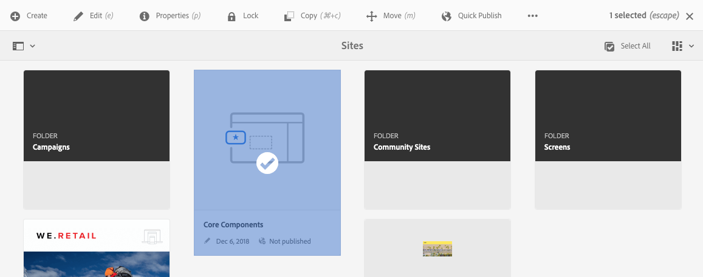

# Struktur der AEM-UI {#structure-of-the-aem-ui}

Die Benutzeroberfläche von AEM basiert auf bestimmten Prinzipien und besteht aus mehreren Schlüsselelementen:

## Konsolen {#consoles}

### Grundlegendes Layout und Größenanpassung {#basic-layout-and-resizing}

Die Benutzeroberfläche ist für Mobilgeräte sowie Desktop-Computer geeignet. AEM hat sich dagegen entschieden, zwei verschiedene Layouts zu entwickeln, und verwendet stattdessen ein Layout, das mit allen Bildschirmen und Geräten kompatibel ist.

Alle Module verwenden dasselbe Basis-Layout. In AEM sieht es wie folgt aus:

Das Layout ermöglicht eine schnelle und einfache Bedienung und passt sich an die Größe des verwendeten Bildschirms oder Fensters an.

Wenn die Auflösung beispielsweise unter 1024 px (wie auf einem Mobilgerät) liegt, wird die Anzeige entsprechend angepasst:

### Kopfzeilenleiste {#header-bar}

Die Kopfzeilenleiste zeigt globale Elemente, z. B.:

* Das Logo und das Produkt/die Lösung, das/die Sie derzeit verwenden. In AEM wird außerdem ein Link zur globalen Navigation angezeigt.
* Suchen
* Symbol für Zugriff auf Hilfe-Ressourcen
* Symbol für Zugriff auf andere Lösungen
* Hinweis (und Zugriff) auf Warnungen und Objekte im Posteingang, die auf Sie warten
* Benutzersymbol mit einem Link zum Profil-Management

### Symbolleiste {#toolbar}

Die Symbolleiste zeigt abhängig vom Kontext Tools an, die die Ansicht oder Elemente der Seite steuern. Die Symbolleiste ist produktspezifisch, es gibt jedoch einige gemeinsame Elemente.

Sie zeigt stets die aktuell möglichen Aktionen an:

Die möglichen Aktionen hängen auch davon ab, ob eine Ressource ausgewählt ist:

### Linke Leiste {#left-rail}

Die linke Leiste kann nach Bedarf geöffnet oder ausgeblendet werden. Sie zeigt Folgendes an:

* **Nur Inhalt**
* **Inhaltsstruktur**
* **Zeitleiste**
* **Verweise**
* **Filter**

Der Standardwert ist **Nur Inhalt** (Leiste ausgeblendet).

## Bearbeiten von Seiten {#page-authoring}

Beim Bearbeiten von Seiten gibt es folgende strukturelle Bereiche.

### Inhalts-Frame {#content-frame}

Der Seiteninhalt wird im Inhalts-Frame gerendert. Der Inhalts-Frame ist vollständig unabhängig vom Editor - um sicherzustellen, dass keine Konflikte aufgrund von CSS oder JavaScript auftreten.

Der Inhalts-Frame wird im rechten Bereich des Fensters unter der Symbolleiste angezeigt.

### Editor-Frame {#editor-frame}

Der Editor-Frame enthält die Bearbeitungsfunktionen.

Der Editor-Frame ist ein Container (Abstraktion) für alle Seitenbearbeitungselemente. Er wird über dem Inhalts-Frame angezeigt und enthält:

* die obere Symbolleiste
* den Seitenbereich
* alle Überlagerungen
* alle anderen Seitenbearbeitungselemente, z. B. die Komponenten-Symbolleiste

### Seitenbereich {#side-panel}

Dieser enthält drei Standardregisterkarten. Auf den Registerkarten **Assets** und **Komponenten** können Sie Elemente auswählen, aus dem Bedienfeld ziehen und auf der Seite ablegen. Auf der Registerkarte **Inhaltsstruktur** können Sie die Hierarchie der Inhalte auf der Seite überprüfen.

Der Seitenbereich ist standardmäßig ausgeblendet. Wenn er ausgewählt ist, wird er entweder auf der linken Seite bzw. über die gesamte Fensterbreite angezeigt, wenn das Fenster weniger als 1.024 px breit ist (beispielsweise auf einem Mobilgerät).

### Seitenbereich – Assets {#side-panel-assets}

Auf der Registerkarte Assets können Sie aus dem Asset-Bereich auswählen. Sie können auch nach einem bestimmten Begriff filtern oder eine Gruppe auswählen.

### Seitenbereich – Asset-Gruppen {#side-panel-asset-groups}

Auf der Registerkarte „Assets“ gibt es eine Dropdown-Liste zum Auswählen bestimmter Asset-Gruppen.

### Seitenbereich – Komponenten {#side-panel-components}

Auf der Registerkarte Komponenten können Sie aus dem Komponentenbereich auswählen. Sie können auch nach einem bestimmten Begriff filtern oder eine Gruppe auswählen.

### Seitenbereich – Inhaltsstruktur {#side-panel-content-tree}

Auf der Registerkarte „Inhaltsstruktur“ können Sie die Inhaltshierarchie auf der Seite anzeigen. Wenn Sie auf einen Eintrag in der Registerkarte klicken, wird das Element auf der Seite im Editor geöffnet und ausgewählt.

### Überlagerungen {#overlays}

Diese überlagern den Inhalts-Frame und werden von [Ebenen](#layer) genutzt, um die (vollständig transparente) Interaktion mit Komponenten und ihrem Inhalt zu ermöglichen.

Die Überlagerungen befinden sich im Editor-Frame (neben allen anderen Seitenbearbeitungselementen); sie überlagern jedoch die entsprechenden Elemente im Inhalts-Frame.

### Ebene {#layer}

Eine Ebene ist eine unabhängige Funktionsgruppe, die Sie aktivieren können, um Folgendes auszuführen:

* eine andere Ansicht der Seite aufrufen
* eine Seite bearbeiten und/oder damit interagieren

Anders als spezifische Aktionen zu einzelnen Komponenten bieten die Ebenen komplexe Funktionen für die gesamte Seite.

AEM enthält verschiedene vorab implementierte Ebenen für die Seitenbearbeitung, z. B. Bearbeiten, Vorschau, Anmerkungen.

>[!NOTE]
>
>Ebenen sind ein leistungsstarkes Konzept, das die Ansicht des Benutzers und die Interaktion mit dem Seiteninhalt beeinflusst. Wenn Sie eigene Ebenen entwickeln, müssen Sie sicherstellen, dass die Ebene beim Verlassen bereinigt wird.

### Ebenenschalter {#layer-switcher}

Mit dem Ebenenschalter können Sie die Ebene auswählen, die Sie verwenden möchten. Wenn er geschlossen ist, zeigt er die aktuell verwendete Ebene an.

Der Ebenenschalter ist ein Dropdown-Menü in der Symbolleiste (am oberen Rand des Fensters im Editor-Frame).

### Komponentensymbolleiste {#component-toolbar}

Jede Instanz einer Komponente zeigt ihre Symbolleiste an, wenn Sie darauf klicken (entweder einmal oder mit einem langsamen Doppelklick). Die Symbolleiste enthält spezifische Aktionen (z. B. Kopieren, Einfügen, „Editor öffnen“), die für die Komponenteninstanz auf der Seite verfügbar sind.

Je nach verfügbarem Platz werden die Komponenten-Symbolleisten in der oberen oder unteren rechten Ecke der entsprechenden Komponente platziert.

## Weiterführende Informationen {#further-information}

<!--For more details about the concepts around the touch-enabled UI, continue to the article [Concepts of the AEM Touch-Enabled UI](/help/sites-developing/touch-ui-concepts.md).-->

Weitere technische Informationen finden Sie im [JS-Dokumentationssatz](https://helpx.adobe.com/de/experience-manager/6-5/sites/developing/using/reference-materials/jsdoc/ui-touch/editor-core/index.html) für den Seiten-Editor.
