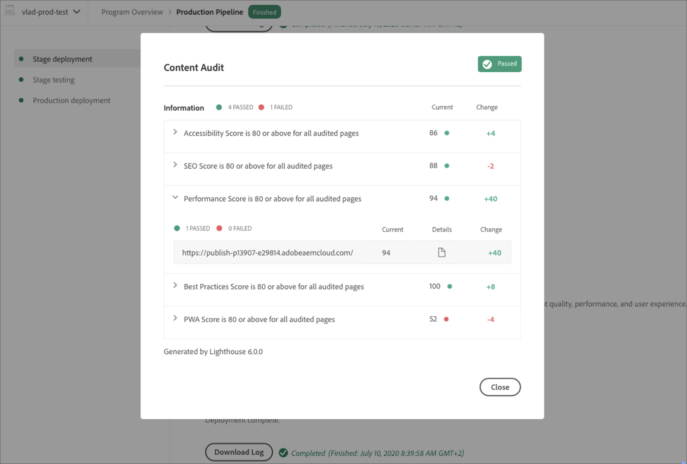

# Grundlegendes zu Testergebnissen – Cloud Services {#understand-test-results}

Cloud Manager für Cloud Services -Pipeline-Ausführungen unterstützen die Ausführung von Tests, die für die Staging-Umgebung ausgeführt werden. Dies steht im Gegensatz zu Tests, die während des Build- und Unit-Testschritts ausgeführt werden, die offline ohne Zugriff auf eine laufende AEM-Umgebung durchgeführt werden.

Es gibt drei große Kategorien von Tests, die von Cloud Manager für Cloud Services-Pipeline unterstützt werden:

1. [Testen der Codequalität](#code-quality-testing)
1. [Funktionstests](#functional-testing)
1. [Content Audit-Tests](#content-audit-testing)

Folgende Tests sind möglich:

* Vom Kunden geschriebene
* Adobe geschrieben
* Powered by Lighthouse von Google als Open-Source-Tool

   >[!NOTE]
   > Sowohl kundengeschriebene Tests als auch Adoben werden in einer Containerinfrastruktur ausgeführt, die für diese Testtypen entwickelt wurde.


## Testen der Codequalität {#code-quality-testing}

Im Rahmen der Pipeline wird der Quellcode gescannt, um sicherzustellen, dass Bereitstellungen bestimmte Qualitätskriterien erfüllen. Derzeit ist dies durch eine Kombination aus SonarQube und der Prüfung auf Inhaltspaketebene mithilfe von OakPAL implementiert. Es gibt über 100 Regeln, die generische Java-Regeln und AEM-spezifische Regeln kombinieren. In der folgenden Tabelle finden Sie eine Zusammenfassung der Testkriterienbewertung:

| Name | Definition | Kategorie | Fehlerschwellenwert |
|--- |--- |--- |--- |
| Sicherheitsbewertung | A = 0 Schwachstellen <br/>B = mindestens 1 kleinere Schwachstelle<br/> C = mindestens 1 größere Schwachstelle <br/>D = mindestens 1 kritische Schwachstelle <br/>E = mindestens 1 Schwachstelle der Kategorie „Blocker“ | Kritisch | &lt; B |
| Zuverlässigkeitsbewertung | A = 0 Fehler <br/>B = mindestens 1 kleinerer Fehler <br/>C = mindestens 1 größerer Fehler <br/>D = mindestens 1 kritischer Fehler E = mindestens 1 Fehler der Kategorie „Blocker“ | Wichtig | &lt; C |
| Wartbarkeitsbewertung | Wenn die ausstehenden Kosten zur Code-Smell-Behebung …<br/><ul><li>&lt;= 5 % der Zeit ausmachen, die bereits in die Anwendung investiert wurde, lautet die Bewertung A. </li><li>zwischen 6 und 10 % dieser Zeit ausmachen, lautet die Bewertung B. </li><li>zwischen 11 und 20 % dieser Zeit ausmachen, lautet die Bewertung C. </li><li>zwischen 21 und 50 % dieser Zeit ausmachen, lautet die Bewertung D.</li><li>mehr als 50 % dieser Zeit ausmachen, lautet die Bewertung E.</li></ul> | Wichtig | &lt; A |
| Abdeckung | Mix aus Zeilen- und Bedingungsabdeckung mit dieser Formel: <br/>`Coverage = (CT + CF + LC)/(2*B + EL)`<br/> Dabei gilt Folgendes: CT = Bedingungen, bei denen die Auswertung während der Durchführung von Unit-Tests mindestens einmal „true“ ergeben hat <br/>CF = Bedingungen, bei denen die Auswertung während der Durchführung von Unit-Tests mindestens einmal „false“ ergeben hat <br/>LC = abgedeckte Zeilen = abzudeckende_Zeilen - nicht_abgedeckte_Zeilen <br/><br/> B = Gesamtanzahl der Bedingungen <br/>EL = Gesamtzahl ausführbarer Zeilen (abzudeckende_Zeilen) | Wichtig | &lt; 50% |
| Übersprungene Unit-Tests | Zahl der übersprungenen Unit-Tests | Info | > 1 |
| Offene Probleme | Allgemeine Problemtypen – Schwachstellen (Vulnerability), Fehler (Bug) und Code-Smells (Code Smell) | Info | > 0 |
| Duplizierte Zeilen | Anzahl der Zeilen, die an duplizierten Blöcken beteiligt sind. <br/>Voraussetzungen, damit ein Codeblock als dupliziert gilt: <br/><ul><li>**Nicht-Java-Projekte:**</li><li>Es sollte mindestens 100 aufeinanderfolgende und duplizierte Token geben.</li><li>Diese Token sollten sich mindestens wie folgt verteilen: </li><li>30 Codezeilen für COBOL </li><li>20 Codezeilen für ABAP </li><li>10 Codezeilen für andere Sprachen</li><li>**Java-Projekte:**</li><li> Unabhängig von der Anzahl der Token und Zeilen sollte es mindestens 10 aufeinanderfolgende und duplizierte Anweisungen geben.</li></ul> <br/>Unterschiede bei Einzügen sowie Zeichenfolgenliteralen werden beim Erkennen von Duplizierungen ignoriert. | Info | > 1% |
| Kompatibilität mit Cloud Service | Anzahl der festgestellten Kompatibilitätsprobleme mit Cloud Service. | Info | > 0 |


>[!NOTE]
>
>Genauere Definitionen finden Sie unter [Metrikdefinitionen](https://docs.sonarqube.org/display/SONAR/Metric+Definitions).

Sie können hier eine Liste der Regeln herunterladen: [code-quality-rules.xlsx](/help/implementing/cloud-manager/assets/CodeQuality-rules-latest.xlsx).

>[!NOTE]
>
>Weitere Informationen zu den benutzerdefinierten Regeln zur Code-Qualität, die von [!UICONTROL Cloud Manager] ausgeführt werden, finden Sie unter [Benutzerspezifische Regeln für Code-Qualität](/help/implementing/cloud-manager/custom-code-quality-rules.md).

### Umgang mit falsch positiven Werten {#dealing-with-false-positives}

Das Verfahren zur Qualitätsprüfung ist nicht perfekt. Mitunter werden fälschlicherweise Probleme identifiziert, die eigentlich nicht problematisch sind. Dies wird als „falsch positiv“ bezeichnet.

In diesen Fällen kann der Quellcode mit der standardmäßigen `@SuppressWarnings`-Java-Anmerkung kommentiert werden. Dabei wird die Regel-ID als Anmerkungsattribut angegeben. Ein häufiges Problem besteht etwa darin, dass die SonarQube-Regel zur Erkennung hartcodierter Kennwörter in Bezug auf die Identifizierung eines hartcodierten Kennworts „aggressiv“ sein kann.

Sehen wir uns ein konkretes Beispiel mit Code an, der in AEM-Projekten relativ häufig vorkommt, wenn eine Verbindung zu einem externen Dienst hergestellt werden soll:

```java
@Property(label = "Service Password")
private static final String PROP_SERVICE_PASSWORD = "password";
```

SonarQube weist dann auf eine Schwachstelle der Kategorie „Blocker“ hin. Nach Prüfung des Codes erkennen Sie, dass es sich nicht um eine Schwachstelle handelt, und kommentieren dies mit der entsprechenden Regel-ID.

```java
@SuppressWarnings("squid:S2068")
@Property(label = "Service Password")
private static final String PROP_SERVICE_PASSWORD = "password";
```

Aber was wäre bei diesem Code?

```java
@Property(label = "Service Password", value = "mysecretpassword")
private static final String PROP_SERVICE_PASSWORD = "password";
```

Dann bestünde die richtige Lösung darin, das hartcodierte Kennwort zu entfernen.

>[!NOTE]
>
>Obwohl sich möglichst spezifische `@SuppressWarnings`-Anmerkungen bewährt haben, also nur eine bestimmte Anweisung oder den Block zu kommentieren, der das Problem verursacht, können Anmerkungen auf Klassenebene hinzugefügt werden.

>[!NOTE]
>Es gibt zwar keinen expliziten Sicherheitstestschritt, es gibt jedoch weiterhin sicherheitsbezogene Code-Qualitätsregeln, die während des Codequalitätsschritts bewertet werden. Weitere Informationen finden Sie unter [Sicherheitsübersicht AEM als Cloud Service](/help/security/cloud-service-security-overview.md) .

## Funktionstests {#functional-testing}

Funktionstests werden in zwei Typen eingeteilt:

* Funktionstests für das Produkt
* Benutzerdefinierte Funktionstests

### Funktionstests für das Produkt {#product-functional-testing}

Produktfunktionstests sind eine Reihe stabiler HTTP-Integrationstests (ITs) zu den Kernfunktionen in AEM (z. B. Authoring und Replikation), die verhindern, dass Kundenänderungen an ihrem Anwendungscode bereitgestellt werden, wenn diese Kernfunktionalität nicht mehr funktioniert.

Sie werden automatisch ausgeführt, wenn ein Kunde neuen Code für Cloud Manager bereitstellt.

### Benutzerdefinierte Funktionstests {#custom-functional-testing}

Der Schritt für benutzerdefinierte Funktionstests in der Pipeline ist immer vorhanden und kann nicht übersprungen werden.

Wenn jedoch keine Test-JAR vom Build erzeugt wird, wird der Test standardmäßig erfolgreich durchgeführt.

>[!NOTE]
>Über die Schaltfläche **Protokoll herunterladen** können Sie auf eine ZIP-Datei zugreifen, die die Protokolle für das detaillierte Formular zur Testausführung enthält. Diese Protokolle enthalten nicht die Protokolle des eigentlichen AEM-Laufzeitprozesses – auf diese kann über die reguläre Download- oder Longtail-Protokollfunktionalität zugegriffen werden. Refer to [Accessing and Managing Logs](/help/implementing/cloud-manager/manage-logs.md) for more details.


#### Schreiben von Funktionstests {#writing-functional-tests}

Vom Kunden geschriebene Funktionstests müssen als separate JAR-Datei verpackt werden, die vom gleichen Maven-Build wie die Artefakte erstellt wird, die in AEM bereitgestellt werden sollen. Im Allgemeinen wäre dies ein separates Maven-Modul. Die resultierende JAR-Datei muss alle erforderlichen Abhängigkeiten enthalten und wird im Allgemeinen mithilfe des maven-assembly-Plug-ins mit dem Deskriptor jar-with-dependencies erstellt.

Darüber hinaus muss für die JAR-Datei der Manifest-Header „Cloud-Manager-TestType“ auf „integration-test“ eingestellt sein. In Zukunft werden voraussichtlich weitere Header-Werte unterstützt. Eine Beispielkonfiguration für das maven-assembly-Plug-in ist:

```java
<build>
    <plugins>
        <!-- Create self-contained jar with dependencies -->
        <plugin>
            <groupId>org.apache.maven.plugins</groupId>
            <artifactId>maven-assembly-plugin</artifactId>
            <version>3.1.0</version>
            <configuration>
                <descriptorRefs>
                    <descriptorRef>jar-with-dependencies</descriptorRef>
                </descriptorRefs>
                <archive>
                    <manifestEntries>
                        <Cloud-Manager-TestType>integration-test</Cloud-Manager-TestType>
                    </manifestEntries>
                </archive>
            </configuration>
            <executions>
                <execution>
                    <id>make-assembly</id>
                    <phase>package</phase>
                    <goals>
                        <goal>single</goal>
                    </goals>
                </execution>
            </executions>
        </plugin>
    </plugins>
```

Innerhalb dieser JAR-Datei müssen die Klassennamen der tatsächlich auszuführenden Tests in „IT“ enden.

Beispielsweise würde eine Klasse mit dem Namen `com.myco.tests.aem.ExampleIT` ausgeführt, eine Klasse mit dem Namen `com.myco.tests.aem.ExampleTest` jedoch nicht.

Die Testklassen müssen normale JUnit-Tests sein. Die Testinfrastruktur ist so konzipiert und konfiguriert, dass sie mit den Konventionen der Testbibliothek von aem-testing-clients kompatibel ist. Entwicklern wird dringend empfohlen, diese Bibliothek zu verwenden und ihre Best Practices zu befolgen. Weitere Informationen finden Sie unter [Git-Link](https://github.com/adobe/aem-testing-clients).

## Content Audit-Tests {#content-audit-testing}

Content Audit ist eine Funktion, die in Cloud Manager-Sites-Produktionsleitungen verfügbar ist, die von Lighthouse, einem Open-Source-Tool von Google, betrieben werden. Diese Funktion ist in allen Cloud Manager-Produktionsleitungen aktiviert.

Er validiert den Bereitstellungsprozess und stellt sicher, dass die bereitgestellten Änderungen

1. Erfüllen Sie Grundstandards für Leistung, Barrierefreiheit, Best Practices, SEO (Suchmaschinenoptimierung) und PWA (Progressive Web App).

1. Schließen Sie keine Regressionen in diese Dimensionen ein.

Content Audit in Cloud Manager ensures that the end users digital experience on the site may be maintained at the highest standards. The results are informational and allow the user to see the scores and the change between the current and previous scores. This insight is valuable to determine if there is a regression that will be introduced with the current deployment.

### Understanding Content Audit Results {#understanding-content-audit-results}

Content Audit provides aggregate and detailed page-level test results via the Production Pipeline execution page.

* Aggregate level metrics measure the average score across the pages that were audited.
* Individual page level scores are also available via drill down.
* Details of the scores are available to see what are the results of the individual tests, along with guidance on how to remediate any issues that were identified during the content audit.
* A history of the test results are persisted within Cloud Manager so customers can see whether changes that are being introduced in the pipeline run include any regressions from the previous run.

#### Aggregate Scores {#aggregate-scores}

Für jeden Testtyp (Leistung, Barrierefreiheit, SEO, Best Practices und PWA) gibt es einen Aggregat-Level-Wert.

Das Aggregat-Level-Ergebnis entspricht dem Durchschnittswert der Seiten, die in der Ausführung enthalten sind. Die Änderung auf Aggregat-Ebene stellt den Durchschnittswert der Seiten in der aktuellen Ausführung im Vergleich zum Durchschnittswert der Ergebnisse aus der vorherigen Ausführung dar, selbst wenn die Seitenerfassung, die für die Aufnahme konfiguriert wurde, zwischen den Ausführungen geändert wurde.

Der Wert der Änderungsmetrik kann einer der folgenden sein:

* **Positiver Wert** : Die Seite(n) wurde(n) seit dem letzten Produktionsablauf beim ausgewählten Test verbessert.

* **Negativer Wert** : Die Seite(n) ist/sind seit dem letzten Produktionszyklus auf dem ausgewählten Test zurückgekehrt

* **Keine Änderung** - die Seite(n) hat/haben seit dem letzten Produktionszyklus denselben Wert erreicht

* **K/A** - Es gab keine vorherige Punktzahl zum Vergleich

   

#### Bewertungen auf Seitenebene {#page-level-scores}

Durch das Bohren in einem der Tests kann eine detailliertere Bewertung auf Seitenniveau angezeigt werden. Der Benutzer kann sehen, wie die einzelnen Seiten für den jeweiligen Test bewertet wurden, zusammen mit der Änderung gegenüber der vorherigen Ausführung des Tests.

Wenn Sie auf die Details einer einzelnen Seite klicken, erhalten Sie Informationen zu den bewerteten Elementen der Seite sowie Anleitungen zur Problembehebung, falls Verbesserungsmöglichkeiten festgestellt werden. Die Details der Tests und die damit verbundenen Anleitungen werden von Google Lighthouse bereitgestellt.


## Lokale Testausführung {#local-test-execution}

Da es sich bei den Testklassen um JUnit-Tests handelt, können sie von standardmäßigen Java-IDEs wie Eclipse, IntelliJ, NetBeans usw. ausgeführt werden.

Wenn diese Tests jedoch unbedingt ausgeführt werden müssen, müssen verschiedene Systemeigenschaften festgelegt werden, die von den aem-testing-clients (und den zugrunde liegenden Sling Testing Clients) erwartet werden.

Die Systemeigenschaften lauten wie folgt:

* `sling.it.instances - should be set to 2`
* `sling.it.instance.url.1 - should be set to the author URL, for example, http://localhost:4502`
* `sling.it.instance.runmode.1 - should be set to author`
* `sling.it.instance.adminUser.1 - should be set to the author admin user, e.g. admin`
* `sling.it.instance.adminPassword.1 - should be set to the author admin password`
* `sling.it.instance.url.2 - should be set to the author URL, for example, http://localhost:4503`
* `sling.it.instance.runmode.2 - should be set to publish`
* `sling.it.instance.adminUser.2 - should be set to the publish admin user, for example, admin`
* `sling.it.instance.adminPassword.2 - should be set to the publish admin password`

