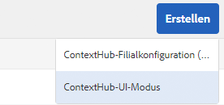
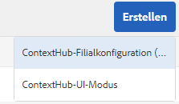

# Konfigurieren von ContextHub {#configuring-contexthub}

ContextHub ist ein Framework zum Speichern, Ändern und Darstellen von Kontextdaten. Ausführlichere Informationen zu ContextHub finden Sie in der [ContextHub-Übersicht für Entwicklungspersonen](contexthub.md).

Sie können die ContextHub-Symbolleiste konfigurieren, um zu steuern, ob sie im Vorschaumodus angezeigt wird, um ContextHub-Stores zu erstellen und UI-Module hinzuzufügen.

## Ein- und Ausblenden der ContextHub-Benutzeroberfläche {#showing-and-hiding-the-contexthub-ui}

Konfigurieren Sie den Adobe Granite ContextHub-OSGi-Service, um die [ContextHub-Benutzeroberfläche](/help/sites-cloud/authoring/personalization/targeted-content.md) auf Ihren Seiten ein- oder auszublenden. Die PID dieses Service lautet `com.adobe.granite.contexthub.impl.ContextHubImpl.`.

Der Service kann entweder mithilfe der [Web-Konsole](/help/implementing/deploying/configuring-osgi.md) oder mit einem JCR-Knoten im Repository konfiguriert werden:

* **Web-Konsole:** Um die Benutzeroberfläche anzuzeigen, wählen Sie die Eigenschaft „Benutzeroberfläche anzeigen“ aus. Um die Benutzeroberfläche auszublenden, heben Sie die Auswahl dieser Eigenschaft aus.
* **JCR-Knoten:** Legen Sie die boolesche Eigenschaft `com.adobe.granite.contexthub.show_ui` auf `true` fest, um die Benutzeroberfläche anzuzeigen. Legen Sie die Eigenschaft auf `false` fest, um die Benutzeroberfläche auszublenden.

Wenn die ContextHub-Benutzeroberfläche angezeigt wird, erscheint sie nur auf den Seiten von AEM-Autoreninstanzen. Auf Seiten von Veröffentlichungsinstanzen wird die Benutzeroberfläche nicht angezeigt.

## Hinzufügen von ContextHub-UI-Modi und -Modulen {#adding-contexthub-ui-modes-and-modules}

Konfigurieren Sie die UI-Modi und -Module, die in der ContextHub-Symbolleiste im Vorschaumodus angezeigt werden:

* UI-Modi: Gruppen verwandter Module
* Module: Widgets, die Kontextdaten aus einem Speicher bereitstellen und Autorinnen und Autoren die Bearbeitung des Kontexts ermöglichen

UI-Modi werden als eine Reihe von Symbolen auf der linken Seite der Symbolleiste angezeigt. Wenn diese Option aktiviert ist, werden die Module eines UI-Modus rechts angezeigt.


Bei Symbolen handelt es sich um Verweise aus der [Coral-Bibliothek mit Benutzeroberflächensymbolen](https://opensource.adobe.com/coral-spectrum/examples/#icon).

### Hinzufügen eines UI-Modus {#adding-a-ui-mode}

Fügen Sie einen UI-Modus hinzu, um verwandte ContextHub-Module zu gruppieren. Wenn Sie den UI-Modus erstellen, geben Sie den Titel und das Symbol an, die in der ContextHub-Symbolleiste angezeigt werden.

1. Wählen Sie in der Experience Manager-Leiste „Tools“ > „Sites“ > „Context Hub“ aus.
1. Wählen Sie den standardmäßigen Konfigurations-Container aus.
1. Wählen Sie die Context-Hub-Konfiguration aus.
1. Wählen Sie die Schaltfläche „Erstellen“ und dann den Context-Hub-UI-Modus.

   

1. Geben Sie Werte für die folgenden Eigenschaften an:

   * UI-Modustitel: Der Titel, mit dem der UI-Modus identifiziert wird.
   * Modussymbol: Die Auswahl für das zu verwendende [Coral-UI-Symbol](https://opensource.adobe.com/coral-spectrum/examples/#icon), z. B. `coral-Icon--user`.
   * Aktiviert: Wählen Sie diese Option aus, um den UI-Modus in der ContextHub-Symbolleiste anzuzeigen.

1. Wählen Sie „Speichern“ aus.

### Hinzufügen eines UI-Moduls {#adding-a-ui-module}

Fügen Sie einem UI-Modus ein ContextHub-UI-Modul hinzu, damit es in der ContextHub-Symbolleiste zur Vorschau von Seiteninhalten angezeigt wird. Wenn Sie ein UI-Modul hinzufügen, erstellen Sie eine Instanz eines Modultyps, der bei ContextHub registriert ist. Um ein UI-Modul hinzufügen zu können, müssen Sie den Namen des zugehörigen Modultyps kennen.

AEM bietet einen grundlegenden UI-Modultyp sowie mehrere Beispiel-UI-Modultypen, auf denen Sie ein UI-Modul aufbauen können. Die folgende Tabelle enthält eine kurze Beschreibung der einzelnen Typen. Informationen zum Entwickeln eines benutzerdefinierten UI-Moduls finden Sie unter [Erstellen von ContextHub-UI-Modulen](extending-contexthub.md#creating-contexthub-ui-module-types).

Die Eigenschaften des UI-Moduls enthalten eine Detailkonfiguration, in der Sie Werte für modulspezifische Eigenschaften angeben können. Die Detailkonfiguration stellen Sie im JSON-Format bereit. Die Spalte „Modultyp“ in der Tabelle enthält Links zu Informationen über den JSON-Code, der für jeden UI-Modultyp erforderlich ist.

| Modultyp | Beschreibung | Store |
|---|---|---|
| [contexthub.base](sample-modules.md#contexthub-base-ui-module-type) | Ein generischer UI-Modultyp | In den Eigenschaften des UI-Modusl konfiguriert |
| [contexthub.browserinfo](sample-modules.md#contexthub-browserinfo-ui-module-type) | Zeigt Informationen zum Browser an | `surferinfo` |
| [contexthub.datetime](sample-modules.md#contexthub-datetime-ui-module-type) | Zeigt Informationen zu Datum und Uhrzeit an | `datetime` |
| [contexthub.location](sample-modules.md#contexthub-location-ui-module-type) | Zeigt den Breiten- und Längengrad des Clients sowie den Standort auf einer Karte an. Sie können den Standort ändern. | `geolocation` |
| [contexthub.screen-orientation](sample-modules.md#contexthub-screen-orientation-ui-module-type) | Zeigt die Bildschirmausrichtung des Geräts (Querformat oder Hochformat) an | `emulators` |
| [contexthub.tagcloud](sample-modules.md#contexthub-tagcloud-ui-module-type) | Zeigt Statistiken zu Seiten-Tags an | `tagcloud` |
| [granite.profile](sample-modules.md#granite-profile-ui-module-type) | Zeigt Informationen zum Profil des aktuellen Benutzers an, einschließlich `authorizableID`, `displayName` und `familyName`. Sie können den Wert von `displayName` und `familyName` ändern. | `profile` |

1. Wählen Sie in der Experience Manager-Leiste „Tools“ > „Sites“ > „ContextHub“ aus.
1. Wählen Sie den Konfigurations-Container, dem Sie ein UI-Modul hinzufügen möchten.
1. Wählen Sie die ContextHub-Konfiguration aus, zu der Sie das UI-Modul hinzufügen möchten, oder geben Sie sie ein.
1. Wählen Sie den UI-Modus, dem Sie das UI-Modul hinzufügen.
1. Wählen Sie die Schaltfläche „Erstellen“ und wählen Sie dann ContextHub-UI-Modul (generisch).

   

1. Geben Sie Werte für die folgenden Eigenschaften an:

   * Titel des UI-Moduls: Ein Titel, der das UI-Modul bezeichnet
   * Modultyp: Der Modultyp
   * Aktiviert: Wählen Sie diese Option, um das UI-Modul in der ContextHub-Symbolleiste anzuzeigen.

1. (Optional) Geben Sie ein JSON-Objekt ein, um das UI-Modul zu konfigurieren und so die Standardkonfiguration für den Store außer Kraft zu setzen.
1. Wählen Sie „Speichern“ aus.

## Erstellen eines ContextHub-Stores {#creating-a-contexthub-store}

Erstellen Sie einen ContextHub-Store, um Benutzerdaten beizubehalten und nach Bedarf auf die Daten zuzugreifen. ContextHub-Stores basieren auf registrierten Store-Kandidaten. Wenn Sie den Store erstellen, benötigen Sie den Wert von „storeType“, mit dem der Store-Kandidat registriert wurde. (Weitere Informationen finden Sie unter [Erstellen benutzerdefinierter Store-Kandidaten](extending-contexthub.md#creating-custom-store-candidates).)

### Store-Detailkonfiguration {#detailed-store-configuration}

Beim Konfigurieren eines Stores können Sie über die Eigenschaft „Detailkonfiguration“ Werte für Store-spezifische Eigenschaften angeben. Der Wert basiert auf dem Parameter `config` der Store-Funktion `init`. Es hängt daher vom Store ab, ob dieser Wert angegeben werden muss und welches Format der Wert haben muss.

Der Wert der Eigenschaft „Detailkonfiguration“ ist ein `config`-Objekt im JSON-Format.

### Beispiele für Store-Kandidaten {#sample-store-candidates}

In AEM werden die folgenden Beispiele für Store-Kandidaten bereitgestellt, die Sie als Basis für einen Store verwenden können.

| Filialtyp | Beschreibung |
|---|---|
| [aem.segmentation](sample-stores.md#aem-segmentation-sample-store-candidate) | Store für gelöste und ungelöste ContextHub-Segmente. Ruft automatisch Segmente aus dem ContextHub SegmentManager zurück |
| [contexthub.geolocation](sample-stores.md#contexthub-geolocation-sample-store-candidate) | Speichert den Breiten- und Längengrad des Browser-Standorts. |
| [granite.emulators](sample-stores.md#granite-emulators-sample-store-candidate) | Definiert Eigenschaften und Funktionen für eine Reihe von Geräten und erkennt das aktuelle Client-Gerät. |
| [granite.profile](sample-stores.md#granite-profile-sample-store-candidate) | Speichert die Profildaten für den aktuellen Benutzer. |
| [contexthub.surferinfo](sample-stores.md#contexthub-surferinfo-sample-store-candidate) | Speichert die Informationen zum Client, z. B. Geräteinformationen, Browser-Typ und Fensterausrichtung. |

1. Wählen Sie in der Experience Manager-Leiste „Tools“ > „Sites“ > „ContextHub“ aus.
1. Wählen Sie den standardmäßigen Konfigurations-Container aus.
1. Auswählen der ContextHub-Konfiguration
1. Um einen Store hinzuzufügen, wählen Sie das Symbol „Erstellen“ und dann „ContextHub-Store-Konfiguration“ aus.

   

1. Geben Sie Werte für die grundlegenden Konfigurationseigenschaften ein und wählen Sie dann „Weiter“ aus:

   * **Konfigurationstitel:** Der Titel, der den Store bezeichnet
   * **Store-Typ:** Der Wert der Eigenschaft „storeType“ des Store-Kandidaten, auf dem der Store basieren soll
   * **Erforderlich:** Wählen Sie diese Option aus.
   * **Aktiviert:** Wählen Sie diese Option aus, um den Store zu aktivieren

1. (Optional) Geben Sie ein JSON-Objekt in das Feld „Detailkonfiguration (JSON)“ ein, um die standardmäßige Store-Konfiguration zu überschreiben.
1. Wählen Sie „Speichern“ aus.

## Beispiel: Verwenden eines JSONP-Service  {#example-using-a-jsonp-service}

In diesem Beispiel wird veranschaulicht, wie Sie einen Store konfigurieren und die Daten in einem UI-Modul anzeigen. In diesem Beispiel wird der MD5-Service der Website „jsontest.com“ als Datenquelle für einen Store verwendet. Der Service gibt den MD5-Hashcode einer bestimmten Zeichenfolge im JSON-Format zurück.

Der Store „contexthub.generic-jsonp“ wird so konfiguriert, dass Daten für den Service-Aufruf `https://md5.jsontest.com/?text=%22text%20to%20md5%22` gespeichert werden. Der Service gibt die folgenden Daten zurück, die in einem UI-Modul angezeigt werden:

```javascript
{
   "md5": "919a56ab62b6d5e1219fe1d95248a2c5",
   "original": "\"text to md5\""
}
```

### Erstellen des Stores „contexthub.generic-jsonp“ {#creating-a-contexthub-generic-jsonp-store}

Mit dem Store-Beispielkandidaten „contexthub.generic-jsonp“ können Sie Daten aus einem JSONP-Service einem Webservice abrufen, der JSON-Daten zurückgibt. Verwenden Sie für diesen Store-Kandidaten die Store-Konfiguration, um Details zu dem JSONP-Service anzugeben, der genutzt werden soll.

Mit der Funktion [init](contexthub-api.md#init-name-config) der JavaScript-Klasse `ContextHub.Store.JSONPStore` wird ein `config`-Objekt definiert, das diesen Store-Kandidaten initialisiert. Das `config`-Objekt enthält ein `service`-Objekt mit Details zum JSONP-Service. Zum Konfigurieren des Stores geben Sie das `service`-Objekt im JSON-Format als Wert für die Eigenschaft „Detailkonfiguration“ an.

Verwenden Sie zum Speichern von Daten aus dem MD5-Service der Website „jsontest.com“ das Verfahren unter [Erstellen eines ContextHub-Store](#creating-a-contexthub-store) mit den folgenden Eigenschaften:

* **Konfigurationstitel:** md5
* **Store-Typ:** contexthub.generic-jsonp
* **Erforderlich:** Wählen Sie diese Option aus.
* **Aktiviert:** Wählen Sie diese Option aus.
* **Detailkonfiguration (JSON):**

  ```javascript
  {
   "service": {
   "jsonp": false,
   "timeout": 1000,
   "ttl": 1800000,
   "secure": false,
   "host": "md5.jsontest.com",
   "port": 80,
   "params":{
   "text":"text to md5"
       }
     }
   }
  ```

### Hinzufügen eines Benutzeroberflächenmoduls für die md5-Daten {#adding-a-ui-module-for-the-md-data}

Fügen Sie der ContextHub-Symbolleiste ein UI-Modul hinzu, um die Daten anzuzeigen, die im md5-Beispiel-Store gespeichert sind. In diesem Beispiel wird das Modul „contexthub.base“ verwendet, um das folgende UI-Modul zu erstellen:


Nutzen Sie das Verfahren unter [Hinzufügen eines UI-Moduls](#adding-a-ui-module), um das UI-Modul einem vorhandenen UI-Modus hinzuzufügen, z. B. dem Beispiel-UI-Modus „Persona“. Verwenden Sie für das UI-Modul die folgenden Eigenschaftswerte:

* **Titel des UI-Moduls:** MD5
* **Modultyp:** contexthub.base
* **Detailkonfiguration (JSON):**

  ```javascript
  {
   "icon": "coral-Icon--data",
   "title": "MD5 Conversion",
   "storeMapping": { "md5": "md5" },
   "template": "<p> {{md5.original}}</p>;
                <p>{{md5.md5}}</p>"
  }
  ```

## Debuggen von ContextHub {#debugging-contexthub}

Ein Debugging-Modus für ContextHub kann aktiviert werden, um die Fehlerbehebung zu ermöglichen. Der Debugging-Modus kann entweder über die ContextHub-Konfiguration oder über CRXDE aktiviert werden.

### Per Konfiguration {#via-the-configuration}

Bearbeiten Sie die Konfiguration von ContextHub und aktivieren Sie die Option **Debuggen**.

1. Wählen Sie in der Leiste **Tools > Sites > ContextHub** aus
1. Wählen Sie den standardmäßigen **Konfigurations-Container**
1. Wählen Sie die **ContextHub-Konfiguration** und wählen Sie **Ausgewähltes Element bearbeiten**
1. Wählen Sie **Debuggen** und dann **Speichern**

### Per CRXDE {#via-crxde}

Verwenden Sie CRXDE Lite, um die Eigenschaft `debug` unter auf **true** festzulegen:

* `/conf/global/settings/cloudsettings` oder
* `/conf/<site>/settings/cloudsettings`

### Protokollieren von Debug-Meldungen für ContextHub {#logging-debug-messages-for-contexthub}

Konfigurieren Sie den Adobe Granite ContextHub-OSGi-Service (PID = `com.adobe.granite.contexthub.impl.ContextHubImpl`) für die Protokollierung detaillierter Debug-Meldungen, die bei der Entwicklung hilfreich sind.

Der Service kann entweder mithilfe der [Web-Konsole](/help/implementing/deploying/configuring-osgi.md) oder mit einem JCR-Knoten im Repository konfiguriert werden:

* Web-Konsole: Wählen Sie zum Protokollieren von Debug-Meldungen die Debug-Eigenschaft aus.
* JCR-Knoten: Legen Sie zum Protokollieren von Debug-Meldungen die boolesche Eigenschaft `com.adobe.granite.contexthub.debug` auf `true` fest.

### Unbeaufsichtigter Modus {#silent-mode}

Im unbeaufsichtigten Modus werden alle Debug-Informationen unterdrückt. Im Gegensatz zur normalen Debug-Option, die für jede ContextHub-Konfiguration einzeln festgelegt werden kann, ist der unbeaufsichtigte Modus eine globale Einstellung, die Vorrang vor allen Debug-Einstellungen auf der Ebene der ContextHub-Konfiguration hat.

Dies ist für Ihre Veröffentlichungsinstanz hilfreich, für die Sie keine Debug-Informationen benötigen. Da es sich um eine globale Einstellung handelt, wird sie per OSGi aktiviert.

1. Öffnen Sie die **Konfiguration der Adobe Experience Manager-Web-Konsole** unter `http://<host>:<port>/system/console/configMgr`.
1. Suchen Sie nach **Adobe Granite ContextHub**.
1. Klicken Sie auf die Konfiguration **Adobe Granite ContextHub**, um die Eigenschaften zu bearbeiten.
1. Aktivieren Sie die Option für den **unbeaufsichtigten Modus** und klicken Sie auf **Speichern**.

## Deaktivieren von ContextHub {#disabling-contexthub}

ContextHub kann deaktiviert werden, um zu verhindern, dass js/css geladen und initialisiert wird. Es gibt zwei Optionen zum Deaktivieren von ContextHub:

* Bearbeiten Sie die Konfiguration von ContextHub und aktivieren Sie die Option **ContextHub deaktivieren**.

   1. Wählen Sie in der Leiste **Tools > Sites > ContextHub** aus.
   1. Wählen Sie den standardmäßigen **Konfigurations-Container**
   1. Wählen Sie die **ContextHub-Konfiguration** und dann **Ausgewähltes Element bearbeiten**
   1. Wählen Sie **ContextHub deaktivieren** und dann **Speichern**

oder

* Verwenden Sie CRXDE Lite, um die Eigenschaft `disabled` unter `/conf/global/settings/cloudsettings/<configName>/contexthub` auf **true** festzulegen.
