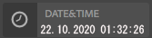
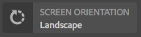
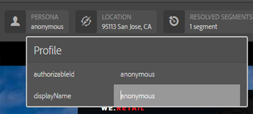

# Mustertypen von ContextHub-UI-Modulen {#sample-contexthub-ui-module-types}

ContextHub bietet mehrere Muster-UI-Module, die Sie in Ihren Lösungen verwenden können. Die folgenden Informationen werden bereitgestellt:

* Die Hauptfunktionen des UI-Moduls.
* Gibt an, wo der Quell-Code zu finden ist, damit Sie ihn zum Lernen öffnen können.
* So wird das UI-Modul konfiguriert.

Informationen zum Hinzufügen von UI-Modulen zu ContextHub finden Sie unter [Hinzufügen eines UI-Moduls](configuring-contexthub.md#adding-a-ui-module). Informationen zum Entwickeln von UI-Modulen finden Sie unter [Erstellen von ContextHub-UI-Modultypen](extending-contexthub.md#creating-contexthub-ui-module-types).

## UI-Modultyp contexthub.base {#contexthub-base-ui-module-type}

Der UI-Modultyp contexthub.base ist der Basistyp für alle anderen UI-Modultypen. Sie bietet daher allgemeine Funktionen zum Rendern von Store-Daten.

Die folgenden Optionen sind verfügbar:

* **Titel und Symbol:** Geben Sie einen Titel für das UI-Modul und ein Symbol an. Auf das Symbol kann über eine URL oder aus der Coral-UI-Symbolbibliothek verwiesen werden.
* **Daten speichern:** Identifizieren Sie einen oder mehrere Stores, aus denen Daten abgerufen werden sollen.
* **Inhalt:** Geben Sie den Inhalt an, der im UI-Modul angezeigt wird, so wie er in der ContextHub-Symbolleiste angezeigt wird.
* **Popover-Inhalt:** Geben Sie den Inhalt an, der in einem Popover angezeigt wird, wenn auf das UI-Modul geklickt oder getippt wird.
* **Vollbildmodus:** Legen Sie fest, ob der Vollbildmodus zulässig ist.

Der Quell-Code befindet sich unter `/libs/granite/contexthub/code/ui/container/js/ContextHub.UI.BaseModuleRenderer.js`.

### Konfiguration {#configuration}

Konfigurieren Sie das UI-Modul „contexthub.base“ mithilfe eines JavaScript-Objekts im JSON-Format. Fügen Sie eine der folgenden Eigenschaften zum Konfigurieren der UI-Modulfunktionen hinzu:

* **image:** eine URL zu einem Bild, das als Symbol angezeigt werden soll.
* **icon:** der Name einer [Coral-Benutzeroberflächensymbolklasse](https://opensource.adobe.com/coral-spectrum/examples/#icon). Wenn Sie einen Wert für das Symbol und die Bildeigenschaften angeben, wird das Bild verwendet.
* **title:** ein Titel für das UI-Modul. Der Titel wird angezeigt, wenn der Mauszeiger auf dem UI-Modulsymbol platziert wird.
* **fullscreen:** ein boolescher Wert, der angibt, ob das UI-Modul den Vollbildmodus unterstützt. Verwenden Sie `true`, um Vollbilder zu unterstützen, und `false`, um den Vollbildmodus zu verhindern.
* **template:** Eine [Handlebars](https://handlebarsjs.com/)-Vorlage, die den Inhalt angibt, der in der ContextHub-Symbolleiste gerendert werden soll. Verwenden Sie höchstens zwei `<p>`-Tags.
* **storeMapping:** Ein Schlüssel-/Store-Diagramm. Verwenden Sie den Schlüssel in den Handlebar-Vorlagen, um auf die zugehörigen ContextHub-Store-Daten zuzugreifen.
* **list:** ein Array von Elementen, die beim Klicken auf das UI-Modul als Liste in einem Popover angezeigt werden. Wenn Sie diesen Artikel einschließen, schließen Sie popoverTemplate nicht ein. Der Wert ist ein Array von Objekten mit den folgenden Schlüsseln:
   * title: Der für dieses Element anzuzeigende Text
   * image: (optional) Eine URL zu einem Bild, das links angezeigt werden soll
   * icon: (optional) Eine CUI-Symbolklasse, die links angezeigt werden soll; wird ignoriert, wenn ein Bild angegeben ist
   * selected: (optional) Ein boolescher Wert, der angibt, ob dieses Element als ausgewählt angezeigt werden soll (true=ausgewählt). Standardmäßig werden ausgewählte Elemente in Fettschrift angezeigt. Verwenden Sie eine `listType`-Eigenschaft, um andere Erscheinungen zu konfigurieren (siehe unten).
* **listType:** Der für Popover-Listenelemente zu verwendende Stil. Verwenden Sie einen der folgenden Werte:
   * checkmark
   * checkbox
   * radio
* **popoverTemplate:** eine Handlebar-Vorlage, die den Inhalt angibt, der im Popover gerendert werden soll, wenn auf das UI-Modul geklickt wird. Wenn Sie dieses Element einschließen, schließen Sie das `list`-Element nicht ein.

### Beispiel {#example}

Im folgenden Beispiel wird ein c`ontexthub.base`-UI-Modul zum Anzeigen von Informationen aus einem [contexthub.emulators](sample-stores.md#granite-emulators-sample-store-candidate)-Store konfiguriert. Das `template`-Element veranschaulicht, wie Daten aus dem Store mithilfe des Schlüssels abgerufen werden, den das `storeMapping`-Element erstellt.

```javascript
{
   "icon": "coral-Icon--move",
    "title": "Screen Resolution",
    "storeMapping": {
      "emulator": "emulators"
    },
    "template": "<p>{{{ i18n \"Resolution\"}}}</p><p>{{{emulator.currentDevice.width}}} x {{{emulator.currentDevice.height}}}</p>"
}
```


## UI-Modultyp contexthub.browserinfo {#contexthub-browserinfo-ui-module-type}

Das UI-Modul `contexthub.browserinfo` zeigt Informationen über den Client-Webbrowser und das Betriebssystem an. Informationen werden vom Store „surferinfo“ bezogen, der auf dem Store-Kandidaten [contexthub.surferinfo](sample-stores.md#contexthub-surferinfo-sample-store-candidate) basiert.


Der Quell-Code für das UI-Modul befindet sich unter `/libs/granite/contexthub/components/modules/browserinfo`. Obwohl `contexthub.browserinfo` das UI-Modul `contexthub.base` erweitert, werden keine zusätzlichen Funktionen überschrieben oder bereitgestellt. Die Implementierung stellt eine Standardkonfiguration zum Rendern von Browser-Informationen bereit.

### Konfiguration {#configuration-1}

Instanzen des UI-Moduls contexthub.browserinfo benötigen keinen Wert für die Detailkonfiguration. Der folgende JSON-Text repräsentiert die Standardkonfiguration des Moduls.

```javascript
{
   "icon":"coral-Icon--globe",
   "title":"Browser/OS Information",
   "storeMapping":{"surferinfo":"surferinfo"},
   "template":"<p>{{surferinfo.browser.family}} {{surferinfo.browser.version}}</p><p>{{surferinfo.os.name}} {{surferinfo.os.version}}</p>"
}
```

## UI-Modultyp contexthub.datetime {#contexthub-datetime-ui-module-type}

Das UI-Modul `contexthub.datetime` zeigt das Datum und die Uhrzeit an, die in einem Store mit dem Namen „datetime“ gespeichert sind, der auf dem Store-Kandidaten `contexthub.datetime` basiert.



Das Modul enthält ein Popover-Formular, mit dem Sie Datum und Uhrzeit im Store ändern können.

Die Quelle des UI-Moduls `contexthub.datetime` befindet sich unter `/libs/granite/contexthub/components/modules/datetime`.

### Konfiguration {#configuration-2}

Instanzen des UI-Moduls contexthub.datetime benötigen keinen Wert für die Detailkonfiguration. Der folgende JSON-Text repräsentiert die Standardkonfiguration des Moduls.

```javascript
{
   "icon":"coral-Icon--clock",
   "title":"DATE&TIME",
   "clickable":true,
   "storeMapping":{"d":"datetime"},
   "template":"<p class=\"contexthub-module-line1\">{{i18n \"Date&Time\"}}</p><p class=\"contexthub-module-line2\">{{d.formatted.locale.date}} {{d.formatted.locale.time}}</p>",
   "popoverTemplate":"<div class=\"datetime center\"><div class=\"coral-DatePicker-calendar\" data-init=\"datepicker\"><input class=\"coral-Textfield\" type=\"datetime\" value=\"{{d.formatted.iso}}\"><button class=\"coral-Button coral-Button--secondary coral-Button--square\" title=\"{{i18n \"Datetime picker\"}}\"><i class=\"coral-Icon coral-Icon--calendar coral-Icon--sizeS\"></i></button></div></div>"
}
```

## Benutzeroberflächenmodultyp contexthub.location {#contexthub-location-ui-module-type}

Das UI-Modul `contexthub.location` zeigt den Längen- und Breitengrad des Clients an. Das Modul bietet ein Popover mit einer Google-Karte, auf die Sie klicken können, um den aktuellen Standort zu ändern. Das Modul erhält Informationen von einem ContextHub-Store namens Geolocation, der auf dem Store-Kandidaten [contexthub.geolocation](sample-stores.md#contexthub-geolocation-sample-store-candidate) basiert.


Die Quelle des UI-Moduls befindet sich unter `/etc/cloudsettings/default/contexthub/geolocation`.

### Konfiguration {#configuration-4}

Instanzen des UI-Moduls contexthub.location erfordern keinen Wert für die Detailkonfiguration. Der folgende JSON-Text repräsentiert die Standardkonfiguration des Moduls.

```javascript
{
 "icon":"coral-Icon--compass",
 "title":"Location",
 "clickable":true,
 "editable":{"key":"/geolocation","disabled":[],"hidden":["/geolocation/generatedThumbnail","/geolocation/city","/geolocation/country"]},
 "fullscreen":true,
 "storeMapping":{"g":"geolocation"},
 "template":"<p>{{i18n \"Location\"}}</p><p>{{g.address.postalCode}} {{g.address.city}}{{#if g.address.city}}{{#if g.address.region}},{{/if}}{{/if}} {{g.address.region}}</p>",
 "list":[
  {"title":"Basel, Switzerland",
  "data":{"longitude":7.58929,"latitude":47.554746,"city":"Basel","country":"Switzerland"}},
  {"title":"Melbourne, Australia",
  "data":{"longitude":144.96328,"latitude":-37.814107,"city":"Melbourne","country":"Australia"}},
  {"title":"Beijing, China",
  "data":{"longitude":116.407526,"latitude":39.90403,"city":"Beijing","country":"China"}},
  {"title":"New York, NY, USA",
  "data":{"longitude":-74.005973,"latitude":40.714353,"city":"New York","country":"United States"}},
  {"title":"Paris, France",
  "data":{"longitude":2.352222,"latitude":48.856614,"city":"Paris","country":"France"}},
  {"title":"Rio de Janeiro, Brazil",
  "data":{"longitude":-43.20071,"latitude":-22.913395,"city":"Rio","country":"Brazil"}},
  {"title":"San Jose, CA, USA",
  "data":{"longitude":-121.894955,"latitude":37.339386,"city":"San Jose","country":"United States"}},
  {"title":"Tokyo, Japan",
  "data":{"longitude":139.691706,"latitude":35.689487,"city":"Shinjuku","country":"Japan"}}
 ],
 "listType":"checkmark"
}
```

## UI-Modultyp contexthub.screen-orientation {#contexthub-screen-orientation-ui-module-type}

Das UI-Modul `contexthub.screen-orientation` zeigt die aktuelle Bildschirmausrichtung des Clients an. Obwohl standardmäßig deaktiviert, bietet das Modul ein Popover, mit dem Sie eine Ausrichtung auswählen können. Das Modul erhält Informationen von einem ContextHub-Store namens „emulators“, der auf dem Store-Kandidaten [granite.emulators](sample-stores.md#granite-emulators-sample-store-candidate) basiert.



Die Quelle des UI-Moduls befindet sich unter `/libs/granite/contexthub/components/modules/screen-orientation`.

### Konfiguration {#configuration-5}

Instanzen des UI-Moduls `contexthub.screen-orientation` benötigen keinen Wert für die Detailkonfiguration. Der folgende JSON-Text repräsentiert die Standardkonfiguration des Moduls. Die `clickable`-Eigenschaft ist standardmäßig `false`. Wenn Sie die Standardkonfiguration überschreiben, um `clickable` auf `true` zu setzen, wird beim Klicken auf das Modul ein Popup angezeigt, in dem Sie die Ausrichtung auswählen können.

```javascript
{
   "icon":"coral-Icon--rotateRight",
   "title":"Screen Orientation",
   "clickable":false,
   "storeMapping":{"emulator":"emulators"},
   "template":"<p>{{{ i18n \"Screen Orientation\" }}}</p><p>{{{ emulator.currentDevice.orientation }}}",
   "listReference":"/emulators/orientations",
   "listType":"checkmark"
}
```

## Benutzeroberflächenmodultyp contexthub.tagcloud {#contexthub-tagcloud-ui-module-type}

Das UI-Modul `contexthub.tagcloud` zeigt Informationen zu Tags an. Auf der Symbolleiste zeigt das UI-Modul die Anzahl der Tags an. Das Popup zeigt eine Tagcloud und ein Textfeld zum Hinzufügen neuer Tags an. Das UI-Modul ruft Informationen aus einem ContextHub-Store namens „tagcloud“ ab, der auf dem Store-Kandidaten `contexthub.tagcloud` basiert.


Die Quelle des UI-Moduls befindet sich unter `/libs/granite/contexthub/components/modules/tagcloud`.

### Konfiguration {#configuration-6}

Instanzen des UI-Moduls `contexthub.tagcloud` benötigen keinen Wert für die Detailkonfiguration. Der folgende JSON-Text repräsentiert die Standardkonfiguration des Moduls.

```javascript
{
   "icon":"coral-Icon--tag",
   "title":"TagCloud",
   "clickable":true,
   "storeMapping":{"t":"tagcloud"},
   "maxTags":20,
   "template":"<p class=\"contexthub-module-line1\">{{i18n \"TagCloud\"}}</p><p class=\"contexthub-module-line2\">{{stats.total}} {{i18n \"Tags\"}}</p>",
   "popoverTemplate":"<div class=\"contexthub-popover-content center\"><p class=\"stats\">{{stats.total}} {{i18n \"Tags\"}} | {{stats.hits}} {{i18n \"Hits\"}} | {{i18n \"Last tag\"}}: {{#if stats.recent}}{{stats.recent}}{{else}}{{i18n \"Unknown\"}}{{/if}}</p><p class=\"tagcloud\">{{#each tags}}<span class=\"tag{{this.weight}}\">{{this.name}}</span> {{/each}}</p><div class=\"coral-InputGroup\"><input type=\"text\" class=\"coral-InputGroup-input coral-Textfield tag-name\" placeholder=\"{{i18n \"Add a namespace:my/tag\"}}\" pattern=\"^[A-Za-z0-9_\\-]+(:[A-Za-z0-9_\\-\\/]+)?$\" title=\"{{i18n \"namespace:my/tag\"}}\"><span class=\"coral-InputGroup-button\"><button class=\"coral-Button coral-Button--secondary coral-Button--square contexthub-new-tag\" type=\"button\" title=\"{{i18n \"increment\"}}\"><i class=\"coral-Icon coral-Icon--sizeS coral-Icon--add\"></i></button></span></div></div>"
}
```

## UI-Modultyp granite.profile {#granite-profile-ui-module-type}

Das ContextHub-UI-Modul `granite.profile` zeigt den Anzeigenamen der aktuellen Person an. Das Popup-Fenster zeigt den Anmeldenamen der Person an und ermöglicht es Ihnen, den Wert des Anzeigenamens zu ändern. Das UI-Modul erhält Informationen von einem ContextHub-Store namens Profile, der auf dem Store-Kandidaten [granite.profile](sample-stores.md#granite-profile-sample-store-candidate) basiert.



Die Quelle des UI-Moduls befindet sich unter `/libs/granite/contexthub/components/modules/profile`.

### Konfiguration {#configuration-7}

Instanzen des UI-Moduls `granite.profile` benötigen keinen Wert für die Detailkonfiguration. Der folgende JSON-Text repräsentiert die Standardkonfiguration des Moduls.

```javascript
{
   "icon":"coral-Icon--user",
   "title":"Profile",
   "clickable":true,
   "editable":{
      "key":"/profile",
      "disabled":["/profile/authorizableId"],
      "hidden":["/profile/avatar","/profile/path"]},
   "storeMapping":{"p":"profile"},
   "template":"<p class=\"contexthub-module-line1\">{{i18n \"Persona\"}}</p><p class=\"contexthub-module-line2\">{{p.displayName}}</p>",
   "listType":"checkmark"
}
```
