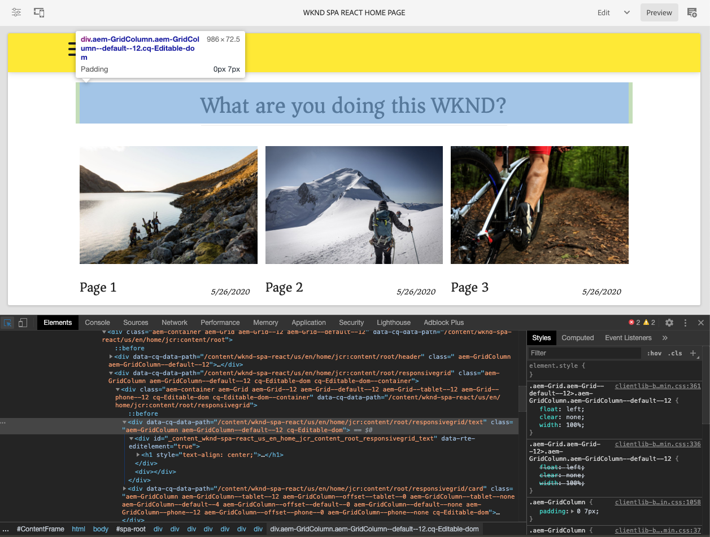

# Einführung und exemplarische Vorgehensweisen zu SPA {#spa-introduction}

Single Page Applications (SPAs) können ansprechende Erlebnisse für Website-Benutzer bieten. Entwickler möchten Sites mit SPA-Frameworks erstellen und Autoren möchten Inhalte in AEM nahtlos für eine Site bearbeiten, die mit diesen Frameworks erstellt wurde.

Der SPA-Editor bietet eine umfassende Lösung zur Unterstützung von SPAs in AEM. Dieser Artikel erläutert die Verwendung einer einfachen SPA-Anwendung zum Authoring und zeigt, wie sie mit dem zugrunde liegenden AEM SPA-Editor in Beziehung steht.

## Einführung {#introduction}

### Artikel Ziel {#article-objective}

In diesem Artikel werden die grundlegenden Konzepte von SPAs vorgestellt, bevor der Leser durch eine exemplarische Anleitung des SPA-Editors geführt wird, indem eine einfache SPA-Anwendung verwendet wird, um die grundlegende Bearbeitung von Inhalten zu demonstrieren. Dann taucht er in die Konstruktion der Seite ein und zeigt, wie die SPA-Anwendung mit dem AEM SPA Editor in Beziehung steht und mit ihm interagiert.

Ziel dieser Einführung und exemplarischen Vorgehensweise ist es, einem AEM Entwickler zu zeigen, warum SPAs relevant sind, wie sie im Allgemeinen funktionieren, wie ein SPA vom AEM SPA Editor behandelt wird und wie es sich von einer AEM unterscheidet.

Die exemplarische Vorgehensweise basiert auf AEM Standardfunktionalität und der WKND SPA Project-App. Um weiter zu gehen, [laden Sie bitte die WKND SPA Project App von GitHub hier herunter und installieren Sie sie.](https://github.com/adobe/aem-guides-wknd-spa)

>[!CAUTION]
>
>Dieses Dokument verwendet die [WKND SPA Project-App](https://github.com/adobe/aem-guides-wknd-spa) nur zu Demonstrationszwecken. Es sollte nicht für Projektarbeiten verwendet werden.

>[!TIP]
>
>Jedes AEM Projekt sollte den [AEM Project Archetype](https://docs.adobe.com/content/help/en/experience-manager-core-components/using/developing/archetype/overview.html)nutzen, der SPA-Projekte mit React oder Angular unterstützt und das SPA-SDK nutzt.

### Was ist ein BSG? {#what-is-a-spa}

Eine einseitige Anwendung (SPA) unterscheidet sich von einer herkömmlichen Seite insofern, als sie clientseitig wiedergegeben wird und primär Javascript-gesteuert ist. Dabei wird auf Ajax-Aufrufen zurückgegriffen, um Daten zu laden und die Seite dynamisch zu aktualisieren. Die meisten oder alle Inhalte werden einmal in einer einzelnen Seite geladen, wobei je nach Benutzerinteraktion mit der Seite zusätzliche Ressourcen asynchron geladen werden.

Auf diese Weise wird die Seitenaktualisierung reduziert und dem Benutzer ein Erlebnis präsentiert, das nahtlos, schnell und mehr wie eine native App funktioniert.

Der AEM SPA Editor ermöglicht es Frontend-Entwicklern, SPAs zu erstellen, die in eine AEM Site integriert werden können, sodass die Autoren den SPA-Inhalt genauso einfach bearbeiten können wie alle anderen AEM.

### Warum ein BSG? {#why-a-spa}

Durch die Beschleunigung, Verkapselung und mehr wie eine native Anwendung wird eine SPA nicht nur für den Besucher der Webseite, sondern auch für Marketingfachleute und Entwickler aufgrund der Art und Weise, wie SPAs funktionieren, zu einem sehr attraktiven Erlebnis.


#### Besucher {#visitors}

* Besucher möchten native Erlebnisse, wenn sie mit Inhalten interagieren.
* Es gibt klare Daten, dass eine Konversion umso wahrscheinlicher ist, je schneller eine Seite ist.

#### Marketingexperten {#marketers}

* Marketingexperten möchten umfangreiche, native Erlebnisse zum Angebot bringen, um Besucher dazu anzuregen, sich voll mit Inhalten zu beschäftigen.
* Durch die Personalisierung werden diese Erlebnisse noch ansprechender.

#### Entwickler {#developers}

* Entwickler wollen eine saubere Trennung zwischen Inhalt und Präsentation.
* Eine saubere Trennung macht das System erweiterbarer und ermöglicht eine unabhängige Front-End-Entwicklung.

### Wie wirkt ein BSG? {#how-does-a-spa-work}

Die Grundidee hinter einer SPA besteht darin, dass Aufrufe zu einem Server und die Abhängigkeit davon verringert werden, um Verzögerungen zu minimieren, die durch Serverlatenz verursacht werden, sodass die SPA der Reaktionsgeschwindigkeit einer nativen Anwendung nahekommt.

Auf einer herkömmlichen, sequenziellen Webseite werden nur die für die sofortige Seite benötigten Daten geladen. Das bedeutet, dass beim Wechsel des Besuchers zu einer anderen Seite der Server für die zusätzlichen Ressourcen aufgerufen wird. Zusätzliche Aufrufe können erforderlich sein, wenn der Besucher mit Elementen auf der Seite interagiert. Diese Mehrfachaufrufe können zu Verzögerungen oder Verzögerungen führen, da die Seite die Anforderungen des Besuchers einhalten muss.


Für eine reibungslosere Benutzererfahrung, die sich den Erwartungen eines Besuchers an mobile native Apps annähert, lädt eine SPA beim ersten Laden alle erforderlichen Daten für den Besucher. Dies kann zunächst etwas länger dauern, erfordert dann jedoch keine zusätzlichen Server-Aufrufe mehr.

Durch die clientseitige Wiedergabe reagieren Seitenelemente schneller, und die Interaktionen mit der Seite durch den Besucher werden sofort ausgeführt. Alle weiteren erforderlichen Daten werden asynchron aufgerufen, um die Seitengeschwindigkeit zu maximieren.

>[!TIP]
>
>Technische Einzelheiten zur Funktionsweise von BSA in AEM finden Sie in den Artikeln:
>* [Erste Schritte mit SPAs in AEM mithilfe von React](getting-started-react.md)
>* [Erste Schritte mit SPAs in AEM Verwenden von Angular](getting-started-angular.md)

>
>
Weitere Informationen zu Design, Architektur und dem technischen Arbeitsablauf des SPA Editor finden Sie im folgenden Artikel:
>* [SPA-Editor – Überblick](editor-overview.md).


## Content Editing Experience with SPA {#content-editing-experience-with-spa}

Wenn eine SPA erstellt wurde, um den AEM SPA-Editor zu nutzen, merkt der Inhaltsersteller keine Unterschiede beim Bearbeiten und Erstellen von Inhalten. Es stehen gängige AEM zur Verfügung, sodass keine Änderungen am Arbeitsablauf des Autors erforderlich sind.

1. Bearbeiten Sie die WKND SPA Project-App in AEM.

   `http://localhost:4502/editor.html/content/wknd-spa-react/us/en/home.html`

   

1. Wählen Sie eine Textkomponente aus und beachten Sie, dass eine Symbolleiste wie bei jeder anderen Komponente angezeigt wird. Wählen Sie **Bearbeiten** aus.

   

1. Bearbeiten Sie den Inhalt innerhalb von AEM normal und beachten Sie, dass die Änderungen beibehalten werden.

   

1. Verwenden Sie den Assets-Browser, um ein neues Bild per Drag &amp; Drop in eine Bildkomponente zu ziehen.

   

1. Die Änderung wird beibehalten.

   

Weitere Authoring-Werkzeuge wie das Ziehen und Ablegen zusätzlicher Komponenten auf der Seite, das Neuanordnen von Komponenten und das Ändern des Layouts werden wie in jeder anderen Nicht-SPA-AEM-Anwendung unterstützt.

>[!NOTE]
>
>Der SPA-Editor ändert das DOM der Anwendung nicht. Die SPA selbst ist für das DOM verantwortlich.
>
>Um zu sehen, wie dies funktioniert, fahren Sie mit dem nächsten Abschnitt dieses Artikels [SPA-Apps und dem AEM SPA-Editor](#spa-apps-and-the-aem-spa-editor)fort.

## SPA-Apps und der AEM SPA-Editor {#spa-apps-and-the-aem-spa-editor}

Die Erfahrung, wie sich eine SPA für den Endbenutzer verhält und anschließend die SPA-Seite überprüft, hilft, besser zu verstehen, wie eine SAP-App mit dem SPA-Editor in AEM funktioniert.

### Verwenden einer SPA-Anwendung {#using-an-spa-application}

1. Laden Sie die WKND SPA Project-Anwendung entweder auf dem Veröffentlichungsserver oder unter Verwendung der Option **Ansicht wie veröffentlicht** im Menü &quot; **Seiteninformationen** &quot;des Seiteneditors.

   `http://<host>:<port>/content/wknd-spa-react/us/en/home.html`

   

   Notieren Sie die Seitenstruktur, einschließlich Navigation zu untergeordneten Seiten, Menü und Artikelkarten.

1. Navigieren Sie mithilfe des Menüs zu einer untergeordneten Seite und sehen Sie, dass die Seite sofort geladen wird, ohne dass eine Aktualisierung erforderlich ist.

   

1. Öffnen Sie die integrierten Entwicklerwerkzeuge Ihres Browsers und überwachen Sie die Aktivität des Netzwerks, während Sie durch die untergeordneten Seiten navigieren.

   

   Während Sie von Seite zu Seite in der App wechseln, ist der Traffic sehr gering. Die Seite wird nicht neu geladen und nur die neuen Bilder werden angefordert.

   Die SPA verwaltet den Inhalt und das Routing vollständig clientseitig.

Wenn die Seite beim Navigieren durch die untergeordneten Seiten nicht neu geladen wird, wie wird sie dann geladen?

Der nächste Abschnitt, [Laden einer SPA-Anwendung](#loading-a-spa-application), geht näher auf die Mechanismen des Ladens der SPA ein und beschreibt, wie Inhalte synchron und asynchron geladen werden können.

### Laden einer SPA-Anwendung {#loading-an-spa-application}

1. Laden Sie, falls noch nicht geladen, die Anwendung &quot;We.Retail Protokoll&quot;entweder auf dem Veröffentlichungsserver oder unter Verwendung der Option &quot; **Ansicht wie veröffentlicht** &quot;im Menü &quot; **Seiteninformationen** &quot;des Seiteneditors.

   `http://<host>:<port>/content/wknd-spa-react/us/en/home.html`

   

1. Verwenden Sie das integrierte Tool Ihres Browsers, um die Seitenquelle Ansicht.
1. Beachten Sie, dass der Inhalt der Quelle begrenzt ist.

   ```html
    <!DOCTYPE html>
    <html lang="en">
    <head>
        <meta charset="UTF-8"/>
        <title>WKND SPA React Home Page</title>
   
        <meta name="template" content="spa-page-template"/>
        <meta name="viewport" content="width=device-width, initial-scale=1"/>
   
    <link rel="stylesheet" href="/etc.clientlibs/wknd-spa-react/clientlibs/clientlib-base.min.css" type="text/css">
   
    <meta name="theme-color" content="#000000"/>
    <link rel="icon" href="/etc.clientlibs/wknd-spa-react/clientlibs/clientlib-react/resources/favicon.ico"/>
    <link rel="apple-touch-icon" href="/etc.clientlibs/wknd-spa-react/clientlibs/clientlib-react/resources/logo192.png"/>
    <link rel="manifest" href="/etc.clientlibs/wknd-spa-react/clientlibs/clientlib-react/resources/manifest.json"/>
   
    <!-- AEM page model -->
    <meta property="cq:pagemodel_root_url" content="/content/wknd-spa-react/us/en.model.json"/>
    <link href="//fonts.googleapis.com/css?family=Source+Sans+Pro:400,600|Asar&display=swap" rel="stylesheet"/>
    <meta property="cq:datatype" content="JSON"/>
    <meta property="cq:wcmmode" content="edit"/>
   
    <link rel="stylesheet" href="/libs/cq/gui/components/authoring/editors/clientlibs/internal/page.min.css" type="text/css">
    <link rel="stylesheet" href="/etc.clientlibs/wcm/foundation/clientlibs/main.min.css" type="text/css">
    <script type="text/javascript" src="/libs/cq/gui/components/authoring/editors/clientlibs/internal/messaging.min.js"></script>
    <script type="text/javascript" src="/libs/cq/gui/components/authoring/editors/clientlibs/utils.min.js"></script>
    <script type="text/javascript" src="/libs/granite/author/deviceemulator/clientlibs.min.js"></script>
    <script type="text/javascript" src="/libs/cq/gui/components/authoring/editors/clientlibs/internal/page.min.js"></script>
    <script type="text/javascript" src="/etc.clientlibs/wcm/foundation/clientlibs/main.min.js"></script>
    <script type="text/javascript" src="/etc.clientlibs/clientlibs/granite/jquery.min.js"></script>
    <script type="text/javascript" src="/etc.clientlibs/clientlibs/granite/utils.min.js"></script>
    <script type="text/javascript" src="/etc.clientlibs/clientlibs/granite/jquery/granite.min.js"></script>
    <script type="text/javascript" src="/etc.clientlibs/foundation/clientlibs/jquery.min.js"></script>
    <script type="text/javascript" src="/etc.clientlibs/foundation/clientlibs/shared.min.js"></script>
   
    <!--cq{"decorated":false,"type":"cq/cloudconfig/components/scripttags/header","path":"/content/wknd-spa-react/us/en/home/jcr:content/cloudconfig-header","structurePath":"/content/wknd-spa-react/us/en/home/jcr:content/cloudconfig-header","selectors":null,"servlet":"Script /libs/cq/cloudconfig/components/scripttags/header/header.html","totalTime":2,"selfTime":2}-->
   
    <link rel="stylesheet" href="/etc.clientlibs/wknd-spa-react/clientlibs/clientlib-react.min.css" type="text/css">
   
    </head>
   
    <body class="page basicpage">
        <noscript>You need to enable JavaScript to run this app.</noscript>
    <div id="spa-root"></div>
   
    <script type="text/javascript" src="/etc.clientlibs/wknd-spa-react/clientlibs/clientlib-react.min.js"></script>
   
    <script type="text/javascript" src="/etc.clientlibs/core/wcm/components/commons/site/clientlibs/container.min.js"></script>
    <script type="text/javascript" src="/etc.clientlibs/wknd-spa-react/clientlibs/clientlib-base.min.js"></script>
   
    <script type="text/javascript" src="/libs/cq/gui/components/authoring/editors/clientlibs/internal/pagemodel/messaging.min.js"></script>
   
    <link rel="stylesheet" href="/etc.clientlibs/wknd-spa-react/clientlibs/clientlib-author.min.css" type="text/css">
   
    <!--cq{"decorated":true,"type":"cq/cloudserviceconfigs/components/servicecomponents","path":"/content/wknd-spa-react/us/en/home/jcr:content/cloudservices","selectors":null,"servlet":"Script /libs/cq/cloudserviceconfigs/components/servicecomponents/servicecomponents.jsp","totalTime":2,"selfTime":2}-->
   
    <!--cq{"decorated":false,"type":"cq/cloudconfig/components/scripttags/footer","path":"/content/wknd-spa-react/us/en/home/jcr:content/cloudconfig-footer","structurePath":"/content/wknd-spa-react/us/en/home/jcr:content/cloudconfig-footer","selectors":null,"servlet":"Script /libs/cq/cloudconfig/components/scripttags/footer/footer.html","totalTime":2,"selfTime":2}-->
   
    </body>
    </html>
    <!--cq{"decorated":false,"type":"wknd-spa-react/components/page","path":"/content/wknd-spa-react/us/en/home/jcr:content","selectors":null,"servlet":"Script /apps/spa-project-core/components/page/page.html","totalTime":39,"selfTime":33}-->
   ```

   Die Seite enthält keinen Inhalt im Hauptteil. Es besteht hauptsächlich aus Stylesheets und einem Aufruf an verschiedene Skripten wie `clientlib-react.min.js`.

   Diese Skripte sind die Haupttreiber dieser Anwendung und sind für die Wiedergabe des gesamten Inhalts verantwortlich.

1. Verwenden Sie die integrierten Tools Ihres Browsers, um die Seite zu überprüfen. Sehen Sie sich den Inhalt des DOM vollständig geladen an.

   

1. Wechseln Sie im Inspektor zur Registerkarte &quot;Netzwerk&quot;und laden Sie die Seite erneut.

   Beachten Sie, dass Bildanforderungen ignoriert werden, dass die primären Ressourcen, die für die Seite geladen werden, die Seite selbst, CSS, das JavaScript &quot;React&quot;, seine Abhängigkeiten sowie JSON-Daten für die Seite sind.

   

1. Laden Sie die Datei `home.model.json` in eine neue Registerkarte.

   `http://<host>:<port>/content/wknd-spa-react/us/en/home.model.json`

   

   Der AEM SPA Editor nutzt [AEM Content Services](/help/assets/content-fragments/content-fragments.md) , um den gesamten Inhalt der Seite als JSON-Modell bereitzustellen.

   Durch die Implementierung spezifischer Schnittstellen stellen Sling-Modelle die für die SPA erforderlichen Informationen bereit. Der Versand der JSON-Daten wird nach unten auf jede Komponente (von Seite zu Absatz, zu Komponente usw.) übertragen.

   Jede Komponente wählt aus, was sie anzeigt und wie sie gerendert wird (serverseitig mit HTL oder clientseitig mit React oder Angular). Dieser Artikel konzentriert sich auf das clientseitige Rendering mit React.

1. Das Modell kann auch Seiten gruppieren, sodass sie synchron geladen werden, wodurch sich die Anzahl der erforderlichen Seitenneuladungen verringert.

   Im Beispiel des We.Retail-Protokolls werden die `home`-, `page-1`- `page-2`und `page-3` -Seiten synchron geladen, da Besucher in der Regel alle diese Seiten besuchen.

   Dieses Verhalten ist nicht obligatorisch und kann vollständig definiert werden.

   

1. Um diesen Verhaltensunterschied Ansicht, laden Sie die `home` Seite neu und löschen Sie die Netzwerk-Aktivität des Inspektors. Navigieren Sie `page-1` im Seitenmenü zu und sehen Sie, dass die einzige Netzwerk-Aktivität eine Anforderung für das Image von ist `page-1`. `page-1` selbst muss nicht geladen werden.

   

### Interaktion mit dem SPA-Editor {#interaction-with-the-spa-editor}

Mithilfe der WKND SPA Project-Beispielanwendung ist klar, wie sich die App verhält und beim Veröffentlichen geladen wird. Dazu werden Inhaltsdienste für JSON Content Versand sowie das asynchrone Laden von Ressourcen genutzt.

Darüber hinaus ist die Inhaltserstellung mit einem SPA-Editor für den Inhaltsautor nahtlos in AEM.

Im folgenden Abschnitt werden wir den Vertrag untersuchen, der es dem SPA Editor erlaubt, Komponenten innerhalb der SPA miteinander zu verbinden, um Komponenten zu AEM und diese nahtlose Bearbeitung zu erzielen.

1. Laden Sie die WKND SPA Project-Anwendung im Editor und wechseln Sie in den **Vorschau** -Modus.

   `http://<host>:<port>/editor.html/content/wknd-spa-react/us/en/home.html`

1. Überprüfen Sie mithilfe der integrierten Entwicklerwerkzeuge Ihres Browsers den Inhalt der Seite. Wählen Sie mit dem Auswahlwerkzeug eine bearbeitbare Komponente auf der Seite aus und Ansicht der Elementdetails.

   Beachten Sie, dass die Komponente über ein neues Datenattribut verfügt `data-cq-data-path`.

   

   Beispiel

   `data-cq-data-path="/content/wknd-spa-react/us/en/home/jcr:content/root/responsivegrid/text`

   Dieser Pfad ermöglicht das Abrufen und Verknüpfen des Konfigurationsobjekts des Bearbeitungskontexts jeder Komponente.

   Dies ist das einzige Markup-Attribut, das erforderlich ist, damit der Editor dies als bearbeitbare Komponente innerhalb der SPA erkennt. Auf der Grundlage dieses Attributs bestimmt der SPA-Editor, welche editierbare Konfiguration mit der Komponente verknüpft ist, sodass der richtige Rahmen, die richtige Symbolleiste usw. geladen wurde.

   Einige spezifische Klassennamen werden auch für die Kennzeichnung von Platzhaltern und für die Drag &amp; Drop-Funktion von Assets hinzugefügt.

   >[!NOTE]
   >
   >Dieses Verhalten unterscheidet sich von serverseitigen wiedergegebenen Seiten in AEM, wo für jede bearbeitbare Komponente ein `cq` Element eingefügt wird.
   >
   >Durch diesen Ansatz im SPA-Editor müssen benutzerdefinierte Elemente nicht mehr injiziert werden, da nur ein zusätzliches Datenattribut erforderlich ist. Dadurch wird das Markup für den Frontend-Entwickler einfacher.

## Nächste Schritte {#next-steps}

Jetzt, da Sie die SPA-Bearbeitungserfahrung in AEM verstehen und wie ein SPA mit dem SPA-Editor verknüpft ist, sollten Sie einen tieferen Einblick in die Erstellung eines SPA-Editors gewinnen.

* [Erste Schritte mit SPAs in AEM mithilfe von React](getting-started-react.md) zeigen, wie ein grundlegendes SPA für die Arbeit mit dem SPA-Editor in AEM mithilfe von React erstellt wurde
* [Erste Schritte mit SPAs in AEM Verwendung von Angular](getting-started-angular.md) zeigen, wie ein grundlegendes SPA für die Verwendung des SPA-Editors AEM Angular aufgebaut wurde
* [Der SPA Editor-Überblick](editor-overview.md) vertieft das Kommunikationsmodell zwischen AEM und SPA.
* [Die Entwicklung von SPAs für AEM](developing.md) beschreibt, wie Front-End-Entwickler dazu gebracht werden können, eine SPA für AEM zu entwickeln, und wie SPAs mit AEM Architektur interagieren.
