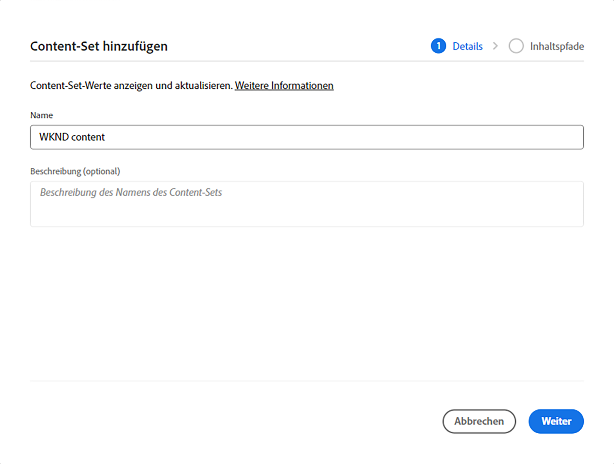
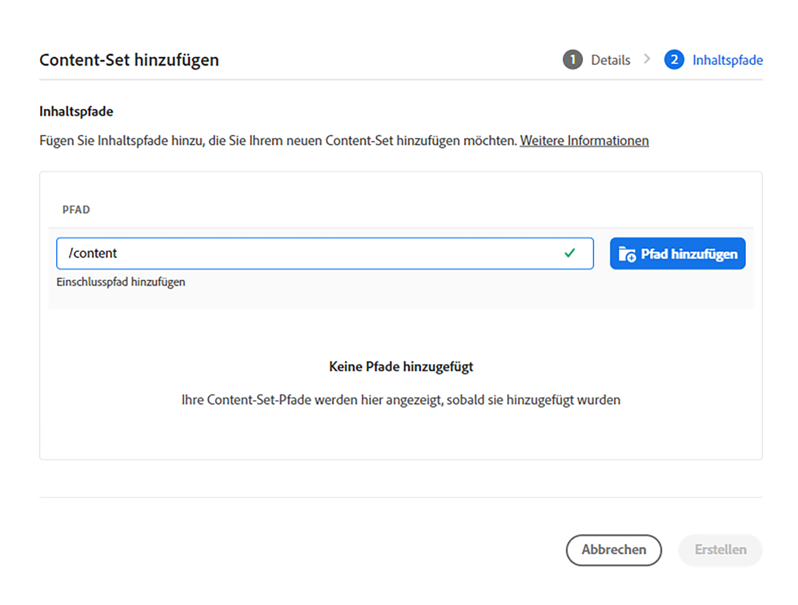
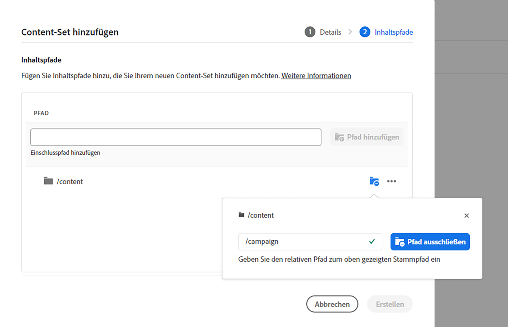
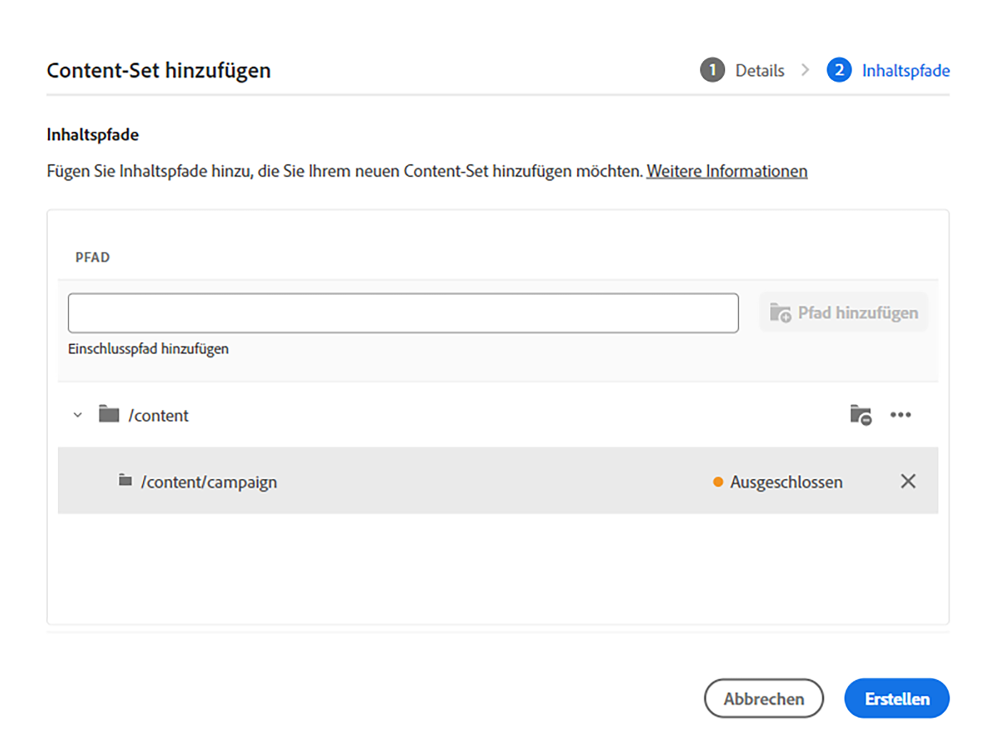
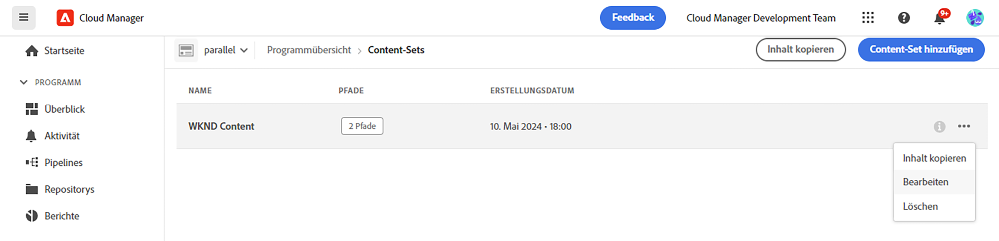
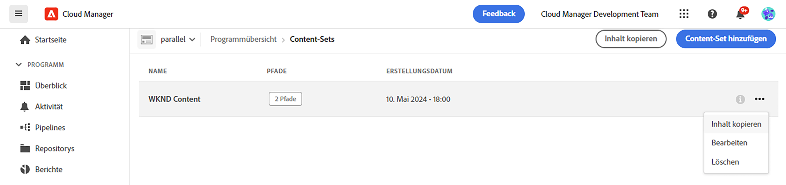
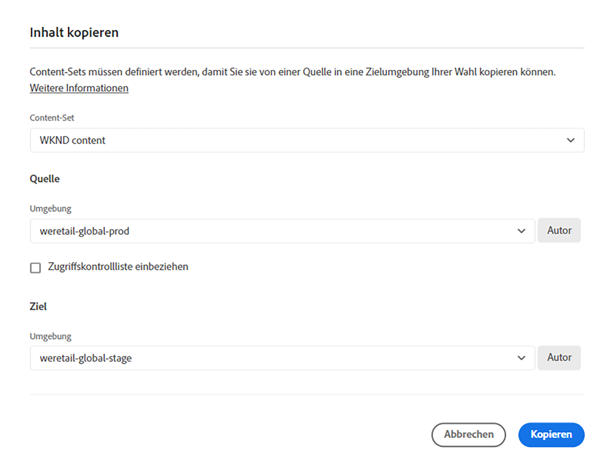
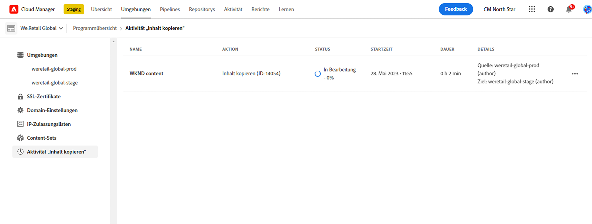
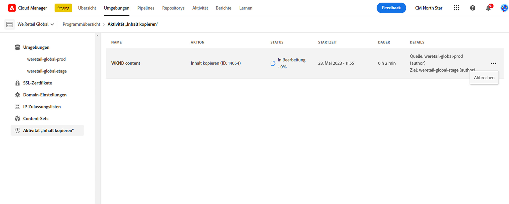

# Das Inhaltskopie-Tool {#content-copy}

Mit dem Inhaltskopier-Tool können Benutzende veränderbare Inhalte bei Bedarf aus ihren Produktionsumgebungen auf AEM as a Cloud Service in niedrigere Umgebungen zu Testzwecken kopieren.

## Einführung {#introduction}

Aktuelle, echte Daten sind für Tests, Validierung und Benutzerakzeptanz nützlich. Mit dem Inhaltskopie-Tool können Sie Inhalte aus einer AEM as a Cloud Service-Produktionsumgebung in eine Staging-, Entwicklungs- oder [Rapid Development Environment (RDE)](/help/implementing/developing/introduction/rapid-development-environments.md)-Umgebung für solche Tests kopieren.

Der zu kopierende Inhalt wird durch ein Content-Set definiert. Ein Content-Set besteht aus einer Liste von JCR-Pfaden, die den veränderlichen Inhalt enthalten, der aus einer Quell-Authoring-Service-Umgebung in eine Ziel-Authoring-Service-Umgebung innerhalb desselben Cloud Manager-Programms kopiert werden soll. Die folgenden Pfade sind in einem Content-Set zulässig.

```text
/content
/conf/**/settings/wcm
/conf/**/settings/dam/cfm/models
/conf/**/settings/graphql/persistentQueries
/etc/clientlibs/fd/themes
```

Beim Kopieren von Inhalten ist die Quellumgebung die Datenquelle.

* Wenn der Inhalt in der Zielumgebung geändert wurde, wird er durch den Inhalt in der Quelle überschrieben, wenn die Pfade übereinstimmen.
* Wenn die Pfade unterschiedlich sind, wird der Inhalt der Quelle mit dem Inhalt des Ziels zusammengeführt.

## Berechtigungen {#permissions}

Um das Inhaltskopie-Tool verwenden zu können, sind sowohl in der Quell- als auch in der Zielumgebung bestimmte Berechtigungen erforderlich.

| Funktion „Inhaltskopie“ | AEM-Admingruppe | Bereitstellungs-Manager-Rolle |
|---|---|---|
| Erstellen und Ändern von [Content-Sets](#create-content-set) | Nicht erforderlich | Erforderlich |
| Starten oder Abbrechen des [Inhaltskopie-Prozesses](#copy-content) | Erforderlich | Erforderlich |

Weitere Informationen zu Berechtigungen und dazu, wie sie festgelegt werden, finden Sie unter [AEM as a Cloud Service – Team- und Produktprofile](/help/onboarding/aem-cs-team-product-profiles.md).

## Erstellen eines Content-Sets {#create-content-set}

Bevor Inhalt kopiert werden kann, muss ein Content-Set definiert werden. Nach der Definition können Inhaltssätze zum Kopieren von Inhalten wiederverwendet werden. Führen Sie die folgenden Schritte aus, damit Sie einen Inhaltssatz erstellen können.

1. Melden Sie sich unter [my.cloudmanager.adobe.com](https://my.cloudmanager.adobe.com/) bei Cloud Manager an und wählen Sie die entsprechende Organisation und das entsprechende Programm aus.

1. Navigieren Sie im seitlichen Navigationsbedienfeld über die Seite **Übersicht** zur Registerkarte **Content-Sets**.

1. Klicken Sie oben rechts im Bildschirm auf **Inhaltssatz hinzufügen**.

   

1. Geben Sie auf der Registerkarte **Details** des Assistenten einen Namen und eine Beschreibung für das Content-Set ein und wählen Sie auf **Weiter** aus.

   

1. Auf der Registerkarte **Inhaltspfade** des Assistenten geben Sie die Pfade der veränderbaren Inhalte an, die in das Content-Set aufgenommen werden sollen.

   1. Geben Sie den Pfad in das Feld **Einschlusspfad hinzufügen** ein.
   1. Klicken Sie auf **Pfad hinzufügen**, um den Pfad zum Inhaltssatz hinzuzufügen.
   1. Klicken Sie bei Bedarf erneut auf **Pfad hinzufügen**.
      * Es sind bis zu 50 Pfade erlaubt.

   

1. Wenn Sie Ihre Content-Sets verfeinern oder einschränken möchten, können Sie Unterpfade ausschließen.

   1. Tippen oder klicken Sie in der Liste der enthaltenen Pfade auf das Symbol **Ausschluss-Unterpfade hinzufügen** neben dem Pfad, den Sie einschränken möchten.
   1. Geben Sie den Unterpfad ein, der unterhalb des ausgewählten Pfads ausgeschlossen werden soll.
   1. Wählen Sie den **Auschlusspfad** aus.
   1. Wählen Sie erneut **Ausschluss-Unterpfade hinzufügen** aus, um bei Bedarf weitere Pfade zum Ausschluss hinzuzufügen.
      * Ausgeschlossene Pfade müssen relativ zum eingeschlossenen Pfad sein.
      * Die Anzahl der ausgeschlossenen Pfade ist unbegrenzt.

   

1. Sie können die angegebenen Pfade bei Bedarf bearbeiten.

   1. Klicken Sie auf das X neben den ausgeschlossenen Unterpfaden, damit Sie diese löschen können.
   1. Klicken Sie auf die Ellipsenschaltfläche neben den Pfaden, um die Optionen **Bearbeiten** und **Löschen** anzuzeigen.

   

1. Wählen Sie **Erstellen**, um das Content-Set zu erstellen.

Das Content-Set kann jetzt zum Kopieren von Inhalten zwischen Umgebungen verwendet werden.

## Bearbeiten eines Content-Sets {#edit-content-set}

Hierbei führen Sie ähnliche Schritte wie beim Erstellen eines Content-Sets aus. Anstatt auf **Inhaltssatz hinzufügen** zu klicken, wählen Sie einen vorhandenen Satz in der Konsole aus und wählen Sie **Bearbeiten** aus dem Ellipsenmenü.



Bei der Bearbeitung Ihres Content-Sets können Sie die konfigurierten Pfade erweitern, um die ausgeschlossenen Unterpfade anzuzeigen.

## Kopieren von Inhalten {#copy-content}

Nachdem ein Content-Set erstellt wurde, können Sie ihn zum Kopieren von Inhalten verwenden. Führen Sie die folgenden Schritte aus, damit Sie Inhalte kopieren können.

>[!NOTE]
> Verwenden Sie keine Inhaltskopie in einer Umgebung, während in dieser Umgebung eine [Inhaltsübertragung](/help/journey-migration/content-transfer-tool/using-content-transfer-tool/overview-content-transfer-tool.md) ausgeführt wird.

1. Melden Sie sich unter [my.cloudmanager.adobe.com](https://my.cloudmanager.adobe.com/) bei Cloud Manager an und wählen Sie die entsprechende Organisation sowie das entsprechende Programm aus.

1. Navigieren Sie von der Seite **Überblick** zum Bildschirm **Umgebungen**.

1. Navigieren Sie vom Bildschirm **Umgebungen** zur Seite **Content-Sets**.

1. Wählen Sie ein Content-Set aus der Konsole aus, und wählen Sie im Menü mit den Auslassungspunkten **Inhalt kopieren**.

   

   >[!NOTE]
   >
   >Eine Umgebung ist unter Umständen nicht auswählbar, wenn:
   >
   >* die Benutzenden nicht über die entsprechenden Berechtigungen verfügen.
   >* in der Umgebung eine laufende Pipeline oder ein Vorgang zum Kopieren von Inhalten in Bearbeitung ist.
   >* Die Umgebung befindet sich im Ruhezustand oder fährt hoch.

1. Geben Se im Dialog **Inhalt kopieren** die Quelle und das Ziel für die Inhaltskopie-Aktion an.

   

   * Inhalte können nur aus einer höheren Umgebung in eine niedrigere Umgebung oder zwischen Entwicklungs- / RDE-Umgebungen kopiert werden, in denen die Hierarchie der Umgebungen wie folgt lautet (von der höchsten zur niedrigsten):
      * Produktion
      * Staging  
      * Entwicklung / RDE

1. Falls erforderlich, können Sie auch **Zugriffskontrolllisten** in Ihren Kopiervorgang einbeziehen.

1. Wählen Sie **Kopieren**.

Der Kopiervorgang wird gestartet. Der Status des Kopiervorgangs wird für das ausgewählte Content-Set in der Konsole angezeigt.

## Aktivität „Inhalt kopieren“ {#copy-activity}

Sie können den Status der Kopierprozesse auf der Seite **Aktivität „Inhalt kopieren“** überwachen.

1. Melden Sie sich unter [my.cloudmanager.adobe.com](https://my.cloudmanager.adobe.com/) bei Cloud Manager an und wählen Sie die entsprechende Organisation sowie das entsprechende Programm aus.

1. Gehen Sie von der Seite **Überblick** zum Bildschirm **Umgebungen**.

1. Navigieren Sie im Bildschirm **Umgebungen** zur Seite **Aktivität „Inhalt kopieren“**.



### Inhaltskopie-Status {#statuses}

Sobald das Kopieren von Inhalten beginnt, kann der Prozess einen der folgenden Status haben.

| Status | Beschreibung |
|---|---|
| In Bearbeitung | Die Inhaltskopie wird gerade durchgeführt |
| Fehlgeschlagen | Die Inhaltskopie ist fehlgeschlagen |
| Abgeschlossen | Die Inhaltskopie wurde erfolgreich abgeschlossen |
| Abgebrochen | Benutzende, die einen Vorgang zum Kopieren von Inhalten abbrechen, nachdem sie ihn gestartet haben |

### Abbrechen eines Kopiervorgangs {#canceling}

Wenn Sie einen Vorgang zum Kopieren von Inhalten nach dem Starten abbrechen müssen, können Sie ihn optional abbrechen.

Wählen Sie dazu auf der Seite **Inhaltsaktivität kopieren** die Aktion **Abbrechen** aus dem Ellipsenmenü des zuvor gestarteten Kopiervorgangs.



>[!NOTE]
>
>Wenn Sie einen Vorgang zum Abbrechen einer Inhaltskopie abbrechen, kann dies zu einer Teilkopie des Inhalts in der Zielumgebung führen. Diese Situation kann die Zielumgebung in einen unbrauchbaren Zustand versetzen.
>
>Wenn sich Ihre Umgebung aufgrund einer Stornierung in einem solchen Zustand befindet, wenden Sie sich bitte an die Adobe-Kundenunterstützung, um Unterstützung zu erhalten.

### Abrufen von Protokollen {#accessing-logs}

Sie können die Protokolle sowohl auf die Quell- als auch auf die Zielumgebung für jeden abgeschlossenen Inhaltskopierprozess überprüfen.

Wählen Sie dazu auf der Seite **Aktivität „Inhalt kopieren“** die Aktion **Protokolle** aus dem Menü mit den Auslassungspunkten des Kopierprozesses aus, für den Sie die Protokolle überprüfen möchten, und wählen Sie dann aus, für welche Umgebung.


Die Protokolle werden auf Ihren lokalen Computer heruntergeladen. Wenn der Download nicht gestartet wird, überprüfen Sie Ihre Popup-Blocker-Einstellungen.

## Einschränkungen {#limitations}

Für das Werkzeug zum Kopieren von Inhalten gelten die folgenden Einschränkungen.

* Inhalte können nicht von einer niedrigeren Umgebung in eine höhere Umgebung kopiert werden.
* Inhalte können nur aus und in Authoring-Services kopiert werden.
* Eine programmübergreifende Inhaltskopie ist nicht möglich.
* Die Ausführung gleichzeitiger Inhaltskopievorgänge in derselben Umgebung ist nicht möglich.
* Pro Content-Set können bis zu 50 Pfade angegeben werden. Für ausgeschlossene Pfade gibt es keine Beschränkung.
* Das Inhaltskopie-Tool sollte nicht als Klon- oder Spiegelwerkzeug verwendet werden, da es keine verschobenen oder gelöschten Inhalte auf der Quelle verfolgen kann.
* Das Inhaltskopie-Tool verfügt über keine Versionierungsfunktion und kann geänderte oder erstellte Inhalte in der Quellumgebung in einem Inhaltssatz seit dem letzten Inhaltskopievorgang nicht automatisch erkennen.
   * Um die Zielumgebung nur mit Inhaltsänderungen zu aktualisieren, die seit dem letzten Inhaltskopiervorgang vorgenommen wurden, müssen Sie ein Content-Set erstellen. Geben Sie dann die Pfade auf der Quellinstanz an, an denen seit dem letzten Inhaltskopiervorgang Änderungen vorgenommen wurden.
* Versionsinformationen sind in einer Inhaltskopie nicht enthalten.
* [Inhaltsfragmentmodelle](/help/sites-cloud/administering/content-fragments/content-fragment-models.md#data-types) können Referenzfelder basierend auf Universally Unique IDs (UUID) angeben. Solche UUIDs sind Repository-spezifisch, sodass das Inhaltskopie-Tool diese UUIDs beim Kopieren von Inhaltsfragmenten in der Zielumgebung neu berechnet.
