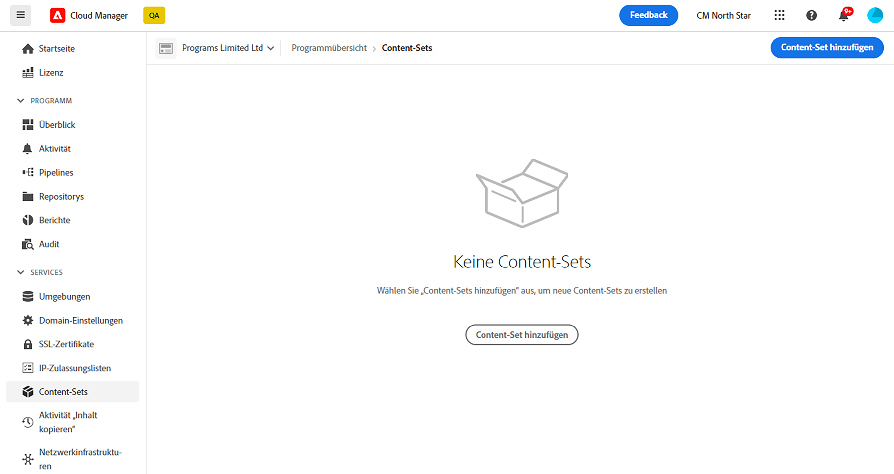
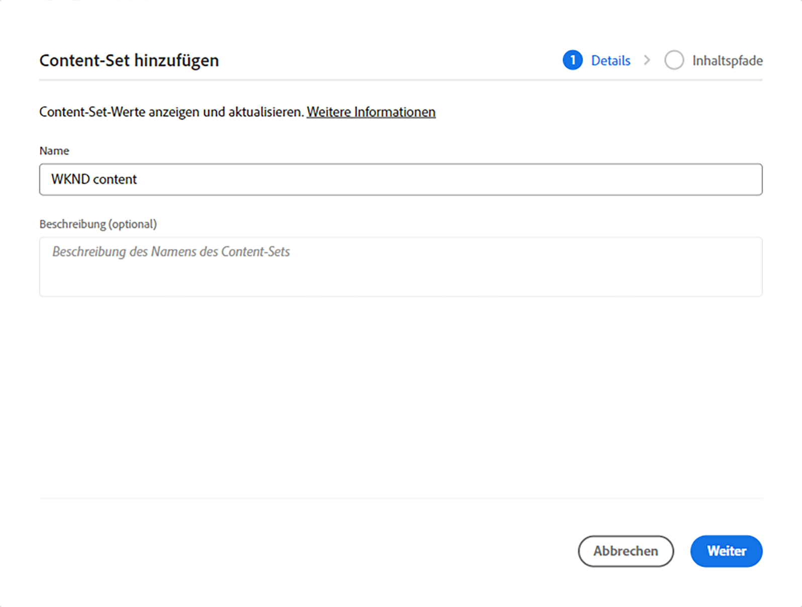
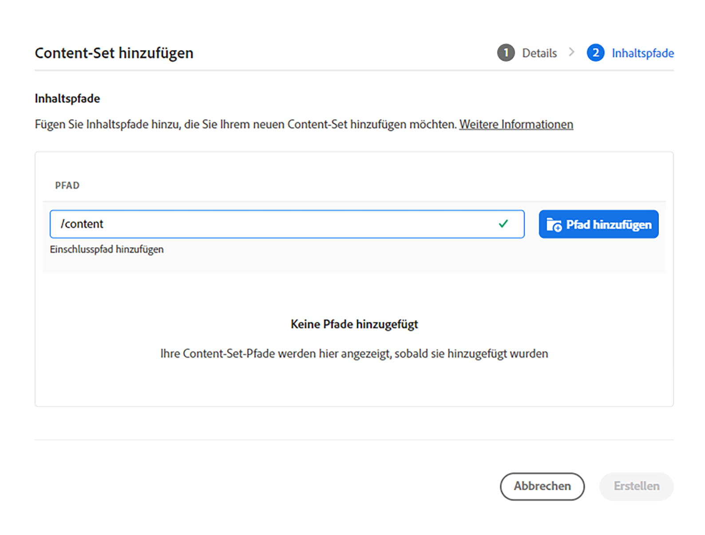
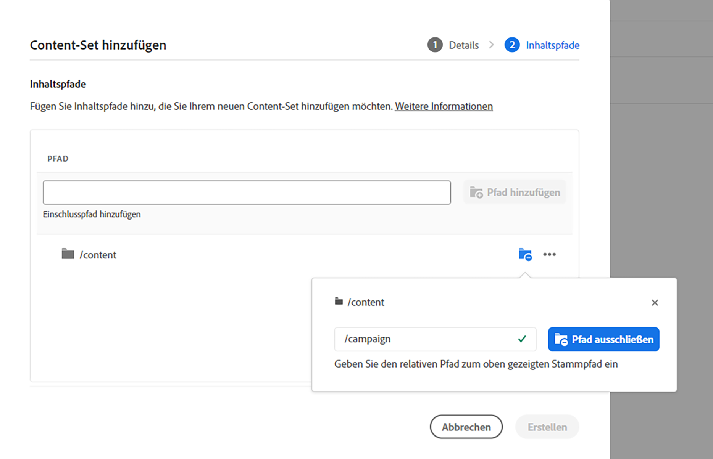
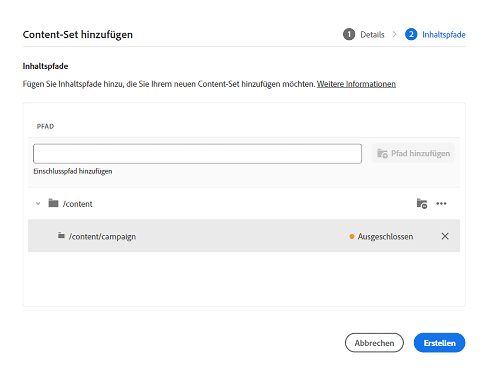
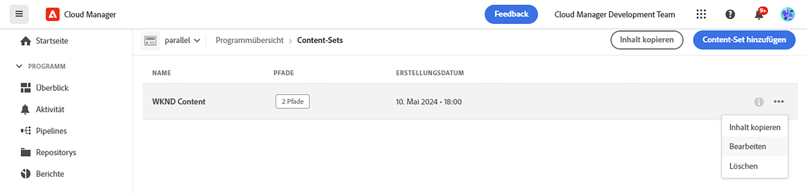
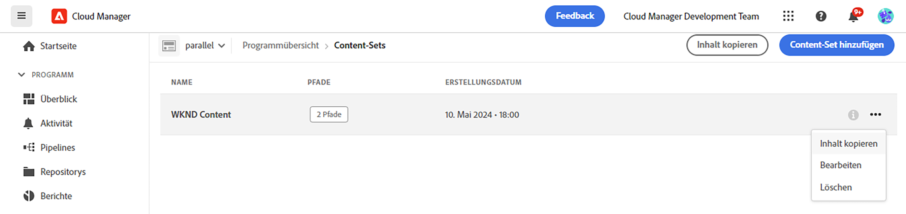
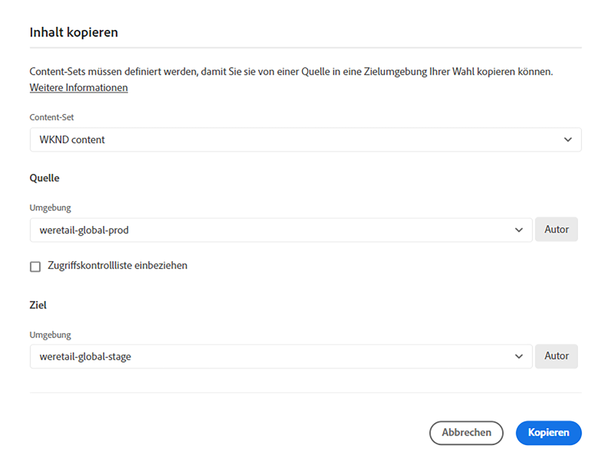
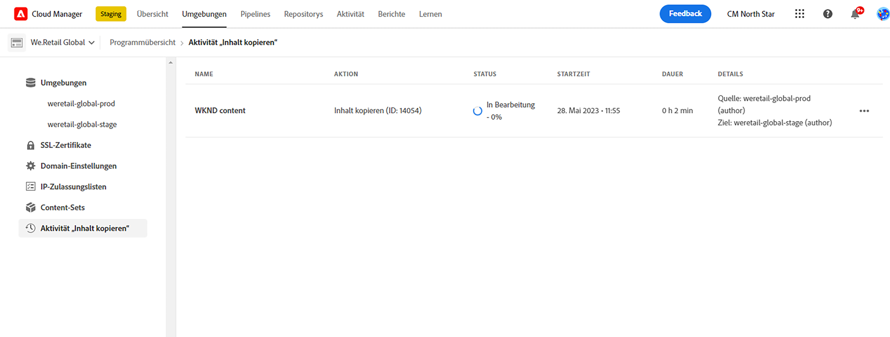
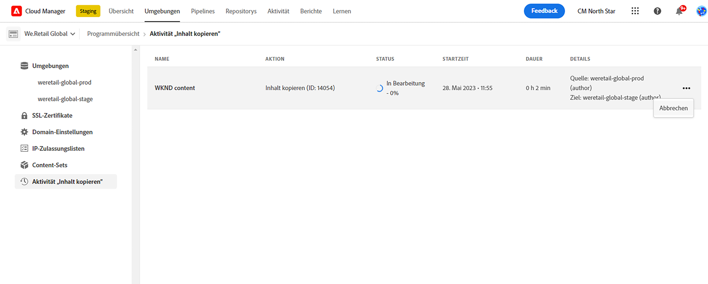

# Das Inhaltskopie-Tool {#content-copy}

Mit dem Inhaltskopie-Tool können Benutzende veränderbare Inhalte bei Bedarf aus ihren Produktionsumgebungen in AEM as a Cloud Service zu Testzwecken in niedrigere Umgebungen kopieren.

>[!NOTE]
>Während der Kopierfluss für primären Inhalt von höheren Umgebungen in niedrigere Umgebungen erfolgt, ermöglicht die zusätzliche Funktion **Vorwärtsfluss** das Kopieren aus niedrigeren produktionsfremden Umgebungen in höhere produktionsfremde Umgebungen (z. B. Entwicklung → Staging, RDE → Staging). Siehe [Einschränkungen](#limitations) für Details, einschließlich Verfügbarkeitsanforderungen.

## Einführung {#introduction}

Aktuelle, echte Daten sind für Tests, Validierung und Benutzerakzeptanz nützlich. Mit dem Inhaltskopie-Tool können Sie Inhalte aus einer AEM as a Cloud Service-Produktionsumgebung in eine Staging-, Entwicklungs- oder [schnelle Entwicklungsumgebung (RDE)](/help/implementing/developing/introduction/rapid-development-environments.md) für solche Tests kopieren.

Ein Content-Set definiert die zu kopierenden Inhalte. Ein Content-Set besteht aus einer Liste von JCR-Pfaden. Diese Pfade enthalten den veränderlichen Inhalt, der aus einer Quell-Authoring-Service-Umgebung in eine Ziel-Authoring-Service-Umgebung innerhalb desselben Cloud Manager-Programms kopiert werden soll. Die folgenden Pfade sind in einem Content-Set zulässig:

```text
/content
/conf/**/settings/wcm
/conf/**/settings/dam/cfm/models
/conf/**/settings/graphql/persistentQueries
/etc/clientlibs/fd/themes
```

Beim Kopieren von Inhalten ist die Quellumgebung die Datenquelle.

* Wenn die Quell- und Zielpfade übereinstimmen, überschreibt der Inhalt aus der Quelle den geänderten Inhalt in der Zielumgebung.
* Wenn die Pfade unterschiedlich sind, wird der Inhalt der Quelle mit dem Inhalt des Ziels zusammengeführt.

## Berechtigungen {#permissions}

Um das Inhaltskopie-Tool verwenden zu können, sind sowohl in der Quell- als auch in der Zielumgebung bestimmte Berechtigungen erforderlich.

| Funktion „Inhaltskopie“ | AEM-Admingruppe | Bereitstellungs-Manager-Rolle |
|---|---|---|
| Erstellen und Ändern von [Content-Sets](#create-content-set) | Nicht erforderlich | Erforderlich |
| Starten oder Abbrechen des [Inhaltskopie-Prozesses](#copy-content) | Erforderlich | Erforderlich |

Weitere Informationen zu Berechtigungen und dazu, wie sie festgelegt werden, finden Sie unter [AEM as a Cloud Service – Team- und Produktprofile](/help/onboarding/aem-cs-team-product-profiles.md).

## Erstellen eines Content-Sets {#create-content-set}

Bevor Inhalt kopiert werden kann, muss ein Content-Set definiert werden. Nach der Definition können Content-Sets zum Kopieren von Inhalten wiederverwendet werden. Führen Sie die folgenden Schritte aus, damit Sie ein Content-Set erstellen können.

1. Melden Sie sich unter [my.cloudmanager.adobe.com](https://my.cloudmanager.adobe.com/) bei Cloud Manager an und wählen Sie die entsprechende Organisation und das entsprechende Programm aus.

1. Navigieren Sie im seitlichen Navigationsbedienfeld über die Seite **Übersicht** zur Registerkarte **Content-Sets**.

1. Klicken Sie oben rechts im Bildschirm auf **Content-Set hinzufügen**.

   

1. Geben Sie auf der Registerkarte **Details** des Assistenten einen Namen und eine Beschreibung für das Content-Set ein und wählen Sie auf **Weiter** aus.

   

1. Auf der Registerkarte **Inhaltspfade** des Assistenten geben Sie die Pfade der veränderbaren Inhalte an, die in das Content-Set aufgenommen werden sollen.

   1. Geben Sie den Pfad in das Feld **Einschlusspfad hinzufügen** ein.
   1. Klicken Sie auf **Pfad hinzufügen**, um den Pfad zum Content-Set hinzuzufügen.
   1. Klicken Sie bei Bedarf erneut auf **Pfad hinzufügen**.
      * Es sind bis zu 50 Pfade erlaubt.

   

1. Wenn Sie Ihre Content-Sets verfeinern oder einschränken möchten, können Sie Unterpfade ausschließen.

   1. Klicken Sie in der Liste der enthaltenen Pfade auf die Option **Ausschluss-Unterpfade hinzufügen** neben dem Pfad, den Sie einschränken möchten.
   1. Geben Sie den Unterpfad ein, der aus dem ausgewählten Pfad ausgeschlossen werden soll.
   1. Wählen Sie den **Auschlusspfad** aus.
   1. Wählen Sie erneut **Ausschluss-Unterpfade hinzufügen** aus, um bei Bedarf weitere Pfade zum Ausschluss hinzuzufügen.
      * Ausgeschlossene Pfade müssen relativ zum eingeschlossenen Pfad sein.
      * Die Anzahl der ausgeschlossenen Pfade ist unbegrenzt.

   

1. Sie können die angegebenen Pfade bei Bedarf bearbeiten.

   1. Klicken Sie auf das „X“ neben den ausgeschlossenen Unterpfaden, um diese zu löschen.
   1. Klicken Sie auf die Schaltfläche mit den Auslassungspunkten neben den Pfaden, um die Optionen **Bearbeiten** und **Löschen** anzuzeigen.

   

1. Wählen Sie **Erstellen**, um das Content-Set zu erstellen.

Das Content-Set kann jetzt zum Kopieren von Inhalten zwischen Umgebungen verwendet werden.

## Bearbeiten eines Content-Sets {#edit-content-set}

1. Hierbei führen Sie ähnliche Schritte wie beim Erstellen eines Content-Sets aus. Anstatt auf **Content-Set hinzufügen** zu klicken, wählen Sie einen vorhandenen Satz in der Konsole aus und wählen Sie **Bearbeiten** aus dem Ellipsenmenü.



1. Bei der Bearbeitung Ihres Content-Sets können Sie die konfigurierten Pfade erweitern, um die ausgeschlossenen Unterpfade anzuzeigen.

## Kopieren von Inhalten {#copy-content}

Nachdem ein Content-Set erstellt wurde, können Sie es zum Kopieren von Inhalten verwenden.

>[!NOTE]
> Verwenden Sie keine Inhaltskopie in einer Umgebung, während [ Vorgang „Inhaltsübertragung](/help/journey-migration/content-transfer-tool/using-content-transfer-tool/overview-content-transfer-tool.md) in dieser Umgebung ausgeführt wird.

**So kopieren Sie Inhalte:**

1. Melden Sie sich unter [my.cloudmanager.adobe.com](https://my.cloudmanager.adobe.com/) bei Cloud Manager an und wählen Sie die entsprechende Organisation sowie das entsprechende Programm aus.

1. Navigieren Sie auf **Seite**&#x200B;Überblick“ zu **Umgebungen** > **Content-Sets**.

1. Wählen Sie in der Konsole ein Content-Set aus.

1. Klicken Sie im Menü mit den Auslassungspunkten auf **Inhalt kopieren**.

   

   >[!NOTE]
   >
   >Eine Umgebung kann möglicherweise nicht ausgewählt werden, wenn einer der folgenden Punkte zutrifft:
   >
   >* die Benutzenden nicht über die entsprechenden Berechtigungen verfügen.
   >* in der Umgebung eine laufende Pipeline oder ein Vorgang zum Kopieren von Inhalten in Bearbeitung ist.
   >* Die Umgebung befindet sich im Ruhezustand oder fährt hoch.

1. Geben Sie im Dialogfeld **Inhalt kopieren** die Quelle und das Ziel für die Inhaltskopie-Aktion an.

   

   * Inhalte können nur aus einer höheren Umgebung in eine niedrigere Umgebung oder zwischen Entwicklungs- / RDE-Umgebungen kopiert werden, in denen die Hierarchie der Umgebungen wie folgt lautet (von der höchsten zur niedrigsten):
      * Produktion
      * Staging  
      * Entwicklung/RDE
   * Standardmäßig ist die programmübergreifende Inhaltskopie deaktiviert. Auf Kundenanfrage kann sie jedoch aktiviert werden, wodurch ein zusätzliches Eingabefeld **Zielprogramm** verfügbar wird.

1. (Optional) Legen Sie bei Bedarf Folgendes fest:

   * **Zugriffssteuerungslisten einschließen** - Wählen Sie diese Option aus, wenn Sie die Zugriffssteuerungsberechtigungen des Inhalts zusammen mit dem Inhalt kopieren möchten.
   * **Löschen** - Wählen Sie diese Option aus, um den vorhandenen Inhalt am Ziel zu löschen, bevor Sie mit dem Import beginnen, sodass Sie in einem sauberen Zustand beginnen und Konflikte mit bereits vorhandenen Inhalten vermeiden können. Wenn Sie die Option **Löschen** deaktiviert lassen, importiert Cloud Manager den neuen Inhalt zusätzlich zum vorhandenen Zielinhalt. Bevor das Löschen beginnt, wird eine Bestätigungsaufforderung angezeigt, und Cloud Manager protokolliert die Löschaktion und Importdetails, um die Rückverfolgbarkeit zu gewährleisten.
     
      * Wenn Sie die Option **Ziel vor Import löschen** auswählen und auf **Kopieren** klicken, wird ein Popup mit einer Warnung angezeigt, in dem Sie folgende Optionen haben:
         * **Abbrechen** (in diesem Fall wird der **Inhaltskopie** Fluss nicht gestartet)
         * **Bestätigen** (der **Inhaltskopie**-Fluss wird gestartet und der Inhalt auf dem Ziel wird gelöscht)
           

      * Wenn Sie nicht &quot;**vor dem Import löschen“ wählen** funktioniert **Fluss** Inhalt kopieren“ wie zuvor.

1. Klicken Sie auf **Kopieren**.

Der Kopiervorgang wird gestartet. Der Status des Kopiervorgangs wird für das ausgewählte Content-Set in der Konsole angezeigt.

## Inhaltskopie-Aktivität {#copy-activity}

Sie können den Status der Kopierprozesse auf der Seite **Aktivität zum Kopieren von Inhalten** überwachen.

1. Melden Sie sich unter [my.cloudmanager.adobe.com](https://my.cloudmanager.adobe.com/) bei Cloud Manager an und wählen Sie die entsprechende Organisation sowie das entsprechende Programm aus.

1. Gehen Sie von der Seite **Überblick** zum Bildschirm **Umgebungen**.

1. Navigieren Sie im Bildschirm **Umgebungen** zur Seite **Aktivität zum Kopieren von Inhalten**.



### Inhaltskopie-Status {#statuses}

Sobald das Kopieren von Inhalten beginnt, kann der Prozess einen der folgenden Status haben.

| Status | Beschreibung |
| --- | --- |
| In Bearbeitung | Die Inhaltskopie wird gerade durchgeführt. |
| Fehlgeschlagen | Der Vorgang der Inhaltskopie ist fehlgeschlagen. |
| Abgeschlossen | Die Inhaltskopie wurde erfolgreich abgeschlossen. |
| Abgebrochen | Ein Benutzer bricht einen Vorgang zum Kopieren von Inhalten ab, nachdem er ihn gestartet hat. |

### Abbrechen eines Kopiervorgangs {#canceling}

Wenn Sie einen Vorgang zum Kopieren von Inhalten nach dem Starten abbrechen müssen, können Sie ihn optional abbrechen.

Wählen Sie dazu auf der Seite **Aktivität zum Kopieren von Inhalten** die Aktion **Abbrechen** aus dem Ellipsenmenü des zuvor gestarteten Kopiervorgangs.



>[!NOTE]
>
>Wenn Sie einen Vorgang zum Abbrechen einer Inhaltskopie abbrechen, kann dies zu einer Teilkopie des Inhalts in der Zielumgebung führen. Diese Situation kann die Zielumgebung in einen unbrauchbaren Zustand versetzen.
>
>Wenn sich Ihre Umgebung aufgrund einer Stornierung in einem solchen Zustand befindet, wenden Sie sich bitte an die Adobe-Kundenunterstützung, um Unterstützung zu erhalten.

### Zugriffsprotokolle {#accessing-logs}

Sie können die Protokolle sowohl auf die Quell- als auch auf die Zielumgebung für jeden abgeschlossenen Inhaltskopierprozess überprüfen.

**Zugreifen auf Protokolle:**

1. Klicken Sie auf der **Aktivität „Inhalt kopieren** im Menü mit den Auslassungspunkten auf **Protokolle** für den Kopiervorgang, den Sie überprüfen möchten. Wählen Sie dann die Umgebung aus.


Die Protokolle werden auf Ihren lokalen Computer heruntergeladen.

1. Wenn der Download nicht gestartet wird, überprüfen Sie Ihre Popup-Blocker-Einstellungen.

## Einschränkungen {#limitations}

Für das Werkzeug zum Kopieren von Inhalten gelten die folgenden Einschränkungen.

* Das Tool zum Kopieren von Inhalten unterstützt zwei Flussmodi:
   1. Top-Down-Fluss: Inhalte können aus höheren Umgebungen in niedrigere Umgebungen kopiert werden (z. B. Produktion → Staging, Staging → Entwicklung/RDE).
   2. Vorwärtsfluss (neue Funktion): Inhalte können auch von einer niedrigeren produktionsfremden Umgebung in eine höhere produktionsfremde Umgebung kopiert werden (z. B. Entwicklung → Staging, RDE → Staging). Diese Funktion ist nur auf ausdrückliche Anfrage verfügbar und bleibt aktiviert, bis explizit eine Deaktivierung angefordert wird. Produktionsumgebungen sind nie gültige Ziele für den Vorwärtsfluss.
* Inhalte können nur aus und in Authoring-Services kopiert werden.
* Die Ausführung gleichzeitiger Inhaltskopievorgänge in derselben Umgebung ist nicht möglich.
* Pro Content-Set können bis zu 50 Pfade angegeben werden. Für ausgeschlossene Pfade gibt es keine Beschränkung.
* Das Inhaltskopie-Tool sollte nicht als Klon- oder Spiegelwerkzeug verwendet werden, da es keine verschobenen oder gelöschten Inhalte auf der Quelle verfolgen kann.
* Das Inhaltskopie-Tool verfügt über keine Versionierungsfunktion und kann geänderte oder erstellte Inhalte in der Quellumgebung in einem Content-Set seit dem letzten Inhaltskopievorgang nicht automatisch erkennen.
   * Um die Zielumgebung nur mit Inhaltsänderungen zu aktualisieren, die seit dem letzten Inhaltskopiervorgang vorgenommen wurden, müssen Sie ein Content-Set erstellen. Geben Sie dann die Pfade auf der Quellinstanz an, an denen seit dem letzten Inhaltskopiervorgang Änderungen vorgenommen wurden.
* Versionsinformationen sind in einer Inhaltskopie nicht enthalten.
* In [Inhaltsfragmentmodellen](/help/sites-cloud/administering/content-fragments/content-fragment-models.md#data-types) können Referenzfelder basierend auf Universally Unique IDs (UUID) angegeben werden. Solche UUIDs sind Repository-spezifisch, sodass das Inhaltskopie-Tool diese UUIDs beim Kopieren von Inhaltsfragmenten in der Zielumgebung neu berechnet.
