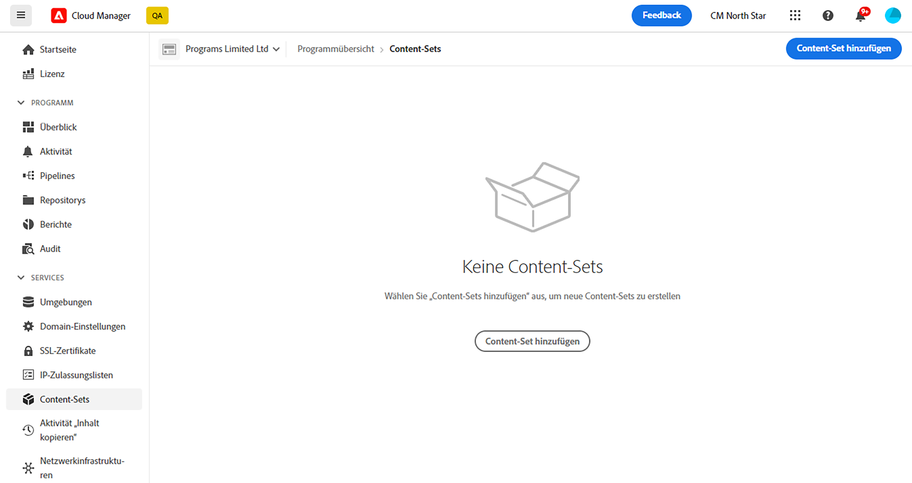

# Das Inhaltskopie-Werkzeug {#content-copy}

Das Werkzeug zum Kopieren von Inhalten ermöglicht es Benutzern, veränderliche Inhalte bei Bedarf aus ihren Produktionsumgebungen in AEM as a Cloud Service zu niedrigeren Umgebungen zu Testzwecken zu kopieren.

## Einführung {#introduction}

Aktuelle, echte Daten sind für Tests, Validierung und Benutzerakzeptanz nützlich. Mit dem Werkzeug zum Kopieren von Inhalten können Sie Inhalte aus einer Produktions- AEM as a Cloud Service Umgebung in eine Staging-, Entwicklungs- oder [Rapid Development Environment (RDE)](/help/implementing/developing/introduction/rapid-development-environments.md) -Umgebung für solche Tests.

Der zu kopierende Inhalt wird durch ein Content-Set definiert. Ein Content-Set besteht aus einer Liste von JCR-Pfaden, die den veränderlichen Inhalt enthalten, der aus einer Quell-Authoring-Service-Umgebung in eine Ziel-Authoring-Service-Umgebung innerhalb desselben Cloud Manager-Programms kopiert werden soll. Die folgenden Pfade sind in einem Content-Set zulässig.

```text
/content
/conf/**/settings/wcm
/conf/**/settings/dam/cfm/models
/conf/**/settings/graphql/persistentQueries
/etc/clientlibs/fd/themes
```

Beim Kopieren von Inhalten ist die Quellumgebung die Datenquelle.

* Wenn Inhalt in der Zielumgebung geändert wurde, wird er durch Inhalte in der Quelle überschrieben, wenn die Pfade identisch sind.
* Unterscheiden sich die Pfade, wird der Inhalt aus der Quelle mit dem Inhalt im Ziel zusammengeführt.

## Berechtigungen {#permissions}

Um das Werkzeug zum Kopieren von Inhalten zu verwenden, sind bestimmte Berechtigungen sowohl in der Quell- als auch in der Zielumgebung erforderlich.

| Funktion „Inhaltskopie“ | AEM-Admingruppe | Bereitstellungs-Manager-Rolle |
|---|---|---|
| Erstellen und Ändern von [Content-Sets](#create-content-set) | Nicht erforderlich | Erforderlich |
| Starten oder Abbrechen des [Inhaltskopie-Prozesses](#copy-content) | Erforderlich | Erforderlich |

Weitere Informationen zu Berechtigungen und zum Festlegen dieser Berechtigungen finden Sie im Dokument [AEM as a Cloud Service Team und Produktprofile.](/help/onboarding/aem-cs-team-product-profiles.md)

## Erstellen eines Content-Sets {#create-content-set}

Bevor Inhalt kopiert werden kann, muss ein Content-Set definiert werden. Nach der Definition können Inhaltssätze zum Kopieren von Inhalten wiederverwendet werden. Führen Sie die folgenden Schritte aus, damit Sie einen Inhaltssatz erstellen können.

1. Melden Sie sich bei Cloud Manager an unter [my.cloudmanager.adobe.com](https://my.cloudmanager.adobe.com/) und wählen Sie die entsprechende Organisation und das entsprechende Programm aus.

1. Gehen Sie von der Seite **Überblick** zum Bildschirm **Umgebungen**.

1. Navigieren Sie vom Bildschirm **Umgebungen** zur Seite **Content-Sets**.

1. Klicken Sie oben rechts im Bildschirm auf **Inhaltsset hinzufügen**.

   

1. Geben Sie auf der Registerkarte **Details** des Assistenten einen Namen und eine Beschreibung für das Content-Set ein und tippen oder klicken Sie auf **Weiter**.

   

1. Auf der Registerkarte **Inhaltspfade** des Assistenten geben Sie die Pfade der veränderbaren Inhalte an, die in das Content-Set aufgenommen werden sollen.

   1. Geben Sie den Pfad in das Feld **Einschlusspfad hinzufügen** ein.
   1. Klicks **Pfad hinzufügen** , um den Pfad zum Inhaltsset hinzuzufügen.
   1. Klicks **Pfad hinzufügen** nach Bedarf erneut.
      * Es sind bis zu 50 Pfade zulässig.

   

1. Wenn Sie den Inhaltssatz verfeinern oder beschränken müssen, können Unterpfade ausgeschlossen werden.

   1. Klicken Sie in der Liste der enthaltenen Pfade auf **Hinzufügen von Ausschlussunterpfaden** neben dem Pfad, den Sie beschränken möchten.
   1. Geben Sie den Unterpfad ein, der unter dem ausgewählten Pfad ausgeschlossen werden soll.
   1. Tippen oder klicken Sie auf **Pfad ausschließen**.
   1. Tippen oder klicken Sie erneut auf **Ausschluss-Unterpfade hinzufügen**, um bei Bedarf weitere Pfade zum Ausschluss hinzuzufügen.
      * Ausgeschlossene Pfade müssen relativ zum eingeschlossenen Pfad sein.
      * Die Anzahl der ausgeschlossenen Pfade ist unbegrenzt.

   

1. Sie können die angegebenen Pfade bei Bedarf bearbeiten.

   1. Klicken Sie auf das X neben den ausgeschlossenen Unterpfaden, damit Sie diese löschen können.
   1. Klicken Sie auf die Schaltfläche mit Auslassungspunkten neben Pfaden, damit Sie **Bearbeiten** und **Löschen** Optionen.

   

1. Tippen oder klicken Sie auf **Erstellen**, um das Content-Set zu erstellen.

Das Content-Set kann jetzt zum Kopieren von Inhalten zwischen Umgebungen verwendet werden.

## Bearbeiten eines Content-Sets {#edit-content-set}

Hierbei führen Sie ähnliche Schritte wie beim Erstellen eines Content-Sets aus. Anstatt auf **Inhaltsset hinzufügen**, wählen Sie einen vorhandenen Satz aus der Konsole aus und klicken Sie auf **Bearbeiten** aus dem Menü mit den Auslassungspunkten.


Beim Bearbeiten des Inhaltssatzes können Sie die konfigurierten Pfade erweitern, um die ausgeschlossenen Unterpfade anzuzeigen.

## Kopieren von Inhalten {#copy-content}

Nachdem ein Inhaltssatz erstellt wurde, können Sie ihn zum Kopieren von Inhalten verwenden. Führen Sie die folgenden Schritte aus, damit Sie Inhalte kopieren können.

>[!NOTE]
> Verwenden Sie keine Inhaltskopie in einer Umgebung, während eine [Inhaltstransfer](/help/journey-migration/content-transfer-tool/using-content-transfer-tool/overview-content-transfer-tool.md) -Vorgang wird in dieser Umgebung ausgeführt.

1. Melden Sie sich unter [my.cloudmanager.adobe.com](https://my.cloudmanager.adobe.com/) bei Cloud Manager an und wählen Sie die entsprechende Organisation und das entsprechende Programm aus.

1. Gehen Sie von der Seite **Überblick** zum Bildschirm **Umgebungen**.

1. Navigieren Sie vom Bildschirm **Umgebungen** zur Seite **Content-Sets**.

1. Wählen Sie ein Content-Set aus der Konsole aus, und wählen Sie im Menü mit den Auslassungspunkten **Inhalt kopieren**.

   

   >[!NOTE]
   >
   >Eine Umgebung ist unter Umständen nicht auswählbar, wenn:
   >
   >* die Benutzenden nicht über die entsprechenden Berechtigungen verfügen.
   >* in der Umgebung eine laufende Pipeline oder ein Vorgang zum Kopieren von Inhalten in Bearbeitung ist.
   >* Die Umgebung befindet sich im Ruhezustand oder fährt hoch.

1. Geben Se im Dialog **Inhalt kopieren** die Quelle und das Ziel für die Inhaltskopie-Aktion an.

   

   * Inhalte können nur aus einer höheren Umgebung in eine niedrigere Umgebung oder zwischen Entwicklungs- / RDE-Umgebungen kopiert werden, in denen die Hierarchie der Umgebungen wie folgt lautet (von der höchsten zur niedrigsten):
      * Produktion
      * Staging  
      * Entwicklung / RDE

1. Bei Bedarf können Sie auch **Zugriffssteuerungslisten einschließen** in Ihrem Kopierprozess.

1. Tippen oder klicken Sie auf **Kopieren**.

Der Kopiervorgang wird gestartet. Der Status des Kopiervorgangs wird für das ausgewählte Content-Set in der Konsole angezeigt.

## Aktivität „Inhalt kopieren“ {#copy-activity}

Sie können den Status der Kopierprozesse auf der Seite **Aktivität „Inhalt kopieren“** überwachen.

1. Melden Sie sich unter [my.cloudmanager.adobe.com](https://my.cloudmanager.adobe.com/) bei Cloud Manager an und wählen Sie die entsprechende Organisation und das entsprechende Programm aus.

1. Gehen Sie von der Seite **Überblick** zum Bildschirm **Umgebungen**.

1. Navigieren Sie im Bildschirm **Umgebungen** zur Seite **Aktivität „Inhalt kopieren“**.


### Inhaltskopie-Status {#statuses}

Sobald das Kopieren von Inhalten beginnt, kann der Prozess einen der folgenden Status haben.

| Status | Beschreibung |
|---|---|
| In Bearbeitung | Die Inhaltskopie wird gerade durchgeführt |
| Fehlgeschlagen | Die Inhaltskopie ist fehlgeschlagen |
| Abgeschlossen | Die Inhaltskopie wurde erfolgreich abgeschlossen |
| Abgebrochen | Benutzende, die einen Vorgang zum Kopieren von Inhalten abbrechen, nachdem sie ihn gestartet haben |

### Abbrechen eines Kopierprozesses {#canceling}

Wenn Sie einen Vorgang zum Kopieren von Inhalten nach dem Starten abbrechen müssen, können Sie ihn optional abbrechen.

Wählen Sie dazu auf der Seite **Inhaltsaktivität kopieren** die Aktion **Abbrechen** aus dem Ellipsenmenü des zuvor gestarteten Kopiervorgangs.


>[!NOTE]
>
>Wenn Sie einen Vorgang zum Abbrechen einer Inhaltskopie abbrechen, kann dies zu einer Teilkopie des Inhalts in der Zielumgebung führen. Diese Situation kann die Zielumgebung in einem unbrauchbaren Zustand belassen.
>
>Wenn sich Ihre Umgebung aufgrund einer Stornierung in einem solchen Zustand befindet, wenden Sie sich an die Kundenunterstützung von Adobe, um Hilfe zu erhalten.

### Abrufen von Protokollen {#accessing-logs}

Sie können die Protokolle sowohl auf die Quell- als auch auf die Zielumgebung für jeden abgeschlossenen Inhaltskopierprozess überprüfen.

Gehen Sie dazu im **Aktivität &quot;Inhalt kopieren&quot;** Seite, wählen Sie die **Protokolle** Aktion aus dem Auslassungsmenü des Kopierprozesses, für den Sie die Protokolle überprüfen und dann auswählen möchten, für welche Umgebung.


Die Protokolle werden auf Ihren lokalen Computer heruntergeladen. Wenn der Download nicht gestartet wird, überprüfen Sie Ihre Popup-Blocker-Einstellungen.

## Einschränkungen {#limitations}

Für das Werkzeug zum Kopieren von Inhalten gelten die folgenden Einschränkungen.

* Inhalte können nicht aus einer niedrigeren Umgebung in eine höhere Umgebung kopiert werden.
* Inhalte können nur aus und in Authoring-Services kopiert werden.
* Eine programmübergreifende Inhaltskopie ist nicht möglich.
* Die Ausführung gleichzeitiger Inhaltskopievorgänge in derselben Umgebung ist nicht möglich.
* Pro Inhaltsset können bis zu 50 Pfade angegeben werden. Für ausgeschlossene Pfade gibt es keine Beschränkung.
* Das Werkzeug zum Kopieren von Inhalten sollte nicht als Klonen- oder Spiegelwerkzeug verwendet werden, da es keine verschobenen oder gelöschten Inhalte auf der Quelle verfolgen kann.
* Das Werkzeug zum Kopieren von Inhalten verfügt über keine Versionierungsfunktion und kann geänderten Inhalt oder neu erstellten Inhalt in der Quellumgebung in einem Inhaltsset seit dem letzten Vorgang zum Kopieren von Inhalten nicht automatisch erkennen.
   * Wenn Sie Ihre Zielumgebung nur mit Inhaltsänderungen aktualisieren möchten, müssen Sie seit dem letzten Vorgang der Inhaltskopie einen Inhaltssatz erstellen. Geben Sie dann die Pfade in der Quellinstanz an, an denen Änderungen seit dem letzten Vorgang der Inhaltskopie vorgenommen wurden.
* Versionsinformationen sind in einer Inhaltskopie nicht enthalten.
