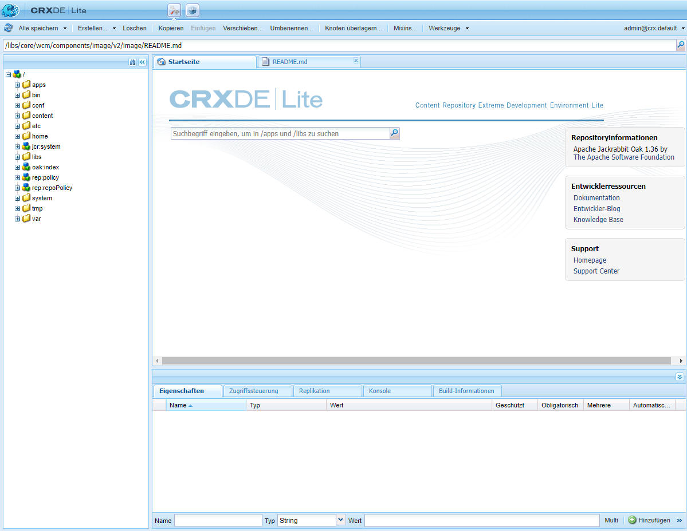

# Verwenden von CRXDE Lite {#using-crxde-lite}

CRXDE Lite ist Teil des AEM-Schnellstarts und steht Ihnen zur Verfügung, um auf das Repository in Ihren lokalen Entwicklungsumgebungen im Browser zuzugreifen und es zu ändern. Mit CRXDE Lite können Sie Dateien, Ordner, Knoten und Eigenschaften bearbeiten. Über diese benutzerfreundliche Oberfläche können Sie auf das gesamte Repository zugreifen.

>[!NOTE]
>
>CRXDE Lite ist nur in Ihren lokalen Entwicklungsumgebungen verfügbar. Es ist nicht in AEM as a Cloud Service verfügbar.

## Erste Schritte mit CRXDE Lite {#getting-started-with-crxde-lite}

Erste Schritte mit der CRXDE Lite:

1. Starten Sie den Schnellstart Ihrer lokalen AEM-Entwicklung.
1. Öffnen Sie die URL im Browser `https://<host>:<port>/crx/de`.
1. Geben Sie Ihren **Benutzernamen** und Ihr **Kennwort** ein.
1. Klicken Sie auf **OK**.

Die Benutzeroberfläche von CRXDE Lite sieht in Ihrem Browser wie folgt aus:

>[!TIP]
>
>Sie können auch über das AEM-Menü auf CRXDE Lite zugreifen. Wählen Sie im Hauptmenü **Tools** > **Allgemein** > **CRXDE Lite** aus.

## Überblick über die Benutzeroberfläche {#overview-of-the-user-interface}

Die Benutzeroberfläche von CRXDE Lite besteht aus vielen Teilen und Funktionen.

### Obere Wechselleiste {#top-switcher-bar}

Mit der oberen Umschaltleiste können Sie schnell zwischen CRXDE Lite und dem [Paket-Manager](package-manager.md) umschalten.

### Knotenpfad-Widget {#node-path-widget}

Das Knotenpfad-Widget zeigt den Pfad zum aktuell ausgewählten Knoten an.

Sie können es auch verwenden, um zu einem Knoten zu springen, indem Sie den Pfad von Hand eingeben oder ihn von woanders einfügen und die Eingabetaste drücken.

Es bietet auch Unterstützung für die Suche nach Knoten mit bestimmtem Knotennamen. Geben Sie den Namen des Knotens, den Sie suchen möchten, ein, und warten Sie (oder wählen Sie das Suchsymbol auf der rechten Seite aus). Wenn ein oder mehrere bestimmte Knoten in das Explorer-Fenster geladen werden, wird die Liste angezeigt, in der Sie einen Pfad auswählen und die Eingabetaste drücken können, um dorthin zu navigieren. Dies funktioniert nur für die Knoten, die derzeit im CRXDE-Client-Programm im Browser geladen sind. Wenn Sie das gesamte Repository durchsuchen möchten, verwenden Sie **Tools** > **Abfrage**.

### Explorer-Fenster {#explorer-pane}

Das **Explorer-Fenster** zeigt eine Baumstruktur aller Knoten im Repository an.

Klicken Sie auf einen Knoten, um seine Eigenschaften auf der Registerkarte **Eigenschaften** anzuzeigen. Nachdem Sie auf einen Knoten geklickt haben, können Sie eine Aktion in der Symbolleiste auswählen. Klicken Sie erneut auf den Knoten, um ihn umzubenennen.

Baumstrukturnavigationsfilter (Fernglassymbol): ermöglicht es Ihnen, die Knoten im Repository zu filtern, deren Name den Eingabetext enthält. Gilt nur für Knoten, die lokal geladen wurden.

### Bearbeitungsfenster {#edit-pane}

Im **Bearbeitungsfenster** können Sie den Inhalt der aktuell im Repository ausgewählten Datei anzeigen. Jede geöffnete Datei wird in dem Fenster als eigene Registerkarte dargestellt.

Auf der **Startseite** können Sie nach Inhalten und/oder Dokumentationen suchen und auf die Entwicklerdokumentation und Unterstützung von Adobe zugreifen.

Doppelklicken Sie im **Explorer-Fenster** auf eine Datei, um deren Inhalt im **Bearbeitungsfenster** anzuzeigen. Anschließend können Sie diesen ändern und die Änderungen speichern.

Sobald eine Datei im **Bearbeitungsfenster** bearbeitet wurde, sind die folgenden Tools in der Symbolleiste verfügbar:

* **In Baum anzeigen**: Zeigt die Datei in der Repository-Baumstruktur an.
* **Suchen/Ersetzen**: - Führt Such- und Ersetzungsvorgänge durch.

Durch einen Doppelklick auf die Statuszeile des **Bearbeitungsfensters** öffnen Sie das Dialogfeld **Zu Zeile wechseln**, in dem Sie eine bestimmte Zeilennummer eingeben können, um dorthin zu gelangen.

### Registerkarte „Eigenschaften“ {#properties-tab}

Auf der Registerkarte **Eigenschaften** werden die Eigenschaften des ausgewählten Knotens angezeigt. Sie können neue Eigenschaften hinzufügen oder die vorhandenen löschen.

### Registerkarte „Zugriffssteuerung“  {#access-control-tab}

Auf der Registerkarte **Zugriffssteuerung** werden Berechtigungen basierend auf dem aktuellen Pfad, Repository oder Prinzipal angezeigt.

Die Berechtigungen sind in die folgenden Kategorien unterteilt.

* **Gültige Richtlinie für die Zugriffssteuerung**: Die Richtlinien, die auf die aktuelle Auswahl angewendet werden können
* **Richtlinien zur lokalen Zugriffssteuerung**: Die aktuellen Richtlinien, die lokal auf die aktuelle Auswahl angewendet werden
* **Gültige Richtlinien zur Zugriffssteuerung**: Die aktuellen Richtlinien, die auf die aktuelle Auswahl angewendet werden, sie können lokal festgelegt oder von übergeordneten Knoten übernommen werden

>[!NOTE]
>
>Um die Zugriffssteuerungsinformationen anzuzeigen, muss der Benutzer, der sich bei CRXDE Lite angemeldet hat, über Berechtigungen zum Lesen von ACL-Einträgen verfügen.

### Registerkarte „Replikation“ {#replication-tab}

Auf der Registerkarte **Replikation** wird der Replikationsstatus des aktuellen Knotens angezeigt. Sie können den aktuellen Knoten replizieren oder replizieren und löschen.

### Registerkarte „Konsole“ {#console-tab}

Auf der Registerkarte **Konsole** werden Protokollmeldungen angezeigt. Sie können die Protokollebene konfigurieren, die Konsole löschen, an der ausgewählten Bildlaufposition anheften und die Anzeige von Meldungen aktivieren/deaktivieren.

### Registerkarte „Build-Informationen“ {#build-info-tab}

Auf der Registerkarte **Build-Informationen** werden Informationen angezeigt, wenn ein Bundle aufgebaut wird.

### Schaltfläche „Aktualisieren“  {#refresh-button}

Mit der Schaltfläche **Aktualisieren** wird die aktuelle Auswahl aktualisiert. Änderungen von anderen Benutzern werden in Ihrer Ansicht des Repositorys aktualisiert. Änderungen, die Sie vorgenommen haben, sind nicht betroffen.

### Schaltfläche „Alle speichern“ {#save-all-button}

Mit der Schaltfläche **Alle speichern** werden alle von Ihnen vorgenommenen Änderungen gespeichert. Solange Sie nicht speichern, sind die Änderungen nur vorübergehend und gehen verloren, wenn Sie die Konsole verlassen.

* **Wiederherstellen**: Verwirft alle Änderungen, die Sie seit dem letzten Speichervorgang am ausgewählten Knoten vorgenommen haben, lädt dann den aktuellen Status des Repositorys für den ausgewählten Knoten erneut.
* **Alle wiederherstellen**: Verwirft alle Änderungen, die Sie seit dem letzten Speichervorgang im gesamten Repository vorgenommen haben, lädt dann den aktuellen Status des Repositorys erneut.

### Schaltfläche „Erstellen“ {#create-button}

Die Schaltfläche **Erstellen** ist ein Dropdown-Menü, um Folgendes unter dem ausgewählten Knoten zu erstellen:

* Knoten: ein Knoten mit einem beliebigen Knotentyp
* Datei : ein `nt:file` und sein nt:resource-Unterknoten
* Ordner: ein `nt:folder`-Knoten

### Schaltfläche „Löschen“ {#delete-button}

Mit der Schaltfläche **Löschen** wird der ausgewählte Knoten gelöscht.

### Schaltfläche „Kopieren“ {#copy-button}

Mit der Schaltfläche **Kopieren** wird der ausgewählte Knoten kopiert.

## Schaltfläche „Einfügen“ {#paste-button}

Mit der Schaltfläche **Einfügen** wird der kopierte Knoten unter den ausgewählten Knoten eingefügt.

### Schaltfläche „Verschieben“ {#move-button}

Mit der Schaltfläche **Verschieben** wird der ausgewählte Knoten zu dem Knoten verschoben, der über das Dialogfeld festgelegt wurde.

### Umbenennen {#rename-button}

Mit der Schaltfläche **Umbenennen** wird der ausgewählte Knoten umbenannt.

### Mixins {#mixins-button}

Mit der Schaltfläche **Mixins** können Sie dem Knotentyp Mixin-Typen hinzufügen. Die Mixin-Typen werden meist verwendet, um fortgeschrittene Funktionen hinzuzufügen.

### Tools {#tools-button}

Die Schaltfläche **Tools** ist ein Dropdown-Menü mit den folgenden Tools:

* **Serverkonfiguration**: Zum Zugriff auf die Felix-Konsole (auch unter `https://<host>:<port>/system/console/configMgr` verfügbar)
* **Abfrage**: Für Abfragen im Repository
* **Berechtigungen**: Zum Anzeigen und Hinzufügen von Berechtigungen
* **Zutrittssteuerung testen**: Zum Testen der Berechtigung für einen bestimmten Pfad und/oder Prinzipal
* **Knotentyp exportieren**: Zum Exportieren von Knotentypen im System als CND-Notation
* **Knotentyp importieren**: um Zum Importieren von Knotentypen unter Verwendung der CND-Notation.

### Anmelde-Widget {#login-widget}

Das **Anmelde-Widget** zeigt den derzeit angemeldeten Benutzer an.

Klicken Sie darauf, um sich als anderer Benutzer anzumelden oder erneut anzumelden. `@crx.default` dass Sie sich im Standardarbeitsbereich (und dem einzigen) im Repository befinden.

Mit der Option **Voreinstellungen** können Sie die Sprache Ihrer Benutzeroberfläche festlegen und die Tastenkombinationen für verschiedene Aktionen wie Speichern, Suchen, Erstellen von Notizen usw. anzeigen und anpassen.

## Erstellen eines Ordners {#creating-a-folder}

So erstellen Sie einen Ordner mit CRXDE Lite:

1. Öffnen Sie CRXDE Lite in Ihrem Browser.
1. Klicken Sie im Navigationsfenster mit der rechten Maustaste auf den Ordner, unter dem Sie den neuen Ordner erstellen möchten, wählen Sie **Erstellen...** und dann **Ordner erstellen...** aus.

1. Geben Sie den **Namen** des Ordners ein und klicken Sie auf **OK**.

1. Klicken Sie auf **Alle speichern**, um die Änderungen auf dem Server zu speichern.

## Erstellen eines Knotens {#creating-a-node}

So erstellen Sie einen Knoten mit CRXDE Lite:

1. Öffnen Sie CRXDE Lite in Ihrem Browser.
1. Klicken Sie im [**Explorer-Fenster**](#explorer-pane) mit der rechten Maustaste auf den Knoten, in dem Sie den neuen Knoten erstellen möchten, wählen Sie **Erstellen** und dann **Knoten erstellen** aus.
1. Geben Sie den **Namen** ein und wählen Sie den **Typ** aus.
1. Klicken Sie auf **OK**.
1. Klicken Sie auf [**Alle speichern**](#save-all-button), um die Änderungen auf dem Server zu speichern.

Jetzt können Sie den Knoten an Ihre Anforderungen anpassen, indem Sie die Eigenschaften ändern oder neue Knoten erstellen.

>[!NOTE]
>
>Die meisten Bearbeitungsvorgänge, einschließlich **Knoten erstellen**, behalten alle Änderungen im Speicher und speichern sie erst beim Speichern im Repository (über die [**Schaltfläche „Alle speichern“**](#save-all-button)). Einige Vorgänge wie das Verschieben werden jedoch automatisch beibehalten.
>
>Die Prüfung, ob der erstellte Knoten vom Knotentyp des übergeordneten Knotens zugelassen ist, wird auch vom Repository ausgeführt, wenn Änderungen gespeichert werden sollen. Wenn Sie beim Speichern eines Knotens eine Fehlermeldung erhalten, überprüfen Sie, ob die Inhaltsstruktur gültig ist (Sie können z. B. keinen `nt:unstructured`-Knoten als untergeordneten Knoten eines `nt:folder`-Knotens erstellen).

## Erstellen einer Eigenschaft {#creating-a-property}

So erstellen Sie eine Eigenschaft mit CRXDE Lite:

1. Öffnen Sie CRXDE Lite in Ihrem Browser.
1. Wählen Sie im [**Explorer-Fenster**](#explorer-pane) den Knoten aus, dem Sie die neue Eigenschaft hinzufügen möchten.
1. Geben Sie auf der Registerkarte [**Eigenschaften**](#properties-tab) im unteren Fensterbereich den **Namen**, den **Typ** und den **Wert** ein.
1. Klicken Sie auf **Hinzufügen**.
1. Klicken Sie auf [**Alle speichern**](#save-all-button), um die Änderungen auf dem Server zu speichern.

## Erstellen einer Datei {#creating-a-file}

So wird eine neue Datei mit CRXDE Lite erstellt:

1. Öffnen Sie CRXDE Lite in Ihrem Browser.
1. Klicken Sie im [**Explorer-Fenster**](#explorer-pane) mit der rechten Maustaste auf die Komponente, für die Sie die Datei erstellen möchten und wählen Sie **Erstellen** und dann **Datei erstellen** aus.
1. Geben Sie den **Dateinamen** mit der Erweiterung ein.
1. Klicken Sie auf **OK**.
1. Die neue Datei wird als Registerkarte im [**Bearbeitungsfenster**](#edit-pane) geöffnet.
1. Bearbeiten Sie die Datei.
1. Klicken Sie auf [**Alle speichern**](#save-all-button), um die Änderungen zu speichern.

## Exportieren und Importieren von Knotentypen {#exporting-and-importing-node-types}

Mit CRXDE Lite können Sie Knotentypdefinitionen in [CND-Notation (Compact Namespace and Node Type Definition)](https://jackrabbit.apache.org/jcr/node-type-notation.html) importieren und/oder exportieren.

Exportieren einer Knotentypdefinition in CRXDE Lite:

1. Öffnen Sie CRXDE Lite in Ihrem Browser.
1. Wählen Sie den gewünschten Knoten aus.
1. Wählen Sie **Tools** und dann **Knotentyp exportieren** aus.
1. Die Definition wird in CND-Notation auf einer neuen Registerkarte in Ihrem Browser angezeigt.
1. Speichern Sie die Informationen (falls erforderlich).

So importieren Sie eine Knotentypdefinition:

1. Öffnen Sie CRXDE Lite in Ihrem Browser.
1. Wählen Sie **Tools** und dann **Knotentyp importieren** aus.
1. Im [**Bearbeitungsfenster**](#edit-pane) wird eine neue Registerkarte mit der Beschriftung **Knotentypen importieren** geöffnet.
1. Geben Sie die CND-Notation für die Definition in das Textfeld der Registerkarte **Knotentyp importieren** ein.
1. Aktivieren Sie **Aktualisierung zulassen**, wenn Sie eine vorhandene Definition aktualisieren.
1. Wählen Sie **Importieren**.

## Protokollierung {#logging}

Mit CRXDE Lite können Sie die Datei `error.log` anzeigen, die sich im Dateisystem unter `<aem-install-dir>/crx-quickstart/logs` befindet, und sie mit der entsprechenden Protokollebene filtern. Gehen Sie wie folgt vor:

1. Öffnen Sie CRXDE Lite in Ihrem Browser.
1. Wählen Sie im Dropdown-Menü auf der rechten Seite der [**Registerkarte „Konsole“**](#console-tab) unten im Fenster die Option **Server-Protokolle** aus.
1. Klicken Sie auf das **Stopp-Symbol**, um die Nachrichten anzuzeigen.

Sie haben folgende Möglichkeiten:

* Passen Sie die Protokollparameter in der Felix-Konsole an, indem Sie auf das Symbol **Protokollierungskonfigurationen** klicken.
* Löschen Sie die Meldungen, indem Sie auf das Symbol **Konsole löschen** klicken.
* Fixieren Sie die Nachricht für die aktuelle Auswahl, indem Sie auf das Symbol **Konsole fixieren** klicken.
* Aktivieren oder deaktivieren Sie die Anzeige von Meldungen, indem Sie auf das **Stopp**-Symbol klicken.
