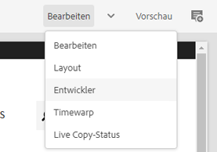
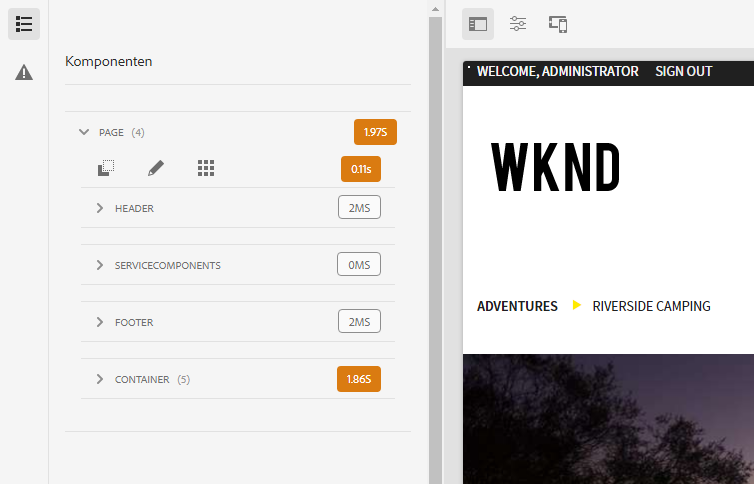
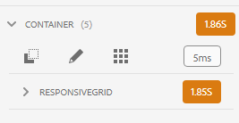
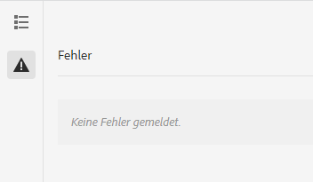

# Entwicklermodus {#developer-mode}

Beim Bearbeiten von Seiten in AEM sind diverse [Modi](/help/sites-cloud/authoring/fundamentals/environment-tools.md#page-modes) verfügbar, u. a. auch der Entwicklermodus. Der Entwicklermodus öffnet ein seitliches Bedienfeld mit mehreren Registerkarten, die einem Entwickler technische Informationen über die aktuelle Seite bereitstellen.

Es gibt zwei Registerkarten:

* **** Komponenten zum Anzeigen von Struktur- und Leistungsinformationen.
* **** Es werden Fehler angezeigt, die Probleme verursachen.

Diese Informationen unterstützen Entwickler bei Folgendem:

* **** Hier erfahren Sie, wie die Seiten zusammengestellt werden.
* **Debuggen:** Was passiert, wo und wann, was wiederum hilft, Probleme zu beheben.

>[!NOTE]
>
>Entwicklermodus:
>
>* Der Modus ist (aufgrund von Größenbeschränkungen) nicht auf mobilen Geräten oder in kleinen Desktop-Fenstern verfügbar.
>  * Dies gilt bei einer Breite von weniger als 1024 Pixel.
>* Ist nur für Benutzer verfügbar, die Mitglieder der Gruppe `administrators` sind.

## Öffnen des Entwicklermodus {#opening-developer-mode}

Der Entwicklermodus ist als Seitenbereich im Seiten-Editor implementiert. Um den Bereich zu öffnen, wählen Sie in der Symbolleiste des Seiten-Editors aus der Modusauswahl die Option **Entwickler** aus:

Der Bereich ist in zwei Registerkarten unterteilt:

* **[Komponenten](#components)**  - Zeigt eine Komponentenstruktur an, ähnlich der  [Inhaltsstruktur ](/help/sites-cloud/authoring/fundamentals/environment-tools.md#content-tree) für Autoren
* **[Fehler](#errors)** – Wenn ein Problem auftritt, werden hier die Details für die jeweilige Komponente angezeigt.

### Registerkarte &quot;Komponenten&quot; {#components}

Diese Registerkarte enthält eine Komponentenstruktur mit folgenden Attributen:

* Erläutert die Kette von Komponenten und Vorlagen, die auf der Seite gerendert werden. Die Struktur kann erweitert werden, sodass sie Kontext innerhalb der Hierarchie anzeigt.
* Zeigt die serverseitige Verarbeitungszeit, die zum Rendern der Komponente benötigt wird.
* Sie können die Struktur erweitern und spezifische Komponenten innerhalb der Struktur auswählen. Die Auswahl bietet Zugriff auf Komponentendetails, z. B.:
   * Repository-Pfad
   * Links zu den Skripten (Zugriff über CRXDE Lite)
   * Komponentendetails, wie in der [Komponentenkonsole](/help/sites-cloud/authoring/features/components-console.md) dargestellt
* In der Baumstruktur ausgewählte Komponenten werden durch einen blauen Rahmen im Editor gekennzeichnet.

Diese Registerkarte &quot;Komponenten&quot;hilft bei Folgendem:

* Bestimmen und Vergleichen der Render-Zeit nach Komponente
* Anzeigen und Verstehen der Hierarchie
* Verstehen und Verbessern der Seitenladezeit durch Identifizieren langsamer Komponenten

Jeder Komponenteneintrag kann die folgenden Optionen haben:

* **Details anzeigen:** Ein Link zu einer Liste, die Folgendes anzeigt:
   * Alle Komponentenskripte, die zum Rendern der Komponente verwendet werden.
   * Der Repository-Inhaltspfad für diese spezifische Komponente.

      

* **Skript bearbeiten:** Ein Link, der das Komponentenskript in CRXDE Lite öffnet.

* **Komponentendetails anzeigen:** Öffnet die Details der Komponente in der  [Komponentenkonsole.](/help/sites-cloud/authoring/features/components-console.md)

Das Erweitern eines Komponenteneintrags durch Tippen oder Klicken auf den Pfeil kann auch Folgendes anzeigen:

    * Die Hierarchie innerhalb der ausgewählten Komponente.
    * Rendering-Zeiten für die ausgewählte Komponente isoliert, alle darin verschachtelten einzelnen Komponenten und die kombinierte Gesamtsumme.

### Registerkarte &quot;Fehler&quot; {#errors}

Hoffentlich ist der Tab **Fehler** immer leer (wie oben). Bei Problemen können jedoch für jede Komponente die folgenden Details angezeigt werden:

* Eine Warnung, falls die Komponente einen Eintrag in das Fehlerprotokoll schreibt, und Details zum Fehler sowie direkte Links zum entsprechenden Code in CRXDE Lite.
* Eine Warnung, falls die Komponente eine Admin-Sitzung öffnet.

Wenn beispielsweise eine nicht definierte Methode aufgerufen wird, wird der resultierende Fehler auf der Registerkarte **Fehler** angezeigt und der Komponenteneintrag in der Baumstruktur der Registerkarte **Komponenten** wird ebenfalls mit einem Indikator markiert, wenn ein Fehler auftritt.
