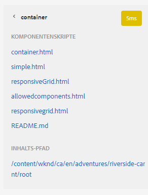

# Entwicklermodus {#developer-mode}

Beim Bearbeiten von Seiten in AEM sind diverse [Modi](/help/sites-cloud/authoring/sites-console/introduction.md#page-modes) verfügbar, u. a. auch der Entwicklermodus. Der Entwicklermodus öffnet einen Seitenbereich mit mehreren Registerkarten mit technischen Informationen für Entwickler zur aktuellen Seite.

Zwei Registerkarten sind verfügbar:

* **[Komponenten](#components)** zum Anzeigen von Struktur- und Leistungsinformationen.
* **[Fehler](#errors)** zur Anzeige auftretender Probleme.

Diese Informationen unterstützen Entwickler bei Folgendem:

* **Erkunden** Sie, wie die Seiten zusammengestellt werden.
* **Debuggen** Sie, was an welcher Stelle und zu welchem Zeitpunkt geschieht und wie Probleme gelöst werden können.

>[!NOTE]
>
>Entwicklermodus:
>
>* Ist (aufgrund von Platzbeschränkungen) nicht auf Mobilgeräten oder in kleinen Desktop-Fenstern verfügbar. Dies gilt bei einer Breite von weniger als 1024 Pixel.
>* Ist nur für Benutzer verfügbar, die Mitglieder der Gruppe `administrators` sind.

## Öffnen des Entwicklermodus {#opening-developer-mode}

Der Entwicklermodus ist als Seitenbereich im Seiten-Editor implementiert. Um den Bereich zu öffnen, wählen Sie in der Symbolleiste des Seiten-Editors aus der Modusauswahl die Option **Entwickler** aus:

Der Bereich ist in zwei Registerkarten unterteilt:

* **[Komponenten](#components)** – Hier sehen Sie die Komponentenstruktur, die der [Inhaltsstruktur](/help/sites-cloud/authoring/page-editor/editor-side-panel.md#content-tree) für Autoren ähnelt.
* **[Fehler](#errors)** – Wenn ein Problem auftritt, werden hier die Details für die jeweilige Komponente angezeigt.

### Registerkarte „Komponenten“ {#components}

Diese Registerkarte enthält eine Komponentenstruktur mit folgenden Attributen:

* Zeigt die Kette der Komponenten und Vorlagen, die auf dieser Seite gerendert wurden. Die Struktur kann erweitert werden, sodass sie Kontext innerhalb der Hierarchie anzeigt.
* Zeigt die Server-seitige Verarbeitungszeit, die zum Rendern der Komponente benötigt wird.
* Ermöglicht es, die Struktur zu erweitern und bestimmte Komponenten innerhalb der Struktur auszuwählen. Die Auswahl bietet Zugriff auf Komponentendetails, z. B.:
   * Repository-Pfad
   * Links zu den Skripten (Zugriff über CRXDE Lite)
   * Komponentendetails, wie sie in der [Komponentenkonsole](/help/sites-cloud/authoring/components-console.md) zu sehen sind
* In der Baumstruktur ausgewählte Komponenten werden im Editor durch einen blauen Rahmen gekennzeichnet.

Diese Registerkarte „Komponenten“ hilft bei Folgendem:

* Bestimmen und Vergleichen der Render-Zeit nach Komponente
* Anzeigen und Verstehen der Hierarchie
* Verstehen und Verbessern der Seitenladezeit durch Identifizieren langsamer Komponenten

Jeder Komponenteneintrag kann die folgenden Optionen haben:

* **Details anzeigen**: Ein Link zu einer Liste, die Folgendes enthält:
   * Alle zum Rendern der Komponente verwendeten Komponentenskripte
   * Den Repository-Inhaltspfad für diese spezifische Komponente

     

* **Skript bearbeiten:** Ein Link, der das Komponentenskript in CRXDE Lite öffnet.

* **Komponentendetails anzeigen:** Öffnet die Details der Komponente in der [Komponentenkonsole](/help/sites-cloud/authoring/components-console.md).

Das Erweitern eines Komponenteneintrags durch Tippen oder Klicken auf den Pfeil kann auch Folgendes anzeigen:

    * Die Hierarchie innerhalb der ausgewählten Komponente.
    * Die Render-Zeiten nur für die ausgewählte Komponente, für einzelne darin verschachtelte Komponenten und für alle Komponenten insgesamt.

### Registerkarte „Fehler“ {#errors}

Zwar ist zu hoffen, dass die Registerkarte **Fehler** niemals Daten anzeigt (wie oben), falls jedoch Probleme auftreten, werden zur jeweiligen Komponente folgende Details angezeigt:

* Eine Warnung, falls die Komponente einen Eintrag in das Fehlerprotokoll schreibt, und Details zum Fehler sowie direkte Links zum entsprechenden Code in CRXDE Lite.
* Eine Warnung, falls die Komponente eine Admin-Sitzung öffnet.

Wenn beispielsweise eine undefinierte Methode aufgerufen wird, wird der daraus resultierende Fehler auf der Registerkarte **Fehler** angezeigt, und der Komponenteneintrag in der Baumstruktur der Registerkarte **Komponenten** wird ebenfalls mit einem Indikator versehen, wenn ein Fehler auftritt.
