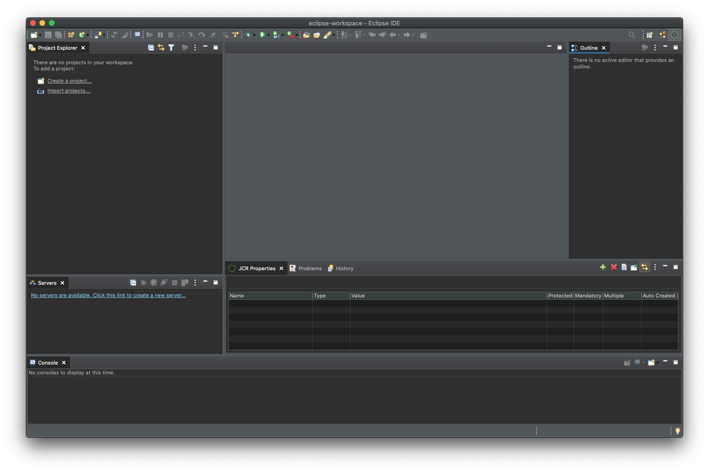
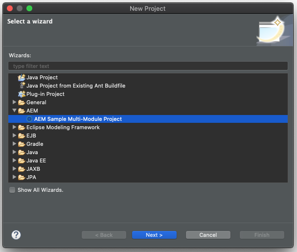

# AEM Developer Tools for Eclipse{#aem-developer-tools-for-eclipse}


## Überblick {#overview}

_Experience Manager Developer Tools for Eclipse_ ist ein Eclipse-Plug-in, das auf dem [Eclipse-Plug-in für Apache Sling](https://sling.apache.org/documentation/development/ide-tooling.html) basiert und unter der Apache-Lizenz 2 veröffentlicht wurde.

Es bietet mehrere Funktionen, die die AEM-Entwicklung vereinfachen:

* Nahtlose Integration mit AEM-Instanzen über Eclipse Server Connector
* Synchronisierung für Inhalte und OSGI-Bundles
* Debugging-Unterstützung mit Code-Hot-Swapping-Funktion
* Einfacher Bootstrap von AEM-Projekten über einen speziellen Projekterstellungsassistenten
* Einfache Bearbeitung von JCR-Eigenschaften

## Voraussetzungen {#requirements}

Bevor Sie die AEM Developer Tools verwenden, müssen Sie Folgendes tun:

* Laden Sie die [Eclipse-IDE für Enterprise Java™-Entwicklerinnen und -Entwickler](https://www.eclipse.org/downloads/packages/) herunter und installieren Sie sie.
* Konfigurieren Sie Ihre Eclipse-Installation, um sicherzustellen, dass Sie mindestens 1 GB Heap-Speicher haben, indem Sie Ihre Konfigurationsdatei `eclipse.ini` bearbeiten, wie in den [häufig gestellten Fragen zu Eclipse](https://wiki.eclipse.org/FAQ_How_do_I_increase_the_heap_size_available_to_Eclipse%3F) beschrieben.

>[!NOTE]
>
>Unter macOS müssen Sie mit der rechten Maustaste auf **Eclipse.app** klicken und dann **Paketinhalt anzeigen** auswählen, um Ihre `eclipse.ini`**zu finden.**

## Installieren der AEM Developer Tools for Eclipse {#how-to-install-the-aem-developer-tools-for-eclipse}

Sobald die oben genannten [Voraussetzungen](#requirements) erfüllt sind, können Sie das Plug-in wie folgt installieren:

1. Öffnen Sie die [AEM Developer Tools-Website](https://eclipse.adobe.com/com.adobe.granite.ide.p2update-1.3.0.zip). <!-- RB: OLD URL was (https://eclipse.adobe.com/aem/dev-tools/) This URL is generating a 404 error in the experience-manager-cloud-service.en LinkCheckExl report . The website appears to be dead; no redirects at all. Clicking "Installation Link" does not do anything. Only the link "Download archive" works. The "Online Documentation" link just takes you to the AEM Docs home page. Not sure if this topic is still needed?? -->

1. Kopieren Sie den **Installations-Link**.

   Alternativ können Sie auch ein Archiv herunterladen, anstatt den Installations-Link zu verwenden. Diese Methode ermöglicht eine Offline-Installation, aber Sie erhalten auf diese Weise keine automatischen Update-Benachrichtigungen.

1. Öffnen Sie in Eclipse das Menü **Hilfe**.
1. Klicken Sie auf **Neue Software installieren**.
1. Klicken Sie auf **Hinzufügen...**.
1. In das Feld **Name** geben Sie `AEM Developer Tools` ein.
1. Kopieren Sie in das Feld **Speicherort** die Installations-URL.
1. Klicken Sie auf **Hinzufügen**.
1. Prüfen Sie die beiden Plug-ins für **AEM** und **Sling**.
1. Klicken Sie auf **Weiter**.
1. Klicken Sie im Fenster **Installationsdetails** erneut auf **Weiter**.
1. Akzeptieren Sie die Lizenzvereinbarungen und klicken Sie auf **Beenden**.
1. Klicken Sie auf **Jetzt neu starten**, um Eclipse neu zu starten.

## Die AEM-Perspektive {#the-aem-perspective}

In Eclipse bestimmt eine Perspektive die innerhalb eines Fensters verfügbaren Aktionen und Ansichten und ermöglicht eine aufgabenorientierte Interaktion mit Ressourcen in Eclipse. Weitere Informationen zur Perspektive finden Sie in der [Eclipse-Dokumentation](https://help.eclipse.org/latest/index.jsp).

_Experience Manager Developer Tools for Eclipse_ bieten eine AEM-Perspektive, die Ihnen volle Kontrolle über Ihre AEM-Projekte und -Instanzen bietet. So öffnen Sie die AEM-Perspektive:

1. Wählen Sie in der Eclipse-Menüleiste **Fenster** > **Perspektive** > **Perspektive öffnen** > **Andere** aus.
1. Wählen Sie im Dialogfeld **AEM** aus und klicken Sie auf **Öffnen**.



## Multi-Modul-Beispielprojekt {#sample-multi-module-project}

_Experience Manager Developer Tools for Eclipse_ enthalten ein Beispielprojekt mit mehreren Modulen, das Ihnen den Einstieg in das Projekt-Setup von Eclipse erleichtert. Es dient auch als Best-Practice-Leitfaden für verschiedene AEM-Funktionen. [Erfahren Sie mehr über den Projektarchetyp](https://github.com/adobe/aem-project-archetype).

Führen Sie die folgenden Schritte aus, um das Beispielprojekt zu erstellen:

1. Suchen Sie im Menü **Datei** > **Neu** > **Projekt** den Abschnitt **AEM** und wählen Sie **AEM-Multi-Modul-Beispielprojekt**.

   

1. Klicken Sie auf **Weiter**.

   >[!NOTE]
   >
   >Dieser Schritt kann einen Moment dauern, da m2eclipse die Archetypkataloge scannen muss.

1. Wählen Sie im Menü `com.adobe.granite.archetypes : sample-project-archetype : <highest-number>` aus und klicken Sie dann auf **Weiter**.

   

1. Geben Sie in die folgenden Felder Daten für das Beispielprojekt ein:

   * **Name**
   * **Gruppen-ID**
   * **Artefakt-ID**
   * **appID** – Sie müssen die Optionen unter **Erweitert** erweitern, um diesen Wert festzulegen.
   * **appTitle** – Sie müssen ggf. die Optionen unter **Erweitert** erweitern, um diesen Wert festzulegen.
   * **Package** – Sie müssen die Optionen unter **Erweitert** erweitern, um diesen Wert festzulegen.

   

1. Klicken Sie auf **Weiter**.

1. Anschließend konfigurieren Sie einen AEM-Server, mit dem sich Eclipse verbindet.

   Um die Debugger-Funktion zu verwenden, müssen Sie AEM im Debugging-Modus starten. Dies kann z. B. erreicht werden, indem Sie Folgendes zur Befehlszeile hinzufügen:

   ```text
       -nofork -agentlib:jdwp=transport=dt_socket,server=y,suspend=n,address=10123
   ```

   

1. Klicken Sie auf **Beenden**. Die Projektstruktur wird erstellt.

   >[!NOTE]
   >
   >Bei einer Neuinstallation (genauer gesagt: wenn die Abhängigkeiten von Maven noch nie heruntergeladen wurden) wird das Projekt möglicherweise mit Fehlern erstellt. Folgen Sie in diesem Fall den Anweisungen unter [Beheben einer ungültigen Projektdefinition](#resolving-invalid-project-definition).

## Importieren vorhandener Projekte {#how-to-import-existing-projects}

Mit der Funktion **Neues Projekt** können Sie die richtige Struktur für Ihre Anforderungen erstellen:

1. Folgen Sie den Anweisungen, um ein [Multi-Modul-Beispielprojekt](#sample-multi-module-project) zu erstellen, und es werden die folgenden Projekte für Sie erstellt, die eine sinnvolle Trennung der Belange ermöglichen:

   * `PROJECT.ui.apps` für `/apps`- und `/etc`-Inhalte
   * `PROJECT.ui.content` für `/content`, der erstellt wird
   * `PROJECT.core` für Java™-Bundles (diese werden relevant, sobald Sie Java™-Code hinzufügen möchten)
   * `PROJECT.it.launcher` und `PROJECT.it.tests` für Integrationstests

1. Ersetzen Sie den Inhalt Ihres `PROJECT.ui.apps`-Projekts durch die Ordner `apps` und `etc` Ihres Pakets:

   1. Erweitern Sie im Bedienfeld „Projekt-Explorer“ `PROJECT.ui.apps` > `src` > `main` > `content` > `jcr_root` > `apps`.
   1. Klicken Sie mit der rechten Maustaste auf den Ordner `apps` und wählen Sie **Anzeigen in** > **System-Explorer** aus.
   1. Löschen Sie die Ordner `apps` und `etc`, die jetzt angezeigt werden sollten, und platzieren Sie hier die Ordner `apps` und `etc` Ihres Inhaltspakets.
   1. Klicken Sie in Eclipse mit der rechten Maustaste auf das Projekt `PROJECT.ui.apps` und wählen Sie **Aktualisieren** aus.

1. Führen Sie dann dasselbe für `PROJECT.ui.content` aus und ersetzen Sie den Inhaltsordner durch den Ordner aus Ihren Paketen:

   1. Erweitern Sie im Bedienfeld „Projekt-Explorer“ `PROJECT.ui.content` > `src` > `main` > `content` > `jcr_root` > `content`.
   1. Klicken Sie mit der rechten Maustaste auf den unteren Inhaltsordner und wählen Sie **Anzeigen in** > **System-Explorer** aus.
   1. Löschen Sie die Inhaltsordner, der jetzt angezeigt werden sollte, und platzieren Sie hier den Inhaltsordner Ihres Inhaltspakets.
   1. Klicken Sie in Eclipse mit der rechten Maustaste auf das Projekt `PROJECT.ui.content` und wählen Sie **Aktualisieren** aus.

1. Jetzt müssen Sie die `filter.xml`-Dateien dieser beiden Projekte aktualisieren, damit sie dem Inhalt Ihres Inhaltspakets entsprechen. Öffnen Sie dazu die Datei `META-INF/vault/filter.xml` Ihres Inhaltspakets in einem gesonderten Text-/Code-Editor.

   * Dies ist ein Beispiel dafür, wie Ihre Datei `filter.xml`aussehen kann:

   ```xml
   <?xml version="1.0" encoding="UTF-8"?>
   <workspaceFilter version="1.0">
       <filter root="/apps/foo"/>
       <filter root="/apps/foundation/components/bar"/>
       <filter root="/etc/designs/foo"/>
       <filter root="/content/foo"/>
       <filter root="/content/dam/foo"/>
       <filter root="/content/usergenerated/content/foo"/>
   </workspaceFilter>
   ```

1. Für den Inhalt Ihres Pakets, der in zwei Projekte aufgeteilt wurde, müssen Sie diese Filterregeln ebenfalls in zwei Teile aufteilen und die `filter.xml`-Dateien der beiden Projekte entsprechend aktualisieren.

   1. Öffnen Sie in Eclipse `PROJECT.ui.apps/src/main/content/META-INF/filter.xml`.
   1. Ersetzen Sie den Inhalt des `<workspaceFilter>`-Elements durch die Regeln Ihres Pakets, die mit `/apps` und `/etc` beginnen.
      * Zum Beispiel:

        ```xml
        <?xml version="1.0" encoding="UTF-8"?>
        <workspaceFilter version="1.0">
           <filter root="/apps/foo"/>
           <filter root="/apps/foundation/components/bar"/>
           <filter root="/etc/designs/foo"/>
        </workspaceFilter>
        ```

   1. Öffnen Sie dann `PROJECT.ui.content/src/main/content/META-INF/filter.xml`.
   1. Ersetzen Sie die Regeln durch die Ihres Pakets, die mit `/content` beginnen.
      * Zum Beispiel:

        ```xml
        <?xml version="1.0" encoding="UTF-8"?>
        <workspaceFilter version="1.0">
           <filter root="/content/foo"/>
           <filter root="/content/dam/foo"/>
           <filter root="/content/usergenerated/content/foo"/>
        </workspaceFilter>
        ```

1. Denken Sie daran, alle Änderungen zu speichern. Sie können diesen neuen Inhalt jetzt mit Ihrer AEM-Instanz synchronisieren.

1. Stellen Sie im Bedienfeld „Server“ sicher, dass die Verbindung hergestellt wurde. Andernfalls starten Sie sie.
1. Klicken Sie auf das Symbol **Bereinigen und veröffentlichen**.

Nach Abschluss des Vorgangs sollte das Paket auf Ihrer Instanz ausgeführt und beim Speichern alle Änderungen automatisch mit der Instanz synchronisiert werden.

Wenn Sie ein Paket aus Ihrem Projekt neu erstellen möchten, klicken Sie mit der rechten Maustaste auf `PROJECT.ui.apps` oder `PROJECT.ui.content` und wählen Sie **Ausführen als** > **Maven-Installation** aus.

Jetzt verfügen Sie über einen Zielordner, der Ihr Paket enthält (z. B. mit dem Namen `PROJECT.ui.apps-0.0.1-SNAPSHOT.zip`).

## Fehlerbehebung {#troubleshooting}

### Ungültige Projektdefinition beheben {#resolving-invalid-project-definition}

Um ungültige Abhängigkeiten und Projektdefinitionen aufzulösen, gehen Sie wie folgt vor:

1. Wählen Sie alle erstellten Projekte.
1. Klicken Sie mit der rechten Maustaste.
1. Wählen Sie im Kontextmenü **Maven** > **Projekte aktualisieren** aus.
1. Aktivieren Sie **Aktualisierungen von Snapshots/Releases erzwingen**.
1. Klicken Sie auf **OK**.

Eclipse lädt die erforderlichen Abhängigkeiten herunter. Das kann einen Moment dauern.

## Weitere Informationen {#more-information}

Die offizielle Website „Apache Sling IDE tooling for Eclipse“ bietet Ihnen nützliche Informationen:

* Das Benutzerhandbuch](https://sling.apache.org/documentation/development/ide-tooling.html) zu [**Apache Sling IDE-Tooling für Eclipse** führt Sie durch die allgemeinen Konzepte, Server-Integrationen und Bereitstellungsfunktionen, die von AEM Developer Tools unterstützt werden.
* Der [Abschnitt zur Fehlerbehebung](https://sling.apache.org/documentation/development/ide-tooling.html#troubleshooting).
* Die [Liste der bekannten Probleme](https://sling.apache.org/documentation/development/ide-tooling.html#known-issues).

Die folgende offizielle [Eclipse](https://www.eclipse.org/)-Dokumentation kann dabei helfen, Ihre Umgebung einzurichten:

* [Erste Schritte mit Eclipse](https://eclipseide.org/getting-started/)
* [Eclipse Luna-Hilfesystem](https://help.eclipse.org/latest/index.jsp)
* [Maven-Integration (m2eclipse)](https://www.eclipse.org/m2e/)
