# Package Manager {#working-with-packages}

Pakete bieten Ihnen die Möglichkeit, Repository-Inhalte zu importieren und zu exportieren. Sie können Pakete verwenden, um neue Inhalte zu installieren, Inhalte zwischen Instanzen auszutauschen und Repository-Inhalte zu sichern.

Mithilfe von Package Manager können Sie Pakete zu Entwicklungszwecken zwischen Ihrer AEM-Instanz und Ihrem lokalen Dateisystem übertragen.

## Was sind Pakete? {#what-are-packages}

Ein Paket ist eine ZIP-Datei, die Repository-Inhalte in einer serialisierten Form des Dateisystems enthält, die Vault-Serialisierung genannt wird und eine benutzerfreundliche und einfach zu bearbeitende Darstellung von Dateien und Ordnern bietet. Der im Paket enthaltene Inhalt wird mithilfe von Filtern definiert.

Ein Paket enthält auch Vault-Metadaten, einschließlich der Filterdefinitionen und Informationen zur Import-Konfiguration. Zusätzliche Inhaltseigenschaften, die nicht für die Paketextraktion verwendet werden, können mit in das Paket aufgenommen werden, z. B. eine Beschreibung, ein visuelles Bild oder ein Symbol. Diese zusätzlichen Inhaltseigenschaften dienen nur dem Verwender des Inhaltspakets und nur zu Informationszwecken.

>[!NOTE]
>
>Pakete repräsentieren die aktuelle Version der Inhalte zum Zeitpunkt der Erstellung des Pakets. Sie umfassen keine früheren Versionen der Inhalte, die AEM im Repository speichert.

## Pakete in AEM as a Cloud Service {#aemaacs-packages}

Inhaltspakete, die für Programme von AEM as a Cloud Service erstellt wurden, müssen eine saubere Trennung zwischen unveränderlichem und veränderlichem Inhalt aufweisen. Daher kann Package Manager nur zur Verwaltung von Paketen mit Inhalten verwendet werden. Jeder Code muss über Cloud Manager bereitgestellt werden.

>[!NOTE]
>
>Pakete können nur Inhalte enthalten. Jede Funktion (z. B. Inhalte, die unter `/apps` gespeichert werden) muss [mithilfe Ihrer CI/CD-Pipeline in Cloud Manager bereitgestellt werden](/help/implementing/cloud-manager/deploy-code.md).

>[!IMPORTANT]
>
>Die Benutzeroberfläche von Package Manager gibt möglicherweise die Fehlermeldung **undefiniert** zurück, wenn die Installation eines Pakets länger als 10 Minuten dauert.
>
>Dies ist nicht auf einen Installationsfehler zurückzuführen, sondern auf eine Zeitüberschreitung, die es bei Cloud Service für alle Anfragen gibt.
>
>Wiederholen Sie die Installation nicht, wenn ein solcher Fehler auftritt. Die Installation wird im Hintergrund korrekt ausgeführt. Würden Sie die Installation neu starten, könnten Konflikte durch mehrere gleichzeitige Importprozesse entstehen.

Weitere Informationen zum Verwalten von Paketen für AEMaaCS finden Sie unter [Bereitstellen für AEM as a Cloud Service](/help/implementing/deploying/overview.md) im Benutzerhandbuch zur Bereitstellung.

## Paketgröße {#package-size}

Adobe empfiehlt, keine großen Pakete zu erstellen. Dadurch werden beim Hoch- und Herunterladen von Paketen Zeitüberschreitungsprobleme vermieden.

In der Regel sollte ein Paket innerhalb von 60 Sekunden vollständig übertragen werden. Daraus ergibt sich die folgende Formel als Richtlinie.

```text
MaxPackageSize (in MB) = ConnectionSpeed (in MB/s) * 60 s
```

Da der Netzwerk-Traffic variabel und immer kleiner als der angegebene maximale theoretische Wert ist, versuchen Sie, ein Online-Tool zum Testen der Internet-Geschwindigkeit zu verwenden.

Die Internet-Geschwindigkeiten unterscheiden sich fast immer zwischen Uploads und Downloads. Wenn Sie Pakete sowohl hoch- als auch herunterladen müssen, sollten Sie in Ihrer Berechnung den niedrigeren Wert (in der Regel die Upload-Geschwindigkeit) verwenden.

### Beispiel {#example}

Mithilfe eines Tools zum Testen der Internet-Geschwindigkeit sehe ich, dass meine aktuelle Upload-Geschwindigkeit bei etwa 100 MBit/s liegt.

```text
100 Mbps = 12.5 MB/s
12.5 MB/s * 60 s = 750 MB
```

Also sollten alle Pakete, die ich erstelle, kleiner als 750 MB sein.

>[!NOTE]
>
>Netzwerkgeschwindigkeiten unterliegen aktuellen lokalen Bedingungen. Selbst bei einem vor kurzem durchgeführten Geschwindigkeitstest kann der tatsächliche Durchsatz variieren.
>
>Daher ist die angegebene Formel nur eine Richtlinie und Ihre tatsächliche empfohlene maximale Paketgröße kann variieren.

## Package Manager {#package-manager}

Package Manager verwaltet die Pakete auf Ihrer AEM-Installation. Nachdem Sie [die erforderlichen Berechtigungen zugewiesen haben](#permissions-needed-for-using-the-package-manager), können Sie Package Manager für verschiedene Aktionen, u. a. zum Konfigurieren, Erstellen, Herunterladen und Installieren von Paketen, verwenden.

### Erforderliche Berechtigungen {#required-permissions}

Um Pakete erstellen, ändern, hochladen und installieren zu können, müssen Benutzer über die entsprechenden Berechtigungen für die folgenden Knoten verfügen:

* Vollständige Berechtigungen mit Ausnahme des Löschens auf `/etc/packages`
* Der Knoten, der den Paketinhalt enthält

>[!CAUTION]
>
>Die Erteilung von Berechtigungen für Pakete kann zur Offenlegung sensibler Informationen und zu Datenverlust führen.
>
>Um diese Risiken zu begrenzen, wird dringend empfohlen, bestimmte Gruppenberechtigungen nur für dedizierte Unterbäume zu gewähren.

### Zugriff auf Package Manager {#accessing}

Sie haben drei Möglichkeiten, auf Package Manager zuzugreifen:

1. Vom AEM-Hauptmenü > **Tools** > **Bereitstellung** > **Pakete**
1. Von [CRXDE Lite](crxde.md) unter Verwendung der oberen Umschaltleiste
1. Direkt durch Zugreifen auf `http://<host>:<port>/crx/packmgr/`

### Benutzeroberfläche von Package Manager {#ui}

Package Manager ist in vier Hauptfunktionsbereiche unterteilt:

* **Linker Navigationsbereich**: In diesem Bedienfeld können Sie die Liste der Pakete filtern und sortieren.
* **Paketliste**: Dies ist die Liste der Pakete in Ihrer Instanz, die entsprechend der Auswahl im linken Navigationsbereich gefiltert und sortiert wurden.
* **Aktivitätsprotokoll**: Dieses Bedienfeld ist zunächst minimiert und wird erweitert, um die Aktivität von Package Manager detailliert zu beschreiben, z. B. wenn ein Paket aufgebaut oder installiert wird. Unter der Registerkarte „Aktivitätsprotokoll“ sind weitere Schaltflächen für Folgendes verfügbar:
   * **Protokoll löschen**
   * **Einblenden/ausblenden**
* **Symbolleiste**: Die Symbolleiste enthält Aktualisierungsschaltflächen für den linken Navigationsbereich und die Liste der Pakete sowie Schaltflächen zum Suchen, Erstellen und Hochladen von Paketen.

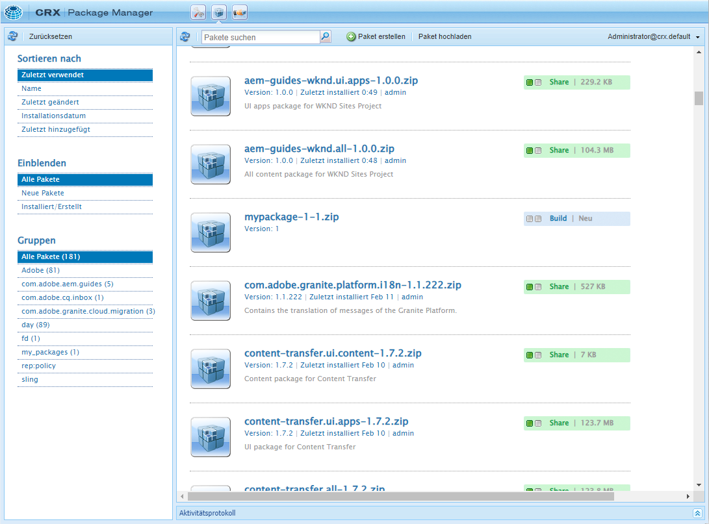

Wenn Sie im linken Navigationsbereich auf eine Option klicken, wird die Paketliste sofort gefiltert.

Wenn Sie auf einen Paketnamen klicken, wird der Eintrag in der Paketliste erweitert, um weitere Details zum Paket anzuzeigen.

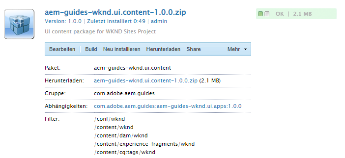

Es gibt eine Reihe von Aktionen, die für ein Paket über die Schaltflächen der Symbolleiste ausgeführt werden können, welche verfügbar sind, wenn die Paketdetails erweitert werden.

* [Bearbeiten](#edit-package)
* [Aufbauen](#building-a-package)
* [Neu installieren](#reinstalling-packages)
* [Download](#downloading-packages-to-your-file-system)

Unterhalb der Schaltfläche **Mehr** stehen weitere Aktionen zur Verfügung.

* [Löschen](#deleting-packages)
* [Abdeckung](#package-coverage)
* [Inhalt](#viewing-package-contents-and-testing-installation)
* [Neu verpacken](#rewrapping-a-package)
* [Andere Versionen](#other-versions)
* [Deinstallieren](#uninstalling-packages)
* [Installation testen](#viewing-package-contents-and-testing-installation)
* [Validieren](#validating-packages)
* [Replizieren](#replicating-packages)

### Paketstatus {#package-status}

Jeder Eintrag in der Paketliste ist mit einem Statusindikator versehen, so dass Sie auf einen Blick den Status des Pakets erkennen können. Wenn Sie den Mauszeiger über den Status bewegen, wird eine QuickInfo mit Details zum Status angezeigt.

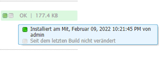

Wenn das Paket geändert wurde oder noch nie aufgebaut wurde, wird der Status als Link angezeigt, über den schnell gehandelt werden kann, um das Paket neu zu aufzubauen oder zu installieren.

## Paketeinstellungen {#package-settings}

Ein Paket ist im Wesentlichen ein Satz von Filtern und den Repository-Daten, die auf diesen Filtern basieren. Mithilfe der Package Manager-Benutzeroberfläche können Sie auf ein Paket und dann auf die Schaltfläche **Bearbeiten** klicken, um die Details eines Pakets einschließlich der folgenden Einstellungen anzuzeigen.

* [Allgemeine Einstellungen](#general-settings)
* [Paketfilter](#package-filters)
* [Paketabhängigkeiten](#package-dependencies)
* [Erweiterte Einstellungen](#advanced-settings)
* [Paket-Screenshots](#package-screenshots)

### Allgemeine Einstellungen {#general-settings}

Sie können eine Vielzahl von Paketeinstellungen bearbeiten, um Informationen wie die Paketbeschreibung, Abhängigkeiten und Anbieterinformationen zu definieren.

Das Dialogfeld **Paketeinstellungen** ist über die Schaltfläche **Bearbeiten** beim [Erstellen](#creating-a-new-package) oder [Bearbeiten](#viewing-and-editing-package-information) eines Pakets verfügbar. Nachdem Sie Änderungen vorgenommen haben, klicken Sie auf **Speichern**.

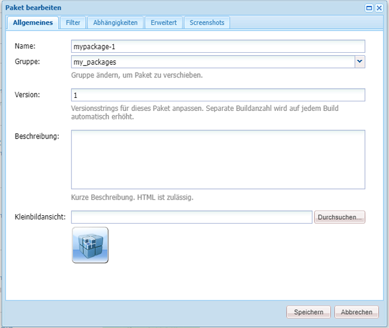

| Feld | Beschreibung |
|---|---|
| Name | Der Name des Pakets |
| Gruppe | Für die Organisation von Paketen können Sie den Namen einer neuen Gruppe eingeben oder eine bestehende Gruppe auswählen |
| Version | Für die Version zu verwendender Text |
| Beschreibung | Eine kurze Beschreibung des Pakets, das HTML-Markup zum Formatieren ermöglicht |
| Miniaturansicht | Das Symbol, das mit der Paketliste angezeigt wird |

### Paketfilter {#package-filters}

Filter identifizieren die Repository-Knoten, die in das Paket eingeschlossen werden sollen. Eine **Filterdefinition** legt die folgenden Informationen fest:

* den **Stammpfad** der einzuschließenden Inhalte
* **Regeln**, durch die spezifische Knoten unterhalb des Stammpfads eingeschlossen oder ausgeschlossen werden

Sie können Regeln mithilfe der Schaltfläche **+** hinzufügen. Sie können Regeln mithilfe der Schaltfläche **-** entfernen.

Regeln werden entsprechend ihrer Reihenfolge angewendet. Positionieren Sie sie daher mit den Schaltflächen **Nach oben** und **Nach unten** wie gewünscht.

Filter können keine oder mehr Regeln enthalten. Wenn keine Regeln definiert sind, enthält das Paket alle Inhalte unter dem Stammpfad.

Sie können eine oder mehrere Filterdefinitionen für ein Paket definieren. Verwenden Sie mehr als einen Filter, um Inhalte von mehreren Stammpfaden einzuschließen.

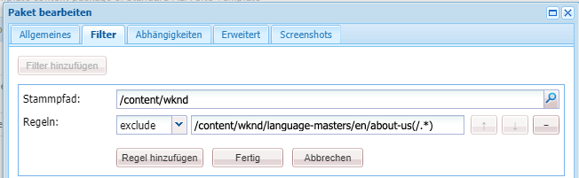

Beim Erstellen von Regeln definieren Sie einen regulären Ausdruck (auch als regex, regexp oder rationaler Ausdruck bezeichnet), um alle Knoten anzugeben, die ein- bzw. ausgeschlossen werden sollen.

| Regeltyp | Beschreibung |
|---|---|
| include | „include“ umfasst alle Dateien und Ordner im angegebenen Verzeichnis, die dem regulären Ausdruck entsprechen. „include“ schließt andere Dateien oder Ordner unter dem angegebenen Stammpfad **nicht** mit ein. |
| exclude | „exclude“ schließt alle Dateien und Ordner aus, die dem regulären Ausdruck entsprechen. |

Paketfilter werden meistens definiert, wenn Sie das Paket [ erstellen](#creating-a-new-package). Sie können jedoch auch später bearbeitet werden. Danach sollte das Paket neu aufgebaut werden, um seinen Inhalt basierend auf den neuen Filterdefinitionen zu aktualisieren.

>[!TIP]
>
>Ein Paket kann mehrere Filterdefinitionen enthalten, sodass sich Knoten von verschiedenen Orten einfach in einem Paket kombinieren lassen.

>[!TIP]
>
>Hintergrundinformationen finden Sie in der Dokumentation [Apache Jackrabbit – Workspace Filter](https://jackrabbit.apache.org/filevault/filter.html).

### Abhängigkeiten {#dependencies}

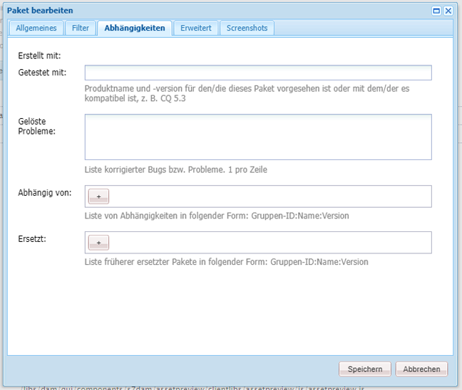

| Feld | Beschreibung | Beispiel/Details |
|---|---|---|
| Getestet mit | Der Produktname und die Version, auf die dieses Paket ausgerichtet ist oder mit denen es kompatibel ist. | `AEMaaCS` |
| Behobene Probleme | Ein Textfeld, in dem Details zu Fehlern aufgelistet werden können, die mit diesem Paket behoben wurden, ein Fehler pro Zeile | - |
| Hängt ab von | Führt andere Pakete auf, die erforderlich sind, damit das aktuelle Paket bei der Installation wie erwartet ausgeführt wird | `groupId:name:version` |
| Ersetzt | Eine Liste veralteter Pakete, die dieses Paket ersetzt | `groupId:name:version` |

### Erweiterte Einstellungen {#advanced-settings}

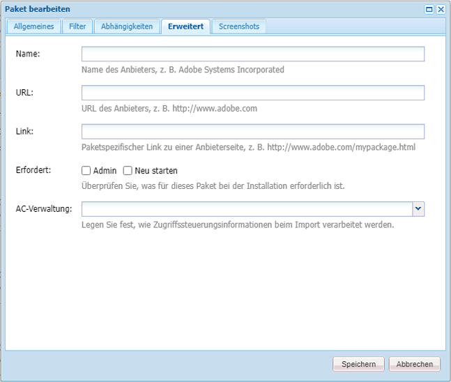

| Feld | Beschreibung | Beispiel/Details |
|---|---|---|
| Name | Der Name des Anbieters des Pakets | `WKND Media Group` |
| URL | URL des Anbieters | `https://wknd.site` |
| Link | Paketspezifischer Link zu einer Anbieterseite | `https://wknd.site/package/` |
| Erfordert | Definiert, ob bei der Installation des Pakets Einschränkungen bestehen | **Admin**: Das Paket darf nur mit Administratorrechten installiert werden <br>**Neustart**: AEM muss nach der Installation des Pakets neu gestartet werden |
| AC-Verwaltung | Legt fest, wie die im Paket definierten Zugriffssteuerungsinformationen beim Importieren des Pakets verarbeitet werden | **Ignorieren**: Beibehalten von ACLs im Repository <br>**Überschreiben**: Überschreiben von ACLs im Repository <br>**Zusammenführen**: Beide ACL-Sätze zusammenführen <br>**MergePreserve**: Zusammenführen der Zugriffskontrolle im Inhalt mit der im Paket enthaltenen durch Hinzufügen der Zugriffssteuerungseinträge von Prinzipalen, die nicht im Inhalt vorhanden sind <br>**Löschen**: Löschen von ACLs |

### Paket-Screenshots {#package-screenshots}

Sie können mehrere Screenshots an Ihr Paket anhängen, um eine visuelle Darstellung des Inhalts zu erhalten.

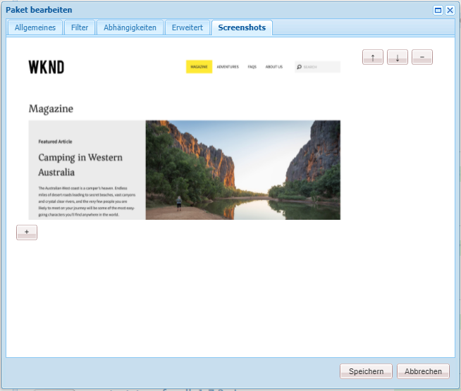

## Paketaktionen {#package-actions}

Es gibt viele Aktionen, die mit einem Paket durchgeführt werden können.

### Erstellen eines Pakets {#creating-a-new-package}

1. [Zugriff auf Package Manager](#accessing).

1. Klicken Sie auf **Paket erstellen**.

   >[!TIP]
   >
   >Wenn Ihre Instanz viele Pakete hat, könnte eine Ordnerstruktur vorhanden sein. In solchen Fällen ist es einfacher, zum erforderlichen Zielordner zu navigieren, bevor Sie das neue Paket erstellen.

1. Geben Sie im Dialogfeld **Neues Paket** die folgenden Felder ein:

   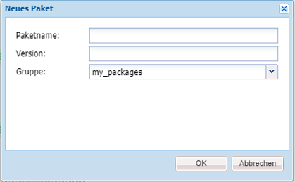

   * **Paketname**: Wählen Sie einen beschreibenden Namen aus, über den Sie (und andere) die Inhalte des Pakets leicht identifizieren können.

   * **Version**: Ein Textfeld zur Eingabe einer Version. Diese wird an den Paketnamen angehängt, um den Namen der ZIP-Datei zu bilden.

   * **Gruppe**: Dies ist der Name der Zielgruppe (oder des Ordners). Gruppen helfen Ihnen bei der Organisation Ihrer Pakete. Es wird ein Ordner für die Gruppe angelegt, falls er noch nicht vorhanden ist. Wenn Sie keinen Gruppennamen eingeben, wird das Paket in der Hauptpaketliste erstellt.

1. Klicken Sie auf **OK**, um das Paket zu erstellen.

1. AEM listet das neue Paket oben in der Liste der Pakete auf.

   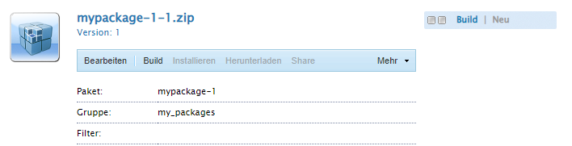

1. Klicken Sie **Bearbeiten**, um den [Paketinhalt](#package-contents) zu definieren. Klicken Sie **Speichern** nachdem Sie die Bearbeitung der Einstellungen abgeschlossen haben.

1. Sie können nun das Paket [aufbauen](#building-a-package).

Es ist nicht zwingend erforderlich, das Paket sofort nach seiner Erstellung aufzubauen. Ein nicht aufgebautes Paket enthält keinen Inhalt und besteht nur aus den Filterdaten und anderen Metadaten des Pakets.

>[!TIP]
>
>Um Zeitüberschreitungen zu vermeiden, empfiehlt Adobe [keine großen Pakete zu erstellen](#package-size).

### Aufbauen eines Pakets {#building-a-package}

Ein Paket wird oft gleich beim [Erstellen des Pakets](#creating-a-new-package) aufgebaut, aber Sie können zu einem späteren Zeitpunkt zurückkehren, um das Paket entweder aufzubauen oder neu aufzubauen. Dies kann nützlich sein, wenn sich der Inhalt im Repository geändert hat oder sich die Paketfilter geändert haben.

1. [Zugriff auf Package Manager](#accessing).

1. Öffnen Sie die Paketdetails in der Paketliste, indem Sie auf den Paketnamen klicken.

1. Klicken Sie auf **Aufbauen**. Ein Dialogfeld fordert Sie auf zu bestätigen, dass Sie das Paket erstellen möchten, da eventuell vorhandene Paketinhalte überschrieben werden.

1. Klicken Sie auf **OK**. AEM baut das Paket auf und listet alle zum Paket hinzugefügten Inhalte so auf, wie dies in der Aktivitätenliste der Fall ist. Nachdem der Vorgang abgeschlossen ist, zeigt AEM eine Bestätigung an, dass das Paket aufgebaut wurde. Zudem aktualisiert AEM die Paketlisteninformationen (wenn Sie das Dialogfeld schließen).

>[!TIP]
>
>Um Zeitüberschreitungen zu vermeiden, empfiehlt Adobe [keine großen Pakete zu erstellen](#package-size).

### Bearbeiten eines Pakets {#edit-package}

Nachdem ein Paket in AEM hochgeladen wurde, können Sie seine Einstellungen ändern.

1. [Zugriff auf Package Manager](#accessing).

1. Öffnen Sie die Paketdetails in der Paketliste, indem Sie auf den Paketnamen klicken.

1. Klicken Sie auf **Bearbeiten** und aktualisieren Sie die **[Paketeinstellungen](#package-settings)** nach Bedarf.

1. Klicken Sie zum Speichern auf **Speichern**.

Möglicherweise müssen Sie [das Paket neu aufbauen](#building-a-package), um seinen Inhalt auf Grundlage der von Ihnen vorgenommenen Änderungen zu aktualisieren.

### Neuverpacken eines Pakets {#rewrapping-a-package}

Sobald ein Paket aufgebaut wurde, kann es neu verpackt werden. Beim Neuverpacken werden die Paketinformationen wie Miniaturansicht, Beschreibung usw. geändert, ohne dass der Inhalt des Pakets geändert wird.

1. [Zugriff auf Package Manager](#accessing).

1. Öffnen Sie die Paketdetails in der Paketliste, indem Sie auf den Paketnamen klicken.

1. Klicken Sie auf **Bearbeiten** und aktualisieren Sie die **[Paketeinstellungen](#package-settings)** nach Bedarf.

1. Klicken Sie zum Speichern auf **Speichern**.

1. Wenn Sie auf **Weiter** > **Neu verpacken** klicken, erscheint ein Dialogfeld, das Sie zur Bestätigung auffordert.

### Anzeigen anderer Paketversionen {#other-versions}

Da jede Version eines Pakets in der Liste ebenso wie jedes andere Paket angezeigt wird, kann Package Manager andere Versionen eines ausgewählten Pakets finden.

1. [Zugriff auf Package Manager](#accessing).

1. Öffnen Sie die Paketdetails in der Paketliste, indem Sie auf den Paketnamen klicken.

1. Wenn Sie auf **Mehr** > **Andere Versionen** klicken, öffnet sich ein Dialogfeld mit einer Liste anderer Versionen desselben Pakets mit Statusinformationen.

### Anzeigen von Paketinhalten und Testen der Installation {#viewing-package-contents-and-testing-installation}

Nach dem Aufbau eines Pakets können Sie dessen Inhalt anzeigen.

1. [Zugriff auf Package Manager](#accessing).

1. Öffnen Sie die Paketdetails in der Paketliste, indem Sie auf den Paketnamen klicken.

1. Um den Inhalt anzuzeigen, klicken Sie auf **Mehr** > **Inhalte**. Package Manager listet dann den vollständigen Paketinhalt im Aktivitätsprotokoll auf.

   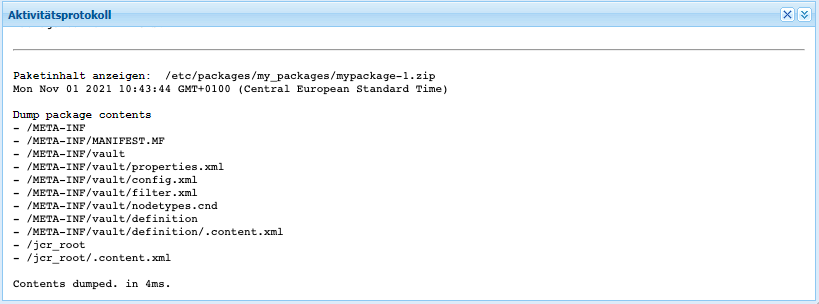

1. Klicken Sie auf **Mehr** > **Installation testen**, um einen Probelauf der Installation durchzuführen. Package Manager berichtet im Aktivitätsprotokoll so über die Ergebnisse, als ob die Installation durchgeführt worden wäre.

   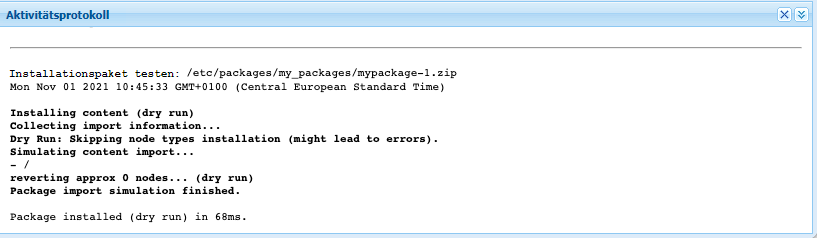

### Herunterladen von Paketen in das Dateisystem {#downloading-packages-to-your-file-system}

1. [Zugriff auf Package Manager](#accessing).

1. Öffnen Sie die Paketdetails in der Paketliste, indem Sie auf den Paketnamen klicken.

1. Klicken Sie auf die Schaltfläche **Herunterladen** oder auf den verknüpften Dateinamen des Pakets im Bereich mit den Paketdetails.

1. AEM lädt das Paket auf Ihren Computer herunter.

>[!TIP]
>
>Um Zeitüberschreitungen zu vermeiden, empfiehlt Adobe [keine großen Pakete zu erstellen](#package-size).

### Hochladen von Paketen vom Dateisystem {#uploading-packages-from-your-file-system}

1. [Zugriff auf Package Manager](#accessing).

1. Klicken Sie auf den Gruppenordner, in den Sie das Paket hochladen wollen.

1. Klicken Sie auf die Schaltfläche **Paket hochladen**.

1. Geben Sie die erforderlichen Informationen zum hochgeladenen Paket an.

   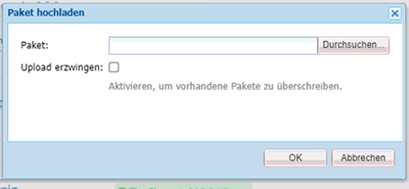

   * **Paket**: Verwenden Sie die Schaltfläche **Durchsuchen...**, um das gewünschte Paket aus Ihrem lokalen Dateisystem auszuwählen.
   * **Hochladen erzwingen**: Wenn bereits ein Paket mit diesem Namen existiert, erzwingt diese Option das Hochladen und überschreibt das vorhandene Paket.

1. Wenn Sie auf **OK** klicken, wird das ausgewählte Paket hochgeladen und die Paketliste entsprechend aktualisiert.

Der Paketinhalt ist jetzt in AEM vorhanden. Um den Inhalt jedoch verfügbar zu machen, müssen Sie sicherstellen, dass Sie das [Paket installieren](#installing-packages).

>[!TIP]
>
>Um Zeitüberschreitungen zu vermeiden, empfiehlt Adobe [keine großen Pakete zu erstellen](#package-size).

### Validieren von Paketen {#validating-packages}

Da Pakete vorhandene Inhalte ändern können, ist es oft nützlich, diese Änderungen vor der Installation zu validieren.

#### Validierungsoptionen {#validation-options}

Package Manager kann die folgenden Validierungen durchführen:

* [OSGi-Paketimporte](#osgi-package-imports)
* [Überlagerungen](#overlays)
* [ACLs](#acls)

##### Validieren von OSGi-Paketimporten {#osgi-package-imports}

>[!NOTE]
>
>Da Pakete nicht zum Bereitstellen von Code in AEMaaCS verwendet werden können, ist die Validierung von **OSGi-Paketimporten** nicht erforderlich.

**Prüfumfang**

Diese Validierung prüft das Paket auf JAR-Dateien (OSGi-Bundles), extrahiert deren `manifest.xml`-Datei (die die versionierten Abhängigkeiten enthält, die für das OSGi-Bundle erforderlich sind) und stellt sicher, dass die AEM-Instanz die Abhängigkeiten mit den richtigen Versionen exportiert.

**Wie die Berichterstellung erfolgt**

Eventuelle versionierte Abhängigkeiten, die von der AEM-Instanz nicht erfüllt werden können, werden im Aktivitätsprotokoll von Package Manager aufgeführt.

**Fehlerstatus**

Wenn Abhängigkeiten nicht erfüllt sind, werden die OSGi-Bundles in dem Paket mit diesen Abhängigkeiten nicht gestartet. Dies führt zu einer fehlerhaften Bereitstellung des Programms, da alle auf dem nicht gestarteten OSGi-Bundle basierenden Prozesse nicht ordnungsgemäß funktionieren.

**Fehlerbehebung**

Um Fehler aufgrund nicht erfüllter OSGi-Bundles zu beheben, muss die Abhängigkeitsversion in dem Bundle mit nicht erfüllten Importen angepasst werden.

##### Bestätigen von Überlagerungen {#overlays}

>[!NOTE]
>
>Da Pakete nicht zum Bereitstellen von Code in AEMaaCS verwendet werden können, ist die Validierung von **Überlagerungen** nicht erforderlich.

**Prüfumfang**

Diese Validierung ermittelt, ob das zu installierende Paket eine Datei enthält, die in der AEM-Zielinstanz bereits überlagert ist.

Beispiel: Bei einer bestehenden Überlagerung unter `/apps/sling/servlet/errorhandler/404.jsp` ändert ein Paket, das `/libs/sling/servlet/errorhandler/404.jsp` enthält, die vorhandene Datei unter `/libs/sling/servlet/errorhandler/404.jsp`.

**Wie die Berichterstellung erfolgt**

Solche Überlagerungen werden im Aktivitätsprotokoll von Package Manager beschrieben.

**Fehlerstatus**

Ein Fehlerstatus bedeutet, dass das Paket versucht, eine bereits überlagerte Datei bereitzustellen. Die Änderungen im Paket werden somit durch die Überlagerung überschrieben (und so „ausgeblendet“) und nicht umgesetzt.

**Fehlerbehebung**

Zur Behebung dieses Problems muss der Verantwortliche für die Überlagerungsdatei unter `/apps` die Änderungen an der überlagerten Datei unter `/libs` überprüfen, die Änderungen nach Bedarf in die Überlagerung ( `/apps`) integrieren und dann die überlagerte Datei erneut bereitstellen.

>[!NOTE]
>
>Der Validierungsmechanismus kann nicht abgleichen, ob der überlagerte Inhalt ordnungsgemäß in die Überlagerungsdatei integriert wurde. Daher berichtet diese Validierung auch weiterhin über Konflikte, selbst wenn die erforderlichen Änderungen vorgenommen wurden.

##### Bestätigen von ACLs {#acls}

**Prüfumfang**

Diese Validierung prüft, welche Berechtigungen hinzugefügt werden, wie sie verarbeitet werden (zusammenführen/ersetzen) und ob die aktuellen Berechtigungen betroffen sind.

**Wie die Berichterstellung erfolgt**

Die Berechtigungen werden im Aktivitätsprotokoll von Package Manager beschrieben.

**Fehlerstatus**

Es können keine expliziten Fehler angegeben werden. Die Validierung gibt lediglich an, ob neue ACL-Berechtigungen hinzugefügt oder durch die Installation des Pakets beeinträchtigt werden.

**Fehlerbehebung**

Anhand der von der Validierung bereitgestellten Informationen können die betroffenen Knoten in CRXDE überprüft und die ACLs nach Bedarf im Paket angepasst werden.

>[!CAUTION]
>
>Als Best Practice wird empfohlen, dass Pakete keine Auswirkungen auf von AEM bereitgestellte ACLs haben sollten, da dies möglicherweise zu unerwartetem Verhalten führen kann.

#### Durchführen der Validierung {#performing-validation}

Die Validierung von Paketen kann auf zwei verschiedene Arten erfolgen:

* [Über die Package Manager-Benutzeroberfläche](#via-package-manager).
* [Über HTTP-POST-Anfragen wie mit cURL](#via-post-request).

Führen Sie die Validierung stets nach dem Hochladen und vor dem Installieren eines Pakets durch.

##### Paketvalidierung über Package Manager {#via-package-manager}

1. [Zugriff auf Package Manager](#accessing).

1. Öffnen Sie die Paketdetails in der Paketliste, indem Sie auf den Paketnamen klicken.

1. Um das Paket zu validieren, klicken Sie auf **Mehr** > **Validieren**.

1. Aktivieren Sie im angezeigten modalen Dialogfeld das Kontrollkästchen der gewünschten Validierungstypen und starten Sie die Validierung durch Klicken auf **Überprüfen**.

1. Die ausgewählten Validierungen werden dann ausgeführt und die Ergebnisse werden im Aktivitätsprotokoll von Package Manager angezeigt.

##### Paketvalidierung über HTTP-POST-Anfrage {#via-post-request}

Die POST-Anfrage hat folgendes Format.

```
https://<host>:<port>/crx/packmgr/service.jsp?cmd=validate&type=osgiPackageImports,overlays,acls
```

Der Parameter `type` kann eine ungeordnete und durch Kommas getrennte Liste aus folgenden Elementen sein:

* `osgiPackageImports`
* `overlays`
* `acls`

Der Wert von `type` ist standardmäßig `osgiPackageImports`, falls kein anderer Wert ausdrücklich angegeben wird.

Wenn Sie cURL verwenden, führen Sie eine Anweisung ähnlich der folgenden aus:

```shell
curl -v -X POST --user admin:admin -F file=@/Users/SomeGuy/Desktop/core.wcm.components.all-1.1.0.zip 'http://localhost:4502/crx/packmgr/service.jsp?cmd=validate&type=osgiPackageImports,overlays,acls'
```

Bei der Validierung über eine POST-Anfrage wird die Antwort als JSON-Objekt zurückgesendet.

### Anzeigen der Paketabdeckung {#package-coverage}

Pakete werden durch ihre Filter definiert. Sie können Package Manager anweisen, Filter eines Pakets auf Ihren vorhandenen Repository-Inhalt anzuwenden, um anzuzeigen, welcher Inhalt des Repositorys von der Filterdefinition des Pakets abgedeckt wird.

1. [Zugriff auf Package Manager](#accessing).

1. Öffnen Sie die Paketdetails in der Paketliste, indem Sie auf den Paketnamen klicken.

1. Klicken Sie auf **Mehr** > **Abdeckung**.

1. Die Details zur Abdeckung sind im Aktivitätsprotokoll aufgeführt.

### Installieren von Paketen {#installing-packages}

Beim Hochladen eines Pakets wird nur der Paketinhalt zum Repository hinzugefügt, das Paket ist jedoch nicht verfügbar. Sie müssen das hochgeladene Paket installieren, um den Inhalt des Pakets verwenden zu können.

>[!CAUTION]
>
>Beim Installieren eines Pakets können vorhandene Inhalte überschrieben oder gelöscht werden. Laden Sie ein Paket nur hoch, wenn Sie sich sicher sind, dass dadurch keine benötigten Inhalte gelöscht oder überschrieben werden.

Vor der Installation Ihres Pakets erstellt Package Manager automatisch ein Snapshot-Paket, das den Inhalt enthält, der überschrieben wird. Dieser Snapshot wird wieder installiert, falls Sie das Paket deinstallieren.

1. [Zugriff auf Package Manager](#accessing).

1. Öffnen Sie in der Paketliste die Paketdetails des Pakets, das Sie installieren möchten, indem Sie auf den Paketnamen klicken.

1. Klicken Sie entweder auf die Schaltfläche **Installieren** in den Paketdetails oder auf den Link **Installieren** im Paketstatus.

1. Es erscheint ein Dialogfeld, in dem Sie zur Bestätigung aufgefordert werden und zusätzliche Optionen angeben können.

   * **Nur extrahieren**: Das Paket wird nur extrahiert, sodass kein Snapshot erstellt wird und daher keine Deinstallation möglich ist.
   * **Speicherschwelle**: Anzahl der transienten Knoten, bis das automatische Speichern ausgelöst wird (erhöhen Sie die Anzahl, wenn Sie Ausnahmen für gleichzeitige Änderungen feststellen)
   * **Unterpakete extrahieren**: Aktiviert die automatische Extraktion von Unterpaketen
   * **Verwaltung der Zugriffssteuerung**: Gibt an, wie die im Paket definierten Zugriffssteuerungsinformationen verarbeitet werden, wenn das Paket installiert wird (die Optionen sind die gleichen wie bei den [erweiterten Paketeinstellungen](#advanced-settings))
   * **Umgang mit Abhängigkeiten**: Legt fest, wie Abhängigkeiten während der Installation verarbeitet werden

1. Klicken Sie auf **Installieren**.

1. Im Aktivitätsprotokoll wird der Fortschritt der Installation beschrieben.

Sobald die Installation abgeschlossen und erfolgreich war, wird die Paketliste aktualisiert und das Wort **Installiert** im Paketstatus angezeigt.

### Neuinstallation von Paketen {#reinstalling-packages}

Bei der Neuinstallation von Paketen werden für ein bereits installiertes Paket die gleichen Schritte ausgeführt, die auch bei der [Erstinstallation des Pakets) ](#installing-packages) werden.

### Dateisystembasiertes Hochladen und Installieren {#file-system-based-upload-and-installation}

Sie können bei der Installation von Paketen ganz auf Package Manager verzichten. AEM kann Pakete erkennen, die an einem bestimmten Speicherort im lokalen Dateisystem des Host-Computers abgelegt werden, und diese automatisch hochladen und installieren.

1. Unter dem AEM Installationsordner befindet sich ein Ordner `crx-quicksart` neben der JAR-Datei und der `license.properties`-Datei. Erstellen Sie einen Ordner mit dem Namen `install` under `crx-quickstart`, was zu einem Pfad `<aem-home>/crx-quickstart/install` führt.

1. Fügen Sie in diesem Ordner Ihre Pakete hinzu. Sie werden automatisch auf Ihre Instanz hochgeladen und dort installiert.

1. Nach dem Hochladen und der Installation können Sie die Pakete in Package Manager sehen, als hätten Sie sie über die Package Manager-Benutzeroberfläche installiert.

Wenn die Instanz ausgeführt wird, beginnen das Hochladen und die Installation sofort, wenn Sie sie zum Paket zum Ordner `install` hinzufügen

Wenn die Instanz nicht ausgeführt wird, werden Pakete, die sich im Ordner `install` befinden, beim Start in alphabetischer Reihenfolge installiert.

### Deinstallieren von Paketen {#uninstalling-packages}

Durch die Deinstallation eines Pakets wird der Inhalt des Repositorys auf den Schnappschuss zurückgesetzt, der von Package Manager vor der Installation automatisch erstellt wurde.

1. [Zugriff auf Package Manager](#accessing).

1. Öffnen Sie die Paketdetails des Pakets, das Sie deinstallieren möchten, indem Sie in der Paketliste auf den Paketnamen klicken.

1. Klicken Sie auf **Mehr** > **Deinstallieren**, um den Inhalt dieses Pakets aus dem Repository zu entfernen.

1. Es wird ein Dialogfeld mit einer Liste aller vorgenommenen Änderungen und der Aufforderung zur Bestätigung angezeigt.

1. Das Paket wird entfernt und durch den Snapshot ersetzt. Der Fortschritt des Prozesses wird im Aktivitätsprotokoll angezeigt.

### Löschen von Paketen {#deleting-packages}

Beim Löschen eines Pakets werden nur dessen Details aus Package Manager gelöscht. Falls dieses Paket bereits installiert wurde, werden die installierten Inhalte nicht gelöscht.

1. [Zugriff auf Package Manager](#accessing).

1. Öffnen Sie die Paketdetails des Pakets, das Sie aus der Paketliste löschen möchten, indem Sie auf den Paketnamen klicken.

1. Daraufhin werden sie von AEM aufgefordert zu bestätigen, dass Sie das Paket löschen möchten. Klicken Sie auf **OK**, um den Löschvorgang zu bestätigen.

1. Die Paketinformationen werden gelöscht und die Details im Aktivitätsprotokoll aufgeführt.

### Replizieren von Paketen {#replicating-packages}

Replizieren Sie den Inhalt eines Pakets, um es auf der Veröffentlichungsinstanz zu installieren.

1. [Zugriff auf Package Manager](#accessing).

1. Öffnen Sie in der Paketliste die Paketdetails des Pakets, das Sie replizieren möchten, indem Sie auf den Paketnamen klicken.

1. Klicken Sie auf **Mehr** > **Replizieren**.

1. Das Paket wird repliziert und Details im Aktivitätsprotokoll aufgeführt.

## Software-Verteilung {#software-distribution}

AEM-Pakete können verwendet werden, um Inhalte über AEMaaCS-Umgebungen hinweg zu erstellen und freizugeben.

[Software-Verteilung](https://downloads.experiencecloud.adobe.com) stellt AEM-Pakete für die Verwendung im lokalen AEM SDK zur Entwicklung bereit. AEM-Pakete, die über Software-Verteilung bereitgestellt werden, dürfen nicht in Cloud-Umgebungen von AEMaaCS installiert werden, es sei denn, dies wird ausdrücklich vom Adobe-Support genehmigt.

Weitere Informationen finden Sie unter [Software Distribution-Dokumentation](https://experienceleague.adobe.com/docs/experience-cloud/software-distribution/home.html?lang=de).
