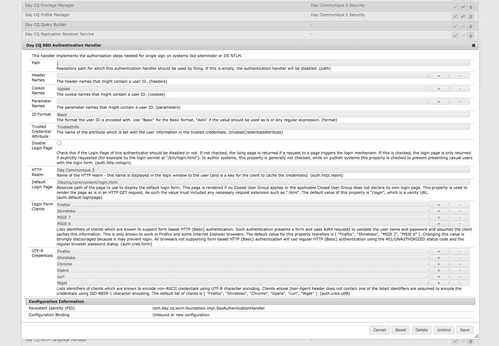
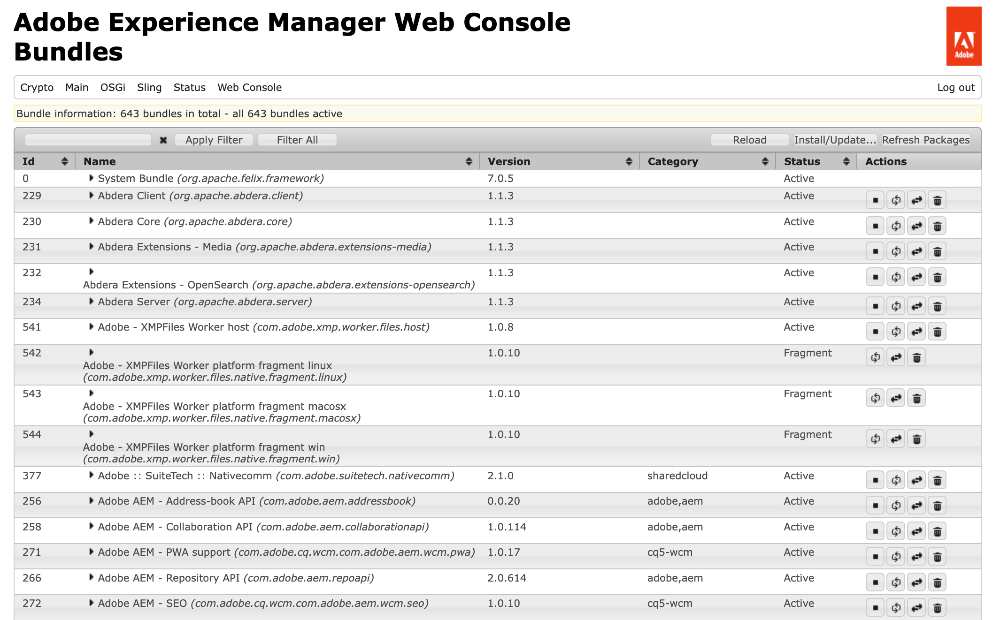
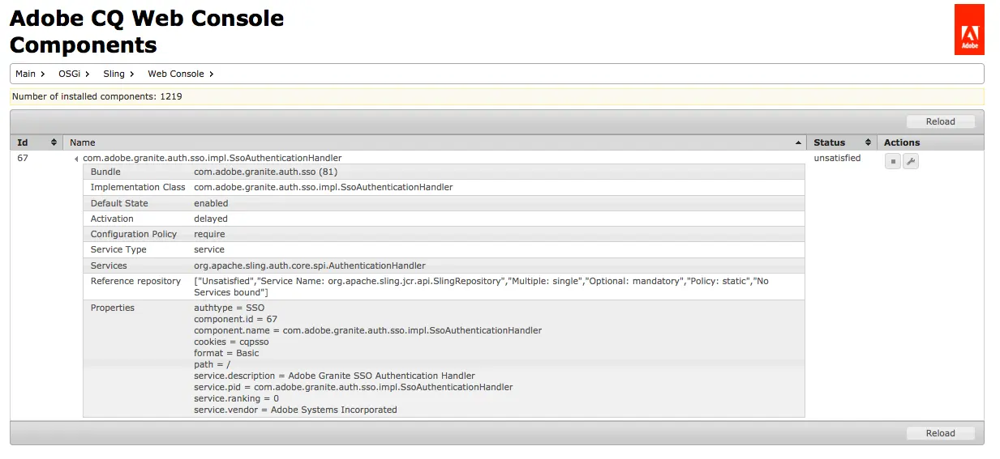

# Web-Konsole {#web-console}

Erfahren Sie, wie Sie mit der Web-Konsole von Adobe Experience Manager (AEM) OSGi-Einstellungen und -Bundles für die lokale Entwicklung verwalten können.

## Überblick {#overview}

AEM as a Cloud Service behandelt [Konfiguration und Code zur Laufzeit als unveränderlich.](/help/release-notes/aem-cloud-changes.md#apps-libs-immutable) Das bedeutet, dass alle Konfigurationen so bereitgestellt werden müssen, wie Sie es in einer Produktionsumgebung tun würden. Für Produktionsinstanzen stellt dies sicher, dass Quality Gates bestanden werden, und bietet ein Maß an Stabilität und Klarheit Ihrer aktuellen Umgebung.

Zu Entwicklungszwecken sind jedoch häufig OSGi-Konfigurationsaktualisierungen und Bundle-Änderungen erforderlich, um Ad-hoc-Entwicklungsänderungen zu testen. Im Rahmen von AEM as a Cloud Service SDK ermöglicht die Web-Konsole Folgendes. Weitere Informationen [&#x200B; OSGi-Konfigurationen für AEM as a Cloud Service finden Sie &#x200B;](/help/implementing/deploying/configuring-osgi.md) Dokument Konfigurieren von OSGi für Adobe Experience Manager as a Cloud Service .

Der Zugriff auf die Konsole ist über `http://<host>:<port>/system/console` möglich

Die Web-Konsole bietet eine Auswahl von Bildschirmen zur Verwaltung der OSGi-Bundles, darunter:

* [Konfiguration](#configuration): wird zum Konfigurieren der OSGi-Bundles verwendet und ist daher der zugrunde liegende Mechanismus zum Konfigurieren der AEM-Systemparameter.
* [Bundles](#bundles): wird für die Installation von Bundles verwendet
* [Komponenten](#components): dient zur Kontrolle der Status der für AEM erforderlichen Komponenten

Alle vorgenommenen Änderungen werden sofort auf das laufende Entwicklungssystem angewendet. Es ist kein Neustart erforderlich.

In der Web-Konsole beziehen sich alle Beschreibungen, in denen Standardeinstellungen erwähnt werden, auf die Sling-Standardeinstellungen. Für AEM gelten eigene Standardeinstellungen, sodass sich die festgelegten Standardeinstellungen möglicherweise von denen der Konsole unterscheiden.

Die Web-Konsole in Adobe Experience Manager (AEM) basiert auf der [Apache Felix Web Management Console](https://felix.apache.org/documentation/subprojects/apache-felix-web-console.html). Apache Felix ist ein Gemeinschaftsprojekt zur Implementierung der OSGi R4-Dienstplattform, die das OSGi-Framework und Standarddienste umfasst.

>[!NOTE]
>
>Die Web-Konsole ist in der AEM as a Cloud Service SDK nur für lokale Entwicklungszwecke verfügbar. Es ist nicht in der Produktion verfügbar.

>[!TIP]
>
>Um den Status Ihrer OSGi-Konfigurationen, -Bundles und -Komponenten in einer Produktionsumgebung zu überprüfen, verwenden Sie die [Developer Console.](/help/implementing/developing/introduction/aem-developer-console.md)

## Konfiguration {#configuration}

Der **Konfiguration** wird zur Konfiguration von OSGi-Bundles verwendet und ist daher der zugrunde liegende Mechanismus zur Konfiguration von AEM-Systemparametern. Auf die Registerkarte **Konfiguration** kann unter anderem wie folgt zugegriffen werden:

* Das Dropdown-Menü: **OSGi -> Konfiguration**
* URL: `http://<host>:<port>/system/console/configMgr`

Eine Liste der Konfigurationen wird angezeigt:

Es gibt zwei Arten von Konfigurationen, die in den Dropdown-Listen auf diesem Bildschirm verfügbar sind:

* **Konfigurationen** ermöglichen es Ihnen, die vorhandenen Konfigurationen zu aktualisieren. Diese weisen eine persistente Identität (PID) auf und können Folgendes sein:
   * Standard und integraler Bestandteil von AEM - Diese sind erforderlich. Beim Löschen werden die Werte auf die Standardeinstellungen zurückgesetzt.
   * Instanzen, die aus Werkskonfigurationen erstellt wurden - Diese Instanzen werden vom Benutzer erstellt. Durch Löschen wird die Instanz entfernt.
* **Werkskonfigurationen** ermöglichen das Erstellen einer Instanz des erforderlichen Funktionsobjekts. Diese wird einer persistenten Identität zugewiesen und dann in der Dropdown-Liste mit den Konfigurationen aufgeführt.

Bei Auswahl eines Eintrags aus den Listen werden die Parameter für die Konfiguration angezeigt:

Die Parameter können dann ggf. aktualisiert werden und Sie können unter folgenden Optionen wählen:

* **Speichern**, um die vorgenommenen Änderungen zu speichern.
   * Bei einer Factory-Konfiguration wird dadurch eine Instanz mit einer persistenten Identität erstellt.
   * Die neue Instanz wird dann unter „Konfigurationen“ aufgelistet.
* **Zurücksetzen**, um die auf dem Bildschirm angezeigten Parameter auf die zuletzt gespeicherten zurückzusetzen.
* **Löschen**, um die aktuelle Konfiguration zu löschen.
   * Bei einer Standardinstanz werden die Parameter auf die Standardeinstellungen zurückgesetzt.
   * Wenn er über eine Werkskonfiguration erstellt wurde, wird die spezifische Instanz gelöscht.
* **Bindung aufheben** um die aktuelle Konfiguration vom Bundle aufzuheben.
* **Abbrechen**, um alle aktuellen Änderungen zu verwerfen.

>[!TIP]
>
>Siehe [OSGi-Konfiguration mit der Web-Konsole](/help/implementing/deploying/configuring-osgi.md) für weitere Informationen.

## Bundles {#bundles}

Der Bildschirm **Bundles** wird verwendet, um die für AEM erforderlichen OSGi-Bundles zu installieren. Der Zugriff auf den Bildschirm erfolgt über eine der folgenden Methoden:

* Das Dropdown-Menü: **OSGi -> Bundles**
* URL: `http://<host>:<port>/system/console/bundles`

Eine Liste mit Paketen wird angezeigt:

Auf diesem Bildschirm haben Sie folgende Möglichkeiten:

* **Installieren oder Aktualisieren**, um ein neues Bundle zu installieren oder ein vorhandenes Bundle zu aktualisieren.
   * Hiermit können Sie nach der Datei mit Ihrem Bundle **suchen** und festlegen, ob dieses sofort **gestartet** werden soll, und mit welcher **Startebene**.
* **Neu laden**, um die angezeigte Liste zu aktualisieren.
* **Pakete aktualisieren** um die Verweise aller Pakete zu überprüfen und nach Bedarf zu aktualisieren.
   * So werden möglicherweise nach einer Aktualisierung sowohl die alte als auch die neue Version aufgrund vorheriger Verweise weiter ausgeführt. Diese Option prüft und transferiert alle Verweise auf die neue Version, sodass die alte Version gestoppt werden kann.
* **Start**, um ein Bundle entsprechend der angegebenen Startebene zu starten.
* **Anhalten**, um das Paket anzuhalten.
* **Deinstallieren**, um das Paket vom System zu deinstallieren.

Die Liste gibt den Status des Bundles an. Klicken Sie auf den Namen eines bestimmten Bundles, um weitere Informationen anzuzeigen.

>[!TIP]
>
>Nach **Aktualisieren** empfiehlt Adobe, auf „Pakete **&quot;** klicken.

## Komponenten {#components}

Auf dem **Komponenten** können Sie Komponenten aktivieren und deaktivieren. Sie können mit einer der beiden folgenden Methoden auf die Registerkarte zugreifen:

* Das Dropdown-Menü: **Main -> Komponenten**

* URL: `http://<host>:<port>/system/console/components`

Eine Liste der Komponenten wird angezeigt. Eine Reihe von Symbolen steht zur Verfügung, mit denen Sie die Komponenten aktivieren, deaktivieren oder ggf. Konfigurationsdetails für eine bestimmte Komponente öffnen können.

Klicken Sie auf den Namen einer bestimmten Komponente, um weitere Informationen zu deren Status anzuzeigen. Hier können Sie die Komponente auch aktivieren, deaktivieren oder neu laden.

>[!NOTE]
>
>Das Aktivieren oder Deaktivieren einer Komponente gilt nur, bis SDK neu gestartet wird.
>
>Der Startstatus wird innerhalb des Komponentendeskriptors definiert, der während der Entwicklung generiert und zum Zeitpunkt der Paketerstellung im Paket gespeichert wird.

## Generieren von OSGi-Konfigurationen {#generating-osgi-configs}

Die Web-Konsole kann verwendet werden, um OSGi-Komponenten zu konfigurieren und OSGi-Konfigurationen als JSON zu exportieren. Dies ist nützlich, um von AEM bereitgestellte OSGi-Komponenten zu konfigurieren, deren OSGi-Eigenschaften und deren Werteformate vom Entwickler, der die OSGi-Konfigurationen im AEM-Projekt definiert, möglicherweise nicht gut verstanden werden.

Weitere Informationen finden Sie [&#x200B; Dokument „Konfigurieren von OSGi &#x200B;](/help/implementing/deploying/configuring-osgi.md#generating-osgi-configurations-using-the-web-console) Adobe Experience Manager as a Cloud Service&quot;.
