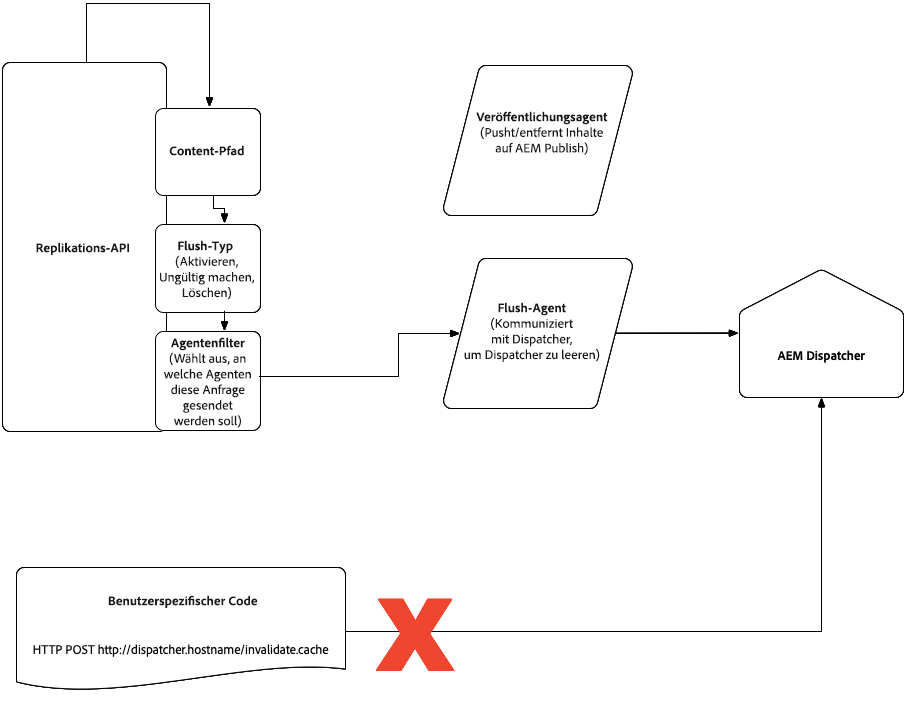

# Einführung {#intro}

Traffic wird über das CDN an eine Apache-Webserver-Ebene geleitet, welche die Module einschließlich des Dispatchers unterstützt. Um die Leistung zu steigern, wird der Dispatcher hauptsächlich als Cache verwendet, um die Verarbeitung auf den Veröffentlichungsknoten zu begrenzen.
Auf die Dispatcher-Konfiguration können Regeln angewendet werden, um die Standardeinstellungen für den Cache-Ablauf zu ändern, was zum Caching im CDN führt. Der Dispatcher berücksichtigt auch die resultierenden Kopfzeilen zur Gültigkeitsdauer des Caches, wenn `enableTTL` in der Dispatcher-Konfiguration aktiviert ist. Dies bedeutet, dass bestimmte Inhalte auch dann aktualisiert werden, wenn sie nicht erneut veröffentlicht werden.

Auf dieser Seite wird auch beschrieben, wie der Dispatcher-Cache invalidiert wird und wie das Caching auf Browser-Ebene in Bezug auf Client-seitige Bibliotheken funktioniert.

## Caching {#caching}

Das Caching von HTTP-Antworten im CDN von AEM as a Cloud Service wird durch die folgenden HTTP-Antwort-Header aus der Quelle gesteuert: `Cache-Control`, `Surrogate-Control` oder `Expires`.

Diese Cache-Header werden normalerweise in vhost-Konfigurationen in AEM Dispatcher mithilfe von mod_headers festgelegt, können aber auch in benutzerdefiniertem Java™-Code festgelegt werden, der in AEM Publish selbst ausgeführt wird (siehe [Aktivieren des CDN-Cachings](https://experienceleague.adobe.com/de/docs/experience-manager-learn/cloud-service/caching/how-to/enable-caching)).

Der Cache-Schlüssel für CDN-Ressourcen enthält die vollständige Anfrage-URL, einschließlich Abfrageparametern, sodass bei jedem unterschiedlichen Abfrageparameter ein anderer Cache-Eintrag erzeugt wird. Entfernen Sie ggf. unerwünschte Abfrageparameter. [Nachstehend](#marketing-parameters) finden Sie Informationen dazu, wie Sie die Cache-Trefferquote verbessern können.

Ursprungsantworten, die `private`, `no-cache` oder `no-store` in `Cache-Control` enthalten, werden nicht vom CDN von AEM as a Cloud Service zwischengespeichert (weitere Informationen finden [So deaktivieren Sie die CDN](https://experienceleague.adobe.com/de/docs/experience-manager-learn/cloud-service/caching/how-to/disable-caching)Zwischenspeicherung).  Zudem werden Antworten, die Cookies setzen, also einen `Set-Cookie`-Antwort-Header aufweisen, nicht vom CDN zwischengespeichert.

### HTML/Text {#html-text}

Die Dispatcher-Konfiguration legt einige standardmäßige Caching-Header für den Content-Typ `text/html` fest.

* standardmäßig wird vom Browser fünf Minuten lang zwischengespeichert, basierend auf der `cache-control`-Kopfzeile, die von der Apache-Ebene ausgegeben wird. Das CDN berücksichtigt diesen Wert ebenfalls.
* Die Standardeinstellung für die HTML/Text-Zwischenspeicherung kann deaktiviert werden, indem die Variable `DISABLE_DEFAULT_CACHING` in `global.vars` definiert wird:

```
Define DISABLE_DEFAULT_CACHING
```

Diese Methode kann beispielsweise nützlich sein, wenn die Geschäftslogik eine Feinabstimmung der Alters-Kopfzeile erfordert (mit einem Wert, der auf dem Kalendertag basiert), da die Alters-Kopfzeile standardmäßig auf 0 eingestellt ist. Allerdings sollten Sie **beim Deaktivieren der Standard-Zwischenspeicherung vorsichtig sein**.

* Sie kann für alle HTML-/Textinhalte überschrieben werden, indem die Variable `EXPIRATION_TIME` in `global.vars` mithilfe der Dispatcher-Tools des AEM as a Cloud Service-SDK definiert wird.
* kann mit den folgenden `mod_headers`-Anweisungen von Apache auf einer detaillierteren Ebene überschrieben werden, einschließlich der unabhängigen Steuerung von CDN- und Browser-Cache:

  ```
  <LocationMatch "^/content/.*\.(html)$">
       Header set Cache-Control "max-age=200"
       Header set Surrogate-Control "max-age=3600"
       Header set Age 0
  </LocationMatch>
  ```

  >[!NOTE]
  >Die Surrogate-Control-Kopfzeile gilt für das von Adobe verwaltete CDN. Wenn ein [kundenseitig verwaltetes CDN](https://experienceleague.adobe.com/docs/experience-manager-cloud-service/content/implementing/content-delivery/cdn.html?lang=de#point-to-point-CDN) verwendet wird, kann je nach CDN-Provider eine andere Kopfzeile erforderlich sein.

  Gehen Sie beim Festlegen von globalen Kopfzeilen zur Cache-Steuerung oder ähnlichen Cache-Kopfzeilen, die einem weit gefassten regulären Ausdruck entsprechen, umsichtig vor, damit sie nicht auf private Inhalte angewendet werden, die andere nicht einsehen sollen. Erwägen Sie, mehrere Anweisungen zu verwenden, um sicherzustellen, dass die Regeln detailliert angewendet werden. AEM as a Cloud Service entfernt die Cache-Kopfzeile, wenn festgestellt wird, dass sie auf ein Objekt angewendet wurde, welches der Dispatcher als nicht zwischenspeicherbar eingestuft hat, wie in der Dispatcher-Dokumentation beschrieben. Um AEM zu zwingen, die Caching-Kopfzeilen immer anzuwenden, können Sie folgendermaßen die Option **`always`** hinzufügen:

  ```
  <LocationMatch "^/content/.*\.(html)$">
       Header unset Cache-Control
       Header unset Expires
       Header always set Cache-Control "max-age=200"
       Header set Age 0
  </LocationMatch>
  ```

  Stellen Sie sicher, dass eine Datei unter `src/conf.dispatcher.d/cache` die folgende Regel enthält (die sich in der Standardkonfiguration befindet):

  ```
  /0000
  { /glob "*" /type "allow" }
  ```

* Um zu verhindern, dass bestimmte Inhalte **im CDN** zwischengespeichert werden, setzen Sie die Cache-Control-Kopfzeile auf *Privat*. Das Folgende würde beispielsweise verhindern, dass HTML-Inhalte in einem Verzeichnis mit dem Namen **secure** im CDN zwischengespeichert werden:

  ```
     <LocationMatch "/content/secure/.*\.(html)$">.  // replace with the right regex
     Header unset Cache-Control
     Header unset Expires
     Header always set Cache-Control "private"
    </LocationMatch>
  ```

* Während HTML-Inhalte, die als privat festgelegt sind, nicht im CDN zwischengespeichert werden, können sie beim Dispatcher zwischengespeichert werden, wenn die [Zwischenspeicherung unter Berücksichtigung von Berechtigungen](https://experienceleague.adobe.com/docs/experience-manager-dispatcher/using/configuring/permissions-cache.html?lang=de) konfiguriert ist, sodass der Inhalt nur autorisierten Benutzenden bereitgestellt wird.

  >[!NOTE]
  >Andere Methoden, einschließlich des [AEM ACS Commons-Projekts „dispatcher-ttl“](https://adobe-consulting-services.github.io/acs-aem-commons/features/dispatcher-ttl/), überschreiben Werte nicht erfolgreich.

  >[!NOTE]
  >Der Dispatcher speichert möglicherweise weiterhin Inhalte gemäß seinen eigenen [Zwischenspeicherungsregeln](https://experienceleague.adobe.com/docs/experience-cloud-kcs/kbarticles/KA-17497.html?lang=de) zwischen. Damit der Inhalt wirklich privat bleibt, stellen Sie sicher, dass er nicht vom Dispatcher zwischengespeichert wird.

### Client-seitige Bibliotheken (js, css) {#client-side-libraries}

* Bei Verwendung des Client-seitigen Bibliotheks-Frameworks von AEM wird JavaScript- und CSS-Code so generiert, dass Browser ihn unbegrenzt zwischenspeichern können, da alle Änderungen als neue Dateien mit einem eindeutigen Pfad manifestiert werden. Mit anderen Worten: HTML-Code, der auf die Client-Bibliotheken verweist, wird nach Bedarf erstellt, damit Kundinnen und Kunden neue Inhalte gleich nach der Veröffentlichung erleben können. Die Cache-Steuerung ist bei älteren Browsern, die den Wert „unveränderlich“ nicht berücksichtigen, auf „unveränderlich“ oder auf 30 Tage eingestellt.
* Weitere Informationen finden Sie im Abschnitt [Client-seitige Bibliotheken und Versionskonsistenz](#content-consistency).

### Bilder und alle Inhalte, die groß genug sind, um im Blob-Speicher gespeichert zu werden {#images}

Das Standardverhalten von Programmen, die nach Mitte Mai 2022 erstellt wurden (insbesondere bei Programm-IDs über 65000), besteht darin, standardmäßig zwischenzuspeichern. Dabei wird auch der Authentifizierungskontext der Anfrage berücksichtigt. Ältere Programme (Programm-IDs kleiner oder gleich 65000) speichern Blob-Inhalte nicht standardmäßig.

In beiden Fällen können die Caching-Kopfzeilen auf einer detaillierteren Ebene auf Apache-/Dispatcher-Ebene überschrieben werden, indem die `mod_headers`-Anweisungen von Apache verwendet werden, Beispiel: 

```
   <LocationMatch "^/content/.*\.(jpeg|jpg)$">
     Header set Cache-Control "max-age=222"
     Header set Age 0
   </LocationMatch>
```

Achten Sie beim Ändern der Caching-Header auf der Dispatcher-Ebene darauf, nicht zu weitläufig zwischenzuspeichern. Siehe die Diskussion im Abschnitt HTML/Text [oben](#html-text). Stellen Sie außerdem sicher, dass Assets, die privat bleiben sollen (und nicht zwischengespeichert werden sollen), nicht Teil der Filter der Anweisung `LocationMatch` sind.

JCR-Ressourcen (größer als 16 KB), die im Blob Store gespeichert sind, werden von AEM normalerweise als 302-Weiterleitungen bereitgestellt. Diese Weiterleitungen werden abgefangen, ihnen wird vom CDN gefolgt und der Inhalt wird direkt aus dem Blob Store bereitgestellt. Für diese Antworten kann nur eine begrenzte Anzahl von Kopfzeilen angepasst werden. Zum Beispiel sollten Sie zum Anpassen von `Content-Disposition` die Dispatcher-Anweisungen wie folgt verwenden:

```
<LocationMatch "\.(?i:pdf)$">
  ForceType application/pdf
  Header set Content-Disposition inline
  </LocationMatch>
```

Die Liste der Kopfzeilen, die für Blob-Antworten angepasst werden können, lautet wie folgt:

```
content-security-policy
x-frame-options
x-xss-protection
x-content-type-options
x-robots-tag
access-control-allow-origin
content-disposition
permissions-policy
referrer-policy
x-vhost
content-disposition
cache-control
vary
```

#### Neues Caching-Standardverhalten {#new-caching-behavior}

Die AEM-Ebene legt die Cache-Header abhängig davon fest, ob der Cache-Header bereits festgelegt wurde, und abhängig vom Wert des Anfragetyps. Beachten Sie, dass öffentliche Inhalte zwischengespeichert werden und authentifizierter Traffic auf „Privat“ festgelegt wird, wenn kein Cache-Control-Header festgelegt wurde. Wenn ein Cache-Control-Header festgelegt ist, bleiben die Cache-Header unberührt.

| Cache-Control-Kopfzeile vorhanden? | Abfragetyp | AEM legt Cache-Kopfzeile wie folgt fest |
|------------------------------|---------------|------------------------------------------------|
| Nein | Öffentlich | Cache-Control: public, max-age=600, immutable |
| Nein | Authentifiziert | Cache-Control: private, max-age=600, immutable |
| Ja | Beliebig | Unverändert |

Obwohl es nicht empfohlen wird, ist es möglich, das neue Standardverhalten so zu ändern, dass es dem älteren Verhalten folgt (Programm-IDs kleiner/gleich 65000), indem die Cloud Manager-Umgebungsvariable `AEM_BLOB_ENABLE_CACHING_HEADERS` auf „false“ festgelegt wird.

#### Älteres Caching-Standardverhalten {#old-caching-behavior}

Die AEM-Ebene speichert Blob-Inhalte nicht standardmäßig zwischen.

>[!NOTE]
>Ändern Sie das ältere Standardverhalten so, dass es dem neuen Verhalten entspricht (Programm-IDs, die höher als 65000 sind), indem Sie die Cloud Manager-Umgebungsvariable AEM_BLOB_ENABLE_CACHING_HEADERS auf „true“ festlegen. Wenn das Programm bereits live ist, stellen Sie sicher, dass sich der Inhalt nach den Änderungen wie erwartet verhält.

Jetzt können Bilder im Blob-Speicher, die als „privat“ gekennzeichnet sind, nicht mehr unter Verwendung von [Zwischenspeicherung unter Berücksichtigung von Berechtigungen](https://experienceleague.adobe.com/docs/experience-manager-dispatcher/using/configuring/permissions-cache.html?lang=de) beim Dispatcher zwischengespeichert werden. Das Bild wird immer von der AEM-Quelle angefordert und bereitgestellt, sofern die Person über die entsprechenden Berechtigungen verfügt.

>[!NOTE]
>Andere Methoden, einschließlich des [AEM ACS Commons-Projekts „dispatcher-ttl“](https://adobe-consulting-services.github.io/acs-aem-commons/features/dispatcher-ttl/), überschreiben die Werte nicht erfolgreich.

### Andere Inhaltsdateitypen im Knotenspeicher {#other-content}

* Kein standardmäßiges Caching
* Die Standardeinstellung kann nicht mit der für HTML-/Textdateitypen verwendeten `EXPIRATION_TIME`-Variablen gesetzt werden
* Der Cache-Ablauf kann mit derselben LocationMatch-Strategie festgelegt werden, die im Abschnitt „HTML/Text“ beschrieben wird, indem der entsprechende Regex angegeben wird

### Weitere Optimierungen {#further-optimizations}

* Vermeiden Sie die Verwendung von `User-Agent` als Teil der `Vary`-Kopfzeile. Ältere Versionen der standardmäßigen Dispatcher-Einrichtung (vor Archetyp-Version 28) enthielten sie, und Adobe empfiehlt, sie mithilfe der folgenden Schritte zu entfernen.
   * Suchen Sie die vhost-Dateien in `<Project Root>/dispatcher/src/conf.d/available_vhosts/*.vhost`.
   * Entfernen Sie die Zeile `Header append Vary User-Agent env=!dont-vary` aus allen vhost-Dateien, mit Ausnahme von „default.vhost“, die schreibgeschützt ist.
* Verwenden Sie die `Surrogate-Control`-Kopfzeile, um das CDN-Caching unabhängig vom Browser-Caching zu steuern.
* Sie könnten die Anweisungen [`stale-while-revalidate`](https://developer.mozilla.org/en-US/docs/Web/HTTP/Headers/Cache-Control#stale-while-revalidate) und [`stale-if-error`](https://developer.mozilla.org/en-US/docs/Web/HTTP/Headers/Cache-Control#stale-if-error) anwenden, um eine Hintergrundaktualisierung zu ermöglichen und Cache-Fehler zu vermeiden, sodass Ihr Inhalt für Benutzerinnen und Benutzer schnell und aktuell verfügbar bleibt.
   * Es gibt viele Möglichkeiten, diese Anweisungen anzuwenden. Es ist jedoch ein guter Ausgangspunkt, `stale-while-revalidate` mit 30 Minuten für alle Cache-Control-Header hinzuzufügen.
* Im Folgenden finden Sie einige Beispiele für verschiedene Inhaltstypen, die Sie beim Einrichten Ihrer eigenen Caching-Regeln als Anleitung verwenden können. Bedenken und testen Sie Ihr spezifisches Setup und die Anforderungen sorgfältig:

   * Speichern Sie veränderliche Client-Bibliotheksressourcen für 12 Stunden im Cache zwischen und führen Sie nach 12 Stunden eine Aktualisierung im Hintergrund aus.

     ```
     <LocationMatch "^/etc\.clientlibs/.*\.(?i:json|png|gif|webp|jpe?g|svg)$">
        Header set Cache-Control "max-age=43200,stale-while-revalidate=43200,stale-if-error=43200,public" "expr=%{REQUEST_STATUS} < 400"
        Header set Age 0
     </LocationMatch>
     ```

   * Speichern Sie unveränderliche Client-Bibliotheksressourcen langfristig (30 Tage) mit einer Hintergrundaktualisierung zwischen, um Fehler zu vermeiden.

     ```
     <LocationMatch "^/etc\.clientlibs/.*\.(?i:js|css|ttf|woff2)$">
        Header set Cache-Control "max-age=2592000,stale-while-revalidate=43200,stale-if-error=43200,public,immutable" "expr=%{REQUEST_STATUS} < 400"
        Header set Age 0
     </LocationMatch>
     ```

   * Speichern Sie HTML-Seiten für fünf Minuten mit einer Hintergrundaktualisierung von einer Stunde im Browser und 12 Stunden im CDN zwischen. Cache-Control-Kopfzeilen werden immer hinzugefügt, daher ist es wichtig sicherzustellen, dass übereinstimmende HTML-Seiten unter „/content/*“ zur Veröffentlichung vorgesehen sind. Wenn nicht, sollten Sie einen spezifischeren regulären Ausdruck verwenden.

     ```
     <LocationMatch "^/content/.*\.html$">
        Header unset Cache-Control
        Header always set Cache-Control "max-age=300,stale-while-revalidate=3600" "expr=%{REQUEST_STATUS} < 400"
        Header always set Surrogate-Control "stale-while-revalidate=43200,stale-if-error=43200" "expr=%{REQUEST_STATUS} < 400"
        Header set Age 0
     </LocationMatch>
     ```

   * Speichern Sie JSON-Antworten zu Inhalts-Services bzw. Sling Model Exporter für fünf Minuten mit einer Hintergrundaktualisierung von einer Stunde im Browser und 12 Stunden im CDN zwischen.

     ```
     <LocationMatch "^/content/.*\.model\.json$">
        Header set Cache-Control "max-age=300,stale-while-revalidate=3600" "expr=%{REQUEST_STATUS} < 400"
        Header set Surrogate-Control "stale-while-revalidate=43200,stale-if-error=43200" "expr=%{REQUEST_STATUS} < 400"
        Header set Age 0
     </LocationMatch>
     ```

   * Speichern Sie unveränderliche URLs aus der Kernbildkomponente langfristig (30 Tage) mit einer Hintergrundaktualisierung zwischen, um Fehler zu vermeiden.

     ```
     <LocationMatch "^/content/.*\.coreimg.*\.(?i:jpe?g|png|gif|svg)$">
        Header set Cache-Control "max-age=2592000,stale-while-revalidate=43200,stale-if-error=43200,public,immutable" "expr=%{REQUEST_STATUS} < 400"
        Header set Age 0
     </LocationMatch>
     ```

   * Speichern Sie veränderliche Ressourcen aus dem DAM wie Bilder und Videos für 24 Stunden zwischen und führen Sie nach 12 Stunden Hintergrundaktualisierungen durch, um Fehler zu vermeiden.

     ```
     <LocationMatch "^/content/dam/.*\.(?i:jpe?g|gif|js|mov|mp4|png|svg|txt|zip|ico|webp|pdf)$">
        Header set Cache-Control "max-age=43200,stale-while-revalidate=43200,stale-if-error=43200" "expr=%{REQUEST_STATUS} < 400"
        Header set Age 0
     </LocationMatch>
     ```

### Analysieren des CDN-Cache-Trefferverhältnisses {#analyze-chr}

Im [Tutorial zur Analyse des Cache-Trefferverhältnisses](https://experienceleague.adobe.com/docs/experience-manager-learn/cloud-service/caching/cdn-cache-hit-ratio-analysis.html?lang=de) finden Sie Informationen zum Herunterladen von CDN-Protokollen und zur Analyse des Cache-Trefferverhältnisses Ihrer Website mithilfe eines Dashboards.

### HEAD-Anfrageverhalten {#request-behavior}

Wenn eine HEAD-Anfrage im Adobe-CDN für eine Ressource empfangen wird, die **nicht** zwischengespeichert wird, wird die Anfrage umgewandelt und vom Dispatcher und/oder der AEM-Instanz als GET-Anfrage empfangen. Wenn die Antwort zwischenspeicherbar ist, werden nachfolgende HEAD-Anfragen vom CDN bereitgestellt. Wenn die Antwort nicht zwischenspeicherbar ist, werden nachfolgende HEAD-Anfragen für einen Zeitraum, der von der `Cache-Control`-TTL abhängt, an den Dispatcher oder an die AEM-Instanz oder an beide übertragen.

### Parameter von Marketing-Kampagnen {#marketing-parameters}

Website-URLs enthalten häufig Marketing-Kampagnenparameter, mit denen der Erfolg einer Kampagne verfolgt werden kann.

Zur Verbesserung von Cache-Anforderungen entfernt das CDN gängige Marketing-bezogene Abfrageparameter in Umgebungen, die im Oktober 2023 oder später erstellt wurden, insbesondere diejenigen, die dem folgenden Regex-Muster entsprechen:

```
^(utm_.*|gclid|gdftrk|_ga|mc_.*|trk_.*|dm_i|_ke|sc_.*|fbclid|msclkid|ttclid)$
```

Diese Funktionalität kann mithilfe eines `requestTransformations`-Flags in der [CDN-Konfiguration](https://experienceleague.adobe.com/de/docs/experience-manager-cloud-service/content/implementing/content-delivery/cdn-configuring-traffic#request-transformations) ein- und ausgeschaltet werden.

Damit Marketing-Parameter auf CDN-Ebene nicht länger entfernt werden, sollten Sie `removeMarketingParams: false` mithilfe einer Konfiguration bereitstellen, die den folgenden Abschnitt enthält.

```
kind: "CDN"
version: "1"
metadata:
  envTypes: ["dev", "stage", "prod"]
data:
  requestTransformations:
    removeMarketingParams: false
```

Falls die `removeMarketingParams`-Funktionalität auf CDN-Ebene deaktiviert ist, wird dennoch empfohlen, die Eigenschaft `ignoreUrlParams` der Dispatcher-Konfiguration zu konfigurieren (siehe [Konfigurieren des Dispatchers – Ignorieren von URL-Parametern](https://experienceleague.adobe.com/docs/experience-manager-dispatcher/using/configuring/dispatcher-configuration.html?lang=de#ignoring-url-parameters)).

Es gibt zwei Möglichkeiten Marketing-Parameter zu ignorieren. (Wobei die erste Variante bevorzugt wird, um Cache-Busting über Abfrageparameter zu ignorieren):

1. Ignorieren Sie alle Parameter und erlauben Sie selektiv verwendete Parameter.
Im folgenden Beispiel werden nur die Parameter `page` und `product` nicht ignoriert und die Anfragen werden an den Publisher weitergeleitet.

```
/ignoreUrlParams {
   /0001 { /glob "*" /type "allow" }
   /0002 { /glob "page" /type "deny" }
   /0003 { /glob "product" /type "deny" }
}
```

1. Lassen Sie alle Parameter außer den Marketing-Parametern zu. Die Datei [marketing_query_parameters.any](https://github.com/adobe/aem-project-archetype/blob/develop/src/main/archetype/dispatcher.cloud/src/conf.dispatcher.d/cache/marketing_query_parameters.any) definiert eine Liste häufig verwendeter Marketing-Parameter, die ignoriert werden. Adobe aktualisiert diese Datei nicht. Sie kann von Benutzenden je nach ihren Marketing-Anbietern erweitert werden.

```
/ignoreUrlParams {
   /0001 { /glob "*" /type "deny" }
   $include "../cache/marketing_query_parameters.any"
}
```


## Dispatcher-Cache-Invalidierung {#disp}

Im Allgemeinen ist es nicht erforderlich, den Dispatcher-Cache zu invalidieren. Stattdessen sollten Sie sich darauf verlassen, dass der Dispatcher seinen Cache aktualisiert, wenn Inhalte erneut veröffentlicht werden, und dass das CDN die Kopfzeilen zur Gültigkeitsdauer des Caches berücksichtigt.

### Dispatcher-Cache-Invalidierung bei der Aktivierung/Deaktivierung {#cache-activation-deactivation}

Wie bei früheren Versionen von AEM wird beim Veröffentlichen oder Aufheben der Veröffentlichung von Seiten der Inhalt aus dem Dispatcher-Cache gelöscht. Wenn ein Caching-Problem vermutet wird, sollten Sie die betreffenden Seiten erneut veröffentlichen und sicherstellen, dass ein virtueller Host verfügbar ist, der dem `ServerAlias`-Localhost entspricht, der für die Dispatcher-Cache-Invalidierung erforderlich ist.

>[!NOTE]
>Stellen Sie für eine ordnungsgemäße Dispatcher-Invalidierung sicher, dass Anfragen von „127.0.0.1“, „localhost“, „\*.local“, „\*.adobeaemcloud.com“ und „\*.adobeaemcloud.net“ von einer vhost-Konfiguration abgeglichen und verarbeitet werden, damit sie bereitgestellt werden können. Sie können diese Aufgabe ausführen, indem Sie die globale Übereinstimmung „*“ in einer alle Fälle abdeckenden vhost-Konfiguration verwenden, entsprechend dem Muster in der Referenz zum [AEM-Archetyp](https://github.com/adobe/aem-project-archetype/blob/develop/src/main/archetype/dispatcher.cloud/src/conf.d/available_vhosts/default.vhost). Sie können auch sicherstellen, dass die zuvor erwähnte Liste von einem der virtuellen Hosts erfasst wird.

Wenn die Publishing-Instanz eine neue Version einer Seite oder eines Assets von Author erhält, verwendet sie den Flush-Agenten, um die entsprechenden Pfade auf ihrem Dispatcher zu invalidieren. Der aktualisierte Pfad wird zusammen mit den übergeordneten Elementen bis zu einer Ebene aus dem Dispatcher-Cache entfernt (Sie können diese Ebene mit [statfileslevel](https://experienceleague.adobe.com/docs/experience-manager-dispatcher/using/configuring/dispatcher-configuration.html?lang=de#invalidating-files-by-folder-level) konfigurieren).

## Explizite Invalidierung des Dispatcher-Caches {#explicit-invalidation}

Adobe empfiehlt, zur Steuerung des Lebenszyklus der Inhaltsbereitstellung die standardmäßigen Cache-Kopfzeilen zu verwenden. Bei Bedarf können Inhalte jedoch direkt im Dispatcher invalidiert werden.

Die folgende Liste enthält Szenarien, in denen es sinnvoll sein kann, den Cache explizit zu invalidieren (während Sie optional auf den Abschluss der Invalidierung warten):

* Nach der Veröffentlichung von Inhalten wie Experience Fragments oder Inhaltsfragmenten wird der veröffentlichte und zwischengespeicherte Inhalt, der auf diese Elemente verweist, invalidiert.
* Benachrichtigung eines externen Systems, wenn referenzierte Seiten erfolgreich invalidiert wurden.

Es gibt zwei Möglichkeiten, den Cache explizit zu invalidieren:

* Der bevorzugte Ansatz ist die Verwendung von Sling Content Distribution (SCD) aus der Autoreninstanz.
* Der andere Ansatz besteht darin, die Replikations-API zu verwenden, um den Replikationsagenten für das Leeren des Veröffentlichungs-Dispatchers aufzurufen.

Die Ansätze unterscheiden sich hinsichtlich der Verfügbarkeit der Stufe, der Möglichkeit, Ereignisse zu deduplizieren, und der Garantie für die Ereignisverarbeitung. In der folgenden Tabelle sind diese Optionen zusammengefasst:

<table style="table-layout:auto">
 <tbody>
  <tr>
    <th>Nicht zutreffend</th>
    <th>Verfügbarkeit der Stufe</th>
    <th>Deduplizierung </th>
    <th>Garantie </th>
    <th>Aktion </th>
    <th>Auswirkungen </th>
    <th>Beschreibung </th>
  </tr>  
  <tr>
    <td>Sling Content Distribution (SCD)-API</td>
    <td>Autor</td>
    <td>Möglich durch Verwendung der Discovery-API oder Aktivierung des <a href="https://github.com/apache/sling-org-apache-sling-distribution-journal/blob/e18f2bd36e8b43814520e87bd4999d3ca77ce8ca/src/main/java/org/apache/sling/distribution/journal/impl/publisher/DistributedEventNotifierManager.java#L146-L149">Deduplizierungsmodus</a>.</td>
    <td>Mindestens einmal.</td>
    <td>
     <ol>
       <li>HINZUFÜGEN</li>
       <li>LÖSCHEN</li>
       <li>INVALIDIEREN</li>
     </ol>
     </td>
    <td>
     <ol>
       <li>Hierarchische/statische Ebene</li>
       <li>Hierarchische/statische Ebene</li>
       <li>Ebene nur für Ressourcen</li>
     </ol>
     </td>
    <td>
     <ol>
       <li>Veröffentlicht Inhalte und macht den Cache ungültig.</li>
       <li>Entfernt Inhalte und macht den Cache ungültig.</li>
       <li>Invalidiert den Inhalt, ohne ihn zu veröffentlichen.</li>
     </ol>
     </td>
  </tr>
  <tr>
    <td>Replikations-API</td>
    <td>Veröffentlichen</td>
    <td>Nicht möglich, Ereignis wird bei jeder Veröffentlichungsinstanz ausgelöst.</td>
    <td>Beste Möglichkeit.</td>
    <td>
     <ol>
       <li>AKTIVIEREN</li>
       <li>DEAKTIVIEREN</li>
       <li>LÖSCHEN</li>
     </ol>
     </td>
    <td>
     <ol>
       <li>Hierarchische/statische Ebene</li>
       <li>Hierarchische/statische Ebene</li>
       <li>Hierarchische/statische Ebene</li>
     </ol>
     </td>
    <td>
     <ol>
       <li>Veröffentlicht Inhalte und macht den Cache ungültig.</li>
       <li>Aus der Autoren-/Veröffentlichungsebene – Entfernt Inhalte und macht den Cache ungültig.</li>
       <li><p><strong>Aus der Autorenebene</strong> – Entfernt Inhalte und macht den Cache ungültig (wenn er von der AEM-Autorenebene im Veröffentlichungsagenten ausgelöst wird).</p>
           <p><strong>Auf der Veröffentlichungsebene</strong> – Invalidiert nur den Cache (wenn er von der AEM-Veröffentlichungsebene im Flush- oder Resource-only-Flush-Agenten ausgelöst wird).</p>
       </li>
     </ol>
     </td>
  </tr>
  </tbody>
</table>

Die beiden Aktionen, die direkt mit der Cache-Invalidierung in Zusammenhang stehen, sind die Invalidierung der SCD-API (Sling Content Distribution) und die Deaktivierung der Replikations-API.

Aus der Tabelle geht außerdem Folgendes hervor:

* Die SCD-API ist erforderlich, wenn jedes Ereignis garantiert werden muss, z. B. die Synchronisierung mit einem externen System, das genaue Kenntnisse erfordert. Beachten Sie, dass ein zusätzliches Ereignis ausgelöst wird, wenn bei jeder neuen Veröffentlichung die Invalidierung verarbeitet wird, falls zum Zeitpunkt des Invalidierungsaufrufs ein Hochskalierungsereignis auf der Veröffentlichungsebene vorhanden ist.

* Die Verwendung der Replikations-API ist kein gängiges Anwendungsbeispiel, ist jedoch in Fällen sinnvoll, in denen der Trigger zur Invalidierung des Caches von der Veröffentlichungsebene und nicht von der Autorenebene stammt. Dies kann nützlich sein, wenn die Dispatcher-TTL konfiguriert ist.

Wenn Sie abschließend den Dispatcher-Cache invalidieren möchten, wird empfohlen, die SCD-API-Invalidierungsaktion aus der Authoring-Instanz zu verwenden. Darüber hinaus können Sie auch auf das Ereignis lauschen, damit Sie dann weitere nachgelagerte Aktionen auslösen können.

### Sling Content Distribution (SCD) {#sling-distribution}

>[!NOTE]
>Wenn Sie die unten beschriebenen Anweisungen verwenden, testen Sie den benutzerdefinierten Code in einer AEM Cloud Service-Entwicklungsumgebung und nicht lokal.

Bei Verwendung der SCD-Aktion aus der Autoreninstanz sieht die Implementierung wie folgt aus:

1. Schreiben Sie in der Autoreninstanz benutzerdefinierten Code, um die Sling-Inhaltsverteilungs-[API](https://sling.apache.org/documentation/bundles/content-distribution.html) aufzurufen, wodurch die Invalidierungs-Aktion mit einer Liste von Pfaden übergeben wird:

```
@Reference
private Distributor distributor;

ResourceResolver resolver = ...; // the resource resolver used for authorizing the request
String agentName = "publish";    // the name of the agent used to distribute the request

String pathToInvalidate = "/content/to/invalidate";
DistributionRequest distributionRequest = new SimpleDistributionRequest(DistributionRequestType.INVALIDATE, false, pathToInvalidate);
distributor.distribute(agentName, resolver, distributionRequest);
```

* (Optional) Suchen Sie nach einem Ereignis, das die Ressource widerspiegelt, die für alle Dispatcher-Instanzen invalidiert wird:


```
package org.apache.sling.distribution.journal.shared;

import org.apache.sling.discovery.DiscoveryService;
import org.apache.sling.distribution.journal.impl.event.DistributionEvent;
import org.osgi.service.component.annotations.Component;
import org.osgi.service.component.annotations.Reference;
import org.osgi.service.event.Event;
import org.osgi.service.event.EventHandler;
import org.slf4j.Logger;
import org.slf4j.LoggerFactory;

import static org.apache.sling.distribution.DistributionRequestType.INVALIDATE;
import static org.apache.sling.distribution.event.DistributionEventProperties.DISTRIBUTION_PATHS;
import static org.apache.sling.distribution.event.DistributionEventProperties.DISTRIBUTION_TYPE;
import static org.apache.sling.distribution.event.DistributionEventTopics.AGENT_PACKAGE_DISTRIBUTED;
import static org.osgi.service.event.EventConstants.EVENT_TOPIC;

@Component(immediate = true, service = EventHandler.class, property = {
        EVENT_TOPIC + "=" + AGENT_PACKAGE_DISTRIBUTED
})
public class InvalidatedHandler implements EventHandler {
    private static final Logger LOG = LoggerFactory.getLogger(InvalidatedHandler.class);

    @Reference
    private DiscoveryService discoveryService;

    @Override
    public void handleEvent(Event event) {

        String distributionType = (String) event.getProperty(DISTRIBUTION_TYPE);

        if (INVALIDATE.name().equals(distributionType)) {
            boolean isLeader = discoveryService.getTopology().getLocalInstance().isLeader();
            // process the OSGi event on the leader author instance
            if (isLeader) {
                String[] paths = (String[]) event.getProperty(DISTRIBUTION_PATHS);
                String packageId = (String) event.getProperty(DistributionEvent.PACKAGE_ID);
                invalidated(paths, packageId);
            }
        }
    }

    private void invalidated(String[] paths, String packageId) {
        // custom logic
        LOG.info("Successfully applied package with id {}, paths {}", packageId, paths);
    }
}
```

<!-- Optionally, instead of using the isLeader approach, one could add an OSGi configuration for the PID org.apache.sling.distribution.journal.impl.publisher.DistributedEventNotifierManager and property deduplicateEvent=true. But we'll stick with just one strategy and not mention it (double-check this).**review this**-->

* (Optional) Führen Sie die Geschäftslogik in der genannten `invalidated(String[] paths, String packageId)`-Methode aus.

>[!NOTE]
>
>Das Adobe-CDN wird nicht geleert, wenn der Dispatcher invalidiert wird. Das von Adobe verwaltete CDN berücksichtigt TTLs und muss daher nicht geleert werden.

### Replikations-API {#replication-api}

Im Folgenden finden Sie das Implementierungsmuster bei Verwendung der Replikations-API-Deaktivierungsaktion:

1. Rufen Sie auf der Veröffentlichungsebene die Replikations-API auf, um den Replikationsagenten für das Leeren des Publish-Dispatchers zu triggern.

Der Endpunkt des Flush-Agenten ist nicht konfigurierbar. Er ist aber so vorkonfiguriert, dass er auf den Dispatcher verweist, der mit dem Veröffentlichungs-Service, der den Flush-Agenten ausführt, abgestimmt ist.

Der Flush-Agent kann normalerweise durch OSGi-Ereignisse oder Workflows ausgelöst werden.

```
String[] paths = …
ReplicationOptions options = new ReplicationOptions();
options.setSynchronous(true);
options.setFilter( new AgentFilter {
  public boolean isIncluded (Agent agent) {
   return agent.getId().equals("flush");
  }
});

Replicator.replicate (session,ReplicationActionType.DELETE,paths, options);
```

<!-- In general, it will not be necessary to manually invalidate content in the dispatcher, but it is possible if needed.

>[!NOTE]
>Prior to AEM as a Cloud Service, there were two ways of invalidating the dispatcher cache.
>
>1. Invoke the replication agent, specifying the publish dispatcher flush agent
>2. Directly calling the `invalidate.cache` API (for example, `POST /dispatcher/invalidate.cache`)
>
>The dispatcher's `invalidate.cache` API approach will no longer be supported since it addresses only a specific dispatcher node. AEM as a Cloud Service operates at the service level, not the individual node level and so the invalidation instructions in the [Invalidating Cached Pages From AEM](https://experienceleague.adobe.com/docs/experience-manager-dispatcher/using/configuring/page-invalidate.html?lang=de) page are not longer valid for AEM as a Cloud Service.

The replication flush agent should be used. This can be done using the [Replication API](https://www.adobe.io/experience-manager/reference-materials/cloud-service/javadoc/com/day/cq/replication/Replicator.html). The flush agent endpoint is not configurable but pre-configured to point to the dispatcher, matched with the publish service running the flush agent. The flush agent can typically be triggered by OSGi events or workflows.

<!-- Need to find a new link and/or example -->
<!-- 
and for an example of flushing the cache, see the [API example page](https://helpx.adobe.com/experience-manager/using/aem64_replication_api.html) (specifically the `CustomStep` example issuing a replication action of type ACTIVATE to all available agents). 

The diagram presented below illustrates this.



If there is a concern that the dispatcher cache is not clearing, contact [customer support](https://helpx.adobe.com/de/support.ec.html) who can flush the dispatcher cache if necessary.

The Adobe-managed CDN respects TTLs and thus there is no need fo it to be flushed. If an issue is suspected, [contact customer support](https://helpx.adobe.com/de/support.ec.html) support who can flush an Adobe-managed CDN cache as necessary. -->

## Client-seitige Bibliotheken und Versionskonsistenz {#content-consistency}

Seiten bestehen aus HTML, JavaScript, CSS und Bildern. Wir empfehlen Kundinnen und Kunden, das [Client-seitige Bibliotheken-Framework (clientlibs)](/help/implementing/developing/introduction/clientlibs.md) zu nutzen, um JavaScript- und CSS-Ressourcen in HTML-Seiten zu importieren und dabei Abhängigkeiten zwischen JS-Bibliotheken zu berücksichtigen.

Das clientlibs-Framework bietet eine automatische Versionsverwaltung. Das bedeutet, dass Entwicklerinnen und Entwickler Änderungen an JS-Bibliotheken in der Quell-Code-Verwaltung einchecken können und die neueste Version verfügbar gemacht wird, wenn kundenseitig eine Version veröffentlicht wird. Ohne diesen Workflow müssen Entwicklungspersonen das HTML mit Verweisen auf die neue Bibliotheksversion manuell ändern. Dies ist besonders aufwendig, wenn dieselbe Bibliothek viele HTML-Vorlagen nutzt.

Wenn die neuen Bibliotheksversionen für die Produktion freigegeben werden, werden die verweisenden HTML-Seiten mit neuen Links zu diesen aktualisierten Bibliotheksversionen aktualisiert. Wenn der Browsercache für eine bestimmte HTML-Seite abgelaufen ist, stellt es kein Problem dar, dass die alten Bibliotheken aus dem Browsercache geladen werden. Der Grund dafür ist, dass die aktualisierte Seite (von AEM) jetzt garantiert auf die neuen Versionen der Bibliotheken verweist. Das heißt, eine aktualisierte HTML-Seite enthält alle aktuellen Bibliotheksversionen.

Der Mechanismus hinter dieser Fähigkeit ist ein serialisierter Hash, der an den Client-Bibliotheks-Link angehängt wird. Dadurch wird eine eindeutige, versionierte URL sichergestellt, damit der Browser das CSS/JS zwischenspeichert. Der serialisierte Hash wird nur aktualisiert, wenn sich der Inhalt der Client-Bibliothek ändert. Das bedeutet, dass bei nicht zusammenhängenden Aktualisierungen (d. h. keine Änderung des zugrunde liegenden CSS/JS der Client-Bibliothek) auch bei einer neuen Bereitstellung der Verweis unverändert bleibt. Dadurch wird wiederum eine geringere Störung des Browsercaches sichergestellt.

### Aktivieren von Longcache-Versionen Client-seitiger Bibliotheken – Schnellstart des AEM as a Cloud Service-SDK {#enabling-longcache}

Die standardmäßigen clientlib-Includes auf einer HTML-Seite sehen wie im folgenden Beispiel aus:

```
<link rel="stylesheet" href="/etc.clientlibs/wkndapp/clientlibs/clientlib-base.css" type="text/css">
```

Wenn die strikte Clientlib-Versionierung aktiviert ist, wird der Client-Bibliothek ein langfristiger Hash-Schlüssel als Selektor hinzugefügt. Daher sieht der clientlib-Verweis wie folgt aus:

```
<link rel="stylesheet" href="/etc.clientlibs/wkndapp/clientlibs/clientlib-base.lc-7c8c5d228445ff48ab49a8e3c865c562-lc.css" type="text/css">
```

Die strikte Clientlib-Versionierung ist standardmäßig in allen AEM as a Cloud Service-Umgebungen aktiviert.

Führen Sie die folgenden Aktionen aus, um die strikte Clientlib-Versionierung im lokalen SDK-Schnellstart zu aktivieren:

1. Navigieren Sie zum OSGi Configuration Manager `<host>/system/console/configMgr`
1. Suchen Sie die OSGi-Konfiguration für Adobe Granite HTML Library Manager:
   * Aktivieren Sie das Kontrollkästchen, um die strikte Versionierung zu aktivieren.
   * Geben Sie in das Feld für den **langfristigen Client-seitigen Cache-Schlüssel** den Wert /.*;hash ein.
1. Speichern Sie die Änderungen. Beachten Sie, dass es nicht notwendig ist, diese Konfiguration in der Versionskontrolle zu speichern, da AEM as a Cloud Service diese Konfiguration in Entwicklungs-, Staging- und Produktionsumgebungen automatisch aktiviert.
1. Bei jeder Änderung des Inhalts der Client-Bibliothek wird ein neuer Hash-Schlüssel generiert und der HTML-Verweis aktualisiert.
