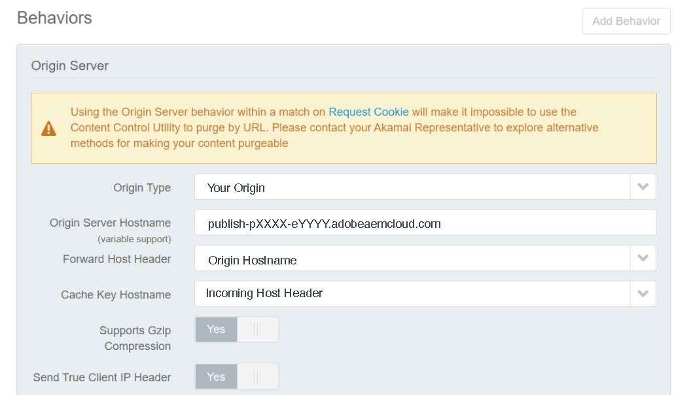

# CDN in AEM as a Cloud Service {#cdn}

>[!CONTEXTUALHELP]
>id="aemcloud_golive_cdn"
>title="CDN in AEM as a Cloud Service"
>abstract="AEM as Cloud Service wird mit einem integrierten CDN ausgeliefert. Der Hauptzweck besteht darin, die Latenz zu verringern, indem zwischengespeicherte Inhalte von den CDN-Knoten in der Nähe des Browsers bereitgestellt werden. Es ist vollständig verwaltet und für eine optimale Leistung von AEM-Programmen konfiguriert."

AEM as a Cloud Service verfügt über ein integriertes CDN, das die Latenz reduziert, indem zwischenspeicherbare Inhalte von Edge-Knoten in der Nähe des Browsers des Benutzers bereitgestellt werden. Dieses vollständig verwaltete CDN ist für AEM Anwendungsleistung optimiert.

Das AEM verwaltete CDN erfüllt die Leistungs- und Sicherheitsanforderungen der meisten Kunden. Für die Veröffentlichungsstufe können Kunden festlegen, dass Traffic über ihr eigenes CDN weitergeleitet wird, das sie verwalten müssen. Diese Option ist von Fall zu Fall verfügbar, insbesondere wenn Kunden über bestehende ältere Integrationen mit einem CDN-Anbieter verfügen, die schwer zu ersetzen sind.

Kunden, die auf der Edge Delivery Services-Ebene veröffentlichen möchten, können von Adobe verwaltetem CDN profitieren. Siehe [Adobe verwaltetes CDN](#aem-managed-cdn). <!-- CQDOC-21758, 5b -->


<!-- ERROR: NEITHER URL IS FOUND (HTTP ERROR 404) Also, see the following videos [Cloud 5 AEM CDN Part 1](https://experienceleague.adobe.com/docs/experience-manager-learn/cloud-service/cloud-5/cloud5-aem-cdn-part1.html) and [Cloud 5 AEM CDN Part 2](https://experienceleague.adobe.com/docs/experience-manager-learn/cloud-service/cloud-5/cloud5-aem-cdn-part2.html) for additional information about CDN in AEM as a Cloud Service. -->

## Von Adobe verwaltetes CDN {#aem-managed-cdn}

<!-- CQDOC-21758, 5a -->

Zur Vorbereitung auf die Inhaltsbereitstellung mithilfe AEM integrierten CDN über die Self-Service-Benutzeroberfläche von Cloud Manager können Sie von den Adobe verwalteten CDN-Funktionen profitieren. Mit dieser Funktion können Sie die Self-Service-CDN-Verwaltung verwalten, einschließlich der Konfiguration und Installation von SSL-Zertifikaten wie DV (Domain Validation)- oder EV/OV (Extended/Organisations Validation)-Zertifikaten. Weitere Informationen zu diesen Methoden finden Sie unter folgenden Themen:

* [SSL-Zertifikate verwalten](/help/implementing/cloud-manager/managing-ssl-certifications/introduction.md)
* [Hinzufügen einer CDN-Konfiguration](/help/implementing/cloud-manager/cdn-configurations/add-cdn-config.md)
* [Benutzerdefinierte Domänennamen verwalten](/help/implementing/cloud-manager/custom-domain-names/introduction.md)
* [Edge Delivery Services-Unterstützung in Cloud Manager](/help/implementing/cloud-manager/edge-delivery-services.md)


**Beschränken des Traffic**

Standardmäßig kann bei einem von AEM verwalteten CDN-Setup der gesamte öffentliche Traffic zum Veröffentlichungs-Service geleitet werden, sowohl für Produktions- als auch für Nicht-Produktions-Umgebungen (Entwicklung und Staging). Über die Benutzeroberfläche von Cloud Manager können Sie den Traffic für eine bestimmte Umgebung auf den Veröffentlichungs-Service beschränken (z. B. die Beschränkung der Staging-Umgebung auf einen Bereich von IP-Adressen).

Weitere Informationen finden Sie unter [Verwalten von IP-Zulassungslisten](/help/implementing/cloud-manager/ip-allow-lists/introduction.md).

>[!CAUTION]
>
>AEM verwaltetes CDN stellt Anforderungen nur von zulässigen IPs bereit. Wenn Sie Ihr eigenes CDN auf das AEM verwaltete CDN verweisen, stellen Sie sicher, dass die IPs Ihres CDN in der IP-Zulassungsliste enthalten sind.

### Konfigurieren des Traffics auf dem CDN {#cdn-configuring-cloud}

Sie können Traffic im CDN auf verschiedene Arten konfigurieren, wie zum Beispiel:

* Blockieren von schädlichem Traffic mit [Traffic-Filterregeln](/help/security/traffic-filter-rules-including-waf.md) (einschließlich optional lizenzierbaren, erweiterten WAF-Regeln)
* Ändern der Art der [Anfrage und Antwort](/help/implementing/dispatcher/cdn-configuring-traffic.md#request-transformations)
* Anwenden der [Client-seitigen 301/302-Umleitungen](/help/implementing/dispatcher/cdn-configuring-traffic.md#client-side-redirectors)
* Deklarieren von [Ursprungs-Auswahlen](/help/implementing/dispatcher/cdn-configuring-traffic.md#client-side-redirectors) zum Reverse-Proxy einer Anfrage an Nicht-AEM-Backends

Verwenden Sie YAML-Dateien in Git, um diese Funktionen zu konfigurieren. Verwenden Sie außerdem die Cloud Manager [Config Pipeline](/help/implementing/dispatcher/cdn-configuring-traffic.md) , um sie bereitzustellen.

### CDN-Fehlerseiten konfigurieren {#cdn-error-pages}

Sie können eine CDN-Fehlerseite konfigurieren, um die Standardseite ohne Branding zu ersetzen. Diese benutzerspezifische Seite wird in dem seltenen Ereignis angezeigt, das nicht verfügbar AEM. Weitere Informationen finden Sie unter [Konfigurieren von CDN-Fehlerseiten](/help/implementing/dispatcher/cdn-error-pages.md).

### Cache-Inhalt im CDN bereinigen {#purge-cdn}

Das Festlegen einer TTL mithilfe des HTTP Cache-Control-Headers ist ein effektiver Ansatz, um die Leistung bei der Inhaltsbereitstellung und die Aktualität der Inhalte aufeinander abzustimmen. In Szenarien, in denen es wichtig ist, aktualisierte Inhalte sofort bereitzustellen, kann es jedoch von Vorteil sein, den CDN-Cache direkt zu bereinigen.

Lesen Sie mehr über das [Konfigurieren eines Bereinigungs-API-Tokens](/help/implementing/dispatcher/cdn-credentials-authentication.md/#purge-API-token) und das [Bereinigen des zwischengespeicherten CDN-Inhalts ](/help/implementing/dispatcher/cdn-cache-purge.md).

### Grundlegende Authentifizierung beim CDN {#basic-auth}

Schützen Sie Inhalte für einfache Authentifizierungsfälle, einschließlich Geschäfts-Stakeholdern, die Inhalte überprüfen, indem Sie ein einfaches Authentifizierungsdialogfeld anzeigen, das einen Benutzernamen und ein Kennwort erfordert. [Erfahren Sie mehr](/help/implementing/dispatcher/cdn-credentials-authentication.md) und treten Sie dem Early-Adopter-Programm bei.

## Vom Kunden verwaltetes CDN verweist auf AEM verwaltetes CDN {#point-to-point-CDN}

>[!CONTEXTUALHELP]
>id="aemcloud_golive_byocdn"
>title="Kunden-CDN verweist auf AEM-verwaltetes CDN"
>abstract="AEM as a Cloud Service bietet Kunden eine Option, ihr bestehendes CDN zu verwenden. Für die Veröffentlichungsebene können Kundinnen und Kunden optional von ihrem eigenen CDN aus darauf verweisen, welches sie verwalten müssen. Dieses Szenario wird von Fall zu Fall bei Erfüllung bestimmter Voraussetzungen gestattet, insbesondere dass die Kundin bzw. der Kunde eine Altintegration mit einem CDN-Anbieter hat, die schwer aufzugeben ist."

Wenn ein Kunde sein bestehendes CDN verwenden muss, kann er es verwalten und auf das AEM verwaltete CDN verweisen, sofern folgende Voraussetzungen erfüllt sind:

* Der Kunde muss über ein bestehendes CDN verfügen, das nur schwer ersetzt werden kann.
* Der Kunde muss es verwalten.
* Der Kunde muss in der Lage sein, das CDN für die Verwendung mit AEM as a Cloud Service zu konfigurieren - siehe Konfigurationsanweisungen unten.
* Der Kunde muss über technische CDN-Experten verfügen, die im Fall von Problemen im Zusammenhang mit dem Kundenprofil auf Anfrage zur Verfügung stehen.
* Der Kunde muss einen Belastungstest durchführen und erfolgreich bestehen, bevor er zur Produktion übergeht.

Konfigurationsanweisungen:

1. Verweisen Sie in Ihrem CDN auf den Eingang des Adobe-CDN als Ursprungs-Domain. Beispiel: `publish-p<PROGRAM_ID>-e<ENV-ID>.adobeaemcloud.com`.
1. Setzen Sie die SNI auf den Eingang des Adobe CDN.
1. Legen Sie die Host-Kopfzeile auf die Ursprungs-Domain fest. Beispiel: `Host:publish-p<PROGRAM_ID>-e<ENV-ID>.adobeaemcloud.com`.
1. Legen Sie die Kopfzeile `X-Forwarded-Host` mit dem Domain-Namen fest, damit AEM die Host-Kopfzeile ermitteln kann. Beispiel: `X-Forwarded-Host:example.com`.
1. Satz `X-AEM-Edge-Key`. Der Wert sollte mithilfe einer Cloud Manager-Konfigurationspipeline konfiguriert werden, wie in [diesem Artikel](/help/implementing/dispatcher/cdn-credentials-authentication.md#CDN-HTTP-value) beschrieben.

   * Erforderlich, damit das Adobe-CDN die Quelle der Anfragen validieren und die `X-Forwarded-*`-Header an die AEM-Applikation weitergeben kann. Beispielsweise wird `X-Forwarded-For` verwendet, um die Client-IP zu bestimmen. Daher ist es Sache des vertrauenswürdigen Aufrufers (d. h. des vom Kunden verwalteten CDN), die Richtigkeit der `X-Forwarded-*`-Header sicherzustellen (siehe Hinweis unten).
   * Optional kann der Zugriff auf den Eingang zum Adobe CDN blockiert werden, wenn kein `X-AEM-Edge-Key` vorhanden ist. Bitte informieren Sie Adobe, wenn Sie direkten Zugriff auf den Eingang zum Adobe-CDN benötigen (der blockiert werden soll).

Konfigurationsbeispiele von führenden CDN-Anbietern finden Sie im Abschnitt [Beispielkonfigurationen von CDN-Anbietern](#sample-configurations).

Bevor Sie Live-Traffic akzeptieren, sollten Sie beim Adobe-Support überprüfen, ob das Traffic-Routing End-to-End ordnungsgemäß funktioniert.

Nach dem Festlegen des `X-AEM-Edge-Key` können Sie wie folgt testen, ob die Anfrage korrekt weitergeleitet wird.

Unter Linux®:

```
curl https://publish-p<PROGRAM_ID>-e<ENV-ID>.adobeaemcloud.com -H "X-Forwarded-Host: example.com" -H "X-AEM-Edge-Key: <PROVIDED_EDGE_KEY>"
```

Unter Windows: 

```
curl https://publish-p<PROGRAM_ID>-e<ENV-ID>.adobeaemcloud.com --header "X-Forwarded-Host: example.com" --header "X-AEM-Edge-Key: <PROVIDED_EDGE_KEY>"
```

>[!NOTE]
>
>Wenn Sie Ihr eigenes CDN verwenden, müssen Sie keine Domänen und Zertifikate in Cloud Manager installieren. Das Routing im Adobe-CDN erfolgt über die Standarddomäne `publish-p<PROGRAM_ID>-e<ENV-ID>.adobeaemcloud.com`, die in der Anfrage-Kopfzeile `Host` gesendet werden soll. Das Überschreiben der Anfrage-Kopfzeile `Host` mit einem benutzerdefinierten Domänennamen kann die Anfrage fälschlicherweise über das Adobe-CDN weiterleiten.

>[!NOTE]
>
>Kunden, die ein eigenes CDN verwalten, müssen die Integrität der Kopfzeilen sicherstellen, die an das CDN von AEM gesendet werden. Beispielsweise empfehlen wir, dass Kunden alle `X-Forwarded-*`-Kopfzeilen löschen und für sie bekannte und kontrollierte Werte festlegen. Beispiel: `X-Forwarded-For` muss die IP-Adresse des Kunden enthalten, während `X-Forwarded-Host` den Host der Website enthalten muss.

>[!NOTE]
>
>Sandbox-Programmumgebungen unterstützen kein vom Kunden bereitgestelltes CDN.

Der zusätzliche Sprung zwischen dem Kunden-CDN und dem AEM-CDN ist nur im Fall eines Cache-Fehlers erforderlich. Durch die Verwendung der in diesem Artikel beschriebenen Cache-Optimierungsstrategien sollte das Hinzufügen eines Kunden-CDN nur eine vernachlässigbare Latenzzeit verursachen.

Diese kundenspezifische CDN-Konfiguration wird für die Veröffentlichungsebene unterstützt, aber nicht vor der Autorenebene.

### Beispielkonfigurationen von CDN-Anbietern {#sample-configurations}

Im Folgenden werden einige Konfigurationsbeispiele von mehreren führenden CDN-Anbietern vorgestellt.

**Akamai**




**Amazon CloudFront**


**Cloudflare**


### Allgemeine Fehler {#common-errors}

Die bereitgestellten Beispielkonfigurationen zeigen die erforderlichen Basiseinstellungen. Eine Kundenkonfiguration kann jedoch andere Regeln mit Auswirkungen haben, die die Header entfernen, bearbeiten oder neu anordnen, die für die Bereitstellung des Traffics durch AEM as a Cloud Service erforderlich sind. Im Folgenden finden Sie häufige Fehler, die auftreten, wenn ein kundenseitig verwaltetes CDN so konfiguriert wird, dass es auf AEM as a Cloud Service verweist.

**Weiterleitung zum Veröffentlichungsdienst-Endpunkt**

Wenn eine Anfrage eine unzulässige Antwort vom Typ 403 erhält, bedeutet dies, dass in der Anfrage einige erforderliche Header fehlen. Eine häufige Ursache dafür ist, dass das CDN sowohl den Apex- als auch den `www`-Domain-Traffic verwaltet, jedoch nicht den richtigen Header für die `www`-Domain hinzufügt. Dieses Problem kann gelöst werden, indem Sie Ihre CDN-Protokolle in AEM as a Cloud Service überprüfen und die erforderlichen Anforderungs-Header verifizieren.

**Zu viele Umleitungen Schleife**

Wenn eine Seite eine Schleife „Zu viele Umleitungen“ erhält, wird im CDN ein Anfrage-Header hinzugefügt, der einer Umleitung entspricht, die die Seite zu sich selbst zurückführt. Zum Beispiel:

* Es wird eine CDN-Regel erstellt, die entweder mit der Apex-Domain oder der www-Domain übereinstimmt und nur den X-Forwarded-Host-Header der Apex-Domain hinzufügt.
* Eine Anfrage für eine Apex-Domain entspricht dieser CDN-Regel, die die Apex-Domain als X-Forwarded-Host-Header hinzufügt.
* Eine Anfrage wird an die Quelle gesendet, an der eine Weiterleitung explizit mit dem Host-Header für die Apex-Domain übereinstimmt (z. B. ^example.com).
* Es wird eine Neuschreibungsregel ausgelöst, die die Anfrage für die Apex-Domain mit der www-Subdomain in https umschreibt.
* Diese Umleitung wird dann an den Edge der Kundin bzw. des Kunden gesendet, wenn die CDN-Regel erneut ausgelöst wird und der X-Forwarded-Host-Header für die Apex-Domain und nicht die www-Subdomain hinzugefügt wird. Anschließend fängt der Prozess von vorne an, bis die Anfrage fehlschlägt.

Um dieses Problem zu beheben, werten Sie Ihre SSL-Umleitungsstrategie, CDN-Regeln, Umleitungs- und Umschreibungsregelkombinationen aus.

## Geolocation-Kopfzeilen {#geo-headers}

Das AEM-verwaltete CDN fügt jeder Anfrage Kopfzeilen hinzu. Diese enthalten:

* Länder-Code: `x-aem-client-country`
* Kontinental-Code: `x-aem-client-continent`

>[!NOTE]
>
>Wenn es ein kundenverwaltetes CDN gibt, spiegeln diese Header den Speicherort des CDN-Proxyservers des Kunden und nicht den tatsächlichen Client wider. Kunden sollten Geolocation-Header über ihr eigenes CDN verwalten, wenn sie ein kundenverwaltetes CDN verwenden.

Die Werte für die Länder-Codes sind die unter [ISO 3166-1](https://de.wikipedia.org/wiki/ISO_3166-1) beschriebenen Alpha-2-Codes.

Die Werte für die Kontinental-Codes lauten:

* AF Afrika
* AN Antarktika
* AS Asien
* EU Europa
* NA Nordamerika
* OC Ozeanien
* SA Südamerika

Diese Informationen sind nützlich, um basierend auf dem Herkunftsland der Anfrage zu einer anderen URL umzuleiten. Verwenden Sie den Abweichungs-Header für die Zwischenspeicherung von Antworten, die von geografischen Daten abhängen. Umleitungen zu einer bestimmten Landingpage müssen beispielsweise immer `Vary: x-aem-client-country` enthalten. Bei Bedarf können Sie `Cache-Control: private` verwenden, um das Caching zu verhindern. Weitere Informationen finden Sie unter [Caching](/help/implementing/dispatcher/caching.md#html-text).
