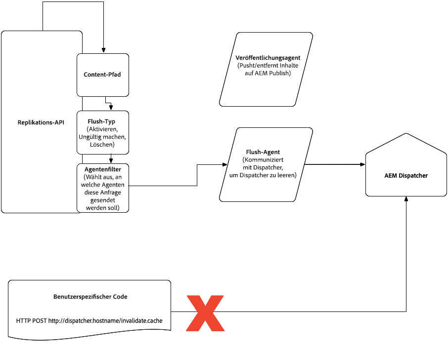

# Content Versand in AEM als Cloud-Dienst {#content-delivery}

Der Content Versand des Veröffentlichungsdienstes umfasst:

* CDN (normalerweise von Adobe verwaltet)
* AEM-Dispatcher
* AEM-Veröffentlichung

Der Datenfluss sieht folgendermaßen aus:

1. Die URL wird im Browser hinzugefügt
1. Anforderung an CDN, die dieser Domäne im DNS zugeordnet ist
1. Wenn Inhalte auf dem CDN vollständig zwischengespeichert sind, stellt CDN sie für den Browser bereit
1. Wenn der Inhalt nicht vollständig zwischengespeichert ist, ruft das CDN den Dispatcher ab (Reverse-Proxy)
1. Wenn Inhalte auf dem Dispatcher vollständig zwischengespeichert sind, stellt der Dispatcher sie dem CDN zur Verfügung
1. Wenn Inhalte nicht vollständig zwischengespeichert sind, ruft der Dispatcher (Reverse-Proxy) zur AEM-Veröffentlichung auf
1. Der Inhalt wird vom Browser gerendert, der ihn ggf. auch zwischenspeichert, je nach Header

Der Content-Typ HTML/Text läuft nach 300 s (5 Minuten) auf der Dispatcher-Ebene ab. Dies ist ein Schwellenwert, den sowohl der Dispatcher-Cache als auch CDN beachten. Bei der Bereitstellung des Veröffentlichungsdiensts wird der Dispatcher-Cache geleert und anschließend erwärmt, bevor die neuen Veröffentlichungsknoten Traffic akzeptieren.

Die folgenden Abschnitte enthalten genauere Informationen zum Content Versand, einschließlich CDN-Konfiguration und Dispatcher-Zwischenspeicherung.

Informationen zur Replizierung vom Autorendienst zum Veröffentlichungsdienst finden Sie [hier](/help/operations/replication.md).

>[!NOTE]
>Traffic wird über einen Apache-Webserver ausgeführt, der Module einschließlich des Dispatchers unterstützt. Der Dispatcher wird primär als Cache verwendet, um die Verarbeitung auf den Veröffentlichungsknoten zu beschränken, um die Leistung zu erhöhen.

## CDN {#cdn}

AEM Angebots bietet drei Optionen:

1. Adobe Managed CDN - AEM&#39;s vordefiniertes CDN. Diese Option wird empfohlen, da sie vollständig integriert ist.
1. Kunden-CDN verweist auf Adobe Managed CDN - der Kunde verweist sein eigenes CDN auf das vordefinierte CDN von AEM. Wenn die erste Option nicht lebensfähig ist, ist dies die nächste bevorzugte Option, da sie weiterhin die AEM-Integration mit dem Standard-CDN nutzt. Kunden sind weiterhin für die Verwaltung ihres eigenen CDN verantwortlich.
1. Customer Managed CDN - Der Kunde bringt sein eigenes CDN und ist für dessen Verwaltung voll und ganz verantwortlich.

>[!CAUTION]
>Die erste Option wird dringend empfohlen. Adobe kann nicht für das Ergebnis einer Fehlkonfiguration verantwortlich gemacht werden, wenn Sie die zweite Option wählen.

Die zweite und dritte Option werden von Fall zu Fall zugelassen. Dies umfasst die Erfüllung bestimmter Voraussetzungen, unter anderem, aber nicht beschränkt auf den Kunden, der über eine veraltete Integration mit seinem CDN-Anbieter verfügt, was schwer rückgängig zu machen ist.

### Adobe Managed CDN {#adobe-managed-cdn}

Die Vorbereitung auf Content Versand mithilfe des standardmäßigen CDN von Adobe ist ganz einfach, wie nachfolgend beschrieben:

1. Sie stellen Adobe das signierte SSL-Zertifikat und den geheimen Schlüssel zur Verfügung, indem Sie einen Link zu einem sicheren Formular mit diesen Informationen freigeben. Bitte stimmen Sie sich mit dem Kundensupport auf dieser Aufgabe ab.
Hinweis: AEM als Cloud-Dienst unterstützt keine DV-Zertifikate (Domain Validated).
1. Der Kundensupport koordiniert dann mit Ihnen die zeitliche Abfolge für einen CNAME-DNS-Datensatz und weist deren FQDN auf `adobe-aem.map.fastly.net`.
1. Sie werden benachrichtigt, wenn die SSL-Zertifikate ablaufen, damit Sie die neuen SSL-Zertifikate erneut senden können.

Standardmäßig kann bei einem Adobe Managed CDN-Setup der gesamte öffentliche Traffic zum Veröffentlichungsdienst wechseln, sowohl für Produktions- als auch für Nicht-Produktions- (Entwicklungs- und Bereitstellungsdienste) Umgebung. Wenn Sie den Traffic für eine bestimmte Umgebung auf den Veröffentlichungsdienst beschränken möchten (z. B. die Beschränkung der Staging-Aktivität auf eine Reihe von IP-Adressen), sollten Sie sich an den Kundendienst wenden, um diese Einschränkungen zu konfigurieren.

### Customer CDN verweist auf Adobe Managed CDN {#point-to-point-CDN}

Wird unterstützt, wenn Sie Ihr vorhandenes CDN verwenden möchten, die Anforderungen eines vom Kunden verwalteten CDN jedoch nicht erfüllen können. In diesem Fall verwalten Sie Ihr eigenes CDN, verweisen aber auf das von Adobe verwaltete CDN.

Bitte beachten Sie, dass Sie:

1. Sie benötigen ein vorhandenes CDN.
1. Du wirst es verwalten.
1. Sie müssen CDN für die Verwendung mit AEM als Cloud-Dienst konfigurieren können - siehe die Konfigurationsanweisungen unten.
1. Sie haben Ingenieurexperten von CDN, die im Falle von Problemen im Zusammenhang mit dem Projekt jederzeit erreichbar sind.
1. Sie müssen vor dem Produktivbetrieb einen Lasttest durchführen und erfolgreich bestehen.

Konfigurationsanweisungen:

1. Legen Sie die `X-Forwarded-Host` Kopfzeile mit dem Domänennamen fest.
1. Legen Sie Host-Header mit der Herkunft-Domäne fest, der Adobe CDN-Adresse. Der Wert sollte von Adobe stammen.
1. Schicken Sie die SNI-Kopfzeile an die Herkunft. Wie der Host-Header muss der sni-Header die Herkunft-Domäne sein.
1. Legen Sie die `X-Edge-Key`Variable fest, die erforderlich ist, um den Traffic korrekt an die AEM-Server zu leiten. Der Wert sollte von Adobe stammen.

### Kundenverwaltetes CDN {#customer-managed-cdn}

Wird unterstützt, wenn Sie Ihr vorhandenes CDN verwenden müssen.  In diesem Fall verwalten Sie Ihr eigenes CDN und weisen es auf AEM hin.

Sie können Ihr eigenes CDN verwalten, vorausgesetzt:

1. Sie haben ein CDN.
1. Es muss sich um ein unterstütztes CDN handeln. Derzeit wird Akamai unterstützt. Wenn Ihr Unternehmen ein derzeit nicht unterstütztes CDN verwalten möchte, wenden Sie sich bitte an den Kundensupport.
1. Du wirst es verwalten.
1. Sie müssen CDN für die Verwendung mit AEM als Cloud-Dienst konfigurieren können - siehe die Konfigurationsanweisungen unten.
1. Sie haben Ingenieurexperten von CDN, die im Falle von Problemen im Zusammenhang mit dem Projekt jederzeit erreichbar sind.
1. Sie müssen für Cloud Manager Whitelists von CDN-Knoten bereitstellen, wie in den Konfigurationsanweisungen beschrieben.
1. Sie müssen vor dem Produktivbetrieb einen Lasttest durchführen und erfolgreich bestehen.

Konfigurationsanweisungen:

1. Stellen Sie die Whitelist des CDN-Anbieters für Adobe bereit, indem Sie die Umgebung create/update API mit einer Liste von CIDRs zur Whitelist aufrufen.
1. Legen Sie die `X-Forwarded-Host` Kopfzeile mit dem Domänennamen fest.
1. Legen Sie den Host-Header mit der Herkunft-Domäne fest, der AEM als Cloud-Dienst-Adresse. Der Wert sollte von Adobe stammen.
1. Schicken Sie die SNI-Kopfzeile an die Herkunft. Der SNI-Header muss die Herkunft-Domäne sein.
1. Legen Sie die `X-Edge-Key` erforderlichen fest, um den Traffic ordnungsgemäß zu den AEM-Servern zu leiten. Der Wert sollte von Adobe stammen.

Bevor Sie Live-Traffic akzeptieren, sollten Sie beim Adobe-Kundensupport überprüfen, ob das End-to-End-Traffic-Routing ordnungsgemäß funktioniert.

### Caching {#caching}

Der Zwischenspeicherungsprozess befolgt die folgenden Regeln.

### HTML/Text {#html-text}

* standardmäßig 5 Minuten lang im Cache gespeichert, basierend auf dem Cache-Control-Header, der von der Apache-Ebene ausgestrahlt wird. Das CDN berücksichtigt diesen Wert ebenfalls.
* kann für alle HTML-/Textinhalte überschrieben werden, indem die `EXPIRATION_TIME` Variable in der Verwendung von AEM als Cloud-Dienst-SDK-Dispatcher-Tools definiert `global.vars` wird.

Sie müssen sicherstellen, dass für eine Datei unter `src/conf.dispatcher.d/cache` der folgenden Regel steht:

```
/0000
{ /glob "*" /type "allow" }
```

* kann auf einer feineren Ebene durch apache mod_headers Direktiven überschrieben werden. Beispiel:

```
<LocationMatch "\.(html)$">
        Header set Cache-Control "max-age=200 s-maxage=200"
</LocationMatch>
```

Sie müssen sicherstellen, dass für eine Datei unter `src/conf.dispatcher.d/cache` der folgenden Regel steht:

```
/0000
{ /glob "*" /type "allow" }
```

* Beachten Sie, dass andere Methoden, einschließlich des Projekts [](https://adobe-consulting-services.github.io/acs-aem-commons/features/dispatcher-ttl/)dispatcher-ttl AEM ACS Commons, Werte nicht erfolgreich außer Kraft setzen.

### Clientseitige Bibliotheken (js, css) {#client-side-libraries}

* Durch Verwendung des clientseitigen Bibliotheksrahmens von AEM wird JavaScript- und CSS-Code so generiert, dass Browser ihn unbegrenzt zwischenspeichern können, da Änderungen als neue Dateien mit einem eindeutigen Pfad angezeigt werden.  Mit anderen Worten, HTML, die auf die Client-Bibliotheken verweisen, werden nach Bedarf erstellt, damit Kunden neue Inhalte während der Veröffentlichung erleben können. Die Cachesteuerung ist bei älteren Browsern, die den Wert &quot;unveränderlich&quot;nicht einhalten, auf &quot;unveränderlich&quot;oder auf 30 Tage eingestellt.
* Weitere Informationen finden Sie im Abschnitt [Clientseitige Bibliotheken und Versionskonsistenz](#content-consistency) .

### Bilder {#images}

* nicht zwischengespeichert

### Sonstige Inhaltstypen {#other-content}

* keine standardmäßige Zwischenspeicherung
* kann durch Apache überschrieben werden `mod_headers`. Beispiel:

```
<LocationMatch "\.(css|js)$">
    Header set Cache-Control "max-age=500 s-maxage=500"
</LocationMatch>
```

*Andere Methoden zum Festlegen von Cache-Headern können ebenfalls funktionieren

Vor der Annahme von Live-Traffic sollten Kunden beim Adobe-Kundensupport überprüfen, ob das End-to-End-Traffic-Routing ordnungsgemäß funktioniert.

## Dispatcher {#disp}

Traffic wird über einen Apache-Webserver ausgeführt, der Module einschließlich des Dispatchers unterstützt. Der Dispatcher wird primär als Cache verwendet, um die Verarbeitung auf den Veröffentlichungsknoten zu beschränken, um die Leistung zu erhöhen.

Inhalte des Typs HTML/Text werden mit Cache-Kopfzeilen eingestellt, die einem 300-Minuten-Ablaufdatum (5 Minuten) entsprechen.

Der Rest dieses Abschnitts beschreibt Überlegungen zur Ungültigmachung des Dispatcher-Cache.

### Dispatcher-Cache-Ungültigkeit während der Aktivierung/Deaktivierung {#cache-activation-deactivation}

Wie bei früheren Versionen von AEM wird der Inhalt durch Veröffentlichen oder Rückgängigmachen der Veröffentlichung aus dem Dispatcher-Cache gelöscht. Wenn ein Zwischenspeicherungsproblem vermutet wird, sollten Kunden die betreffenden Seiten erneut veröffentlichen.

Wenn die Veröffentlichungsinstanz eine neue Version einer Seite oder eines Assets vom Autor erhält, verwendet sie den Flush-Agent, um entsprechende Pfade in ihrem Dispatcher zu ungültigen. Der aktualisierte Pfad wird zusammen mit den übergeordneten Elementen bis zu einer Ebene aus dem Dispatcher-Cache entfernt (Sie können dies mit dem [statfileslevel](https://docs.adobe.com/content/help/en/experience-manager-dispatcher/using/configuring/dispatcher-configuration.html#invalidating-files-by-folder-level)konfigurieren).

### Ungültigmachen des expliziten Dispatcher-Cache {#explicit-invalidation}

Im Allgemeinen ist es nicht notwendig, Inhalte im Dispatcher manuell zu ungültigen, aber es ist möglich, wenn nötig, wie unten beschrieben.

Vor AEM als Cloud-Dienst gab es zwei Möglichkeiten, den Dispatcher-Cache zu ungültigen.

1. Rufen Sie den Replizierungsagenten auf und geben Sie den Veröffentlichungs-Dispatcher-Flush-Agent an
2. Direkter Aufruf der `invalidate.cache` API (z. B. `POST /dispatcher/invalidate.cache`)

Der `invalidate.cache` Ansatz wird nicht mehr unterstützt, da er nur einen bestimmten Dispatcher-Knoten anspricht.
AEM als Cloud-Dienst funktioniert auf Dienstebene, nicht auf der Ebene einzelner Knoten. Daher sind die Ungültigmachungsanweisungen auf der Seite &quot; [Ungültige zwischengespeicherte Seiten von AEM](https://docs.adobe.com/content/help/en/experience-manager-dispatcher/using/configuring/page-invalidate.html) &quot;nicht für AEM als Cloud-Dienst gültig.
Stattdessen sollte der Replizierungsspülmittel verwendet werden. Dies kann mithilfe der Replikations-API erfolgen. Die Replikations-API-Dokumentation ist [hier](https://helpx.adobe.com/experience-manager/6-5/sites/developing/using/reference-materials/javadoc/com/day/cq/replication/Replicator.html) verfügbar. Ein Beispiel für das Bereinigen des Cache finden Sie auf der [API-Beispielseite](https://helpx.adobe.com/experience-manager/using/aem64_replication_api.html) speziell im `CustomStep` Beispiel, in dem eine Replizierungsaktion des Typs ACTIVATE an alle verfügbaren Agenten ausgegeben wird. Der Endpunkt des Flush-Agenten ist nicht konfigurierbar, sondern vorkonfiguriert, um auf den Dispatcher zu verweisen. Er ist mit dem Veröffentlichungsdienst, der den Flush-Agent ausführt, übereinstimmen. Der Flush-Agent kann in der Regel von OSGi-Ereignissen oder Workflows ausgelöst werden.

Das folgende Diagramm zeigt dies.



Wenn Bedenken bestehen, dass der Dispatcher-Cache nicht geleert wird, wenden Sie sich an den Kundensupport, der den Dispatcher-Cache ggf. bereinigen kann.

Das von Adobe verwaltete CDN berücksichtigt TTLs und muss daher nicht gerötet werden. Bei Verdacht auf ein Problem wenden Sie sich an den Kundensupport, der bei Bedarf einen von Adobe verwalteten CDN-Cache leeren kann.

## Clientseitige Bibliotheken und Versionskonsistenz {#content-consistency}

Die Seiten bestehen natürlich aus HTML, Javascript, CSS und Bildern. Kunden werden empfohlen, das clientlibs-Framework (clientlibs) zu nutzen, um JavaScript- und CSS-Ressourcen in HTML-Seiten zu importieren, wobei Abhängigkeiten zwischen JS-Bibliotheken berücksichtigt werden.

Das clientlibs-Framework bietet eine automatische Versionsverwaltung, d. h. Entwickler können Änderungen an JS-Bibliotheken in der Quellcodeverwaltung einchecken und die neueste Version wird zur Verfügung gestellt, wenn ein Kunde seine Veröffentlichung vorantreibt. Andernfalls müssten Entwickler HTML mit Verweisen auf die neue Version der Bibliothek manuell ändern. Dies ist besonders aufwändig, wenn viele HTML-Vorlagen dieselbe Bibliothek gemeinsam nutzen.

Wenn die neuen Bibliotheksversionen in die Produktion freigegeben werden, werden die referenzierenden HTML-Seiten mit neuen Links zu diesen aktualisierten Bibliotheksversionen aktualisiert. Sobald der Browser-Cache für eine bestimmte HTML-Seite abgelaufen ist, besteht kein Problem, dass die alten Bibliotheken aus dem Browser-Cache geladen werden, da die aktualisierte Seite (von AEM) nun garantiert auf die neuen Versionen der Bibliotheken verweist. Mit anderen Worten, eine aktualisierte HTML-Seite enthält alle aktuellen Bibliotheksversionen.

Der Mechanismus hierfür ist ein serialisierter Hash, der an den Link der Client-Bibliothek angehängt wird und eine eindeutige, versionierte URL gewährleistet, damit der Browser die CSS/JS zwischenspeichert. Der serialisierte Hash wird nur aktualisiert, wenn sich der Inhalt der Client-Bibliothek ändert. Das bedeutet, dass bei nicht zusammenhängenden Aktualisierungen (d. h. bei keiner Änderung der zugrunde liegenden CSS/js der Client-Bibliothek) auch bei einer neuen Bereitstellung der Verweis gleich bleibt, wodurch eine weniger Unterbrechung des Browser-Cache sichergestellt wird.

### Aktivieren von Longcache-Versionen clientseitiger Bibliotheken - AEM als Cloud-Dienst-SDK-Schnellstart {#enabling-longcache}

Die standardmäßigen clientlib-Includes auf einer HTML-Seite sehen wie im folgenden Beispiel aus:

```
<link rel="stylesheet" href="/etc.clientlibs/wkndapp/clientlibs/clientlib-base.css" type="text/css">
```

Wenn strikte clientlib-Versionierung aktiviert ist, wird der Client-Bibliothek ein langfristiger Hashschlüssel als Selektor hinzugefügt. Daher sieht der clientlib-Verweis wie folgt aus:

```
<link rel="stylesheet" href="/etc.clientlibs/wkndapp/clientlibs/clientlib-base.lc-7c8c5d228445ff48ab49a8e3c865c562-lc.css" type="text/css">
```

Strenge clientlib-Versionen sind in allen AEM als Cloud-Dienst-Umgebung standardmäßig aktiviert.

So aktivieren Sie eine strikte clientlib-Version im lokalen SDK QuickStart:

1. Navigieren Sie zum OSGi Configuration Manager. <host>/system/console/configMgr
1. Suchen Sie die OSGi-Konfiguration für Adobe Granite HTML Library Manager:
   * Aktivieren Sie das Kontrollkästchen, um die strikte Versionierung zu aktivieren.
   * Geben Sie in das Feld Long term client side cache key den Wert / ein.*;Hash
1. Speichern Sie die Änderungen. Beachten Sie, dass diese Konfiguration nicht in der Quellcodeverwaltung gespeichert werden muss, da AEM als Cloud-Dienst diese Konfiguration automatisch in dev-, stage- und production-Umgebung aktiviert.
1. Bei jeder Änderung des Inhalts der Client-Bibliothek wird ein neuer Hashschlüssel generiert und der HTML-Verweis wird aktualisiert.
