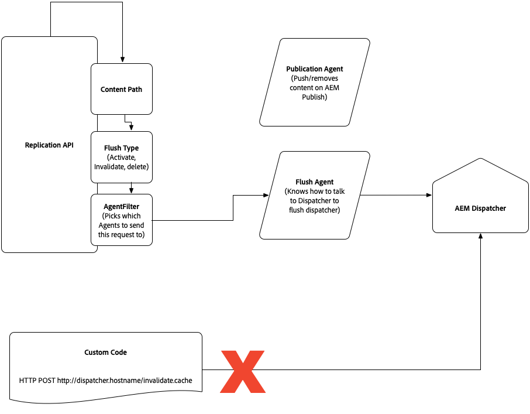

# Inhaltsbereitstellung in AEM as a Cloud Service {#content-delivery}

Auf dieser Seite wird der Veröffentlichungsdienst für die Inhaltsbereitstellung in AEM as a Cloud Service beschrieben. Der Veröffentlichungsdienst für die Inhaltsbereitstellung umfasst:

* CDN (normalerweise von Adobe verwaltet)
* AEM Dispatcher
* AEM Publish

Der Datenfluss sieht wie folgt aus:

1. Die URL wird im Browser hinzugefügt
1. Anfrage an CDN, das in DNS dieser Domäne zugeordnet ist
1. Wenn der Inhalt im CDN vollständig zwischengespeichert ist, stellt CDN ihn für den Browser bereit
1. Wenn der Inhalt nicht vollständig zwischengespeichert ist, ruft CDN den Dispatcher auf (Reverse-Proxy)
1. Wenn der Inhalt in Dispatcher vollständig zwischengespeichert ist, stellt Dispatcher ihn dem CDN bereit
1. Wenn der Inhalt nicht vollständig zwischengespeichert ist, ruft Dispatcher die AEM-Veröffentlichungsinstanz auf (Reverse-Proxy)
1. Der Inhalt wird vom Browser gerendert, der ihn je nach Header auch zwischenspeichern kann

Der HTML-/Text-Inhaltstyp läuft nach 300 Sekunden (5 Minuten) auf der Dispatcher-Ebene ab. Dieser Schwellenwert wird sowohl vom Dispatcher-Cache als auch vom CDN eingehalten. Bei der erneuten Bereitstellung des Publish-Dienst wird der Dispatcher-Cache geleert und anschließend aufgewärmt, bevor die neuen Veröffentlichungsknoten Traffic akzeptieren.

In den folgenden Abschnitten finden Sie ausführlichere Informationen zur Bereitstellung von Inhalten, einschließlich CDN-Konfiguration und Caching.

Informationen zur Replikation vom Autorendienst zum Veröffentlichungsdienst finden Sie [hier](/help/operations/replication.md).

## CDN {#cdn}

AEM as Cloud Service wird mit einem integrierten CDN ausgeliefert. Der Hauptzweck besteht darin, die Latenz zu verringern, indem zwischengespeicherte Inhalte von den CDN-Knoten in der Nähe des Browsers bereitgestellt werden. Es ist vollständig verwaltet und für eine optimale Leistung von AEM-Anwendungen konfiguriert.

AEM bietet zwei Optionen an:

1. AEM-verwaltetes CDN – Das vorkonfigurierte CDN von AEM. Es handelt sich um eine eng integrierte Option, die keine umfangreichen Kundeninvestitionen zur Unterstützung der CDN-Integration mit AEM erfordert.
1. Das vom Kunden verwaltete CDN verweist auf das AEM-verwaltete CDN – der Kunde verweist sein eigenes CDN auf das vorkonfigurierte CDN von AEM. Der Kunde muss weiterhin sein eigenes CDN verwalten, aber die Investitionen in die Integration mit AEM sind gering.

Die erste Option sollte die meisten Leistungs- und Sicherheitsanforderungen des Kunden erfüllen. Darüber hinaus erfordert sie minimalen Kundenaufwand.

Die zweite Option ist von Fall zu Fall zulässig. Die Entscheidung basiert auf der Erfüllung bestimmter Voraussetzungen, insbesondere dass der Kunde eine Altintegration mit seinem CDN-Anbieter hat, die schwer aufzugeben ist.

Nachfolgend finden Sie eine Entscheidungsmatrix zum Vergleich der beiden Optionen. Weitere Informationen finden Sie in den folgenden Abschnitten.

| Details | AEM-verwaltetes CDN | Vom Kunden verwaltetes CDN verweist auf AEM-CDN |
|---|---|---|
| **Kundenaufwand** | Kein Aufwand, vollständig integriert. Nur CNAME muss auf AEM-verwaltetes CDN verweisen. | Moderate Kundeninvestition. Der Kunde muss sein eigenes CDN verwalten. |
| **Voraussetzungen** | Keine | Vorhandenes CDN, das nur schwer zu ersetzen ist. Vor der Live-Schaltung muss ein erfolgreicher Belastungstest durchgeführt werden. |
| **CDN-Kompetenz** | Keine | Benötigt mindestens eine technische Teilzeitressource mit detailliertem CDN-Wissen, die das CDN des Kunden konfigurieren kann. |
| **Sicherheit** | Verwaltet von Adobe. | Verwaltet von Adobe (und optional vom Kunden bei seinem eigenen CDN). |
| **Leistung** | Optimiert von Adobe. | Profitiert von einigen AEM-CDN-Funktionen, aber möglicherweise kleiner Leistungseinbruch aufgrund des zusätzlichen Wechsels. **Hinweis**: Wechsel vom Kunden CDN zum Fastly-CDN sind wahrscheinlich effizient. |
| **Caching** | Unterstützt Cache-Kopfzeilen, die auf den Dispatcher angewendet werden. | Unterstützt Cache-Kopfzeilen, die auf den Dispatcher angewendet werden. |
| **Funktionen zur Bild- und Videokomprimierung** | Kann mit Adobe Dynamic Media verwendet werden. | Kann mit Adobe Dynamic Media oder einer kundenverwalteten CDN-Bild-/Videolösung verwendet werden. |

### AEM-verwaltetes CDN {#aem-managed-cdn}

Die Vorbereitung der Inhaltsbereitstellung mithilfe des vorkonfigurierten CDN von Adobe ist einfach, wie nachfolgend beschrieben:

1. Sie stellen Adobe das signierte SSL-Zertifikat und den geheimen Schlüssel zur Verfügung, indem Sie einen Link zu einem sicheren Formular mit diesen Informationen teilen. Koordinieren Sie diese Aufgabe mit dem Support.
   **Hinweis:** AEM as a Cloud Service unterstützt keine DV (Domain Validated)-Zertifikate.
1. Sie sollten den Support informieren:
   * welche benutzerdefinierte Domäne einer bestimmten Umgebung zugeordnet werden soll, wie durch die Programm-ID und die Umgebung-ID definiert.
   * wenn eine IP-Whitelist erforderlich ist, um den Traffic auf eine bestimmte Umgebung zu beschränken.
1. Der Support koordiniert dann mit Ihnen den Zeitpunkt für einen CNAME-DNS-Eintrag und verweist dessen FQDN auf `adobe-aem.map.fastly.net`.
1. Sie werden benachrichtigt, wenn SSL-Zertifikate ablaufen, damit Sie neue SSL-Zertifikate senden können.

**Beschränken des Traffic**

Standardmäßig kann bei einem von Adobe verwalteten CDN-Setup der gesamte öffentliche Traffic zum Publish-Dienst geleitet werden, sowohl für Produktions- als auch für Nicht-Produktions-Umgebungen (Entwicklung und Staging). Wenn Sie den Traffic für eine bestimmte Umgebung auf Publish-Dienst beschränken möchten (z. B. eine Beschränkung der Staging-Umgebung auf eine Reihe von IP-Adressen), sollten Sie sich an den Support wenden, um diese Beschränkungen zu konfigurieren.

### Kunden-CDN verweist auf AEM-verwaltetes CDN {#point-to-point-CDN}

Wird unterstützt, wenn Sie Ihr vorhandenes CDN verwenden möchten, die Anforderungen eines vom Kunden verwalteten CDN jedoch nicht erfüllen können. In diesem Fall verwalten Sie Ihr eigenes CDN, verweisen aber auf das von Adobe verwaltete CDN.

Beachten Sie Folgendes:

1. Sie müssen über ein bestehendes CDN verfügen.
1. Sie müssen es verwalten.
1. Sie müssen in der Lage sein, das CDN für die Verwendung mit AEM as a Cloud Service zu konfigurieren – siehe Konfigurationsanweisungen unten.
1. Sie benötigen technische CDN-Experten, die im Falle von Problemen im Zusammenhang mit dem Projekt auf Anfrage zur Verfügung stehen.
1. Sie müssen einen Belastungstest durchführen und erfolgreich bestehen, bevor Sie zur Produktion übergehen.

Konfigurationsanweisungen:

1. Legen Sie die `X-Forwarded-Host`-Kopfzeile mit dem Domänennamen fest.
1. Legen Sie die Host-Kopfzeile mit der Ursprungsdomäne fest, bei der es sich um den CDN-Eingang von Adobe handelt. Der Wert sollte von Adobe stammen.
1. Senden Sie die SNI-Kopfzeile an den Ursprung. Wie die Host-Kopfzeile muss der SNI-Kopfzeile die Ursprungsdomäne sein.
1. Legen Sie die `X-Edge-Key`-Variable fest, die erforderlich ist, um den Traffic korrekt an die AEM-Server zu leiten. Der Wert sollte von Adobe stammen.

Bevor Sie Live-Traffic akzeptieren, sollten Sie beim Adobe-Support überprüfen, ob das End-to-End-Traffic-Routing ordnungsgemäß funktioniert.

## Caching {#caching}

Caching im CDN kann mithilfe von Dispatcher-Regeln konfiguriert werden. Beachten Sie, dass der Dispatcher auch die resultierenden Cache-Ablaufkopfzeilen berücksichtigt, wenn `enableTTL` in der Dispatcher-Konfiguration aktiviert ist. Dies bedeutet, dass bestimmte Inhalte auch außerhalb der erneut veröffentlichten Inhalte aktualisiert werden.

### HTML/Text {#html-text}

* Standardmäßig vom Browser fünf Minuten lang zwischengespeichert, basierend auf der Cache-Steuerungskopfzeile, die von der Apache-Ebene ausgegeben wird. Das CDN berücksichtigt diesen Wert ebenfalls.
* Kann für alle HTML-/Textinhalte überschrieben werden, indem die `EXPIRATION_TIME`-Variable in `global.vars` mithilfe der Dispatcher Tools des AEM as a Cloud Service-SDK definiert wird.
* Kann auf einer feineren Ebene durch die folgenden Anweisungen von apache mod_headers überschrieben werden:

```
<LocationMatch "\.(html)$">
        Header set Cache-Control "max-age=200"
</LocationMatch>
```

Sie müssen sicherstellen, dass eine Datei unter `src/conf.dispatcher.d/cache` die folgende Regel enthält (die sich in der Standardkonfiguration befindet):

```
/0000
{ /glob "*" /type "allow" }
```

* Beachten Sie, dass andere Methoden, einschließlich des [AEM ACS Commons-Projekts dispatcher-ttl](https://adobe-consulting-services.github.io/acs-aem-commons/features/dispatcher-ttl/), Werte nicht erfolgreich überschreiben.

### Client-seitige Bibliotheken (js, css) {#client-side-libraries}

* Durch Verwendung des Client-seitigen Bibliotheks-Frameworks von AEM wird JavaScript- und CSS-Code so generiert, dass Browser ihn unbegrenzt zwischenspeichern können, da Änderungen als neue Dateien mit einem eindeutigen Pfad angezeigt werden. Mit anderen Worten: HTML-Code, der auf die Client-Bibliotheken verweist, wird nach Bedarf erstellt, damit Kunden neue Inhalte gleich nach der Veröffentlichung erleben können. Die Cache-Steuerung ist bei älteren Browsern, die den Wert „unveränderlich“ nicht einhalten, auf „unveränderlich“ oder auf 30 Tage eingestellt.
* Weitere Informationen finden Sie im Abschnitt [Client-seitige Bibliotheken und Versionskonsistenz](#content-consistency).

### Bilder und alle Inhalte, die groß genug sind, um im Blob-Speicher gespeichert zu werden {#images}

* Standardmäßig nicht zwischengespeichert
* Können durch die folgenden Apache-Anweisungen `mod_headers` auf eine feinere Ebene gesetzt werden:

```
<LocationMatch "^.*.jpeg$">
    Header set Cache-Control "max-age=222"
</LocationMatch>
```

Es muss sichergestellt werden, dass eine Datei unter src/conf.dispatcher.d/cache die folgende Regel enthält (die sich in der Standardkonfiguration befindet):

```
/0000
{ /glob "*" /type "allow" }
```

Stellen Sie sicher, dass Assets, die privat gehalten und nicht zwischengespeichert werden sollen, nicht Teil der Filter der LocationMatch-Anweisung sind.

* Beachten Sie, dass andere Methoden, einschließlich des [AEM ACS Commons-Projekts dispatcher-ttl](https://adobe-consulting-services.github.io/acs-aem-commons/features/dispatcher-ttl/), Werte nicht erfolgreich überschreiben.

### Andere Inhaltsdateitypen im Knotenspeicher {#other-content}

* Kein standardmäßiges Caching
* Die Standardeinstellung kann nicht mit der für HTML-/Textdateitypen verwendeten `EXPIRATION_TIME`-Variablen gesetzt werden
* Der Cache-Ablauf kann mit derselben LocationMatch-Strategie festgelegt werden, die im Abschnitt „HTML/Text“ beschrieben wird, indem der entsprechende Regex angegeben wird

## Dispatcher {#disp}

Traffic wird über einen Apache-Webserver ausgeführt, der Module einschließlich des Dispatchers unterstützt. Der Dispatcher wird primär als Cache verwendet, um die Verarbeitung auf den Veröffentlichungsknoten zu beschränken, um die Leistung zu erhöhen.

Wie im Abschnitt zum Zwischenspeichern des CDN beschrieben, können Regeln auf die Dispatcher-Konfiguration angewendet werden, um alle standardmäßigen Ablaufeinstellungen für den Cache zu ändern.

Im Rest dieses Abschnitts werden Überlegungen im Zusammenhang mit der Dispatcher-Cache-Invalidierung beschrieben.  Für die meisten Kunden sollte es nicht notwendig sein, den Dispatcher-Cache zu invalidieren, sondern sich stattdessen darauf zu verlassen, dass der Dispatcher seinen Cache bei der Neuveröffentlichung von Inhalten aktualisiert und das CDN die Cache-Ablaufkopfzeilen berücksichtigt.

### Dispatcher-Cache-Invalidierung bei der Aktivierung/Deaktivierung {#cache-activation-deactivation}

Wie in früheren Versionen von AEM wird beim Veröffentlichen oder Aufheben der Veröffentlichung von Seiten der Inhalt aus dem Dispatcher-Cache gelöscht. Wenn ein Caching-Problem vermutet wird, sollten Kunden die betreffenden Seiten erneut veröffentlichen.

Wenn die Veröffentlichungsinstanz vom Autor eine neue Version einer Seite oder eines Assets erhält, verwendet sie den Flush-Agenten, um die entsprechenden Pfade auf ihrem Dispatcher zu invalidieren. Der aktualisierte Pfad wird zusammen mit den übergeordneten Elementen bis zu einer Ebene, die Sie mit [statfileslevel](https://docs.adobe.com/content/help/de-DE/experience-manager-dispatcher/using/configuring/dispatcher-configuration.html#invalidating-files-by-folder-level) konfigurieren können, aus dem Dispatcher-Cache entfernt.

### Explizite Dispatcher-Cache-Invalidierung {#explicit-invalidation}

Im Allgemeinen ist es nicht erforderlich, Inhalte im Dispatcher manuell zu invalidieren, aber es ist bei Bedarf möglich, wie unten beschrieben.

Vor AEM as a Cloud Service gab es zwei Möglichkeiten, den Dispatcher-Cache zu invalidieren.

1. Aufrufen des Replikations-Agenten und Angeben des Publish-Dispatcher-Flush-Agenten
2. Direkter Aufruf der `invalidate.cache`-API (z. B. `POST /dispatcher/invalidate.cache`)

Der `invalidate.cache`-Ansatz des Dispatchers wird nicht mehr unterstützt, da er sich nur an einen bestimmten Dispatcher-Knoten richtet. AEM as a Cloud Service wird auf Dienstebene und nicht auf der Ebene einzelner Knoten ausgeführt. Daher sind die Anweisungen zur Invalidierung auf der Seite [Invalidierung zwischengespeicherter Seiten aus AEM](https://docs.adobe.com/content/help/de-DE/experience-manager-dispatcher/using/configuring/page-invalidate.html) für AEM as a Cloud Service nicht mehr gültig.
Stattdessen sollte der Replikations-Flush-Agent verwendet werden. Dies kann über die Replikations-API durchgeführt werden. Die Replikations-API-Dokumentation ist [hier](https://helpx.adobe.com/de/experience-manager/6-5/sites/developing/using/reference-materials/javadoc/com/day/cq/replication/Replicator.html) verfügbar. Ein Beispiel für das Bereinigen des Cache finden Sie auf der [API-Beispielseite](https://helpx.adobe.com/de/experience-manager/using/aem64_replication_api.html) und insbesondere im `CustomStep`-Beispiel, bei dem eine Replikationsaktion des Typs ACTIVATE an alle verfügbaren Agenten ausgegeben wird. Der Endpunkt des Flush-Agenten ist nicht konfigurierbar. Er ist aber so vorkonfiguriert, dass er auf den Dispatcher verweist, der mit dem Publish-Dienst, der den Flush-Agent ausführt, abgestimmt ist. Der Flush-Agent kann normalerweise durch OSGi-Ereignisse oder Workflows ausgelöst werden.

Das folgende Diagramm veranschaulicht dies.



Wenn Bedenken bestehen, dass der Dispatcher-Cache nicht geleert wird, wenden Sie sich an den [Support](https://helpx.adobe.com/de/support.ec.html), der den Dispatcher-Cache ggf. leeren kann.

Das von Adobe verwaltete CDN berücksichtigt TTLs und muss daher nicht geleert werden. Bei Verdacht auf ein Problem [wenden Sie sich an den Support](https://helpx.adobe.com/de/support.ec.html), der bei Bedarf einen von Adobe verwalteten CDN-Cache leeren kann.

## Client-seitige Bibliotheken und Versionskonsistenz {#content-consistency}

Seiten bestehen aus HTML, JavaScript, CSS und Bildern. Wir empfehlen Kunden, das Client-seitige Bibliotheken-Framework zu nutzen, um JavaScript- und CSS-Ressourcen in HTML-Seiten zu importieren und dabei Abhängigkeiten zwischen JS-Bibliotheken zu berücksichtigen.

Das clientlibs-Framework bietet eine automatische Versionsverwaltung, d. h. Entwickler können Änderungen an JS-Bibliotheken in der Quell-Code-Verwaltung einchecken und die neueste Version wird zur Verfügung gestellt, wenn ein Kunde seine Version veröffentlicht. Andernfalls müssten Entwickler HTML mit Verweisen auf die neue Version der Bibliothek manuell ändern. Dies ist sehr aufwendig, wenn viele HTML-Vorlagen dieselbe Bibliothek nutzen.

Wenn die neuen Bibliotheksversionen für die Produktion freigegeben werden, werden die verweisenden HTML-Seiten mit neuen Links zu diesen aktualisierten Bibliotheksversionen aktualisiert. Sobald der Browsercache für eine bestimmte HTML-Seite abgelaufen ist, besteht keine Gefahr, dass die alten Bibliotheken aus dem Browsercache geladen werden, da die aktualisierte Seite (aus AEM) nun garantiert auf die neuen Versionen der Bibliotheken verweist. Anders ausgedrückt: Eine aktualisierte HTML-Seite enthält alle aktuellen Bibliotheksversionen.

Der Mechanismus hierfür ist ein serialisierter Hash, der an den Link der Client-Bibliothek angehängt wird und eine eindeutige, versionierte URL für den Browser zum Zwischenspeichern von CSS/JS gewährleistet. Der serialisierte Hash wird nur aktualisiert, wenn sich der Inhalt der Client-Bibliothek ändert. Das bedeutet, dass bei nicht zusammenhängenden Aktualisierungen (d. h. bei keiner Änderung der zugrunde liegenden CSS/js der Client-Bibliothek) auch bei einer neuen Bereitstellung der Verweis derselbe bleibt, wodurch weniger Störungen im Browser-Cache auftreten.

### Aktivieren von Longcache-Versionen Client-seitiger Bibliotheken – AEM as a Cloud Service-SDK-Schnellstart {#enabling-longcache}

Die standardmäßigen clientlib-Includes auf einer HTML-Seite sehen wie im folgenden Beispiel aus:

```
<link rel="stylesheet" href="/etc.clientlibs/wkndapp/clientlibs/clientlib-base.css" type="text/css">
```

Wenn die strikte clientlib-Versionierung aktiviert ist, wird der Client-Bibliothek ein langfristiger Hash-Schlüssel als Selektor hinzugefügt. Daher sieht der clientlib-Verweis wie folgt aus:

```
<link rel="stylesheet" href="/etc.clientlibs/wkndapp/clientlibs/clientlib-base.lc-7c8c5d228445ff48ab49a8e3c865c562-lc.css" type="text/css">
```

Die strikte Clientlib-Versionierung ist standardmäßig in allen AEM as a Cloud Service-Umgebungen aktiviert.

Führen Sie die folgenden Aktionen aus, um die strikte Clientlib-Versionierung im lokalen SDK-Schnellstart zu aktivieren:

1. Navigieren Sie zum OSGi Configuration Manager `<host>/system/console/configMgr`
1. Suchen Sie die OSGi-Konfiguration für Adobe Granite HTML Library Manager:
   * Aktivieren Sie das Kontrollkästchen, um die strikte Versionierung zu aktivieren.
   * Geben Sie in das Feld für den langfristigen Client-seitigen Cache-Schlüssel den Wert /.*;hash ein.
1. Speichern Sie die Änderungen. Beachten Sie, dass es nicht notwendig ist, diese Konfiguration in der Quell-Code-Verwaltung zu speichern, da AEM as a Cloud Service diese Konfiguration in Entwicklungs-, Staging- und Produktionsumgebungen automatisch aktiviert.
1. Bei jeder Änderung des Inhalts der Client-Bibliothek wird ein neuer Hash-Schlüssel generiert und der HTML-Verweis wird aktualisiert.
