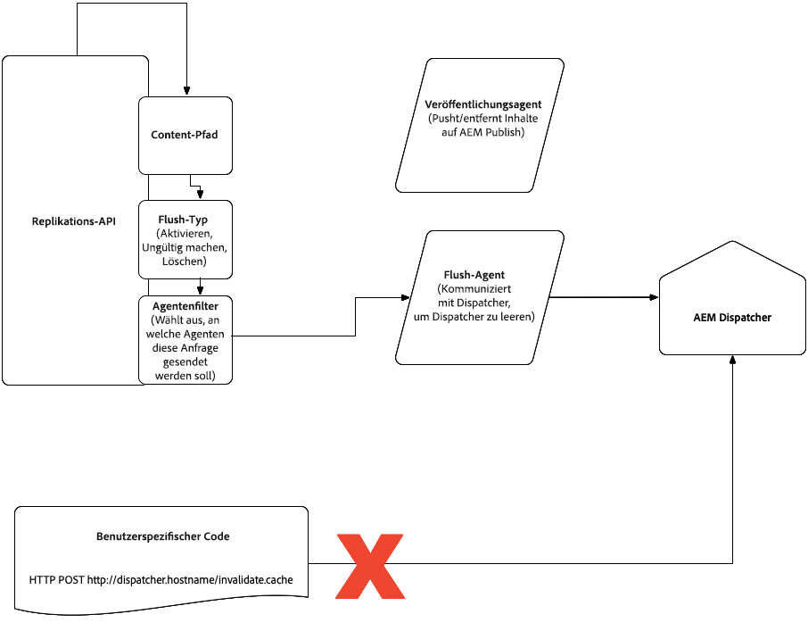

# Dispatcher in der Cloud {#Dispatcher-in-the-cloud}

## Konfiguration und Test von Apache und Dispatcher {#apache-and-dispatcher-configuration-and-testing}

In diesem Abschnitt wird beschrieben, wie Sie AEM als Cloud-Dienst-Apache- und Dispatcher-Konfigurationen strukturieren und vor der Bereitstellung in Cloud-Umgebungen lokal validieren und ausführen. Außerdem wird das Debugging in Cloud-Umgebungen beschrieben. Weitere Informationen zu Dispatcher finden Sie in der [AEM Dispatcher-Dokumentation](https://docs.adobe.com/content/help/en/experience-manager-dispatcher/using/dispatcher.html).

>[!NOTE]
>Windows-Benutzer müssen Windows 10 Professional oder andere Distributionen verwenden, die Docker unterstützen. Dies ist eine Voraussetzung für das Ausführen und Debuggen von Dispatcher auf einem lokalen Computer. Die folgenden Abschnitte enthalten Befehle mit der Mac- oder Linux-Version des SDK, aber das Windows SDK kann auf ähnliche Weise verwendet werden.

## Dispatcher Tools {#dispatcher-sdk}

Die Dispatcher-Tools sind Teil des gesamten AEM als Cloud Service SDK und bieten:

* Eine Vanille-Dateistruktur mit den Konfigurationsdateien, die in ein Maven-Projekt für Dispatcher aufgenommen werden sollen;
* Tooling für Kunden zur lokalen Validierung einer Dispatcher-Konfiguration;
* Ein Docker-Bild, das den Dispatcher lokal aufruft.

## Herunterladen und Extrahieren der Werkzeuge {#extracting-the-sdk}

Die Dispatcher Tools können aus einer ZIP-Datei im [Software Distribution](https://downloads.experiencecloud.adobe.com/content/software-distribution/en/aemcloud.html) Portal heruntergeladen werden. Beachten Sie, dass der Zugriff auf die SDK-Listen auf diejenigen mit AEM Managed Services oder AEM als Cloud-Dienstumgebungen beschränkt ist. Jede in dieser neuen Dispatcher-Tools-Version verfügbare neue Konfiguration kann für die Bereitstellung in Cloud-Umgebungen verwendet werden, in denen diese Version von AEM in der Cloud oder höher ausgeführt wird.

**Für macOS und Linux**, laden Sie das Shell-Skript in einen Ordner auf Ihrem Computer, machen Sie es ausführbar und führen Sie es aus. Es extrahiert die Dispatcher Tools-Dateien unter dem Verzeichnis, in dem Sie sie gespeichert haben (wobei die Version der Dispatcher Tools `version` ist).

```bash
$ chmod +x DispatcherSDKv<version>.sh
$ ./DispatcherSDKv<version>.sh
Verifying archive integrity...  100%   All good.
Uncompressing DispatcherSDKv<version>  100% 
```

**Für Windows** laden Sie das ZIP-Archiv herunter und extrahieren Sie es.

## Dateistruktur {#file-structure}

Die Struktur des Unterordners für den Dispatcher des Projekts wird nachfolgend beschrieben und sollte in den Ordner für den Dispatcher des Maven-Projekts kopiert werden:

```bash
./
├── conf.d
│   ├── available_vhosts
│   │   └── default.vhost
│   ├── dispatcher_vhost.conf
│   ├── enabled_vhosts
│   │   ├── README
│   │   └── default.vhost -> ../available_vhosts/default.vhost
│   └── rewrites
│   │   ├── default_rewrite.rules
│   │   └── rewrite.rules
│   └── variables
|       ├── custom.vars
│       └── global.vars
└── conf.dispatcher.d
    ├── available_farms
    │   └── default.farm
    ├── cache
    │   ├── default_invalidate.any
    │   ├── default_rules.any
    │   └── rules.any
    ├── clientheaders
    │   ├── clientheaders.any
    │   └── default_clientheaders.any
    ├── dispatcher.any
    ├── enabled_farms
    │   ├── README
    │   └── default.farm -> ../available_farms/default.farm
    ├── filters
    │   ├── default_filters.any
    │   └── filters.any
    ├── renders
    │   └── default_renders.any
    └── virtualhosts
        ├── default_virtualhosts.any
        └── virtualhosts.any
```

Nachstehend finden Sie eine Erklärung zu wichtigen Dateien, die geändert werden können:

**Anpassbare Dateien**

Die folgenden Dateien können angepasst werden und werden bei der Bereitstellung in Ihre Cloud-Instanz übertragen:

* `conf.d/available_vhosts/<CUSTOMER_CHOICE>.vhost`

Sie können eine oder mehrere dieser Dateien haben. Sie enthalten `<VirtualHost>` Einträge, die mit Hostnamen übereinstimmen und Apache erlauben, jeden Domänen-Traffic mit unterschiedlichen Regeln zu behandeln. Dateien werden im Ordner erstellt und `available_vhosts` mit einer symbolischen Verknüpfung im `enabled_vhosts` Verzeichnis aktiviert. Aus den `.vhost` Dateien werden andere Dateien wie Umschreibungen und Variablen einbezogen.

* `conf.d/rewrites/rewrite.rules`

Diese Datei ist in Ihren `.vhost` Dateien enthalten. Es enthält eine Reihe von Umformulierungsregeln für `mod_rewrite`.

>[!NOTE]
>
>Zu diesem Zeitpunkt muss eine einzelne Rewrite-Datei anstelle der Site-spezifischen Dateien verwendet werden. Diese Dateigröße muss kleiner als 1 MB sein.

* `conf.d/variables/custom.vars`

Diese Datei ist in Ihren `.vhost` Dateien enthalten. Sie können an dieser Stelle Definitionen für Apache-Variablen einfügen.

* `conf.d/variables/global.vars`

Diese Datei ist in der `dispatcher_vhost.conf` Datei enthalten. Sie können den Dispatcher ändern und die Protokollebene in dieser Datei neu schreiben.

* `conf.dispatcher.d/available_farms/<CUSTOMER_CHOICE>.farm`

Sie können eine oder mehrere dieser Dateien haben und sie enthalten Farmen, die Hostnamen entsprechen und es dem Dispatcher-Modul ermöglichen, jede Farm mit unterschiedlichen Regeln zu behandeln. Dateien werden im Ordner erstellt und `available_farms` mit einer symbolischen Verknüpfung im `enabled_farms` Verzeichnis aktiviert. Aus den `.farm` Dateien werden andere Dateien wie Filter, Cache-Regeln und andere einbezogen.

* `conf.dispatcher.d/cache/rules.any`

Diese Datei ist in Ihren `.farm` Dateien enthalten. Es gibt Voreinstellungen für die Zwischenspeicherung an.

* `conf.dispatcher.d/clientheaders/clientheaders.any`

Diese Datei ist in Ihren `.farm` Dateien enthalten. Es gibt an, welche Anforderungsheader an das Backend weitergeleitet werden sollen.

* `conf.dispatcher.d/filters/filters.any`

Diese Datei ist in Ihren `.farm` Dateien enthalten. Es enthält eine Reihe von Regeln, die ändern, welcher Traffic herausgefiltert werden soll, und nicht zum Backend.

* `conf.dispatcher.d/virtualhosts/virtualhosts.any`

Diese Datei ist in Ihren `.farm` Dateien enthalten. Es verfügt über eine Liste von Hostnamen oder URI-Pfaden, die mit der globalen Übereinstimmung übereinstimmen. Dadurch wird bestimmt, welches Backend für die Bereitstellung einer Anforderung verwendet werden soll.

Die oben genannten Dateien verweisen auf die unten aufgeführten unveränderlichen Konfigurationsdateien. Änderungen an den unveränderlichen Dateien werden von Dispatchern in Cloud-Umgebungen nicht verarbeitet.

**Unveränderliche Konfigurationsdateien**

Diese Dateien sind Teil des Basis-Frameworks und erzwingen Standards und Best Practices. Die Dateien gelten als unveränderlich, da Änderungen oder das Löschen lokal keine Auswirkungen auf Ihre Bereitstellung haben, da sie nicht in Ihre Cloud-Instanz übertragen werden.

Es wird empfohlen, dass die oben genannten Dateien auf die unten aufgeführten unveränderlichen Dateien verweisen, gefolgt von weiteren Anweisungen oder Überschreibungen. Wenn die Dispatcher-Konfiguration in einer Cloud-Umgebung bereitgestellt wird, wird die neueste Version der unveränderlichen Dateien verwendet, unabhängig davon, welche Version in der lokalen Entwicklung verwendet wurde.

* `conf.d/available_vhosts/default.vhost`

Enthält einen virtuellen Beispielhost. Erstellen Sie für Ihren eigenen virtuellen Host eine Kopie dieser Datei, passen Sie sie an, gehen Sie zu `conf.d/enabled_vhosts` und erstellen Sie einen symbolischen Link zu Ihrer benutzerdefinierten Kopie.

* `conf.d/dispatcher_vhost.conf`

Teil des Basis-Frameworks, das veranschaulicht, wie Ihre virtuellen Hosts und globalen Variablen eingeschlossen werden.

* `conf.d/rewrites/default_rewrite.rules`

Standardmäßige Umformungsregeln, die für ein Standardprojekt geeignet sind. Wenn Sie Anpassungen vornehmen müssen, ändern Sie diese `rewrite.rules`. Bei der Anpassung können Sie immer noch die Standardregeln einbeziehen, wenn sie Ihren Anforderungen entsprechen.

* `conf.dispatcher.d/available_farms/default.farm`

Enthält einen Beispiel-Dispatcher-Betrieb. Erstellen Sie für Ihre eigene Farm eine Kopie dieser Datei, passen Sie sie an, gehen Sie zu `conf.d/enabled_farms` und erstellen Sie einen symbolischen Link zu Ihrer benutzerdefinierten Kopie.

* `conf.dispatcher.d/cache/default_invalidate.any`

Ein Teil des Basis-Frameworks wird beim Start generiert. Sie **müssen** diese Datei in jede Farm einschließen, die Sie definieren, in den `cache/allowedClients` Abschnitt.

* `conf.dispatcher.d/cache/default_rules.any`

Standard-Cache-Regeln, die für ein Standardprojekt geeignet sind. Wenn Sie Anpassungen vornehmen müssen, ändern Sie diese `conf.dispatcher.d/cache/rules.any`. Bei der Anpassung können Sie immer noch die Standardregeln einbeziehen, wenn sie Ihren Anforderungen entsprechen.

* `conf.dispatcher.d/clientheaders/default_clientheaders.any`

Standardmäßige Anforderungs-Kopfzeilen, die an das Backend weitergeleitet werden, geeignet für ein Standardprojekt. Wenn Sie Anpassungen vornehmen müssen, ändern Sie diese `clientheaders.any`. Bei der Anpassung können Sie weiterhin die Standardanfrageüberschriften als Erstes einbeziehen, wenn sie Ihren Anforderungen entsprechen.

* `conf.dispatcher.d/dispatcher.any`

Teil des Basisrahmens, der veranschaulicht, wie Ihre Dispatcher-Farmen einbezogen werden.

* `conf.dispatcher.d/filters/default_filters.any`

Standardfilter, die für ein Standardprojekt geeignet sind. Wenn Sie Anpassungen vornehmen müssen, ändern Sie diese `filters.any`. Bei der Anpassung können Sie immer noch die Standardfilter einbeziehen, wenn sie Ihren Anforderungen entsprechen.

* `conf.dispatcher.d/renders/default_renders.any`

Als Teil des Basis-Frameworks wird diese Datei beim Start generiert. Sie **müssen** diese Datei in jede Farm einschließen, die Sie definieren, in den `renders` Abschnitt.

* `conf.dispatcher.d/virtualhosts/default_virtualhosts.any`

Standardmäßige Hostglobalisierung für ein Standardprojekt. Wenn Sie Anpassungen vornehmen müssen, ändern Sie diese `virtualhosts.any`. Bei der Anpassung sollten Sie nicht den standardmäßigen Host-Globbing einbeziehen, da er mit **jeder** eingehenden Anforderung übereinstimmt.

>[!NOTE]
>Der AEM als Cloud-Dienst-Maven-Archetyp generiert dieselbe Dispatcher-Konfigurationsdateistruktur.

In den folgenden Abschnitten wird beschrieben, wie Sie die Konfiguration lokal validieren, damit sie beim Bereitstellen einer internen Version das zugehörige Qualitätsgate in Cloud Manager übergeben kann.

## Lokale Validierung der Dispatcher-Konfiguration {#local-validation-of-dispatcher-configuration}

Das Validierungstool ist im SDK `bin/validator` als Mac OS-, Linux- oder Windows-Binärdatei verfügbar, sodass Kunden die gleiche Validierung ausführen können, die Cloud Manager beim Erstellen und Bereitstellen einer Version durchführt.

Es wird wie folgt aufgerufen: `validator full [-d folder] [-w whitelist] zip-file | src folder`

Das Tool validiert die Apache- und Dispatcher-Konfiguration. Es scannt alle Dateien mit einem Muster `conf.d/enabled_vhosts/*.vhost` und prüft, ob nur die in der Positivliste eingetragenen Direktiven verwendet werden. Die in den Apache-Konfigurationsdateien zulässigen Anweisungen können aufgelistet werden, indem Sie den Whitelist-Befehl des Validators ausführen:

```
$ validator whitelist
Cloud manager validator 2.0.4
 
Whitelisted directives:
  <Directory>
  ...
  
```

Die folgende Tabelle zeigt die unterstützten Apache-Module:

| Modulname | Referenzseite |
|---|---|
| `core` | [https://httpd.apache.org/docs/2.4/mod/core.html](https://httpd.apache.org/docs/2.4/mod/core.html) |
| `mod_access_compat` | [https://httpd.apache.org/docs/2.4/mod/mod_access_compat.html](https://httpd.apache.org/docs/2.4/mod/mod_access_compat.html) |
| `mod_alias` | [https://httpd.apache.org/docs/2.4/mod/mod_alias.html](https://httpd.apache.org/docs/2.4/mod/mod_alias.html) |
| `mod_allowmethods` | [https://httpd.apache.org/docs/2.4/mod/mod_allowmethods.html](https://httpd.apache.org/docs/2.4/mod/mod_allowmethods.html) |
| `mod_auth_basic` | [https://httpd.apache.org/docs/2.4/mod/mod_auth_basic.html](https://httpd.apache.org/docs/2.4/mod/mod_auth_basic.html) |
| `mod_authn_core` | [https://httpd.apache.org/docs/2.4/mod/mod_authn_core.html](https://httpd.apache.org/docs/2.4/mod/mod_authn_core.html) |
| `mod_authn_file` | [https://httpd.apache.org/docs/2.4/mod/core.html](https://httpd.apache.org/docs/2.4/mod/mod_authn_file.html) |
| `mod_authz_core` | [https://httpd.apache.org/docs/2.4/mod/core.html](https://httpd.apache.org/docs/2.4/mod/mod_authz_core.html) |
| `mod_authz_groupfile` | [https://httpd.apache.org/docs/2.4/mod/mod_authz_groupfile.html](https://httpd.apache.org/docs/2.4/mod/mod_authz_groupfile.html) |
| `mod_deflate` | [https://httpd.apache.org/docs/2.4/mod/mod_deflate.html](https://httpd.apache.org/docs/2.4/mod/mod_deflate.html) |
| `mod_dir` | [https://httpd.apache.org/docs/2.4/mod/mod_dir.html](https://httpd.apache.org/docs/2.4/mod/mod_dir.html) |
| `mod_env` | [https://httpd.apache.org/docs/2.4/mod/mod_env.html](https://httpd.apache.org/docs/2.4/mod/mod_env.html) |
| `mod_filter` | [https://httpd.apache.org/docs/2.4/mod/mod_filter.html](https://httpd.apache.org/docs/2.4/mod/mod_filter.html) |
| `mod_headers` | [https://httpd.apache.org/docs/2.4/mod/mod_headers.html](https://httpd.apache.org/docs/2.4/mod/mod_headers.html) |
| `mod_mime` | [https://httpd.apache.org/docs/2.4/mod/mod_mime.html](https://httpd.apache.org/docs/2.4/mod/mod_mime.html) |
| `mod_remoteip` | [https://httpd.apache.org/docs/2.4/mod/mod_remoteip.html](https://httpd.apache.org/docs/2.4/mod/mod_remoteip.html) |
| `mod_reqtimeout` | [https://httpd.apache.org/docs/2.4/mod/mod_reqtimeout.html](https://httpd.apache.org/docs/2.4/mod/mod_reqtimeout.html) |
| `mod_rewrite` | [https://httpd.apache.org/docs/2.4/mod/mod_rewrite.html](https://httpd.apache.org/docs/2.4/mod/mod_rewrite.html) |
| `mod_security` | [https://modsecurity.org/](https://modsecurity.org/) |
| `mod_setenvif` | [https://httpd.apache.org/docs/2.4/mod/mod_setenvif.html](https://httpd.apache.org/docs/2.4/mod/mod_setenvif.html) |
| `mod_substitute` | [https://httpd.apache.org/docs/2.4/mod/mod_substitute.html](https://httpd.apache.org/docs/2.4/mod/mod_substitute.html) |
| `mod_userdir` | [https://httpd.apache.org/docs/2.4/mod/mod_userdir.html](https://httpd.apache.org/docs/2.4/mod/mod_userdir.html) |

Kunden können keine beliebigen Module hinzufügen. Es können jedoch zusätzliche Module in Betracht gezogen werden, die in Zukunft in das Produkt aufgenommen werden sollen. Kunden können die Liste der für eine bestimmte Dispatcher-Version verfügbaren Richtlinien finden, indem sie &quot;Validator Whitelist&quot;im SDK ausführen, wie in der Dokumentation zu Dispatcher Tools beschrieben.

Die Whitelist enthält eine Liste der Apache-Direktiven, die in einer Kundenkonfiguration zulässig sind. Wenn eine Direktive nicht in der Positivliste eingetragen ist, protokolliert das Tool einen Fehler und gibt einen Ausstiegscode von 0 zurück. Wenn in der Befehlszeile keine Whitelist angegeben ist (was auch beim Aufrufen der Datei der Fall ist), verwendet das Tool eine standardmäßige Whitelist, die Cloud Manager zur Überprüfung verwendet, bevor es in Cloud-Umgebungen bereitgestellt wird.

Außerdem werden alle Dateien mit einem Muster überprüft `conf.dispatcher.d/enabled_farms/*.farm` und Folgendes überprüft:

* Es gibt keine Filterregel, die mithilfe von erlaubt `/glob` (weitere Informationen finden Sie unter [CVE-2016-0957](https://nvd.nist.gov/vuln/detail/CVE-2016-0957) )
* Es wird keine Admin-Funktion angezeigt. Beispielsweise Zugriff auf Pfade wie `/crx/de or /system/console`.

Bei Ausführung mit Ihrem Maven Artefakt oder Ihrem `dispatcher/src` Unterverzeichnis werden Überprüfungsfehler gemeldet:

```
$ validator full dispatcher/src
Cloud manager validator 1.0.4
2019/06/19 15:41:37 Apache configuration uses non-whitelisted directives:
 conf.d/enabled_vhosts/aem_publish.vhost:46: LogLevel
2019/06/19 15:41:37 Dispatcher configuration validation failed:
 conf.dispatcher.d/enabled_farms/999_ams_publish_farm.any: filter allows access to CRXDE
```

Beachten Sie, dass das Validierungstool nur die verbotene Verwendung von Apache-Richtlinien meldet, die nicht in der Positivliste eingetragen sind. Es werden keine syntaktischen oder semantischen Probleme mit Ihrer Apache-Konfiguration gemeldet, da diese Informationen nur für Apache-Module in einer laufenden Umgebung verfügbar sind.

Wenn keine Überprüfungsfehler gemeldet werden, kann Ihre Konfiguration bereitgestellt werden.

Nachfolgend finden Sie Fehlerbehebungsverfahren für das Debugging häufiger Validierungsfehler, die vom Tool ausgegeben werden:

**Einen`conf.dispatcher.d`Unterordner im Archiv nicht finden können**

Ihr Archiv sollte Ordner `conf.d` und `conf.dispatcher.d`. Beachten Sie, dass Sie das Präfix **nicht** in Ihrem Archiv `etc/httpd` verwenden sollten.

**keine landwirtschaftlichen Betriebe in`conf.dispatcher.d/enabled_farms`**

Ihre aktivierten Farmen sollten sich im angegebenen Unterordner befinden.

**eingeschlossene Datei (...) muss heißen: ...**

Es gibt zwei Abschnitte in Ihrer Betriebskonfiguration, die eine bestimmte Datei enthalten **müssen** : und `/renders` im `/allowedClients` `/cache` Abschnitt. Diese Abschnitte müssen wie folgt aussehen:

```
/renders {
    $include "../renders/default_renders.any"
}
```

und:

```
/allowedClients {
    $include "../cache/default_invalidate.any"
}
```

**Datei am unbekannten Speicherort: ...**

Es gibt vier Abschnitte in Ihrer Konfiguration des Hofs, in denen Sie Ihre eigene Datei aufnehmen können: `/clientheaders`, `filters`, `/rules` in `/cache` Abschnitt und `/virtualhosts`. Die darin enthaltenen Dateien müssen wie folgt benannt werden:

| Abschnitt | Dateinamen einschließen |
|------------------|--------------------------------------|
| `/clientheaders` | `../clientheaders/clientheaders.any` |
| `/filters` | `../filters/filters.any` |
| `/rules` | `../cache/rules.any` |
| `/virtualhosts` | `../virtualhosts/virtualhosts.any` |

Alternativ können Sie die **Standardversion** dieser Dateien einschließen, deren Namen mit dem Wort vorangestellt werden `default_`. `../filters/default_filters.any`.

**Anweisung an (...) außerhalb eines bekannten Ortes einschließen: ...**

Abgesehen von den sechs Abschnitten, die oben erwähnt werden, ist die Verwendung der `$include` Anweisung nicht zulässig, z. B. würde der folgende Fehler ausgegeben:

```
/invalidate {
    $include "../cache/invalidate.any"
}
```

**Zulässige Clients/Rendering sind nicht enthalten von: ...**

Dieser Fehler wird generiert, wenn Sie keinen Einschluss für `/renders` und `/allowedClients` im `/cache` Abschnitt angeben. **Siehe, die** eingeschlossene Datei (...) muss einen Namen haben: ... für weitere Informationen.

**Filter darf kein Globalmuster verwenden, um Anforderungen zuzulassen**

Es ist nicht sicher, Anforderungen mit einer `/glob` Stilregel zuzulassen, die mit der vollständigen Anforderungszeile übereinstimmt, z.

```
/0100 {
    /type "allow" /glob "GET *.css *"
}
```

Diese Anweisung erlaubt zwar Anfragen nach `css` Dateien, erlaubt aber auch Anforderungen an **jede** Ressource gefolgt von der Abfragezeichenfolge `?a=.css`. Daher ist die Verwendung solcher Filter verboten (siehe auch CVE-2016-0957).

**enthaltene Datei (...) stimmt mit keiner bekannten Datei überein**

Es gibt zwei Arten von Dateien in Ihrer Apache Virtual Host-Konfiguration, die wie folgt angegeben werden können: umschreibt und Variablen.
Die darin enthaltenen Dateien müssen wie folgt benannt werden:

| Typ | Dateinamen einschließen |
|-----------|---------------------------------|
| Umschreiben | `conf.d/rewrites/rewrite.rules` |
| Variablen | `conf.d/variables/custom.vars` |

Alternativ können Sie die **Standardversion** der Umschreibungsregeln einschließen, deren Name `conf.d/rewrites/default_rewrite.rules`lautet.
Beachten Sie, dass es keine Standardversion der Variablendateien gibt.

**Veraltetes Konfigurationslayout erkannt, Kompatibilitätsmodus aktivieren**

Diese Meldung weist darauf hin, dass Ihre Konfiguration das veraltete Layout der Version 1 enthält, das eine vollständige Apache-Konfiguration und Dateien mit `ams_` Präfixen enthält. Obwohl dies für die Abwärtskompatibilität weiterhin unterstützt wird, sollten Sie zum neuen Layout wechseln.

## Lokales Testen der Apache- und Dispatcher-Konfiguration {#testing-apache-and-dispatcher-configuration-locally}

Es ist auch möglich, die Apache- und Dispatcher-Konfiguration lokal zu testen. Es ist erforderlich, dass Docker lokal installiert und Ihre Konfiguration, um die Validierung wie oben beschrieben zu bestehen.

Mit dem Parameter &quot;`-d`&quot;gibt der Validator einen Ordner mit allen Konfigurationsdateien aus, die vom Dispatcher benötigt werden.

Dann kann das `docker_run.sh` Skript auf diesen Ordner verweisen und den Container mit Ihrer Konfiguration starten.

```
$ validator full -d out src/dispatcher
2019/06/19 16:02:55 No issues found
$ docker_run.sh out docker.for.mac.localhost:4503 8080
Running script /docker_entrypoint.d/10-create-docroots.sh
Running script /docker_entrypoint.d/20-wait-for-backend.sh
Waiting until aemhost is available
aemhost resolves to xx.xx.xx.xx
Running script /docker_entrypoint.d/30-allowed-clients.sh
Starting httpd server
...
```

Dadurch wird der Dispatcher in einem Container gestartet, dessen Backend auf eine AEM-Instanz verweist, die auf Ihrem lokalen Mac OS-Computer mit Port 4503 ausgeführt wird.

## Debuggen der Apache- und Dispatcher-Konfiguration {#debugging-apache-and-dispatcher-configuration}

Die folgende Strategie kann verwendet werden, um die Protokollausgabe für das Dispatcher-Modul zu erhöhen und das Ergebnis der `RewriteRule` Auswertung in lokalen und Cloud-Umgebungen zu sehen.

Die Protokollierungsstufen für diese Module werden durch die Variablen `DISP_LOG_LEVEL` und `REWRITE_LOG_LEVEL`definiert. Sie können in der Datei eingestellt werden `conf.d/variables/global.vars`. Ihr relevanter Teil lautet:

```
# Log level for the dispatcher
#
# Possible values are: Error, Warn, Info, Debug and Trace1
# Default value: Warn
#
# Define DISP_LOG_LEVEL Warn
 
# Log level for mod_rewrite
#
# Possible values are: Error, Warn, Info, Debug and Trace1 - Trace8
# Default value: Warn
#
# To debug your RewriteRules, it is recommended to raise your log
# level to Trace2.
#
# More information can be found at:
# https://httpd.apache.org/docs/current/mod/mod_rewrite.html#logging
#
# Define REWRITE_LOG_LEVEL Warn
```

Wenn Sie Dispatcher lokal ausführen, werden Protokolle auch direkt an die Terminalausgabe gedruckt. Meistens sollten sich diese Protokolle in DEBUG befinden, was durch Übergabe der Debug-Ebene als Parameter bei Ausführung von Docker erreicht werden kann. Beispiel:

`DISP_LOG_LEVEL=Debug ./bin/docker_run.sh out docker.for.mac.localhost:4503 8080`

Protokolle für Cloud-Umgebungen werden über den Protokolldienst bereitgestellt, der in Cloud Manager verfügbar ist.

## Verschiedene Dispatcher-Konfigurationen pro Umgebung {#different-dispatcher-configurations-per-environment}

Derzeit wird dieselbe Dispatcher-Konfiguration auf alle AEM als Cloud-Dienstumgebungen angewendet. Die Laufzeitumgebung verfügt über eine Umgebungsvariable, `ENVIRONMENT_TYPE` die den aktuellen Ausführungsmodus (dev, stage oder prod) sowie eine Definition enthält. Die Definition kann `ENVIRONMENT_DEV`oder `ENVIRONMENT_STAGE` oder `ENVIRONMENT_PROD`. In der Apache-Konfiguration kann die Variable direkt in einem Ausdruck verwendet werden. Alternativ kann mit der Definition Logik erstellt werden:

```
# Simple usage of the environment variable
ServerName ${ENVIRONMENT_TYPE}.company.com
 
# When more logic is required
<IfDefine ENVIRONMENT_STAGE>
  # These statements are for stage
  Define VIRTUALHOST stage.example.com
</IfDefine>
<IfDefine ENVIRONMENT_PROD>
  # These statements are for production
  Define VIRTUALHOST prod.example.com
</IfDefine>
```

In der Dispatcher-Konfiguration ist dieselbe Umgebungsvariable verfügbar. Wenn mehr Logik erforderlich ist, definieren Sie die Variablen wie im Beispiel oben gezeigt und verwenden Sie sie dann im Abschnitt Dispatcher-Konfiguration:

```
/virtualhosts {
  { "${VIRTUALHOST}" }
}
```

Wenn Sie Ihre Konfiguration lokal testen, können Sie verschiedene Umgebungstypen simulieren, indem Sie die Variable direkt `DISP_RUN_MODE` an das `docker_run.sh` Skript übergeben:

```
$ DISP_RUN_MODE=stage docker_run.sh out docker.for.mac.localhost:4503 8080
```

Der Standard-Runmode, wenn kein Wert für DISP_RUN_MODE übergeben wird, ist &quot;dev&quot;.
Für eine vollständige Liste der verfügbaren Optionen und Variablen führen Sie das Skript `docker_run.sh` ohne Argumente aus.

## Ansicht der Dispatcher-Konfiguration, die von Ihrem Docker-Container verwendet wird {#viewing-dispatcher-configuration-in-use-by-docker-container}

Bei Umgebungsspezifischen Konfigurationen kann es schwierig sein, die tatsächliche Dispatcher-Konfiguration zu bestimmen. Nachdem Sie Ihren Docker-Container mit `docker_run.sh` gestartet haben, können Sie ihn wie folgt ablegen:

* Bestimmen Sie die verwendete Dockercontainer-ID:

```
$ docker ps
CONTAINER ID       IMAGE
d75fbd23b29        adobe/aem-ethos/dispatcher-publish:...
```

* Führen Sie die folgende Befehlszeile mit dieser Container-ID aus:

```
$ docker exec d75fbd23b29 httpd-test
# Dispatcher configuration: (/etc/httpd/conf.dispatcher.d/dispatcher.any)
/farms {
  /publishfarm {
    /clientheaders {
...
```

## Hauptunterschiede zwischen AMS Dispatcher und AEM als Cloud-Dienst {#main-differences-between-ams-dispatcher-configuration-and-aem-as-a-cloud-service}

Wie auf der obigen Referenzseite beschrieben, ähnelt die Apache- und Dispatcher-Konfiguration in AEM als Cloud-Dienst der AMS-Konfiguration. Die wichtigsten Unterschiede sind:

* In AEM als Cloud-Dienst können einige Apache-Direktiven nicht verwendet werden (z. B. `Listen` oder `LogLevel`).
* In AEM als Cloud-Dienst können nur einige Teile der Dispatcher-Konfiguration in Include-Dateien eingefügt werden, und ihre Benennung ist wichtig. Beispielsweise müssen Filterregeln, die Sie über verschiedene Hosts hinweg wiederverwenden möchten, in einer Datei namens `filters/filters.any`&quot;abgelegt werden. Weitere Informationen finden Sie auf der Referenzseite.
* In AEM als Cloud-Dienst gibt es eine zusätzliche Validierung, um Filterregeln, die zur Vermeidung von Sicherheitsproblemen geschrieben wurden, `/glob` zu deaktivieren. Da der Dispatcher nicht verwendet `deny *` werden kann `allow *` (was nicht verwendet werden kann), profitieren Kunden davon, den Dispatcher lokal auszuführen und zu testen und Fehler zu machen, indem sie sich die Protokolle ansehen, um genau zu wissen, welche Pfade die Dispatcher-Filter blockieren, damit diese hinzugefügt werden können.

## Richtlinien für die Migration der Dispatcher-Konfiguration von AMS zu AEM als Cloud-Dienst

Die Konfigurationsstruktur des Dispatchers unterscheidet sich von Managed Services und AEM als Cloud-Dienst. Nachfolgend finden Sie eine schrittweise Anleitung zur Migration von der AMS Dispatcher-Konfigurationsversion 2 zu AEM als Cloud-Dienst.

## Konvertieren eines AMS in AEM als Cloud-Dienst-Dispatcher-Konfiguration

Im folgenden Abschnitt finden Sie eine schrittweise Anleitung zum Konvertieren einer AMS-Konfiguration. Es wird davon ausgegangen, dass Sie über ein Archiv mit einer Struktur verfügen, die der in der [Cloud Manager-Dispatcher-Konfiguration beschriebenen ähnelt](https://docs.adobe.com/content/help/en/experience-manager-cloud-manager/using/getting-started/dispatcher-configurations.html)

### Archiv extrahieren und gegebenenfalls ein Präfix entfernen

Extrahieren Sie das Archiv in einen Ordner und stellen Sie sicher, dass die unmittelbaren Unterordner mit `conf`, `conf.d`und `conf.dispatcher.d``conf.modules.d` beginnen. Wenn nicht, verschieben Sie sie in der Hierarchie nach oben.

### Entfernen von nicht verwendeten Unterordnern und Dateien

Entfernen Sie Unterordner `conf` und `conf.modules.d`Dateien sowie Dateien, die übereinstimmen `conf.d/*.conf`.

### Entfernen Sie alle nicht veröffentlichten virtuellen Hosts

Entfernen Sie alle virtuellen Hostdateien in `conf.d/enabled_vhosts` dem Namen `author`, `unhealthy`, `health``lc` oder `flush` . Alle nicht verknüpften virtuellen Hostdateien können ebenfalls entfernt werden. `conf.d/available_vhosts`

### Entfernen oder kommentieren Sie virtuelle Hostabschnitte, die nicht auf Port 80 verweisen

Wenn Sie immer noch Abschnitte in Ihren virtuellen Hostdateien haben, die sich ausschließlich auf andere Ports als Port 80 beziehen, z.

```
<VirtualHost *:443>
...
</VirtualHost>
```

entfernen oder kommentieren. Anweisungen in diesen Abschnitten werden nicht verarbeitet, aber wenn Sie sie beibehalten, können Sie sie am Ende ohne Auswirkung bearbeiten, was verwirrend ist.

### Umschreibungen überprüfen

Enter directory `conf.d/rewrites`.

Entfernen Sie alle Dateien mit Namen `base_rewrite.rules` und `xforwarded_forcessl_rewrite.rules` denken Sie daran, `Include` Anweisungen in den virtuellen Hostdateien zu entfernen, die auf sie verweisen.

Wenn `conf.d/rewrites` jetzt eine einzelne Datei enthalten ist, sollte sie in umbenannt werden, `rewrite.rules` und vergessen Sie nicht, die `Include` Anweisungen, die sich auf diese Datei beziehen, auch in den virtuellen Hostdateien anzupassen.

Wenn der Ordner jedoch mehrere, für den virtuellen Host spezifische Dateien enthält, sollte der Inhalt der Dateien auf die `Include` Anweisung verwiesen werden, die auf sie in den Dateien des virtuellen Hosts verweist.

### Variablen überprüfen

Enter directory `conf.d/variables`.

Entfernen Sie alle Dateien mit dem Namen `ams_default.vars` und denken Sie daran, die `Include` Anweisungen in den auf sie bezogenen Dateien zu entfernen.

Wenn `conf.d/variables` jetzt eine einzelne Datei enthalten ist, sollte sie in umbenannt werden, `custom.vars` und vergessen Sie nicht, die `Include` Anweisungen, die sich auf diese Datei beziehen, auch in den virtuellen Hostdateien anzupassen.

Wenn der Ordner jedoch mehrere, für den virtuellen Host spezifische Dateien enthält, sollte der Inhalt der Dateien auf die `Include` Anweisung verwiesen werden, die auf sie in den Dateien des virtuellen Hosts verweist.

### Whitelist entfernen

Entfernen Sie den Ordner `conf.d/whitelists` und entfernen Sie `Include` Anweisungen in den virtuellen Hostdateien, die auf eine Datei in diesem Unterordner verweisen.

### Nicht mehr verfügbare Variablen ersetzen

In allen virtuellen Hostdateien:

Umbenennen `PUBLISH_DOCROOT` in `DOCROOT`Entfernen von Abschnitten, die auf Variablen mit Namen verweisen `DISP_ID`, `PUBLISH_FORCE_SSL` oder `PUBLISH_WHITELIST_ENABLED`

### Überprüfen Sie Ihren Status, indem Sie den Validator ausführen

Führen Sie den Dispatcher-Validator mit dem `httpd` Unterbefehl in Ihrem Ordner aus:

```
$ validator httpd .
```

Wenn Fehler bei fehlenden Include-Dateien auftreten, überprüfen Sie, ob diese Dateien korrekt umbenannt wurden.

Wenn Sie Apache-Anweisungen sehen, die nicht in der Positivliste aufgeführt sind, entfernen Sie sie.

### Entfernen Sie alle Nicht-Veröffentlichungs-Farmen

Entfernen Sie alle Agrardateien in `conf.dispatcher.d/enabled_farms` dem Namen `author`, `unhealthy`, `health``lc` oder `flush` . Alle nicht verknüpften landwirtschaftlichen Dateien können ebenfalls entfernt werden. `conf.dispatcher.d/available_farms`

### Umbenennen von Agrardateien

Alle landwirtschaftlichen Betriebe in `conf.d/enabled_farms` müssen entsprechend dem Muster umbenannt werden `*.farm`, sodass z.B. eine so genannte &quot;afarm&quot;-Datei umbenannt werden `customerX_farm.any` sollte `customerX.farm`.

### Cache überprüfen

Enter directory `conf.dispatcher.d/cache`.

Entfernen Sie alle Dateien mit dem Präfix `ams_`.

Wenn `conf.dispatcher.d/cache` die Datei jetzt leer ist, kopieren Sie die Datei `conf.dispatcher.d/cache/rules.any`aus der standardmäßigen Dispatcher-Konfiguration in diesen Ordner. Die standardmäßige Dispatcherkonfiguration befindet sich im Ordner `src` dieses SDK. Vergessen Sie nicht, auch die`$include` Aussagen, die sich auf die `ams_*_cache.any` Regeldateien in den Landwirtschaftsdateien beziehen, anzupassen.

Wenn stattdessen `conf.dispatcher.d/cache` jetzt eine einzelne Datei mit Suffix enthalten `_cache.any`ist, sollte sie in umbenannt werden, `rules.any` `$include` und vergessen Sie nicht, die Aussagen, die sich auf diese Datei beziehen, auch in den landwirtschaftlichen Dateien anzupassen.

Wenn der Ordner jedoch mehrere, landwirtschaftliche spezifische Dateien mit diesem Muster enthält, sollten ihre Inhalte in die entsprechende `$include` Anweisung in den landwirtschaftlichen Dateien kopiert werden.

Entfernen Sie alle Dateien mit dem Suffix `_invalidate_allowed.any`.

Kopieren Sie die Datei `conf.dispatcher.d/cache/default_invalidate_any` aus defaultAEM in der Cloud-Dispatcher-Konfiguration in diesen Speicherort.

Entfernen Sie in jeder Agrardatei den Inhalt des `cache/allowedClients` Abschnitts und ersetzen Sie ihn durch:

```
$include "../cache/default_invalidate.any"
```

### Überprüfen von Client-Header

Enter directory `conf.dispatcher.d/clientheaders`.

Entfernen Sie alle Dateien mit dem Präfix `ams_`.

Wenn `conf.dispatcher.d/clientheaders` jetzt eine einzelne Datei mit Suffix enthalten ist, sollte sie in umbenannt werden, `_clientheaders.any` und vergessen Sie nicht, die `clientheaders.any` `$include`Aussagen, die sich auf diese Datei beziehen, auch in den landwirtschaftlichen Dateien anzupassen.

Wenn der Ordner jedoch mehrere, landwirtschaftliche spezifische Dateien mit diesem Muster enthält, sollten ihre Inhalte in die entsprechende `$include` Anweisung in den landwirtschaftlichen Dateien kopiert werden.

Kopieren Sie die Datei `conf.dispatcher/clientheaders/default_clientheaders.any` aus der Konfiguration defaultAEM als Cloud-Dienst-Dispatcher in diesen Speicherort.

Ersetzen Sie in jeder Datei clientheader-Include-Anweisungen, die wie folgt aussehen:

```
$include "/etc/httpd/conf.dispatcher.d/clientheaders/ams_publish_clientheaders.any"
$include "/etc/httpd/conf.dispatcher.d/clientheaders/ams_common_clientheaders.any"
```

mit der Erklärung:

```
$include "../clientheaders/default_clientheaders.any"
```

### Filter prüfen

Enter directory `conf.dispatcher.d/filters`.

Entfernen Sie alle Dateien mit dem Präfix `ams_`.

Wenn `conf.dispatcher.d/filters` jetzt eine einzelne Datei enthalten ist, sollte sie in umbenannt werden`filters.any` und vergessen Sie nicht, die `$include` Aussagen, die sich auf diese Datei beziehen, auch in den Betriebsunterlagen anzupassen.

Wenn der Ordner jedoch mehrere, landwirtschaftliche spezifische Dateien mit diesem Muster enthält, sollten ihre Inhalte in die entsprechende `$include` Anweisung in den landwirtschaftlichen Dateien kopiert werden.

Kopieren Sie die Datei `conf.dispatcher/filters/default_filters.any` aus der Konfiguration defaultAEM als Cloud-Dienst-Dispatcher in diesen Speicherort.

Ersetzen Sie in jeder Farm-Datei alle Filter-Include-Anweisungen, die wie folgt aussehen:

```
$include "/etc/httpd/conf.dispatcher.d/filters/ams_publish_filters.any"
```

mit der Erklärung:

```
$include "../filters/default_filters.any"
```

### Rendering überprüfen

Enter directory `conf.dispatcher.d/renders`.

Entfernen Sie alle Dateien in diesem Ordner.

Kopieren Sie die Datei `conf.dispatcher.d/renders/default_renders.any` aus der Konfiguration defaultAEM als Cloud-Dienst-Dispatcher in diesen Speicherort.

Entfernen Sie in jeder Agrardatei den Inhalt des `renders` Abschnitts und ersetzen Sie ihn durch:

```
$include "../renders/default_renders.any"
```

### Virtualhosts überprüfen

Benennen Sie das Verzeichnis `conf.dispatcher.d/vhosts` in um `conf.dispatcher.d/virtualhosts` und geben Sie es ein.

Entfernen Sie alle Dateien mit dem Präfix `ams_`.

Wenn `conf.dispatcher.d/virtualhosts` jetzt eine einzelne Datei enthalten ist, sollte sie in umbenannt werden`virtualhosts.any` und vergessen Sie nicht, die `$include` Aussagen, die sich auf diese Datei beziehen, auch in den Betriebsunterlagen anzupassen.

Wenn der Ordner jedoch mehrere, landwirtschaftliche spezifische Dateien mit diesem Muster enthält, sollten ihre Inhalte in die entsprechende `$include` Anweisung in den landwirtschaftlichen Dateien kopiert werden.

Kopieren Sie die Datei `conf.dispatcher/virtualhosts/default_virtualhosts.any` aus der Konfiguration defaultAEM als Cloud-Dienst-Dispatcher in diesen Speicherort.

Ersetzen Sie in jeder Farm-Datei alle Filter-Include-Anweisungen, die wie folgt aussehen:

```
$include "/etc/httpd/conf.dispatcher.d/vhosts/ams_publish_vhosts.any"
```

mit der Erklärung:

```
$include "../virtualhosts/default_virtualhosts.any"
```

### Überprüfen Sie Ihren Status, indem Sie den Validator ausführen

Führen Sie AEM mit dem `dispatcher` Unterbefehl als Dispatcher-Validierer für den Cloud-Dienst in Ihrem Ordner aus:

```
$ validator dispatcher .
```

Wenn Fehler bei fehlenden Include-Dateien auftreten, überprüfen Sie, ob diese Dateien korrekt umbenannt wurden.

Wenn Fehler zu nicht definierten Variablen auftreten, benennen Sie diese `PUBLISH_DOCROOT`in um `DOCROOT`.

Weitere Informationen zu jedem weiteren Fehler finden Sie im Abschnitt Fehlerbehebung in der Dokumentation zum Validator-Tool.

### Testen Sie Ihre Konfiguration mit einer lokalen Bereitstellung (Docker-Installation erforderlich)

Mithilfe des Skripts `docker_run.sh` in AEM als Cloud Service Dispatcher Tools können Sie testen, ob Ihre Konfiguration keinen anderen Fehler enthält, der nur bei der Bereitstellung angezeigt würde:

### Schritt 1: Informationen zur Bereitstellung mit dem Validator generieren

```
validator full -d out .
```

Dadurch wird die vollständige Konfiguration validiert und Bereitstellungsinformationen generiert in `out`

### Schritt 2: Starten Sie den Dispatcher mit diesen Implementierungsinformationen in einem Dockerbild

Wenn Ihr AEM-Veröffentlichungsserver auf Ihrem macOS-Computer ausgeführt wird und Port 4503 überwacht wird, können Sie den Dispatcher wie folgt vor diesem Server starten:

```
$ docker_run.sh out docker.for.mac.localhost:4503 8080
```

Dadurch wird der Container gestartet und der Apache auf dem lokalen Port 8080 verfügbar gemacht.

### Neue Dispatcher-Konfiguration verwenden

Herzlichen Glückwunsch! Wenn der Validator kein Problem mehr meldet und der Code-Container ohne Fehler oder Warnungen gestartet wird, können Sie Ihre Konfiguration in eine `dispatcher/src` Unterordnerposition Ihres Git-Repositorys verschieben.

**Kunden, die die AMS Dispatcher-Konfigurationsversion 1 verwenden, sollten sich an den Kundensupport wenden, um ihnen bei der Migration von Version 1 zu Version 2 zu helfen, damit die oben stehenden Anweisungen befolgt werden können.**

## Dispatcher und CDN {#dispatcher-cdn}

Die Inhaltsbereitstellung des Veröffentlichungsdienstes umfasst:

* CDN (normalerweise von Adobe verwaltet)
* AEM-Dispatcher
* AEM-Veröffentlichung

Der Datenfluss sieht folgendermaßen aus:

1. Die URL wird im Browser hinzugefügt
1. Anforderung an CDN, die dieser Domäne im DNS zugeordnet ist
1. Wenn Inhalte auf dem CDN vollständig zwischengespeichert sind, stellt CDN sie für den Browser bereit
1. Wenn der Inhalt nicht vollständig zwischengespeichert ist, ruft das CDN den Dispatcher ab (Reverse-Proxy)
1. Wenn Inhalte auf dem Dispatcher vollständig zwischengespeichert sind, stellt der Dispatcher sie dem CDN zur Verfügung
1. Wenn Inhalte nicht vollständig zwischengespeichert sind, ruft der Dispatcher (Reverse-Proxy) zur AEM-Veröffentlichung auf
1. Der Inhalt wird vom Browser gerendert, der ihn ggf. auch zwischenspeichert, je nach Header

Die meisten Inhalte laufen nach fünf Minuten ab, ein Schwellenwert, den sowohl der Dispatcher-Cache als auch das CDN beachten. Bei der Bereitstellung des Veröffentlichungsdiensts wird der Dispatcher-Cache geleert und anschließend erwärmt, bevor die neuen Veröffentlichungsknoten Traffic akzeptieren.

Die folgenden Abschnitte enthalten genauere Informationen zur Inhaltsbereitstellung, einschließlich CDN-Konfiguration und Dispatcher-Zwischenspeicherung.

Informationen zur Replizierung vom Autorendienst zum Veröffentlichungsdienst finden Sie [hier](/help/operations/replication.md).

>[!NOTE]
>Traffic wird über einen Apache-Webserver ausgeführt, der Module einschließlich des Dispatchers unterstützt. Der Dispatcher wird primär als Cache verwendet, um die Verarbeitung auf den Veröffentlichungsknoten zu beschränken, um die Leistung zu erhöhen.

### CDN {#cdn}

AEM bietet drei Optionen:

1. Adobe Managed CDN - AEM&#39;s vordefiniertes CDN. Diese Option wird empfohlen, da sie vollständig integriert ist.
1. Customer Managed CDN - Der Kunde bringt sein eigenes CDN und ist für dessen Verwaltung voll und ganz verantwortlich.
1. Point to Adobe Managed CDN - the customer points a CDN to AEM&#39;s Out-of-the-Box CDN.

>[!CAUTION]
>Die erste Option wird dringend empfohlen. Adobe kann nicht für das Ergebnis einer Fehlkonfiguration verantwortlich gemacht werden, wenn Sie die zweite Option wählen.

Die zweite und dritte Option werden von Fall zu Fall zugelassen. Dies umfasst die Erfüllung bestimmter Voraussetzungen, unter anderem, aber nicht beschränkt auf den Kunden, der über eine veraltete Integration mit seinem CDN-Anbieter verfügt, was schwer rückgängig zu machen ist.

#### Adobe Managed CDN {#adobe-managed-cdn}

Das Vorbereiten der Inhaltsbereitstellung mithilfe des standardmäßigen CDN von Adobe ist einfach, wie nachfolgend beschrieben:

1. Sie stellen Adobe das signierte SSL-Zertifikat und den geheimen Schlüssel zur Verfügung, indem Sie einen Link zu einem sicheren Formular mit diesen Informationen freigeben. Bitte stimmen Sie sich bei dieser Aufgabe mit dem Kundensupport ab.
Hinweis: AEM als Cloud-Dienst unterstützt keine DV-Zertifikate (Domain Validated).
1. Der Kundensupport koordiniert dann mit Ihnen die zeitliche Abfolge für einen CNAME-DNS-Datensatz und weist deren FQDN auf `adobe-aem.map.fastly.net`.
1. Sie werden benachrichtigt, wenn die SSL-Zertifikate ablaufen, damit Sie die neuen SSL-Zertifikate erneut senden können.

Standardmäßig kann bei einem Adobe Managed CDN-Setup der gesamte öffentliche Traffic zum Veröffentlichungsdienst wechseln, sowohl für Produktions- als auch für Nicht-Produktions- (Entwicklungs- und Bereitstellungsumgebungen). Wenn Sie den Traffic auf den Veröffentlichungsdienst für eine bestimmte Umgebung beschränken möchten (z. B. die Beschränkung der Staging-Aktivität auf eine Reihe von IP-Adressen), sollten Sie mit dem Kundensupport zusammenarbeiten, um diese Einschränkungen zu konfigurieren.

#### Kundenverwaltetes CDN {#customer-managed-cdn}

Sie können Ihr eigenes CDN verwalten, vorausgesetzt:

1. Sie haben ein CDN.
1. Es muss sich um ein unterstütztes CDN handeln. Derzeit wird Akamai unterstützt. Wenn Ihr Unternehmen ein derzeit nicht unterstütztes CDN verwalten möchte, wenden Sie sich an den Kundensupport.
1. Du wirst es verwalten.
1. Sie müssen CDN für die Verwendung mit AEM als Cloud-Dienst konfigurieren können - siehe die Konfigurationsanweisungen unten.
1. Sie haben Ingenieurexperten von CDN, die im Falle von Problemen im Zusammenhang mit dem Projekt jederzeit erreichbar sind.
1. Sie müssen für Cloud Manager Whitelists von CDN-Knoten bereitstellen, wie in den Konfigurationsanweisungen beschrieben.
1. Sie müssen vor dem Produktivbetrieb einen Lasttest durchführen und erfolgreich bestehen.

Konfigurationsanweisungen:

1. Stellen Sie die Whitelist des CDN-Anbieters für Adobe bereit, indem Sie die Umgebung-API zum Erstellen/Aktualisieren mit einer Liste von CIDRs zur Whitelist aufrufen.
1. Legen Sie die `X-Forwarded-Host` Kopfzeile mit dem Domänennamen fest.
1. Legen Sie den Host-Header mit der Ursprungsdomäne fest, bei der es sich um AEM als Cloud-Dienst-Adresse handelt. Der Wert sollte von Adobe stammen.
1. Schicken Sie die SNI-Kopfzeile an den Ursprung. Der sni-Header muss die Ursprungsdomäne sein.
1. Legen Sie die `X-Edge-Key` erforderlichen fest, um den Traffic ordnungsgemäß zu den AEM-Servern zu leiten. Der Wert sollte von Adobe stammen.

Bevor Sie Live-Traffic akzeptieren, sollten Sie sich beim Adobe-Kundensupport vergewissern, dass das End-to-End-Traffic-Routing ordnungsgemäß funktioniert.

#### Point to Adobe Managed CDN {#point-to-point-CDN}

Wird unterstützt, wenn Sie Ihr vorhandenes CDN verwenden möchten, die Anforderungen eines vom Kunden verwalteten CDN jedoch nicht erfüllen können. In diesem Fall verwalten Sie Ihr eigenes CDN, verweisen aber auf das von Adobe verwaltete CDN.

Kunden müssen vor dem Produktivbetrieb einen Lasttest durchführen und erfolgreich bestehen.

Konfigurationsanweisungen:

1. Legen Sie die `X-Forwarded-Host` Kopfzeile mit dem Domänennamen fest.
1. Legen Sie Host-Header mit der Ursprungsdomäne fest, der Adobe CDN-Adresse. Der Wert sollte von Adobe stammen.
1. Schicken Sie die SNI-Kopfzeile an den Ursprung. Wie der Host-Header muss der sni-Header die Ursprungsdomäne sein.
1. Legen Sie die `X-Edge-Key`Variable fest, die erforderlich ist, um den Traffic korrekt an die AEM-Server zu leiten. Der Wert sollte von Adobe stammen.

#### CDN-Cache-Ungültigmachung {#CDN-cache-invalidation}

Die Cache-Ungültigmachung befolgt folgende Regeln:

* Im Allgemeinen wird HTML-Inhalt im CDN 5 Minuten lang zwischengespeichert, basierend auf dem Cache-Control-Header, der vom Dispatcher ausgegeben wird.
* Client-Bibliotheken (JavaScript und CSS) werden unbegrenzt zwischengespeichert, wobei die Cache-Steuerung für ältere Browser, die den unveränderlichen Wert nicht berücksichtigen, entweder unveränderlich oder 30 Tage ist. Beachten Sie, dass die Clientbibliotheken auf einem eindeutigen Pfad bereitgestellt werden, der sich ändert, wenn sich die Clientbibliotheken ändern. Mit anderen Worten, HTML, die auf die Client-Bibliotheken verweisen, werden nach Bedarf erstellt, damit Sie neue Inhalte während der Veröffentlichung erleben können.
* Bilder werden standardmäßig nicht zwischengespeichert.

Vor der Annahme von Live-Traffic sollten Kunden beim Adobe-Kundensupport überprüfen, ob das End-to-End-Traffic-Routing korrekt funktioniert.

## Ungültigmachen des expliziten Dispatcher-Cache {#explicit-invalidation}

Wie bereits erwähnt, durchläuft der Traffic einen Apache-Webserver, der Module einschließlich des Dispatchers unterstützt. Der Dispatcher wird primär als Cache verwendet, um die Verarbeitung auf den Veröffentlichungsknoten zu beschränken, um die Leistung zu erhöhen.

Im Allgemeinen ist es nicht notwendig, Inhalte im Dispatcher manuell zu ungültigen, aber es ist möglich, wenn nötig, wie unten beschrieben.

Vor AEM als Cloud-Dienst gab es zwei Möglichkeiten, den Dispatcher-Cache zu ungültigen.

1. Rufen Sie den Replizierungsagenten auf und geben Sie den Veröffentlichungs-Dispatcher-Flush-Agent an
2. Direkter Aufruf der `invalidate.cache` API (z. B. POST /dispatcher/invalidate.cache)

Der `invalidate.cache` Ansatz wird nicht mehr unterstützt, da er nur einen bestimmten Dispatcher-Knoten anspricht.
AEM als Cloud-Dienst funktioniert auf Dienstebene und nicht auf der Ebene einzelner Knoten. Daher sind die Ungültigmachungsanweisungen in der Dokumentation zur [Dispatcher-Hilfe](https://docs.adobe.com/content/help/en/experience-manager-dispatcher/using/dispatcher.html) nicht mehr genau.
Stattdessen sollte der Replizierungsfilter-Agent verwendet werden. Dies kann mithilfe der Replikations-API erfolgen. Die Replikations-API-Dokumentation ist [hier](https://helpx.adobe.com/experience-manager/6-5/sites/developing/using/reference-materials/javadoc/com/day/cq/replication/Replicator.html) verfügbar. Ein Beispiel für das Bereinigen des Cache finden Sie auf der [API-Beispielseite](https://helpx.adobe.com/experience-manager/using/aem64_replication_api.html) speziell im `CustomStep` Beispiel, in dem eine Replizierungsaktion des Typs ACTIVATE an alle verfügbaren Agenten ausgegeben wird. Der Endpunkt des Flush-Agenten ist nicht konfigurierbar, sondern vorkonfiguriert, um auf den Dispatcher zu verweisen. Er ist mit dem Veröffentlichungsdienst, der den Flush-Agent ausführt, übereinstimmen. Der Flush-Agent kann normalerweise durch OSGi-Ereignisse oder -Workflows ausgelöst werden.

Das folgende Diagramm zeigt dies.



Wenn Bedenken bestehen, dass der Dispatcher-Cache nicht gelöscht wird, wenden Sie sich an den Kundensupport, der den Dispatcher-Cache ggf. leeren kann.

Das von Adobe verwaltete CDN berücksichtigt TTLs und muss daher nicht gerötet werden. Bei Verdacht auf ein Problem wenden Sie sich an den Kundensupport, der bei Bedarf einen von Adobe verwalteten CDN-Cache leeren kann.

### Dispatcher-Cache-Ungültigmachung während der Aktivierung/Deaktivierung {#cache-activation-deactivation}

Wie bei früheren Versionen von AEM wird der Inhalt durch Veröffentlichen oder Rückgängigmachen der Veröffentlichung aus dem Dispatcher-Cache gelöscht. Wenn ein Zwischenspeicherungsproblem vermutet wird, sollten Kunden die betreffenden Seiten erneut veröffentlichen.

Wenn die Veröffentlichungsinstanz eine neue Version einer Seite oder eines Assets vom Autor erhält, verwendet sie den Flush-Agent, um entsprechende Pfade in ihrem Dispatcher zu ungültigen. Der aktualisierte Pfad wird zusammen mit den übergeordneten Elementen bis zu einer Ebene aus dem Dispatcher-Cache entfernt (Sie können dies mit dem [statfileslevel](https://docs.adobe.com/content/help/en/experience-manager-dispatcher/using/configuring/dispatcher-configuration.html#invalidating-files-by-folder-level)konfigurieren).

### Content-Freshness und Versionskonsistenz {#content-consistency}

* Seiten bestehen aus HTML, Javascript, CSS und Bildern.
* Es wird empfohlen, das clientlibs-Framework zu nutzen, um JavaScript- und CSS-Ressourcen in HTML-Seiten zu importieren, wobei Abhängigkeiten zwischen JS-Bibliotheken berücksichtigt werden.
* Es wird eine automatische Versionsverwaltung bereitgestellt, d. h. Entwickler können Änderungen an JS-Bibliotheken in der Quellcodeverwaltung einchecken, und die neueste Version wird verfügbar gemacht, wenn eine Version veröffentlicht wird. Andernfalls müssten Entwickler HTML mit Verweisen auf die neue Version der Bibliothek manuell ändern. Dies ist besonders aufwändig, wenn viele HTML-Vorlagen dieselbe Bibliothek gemeinsam nutzen.
* Wenn die neuen Bibliotheksversionen in die Produktion freigegeben werden, werden die referenzierenden HTML-Seiten mit neuen Links zu diesen aktualisierten Bibliotheksversionen aktualisiert. Sobald der Browser-Cache für eine bestimmte HTML-Seite abgelaufen ist, besteht kein Problem, dass die alten Bibliotheken aus dem Browser-Cache geladen werden, da die aktualisierte Seite (von AEM) nun garantiert auf die neuen Versionen der Bibliotheken verweist. Mit anderen Worten, eine aktualisierte HTML-Seite enthält alle aktuellen Bibliotheksversionen.
