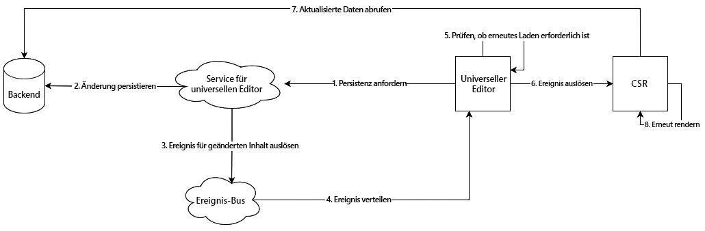

# Architektur des universellen Editors {#architecture}

Erfahren Sie mehr über die Architektur des universellen Editors und darüber, wie Daten zwischen seinen Diensten und Ebenen fließen.

## Bausteine für Architekturen {#building-blocks}

Der universelle Editor besteht aus vier wesentlichen Bausteinen, die interagieren und es Inhaltsautorinnen und -autoren ermöglichen, beliebige Aspekte von Inhalten in jeder Implementierung zu bearbeiten, um außergewöhnliche Erlebnisse bereitzustellen, die Inhaltsgeschwindigkeit zu erhöhen und ein modernes Entwicklererlebnis zu bieten.

1. [Editoren](#editors)
1. [Remote-App](#remote-app)
1. [API-Ebene](#api-layer)
1. [Persistenzschicht](#persistence-layer)

In diesem Dokument werden die einzelnen Bausteine und ihr Austausch von Daten beschrieben.

>[!TIP]
>
>Wenn Sie den universellen Editor und dessen Architektur in Aktion sehen möchten, lesen Sie das Dokument [Erste Schritte mit dem universellen Editor in AEM](getting-started.md), um zu erfahren, wie Sie Zugriff auf den universellen Editor erhalten und wie Sie mit der Instrumentierung Ihrer ersten AEM-App beginnen können, um ihn zu verwenden.

### Editoren {#editors}

* **Universeller Editor** – Der universelle Editor verwendet ein instrumentiertes DOM, um die Bearbeitung von Inhalten im Kontext zu ermöglichen. Lesen Sie [Attribute und Typen](attributes-types.md) für Details zu den notwendigen Metadaten. Im Dokument [Erste Schritte mit dem universellen Editor in AEM](getting-started.md) finden Sie ein Beispiel für die Instrumentierung in AEM.
* **Bedienfeld „Eigenschaften“**: Einige Eigenschaften von Komponenten können nicht kontextbezogen bearbeitet werden, z. B. die Drehzeit eines Karussells oder welche Akkordeon-Registerkarte immer geöffnet bzw. geschlossen werden soll. Um die Bearbeitung solcher Komponenteninformationen zu ermöglichen, steht im Seitenbedienfeld des Editors ein formularbasierter Editor zur Verfügung.

### Remote-App {#remote-app}

Damit eine App im universellen Editor kontextbezogen bearbeitet werden kann, muss das DOM instrumentiert werden. Die Remote-App muss bestimmte Attribute im DOM rendern. Lesen Sie [Attribute und Typen](attributes-types.md) für Details zu den notwendigen Metadaten. Im Dokument [Erste Schritte mit dem universellen Editor in AEM](getting-started.md) finden Sie ein Beispiel für die Instrumentierung in AEM.

Der universelle Editor strebt ein minimales SDK an, daher liegt die Instrumentierung in der Verantwortung der Remote-App-Implementierung.

### API-Ebene {#api-layer}

* **Inhaltsdaten** – Für den universellen Editor sind weder die Quellsysteme der Inhaltsdaten noch die Art und Weise ihrer Nutzung wichtig. Es ist nur wichtig, die erforderlichen Attribute mithilfe von bearbeitbaren Kontextdaten zu definieren und bereitzustellen.
* **Persistieren von Daten** – Für alle bearbeitbaren Daten gibt es eine URN-Kennung. Diese URN wird verwendet, um die Persistenz zum richtigen System und zur richtigen Ressource zu leiten.

### Persistenzschicht {#persistence-layer}

* **Inhaltsfragmentmodell** – Um das Bedienfeld zum Bearbeiten von Inhaltsfragment-Eigenschaften, den Inhaltsfragmenteditor und formularbasierte Editoren zu unterstützen, sind Modelle pro Komponente und Inhaltsfragment erforderlich.
* **Inhalt** – Der Inhalt kann an beliebiger Stelle gespeichert werden, z. B. in AEM, Magento usw.

## Universeller Editor-Dienst und Backend-System-Dispatch {#service}

Der universelle Editor sendet alle Inhaltsänderungen an einen zentralen Dienst, den sogenannten universellen Editor-Dienst. Dieser Dienst, der auf Adobe I/O Runtime ausgeführt wird, lädt in der Erweiterungsregistrierung verfügbare Plug-ins basierend auf der bereitgestellten URN. Das Plug-in ist für die Kommunikation mit dem Backend und die Rückgabe einer einheitlichen Antwort verantwortlich.

## Rendern von Pipelines {#rendering-pipelines}

### Server-seitiges Rendering {#server-side}

### Statische Site-Erstellung {#static-generation}

### Client-seitiges Rendern {#client-side}

