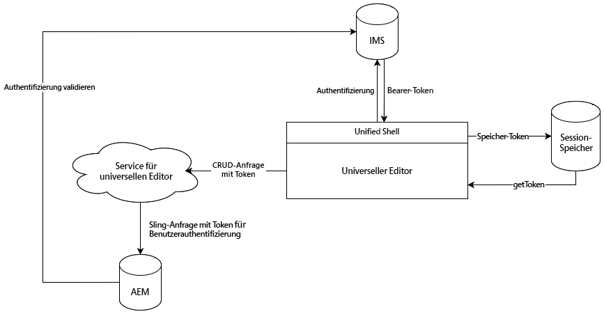

# Authentifizierung beim universellen Editor {#authentication}

Erfahren Sie, wie beim universellen Editor authentifiziert wird.

## Optionen {#options}

Der universelle Editor verwendet die IMS-Authentifizierung (Identity Management System) von Adobe, die über Unified Shell bereitgestellt wird.

Alle Anwendungen/Remote-Seiten sind für die Authentifizierung für erforderliche Backend-Systeme verantwortlich. Der universelle Editor-Dienst benötigt diese Authentifizierung, um Backend-Systeme für CRUD-Vorgänge durchzuführen, da es sich um einen eigenständigen Dienst handelt.

## Standardfluss {#standard-flow}

Dies ist die Lösung für AEM as a Cloud Service und AMS, die IMS verwenden, um den universellen Editor zu verwenden.

Um den universellen Editor zu verwenden, müssen Benutzende bei Unified Shell angemeldet sein, die sich gegenüber IMS authentifiziert. Das bereitgestellte IMS-Token wird im Sitzungsspeicher der Benutzenden gespeichert.

Wenn Benutzende einen CRUD-Vorgang ausführen, wird ein Aufruf an den universellen Editor-Dienst mit dem IMS-Bearer-Token im HTTP-Header gesendet. Der universelle Editor-Dienst verwendet dann das Bearer-Token, um die Anfrage gegenüber dem AEM Backend-System zu authentifizieren, um Vorgänge im Namen der Person auszuführen.

In diesem Diagramm und Artikel wird die interne Authentifizierung des universellen Editors selbst beschrieben.

{{ue-headless-auth}}
