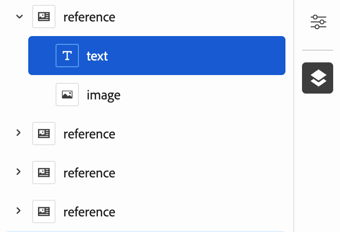
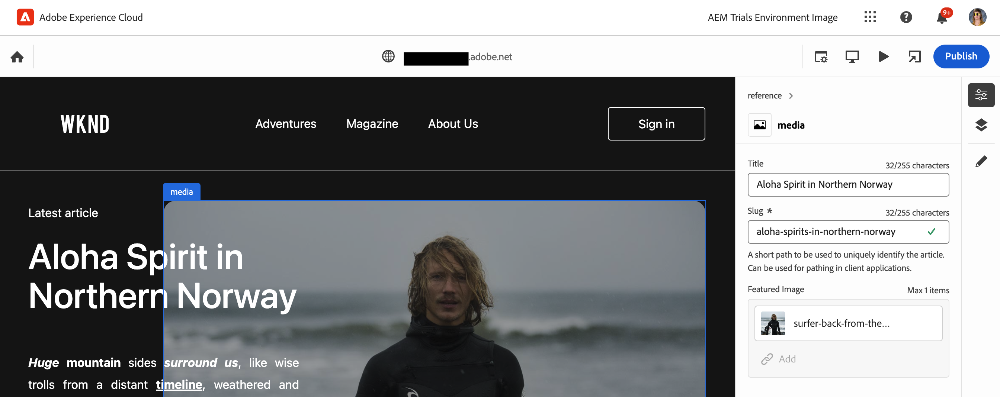

# Inhaltserstellung mit dem universellen Editor {#authoring}

Erfahren Sie, wie einfach und intuitiv es für Inhaltsautorinnen und -autoren ist, Inhalte mit dem universellen Editor zu erstellen.

{{universal-editor-status}}

## Einführung {#introduction}

Der universelle Editor ermöglicht die Bearbeitung beliebiger Inhalte in jeder Implementierung, um außergewöhnliche Erlebnisse bereitzustellen, die Inhaltsgeschwindigkeit zu erhöhen und ein modernes Entwicklererlebnis zu bieten.

Dazu bietet der universelle Editor Autoren von Inhalten eine intuitive Benutzeroberfläche, für die eine minimale Schulung erforderlich ist, um einfach in die Lage zu wechseln und mit der Bearbeitung von Inhalten zu beginnen. In diesem Dokument wird das Authoring-Erlebnis des universellen Editors beschrieben.

>[!TIP]
>
>Eine detailliertere Einführung in den universellen Editor finden Sie im Dokument [Einführung in den universellen Editor](introduction.md).

## Vorbereiten der App {#prepare-app}

Um Inhalte für eine App mit dem universellen Editor erstellen zu können, muss die App von einer Entwicklerperson instrumentiert werden, um den Editor zu unterstützen.

>[!TIP]
>
>Im Dokument [Erste Schritte mit dem universellen Editor in AEM](getting-started.md) finden Sie ein Beispiel dafür, wie Sie eine AEM-App für die Arbeit mit dem universellen Editor konfigurieren.

## Anmelden {#sign-in}

Nachdem die App für die Verwendung mit dem universellen Editor konfiguriert wurde, melden Sie sich beim universellen Editor an. Sie benötigen eine Adobe ID, um sich anzumelden und [haben Zugriff auf den universellen Editor.](getting-started.md#request-access)

Geben Sie nach der Anmeldung die URL der Seite ein, die Sie bearbeiten möchten, im [Standortleiste.](#location-bar) damit Sie mit der Bearbeitung von Inhalten beginnen können, z. B. [Textinhalt](#text-mode) oder [Medieninhalte.](#media-mode)

## Grundlegendes zur Benutzeroberfläche {#ui}

Die Benutzeroberfläche ist in diese Hauptbereiche unterteilt.

* [Die Kopfzeile von Experience Cloud](#experience-cloud-header)
* [Symbolleiste des universellen Editors](#universal-editor-toolbar)
* [Der Editor](#editor)
* [Die Eigenschaftenleiste](#properties-rail)

### Die Kopfzeile von Experience Cloud {#experience-cloud-header}

Die Kopfzeile von Experience Cloud befindet sich immer oben im Bildschirm. Es handelt sich um einen Anker, der Ihnen mitteilt, wo Sie sich in Experience Cloud befinden, und Ihnen dabei hilft, zu anderen Experience Cloud-Apps zu navigieren.

#### Experience Manager {#experience-manager}

Wählen Sie links in der Kopfzeile den Adobe Experience Cloud-Link aus, um zum Stammverzeichnis Ihrer Experience Manager-Lösung zu navigieren und auf Tools wie [Cloud Manager](/help/onboarding/cloud-manager-introduction.md), [Cloud Acceleration Manager](/help/journey-migration/cloud-acceleration-manager/introduction/overview-cam.md) und [Software-Verteilung](https://experienceleague.adobe.com/docs/experience-cloud/software-distribution/home.html?lang=de) zuzugreifen.

#### Organisation {#organization}

Dadurch wird die Organisation angezeigt, bei der Sie sich derzeit angemeldet haben. Wählen Sie diese Option aus, um zu einer anderen Organisation zu wechseln, wenn Ihre Adobe ID mit mehreren Organisationen verknüpft ist.

#### Lösungen {#solutions}

Durch Tippen oder Klicken auf den Lösungsschalter können Sie schnell zu anderen Experience Cloud-Lösungen wechseln.

#### Hilfe {#help}

Das Hilfesymbol bietet schnellen Zugriff auf Lern- und Support-Ressourcen.

#### Benachrichtigungen {#notifications}

Dieses Symbol ist mit der Anzahl der aktuell zugewiesenen unvollständigen Zeichen gekennzeichnet [Benachrichtigungen.](/help/implementing/cloud-manager/notifications.md)

#### Benutzereigenschaften {#user-properties}

Wählen Sie das Symbol für Ihren Benutzer aus, um auf Ihre Benutzereinstellungen zuzugreifen. Wenn Sie kein Benutzerbild konfiguriert haben, wird ein zufälliges Symbol zugewiesen.

### Die Symbolleiste des universellen Editors {#universal-editor-toolbar}

Die Symbolleiste des universellen Editors befindet sich immer oben im Bildschirm direkt darunter [die Experience Cloud-Kopfzeile.](#experience-cloud-header) Dadurch erhalten Sie schnellen Zugriff auf die Navigation zu einer anderen Seite, die Sie bearbeiten können, sowie auf die Veröffentlichung der aktuellen Seite.

#### Die Schaltfläche &quot;Startseite&quot; {#home-button}

Über die Schaltfläche &quot;Startseite&quot;gelangen Sie wieder zur Startseite des universellen Editors

Auf der Startseite können Sie die URL der Site eingeben, die Sie mit dem universellen Editor bearbeiten möchten.

>[!NOTE]
>
>Jede Seite, die Sie mit dem universellen Editor bearbeiten möchten, muss [instrumentiert, um den universellen Editor zu unterstützen.](getting-started.md)

#### Speicherortleiste {#location-bar}

Die Speicherortleiste zeigt die Adresse der Seite an, die Sie bearbeiten. Wählen Sie diese Option aus, um die Adresse einer anderen zu bearbeitenden Seite einzugeben.

>[!TIP]
>
>Verwenden Sie den Hotkey `L`, um die Adressleiste zu öffnen.

>[!NOTE]
>
>Jede Seite, die Sie mit dem universellen Editor bearbeiten möchten, muss [instrumentiert, um den universellen Editor zu unterstützen.](getting-started.md)

#### Einstellungen für Authentifizierungs-Header {#authentication-settings}

Wählen Sie bei Bedarf das Symbol für die Authentifizierungs-Kopfzeileneinstellungen aus. [Legen Sie einen benutzerdefinierten Authentifizierungs-Header für lokale Entwicklungszwecke fest.](/help/implementing/universal-editor/developer-overview.md#auth-header)

#### Emulator-Einstellungen {#emulator}

Wählen Sie das Emulationssymbol aus, um festzulegen, wie der Universal Editor die Seite rendert.

Durch Tippen oder Klicken auf das Emulationssymbol werden die Optionen angezeigt.

Standardmäßig wird der Editor im Desktop-Layout geöffnet, wobei Höhe und Breite automatisch vom Browser definiert werden.

Sie können auch ein Mobilgerät und im universellen Editor emulieren:

* Ausrichtung definieren
* Breite und Höhe definieren
* Ausrichtung ändern

#### Vorschaumodus {#preview-mode}

Im Vorschaumodus wird die Seite im Editor so gerendert, wie sie in Ihrem veröffentlichten Dienst angezeigt werden würde. Dadurch kann der Inhaltsautor durch Klicken auf Links zum Inhalt navigieren usw.

>[!TIP]
>
>Verwenden des Hotkeys `P` , um in den und aus dem Vorschaumodus zu wechseln.

#### App-Vorschau öffnen {#open-app-preview}

Klicken Sie auf das Symbol &quot;Vorschau der App öffnen&quot;, um die Seite zu öffnen, die Sie gerade bearbeiten, und zwar auf der eigenen Registerkarte des Browsers, die nicht vom Editor zur Vorschau Ihres Inhalts genutzt werden kann.

>[!TIP]
>
>Verwenden des Hotkeys `O` (Buchstabe O), um die App-Vorschau zu öffnen.

#### Veröffentlichen {#publish}

Wählen Sie die Veröffentlichungsschaltfläche aus, damit Sie die Änderungen am Inhalt live für Ihre Leser veröffentlichen können.

>[!TIP]
>
>Siehe Dokument . [Veröffentlichen von Inhalten mit dem universellen Editor](publishing.md) für weitere Informationen zur Veröffentlichung mit dem universellen Editor.

### Der Editor {#editor}

Der Editor belegt den Großteil des Fensters und ist dort, wo die Seite angegeben ist in [die Standortleiste](#location-bar) wird gerendert.

Wenn sich der Editor in [Vorschaumodus](#preview-mode) Der Inhalt kann navigiert werden und Sie können Links folgen, den Inhalt kann jedoch nicht bearbeitet werden.

### Eigenschaftenleiste {#properties-rail}

Die Eigenschaftenleiste befindet sich immer rechts im Editor. Je nach Modus können Details zu einer im Inhalt ausgewählten Komponente oder die Hierarchie der Seiteninhalte angezeigt werden.

#### Eigenschaftenmodus {#properties-mode}

Im Eigenschaftenmodus zeigt die Leiste die Eigenschaften der Komponente an, die derzeit im Editor ausgewählt sind. Dies ist der Standardmodus der Eigenschaftenleiste beim Laden einer Seite.

Je nach ausgewähltem Komponententyp können Details in der Eigenschaftenleiste angezeigt und geändert werden.

Nicht alle Komponenten verfügen über Details, die angezeigt und/oder bearbeitet werden können.

>[!TIP]
>
>Verwenden des Hotkeys `D` , um in den Eigenschaftenmodus zu wechseln.

#### Inhaltsbaum-Modus {#content-tree-mode}

Im Inhaltsstrukturmodus zeigt die Leiste die Hierarchie des Seiteninhalts an.

Bei der Auswahl eines Elements in der Inhaltsstruktur scrollt der Editor zu diesem Inhalt und wählt ihn aus.

>[!TIP]
>
>Verwenden des Hotkeys `F` , um in den Inhaltsbaummodus zu wechseln.

##### Bearbeiten {#edit}

Bei der Bearbeitung werden die Optionen für die ausgewählte Komponente in der Eigenschaftenleiste angezeigt, in der Sie die ausgewählte Komponente bearbeiten können. Wenn es sich bei der ausgewählten Komponente um ein Inhaltsfragment handelt, können Sie auch die Schaltfläche &quot;Bearbeiten&quot;auswählen.

Durch Tippen oder Klicken auf die Schaltfläche &quot;Bearbeiten&quot;wird das [Inhaltsfragmente-Editor](/help/assets/content-fragments/content-fragments-managing.md#opening-the-fragment-editor) in einer neuen Registerkarte. Dadurch können Sie auf die volle Leistungsfähigkeit des Inhaltsfragment-Editors zugreifen, um das zugehörige Inhaltsfragment zu bearbeiten.

Abhängig von den Anforderungen Ihres Workflows können Sie das Inhaltsfragment im universellen Editor oder direkt im Inhaltsfragment-Editor bearbeiten.

>[!TIP]
>
>Verwenden des Hotkeys `E` , um eine ausgewählte Komponente zu bearbeiten.

##### Hinzufügen {#add}

Wenn Sie eine Container-Komponente entweder in der Inhaltsstruktur oder im Editor auswählen, wird die Option zum Hinzufügen in der Eigenschaftenleiste angezeigt.

Durch Tippen oder Klicken auf die Schaltfläche zum Hinzufügen wird ein Dropdown-Menü mit Komponenten geöffnet, die für [zum ausgewählten Container hinzufügen.](#adding-components)

>[!TIP]
>
>Verwenden des Hotkeys `A` , um eine Komponente zu einer ausgewählten Container-Komponente hinzuzufügen.

##### Löschen {#delete}

Wenn Sie eine Komponente innerhalb einer Container-Komponente entweder in der Inhaltsstruktur oder im Editor auswählen, wird die Löschoption in der Eigenschaftenleiste angezeigt.

Tippen oder Klicken auf die Schaltfläche zum Löschen [löscht die Komponente.](#deleting-components)

>[!TIP]
>
>Verwenden des Hotkeys `Shift+Backspace` , um eine ausgewählte Komponente aus einem Container zu löschen.

## Bearbeiten von Inhalten {#editing-content}

Die Bearbeitung von Inhalten ist einfach und intuitiv. Wenn Sie den Mauszeiger über den Inhalt im Editor bewegen, wird der bearbeitbare Inhalt durch ein blaues Feld markiert.

>[!TIP]
>
>Durch Tippen oder Klicken auf den Inhalt wird er standardmäßig zur Bearbeitung ausgewählt. Wenn Sie durch folgende Links in Ihren Inhalt navigieren möchten, wechseln Sie zu [Vorschaumodus.](#preview-mode)

Je nach ausgewähltem Inhalt stehen Ihnen möglicherweise unterschiedliche Optionen zur Bearbeitung im Kontext zur Verfügung. Zusätzlich können Sie zusätzliche Informationen und Optionen für den Inhalt im [Eigenschaftenleiste.](#properties-rail)

### Nur Text bearbeiten {#edit-plain-text}

Sie können den Text direkt bearbeiten, indem Sie auf die Komponente doppelklicken oder doppeltippen.

Drücken Sie die Eingabetaste/die Eingabetaste oder wählen Sie außerhalb des Textfelds aus, um Ihre Änderungen zu speichern.

Wenn Sie die Textkomponente auswählen, werden deren Details in der Eigenschaftenleiste angezeigt. Sie können den Text auch in der Leiste bearbeiten.

Außerdem sind Details zu Ihrem Text in der Eigenschaftenleiste verfügbar. Änderungen werden automatisch gespeichert, sobald der Fokus das bearbeitete Feld in der Eigenschaftenleiste verlässt.

### Bearbeiten von Rich-Text {#edit-rich-text}

Sie können den Text direkt bearbeiten, indem Sie auf die Komponente doppelklicken oder doppeltippen.

Drücken Sie die Eingabetaste/die Eingabetaste oder wählen Sie außerhalb des Textfelds aus, um Ihre Änderungen zu speichern.

Außerdem sind Formatierungsoptionen und Details zu Ihrem Text in der Eigenschaftenleiste verfügbar. Änderungen werden automatisch gespeichert, sobald der Fokus das bearbeitete Feld in der Eigenschaftenleiste verlässt.

### Bearbeiten von Medien {#edit-media}

Sie können die Details in der Eigenschaftenleiste anzeigen.

1. Tippen oder klicken Sie in der Eigenschaftenleiste auf die Vorschau des ausgewählten Bildes.
1. Die [Asset-Wähler](/help/assets/asset-selector.md#using-asset-selector) -Fenster geöffnet, in dem Sie ein Asset auswählen können.
1. Wählen Sie diese Option, um ein neues Asset auszuwählen.
1. Auswählen **Auswählen** , um zur Eigenschaftenleiste zurückzukehren, in der das Asset ersetzt wurde.

Änderungen werden automatisch in Ihrem Inhalt gespeichert.

### Bearbeiten von Inhaltsfragmenten {#edit-content-fragment}

Wenn Sie eine [Inhaltsfragment,](/help/sites-cloud/administering/content-fragments/overview.md) Sie können die Details in der Eigenschaftenleiste bearbeiten.

Die im Inhaltsmodell des ausgewählten Inhaltsfragments definierten Felder werden in der Eigenschaftenleiste angezeigt und können bearbeitet werden.

Wenn Sie ein Feld auswählen, das sich auf ein Inhaltsfragment bezieht, wird das Inhaltsfragment in der Komponentenleiste geladen und zu dem Feld wird automatisch ein Bildlauf durchgeführt.

Änderungen werden automatisch gespeichert, sobald der Fokus das bearbeitete Feld in der Eigenschaftenleiste verlässt.

Wenn Sie Ihr Inhaltsfragment im [Inhaltsfragmente-Editor](/help/sites-cloud/administering/content-fragments/authoring.md) Klicken Sie stattdessen auf die [Schaltfläche &quot;Bearbeiten&quot;](#edit) in der Modusleiste.

Abhängig von den Anforderungen Ihres Workflows können Sie das Inhaltsfragment im universellen Editor oder direkt im Inhaltsfragment-Editor bearbeiten.

### Hinzufügen von Komponenten zu Containern {#adding-components}

1. Wählen Sie eine Container-Komponente in der Inhaltsstruktur oder im Editor aus.
1. Wählen Sie dann das Symbol zum Hinzufügen in der Eigenschaftenleiste aus.

   

Die Komponente wird in den Container eingefügt und kann im Editor bearbeitet werden.

>[!TIP]
>
>Verwenden des Hotkeys `A` , um dem ausgewählten Container eine Komponente hinzuzufügen.

### Löschen von Komponenten aus Containern {#deleting-components}

1. Wählen Sie eine Container-Komponente in der Inhaltsstruktur oder im Editor aus.
1. Wählen Sie das Pfeilsymbol des Containers aus, um seinen Inhalt in der Inhaltsstruktur zu erweitern.
1. Wählen Sie dann in der Inhaltsstruktur eine Komponente im Container aus.
1. Wählen Sie in der Eigenschaftenleiste das Löschsymbol aus.

   

Die ausgewählte Komponente wurde gelöscht.

>[!TIP]
>
>Verwenden des Hotkeys `Shift+Backspace` , um die ausgewählte Komponente aus ihrem Container zu löschen.

### Neuanordnen von Komponenten in Containern {#reordering-components}

1. Wählen Sie eine Container-Komponente in der Inhaltsstruktur oder im Editor aus.
1. Wenn nicht bereits in [Inhaltsbaum-Modus,](#content-tree-mode) darauf umschalten.
1. Wählen Sie das Pfeilsymbol des Containers aus, um seinen Inhalt in der Inhaltsstruktur zu erweitern.
1. Ziehpunkte neben den Komponenten im Container zeigen, dass Sie sie neu anordnen können. Ziehen Sie die Komponenten, um sie innerhalb des Containers neu anzuordnen.

   

1. Die gezogene Komponente wird in der Komponentenstruktur grau dargestellt, während der Einfügepunkt durch eine blaue Linie dargestellt wird. Lassen Sie die Komponente frei, um sie an ihrer neuen Position zu platzieren.

Die Komponenten werden sowohl in der Inhaltsstruktur als auch im Editor neu angeordnet

## Vorschau von Inhalten {#previewing-content}

Wenn Sie mit der Bearbeitung von Inhalten fertig sind, möchten Sie häufig durch diese navigieren, um zu sehen, wie sie im Inhalt anderer Seiten aussehen. Im [Vorschaumodus](#preview-mode) können Sie auf Links klicken, um genau wie eine Person, die Ihre Inhalte liest, durch diese zu navigieren. Der Inhalt wird im Editor so wiedergegeben, wie er veröffentlicht werden würde.

Im Vorschaumodus reagiert das Tippen oder Klicken auf den Inhalt so, wie es für einen Leser des Inhalts der Fall wäre. Wenn Sie den zu bearbeitenden Inhalt auswählen möchten, können Sie [Vorschaumodus.](#preview-mode)

## Zusätzliche Ressourcen {#additional-resources}

Weitere Informationen zum universellen Editor finden Sie in diesen Dokumenten.

* [Einführung in den universellen Editor](introduction.md) – Erfahren Sie, wie der universelle Editor die Bearbeitung beliebiger Inhalte in jeder Implementierung ermöglicht, um außergewöhnliche Erlebnisse bereitzustellen, die Inhaltsgeschwindigkeit zu erhöhen und ein modernes Entwicklererlebnis zu bieten.
* [Veröffentlichen von Inhalten mit dem universellen Editor](publishing.md) - Erfahren Sie, wie der Universal Editor Inhalte veröffentlicht und wie Ihre Apps mit den veröffentlichten Inhalten umgehen können.
* [Erste Schritte mit dem universellen Editor in AEM](getting-started.md) – Erfahren Sie, wie Sie Zugriff auf den universellen Editor erhalten und wie Sie mit der Instrumentierung Ihrer ersten AEM-App beginnen, um ihn zu verwenden.
* [Architektur des universellen Editors](architecture.md) – Erfahren Sie mehr über die Architektur des universellen Editors und darüber, wie Daten zwischen seinen Diensten und Ebenen fließen.
* [Attribute und Typen](attributes-types.md) – Erfahren Sie mehr über die Datenattribute und -typen, die der universelle Editor erfordert.
* [Authentifizierung beim universellen Editor](authentication.md) – Erfahren Sie, wie beim universellen Editor authentifiziert wird.
