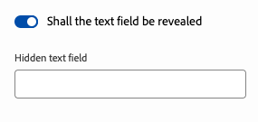

# Anpassen und Erweitern des universellen Editors {#customizing-extending}

Erfahren Sie mehr über die verschiedenen Erweiterungspunkte und anderen Funktionen, mit denen Sie das Inhaltserstellungserlebnis des universellen Editors anpassen können, um die Anforderungen Ihrer Inhaltsautorinnen und Inhaltsautoren zu unterstützen.

## Überblick {#overview}

Der universelle Editor ermöglicht zwei Arten der Anpassung an die Anforderungen Ihres Projekts.

* [Anpassen des universellen Editors](#customizing) – Die Standardfunktionen des universellen Editors können über verschiedene Anpassungskonfigurationen angepasst werden.
* [Erweitern der Benutzeroberfläche des universellen Editors](#extending) – Die Benutzeroberfläche des universellen Editors kann auch mit App Builder erweitert werden, damit sie die Anforderungen Ihrer Projekte erfüllt.

Beide Arten werden in den folgenden Abschnitten beschrieben.

## Anpassen des universellen Editors {#customizing}

Der universelle Editor bietet mehrere integrierte Optionen zur Anpassung seiner Funktionen.

### Deaktivieren der Veröffentlichung {#disable-publish}

Bestimmte Authoring-Workflows erfordern, dass Inhalte vor der Veröffentlichung überprüft werden. In solchen Fällen sollte die Option zur Veröffentlichung für Autorinnen und Autoren nicht verfügbar sein.

Die Schaltfläche **Veröffentlichen** kann daher in einer App vollständig unterdrückt werden, indem die folgenden Metadaten hinzugefügt werden.

```html
<meta name="urn:adobe:aue:config:disable" content="publish"/>
```

### Filtern von Komponenten {#filtering-components}

Sie können die zulässigen Komponenten pro Container im universellen Editor mithilfe von Komponentenfiltern einschränken. Weitere Informationen finden unter [ Filtern von Komponenten](/help/implementing/universal-editor/filtering.md).

### Bedingtes Anzeigen und Ausblenden von Komponenten im Bedienfeld „Eigenschaften“ {#conditionally-hide}

Obwohl eine oder mehrere Komponenten für Ihre Autorinnen und Autoren allgemein verfügbar sein können, kann es in bestimmten Situationen vorkommen, dass dies nicht sinnvoll ist. In solchen Fällen können Sie Komponenten im Bedienfeld Eigenschaften ausblenden, indem Sie den [Feldern des Komponentenmodells“ ein `condition`-Attribut ](/help/implementing/universal-editor/field-types.md#fields).

Bedingungen können mithilfe des JsonLogic[Schemas definiert ](https://jsonlogic.com/). Wenn die Bedingung erfüllt ist, wird das Feld angezeigt. Wenn die Bedingung nicht zutrifft, wird das Feld ausgeblendet.

>[!BEGINTABS]

>[!TAB Beispielmodell]

```json
 {
    "id": "conditionally-revealed-component",
    "fields": [
      {
        "component": "boolean",
        "label": "Shall the text field be revealed?",
        "name": "reveal",
        "valueType": "boolean"
      },
      {
        "component": "text-input",
        "label": "Hidden text field",
        "name": "hidden-text",
        "valueType": "string",
        "condition": { "===": [{"var" : "reveal"}, true] }
      }
    ]
 }
```

>[!TAB Bedingung trifft nicht zu]


>[!TAB Bedingung trifft zu]



>[!ENDTABS]

### Benutzerdefinierte Vorschau-URLs {#custom-preview-urls}

Sie können eine benutzerdefinierte Vorschau-URL über eine `urn:adobe:aue:config:preview` Meta-Konfiguration angeben, die geöffnet wird, wenn Sie auf die Schaltfläche **Seite öffnen** in der Symbolleiste [Editor oben rechts](/help/sites-cloud/authoring/universal-editor/navigation.md#universal-editor-toolbar) klicken.

Dies ist besonders für Programme mit bestimmten Vorschauanforderungen nützlich, z. B. solche, [die Edge Delivery Services mit WYSIWYG Authoring verwenden](/help/edge/wysiwyg-authoring/authoring.md).

Fügen Sie dazu einfach die gewünschte Vorschau-URL wie im folgenden Beispiel in ein Meta-Tag der instrumentierten App ein.

```html
<meta name="urn:adobe:aue:config:preview" content="https://wknd.site"/>
```

## Erweitern der Benutzeroberfläche des universellen Editors {#extending}

Als Adobe Experience Cloud-Service kann die Benutzeroberfläche des universellen Editors mit App Builder und Experience Manager erweitert werden.

Benutzeroberflächenerweiterungen sind JavaScript-Anwendungen, die mit Adobe App Builder erstellt wurden und in Benutzeroberflächenanwendungen eingebettet werden können, die unter Unified Shell in Adobe Experience Cloud ausgeführt werden, z. B. im universellen Editor. Sie können Ihre eigenen Schaltflächen und Aktionen zum Kopfzeilenmenü und zum Bedienfeld „Eigenschaften“ hinzufügen und eigene Ereignisse für den universellen Editor erstellen.

Weitere Informationen zu diesen Möglichkeiten finden Sie in den folgenden Ressourcen:

1. [Erweiterbarkeit der Benutzeroberfläche](https://developer.adobe.com/uix/docs/) – Dies ist die Entwicklerdokumentation für die Benutzeroberflächenerweiterung.
1. [Anleitung für die Erweiterung der Benutzeroberfläche](https://developer.adobe.com/uix/docs/guides/) – Schritt-für-Schritt-Anleitung zur Entwicklung Ihrer eigenen Erweiterung
1. [Erweiterungspunkte für den universellen Editor](https://developer.adobe.com/uix/docs/services/aem-universal-editor/) – Dokumentation zu den Erweiterungspunkten spezifisch für den universellen Editor

>[!TIP]
>
>Wenn Sie es vorziehen, anhand von Beispielen zu lernen, lesen Sie bitte das Tutorial zur Erweiterbarkeit der [AEM-Benutzeroberfläche](https://experienceleague.adobe.com/de/docs/experience-manager-learn/cloud-service/developing/extensibility/ui/overview). Obwohl sie sich auf die Erweiterung der Inhaltsfragmentkonsole konzentriert, sind die Konzepte zur Implementierung einer Benutzeroberflächenerweiterung im universellen Editor dieselben.

[Mit dem Extension Manager in AEM Sites](https://developer.adobe.com/uix/docs/extension-manager/) können Sie Ihre Erweiterungen für jede Instanz aktivieren oder deaktivieren, auf die Adobe-Erstanbietererweiterungen zugreifen, einschließlich der Erweiterungen für den universellen Editor, und vieles mehr.
