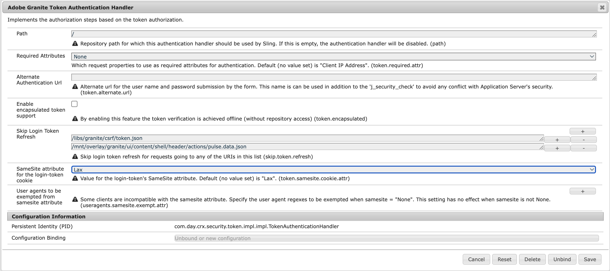

# Übersicht über den universellen Editor für AEM-Entwicklerinnen und -entwickler {#developer-overview}

Wenn Sie als AEM-Entwicklerin bzw. -entwickler daran interessiert sind, wie der universelle Editor funktioniert und wie er in Ihrem Projekt verwendet wird, bietet Ihnen dieses Dokument eine durchgängige Einführung, indem es Sie durch die Anleitung des WKND-Projekts zur Verwendung mit dem universellen Editor führt.

## Zweck {#purpose}

Dieses Dokument dient als Einführung für AEM-Entwicklerinnen bzw. -entwickler in die Funktionsweise des universellen Editors und die Instrumentierung Ihrer Anwendung, damit diese funktioniert.

Dies geschieht anhand eines Standardbeispiels, mit dem die meisten AEM-Entwicklerinnen und -entwickler vertraut sind, nämlich der Kernkomponenten und der WKND-Site, und mit dem Instrumentieren einiger Beispielkomponenten, die mit dem universellen Editor bearbeitbar sind.

>[!TIP]
>
>In diesem Dokument werden zusätzliche Schritte beschrieben, um zu veranschaulichen, wie der universelle Editor funktioniert. Außerdem soll das Verständnis der Entwicklerinnen und Entwickler für den Editor vertieft werden. Es ist also nicht der direkteste Weg, eine App zu instrumentieren, aber der anschaulichste für den universellen Editor und seine Funktionsweise.
>
>Wenn Sie so schnell wie möglich loslegen möchten, finden Sie weitere Informationen im Dokument [Erste Schritte mit dem universellen Editor in AEM](/help/implementing/universal-editor/getting-started.md).

## Voraussetzungen {#prerequisites}

Um dieser Übersicht folgen zu können, benötigen Sie Folgendes.

* [Eine lokale Entwicklungsinstanz in AEM as a Cloud Service](https://experienceleague.adobe.com/docs/experience-cloud/software-distribution/home.html?lang=de)
   * Ihre lokale Entwicklungsinstanz muss [für Entwicklungszwecke mit HTTPS auf `localhost` konfiguriert sein.](https://experienceleague.adobe.com/docs/experience-manager-learn/foundation/security/use-the-ssl-wizard.html?lang=de)
   * [Die WKND-Demosite muss installiert sein.](https://github.com/adobe/aem-guides-wknd)
* [Zugriff auf den universellen Editor](/help/implementing/universal-editor/getting-started.md#onboarding)
* [Ein lokaler universeller Editor-Dienst](/help/implementing/universal-editor/local-dev.md), der zu Entwicklungszwecken läuft
   * Stellen Sie sicher, dass Ihr Browser [das selbstsignierte Zertifikat der lokalen Dienste akzeptiert.](/help/implementing/universal-editor/local-dev.md#editing)

Neben einer allgemeinen Vertrautheit mit der Web-Entwicklung geht dieses Dokument von der grundlegenden Vertrautheit mit AEM-Entwicklung aus. Wenn Sie keine Erfahrung mit der AEM-Entwicklung haben, sollten Sie sich [das WKND-Tutorial ansehen, bevor Sie fortfahren](/help/implementing/developing/introduction/develop-wknd-tutorial.md).

## Starten von AEM und Anmelden beim universellen Editor {#sign-in}

Falls Sie dies noch nicht getan haben, müssen Sie Ihre lokale AEM-Entwicklungsinstanz mit installiertem WKND und aktiviertem HTTPS [wie in den Voraussetzungen beschrieben](#prerequisites) ausführen. Diese Übersicht geht davon aus, dass Ihre Instanz auf `https://localhost:8443` läuft.

1. Öffnen Sie die WKND-Musterseite auf Englisch im AEM-Editor.

   ```text
   https://localhost:8443/editor.html/content/wknd/language-masters/en.html
   ```

1. Wählen Sie im Menü **Seiteninformationen** des Editors die Option **Als veröffentlicht anzeigen**. Dadurch wird dieselbe Seite auf einer neuen Registerkarte geöffnet, auf der der AEM-Editor deaktiviert ist.

   ```text
   https://localhost:8443/content/wknd/language-masters/en.html?wcmmode=disabled
   ```

1. Kopieren Sie diesen Link.

1. Melden Sie sich jetzt beim universellen Editor an.

   ```text
   https://experience.adobe.com/#/aem/editor
   ```

1. Fügen Sie den Link, den Sie zuvor vom WKND-Inhalt kopiert haben, in das Feld **Site-URL** des universellen Editors ein und klicken Sie auf **Öffnen**.

   

## Der universelle Editor versucht, den Inhalt zu laden {#sameorigin}

Der universelle Editor lädt den zu bearbeitenden Inhalt in einen Frame. AEM-Standardeinstellungen für X-Frame-Optionen verhindern dies, was im Browser eindeutig als Fehler angezeigt und in der Konsolenausgabe detailliert dargestellt werden kann, wenn versucht wird, Ihre lokale Kopie von WKND zu laden.


Die X-Frame-Option `sameorigin` verhindert das Rendern von AEM-Seiten in einem Frame. Sie müssen diesen Header entfernen, damit die Seiten im universellen Editor geladen werden können.

1. Öffnen Sie den Configuration Manager. 

   ```text
   https://localhost:8443/system/console/configMgr
   ```

1. Bearbeiten Sie die OSGi-Konfiguration`org.apache.sling.engine.impl.SlingMainServlet`

   

1. Löschen Sie die Eigenschaft `X-Frame-Options=SAMEORIGIN` der Eigenschaft **Zusätzliche Antwort-Header**.

1. Speichern Sie die Änderungen.

Wenn Sie jetzt den universellen Editor neu laden, sehen Sie, dass Ihre AEM-Seite geladen wird.

>[!TIP]
>
>* Weitere Informationen zu dieser OSGi-Konfiguration finden Sie im Dokument [Erste Schritte mit dem universellen Editor in AEM](/help/implementing/universal-editor/getting-started.md#sameorigin).
>* Weitere Informationen zu OSGi in AEM finden Sie im Dokument [Konfiguration von OSGi für Adobe Experience Manager as a Cloud Service](/help/implementing/deploying/configuring-osgi.md).

## Umgang mit Cookies derselben Site {#samesite-cookies}

Wenn der universelle Editor Ihre Seite lädt, wird die AEM-Anmeldeseite aufgerufen, um sicherzustellen, dass Sie authentifiziert sind, um Änderungen vornehmen zu können.

Sie können sich jedoch nicht erfolgreich anmelden. In der Browser-Konsole können Sie sehen, dass der Browser die Eingabe im Frame blockiert hat.


Das Anmelde-Token-Cookie wird als Drittanbieter-Domain an AEM gesendet. Daher müssen in AEM die gleichen Site-Cookies erlaubt sein.

1. Öffnen Sie den Configuration Manager. 

   ```text
   https://localhost:8443/system/console/configMgr
   ```

1. Bearbeiten Sie die OSGi-Konfiguration `com.day.crx.security.token.impl.impl.TokenAuthenticationHandler`

   

1. Ändern Sie die Eigenschaft für das **SameSite-Attribut für das Login-Token-Cookie** in `None`.

1. Speichern Sie die Änderungen.

Wenn Sie nun den universellen Editor neu laden, können Sie sich erfolgreich bei AEM anmelden und Ihre Zielseite wird geladen.

>[!TIP]
>
>* Weitere Informationen zu dieser OSGi-Konfiguration finden Sie im Dokument [Erste Schritte mit dem universellen Editor in AEM](/help/implementing/universal-editor/getting-started.md#samesite-cookies).
>* Weitere Informationen zu OSGi in AEM finden Sie im Dokument [Konfiguration von OSGi für Adobe Experience Manager as a Cloud Service](/help/implementing/deploying/configuring-osgi.md).

## Universeller Editor verbindet sich mit dem Remote-Frame {#ue-connect-remote-frame}

Nachdem die Seite im universellen Editor geladen wurde und Sie sich bei AEM angemeldet haben, versucht der universelle Editor, eine Verbindung zum Remote-Frame herzustellen. Dies erfolgt über eine JavaScript-Bibliothek, die im Remote-Frame geladen werden muss. Wenn die JavaScript-Bibliothek nicht vorhanden ist, erzeugt die Seite letztendlich einen Timeout-Fehler in der Konsole.


Sie müssen die erforderliche JavaScript-Bibliothek zur Seitenkomponente der WKND-App hinzufügen.

1. Öffnen Sie CRXDE Lite.

   ```text
   https://localhost:8443/crx/de
   ```

1. Bearbeiten Sie unter `/apps/wknd/components/page` die Datei `customheaderlibs.html`.

   

1. Fügen Sie die JavaScript-Bibliothek am Ende der Datei hinzu.

   ```html
   <script src="https://universal-editor-service.adobe.io/cors.js" async></script>
   ```

1. Klicken Sie auf **Alles speichern** und laden Sie dann den universellen Editor neu.

Die Seite wird jetzt mit der richtigen JavaScript-Bibliothek geladen, sodass der universelle Editor eine Verbindung zu Ihrer Seite herstellen kann und der Timeout-Fehler nicht mehr in der Konsole angezeigt wird.

>[!TIP]
>
>* Die Bibliothek kann entweder in die Kopfzeile oder in die Fußzeile geladen werden.

>[!NOTE]
>
>Die zuvor empfohlene Methode zum Einschließen der JavaScript-Bibliothek, `<script src="https://universal-editor-service.experiencecloud.live/corslib/LATEST"></script>` oder über npmjs.com wird nicht mehr empfohlen, da das Paket veraltet ist.
>
>Wenn eine App weiterhin das veraltete Paket verwendet, zeigt der universelle Editor in der Benutzeroberfläche eine Warnung an, dass ein veraltetes Paket erkannt wird.

## Definieren einer Verbindung zum Beibehalten von Änderungen {#connection}

Die WKND-Seite wird jetzt erfolgreich im universellen Editor geladen und die JavaScript-Bibliothek wird geladen, um den Editor mit Ihrer App zu verbinden.

Wahrscheinlich haben Sie jedoch bemerkt, dass Sie im universellen Editor nicht mit der Seite interagieren können. Der universelle Editor kann Ihre Seite nicht bearbeiten. Damit der universelle Editor Ihren Inhalt bearbeiten kann, müssen Sie eine Verbindung definieren, damit er weiß, wohin der Inhalt geschrieben werden soll. Für die lokale Entwicklung müssen Sie auf Ihre lokale AEM-Entwicklungsinstanz unter `https://localhost:8443` zurückschreiben.

1. Öffnen Sie CRXDE Lite.

   ```text
   https://localhost:8443/crx/de
   ```

1. Bearbeiten Sie unter `/apps/wknd/components/page` die Datei `customheaderlibs.html`.

   

1. Fügen Sie die erforderlichen Metadaten für die Verbindung zu Ihrer lokalen AEM-Instanz am Dateiende hinzu.

   ```html
   <meta name="urn:adobe:aue:system:aem" content="aem:https://localhost:8443">
   ```

   * Es wird immer die neueste Version der Bibliothek empfohlen. Wenn Sie eine frühere Version benötigen, finden Sie weitere Informationen dazu unter [Erste Schritte mit dem universellen Editor in AEM](/help/implementing/universal-editor/getting-started.md#alternative).

1. Fügen Sie am Ende der Datei die erforderlichen Metadaten für die Verbindung mit Ihrem lokalen universellen Editor-Dienst hinzu.

   ```html
   <meta name="urn:adobe:aue:config:service" content="https://localhost:8000">
   ```

1. Klicken Sie auf **Alles speichern** und laden Sie dann den universellen Editor neu.

Jetzt kann der universelle Editor nicht nur Ihre Inhalte erfolgreich von Ihrer lokalen AEM-Entwicklungsinstanz laden, sondern weiß auch, wo alle Änderungen, die Sie mit Ihrem lokalen universellen Editor-Dienst vornehmen, gespeichert werden sollen. Dies ist der erste Schritt, um Ihre App so zu instrumentieren, dass sie mit dem universellen Editor bearbeitet werden kann.

>[!TIP]
>
>* Weitere Informationen zu den Verbindungsmetadaten finden Sie im Dokument [Erste Schritte mit dem universellen Editor in AEM](/help/implementing/universal-editor/getting-started.md#connection).
>* Weitere Informationen über die Struktur des universellen Editors finden Sie im Dokument [Architektur des universellen Editors](/help/implementing/universal-editor/architecture.md#service).
>* Im Dokument [Lokale AEM-Entwicklung mit dem universellen Editor](/help/implementing/universal-editor/local-dev.md) finden Sie weitere Informationen dazu, wie Sie sich mit einer selbst gehosteten Version des universellen Editors verbinden.

## Instrumentieren von Komponenten {#instrumenting-components}

Sie werden jedoch wahrscheinlich feststellen, dass Sie mit dem universellen Editor immer noch wenig tun können. Wenn Sie versuchen, im universellen Editor oben auf der WKND-Seite auf den Teaser zu klicken, können Sie ihn (oder ebenso alles andere auf der Seite) nicht auswählen.

Ihre Komponenten müssen ebenfalls instrumentiert sein, um mit dem universellen Editor bearbeitet werden zu können. Dazu müssen Sie die Teaser-Komponente bearbeiten. Daher müssen Sie die Kernkomponenten überlagern, da die Kernkomponenten unter `/libs` liegen, das unveränderlich ist.

1. Öffnen Sie CRXDE Lite.

   ```text
   https://localhost:8443/crx/de
   ```

1. Wählen Sie den Knoten `/libs/core/wcm/components` und klicken Sie auf **Überlagerungsknoten** in der Symbolleiste.

1. Wenn Sie `/apps/` als **Überlagerungsort** ausgewählt haben, klicken Sie auf **OK**.

   

1. Wählen Sie den Knoten `teaser` unter `/libs/core/wcm/components` und klicken Sie in der Symbolleiste auf **Kopieren**.

1. Wählen Sie den überlagerten Knoten bei `/apps/core/wcm/components` und klicken Sie in der Symbolleiste auf **Einfügen**.

1. Doppelklicken Sie auf die Datei `/apps/core/wcm/components/teaser/v2/teaser/teaser.html`, um sie zu bearbeiten.

   

1. Fügen Sie am Ende des ersten `div`, etwa in Zeile 26, die Details zur Instrumentierung der Komponente hinzu.

   ```text
   data-aue-resource="urn:aem:${resource.path}"
   data-aue-type="component"
   data-aue-label="Teaser"
   ```

1. Klicken Sie in der Symbolleiste auf **Alles speichern** und laden Sie den universellen Editor neu.

1. Klicken Sie im universellen Editor oben auf der Seite auf die Teaser-Komponente, und Sie sehen, dass Sie sie jetzt auswählen können.

1. Wenn Sie im Bedienfeld „Eigenschaften“ des universellen Editors auf das Symbol **Inhaltsstruktur** klicken, können Sie sehen, dass der Editor alle Teaser auf der Seite erkannt hat, nachdem Sie sie instrumentiert haben. Der ausgewählte Teaser ist der hervorgehobene.

   

>[!TIP]
>
>Im Dokument [Verwendung der Sling Resource Merger in Adobe Experience Manager as a Cloud Service](/help/implementing/developing/introduction/sling-resource-merger.md) finden Sie weitere Einzelheiten zum Überlagern von Knoten.

## Instrumentenunterkomponenten des Teasers {#subcomponents}

Sie können jetzt den Teaser auswählen, ihn jedoch nicht bearbeiten. Der Grund dafür ist, dass der Teaser aus verschiedenen Komponenten besteht, z. B. der Bild- und der Titelkomponente. Sie müssen diese Unterkomponenten erst instrumentieren, um sie zu bearbeiten.

1. Öffnen Sie CRXDE Lite.

   ```text
   https://localhost:8443/crx/de
   ```

1. Wählen Sie den Knoten `/apps/core/wcm/components/teaser/v2/teaser/` und doppelklicken Sie auf die Datei `title.html`.

   

1. Fügen Sie die folgenden Eigenschaften am Ende des Tags `h2` ein (etwa bei Zeile 17).

   ```text
   data-aue-prop="jcr:title"
   data-aue-type="text"
   data-aue-label="Title"
   ```

1. Klicken Sie in der Symbolleiste auf **Alles speichern** und laden Sie den universellen Editor neu.

1. Klicken Sie oben auf der Seite auf den Titel derselben Teaser-Komponente, und Sie sehen, dass Sie sie jetzt auswählen können. Die Inhaltsstruktur zeigt auch den Titel als Teil der ausgewählten Teaser-Komponente an.

   

Sie können jetzt den Titel der Teaser-Komponente bearbeiten!

## Was bedeutet das alles? {#what-does-it-mean}

Nachdem Sie jetzt den Titel des Teasers bearbeiten können, sollten wir einen Moment Zeit nehmen, um zu überprüfen, was Sie bisher erreicht haben und wie.

Sie haben die Teaser-Komponente für den universellen Editor identifiziert, indem Sie sie instrumentiert haben.

* `data-aue-resource` identifiziert die Ressource in AEM, die bearbeitet wird.
* `data-aue-type` definiert, dass die Elemente als Seitenkomponente behandelt werden sollen (im Gegensatz zu Containern).
* `data-aue-label` zeigt eine benutzerfreundliche Beschriftung in der Benutzeroberfläche für den ausgewählten Teaser an.

Sie haben auch die Titelkomponente innerhalb der Teaser-Komponente instrumentiert.

* `data-aue-prop` ist das geschriebene JCR-Attribut.
* `data-aue-type` ist die Art und Weise, wie das Attribut bearbeitet werden sollte. In diesem Fall geschieht dies mit dem Texteditor, da es sich um einen Titel handelt (im Gegensatz zum Rich-Text-Editor).

## Definieren der Authentifizierungs-Header {#auth-header}

Jetzt können Sie den Titel des Teasers inline bearbeiten und Änderungen werden im Browser beibehalten.


Wenn Sie den Browser jedoch neu laden, wird erneut der vorherige Titel geladen. Das liegt daran, dass der universelle Editor zwar weiß, wie er sich mit Ihrer AEM-Instanz verbinden kann, sich aber noch nicht bei Ihrer AEM-Instanz authentifizieren kann, um Änderungen in den JCR zurückzuschreiben.

Wenn Sie in den Entwickler-Tools des Browsers die Registerkarte „Netzwerk“ anzeigen und nach `update` suchen, können Sie sehen, dass ein 401-Fehler auftritt, wenn Sie versuchen, den Titel zu bearbeiten.


Wenn Sie den universellen Editor verwenden, um Ihre Produktions-AEM-Inhalte zu bearbeiten, verwendet der universelle Editor dasselbe IMS-Token, das Sie zum Anmelden beim Editor verwendet haben, um sich bei AEM zu authentifizieren, um das Zurückschreiben an das JCR zu erleichtern.

Wenn Sie lokal entwickeln, können Sie den AEM-Identitätsanbieter nicht verwenden, da IMS-Token nur an Adobe-eigene Domains weitergegeben werden. Sie müssen manuell eine Authentifizierungsmethode bereitstellen, indem Sie explizit einen Authentifizierungs-Header festlegen.

1. Klicken Sie in der Benutzeroberfläche des universellen Editors auf das Symbol **Authentifizierungs-Header** in der Symbolleiste.

1. Kopieren Sie den erforderlichen Authentifizierungs-Header, um sich bei Ihrer lokalen AEM-Instanz zu authentifizieren, und klicken Sie auf **Speichern**.

   

1. Laden Sie den universellen Editor neu und bearbeiten Sie jetzt den Titel des Teasers.

In der Browser-Konsole werden keine Fehler mehr gemeldet und die Änderungen werden wieder in Ihrer lokalen AEM-Entwicklungsinstanz beibehalten.

Wenn Sie den Datenverkehr in den Browser-Entwickler-Tools untersuchen und nach den `update`-Ereignissen suchen, können Sie die Details der Aktualisierung sehen.


```json
{
  "connections": [
    {
      "name": "aem",
      "protocol": "aem",
      "uri": "https://localhost:8443"
    }
  ],
  "target": {
    "resource": "urn:aem:/content/wknd/language-masters/en/jcr:content/root/container/carousel/item_1571954853062",
    "type": "text",
    "prop": "jcr:title"
  },
  "value": "Tiny Toon Adventures"
}
```

* `connections` ist die Verbindung zu Ihrer lokalen AEM-Instanz.
* `target` ist der genaue Knoten und die Eigenschaften, die in JCR aktualisiert werden.
* `value` ist die von Ihnen vorgenommene Aktualisierung.

Sie können sehen, dass die Änderung in JCR beibehalten wurde.


>[!TIP]
>
>Online stehen viele Tools zur Verfügung, mit denen Sie die erforderlichen Authentifizierungs-Header für Ihre Test- und Entwicklungszwecke generieren können.
>
>Das grundlegende Beispiel für den Authentifizierungs-Header `Basic YWRtaW46YWRtaW4=` steht für die Benutzer/Kennwort-Kombination `admin:admin`, wie sie für die lokale AEM-Entwicklung üblich ist.

## Instrumentieren der App für das Bedienfeld „Eigenschaften“ {#properties-rail}

Sie verfügen jetzt über eine App, die mit dem universellen Editor bearbeitbar ist!

Die Bearbeitung ist derzeit auf die Inline-Bearbeitung des Teaser-Titels beschränkt. Es gibt jedoch Fälle, in denen eine Bearbeitung im Kontext nicht ausreicht. Text wie der Titel des Teasers kann mit Tastatureingaben an der Stelle bearbeitet werden, an der er vorliegt. Komplexere Elemente müssen jedoch in der Lage sein, strukturierte Daten separat von ihrer Darstellung im Browser anzuzeigen und zu bearbeiten. Hierzu dient das Bedienfeld „Eigenschaften“.

Um Ihre App zu aktualisieren und das Bedienfeld „Eigenschaften“ für die Bearbeitung zu verwenden, kehren Sie zur Header-Datei der Seitenkomponente Ihrer App zurück. Hier haben Sie bereits die Verbindungen zu Ihrer lokalen AEM-Entwicklungsinstanz und Ihrem lokalen universellen Editor-Dienst hergestellt. Hier müssen Sie die Komponenten definieren, die in der App bearbeitet werden können, sowie deren Datenmodelle.

1. Öffnen Sie CRXDE Lite.

   ```text
   https://localhost:8443/crx/de
   ```

1. Bearbeiten Sie unter `/apps/wknd/components/page` die Datei `customheaderlibs.html`.

   

1. Fügen Sie am Ende der Datei das erforderliche Skript hinzu, um die Komponenten zu definieren.

   ```html
   <script type="application/vnd.adobe.aue.component+json">
   {
     "groups": [
       {
         "title": "General Components",
         "id": "general",
         "components": [
           {
             "title": "Teaser",
             "id": "teaser",
             "plugins": {
               "aem": {
                 "page": {
                   "resourceType": "wknd/components/teaser"
                 }
               }
             }
           },
           {
             "title": "Title",
             "id": "title",
             "plugins": {
               "aem": {
                 "page": {
                   "resourceType": "wknd/components/title"
                 }
               }
             }
           }
         ]
       }
     ]
   }
   </script>
   ```

1. Darunter, am Ende der Datei, fügen Sie das notwendige Skript hinzu, um das Modell zu definieren.

   ```html
   <script type="application/vnd.adobe.aue.model+json">
   [
     {
       "id": "teaser",
       "fields": [
         {
           "component": "text-input",
           "name": "jcr:title",
           "label": "Title",
           "valueType": "string"
         },
         {
           "component": "text-area",
           "name": "jcr:description",
           "label": "Description",
           "valueType": "string"
         }
       ]
     },
     {
       "id": "title",
       "fields": [
         {
           "component": "select",
           "name": "type",
           "value": "h1",
           "label": "Type",
           "valueType": "string",
           "options": [
             { "name": "h1", "value": "h1" },
             { "name": "h2", "value": "h2" },
             { "name": "h3", "value": "h3" },
             { "name": "h4", "value": "h4" },
             { "name": "h5", "value": "h5" },
             { "name": "h6", "value": "h6" }
           ]
         }
       ]
     }
   ]
   </script>
   ```

1. Klicken Sie in der Symbolleiste auf **Alles speichern**.

## Was bedeutet das alles? {#what-does-it-mean-2}

Um über das Bedienfeld „Eigenschaften“ bearbeitet werden zu können, müssen die Komponenten `groups` zugewiesen werden, sodass jede Definition als eine Liste von Gruppen beginnt, die die Komponenten enthalten.

* `title` ist der Name der Gruppe.
* `id` ist die eindeutige Kennung der Gruppe, in diesem Fall allgemeine Komponenten, aus denen der Seiteninhalt besteht, im Gegensatz zu erweiterten Komponenten für das Seiten-Layout.

Jede Gruppe verfügt dann über ein Array von `components`.

* `title` ist der Name der Komponente.
* `id` ist die eindeutige Kennung der Komponente, in diesem Fall ein Teaser.

Jede Komponente verfügt dann über eine Plug-in-Definition, die definiert, wie die Komponente in AEM abgebildet wird.

* `aem` ist das Plug-in, das sich um die Bearbeitung kümmert. Dies kann als der Dienst betrachtet werden, der die Komponente verarbeitet.
* `page` definiert, welche Art von Komponente es ist, in diesem Fall eine Standardseitenkomponente.
* `resourceType` ist die Zuordnung zur eigentlichen AEM-Komponente.

Jede Komponente muss dann einem `model` zugewiesen werden, um die einzelnen bearbeitbaren Felder zu definieren.

* `id` ist die eindeutige Kennung des Modells, die mit der ID der Komponente übereinstimmen muss.
* `fields` ist ein Array der einzelnen Felder.
* `component` ist der Typ der Eingabe, z. B. Text oder Textbereich.
* `name` ist der Feldname in JCR, dem das Feld zugeordnet ist.
* `label` ist die Beschreibung des Felds, das in der Editor-Benutzeroberfläche angezeigt wird.
* `valueType` ist der Datentyp.

## Instrumentieren der Komponente für das Bedienfeld „Eigenschaften“ {#properties-rail-component}

Sie müssen auch auf Komponentenebene definieren, welches Modell die Komponente verwenden soll.

1. Öffnen Sie CRXDE Lite.

   ```text
   https://localhost:8443/crx/de
   ```

1. Doppelklicken Sie auf die Datei `/apps/core/wcm/components/teaser/v2/teaser/teaser.html`, um sie zu bearbeiten.

   

1. Am Ende des ersten `div`, ungefähr in Zeile 32, fügen Sie nach den Eigenschaften, die Sie zuvor hinzugefügt haben, die Instrumentierungsdetails für das Modell hinzu, das die Teaser-Komponente verwenden wird.

   ```text
   data-aue-model="teaser"
   ```

1. Klicken Sie in der Symbolleiste auf **Alles speichern** und laden Sie den universellen Editor neu.

Jetzt können Sie das für Ihre Komponente instrumentierte Bedienfeld „Eigenschaften“ testen.

1. Klicken Sie im universellen Editor auf den Titel des Teasers, um ihn erneut zu bearbeiten.

1. Klicken Sie auf das Bedienfeld „Eigenschaften“, um die Eigenschaften-Registerkarte anzuzeigen und die gerade instrumentierten Felder zu sehen.

   

Sie können jetzt den Titel des Teasers entweder direkt (wie zuvor) oder im Bedienfeld „Eigenschaften“ bearbeiten. In beiden Fällen bleiben die Änderungen wieder in Ihrer lokalen AEM-Entwicklungsinstanz erhalten.

## Hinzufügen von zusätzlichen Feldern zum Bedienfeld „Eigenschaften“ {#add-fields}

Mithilfe der grundlegenden Struktur des Datenmodells für die Komponente, die Sie bereits implementiert haben, können Sie zusätzliche Felder hinzufügen, die demselben Modell folgen.

Sie können beispielsweise ein Feld hinzufügen, um die Formatierung der Komponente anzupassen.

1. Öffnen Sie CRXDE Lite.

   ```text
   https://localhost:8443/crx/de
   ```

1. Bearbeiten Sie unter `/apps/wknd/components/page` die Datei `customheaderlibs.html`.

   

1. Fügen Sie im Skript zur Modelldefinition ein zusätzliches Element für das Feld „Stil“ zum Array `fields` hinzu. Denken Sie daran, vor dem Einfügen des neuen Felds ein Komma nach dem letzten Feld hinzuzufügen.

   ```json
   {
      "component": "select",
      "name": "cq:styleIds",
      "label": "Style",
      "valueType": "string",
        "multi": true,
      "options": [
        {"name": "hero", "value":"1555543212672"},
        {"name": "card", "value":"1605057868937"}
      ]
   }
   ```

1. Klicken Sie in der Symbolleiste auf **Alles speichern** und laden Sie den universellen Editor neu.

1. Klicken Sie auf den Titel des Teasers, um ihn erneut zu bearbeiten.

1. Klicken Sie auf das Bedienfeld „Eigenschaften“ und beachten Sie, dass es jetzt ein neues Feld gibt, um den Stil der Komponente anzupassen.

   

Jedes Feld im JCR für die Komponente kann auf diese Weise im universellen Editor angezeigt werden.

## Zusammenfassung {#summary}

Herzlichen Glückwunsch! Jetzt können Sie Ihre eigenen AEM-Apps für die Verwendung mit dem universellen Editor instrumentieren.

Erinnern Sie sich beim Instrumentieren Ihrer eigenen App an die grundlegenden Schritte, die Sie in diesem Beispiel ausgeführt haben.

1. [Richten Sie Ihre Entwicklungsumgebung ein.](#prerequisites)
   * Lokales Ausführen von AEM über HTTPS mit installiertem WKND
   * Universeller Editor-Dienst läuft lokal auf HTTPS
1. Sie haben die OSGi-Einstellungen von AEM aktualisiert, um zu ermöglichen, dass seine Inhalte remote geladen werden können.
   * [`org.apache.sling.engine.impl.SlingMainServlet`](#sameorigin)
   * [`com.day.crx.security.token.impl.impl.TokenAuthenticationHandler`](#samesite-cookies)
1. [Sie haben Folgendes hinzugefügt: ](#ue-connect-remote-frame)
1. [Sie haben eine Verbindung zum Beibehalten von Änderungen definiert. ](#connection)
   * Sie haben eine Verbindung zur lokalen AEM-Entwicklungsinstanz definiert.
   * Sie haben auch eine Verbindung zum lokalen universellen Editor-Dienst definiert.
1. [Sie haben die Teaser-Komponente instrumentiert.](#instrumenting-components)
1. [Sie haben die Unterkomponenten des Teasers instrumentiert.](#subcomponents)
1. [Sie haben einen benutzerdefinierten Authentifizierungs-Header definiert, damit Sie Änderungen mit Ihrem lokalen universellen Editor-Dienst speichern können.](#auth-header)
1. [Sie haben die App so instrumentiert, dass sie das Bedienfeld „Eigenschaften“ verwendet.](#properties-rail)
1. [Sie haben die Teaser-Komponente instrumentiert, um das Bedienfeld „Eigenschaften“ zu verwenden.](#properties-rail-component)

Sie können dieselben Schritte ausführen, um Ihre eigene App für die Verwendung mit dem universellen Editor zu instrumentieren. Alle Eigenschaften in JCR können für den universellen Editor verfügbar gemacht werden.

## Zusätzliche Ressourcen {#additional-resources}

In den folgenden Dokumenten finden Sie weitere Informationen und Details zu den Funktionen des universellen Editors.

* Wenn Sie so schnell wie möglich anfangen möchten, lesen Sie das Dokument [Erste Schritte mit dem universellen Editor in AEM](/help/implementing/universal-editor/getting-started.md).
* Im Dokument [Erste Schritte mit dem universellen Editor in AEM](/help/implementing/universal-editor/getting-started.md#sameorigin) finden Sie weitere Details zu den erforderlichen OSGi-Konfigurationen.
* Im Dokument [Erste Schritte mit dem universellen Editor in AEM](/help/implementing/universal-editor/getting-started.md#connection) finden Sie weitere Details zu Verbindungsmetadaten.
* Weitere Informationen über die Struktur des universellen Editors finden Sie im Dokument [Architektur des universellen Editors](/help/implementing/universal-editor/architecture.md#service).
* Im Dokument [Lokale AEM-Bereitstellung mit dem universellen Editor](/help/implementing/universal-editor/local-dev.md) finden Sie weitere Informationen zum Herstellen einer Verbindung mit einer selbst gehosteten Version des universellen Editors.
* Im Dokument [Verwenden des Sling Resource Merger in Adobe Experience Manager as a Cloud Service](/help/implementing/developing/introduction/sling-resource-merger.md) finden Sie weitere Informationen zum Überlagern von Knoten.

